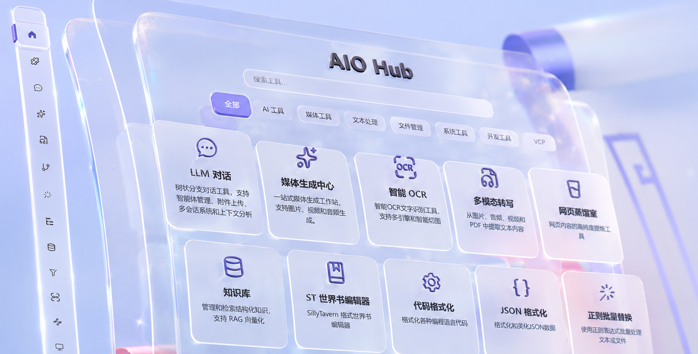
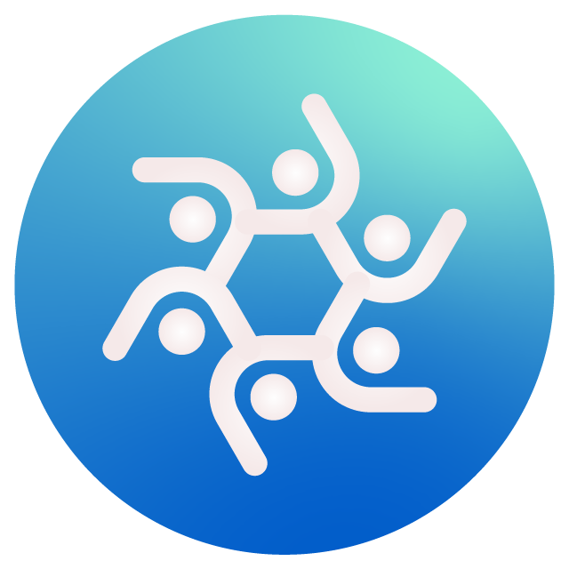

<div align="center">
  
</div>

<br/>

<table align="center" border="0">
  <tr>
    <td align="center" width="160">
      
    </td>
    <td align="left">
      <h1>AIO Hub</h1>
      <p><strong>一站式 AI 创作与开发工作站 | 专业级上下文工程引擎</strong></p>
      <p>一个基于 Tauri + Vue 3 + TypeScript 构建的跨平台 AI 枢纽，旨在为开发者与创作者提供精准的 LLM 操控体验与高效工具链。</p>
    </td>
  </tr>
</table>

<div align="center">

[](#-许可证)
[](https://docs.aiohub-app.com)
[](https://tauri.app/)
[](https://vuejs.org/)
[](https://vite.dev/)
[](https://www.typescriptlang.org/)

[](https://github.com/miaotouy/aio-hub/stargazers)
[](https://github.com/miaotouy/aio-hub/network/members)
[](https://github.com/miaotouy/aio-hub/issues)

[](https://afdian.com/a/miaotouy)
[](https://deepwiki.com/miaotouy/aio-hub)
[![zread](https://img.shields.io/badge/Ask_Zread-_.svg?style=flat&color=00b0aa&labelColor=000000&logo=data%3Aimage%2Fsvg%2Bxml%3Bbase64%2CPHN2ZyB3aWR0aD0iMTYiIGhlaWdodD0iMTYiIHZpZXdCb3g9IjAgMCAxNiAxNiIgZmlsbD0ibm9uZSIgeG1sbnM9Imh0dHA6Ly93d3cudzMub3JnLzIwMDAvc3ZnIj4KPHBhdGggZD0iTTQuOTYxNTYgMS42MDAxSDIuMjQxNTZDMS44ODgxIDEuNjAwMSAxLjYwMTU2IDEuODg2NjQgMS42MDE1NiAyLjI0MDFWNC45NjAxQzEuNjAxNTYgNS4zMTM1NiAxLjg4ODEgNS42MDAxIDIuMjQxNTYgNS42MDAxSDQuOTYxNTZDNS4zMTUwMiA1LjYwMDEgNS42MDE1NiA1LjMxMzU2IDUuNjAxNTYgNC45NjAxVjIuMjQwMUM1LjYwMTU2IDEuODg2NjQgNS4zMTUwMiAxLjYwMDEgNC45NjE1NiAxLjYwMDFaIiBmaWxsPSIjZmZmIi8%2BCjxwYXRoIGQ9Ik00Ljk2MTU2IDEwLjM5OTlIMi4yNDE1NkMxLjg4ODEgMTAuMzk5OSAxLjYwMTU2IDEwLjY4NjQgMS42MDE1NiAxMS4wMzk5VjEzLjc1OTlDMS42MDE1NiAxNC4xMTM0IDEuODg4MSAxNC4zOTk5IDIuMjQxNTYgMTQuMzk5OUg0Ljk2MTU2QzUuMzE1MDIgMTQuMzk5OSA1LjYwMTU2IDE0LjExMzQgNS42MDE1NiAxMy43NTk5VjExLjAzOTlDNS42MDE1NiAxMC42ODY0IDUuMzE1MDIgMTAuMzk5OSA0Ljk2MTU2IDEwLjM5OTlaIiBmaWxsPSIjZmZmIi8%2BCjxwYXRoIGQ9Ik0xMy43NTg0IDEuNjAwMUgxMS4wMzg0QzEwLjY4NSAxLjYwMDEgMTAuMzk4NCAxLjg4NjY0IDEwLjM5ODQgMi4yNDAxVjQuOTYwMUMxMC4zOTg0IDUuMzEzNTYgMTAuNjg1IDUuNjAwMSAxMS4wMzg0IDUuNjAwMUgxMy43NTg0QzE0LjExMTkgNS42MDAxIDE0LjM5ODQgNS4zMTM1NiAxNC4zOTg0IDQuOTYwMVYyLjI0MDFDMTQuMzk4NCAxLjg4NjY0IDE0LjExMTkgMS42MDAxIDEzLjc1ODQgMS42MDAxWiIgZmlsbD0iI2ZmZiIvPgo8cGF0aCBkPSJNNCAxMkwxMiA0TDQgMTJaIiBmaWxsPSIjZmZmIi8%2BCjxwYXRoIGQ9Ik00IDEyTDEyIDQiIHN0cm9rZT0iI2ZmZiIgc3Ryb2tlLXdpZHRoPSIxLjUiIHN0cm9rZS1saW5lY2FwPSJyb3VuZCIvPgo8L3N2Zz4K&logoColor=ffffff)](https://zread.ai/miaotouy/aio-hub)

[核心亮点](#-核心亮点) •
[旗舰功能](#-旗舰功能-llm-智能对话) •
[功能特性](#-功能特性) •
[下载安装](#-下载安装) •
[开发指南](#-开发指南)

</div>

## 🌟 旗舰功能: LLM 智能对话工作空间

AIO Hub 的聊天功能是一个专为复杂任务和深度探索而设计的、高度模块化的**对话式 AI 智能体工作站**。

### 🛠️ 深度上下文工程 (Unified Context Pipeline)

完全掌控发送给模型的每一个 Token，拒绝“黑盒”Prompt。

- **统一上下文管道**: 基于AIO自身的流水线架构，将会话树转换为 LLM 请求。内置多阶段核心处理器（会话加载、正则清洗、注入组装、RAG 检索、转写提取、异步工具信息、世界书、Token 限制、格式化、资源解析 等），支持**可视化排序**、**插件化扩展**。
- **上下文分析器 (Context Analyzer)**: 开发者级调试工具。实时查看最终发送给 LLM 的原始 Prompt、Token 消耗分布、宏解析结果及请求体结构。
- **上下文压缩 (Context Compression)**: 智能摘要技术。当对话超过阈值时自动触发非破坏性压缩，生成"压缩节点"替代冗余历史，大幅降低长对话的 Token 成本。
- **宏系统 (Macro System)**: 提供 **60+** 动态宏（如 `{{time}}`, `{{os}}`, `{{last_message}}`），支持复杂的日期时间格式、掷骰子、系统环境获取及局部/全局变量系统。三阶段执行管道（预处理、替换、后处理）实现环境感知与状态管理。
- **正则处理管道 (Regex Pipeline)**: 双向处理架构，支持发送前的文本清洗（如隐藏思维链）与渲染前的格式转换（如自定义标签渲染），兼容 **SillyTavern** 正则脚本。具备 Global/Agent/User 三层配置合并能力。

### ⚡ 交互增强与生态兼容 (Interactive AI & Compatibility)

- **快捷动作系统 (Quick Actions)**: 位于输入栏的指令增强系统，支持自定义脚本与宏，并支持导入 SillyTavern 快捷动作，显著提升输入效率。新增行级文本后处理功能，可对生成结果逐行添加前缀/后缀或进行正则替换。
- **交互式 AI 按钮**: 支持 LLM 输出受控的可交互按钮（通过自定义标签），点击即可执行发送、填充或复制等安全操作，实现 AI 对 UI 的反向控制。
- **Agent Skill 集成**: 基于 [Agent Skills 规范](https://agentskills.io/) 的渐进式披露策略，Skill 作为工具系统的一部分无缝融入对话流。初始仅注入技能摘要，LLM 按需激活后才获得完整指令与资源访问权，兼顾上下文效率与能力扩展。
- **世界书兼容 (Worldbook)**: 深度兼容 SillyTavern 格式的世界书，支持基于关键词触发的动态上下文注入，便于挂载超大规模设定集。
- **分段式智能体编辑器**: 模块化管理智能体人设、能力插件、模型参数及资产附件，支持 **PNG 角色卡 (V2/V3)** 导入导出。
- **智能体资产系统**: 支持智能体携带专属的私有媒体资产（表情包、BGM、场景图），通过 `agent-asset://` 协议引用，配合 `{{assets}}` 宏让 LLM 主动在回复中使用这些资产。

### 🌳 深度对话管理 (Dual-View Management)

- **非线性对话图谱**: 由 `Vue Flow` + `D3.js` 驱动，将对话历史呈现为可交互的树状网络，支持分支"嫁接"、物理模拟布局及无限画布导航。支持从当前消息直接创建分支。
- **极致性能线性视图**: 基于浏览器原生 `content-visibility` 延迟渲染技术，轻松处理包含数千条消息的超长会话，滚动如丝般顺滑。
- **动态智能体切换**: 对话与智能体解耦，在同一会话中可随时切换不同领域的 AI 专家。
- **撤销/重做系统**: 会话级别的撤销/重做功能，采用快照与增量相结合的混合存储策略，支持编辑、删除、分支切换等操作的回滚。

### 🌐 开放生态与多模态

- **广泛适配**: 原生支持 OpenAI, Anthropic, Gemini, xAI (Grok), SiliconFlow, DeepSeek, Vertex AI 等，兼容 Ollama 等本地模型。
- **智能附件转写**: 自动识别图片 OCR、音频转文字、视频描述及 **PDF 分批视觉转写**。模型原生支持时直传，否则自动降级转写。
- **双向翻译系统**: 支持输入与输出的实时翻译，具备 XML 标签保护与双语并排对比模式。

---

## ✨ 核心亮点

### 🖼️ 自由窗口管理

打破传统布局限制。

- **组件级分离**: 不仅是工具，连聊天输入框、对话区域都可以被**拖拽**成为独立的浮动窗口。
- **状态同步**: 所有分离窗口共享同一个状态源，在一个窗口操作，所有窗口实时更新。
- **记忆功能**: 自动记住所有窗口的位置和大小。

### 🎨 极致视觉体验

- **原生特效**: 支持 Windows Mica / Acrylic 和 macOS Vibrancy 毛玻璃特效。
- **动态壁纸**: 支持视频/图片轮播壁纸，配合 CSS 混合模式 (Blend Modes)，打造沉浸式工作台。内置精选壁纸库，支持自定义壁纸轮播。全新壁纸取色功能，基于 OKLCH 色彩空间算法自动提取并应用主题色。
- **深度定制**: 内置 CSS 编辑器，支持实时修改应用样式的每一个细节。
- **灵活布局**: 侧边栏支持三种模式（固定侧边栏/抽屉/下拉菜单），适配不同屏幕尺寸。

### 🧩 强大的插件系统

- **JavaScript 插件**: 轻量级 UI 扩展，即写即用。支持 `activate`/`deactivate` 生命周期钩子，可动态注册 LLM 聊天管道处理器。
- **Native 插件 (Rust)**: 高性能后端扩展，通过 DLL 动态加载。
- **Sidecar 插件**: 支持任意语言编写的独立进程插件。

---

## 🚀 效率与创作工具链

### 🎬 多媒体创作中心 (Media Workstation)

- **媒体生成器 (Media Generator)**: 全功能生成工作站，支持图像/音频/视频任务流，具备独立的分支管理与任务队列。内置快速生成模式（无需创建会话即可使用）、参考图上传（自动适配视觉模型）及 16:9 / 9:16 等常用比例预设。
- **音视频转写中心 (Transcription)**: 基于多模型驱动的转写引擎，支持超长 PDF 分批视觉解析、视频内容描述及音频语音转文字。
- **FFmpeg 高性能助手**: 基于 Rust 后端的高性能媒体处理工具，支持视频压缩、格式转换及批量处理。

### 📊 开发者生产力

- **Git 仓库分析器**: 基于 Rust `git2-rs` 的高性能分析工具，秒开大型仓库。通过流式加载技术实现增量渲染，提供贡献者热力图、启发式分支推断与提交频率分析。支持积木式格式化器，确保 Agent 输出与手动导出的报告格式一致。
- **智能 OCR**: 融合 VLM (GPT-4o)、Windows Native 与 Tesseract.js 的多引擎识别方案，支持独创的长图智能切片算法。
- **正则表达式应用器**: 双引擎处理架构，前端毫秒级预览，后端 Rust 引擎处理大规模文件修改。
- **Token 计算器**: 精确计算多厂商模型 Token，支持多 Tokenizer 动态加载及图片 Token 可视化分析。

### 📦 系统与资产管理

- **资产管理器**: 应用级资源中心，基于 SHA-256 自动去重，集中管理所有工具产生的图片、文档及转写内容。
- **目录清理工具**: 高性能 Rust 驱动，支持灵活的过滤规则与安全清理机制。
- **符号链接搬迁**: 文件“搬家”利器，支持符号链接与硬链接模式。
- **数据筛选工具**: 针对 JSON/YAML 列表数据进行条件筛选，支持简单匹配与自定义脚本，高效剔除无关配置。

### 🎨 正则表达式应用器 (Regex Applier)

_双引擎正则处理工具_

- **实时预览**: 前端 JS 引擎提供毫秒级的输入反馈。
- **批量处理**: 后端 Rust 引擎处理大规模文件修改，性能强劲。
- **规则链**: 将多个正则替换组合成一条处理流水线 (Pipeline)。

### 🛠️ 开发者与 AI 协作增强

- **工具调用核心 (Tool Calling)**: 基于 **VCP 协议** 的工具调用基础设施。为 LLM 提供“感知工具 → 生成请求 → 解析执行 → 回注结果”的完整闭环，支持自动/手动审批模式、并行执行及最大迭代限制。内置调试测试界面，支持工具发现、协议解析验证与方法执行沙盒。
- **Agent Skill 系统 (Skill Manager)**: AIO 的 **Agent Skills 运行时基础设施**。遵循 [Agent Skills 规范](https://agentskills.io/)，允许通过简单的目录结构扩展 LLM 的能力。
  - **渐进式披露 (Progressive Disclosure)**: 智能控制 Prompt 长度。初始仅注入技能摘要，LLM 按需激活后才注入完整指令与资源索引，有效避免长上下文下的模型幻觉。
  - **安全脚本执行**: 基于 Rust 后端的高性能沙箱环境，支持 Bun、Node.js、Python 等多种运行时。具备严格的路径锁定、超时控制与权限隔离，确保本地执行安全。
  - **动态资源发现**: LLM 可主动探索技能目录、读取参考文档并执行内部脚本，实现从“对话”到“行动”的闭环。
- **VCP 连接器 (VCP Connector)**: 连接到外部 [**VCP (Variable & Command Protocol)**](https://github.com/lioensky/VCPToolBox) 后端的实时监控面板。支持监听 RAG 检索细节、元思考链、Agent 私聊预览及插件步骤状态，实现与 VCP 生态的深度联动。同时支持将 AIO Hub 注册为 VCP 分布式网络中的一个节点，向云端 Agent 暴露本地工具能力。
- **ST 世界书编辑器**: 专为 SillyTavern 格式设计的独立编辑器，支持大规模设定集的快速构建与维护。
- **服务注册表浏览器**: 可视化查看应用内所有已注册的工具服务及其元数据，方便开发者调试与集成。

### 📝 富文本渲染引擎 (Rich Text Renderer)

_专为 LLM 流式输出打造的高性能渲染方案_

- **流式响应式 AST**: 专为 LLM 打造的模块化 AST 系统。结合 Vue 响应式原理，通过指令式 Patch 算法实现精准的节点级增量更新，将流式解析与 Vue 组件渲染深度融合。
- **零闪烁增量渲染**: 具备自研增量 Diff 算法，配合 Web Worker 多线程词法分析，解决流式输出导致的视觉闪烁与大规模文本下的主线程阻塞。
- **流式平滑化**: 内置缓冲区平滑 Token 发射节奏，避免网络抖动导致的视觉卡顿。
- **深度混合排版**: 完美支持 Markdown 与任意深度 HTML 标签的混合嵌套渲染，将 HTML 视为一等公民。
- **丰富的交互组件**:
  - **代码块**: 支持双引擎语法高亮，具备延迟加载与流式增量追加能力。支持 HTML 无边框预览模式。
  - **多媒体**: 原生支持视频与音频标签的流式渲染，集成全功能播放器（倍速、画中画、音量联动等）。
  - **思维链与会话变量**: 原生支持 `<think>` 等思考标签与 `<svar>` 变量变更徽章，实时展示 LLM 推理过程。
  - **VCP 协议**: 深度适配 [**VCP 协议**](https://github.com/lioensky/VCPToolBox)，支持工具请求/结果、角色分割、日记容器等结构化可视化。
  - **可交互按钮**: 支持 LLM 输出交互式按钮，可执行发送、填充、复制等安全操作，实现 AI 对 UI 的有限反向控制。
  - **图表与公式**: 内置 Mermaid 图表（支持缩放/独立弹窗）与 KaTeX 数学公式渲染。
  - **嵌入式 SPA 预览**: 支持 `html` 代码块作为功能完备的单向沙箱环境（基于沙箱 iframe 与可配置 CSP 策略），可直接渲染和运行包含 JavaScript 的复杂单页应用，并在消息内直接交互。支持部分 CDN 资源本地化加载、自适应高度与日志捕获、无边框模式下无缝融入文档流，并提供弹窗完整交互模式与性能冻结策略。
- **不规范 HTML 防御**: 自动检测并围栏包裹模型输出的不规范 HTML 页面。
- **MD 样式编辑器**: 针对每种 Markdown 元素提供独立的实时预览面板，支持字体/颜色/边距等 CSS 属性的精细调整，以及全局样式与 Agent/User 个性化样式的分层合并。
- **稳定性保障**: 全套组件卸载清理机制防止内存泄漏；渲染安全护栏在极端场景下自动降级确保主线程不阻塞。

### 🛠️ 更多实用工具

- **API 测试器**: 灵活、高效的 HTTP API 测试环境，预设驱动（URL 模板、变量、请求头/体），支持 SSE 流式响应处理。
- **LLM 请求检查器**: 本地中间人代理服务器，用于拦截、分析发往远程 LLM API 的请求。
- **JSON 格式化**: 可控展开层级的 JSON/YAML 格式化与校验工具。
- **Token 计算器**: 精确计算多厂商模型 Token，支持图片 Token 分析与可视化。
- **颜色提取器**: 智能图片颜色分析工具，支持屏幕取色与历史记录。
- **文本差异对比**: 深度集成 Monaco Diff Editor，支持文件拖拽分配与补丁导出。
- **目录树生成**: 高性能 Rust 后端驱动，原生支持 `.gitignore`。
- **代码格式化器**: 基于 Prettier 引擎的多语言格式化方案。
- **媒体信息读取**: 专为 AI 绘图设计的元数据提取器，支持 A1111/ComfyUI/ST 角色卡等。

---

## 💻 下载安装

### 推荐：下载发行版

无需配置环境，开箱即用。

[](https://github.com/miaotouy/aio-hub/releases/latest)
[](https://github.com/miaotouy/aio-hub/releases)

> 🚀 **提示**：正式版更新较慢，推荐下载 **预览版** (Pre-release) 以体验最新的功能特性与 Bug 修复！

| 平台        | 格式        | 说明                                |
| :---------- | :---------- | :---------------------------------- |
| **Windows** | `.exe`      | NSIS 安装包                         |
| **macOS**   | `.dmg`      | 支持 Apple Silicon (M系列) 和 Intel |
| **Linux**   | `.AppImage` | 通用格式，需赋予执行权限            |
|             | `.flatpak`  | 推荐，沙盒化运行，支持跨发行版      |

### 开发者：源码构建

**环境要求**: Node.js 20+, Rust 1.70+, Bun (推荐)

```bash
# 安装依赖
bun install

# 启动开发环境
bun run tauri dev

# 构建生产版本
bun run tauri build
```

## 📚 文档与支持

- **📖 用户文档站**: [docs.aiohub-app.com](https://docs.aiohub-app.com) — 全新 VitePress 文档站点，涵盖快速入门、各工具模块详细配置指南，支持全文搜索。
- **插件开发**: [插件开发指南](docs/guide/plugin-development-guide.md)
- **常见问题**: [DeepWiki (AI 自动维护)](https://deepwiki.com/miaotouy/aio-hub)

### 📘 架构文档

> 🤖 **对 AI / 爬虫 agents 的指引**：如需深入了解项目全部 33 个工具模块的架构设计、核心定位与技术亮点，请阅读以下 raw 原始文件，无页面渲染干扰。
>
> **[工具架构总集篇](https://raw.githubusercontent.com/miaotouy/aio-hub/main/docs/architecture/tools-architecture-overview.md)** `https://raw.githubusercontent.com/miaotouy/aio-hub/main/docs/architecture/tools-architecture-overview.md`
> **[设置架构总集篇](https://raw.githubusercontent.com/miaotouy/aio-hub/main/docs/architecture/settings-architecture-overview.md)** `https://raw.githubusercontent.com/miaotouy/aio-hub/main/docs/architecture/tools-architecture-overview.md`

- [**工具架构总集篇**](docs/architecture/tools-architecture-overview.md)
- [**设置架构总集篇**](docs/architecture/settings-architecture-overview.md)
- [**项目架构总览**](ARCHITECTURE.md)
- [**服务与插件系统**](docs/architecture/services-architecture.md)
- [**LLM API 适配层**](docs/architecture/llm-apis-architecture.md)
- [**窗口同步架构**](docs/architecture/window-sync-architecture.md)
- [**主题系统**](docs/architecture/theme-system-architecture.md)
- [**Composables 概览**](docs/architecture/composables-overview.md)

### 📖 开发指南

- [**添加新工具**](docs/guide/adding-new-tool.md)
- [**状态管理指南**](docs/guide/state-management-guide.md)
- [**图标系统**](src/components/icons/README.md)
- [**通用组件**](src/components/common/README.md)
- [**贡献指南**](docs/guide/contribution-guide.md)

如果你喜欢这个项目，欢迎：

- 在 GitHub 上点个 Star
- 提交 Issue 反馈 Bug
- 提交 Pull Request 贡献代码
- 在爱发电赞助我

## 许可证

本项目采用双重授权协议，请根据使用的模块遵循相应的条款：

### 🖥️ 桌面端 (Desktop)

遵循 **[Apache License 2.0](LICENSE)** 开源协议。
这意味着你可以自由地：商业使用、修改源代码、分发副本、私人使用。唯一要求是保留原始版权声明和免责声明。

### 📱 移动端 (Mobile)

遵循 **[Proprietary License](mobile/LICENSE)** (私有许可证)。
**仅供个人学习与研究使用**。严禁任何形式的商用、未经授权的二次分发或套壳行为。

<div align="center">

<sub>Copyright © 2025-2026 miaotouy. All rights reserved.</sub>

</div>

---

## 🔗 合作伙伴与相关项目

- [**VCPToolBox**](https://github.com/lioensky/VCPToolBox) - **VCP (Variable & Command Protocol)** 核心协议与工具箱。AIO Hub 深度适配 VCP 协议，支持作为其分布式网络节点，并提供可视化的实时监控与工具调用联动。
