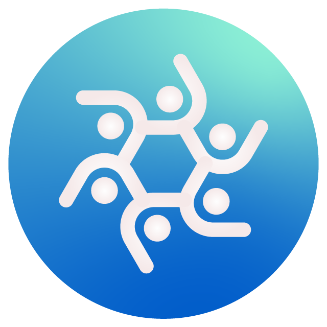

<div align="center">



# AIO Hub

**一站式桌面AI工具枢纽 | 开发者的效率利器**

一个基于 Tauri + Vue 3 + TypeScript 开发的桌面端枢纽应用，提供多种实用的开发和日常工具。


[](LICENSE)
[](https://tauri.app/)
[](https://vuejs.org/)
[](https://www.typescriptlang.org/)

[](https://github.com/miaotouy/aio-hub/stargazers)
[](https://github.com/miaotouy/aio-hub/network/members)
[](https://github.com/miaotouy/aio-hub/issues)

[](https://afdian.com/a/miaotouy)

[✨ 功能特性](#-功能特性) •
[🚀 快速开始](#-快速开始) •
[📖 文档](#-开发指南) •
[💖 支持项目](#-支持项目) •
[📄 许可证](#-许可证)

---

</div>

## ✨ 功能特性

### 🎨 系统核心功能

#### 窗口管理

- 🖥️ **多窗口支持** - 工具可拖拽分离为独立浮动窗口，支持多任务布局。
- ✨ **组件级分离** - 核心组件（如对话区域）可被**拖拽出**主窗口，成为独立的、可自由操作的浮动窗口，实现极致的布局自由。
- 🔗 **跨窗口状态同步** - 先进的多窗口同步架构，确保主窗口与所有分离窗口之间的状态实时同步，操作无缝衔接。
- 📌 **窗口状态记忆** - 自动记忆并恢复所有窗口的位置与大小。
- 🧲 **边缘吸附** - 防止窗口拖出屏幕，可选禁用。

#### 设置中心

- ⚙️ **配置管理** - 支持导入/导出所有配置，可直接打开配置目录。
- 🎨 **主题定制** - 亮色/暗色/跟随系统，自定义主题色和强调色。
- 💅 **全局样式覆盖** - 内置强大的 CSS 编辑器，允许用户编写自定义 CSS 来深度定制应用外观。支持多种预设主题和个人预设保存，并可在 Monaco / CodeMirror 编辑器间切换。
- 🔀 **工具导航排序** - 在设置中自由拖拽排序，定制侧边栏工具的显示顺序。
- 🔧 **工具模块管理** - 选择性显示或隐藏工具。
- 📋 **系统托盘** - 最小化到托盘而非直接退出。

### 🔌 插件系统

- 📦 **JavaScript 插件支持** - 轻量级的前端插件，实现自定义功能扩展
- 🔥 **开发模式热重载** - 开发插件时支持 TypeScript 和 HMR，即改即用
- 🎯 **统一服务接口** - 插件与内置服务使用相同的调用方式，无缝集成
- 🛡️ **类型安全** - 完整的 TypeScript 支持，确保插件开发的类型安全
- 🔧 **灵活部署** - 开发模式从源码加载，生产模式从安装目录加载
- 📚 **完整文档** - 提供详细的[插件开发指南](docs/plugin-development-guide.md)和示例插件

详细信息请查看：
- [插件系统设计文档](docs/plugin-system-design.md)
- [插件开发指南](docs/plugin-development-guide.md)

### UI 与交互

- 🎯 **自定义标题栏** - 统一的视觉风格和窗口控制。
- 🖼️ **全局图片查看器** - 内置基于 Viewer.js 的高性能图片查看器，支持所有工具内图片预览。
- 📂 **可收缩侧边栏** - 灵活的工具导航。
- 🏠 **仪表盘主页** - 卡片网格展示所有工具。
- 🎪 **文件拖放** - 多数工具支持拖放文件处理。
- ⌨️ **全局快捷键** - 快速显示/隐藏主窗口。
- 📝 **统一日志系统** - 清晰的错误提示和日志记录。

### 🛠️ 内置工具

#### Git 仓库分析器

- 📊 **可视化分析** - 提交频率图、贡献者分布、提交热力图
- 🔍 **智能筛选** - 按信息/作者/日期搜索，滑块选择提交范围
- 📄 **多格式导出** - 支持 Markdown、JSON、CSV、HTML、纯文本

#### 正则表达式应用器

- 🔄 **批量处理** - 对文本或多文件进行链式正则替换
- 📦 **预设管理系统** - 创建、保存、切换规则集，支持拖拽排序
- ⚡ **语法糖** - 支持 `/模式/标志` 语法，快速定义正则标志
- 📊 **处理日志** - 显示匹配次数、耗时统计

#### 智能 OCR 文字识别

- 🤖 **多引擎支持** - Tesseract.js 本地离线、Windows 原生、VLM 模型、云端服务
- ✂️ **智能切图** - 自动检测空白区域，切割长图提高识别率
- 🎯 **交互式处理** - 可视化展示切割过程，支持单块重试

#### LLM / AI 模型工具集

- 🔌 **服务配置中心** - 集中管理 API 配置，支持主流服务商预设模板
- 🎨 **模型图标管理** - 内置数百个模型图标，支持自定义匹配规则和分组
- 🔍 **代理监听器** - 拦截查看 AI 客户端与 API 之间的通信，支持流式响应

#### API 测试器

- 🌐 **全功能 HTTP 客户端** - 支持各类请求方法、Header、Body
- 🔑 **变量系统** - 管理动态参数
- 📱 **AI API 预设** - 内置 OpenAI、Gemini、Claude 等模板
- 📡 **流式响应** - 实时处理 SSE 响应

#### LLM 对话

- 🌳 **树形对话历史** - 革命性的非线性对话管理。每次重新生成都会创建新的**分支**，而不是覆盖，所有历史记录构成一棵可追溯的对话树。
- 🧭 **分支导航** - 可在同一提示产生的多个不同回答之间自由切换和比较，探索对话的无限可能性。
- ✍️ **消息编辑与控制** - 支持随时编辑已发送的用户或助手消息，或暂时禁用对话树中的任一节点，灵活构建和调整上下文。
- 🤖 **高级智能体系统** - 智能体配置从单一提示词升级为“预设消息序列”，支持创建更复杂的角色扮演和对话开场。支持自定义图标和从预设模板创建。
- 💾 **安全持久化** - 所有会话和智能体数据均以独立文件形式安全存储在本地，稳定可靠且无容量限制。
- 🚀 **组件窗口分离** - 可将对话区域或输入框拖拽为独立的浮动窗口，实现边聊边工作的多任务场景。

#### 其他实用工具

- 🧹 **目录清理器** - 按名称、大小、时间、深度等条件筛选并清理文件
- 🔗 **符号链接移动** - 批量移动文件并创建链接，支持"仅创建链接"模式
- 🌲 **目录树生成** - 支持 `.gitignore` 规则和 glob 过滤
- 📝 **文本/JSON 对比** - Monaco Editor 驱动，支持语法高亮和 patch 导出
- ✨ **代码格式化** - 基于 Prettier，支持多语言
- 🖼️ **AI 图片元信息** - 读取 SD WebUI、ComfyUI 等生成的图片元数据

## 🚀 快速开始

### 📋 环境要求

| 工具 | 最低版本 | 推荐版本 |
|------|---------|---------|
| Node.js | 20.x | 最新 LTS |
| Rust | 1.70+ | 最新稳定版 |
| 包管理器 | - | Bun (推荐) |

### 📦 安装依赖

```bash
# 使用 Bun (推荐)
bun install

# 或使用 npm
npm install
```

### 🔨 开发模式

```bash
# 启动开发服务器
bun run tauri dev

# 或
npm run tauri dev
```

### 📦 构建应用

```bash
# 构建生产版本
bun run tauri build

# 或
npm run tauri build
```

> **💡 提示**：首次构建可能需要较长时间来下载 Rust 依赖，请耐心等待。

## 📁 项目结构

```
aio-hub/
├── docs/                    # 项目文档
├── public/                  # 静态资源
│   ├── model-icons/        # AI 模型图标库（130+ 图标）
│   ├── ocr-icons/          # OCR 服务商图标
│   └── tesseract-lang/     # Tesseract.js 语言包
├── src/                     # 前端源代码
│   ├── components/         # 公共组件（标题栏、图标等）
│   ├── composables/        # 组合式函数（主题、配置、窗口管理等）
│   ├── config/             # 配置定义（LLM/OCR 服务商、模型元数据等）
│   ├── llm-apis/           # LLM API 适配器
│   ├── router/             # 路由配置
│   ├── styles/             # 样式文件
│   ├── tools/              # 工具模块
│   │   ├── api-tester/    # API 测试器
│   │   ├── directory-janitor/ # 目录清理器
│   │   ├── directory-tree/ # 目录树生成器
│   │   ├── git-analyzer/   # Git 仓库分析器
│   │   ├── llm-chat/       # LLM 对话工具
│   │   ├── llm-proxy/      # LLM 代理监听器
│   │   ├── regex-applier/  # 正则表达式应用器
│   │   ├── smart-ocr/      # 智能 OCR 识别
│   │   └── ...             # 其他工具（代码格式化、文本对比等）
│   ├── types/              # TypeScript 类型定义
│   ├── utils/              # 工具函数（日志、错误处理、配置管理等）
│   └── views/              # 视图页面
├── src-tauri/              # Tauri 后端
│   ├── src/
│   │   ├── commands/      # Tauri 命令模块
│   │   └── ...            # 其他后端模块
│   └── tauri.conf.json   # Tauri 配置
└── 配置文件                # package.json, tsconfig.json, vite.config.ts 等
```

## 🔧 技术栈

<table>
<tr>
<td align="center" width="50%">

### 前端技术

- 🎨 **框架**: Vue 3 + TypeScript
- ⚡ **构建**: Vite
- 🎨 **样式**: CSS Variables
- 💾 **状态**: Composition API + Pinia
- 🖼️ **UI**: Element Plus + Naive UI

</td>
<td align="center" width="50%">

### 后端 & 工具

- 🦀 **桌面**: Tauri 2.0
- 📝 **编辑器**: Monaco / CodeMirror
- 📊 **图表**: ECharts
- 🎯 **工具**: Prettier, Tesseract.js
- 🔧 **包管理**: Bun (推荐)

</td>
</tr>
</table>

## 🎯 开发指南

### 添加新工具

1. 在 `src/tools/` 目录下创建新的工具文件夹
2. 实现工具组件（参考现有工具的结构）
3. 在 `src/config/tools.ts` 中注册新工具
4. 在 `src/router/index.ts` 中添加路由
5. （可选）在 `src-tauri/src/commands/` 中添加后端命令

### 工具配置管理

每个工具都可以使用 `configManager` 来管理配置：

```typescript
import { useToolConfig } from "@/utils/configManager";

const { config, saveConfig, resetConfig } = useToolConfig("tool-name", {
  // 默认配置
});
```


## 📝 开发规范

- 使用 TypeScript 进行类型约束
- 组件使用 `<script setup>` 语法
- 遵循 Vue 3 Composition API 最佳实践
- 工具配置使用统一的配置管理器
- 注释使用中文

## 💖 支持项目

<div align="center">

如果这个项目对你有帮助，欢迎通过以下方式支持：

[](https://github.com/miaotouy/aio-hub)
[](https://afdian.com/a/miaotouy)
[](https://github.com/miaotouy/aio-hub/issues)
[](https://github.com/miaotouy/aio-hub/pulls)

</div>

### 🌟 为什么需要你的支持？

<table>
<tr>
<td width="25%" align="center">
<b>完全免费</b><br>
无任何隐藏费用
</td>
<td width="25%" align="center">
<b>全职投入</b><br>
作者全力开发
</td>
<td width="25%" align="center">
<b>持续更新</b><br>
不断添加新功能
</td>
<td width="25%" align="center">
<b>社区驱动</b><br>
听取用户反馈
</td>
</tr>
</table>

你的赞助将帮助：
- 🚀 持续添加新功能和工具
- 🐛 及时修复问题和优化性能
- 📚 完善文档和使用教程
- 💡 探索更多创新想法

## 🤝 贡献指南

<div align="center">

**欢迎任何形式的贡献！**

</div>

### 📝 贡献流程

```bash
# 1. Fork 本仓库并克隆到本地
git clone https://github.com/YOUR_USERNAME/aio-hub.git

# 2. 创建特性分支
git checkout -b feature/AmazingFeature

# 3. 提交更改
git commit -m '✨ Add some AmazingFeature'

# 4. 推送到分支
git push origin feature/AmazingFeature

# 5. 开启 Pull Request
```

### 💡 贡献建议

- 🐛 **Bug 修复**: 详细描述问题和复现步骤
- ✨ **新功能**: 先开 Issue 讨论可行性
- 📝 **文档**: 帮助完善使用文档和注释
- 🌍 **国际化**: 支持更多语言

## 📄 许可证

<div align="center">

**本项目采用 [MIT License](LICENSE) 开源协议**

这意味着你可以自由地：

✅ 商业使用 | ✅ 修改源代码 | ✅ 分发副本 | ✅ 私人使用

**唯一要求**：在分发时保留原始的版权和许可声明

---

<sub>Made with ❤️ by <a href="https://github.com/miaotouy">@miaotouy</a></sub>

<sub>Copyright © 2025 miaotouy. All rights reserved.</sub>

</div>
