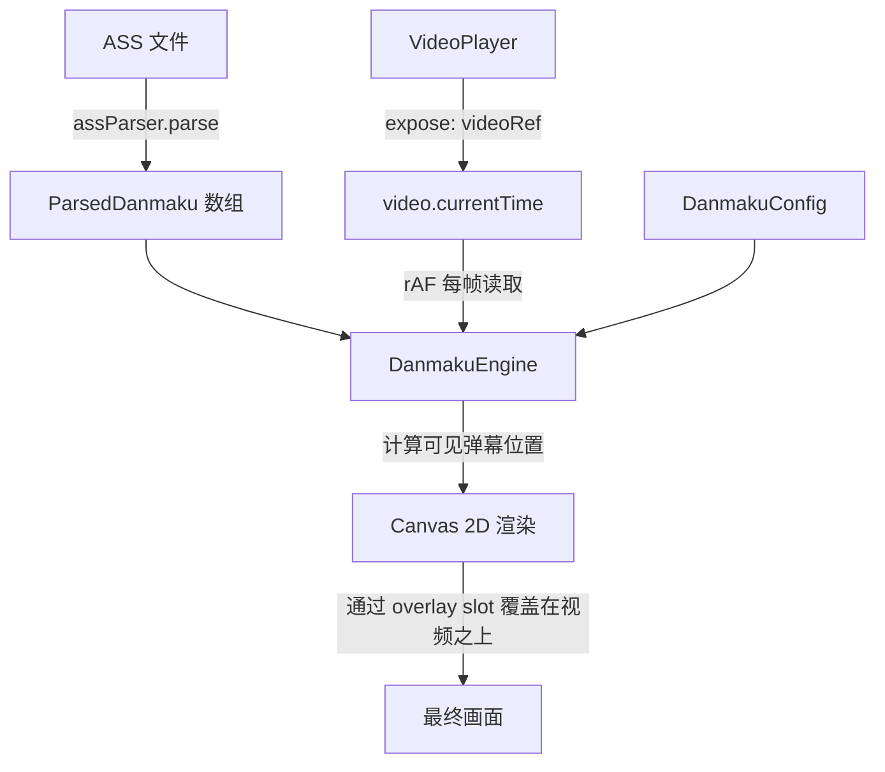

# 弹幕播放器开发计划 (第一期) - ASS 格式支持

**状态**: Implementing
**创建日期**: 2025-04-22
**审核日期**: 2025-04-22

---

## 1. 任务背景

姐姐需要一个支持 ASS 格式弹幕的播放器。弹幕来源是 Bilibili Evolved Danmaku Converter 生成的 ASS 文件，需要支持丰富的弹幕效果调整（显示区域、透明度、字号、速度、描边类型等）。

## 2. 调查报告

### 2.1 ASS 弹幕样本分析

通过分析 Bilibili Evolved 生成的 ASS 文件，发现其指令集**极其精简且高度规范化**：

| 指令                       | 含义                     | 示例                             |
| -------------------------- | ------------------------ | -------------------------------- |
| `\move(x1,y1,x2,y2,t1,t2)` | 滚动弹幕（从右到左移动） | `\move(1992,30,-156,30,0,15900)` |
| `\pos(x,y)`                | 固定弹幕（顶部/底部）    | `\pos(918,30)`                   |
| `\pos(0,-999)`             | 隐藏弹幕（防刷屏）       | 直接跳过渲染                     |
| `\c&HBBGGRR&`              | 弹幕颜色（BGR 格式）     | `\c&H7F02E2&`                    |

**关键参数**：

- **坐标系**: `PlayResX: 1836`, `PlayResY: 1032`（所有坐标基于此分辨率）
- **字体大小**: Small(36), Medium(52), Large(64), Larger(72), ExtraLarge(90)
- **字体**: 黑体（系统字体，ASS 不内嵌）
- **描边**: `Outline: 1.2`, `Shadow: 0`（原始设置无阴影，只有描边）
- **对齐**: `Alignment: 5`（numpad 式：水平居中 + 垂直居中），坐标 (x,y) 是文本**中心点**
- **粗体**: `Bold: 1`（所有样式默认粗体）
- **透明度**: Style 中 `PrimaryColour: &H29FFFFFF`，其中 `29` 是 alpha（ASS alpha 反向：`00`=不透明, `FF`=全透明）。`0x29 = 41`，不透明度 = `1 - 41/255 ≈ 0.84` 即 **84%**——与默认配置吻合
- **`ScaledBorderAndShadow: no`**：描边和阴影使用**固定像素大小**，不随 PlayRes 缩放
- **`Timer: 10.0000`**：此字段理论上影响播放速度，但弹幕时间轴已由 Dialogue 行的 Start/End 和 `\move` 参数完全确定，可**安全忽略**
- **弹幕时长**：滚动弹幕的显示时长 = `End - Start`（等于 `\move` 的 t2-t1）；固定弹幕显示 4 秒（`End - Start = 4s`）

**样本中的颜色分布**：

- 大量白色弹幕：`\c&HFFFFFF&` → `#FFFFFF`
- 彩色弹幕示例：`\c&H7F02E2&` → `#E2027F`（紫红）、`\c&H02F1FE&` → `#FEF102`（亮黄）
- "彩色弹幕过滤"的判定标准：颜色 ≠ `#FFFFFF` 即为彩色弹幕

### 2.2 技术方案选型

| 方案                            | 优点                                 | 缺点                                                                        | 结论        |
| ------------------------------- | ------------------------------------ | --------------------------------------------------------------------------- | ----------- |
| **JASSUB (libass WASM)**        | 100% ASS 兼容                        | 不支持速度调整、类型过滤、显示区域限制；WASM 体积大(~3MB)；需要配置字体文件 | ❌ **放弃** |
| **自研 ASS 解析 + Canvas 渲染** | 轻量、所有参数完全可控、弹幕专用优化 | 仅支持 Bilibili 弹幕的有限 ASS 指令                                         | ✅ **采用** |

**决定**：自写 ASS 弹幕解析器 + Canvas 2D 渲染。Bilibili Evolved 的 ASS 格式高度规范化，解析难度极低，且自研方案可以完美支持所有弹幕调整功能。

### 2.3 现有能力复用

| 现有资源                                                   | 用途                                    |
| ---------------------------------------------------------- | --------------------------------------- |
| [`VideoPlayer.vue`](src/components/common/VideoPlayer.vue) | 视频播放内核，**需改造**后复用控制条UI  |
| [`DropZone.vue`](src/components/common/DropZone.vue)       | 通用拖放组件，用于实现视频/弹幕文件选择 |
| [`ConfigManager`](src/utils/configManager.ts)              | 弹幕配置的持久化存储                    |
| [`ToolConfig`](src/services/types.ts) 注册模式             | 工具注册标准模板                        |
| [`DEFAULT_TOOLS_ORDER`](src/config/tools.ts)               | 侧边栏排序                              |

### 2.4 VideoPlayer 改造方案

**问题**：当前 [`VideoPlayer.vue`](src/components/common/VideoPlayer.vue) 未暴露 `videoRef`、播放状态等内部引用，也没有提供 slot 来注入弹幕覆盖层。

**方案**：对 VideoPlayer 进行最小化改造（方案 A），添加以下能力：

1. **`defineExpose`**：暴露 `videoRef`、`isPlaying`、`currentTime`、`duration`、`playerContainer` 等关键引用
2. **`<slot name="overlay" />`**：在视频元素与控制栏之间插入覆盖层插槽，用于注入 Canvas 弹幕层
3. **事件 emit（可选）**：暴露 `timeupdate`、`play`、`pause`、`seeked` 事件供外部监听

**改造影响评估**：这些改动仅为 **添加式改动**（不修改现有逻辑），不会影响 VideoPlayer 的其他使用方（如 VideoViewer）。

## 3. 架构设计

### 3.1 目录结构

```
src/tools/danmaku-player/
├── danmakuPlayer.registry.ts      # 工具注册
├── DanmakuPlayer.vue              # 主入口页面（含文件选择区域）
├── types.ts                        # 类型定义
├── components/
│   ├── DanmakuVideoPlayer.vue     # 视频+弹幕组合组件
│   ├── DanmakuCanvas.vue          # Canvas 弹幕渲染层
│   └── DanmakuSettingsPanel.vue   # 弹幕设置面板
├── composables/
│   ├── useDanmakuConfig.ts        # ConfigManager 配置管理
│   └── useDanmakuRenderer.ts      # Canvas 渲染引擎 Vue 封装
└── core/
    ├── assParser.ts               # ASS 解析纯函数
    └── danmakuEngine.ts           # 弹幕渲染引擎（纯逻辑）
```

> **注**：ASS 解析是一次性操作（读取 → 解析 → 返回数组），不需要 Vue 响应式封装，因此不设 `composables/useAssParser.ts`，由主组件直接调用 `core/assParser.ts`。

### 3.2 核心数据流



### 3.3 弹幕类型识别逻辑

```typescript
// 根据 ASS 指令判断弹幕类型（需先检测隐藏弹幕，因为它也包含 \pos）
if (tag includes '\pos(0,-999)') → 隐藏弹幕 (skip)
if (tag includes '\move') → 滚动弹幕 (scroll)
if (tag includes '\pos' && y < PlayResY/2) → 顶部固定弹幕 (top)
if (tag includes '\pos' && y >= PlayResY/2) → 底部固定弹幕 (bottom)
```

### 3.4 颜色解析

ASS 使用 BGR 格式 `\c&HBBGGRR&`，需要转换为 CSS 的 RGB。使用正则捕获组避免误删数据中的合法字符：

```typescript
function assBgrToRgb(color: string): string {
  // \c&H7F02E2& → #E2027F
  const match = color.match(/&H([0-9A-Fa-f]{2})([0-9A-Fa-f]{2})([0-9A-Fa-f]{2})&/);
  if (!match) return "#FFFFFF"; // fallback 白色
  return `#${match[3]}${match[2]}${match[1]}`;
}
```

### 3.5 速度倍率实现

`\move(x1,y1,x2,y2,t1,t2)` 中 `t1`/`t2` 是弹幕动画的绝对时间（毫秒）。速度调整通过**缩放动画持续时间**实现：

```typescript
// 原始持续时间
const originalDuration = t2 - t1; // 如 15900ms
// 调速后的持续时间（speed 越大，持续时间越短，弹幕飞得越快）
const adjustedDuration = originalDuration / config.speed;
```

这样 `speed: 2.0` 时弹幕飞行速度翻倍，`speed: 0.5` 时减速一半。

### 3.6 Canvas 尺寸策略

Canvas 弹幕层 **覆盖整个播放器容器**（包含黑边区域），与 VideoPlayer 的 `playerContainer` 尺寸保持一致。ASS 坐标系（PlayResX/PlayResY）到 Canvas 坐标系的缩放比例：

```typescript
const scaleX = canvas.width / playResX;
const scaleY = canvas.height / playResY;
```

### 3.8 文本对齐与锚点

由于 ASS 样式 `Alignment: 5`（居中对齐），`\move` 和 `\pos` 中的坐标均为文本 **中心点**。Canvas 渲染时需设置：

```typescript
ctx.textAlign = "center";
ctx.textBaseline = "middle";
// 此后 fillText(text, x, y) 中的 (x, y) 即为文本中心
```

### 3.9 描边尺寸策略

`ScaledBorderAndShadow: no` 表示描边使用固定像素（`Outline: 1.2`），不随分辨率缩放。因此描边宽度应保持 `1.2 * fontScale` 的相对关系，但**不乘以坐标缩放比例**。

### 3.7 渲染驱动机制

- **`requestAnimationFrame`** 驱动渲染循环（60fps 流畅度）
- 每帧从 `video.currentTime` 读取当前播放时间
- `video.play` / `video.pause` 事件控制 rAF 循环的启停
- `video.seeked` 触发弹幕位置重新计算（清除已过期弹幕缓存）

## 4. 配置项设计

基于姐姐提供的截图，使用 `ConfigManager` 持久化存储：

```typescript
interface DanmakuConfig {
  version: string;

  // 类型过滤
  showScroll: boolean; // 滚动弹幕
  showFixed: boolean; // 固定弹幕（顶部+底部）
  showColored: boolean; // 彩色弹幕

  // 显示调整
  displayArea: number; // 显示区域 0-100%
  opacity: number; // 不透明度 0-100%
  fontScale: number; // 字号缩放 50-200%
  speed: number; // 速度倍率 0.5-2.0

  // 防挡
  preventSubtitleOverlap: boolean; // 防挡字幕（底部留空）

  // 高级设置
  fontFamily: string; // 弹幕字体
  isBold: boolean; // 粗体
  borderType: "glow" | "outline" | "shadow"; // 描边类型，默认 shadow

  // 屏蔽词
  blockKeywords: string[]; // 屏蔽词列表
}
```

**默认值**：

- `borderType: 'shadow'`（姐姐偏好投影风格）
- `opacity: 84`（与 ASS 样本中 `&H29` alpha 值吻合）
- `fontScale: 100`
- `displayArea: 50`
- `speed: 1.0`
- `isBold: true`（ASS 样本中 `Bold: 1`）

## 5. 描边类型实现

| 类型             | CSS/Canvas 实现                                     | 效果                   |
| ---------------- | --------------------------------------------------- | ---------------------- |
| 重墨 (glow)      | `shadowBlur: 4, shadowColor: 同色` + 多次绘制       | 文字周围发光           |
| 描边 (outline)   | `strokeText()` + `fillText()`                       | 硬边缘描边             |
| 45°投影 (shadow) | `shadowOffsetX: 1, shadowOffsetY: 1, shadowBlur: 2` | 右下方柔和投影 ✅ 默认 |

## 6. 渲染引擎核心设计

```typescript
class DanmakuEngine {
  private canvas: HTMLCanvasElement;
  private ctx: CanvasRenderingContext2D;
  private danmakus: ParsedDanmaku[];
  private config: DanmakuConfig;
  private animationId: number;

  // 核心渲染循环（由 rAF 驱动）
  render(currentTime: number) {
    ctx.clearRect(0, 0, width, height);

    const visibleDanmakus = this.getVisibleDanmakus(currentTime);

    for (const dm of visibleDanmakus) {
      // 1. 应用类型过滤
      if (!this.shouldShow(dm)) continue;

      // 2. 计算当前位置（考虑速度倍率，缩放 move 持续时间）
      const pos = this.calculatePosition(dm, currentTime);

      // 3. 检查显示区域限制
      if (pos.y > this.maxDisplayY) continue;

      // 4. 应用样式（字号缩放、透明度、描边类型）
      this.applyStyle(dm);

      // 5. 绘制
      ctx.fillText(dm.text, pos.x, pos.y);
    }

    this.animationId = requestAnimationFrame(() => this.render(...));
  }
}
```

## 7. 错误处理

| 异常场景                       | 处理方式                                                           |
| ------------------------------ | ------------------------------------------------------------------ |
| ASS 文件解析失败（格式不匹配） | 使用 `errorHandler` 提示"弹幕文件格式不支持"，显示具体解析错误位置 |
| 视频文件加载失败               | 复用 VideoPlayer 内建的错误提示                                    |
| 弹幕文件编码问题（BOM / GBK）  | 解析前自动检测并剥离 UTF-8 BOM；GBK 场景暂不支持，提示用户转码     |
| Canvas 上下文获取失败          | 降级提示"浏览器不支持弹幕渲染"                                     |

## 8. 实施步骤

### 步骤 0: 改造 VideoPlayer（前置依赖）

- 为 [`VideoPlayer.vue`](src/components/common/VideoPlayer.vue) 添加 `defineExpose({ videoRef, isPlaying, currentTime, duration, playerContainer })`
- 在视频元素与控制栏之间添加 `<slot name="overlay" />`
- 添加 `defineEmits` 暴露 `timeupdate`、`play`、`pause`、`seeked` 事件
- **验证**：确认 VideoViewer 等现有使用方不受影响

### 步骤 1: 创建工具骨架

- 创建 `src/tools/danmaku-player/` 目录结构
- 注册工具到 `danmakuPlayer.registry.ts`
- 添加 `'/danmaku-player'` 到 [`DEFAULT_TOOLS_ORDER`](src/config/tools.ts)

### 步骤 2: ASS 解析器

- 实现 `core/assParser.ts`：解析 `[Script Info]`、`[V4+ Styles]`、`[Events]` 三个段
- 解析 `\move`、`\pos`、`\c` 指令（使用正则捕获组）
- BGR → RGB 颜色转换（使用 3.4 节修正后的实现）
- 时间戳解析 `H:MM:SS.CC`
- 自动检测并剥离 UTF-8 BOM

### 步骤 3: 配置管理

- 实现 `composables/useDanmakuConfig.ts`
- 使用 `ConfigManager` 持久化弹幕偏好
- 定义默认配置（投影描边、84% 透明度等）

### 步骤 4: Canvas 渲染引擎

- 实现 `core/danmakuEngine.ts`：弹幕位置计算（含速度倍率缩放）
- 实现 `composables/useDanmakuRenderer.ts`：Vue 响应式封装 + rAF 循环管理
- Canvas 覆盖整个播放器容器（含黑边）
- ASS 坐标系 → Canvas 坐标系线性缩放

### 步骤 5: UI 组件

- `DanmakuCanvas.vue`：Canvas 层，通过 `<slot name="overlay">` 注入 VideoPlayer
- `DanmakuVideoPlayer.vue`：组合 `VideoPlayer` + `DanmakuCanvas`，监听 expose 的 videoRef
- `DanmakuSettingsPanel.vue`：设置面板（参照截图）
- `DanmakuPlayer.vue`：主入口，含文件选择区域（使用 DropZone），组装所有组件

### 步骤 6: 视频同步

- 通过 `videoRef` (expose) 在 rAF 每帧读取 `video.currentTime`
- 监听 `video.play/pause` 事件 → 启停 rAF 渲染循环
- 监听 `video.seeked` → 清除弹幕位置缓存并重新计算
- 监听 `video.ratechange` → 可选同步弹幕速度
