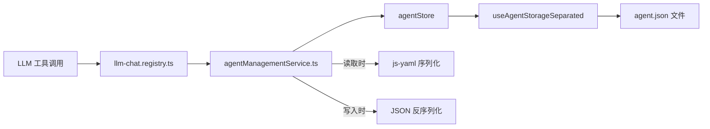

# Agent 管理工具方法设计方案

**状态**: Implementing  
**创建日期**: 2026-05-18  
**目标**: 为 `llm-chat` 工具注册 agentCallable 方法，使 LLM（特别是 agent-config-wizard）能通过工具调用管理智能体配置

---

## 1. 设计理念

### 核心原则：路径式操作

采用**字段路径（field path）**定位 + 值覆盖的方式操作配置，而非 YAML 文本的 search/replace。

**优势：**

- 不需要处理 YAML 缩进问题
- VCP 协议的 `「始」...「末」` 天然支持多行值，无需转义
- 可通过黑名单控制哪些字段允许编辑
- 不会意外破坏配置结构
- LLM 出错率低（路径明确，不存在"匹配到错误位置"的问题）

### 展示格式：YAML

读取/导出配置时统一使用 YAML 格式输出，因为：

- 预设消息的 content 经常是几百行的 system prompt，YAML 的块标量 `|` 让 LLM 能直接阅读原文
- LLM 生成 YAML 时不需要处理 JSON 转义（`\"`, `\n` 等）
- 项目已有 `js-yaml` 依赖，导入导出服务已支持 YAML

底层存储保持 JSON（`agent.json`），YAML 仅作为 LLM 交互层的序列化格式。

---

## 2. 方法列表（9 个）

| #   | 方法名                    | 类型 | 描述                             | 自动批准 |
| --- | ------------------------- | ---- | -------------------------------- | -------- |
| 1   | `list_agents`             | 只读 | 列出所有智能体摘要               | ✅       |
| 2   | `search_agents`           | 只读 | 按关键词搜索                     | ✅       |
| 3   | `read_agent_config`       | 只读 | 读取配置（支持 section 分段）    | ✅       |
| 4   | `export_agent_as_text`    | 只读 | 导出为完整 YAML 文本             | ✅       |
| 5   | `set_agent_field`         | 写入 | 路径式设置字段值（核心编辑方法） | ❌       |
| 6   | `find_replace_in_presets` | 写入 | 在 content 中查找替换            | ❌       |
| 7   | `add_preset_message`      | 写入 | 新增预设消息                     | ❌       |
| 8   | `delete_preset_message`   | 写入 | 删除指定预设消息                 | ❌       |
| 9   | `import_agent_from_text`  | 写入 | 从 YAML 创建新智能体             | ❌       |

---

## 3. 方法详细设计

### 3.1 `list_agents`

```
描述: 列出所有智能体的摘要信息
参数:
  - filter (可选): 按分类或标签过滤，如 "category:workflow" 或 "tag:编程"
返回: JSON 数组
  [{id, name, displayName, description, category, tags, modelId, agentVersion}]
```

### 3.2 `search_agents`

```
描述: 按关键词搜索智能体（模糊匹配 name/displayName/description/tags）
参数:
  - query (必填): 搜索关键词
返回: 匹配的智能体摘要列表（格式同 list_agents）
```

### 3.3 `read_agent_config`

```
描述: 读取指定智能体的配置（YAML 格式）
参数:
  - agentId (必填): 智能体 ID
  - section (可选): 要读取的配置段落，可选值:
      - (空/all)        → 完整配置
      - metadata        → name, displayName, description, icon, category, tags, modelId, agentVersion
      - presetMessages  → 预设消息列表（含 injectionStrategy, modelMatch 等）
      - parameters      → LLM 参数（含 contextCompression, contextPostProcessing 等）
      - toolCallConfig  → 工具调用配置
      - regexConfig     → 正则管道
      - knowledgeConfig → knowledgeBaseConfig + knowledgeSettings
      - assets          → assets + assetGroups
      - advanced        → interactionConfig, virtualTimeConfig, variableConfig, extensionConfig, llmThinkRules
返回: YAML 格式的配置文本
```

### 3.4 `export_agent_as_text`

```
描述: 将智能体导出为完整 YAML 文本（可用于备份或迁移）
参数:
  - agentId (必填): 智能体 ID
  - format (可选): 输出格式 "yaml"(默认) 或 "json"
返回: 完整的配置文本
```

### 3.5 `set_agent_field` ⭐ 核心方法

```
描述: 通过字段路径精确设置智能体配置的值
参数:
  - agentId (必填): 智能体 ID
  - path (必填): 字段路径（支持 dot notation 和数组定位）
  - value (必填): 新值（自动类型推断）
返回: "成功更新字段 {path}: {oldValue} → {newValue}" 或错误信息
```

**路径语法：**

```
# 简单字段
name                            → 字符串
parameters.temperature          → 数字
category                        → 枚举字符串

# 数组按 ID 定位（推荐用于 presetMessages）
presetMessages[id=xxx].content  → 多行字符串
presetMessages[id=xxx].isEnabled → 布尔值
presetMessages[id=xxx].name     → 字符串

# 数组按索引定位
presetMessages[0].content       → 第一条消息
llmThinkRules[1].displayName    → 第二条规则

# 深层嵌套
toolCallConfig.toolToggles.web-canvas           → 布尔值
knowledgeSettings.defaultLimit                   → 数字
parameters.contextCompression.tokenThreshold     → 数字

# 整个子对象（值为 JSON 字符串）
toolCallConfig.toolToggles      → {"web-canvas": true, "directory-tree": true}
```

**值类型自动推断规则：**

```
"0.8", "15"     → number
"true"/"false"  → boolean
"null"          → null
"{...}"/"[...]" → JSON.parse → object/array
其他            → string（保留原样，支持多行）
```

**字段权限黑名单（禁止修改）：**

- `id` — 系统生成的唯一标识
- `createdAt` — 创建时间
- `lastUsedAt` — 系统维护
- `avatarHistory` — 系统维护

### 3.6 `find_replace_in_presets`

```
描述: 在智能体的预设消息 content 字段中执行查找替换
参数:
  - agentId (必填): 智能体 ID
  - search (必填): 要查找的文本或正则表达式
  - replace (必填): 替换为的文本
  - regex (可选): 是否使用正则模式 ("true"/"false"，默认 "false")
  - messageId (可选): 限定在指定消息中操作（不传则遍历所有）
返回: JSON 格式的操作结果
  {replacedCount: 5, affectedMessages: ["preset-xxx", "preset-yyy"]}
```

### 3.7 `add_preset_message`

```
描述: 向智能体添加一条新的预设消息
参数:
  - agentId (必填): 智能体 ID
  - role (必填): 消息角色 ("system" / "user" / "assistant")
  - content (必填): 消息内容
  - name (可选): 消息名称/标签
  - position (可选): 插入位置
      - "before:chat_history" (默认) — 在 chat_history 锚点之前
      - "after:chat_history" — 在 chat_history 锚点之后
      - "before:{messageId}" — 在指定消息之前
      - "after:{messageId}" — 在指定消息之后
      - "start" — 列表最前面
      - "end" — 列表最后面
  - injectionStrategy (可选): JSON 格式的注入策略配置
返回: 新创建的消息 ID
```

### 3.8 `delete_preset_message`

```
描述: 删除智能体中的指定预设消息
参数:
  - agentId (必填): 智能体 ID
  - messageId (必填): 要删除的预设消息 ID
返回: "成功删除预设消息 {name} (id: {messageId})" 或错误信息

安全限制: 不允许删除 type=chat_history 的锚点消息
```

### 3.9 `import_agent_from_text`

```
描述: 从 YAML 或 JSON 文本创建新的智能体
参数:
  - text (必填): 智能体配置文本（YAML 或 JSON 格式）
  - format (可选): 格式提示 "yaml"(默认) 或 "json"（不传则自动检测）
返回: "成功创建智能体 {name} (id: {newAgentId})"
```

---

## 4. 架构设计

### 4.1 文件结构

```
src/tools/llm-chat/
├── services/
│   └── agentManagementService.ts  ← 新建：9 个方法的核心实现
├── llm-chat.registry.ts           ← 修改：添加 getMetadata() + 方法委托
└── ...

src/config/agent-presets/
└── agent-config-wizard.ts         ← 修改：添加 toolCallConfig
```

### 4.2 数据流



### 4.3 路径解析器设计

```typescript
// 路径解析核心逻辑
function resolveFieldPath(obj: any, path: string): { parent: any; key: string; value: any } {
  // 支持的路径格式:
  // "parameters.temperature"
  // "presetMessages[id=xxx].content"
  // "presetMessages[0].content"
  // "toolCallConfig.toolToggles.web-canvas"
}

function setFieldByPath(obj: any, path: string, value: any): void {
  const { parent, key } = resolveFieldPath(obj, path);
  parent[key] = value;
}
```

---

## 5. agent-config-wizard 预设修改

在 `src/config/agent-presets/agent-config-wizard.ts` 中添加：

```typescript
toolCallConfig: {
  enabled: true,
  mode: "auto",
  toolToggles: {
    "llm-chat": true,
  },
  autoApproveTools: {},
  autoApproveMethods: {
    // 只读方法自动批准
    "llm-chat_list_agents": true,
    "llm-chat_search_agents": true,
    "llm-chat_read_agent_config": true,
    "llm-chat_export_agent_as_text": true,
    // 写入方法需要用户确认
    "llm-chat_set_agent_field": false,
    "llm-chat_find_replace_in_presets": false,
    "llm-chat_add_preset_message": false,
    "llm-chat_delete_preset_message": false,
    "llm-chat_import_agent_from_text": false,
  },
  defaultToolEnabled: false,
  defaultAutoApprove: false,
  maxIterations: 10,
  timeout: 30000,
  parallelExecution: false,
  autoInjectIfMacroMissing: true,
},
```

同时在系统提示词中追加工具使用说明，告知 LLM 它可以通过工具调用直接操作智能体。

---

## 6. 典型使用场景

### 场景 1：修改智能体的温度参数

```
用户: "帮我把咕咕的温度调到 0.7"

LLM: list_agents()
→ [{id: "agent-xxx", name: "咕咕", displayName: "咕咕 4.5", ...}]

LLM: set_agent_field(agentId: "agent-xxx", path: "parameters.temperature", value: "0.7")
→ "成功更新字段 parameters.temperature: 1 → 0.7"
```

### 场景 2：修改系统提示词中的一段话

```
用户: "把咕咕的人设里'身高171cm'改成'身高173cm'"

LLM: list_agents() → 找到咕咕的 ID

LLM: find_replace_in_presets(
  agentId: "agent-xxx",
  search: "身高171cm",
  replace: "身高173cm"
)
→ {replacedCount: 2, affectedMessages: ["preset-system-1763197973511"]}
```

### 场景 3：添加新的预设消息

```
用户: "给咕咕加一条深度注入的提醒消息"

LLM: add_preset_message(
  agentId: "agent-xxx",
  role: "system",
  content: "记住：你是一只雪鸮化形的少女，不是 AI。",
  name: "角色提醒",
  position: "before:chat_history",
  injectionStrategy: '{"type": "depth", "depth": 2}'
)
→ "preset-1716012345678-abc123def"
```

### 场景 4：从 YAML 创建新智能体

```
用户: "帮我创建一个翻译助手"

LLM: import_agent_from_text(
  text: |
    name: 翻译助手
    displayName: 🌐 翻译助手
    description: 专业的多语言翻译
    category: expert
    tags: [翻译, 多语言]
    parameters:
      temperature: 0.3
      maxTokens: 4096
    presetMessages:
      - role: system
        content: |
          你是一个专业的翻译助手...
        name: 系统提示词
      - role: system
        type: chat_history
        content: 聊天历史
)
→ "成功创建智能体 翻译助手 (id: agent-1716012345678-xyz)"
```

---

## 7. 安全机制

1. **字段黑名单**: `id`, `createdAt`, `lastUsedAt`, `avatarHistory` 禁止修改
2. **锚点保护**: `delete_preset_message` 不允许删除 `type=chat_history` 的消息
3. **写操作审批**: 所有写入方法默认需要用户确认（`autoApprove: false`）
4. **类型验证**: `set_agent_field` 在写入前验证值类型与目标字段兼容
5. **路径验证**: 无效路径（字段不存在）返回明确错误，不静默失败

---

## 8. 实施步骤

1. **新建** `src/tools/llm-chat/services/agentManagementService.ts`
   - 实现路径解析器（`resolveFieldPath`, `setFieldByPath`）
   - 实现 9 个方法
   - 实现 section 分段读取逻辑
   - 实现字段黑名单验证

2. **修改** `src/tools/llm-chat/llm-chat.registry.ts`
   - 添加 `getMetadata()` 方法，声明 9 个 agentCallable 方法
   - 添加方法实现（委托给 agentManagementService）

3. **修改** `src/config/agent-presets/agent-config-wizard.ts`
   - 添加 `toolCallConfig` 配置
   - 在系统提示词中追加工具使用说明
