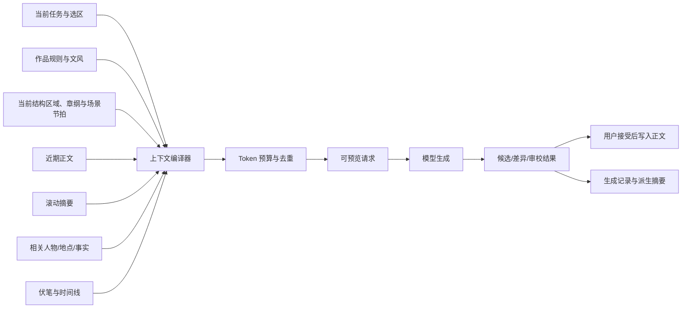

# AIO Hub AI 小说专精模块需求调查

> 状态：调查完成，已补充分层区域式结构画布设想，建议先做交互原型与垂直切片验证
>
> 最后更新：2026-08-02
>
> 建议工具 ID：`novel-studio`
>
> 调查范围：用户需求、竞品、模型与成本、AIO Hub 现有能力、产品边界、技术方案与 MVP

## 1. 结论摘要

**建议做，但不建议从“AI 聊天 + 续写按钮”开始做。**

AIO Hub 已经具备模型渠道、流式请求、智能体、世界书、条目式 RAG、上下文压缩、Token 计算、文本差异和资产管理等底层能力。真正缺少的是一个以“作品项目”为中心的小说工作台，将这些能力组织为可持续的长篇创作流程。

建议产品定位：

> 一个本地优先、模型开放、上下文可解释、修改可回退的 AI 小说项目工作台。

第一版的核心价值不是“自动写整本书”，而是同时解决四件事：

1. **结构管理**：用共享叙事轴上的分层区域组织粗纲、情节弧、章节与细节，同时保留卷、章、场景的正文目录。
2. **上下文管理**：每次生成都能知道模型收到了什么、为什么收到、花了多少 Token。
3. **非破坏式协作**：AI 提供候选、差异和建议，不能静默覆盖正文。
4. **多模型成本控制**：规划、正文、摘要、审校分别绑定模型，旗舰模型只处理高价值任务。

综合判断：

| 维度       | 判断                 | 说明                                                                                                  |
| ---------- | -------------------- | ----------------------------------------------------------------------------------------------------- |
| 用户需求   | 强                   | 长篇创作天然存在结构、记忆、版本和连续性问题；转发讨论也直接出现“主模型生产 + 副模型审校”的工作流诉求 |
| 市场验证   | 已验证               | Novelcrafter、Sudowrite、NovelAI、阅文作家助手、FeelFish、百度作家平台均已覆盖部分需求                |
| AIO 适配度 | 高                   | 现有模型基础设施和内容工具可明显降低开发成本，并形成 BYOK、本地存储、可观测性的差异化                 |
| 技术风险   | 中等                 | 难点主要在长篇上下文、正文版本、结构化事实同步和编辑器交互，不在模型 API 接入                         |
| 商业风险   | 中等                 | 竞品较多；如果只做生成按钮没有竞争力，必须突出开放模型、本地项目、上下文审计和工作流可定制            |
| 建议       | **Go，先做垂直切片** | 用一个可写 3-5 章真实作品的最小闭环验证，不先做自动代理团队、协作和出版平台接入                       |

## 2. 需求来源与判断边界

本次需求由一段关于 Kimi 重度使用、小说创作和“主模型生产 + 副模型审校”的社区讨论触发。该讨论可作为**定性需求信号**，不能作为价格、额度或模型能力的可靠基线。

尤其需要区分：

- **消费者会员/Coding Plan**：额度、用途、风控和产品入口可能频繁变化，通常不能直接被 AIO Hub 调用。
- **开放平台 API**：有明确的 Token 计费和调用契约，才是 AIO Hub 可长期集成的基础。
- **第三方聚合渠道**：可以作为用户自选 Profile，但模块不能依赖某个渠道的临时套餐经济性。

因此，`novel-studio` 应绑定 AIO 已有的 LLM Profile/Model，而不是内置“购买 Kimi 199/699 套餐”之类的产品假设。

## 3. 目标用户与核心任务

### 3.1 主要用户

第一阶段建议只服务两类用户：

1. **中文网文/连载作者**
   - 高频更新，重视章纲、节奏、钩子、设定一致性和前文回溯。
   - 对生成成本敏感，愿意混用模型。
   - 常见作品体量远超单次模型上下文，不可能靠“全文塞进去”解决。

2. **中长篇类型小说作者**
   - 重视人物弧、场景、伏笔、视角、文风和多轮修订。
   - 需要规划派和探索派两种工作模式。
   - 更在意版本、审校和创作控制权，而非单纯日更速度。

暂不把多人编辑、出版社流程、剧本和非虚构写作列为 MVP 目标。

### 3.2 用户真正要完成的任务

| 阶段 | 用户任务                                     | 当前通用聊天的主要问题                       |
| ---- | -------------------------------------------- | -------------------------------------------- |
| 构思 | 把点子扩展为题材、卖点、人物、冲突和结局方向 | 输出散落在对话中，无法形成可维护结构         |
| 规划 | 建立卷纲、章纲、场景节拍、人物弧和伏笔       | 结构修改后，旧对话和旧设定不会同步           |
| 起草 | 根据当前场景目标生成或协写正文               | 模型容易忘记视角、时间、人物状态和未解决线索 |
| 修订 | 重写局部、控制语气、扩写/压缩、比较候选      | 通用聊天以整段替换为主，接受粒度太粗         |
| 审校 | 检查连续性、重复、节奏、角色声音和设定冲突   | 只给泛泛评价，问题无法定位到正文和事实来源   |
| 连载 | 快速回忆前文、维护章纲、生成本章钩子         | 上下文成本随章节线性增长，且摘要逐轮漂移     |
| 交付 | 导出干净正文、项目备份和生成记录             | 聊天记录不是作品文件，迁移和回退困难         |

### 3.3 必须解决的高频痛点

- **长篇失忆**：人物状态、物品归属、时间线和伏笔在几十章后发生漂移。
- **上下文黑箱**：用户不知道模型遗漏了什么，也不知道昂贵模型为何消耗大量输入 Token。
- **AI 味与同质化**：套话、总结腔、形容词堆积、过度解释、对话声音趋同。
- **结构与正文脱节**：大纲改了，已写正文、章纲和人物状态没有明确的受影响提示。
- **版本焦虑**：一次重写可能破坏原文，用户不敢放手使用 AI。
- **模型选择疲劳**：规划、写作、摘要、审校对模型能力要求不同，用户却只能反复手动切换。
- **成本不可预测**：重度使用时，真正昂贵的是重复上下文、候选重生成和多轮审校，而不只是最终正文 Token。

## 4. 竞品调查

### 4.1 竞品对比

以下为 2026-07-17 官方页面可见信息；套餐和模型会变化，实施前需再次核验。

| 产品         | 核心方法                | 代表能力                                                                                      | 计费/模型策略                                                                   | 对 AIO 的启示                                                             |
| ------------ | ----------------------- | --------------------------------------------------------------------------------------------- | ------------------------------------------------------------------------------- | ------------------------------------------------------------------------- |
| Novelcrafter | 作品结构 + Codex + BYOK | 规划视图、角色/地点/设定 Codex、跨书共享、场景节拍生成、章节摘要、Workshop Chat、自定义提示词 | 平台月费 $4/$8/$14/$20；$8 起支持 BYOK，AI 费用另付                             | 最接近 AIO 的开放模型路线；说明用户愿意为“结构与上下文层”单独付费         |
| Sudowrite    | 封闭式小说 AI 套件      | Story Bible、Write、Expand、Rewrite、Feedback、Canvas、Brainstorm、Visualize、插件            | 月费 $10/$22/$44，按 credits；混用 Anthropic、OpenAI、开源和自研 Muse           | 原子写作动作和编辑体验比聊天更重要；“小说专用模型 + 专有前后处理”是其壁垒 |
| NovelAI      | 无限文本生成 + 记忆层   | 写作助手、分档 Memory、TTS、自有/开源叙事模型                                                 | Writer 套餐 $10/$15/$25；官方页标注无限文本生成，记忆约 8K/12K/28K Token        | 用户也接受“模型与产品打包”；AIO 不宜与其拼无限额度，应拼开放性和项目控制  |
| 阅文作家助手 | 网文生产与平台生态      | 存稿导入/加密、模板中心、读者端多平台预览、章纲提取，桌面端标注集成 DeepSeek-R1               | 平台型工具，创作与发布生态结合                                                  | 中文网文需求不止 AI；章纲回溯、读者端分段预览、日更工作流非常关键         |
| FeelFish     | 小说智能体 + 多模型     | 角色/设定、智能上下文、技能、知识库、多智能体、DeepSeek/千问                                  | 免费及 ¥17/¥35/¥119 月费，按积分；官方示例称 1 亿积分用 DeepSeek 约可写 10 万字 | 是 AIO 在中文独立客户端方向的直接竞品；仅有“智能体 + 知识库”不足以区分    |
| 百度作家平台 | 平台内 AI 生文          | 短篇对话生文、短篇续写、长篇章节生文、长篇拆书、章节摘要                                      | 平台内服务                                                                      | “拆书 -> 规划 -> 连载 -> 摘要”已成为中文产品的标准链路                    |

### 4.2 市场共同模式

竞品虽然形态不同，但共同收敛到五层：

1. **作品层**：书、卷、章、场景和项目文件。
2. **设定层**：人物、地点、规则、物品、时间线和世界观。
3. **规划层**：大纲、节拍、人物弧、伏笔和章节目标。
4. **AI 动作层**：构思、续写、扩写、重写、摘要、反馈和抽取。
5. **记忆层**：近期正文、滚动摘要、相关设定和可检索资料。

这说明小说模块不是一个 Prompt 集合，而是一个**领域数据模型 + 编辑器 + 上下文编译器**。

### 4.3 可形成差异化的空位

现有产品常在以下方向二选一：

- 体验完整，但模型、数据和计费封闭；
- 模型开放，但工作流、上下文可解释性和版本控制较弱。

AIO 可以组合出一条更清晰的路线：

- 本地优先、多文件项目，可直接备份和迁移；
- 任意 AIO LLM Profile，支持官方 API、聚合渠道和本地模型；
- 按任务配置模型，而非整本书锁定一个模型；
- 上下文预览、来源标记、Token/费用估算和生成记录；
- 候选分支、段落级差异、接受/拒绝和快照回退；
- 世界书、知识库、资产、文本差异等 AIO 工具协同，但保持清晰的数据所有权。

## 5. 建议产品定义

### 5.1 名称与入口

- 工具 ID：`novel-studio`
- 中文名建议：**小说工坊** 或 **小说工作台**
- 一句话：从设定、大纲、章节到审校的本地 AI 小说项目工作台。

### 5.2 主界面

建议采用安静、密集、适合长时间工作的四区布局：

| 区域         | 内容                                                                         |
| ------------ | ---------------------------------------------------------------------------- |
| 左侧项目导航 | 卷、章、场景、状态、字数、拖拽排序、搜索；负责正文文件与导出顺序             |
| 中央工作区   | 在 `正文编辑` 与 `结构画布` 间切换；前者处理文本，后者处理分层区域轨道       |
| 右侧检查器   | `结构`、`设定`、`AI`、`审校` 四个 Tab，随当前章节、场景、区域或选区联动      |
| 底部状态区   | 当前模型角色、上下文 Token、预计费用、生成状态、问题数量、画布缩放与叙事位置 |

不要把核心体验做成卡片首页或聊天首页。打开工具后应直接进入最近作品的工作状态。正文目录和结构画布是两个互补视图：前者回答“稿件如何存放与导出”，后者回答“故事在不同粒度上如何展开”。

### 5.3 分层区域式结构画布

树状大纲擅长表达严格的“父节点包含子节点”，但小说中的结构关系经常不是严格包含：人物弧可能横跨多个卷或阶段，伏笔从一个粗纲区域开始、在另一个区域结束，某条细粒度情节线也可能比其附近的粗粒度概括延伸得更远。若强制塞进树中，只能复制节点、制造虚假父子关系，或丢失跨边界跨度。

建议新增 **分层区域式结构画布（Layered Narrative Region Canvas）**。它借鉴剪辑软件的轨道视觉语言，但数据模型只定义两条互相正交的逻辑维度：**叙事主轴**表示叙事顺序/作品位置，**层级轴**表示抽象粒度由粗到细。主轴不等于现实时间或固定字数，也不应在模型中写死为横向；区域则是沿叙事主轴延伸的一段带状范围，可以相邻、重叠、留白或跨越其他层级的边界。


上图只是**横向主轴投影**，不是唯一布局。呈现方向属于视图状态，同一批区域数据至少可以有两种等价投影：

| 投影视图 | 叙事主轴 | 层级轴           | 更适合的场景                                                       |
| -------- | -------- | ---------------- | ------------------------------------------------------------------ |
| 横向主轴 | 从左到右 | 从上到下由粗到细 | 全书鸟瞰、比较长跨度情节弧、类似剪辑轨道的操作                     |
| 纵向主轴 | 从上到下 | 从左到右由粗到细 | 与左侧章节列表逐行对齐、逐章检查、在常规宽屏编辑布局中减少横向争抢 |

纵向主轴模式下，章节列表、正文目录或章节摘要可以和画布共享同一套纵向位置；章/场景边界表现为横向贯穿的分隔线，各粒度层成为并排的列。切换方向只改变坐标映射、滚动方向和视觉布局，不改变区域的起止锚点、关系或内容。

#### 5.3.1 核心语义

| 概念                           | 语义                                              | 约束                                                                                       |
| ------------------------------ | ------------------------------------------------- | ------------------------------------------------------------------------------------------ |
| 叙事轴 `NarrativeAxis`         | 全作品共享的逻辑叙事顺序                          | 与实际年代时间线分离；可缩放到全书、卷、章、场景或局部选区；不包含屏幕方向                 |
| 层级 `NarrativeLayer`          | 一种抽象粒度，例如总览、阶段、章节单元、场景/节拍 | 按粗到细排序；允许重命名和折叠，不要求每本作品使用相同层数，显示方向由视图决定             |
| 泳道 `NarrativeLane`           | 同一层内为解决重叠和分类而使用的平行轨道          | 主要服务布局，也可绑定主线、人物、POV 等语义；不能冒充父子层级                             |
| 区域 `NarrativeRegion`         | 轴上的一个 `[start, end)` 区间及其结构内容        | 可以跨粗粒度区域边界，也可以与同层或异层区域重叠                                           |
| 锚点 `StoryAnchor`             | 区域起止位置引用的稳定逻辑点                      | 优先绑定稳定 ID 和顺序键，不直接依赖像素、章节数组下标或易漂移的字符偏移                   |
| 关系 `NarrativeRegionRelation` | 区域之间显式声明的语义联系                        | `refines`、`realizes`、`causes`、`foreshadows`、`resolves`、`parallels` 等；与几何包含分开 |

最重要的建模规则是：

1. **层级表示粒度，不自动表示所有权。** 细粒度区域不是粗粒度区域的数据库子节点。
2. **位置关系与语义关系分离。** 系统可以计算 `contains`、`overlaps`、`intersects` 等几何关系，但“这个场景实现了哪个情节目标”需要显式关系或用户确认。
3. **允许跨层非严格包含。** 更细粒度区域可以早于某个粗粒度区域开始、晚于它结束，或同时细化多个粗粒度区域。
4. **卷/章/场景边界是参考线，不是画布容器。** 结构区域可以跨章，正文仍按卷章场景保存和导出。
5. **树是投影视图，不是唯一真相。** 能形成严格包含的区域可临时投影为树或线性大纲；跨界区域应保留为链接和跨度，不能为显示方便被强行改写。

例如，“主角失去身份并重新取得承认”可以是一条横跨全书的粗粒度区域；中等粒度的“逃亡”“潜伏”“反攻”依次排列；更细粒度的“身份暴露压力”却可能从潜伏前段一直延伸到反攻初段。它与多个中等粒度区域相交，但不需要选择唯一父节点。

#### 5.3.2 坐标、方向与锚点

画布不应把区域位置直接保存成百分比、像素或 `x/y` 坐标。建议使用有序的 `StoryAnchor`，渲染时再由视图把逻辑位置映射到横向或纵向：

- 项目、卷、章、场景的开始/结束可自动提供边界锚点；
- 尚未写正文时可创建“浮动锚点”，只依赖稳定的顺序键；
- 场景内部需要更细定位时，可绑定段落/块 ID，再附加局部偏移；
- 重排卷章场景时移动相关锚点，区域继续引用锚点 ID，避免整体失效；
- 实际年代、倒叙/插叙发生时间另建 Story Timeline，不与叙事轴混为一谈。

这样既支持先搭结构、后写正文，也允许正文变化后重新对齐，而不把画布锁死在当前字数上。

#### 5.3.3 关键交互

- **拖拽创建与调整**：在某层沿叙事主轴拖出区域，拖动首尾改变跨度，拖动整体改变位置；吸附到章/场景边界只是可选辅助。
- **细化到下一层**：从一个或多个粗粒度区域生成更细粒度候选区域，并建立 `refines`/`realizes` 关系；生成后允许越过原范围。
- **拆分、合并与续接**：拆分只改变区域结构，不强制拆正文；多个不连续区域可通过关系表达同一情节线。
- **缩放与折叠**：支持“全书 → 卷 → 章 → 场景”语义缩放，层级可折叠，密集处可自动增加泳道。
- **边界参考线**：把卷、章、场景和正文进度显示为垂直于叙事主轴的参考线；横向主轴时是竖线，纵向主轴时是与章节列表对齐的横线。
- **范围选择**：框选一段轴向范围，统一查看涉及的大纲、人物弧、伏笔、正文和上下文预算。
- **规划/成稿对照**：区域可标记 `planned`、`drafting`、`realized`、`diverged`，显示计划结构与实际正文的偏差，但不自动篡改计划。
- **方向切换**：横向主轴与纵向主轴共享同一份结构数据，可按工作区宽高、当前任务或用户偏好切换；方向、缩放、折叠和筛选属于视图状态。
- **多种投影**：同一数据还可切换为线性卡片、局部树、按人物/情节线筛选的视图，避免所有任务都挤在一张大画布上。

#### 5.3.4 与 AI 和上下文编译器的结合

区域应成为 AI 任务和上下文选择的一等入口：

- “细化此区域”生成更低一层的候选区域，而不是直接生成正文；
- “实现此区域”根据关联的粗粒度目标、相邻区域和相交人物弧生成场景节拍或正文候选；
- “检查空洞/拥挤”发现粗粒度目标没有细粒度实现、多个关键转折挤在过短区间、或某条人物弧长期中断；
- “检查计划与成稿偏差”比较区域声明与已绑定正文，输出候选修正，仍由用户决定改计划还是改正文；
- 编译请求时，除当前区域外，优先加入与它显式关联、几何相交以及相邻的区域，并在上下文预览中说明召回原因。

#### 5.3.5 MVP 边界与待验证问题

第一版不应直接实现完整剪辑器。建议先做一个低风险交互原型：预设 3-4 个可重命名层级、稳定锚点、区域拖拽/缩放、跨层重叠、章场景参考线、右侧详情编辑，以及同一数据在横向/纵向主轴间切换；复杂关系连线、自动泳道优化、自由曲线和多人协作均后置。

原型必须验证：

1. 用户是否自然理解“沿层级轴越走越具体，但不是严格子节点”；
2. 叙事主轴采用逻辑作品顺序时，规划派和探索派是否都能稳定放置区域；
3. 横向主轴和纵向主轴分别适合哪些任务，用户是否需要随时切换，还是更倾向固定个人偏好；
4. 纵向主轴与章节列表对齐后，能否明显降低逐章核对和跳转成本；
5. 跨章区域、同层重叠和大量短区域出现时，画布是否仍可读；
6. 用户更习惯固定层级模板，还是自由增删层级；
7. 计划区域与成稿位置发生偏移时，应自动跟随、提示重绑，还是保留原计划位置；
8. 区域视图是否显著优于“树 + 标签 + 关系线”，足以承担新增的数据和交互复杂度。

### 5.4 领域对象

MVP 建议至少定义以下对象：

- `NovelProject`：作品元信息、题材、目标读者、故事命题、默认语言和结构入口；详细总纲由顶层 `NarrativeRegion` 表达。
- `Volume` / `Chapter` / `Scene`：稳定 ID、顺序、状态、目标、摘要和正文引用；负责稿件组织，不作为所有结构区域的强制父节点。
- `NarrativeAxis` / `StoryAnchor`：全书逻辑叙事轴及稳定锚点顺序，不保存横向/纵向等视图方向。
- `NarrativeLayer` / `NarrativeLane`：抽象粒度与同层布局/分类。
- `NarrativeRegion`：带起止锚点、类型、状态、摘要和关联对象的结构区域，可表达总纲段、情节阶段、人物弧、章节单元、场景或节拍。
- `NarrativeRegionRelation`：区域之间的显式语义关系，并与自动计算的几何关系分离。
- `StoryEntity`：人物、地点、组织、物品、规则等统一实体，支持类型扩展。
- `StoryFact`：带来源和有效时间范围的事实，例如“第 12 章后左臂受伤”。
- `StoryBeat`：作为 `NarrativeRegion` 的一种结构化内容类型，记录场景目标、冲突、转折、结果和未解决问题，避免与区域系统形成两套大纲真相。
- `Foreshadowing`：通过锚点/区域引用埋设位置与计划回收范围，并记录状态和相关实体。
- `StyleProfile`：视角、时态、句长倾向、禁用表达、示例片段。
- `ChapterSummary`：结构化摘要，是派生数据，保留生成来源和版本。
- `GenerationRun`：任务、模型、Prompt 版本、上下文清单、Token、费用、候选和接受结果。
- `ManuscriptSnapshot`：正文快照或增量补丁，用于非破坏式回退。
- `NovelModelRoleBinding`：模型角色到 AIO Profile/Model/参数的映射。

### 5.5 模型角色

论坛中的“主模型 + 副模型”方向正确，但产品层应抽象为任务角色，而不是写死两个模型：

| 角色       | 任务                                 | 默认成本策略                                   |
| ---------- | ------------------------------------ | ---------------------------------------------- |
| `planner`  | 题材分析、总纲、人物弧、复杂情节推演 | 旗舰推理模型，中低频                           |
| `drafter`  | 场景和正文候选                       | 文本表现最好的模型，高频，允许用户设定思考强度 |
| `utility`  | 摘要、实体/事实抽取、标签、格式整理  | 低成本模型，可批处理                           |
| `reviewer` | 连续性、风格、节奏、重复和读者反馈   | 尽量与 `drafter` 不同，降低同源盲点            |

所有角色都允许映射到同一个模型；默认模板只提供建议，不应硬编码“最佳模型”。

## 6. 上下文系统

### 6.1 基本原则

长上下文窗口不能替代上下文工程。即使模型支持 1M Token，把整本书反复发送仍会带来成本、注意力稀释和不可解释性。

建议每次请求由 `NovelContextCompiler` 根据任务编译上下文：


```mermaid
flowchart LR
    A["当前任务与选区"] --> H["上下文编译器"]
    B["作品规则与文风"] --> H
    C["当前结构区域、章纲与场景节拍"] --> H
    D["近期正文"] --> H
    E["滚动摘要"] --> H
    F["相关人物/地点/事实"] --> H
    G["伏笔与时间线"] --> H
    H --> I["Token 预算与去重"]
    I --> J["可预览请求"]
    J --> K["模型生成"]
    K --> L["候选/差异/审校结果"]
    L --> M["用户接受后写入正文"]
    L --> N["生成记录与派生摘要"]
```

### 6.2 上下文优先级

建议按以下优先级裁剪：

1. 当前任务和用户明确选择的文本；
2. 当前区域、场景目标、POV、时间和地点；
3. 与当前区域显式关联、几何相交或紧邻的结构区域；
4. 被“锁定”的作品规则和事实；
5. 直接相关人物、物品、伏笔和时间线；
6. 最近 1-3 个场景原文；
7. 更早章节的结构化摘要；
8. 参考资料 RAG 结果；
9. 低相关背景资料。

每个上下文块必须带：`sourceType`、`sourceId`、`reason`、`priority`、`tokenCount`。用户应能在发送前查看、排除或固定某一块。

### 6.3 记忆分层

- **原文记忆**：近期正文，精确但昂贵。
- **情节记忆**：章/场景摘要，便宜但可能漂移。
- **事实记忆**：人物状态、地点规则、物品归属等结构化事实。
- **语义记忆**：知识库中的研究资料和远期内容，用检索召回。
- **作者记忆**：用户手动锁定的规则、禁忌和必须保留的表达。

摘要和事实抽取都应记录来源版本。正文变化后将派生内容标记为 `stale`，不能悄悄继续使用旧摘要。

## 7. 与 AIO Hub 现有能力的关系

### 7.1 可以直接复用

| 现有能力                                                     | 复用方式                                                             |
| ------------------------------------------------------------ | -------------------------------------------------------------------- |
| `useLlmRequest`、LLM Profiles、KeyManager、Provider Adapters | 统一模型请求、流式输出、参数过滤、网络策略和密钥轮换                 |
| `@aiohub/llm-core`                                           | Provider 无关请求与响应语义，避免小说模块自建模型 SDK                |
| `llm-inspector`                                              | 给 `GenerationRun` 提供请求审计和故障诊断入口                        |
| `token-calculator`                                           | 上下文 Token 预算和发送前估算                                        |
| `text-diff`                                                  | 候选正文与当前正文的差异预览                                         |
| `st-worldbook-manager`                                       | 导入/导出 SillyTavern 世界书，以及复用部分选择器/编辑交互            |
| `knowledge-base`                                             | 研究资料、背景知识、远期事实的检索；不把整本正文无脑切块后当唯一记忆 |
| `asset-manager`                                              | 参考图片、地图、资料和封面等资产引用                                 |
| `rich-text-renderer`                                         | AI 审校报告、Markdown 说明和引用展示                                 |
| `agent-manager`                                              | 可选的写作顾问/审校人格模板，不作为作品数据所有者                    |

### 7.2 不应直接复用的数据边界

1. **不要把小说正文存成 `llm-chat` 会话。**
   - 聊天消息树适合对话探索，不适合卷章排序、场景拆分、稳定引用和干净导出。
   - 可以复用非破坏式分支思想，但作品正文必须有自己的存储和版本模型。

2. **不要把 ST 世界书直接当小说的唯一 Canon 数据库。**
   - ST 世界书偏向关键词触发和上下文注入；小说需要时间有效性、事实来源、人物状态和伏笔生命周期。
   - 应提供双向导入/导出适配，而不是让 `novel-studio` 依赖 ST 格式语义。

3. **不要让 RAG 替代结构化事实。**
   - “某人现在是否受伤”需要确定性状态和来源，不应只靠相似度检索碰运气。

4. **不要复制 `llm-chat` 的完整上下文管道。**
   - 第一版直接基于共享 LLM 请求层实现小说专用编译器；真正通用的处理器再下沉为共享包。

### 7.3 存储建议

该工具属于多文件关联和版本数据场景，不适合用 `ConfigManager` 保存整个项目。建议使用自定义存储层并保证原子写入：

```text
{appConfigDir}/novel-studio/
  projects-index.json
  projects/{projectId}/
    project.json
    structure/
      axis.json
      layers.json
      regions.json
      relations.json
    entities.json
    facts.json
    foreshadowing.json
    manuscript/{chapterId}.md
    summaries/{chapterId}.json
    snapshots/{chapterId}/...
    runs/{runId}.json
    assets/...
```

正文按章拆文件，索引和正文分离；不要把整本小说、所有运行记录和版本塞进单个 JSON。

## 8. MVP 范围

### 8.1 P0：可验证垂直切片

P0 必须形成完整闭环：

- 新建/打开本地作品；
- 卷、章、场景项目导航和拖拽排序；
- Markdown/纯文本正文编辑、自动保存、字数统计；
- 人物/地点/规则的基础设定表；
- 预设 3-4 个可重命名粒度层级的结构画布；
- 稳定锚点、区域创建/移动/缩放、跨层重叠、章场景参考线，以及横向/纵向主轴切换；
- 以 `NarrativeRegion` 表达章纲、情节单元和场景节拍，并可从区域跳转到相交正文；
- 四个模型角色配置；
- 上下文编译与发送前预览；
- “细化区域”“根据节拍起草”“续写”“选区重写”四种 AI 动作；
- 每次生成 1-3 个候选；
- 差异预览、按候选接受、拒绝；
- 章节快照和回退；
- 自动章节摘要与过期标记；
- Markdown/TXT/项目 JSON 导出；
- 生成记录中的模型、Token、耗时和估算费用。

### 8.2 P1：形成小说专精

- 连续性检查：人物状态、时间、地点、物品和规则冲突；
- 伏笔管理与回收提醒；
- 风格画像、禁用表达和角色对白声音检查；
- 重复用词、句式和跨章情节重复检测；
- 章节节奏/钩子检查；
- 作品导入后的拆章、摘要和实体候选抽取；
- 世界书和知识库适配；
- 自定义 AI 动作模板；
- 区域关系编辑、按人物/主线/POV 的多投影视图、计划与成稿偏差检查；
- 轨道密度优化、自动泳道和跨层结构诊断；
- Prompt/上下文版本化和批量重跑。

### 8.3 P2：暂缓

- 全自动“从大纲写完整本书”；
- 多智能体自治团队；
- 多人实时协作；
- 出版平台一键发布；
- 移动端完整编辑；
- 训练/微调小说专用模型；
- EPUB/DOCX 精排和出版级排版。

这些功能价值不低，但会掩盖 P0 最重要的问题：用户是否愿意在这个工作台里连续写完多章，并信任它的上下文和版本系统。

## 9. 模型与成本策略

### 9.1 当前官方 API 信号

截至 2026-07-17：

- Kimi 官方文档显示 `kimi-k3` 为 1,048,576 Token 上下文，缓存命中输入 ¥2/1M、未命中输入 ¥20/1M、输出 ¥100/1M。
- `kimi-k2.6` 为 262,144 Token 上下文，缓存命中输入 ¥1.1/1M、未命中输入 ¥6.5/1M、输出 ¥27/1M。
- `kimi-k2.5` 为 262,144 Token 上下文，缓存命中输入 ¥0.7/1M、未命中输入 ¥4/1M、输出 ¥21/1M。
- DeepSeek 官方文档显示 DeepSeek V4 Flash/Pro 均为 1M 上下文，输出分别为 $0.28/$0.87 每 1M Token，且缓存命中输入价格显著低于未命中。

价格说明了两个产品事实：

1. 旗舰模型可以承担规划、关键正文和难题，但不该默认处理摘要、实体抽取和格式整理。
2. 稳定前缀缓存和上下文去重不是底层小优化，而是小说模块的核心产品能力。

### 9.2 粗略成本示例

假设一部 30 万汉字小说，共 100 章，每章 AI 起草 3000 汉字。Kimi 文档给出的通常中文换算约为 1 Token 对应 1.5-2 个汉字：

- 一次完整正文输出约 15-20 万 Token。
- K3 仅输出费用约 ¥15-20。
- 若每章平均发送 2 万输入 Token，100 章为 200 万输入 Token；全部未命中缓存约 ¥40，全部按命中价计算约 ¥4。
- 因此 K3 单候选、单遍起草的基础量级约为 **¥20-60**，尚未包含多候选、规划、审校、失败重试和人工反复改写。
- 同样的简单任务若使用 K2.5，输出约 ¥3.2-4.2，200 万未命中输入约 ¥8。

这只是为了说明量级，不是账单承诺。真实成本取决于上下文长度、缓存比例、模型输出习惯、候选数和接受率。产品中应显示：

- 本次预计输入/输出 Token；
- 当前角色模型的单价配置；
- 本章和全项目累计消耗；
- **每千字被接受正文的成本**，而不是只统计生成成本。

### 9.3 不做静态“模型排行榜”

小说质量高度依赖题材、语言、提示词、审美和编辑方式。建议在工具内提供可复现的模型试写/盲评：

- 同一场景节拍调用多个候选模型；
- 隐藏模型名后让用户选择；
- 记录接受率、人工修改比例、连续性错误、重复表达和成本；
- 最终推荐基于用户自己的作品数据，而不是官方宣传或社区单次体验。

首个内部基准可准备 20 个中文场景，覆盖对白、动作、情绪、悬疑、信息揭示、过场、不同 POV 和长程伏笔回收。

## 10. 安全、版权与信任

- **本地优先**：正文和项目默认保存在本地；调用云模型时明确显示将发送的上下文。
- **最小发送**：附件、整章或研究资料不能在未进入上下文清单时被隐式上传。
- **不静默覆盖**：所有 AI 修改先进入候选或差异视图，用户接受后才写入正文。
- **来源可追踪**：摘要、事实和审校问题都记录对应正文版本和来源位置。
- **隐私提示**：不同模型提供商的数据政策不同，AIO 只能展示渠道信息，不能替提供商承诺不训练。
- **版权提示**：不提供“模仿在世作者”默认模板；风格画像优先描述可观察特征，而不是只写作者姓名。
- **平台政策**：不同连载/出版平台对 AI 内容标注和版权要求不同，后续可做政策说明，但不自动替用户判断合规。
- **提示词注入**：外部研究资料和导入世界书属于不可信内容，作为资料块处理，不能覆盖系统和作品规则。

## 11. 验证计划

### 11.1 开发前验证

建议先访谈 5-8 位真实作者，至少包含 3 位有 20 万字以上作品经验的连载作者。不要只问“想要什么功能”，应让用户展示：

- 当前目录、正文、大纲和设定如何存放；
- 最近一次前后文冲突如何产生；
- 如何用 Kimi/DeepSeek/Claude 等完成一次真实续写或审校；
- 哪些 AI 输出会直接丢弃；
- 如何备份、回滚和投稿；
- 每月能接受的工具费和模型费。

### 11.2 垂直切片验收

用一个 3-5 章、至少 1.5 万字的真实项目完成以下任务：

1. 导入已有设定和前三章；
2. 在结构画布中建立全书粗纲、第四章区域与两个场景节拍，并创建一条跨越相邻粗纲边界的细粒度区域；
3. 使用不同 `planner`/`drafter` 模型生成区域细化和正文候选；
4. 查看上下文来源和费用；
5. 接受部分候选并保留原版本；
6. 自动生成摘要和事实候选；
7. 在第五章触发一次前文事实召回与连续性检查；
8. 导出干净正文和完整项目备份。

### 11.3 核心指标

- 从粗粒度区域细化到可用场景节拍、再到“被接受的 1000 字正文”的中位耗时；
- 用户能否在不复制节点的情况下表达跨章、跨阶段的情节线；
- 区域重排、卷章重排和正文变化后的锚点失效/人工重绑次数；
- 候选接受率与接受后修改比例；
- 每 1 万字的模型成本；
- 每 1 万字发现/漏掉的连续性问题数；
- 用户主动打开上下文预览的比例；
- 7 天后是否继续在同一项目写作；
- 导出后返工和数据恢复是否可靠。

## 12. 实施建议

### 12.1 推荐顺序

1. **结构语义与交互原型**：先验证叙事轴、层级、区域、锚点和跨层非严格包含是否易懂，不先堆完整剪辑器能力。
2. **数据与存储先行**：项目、卷章场景、结构区域、正文文件、快照和原子保存。
3. **编辑闭环**：项目导航、正文编辑、选区、自动保存和版本回退。
4. **最小结构画布**：方向无关的坐标映射、横向/纵向主轴切换、区域拖拽/缩放、章场景参考线、详情编辑和正文跳转。
5. **上下文编译器**：先支持固定来源、相交/关联区域和可视化预算，再接复杂检索。
6. **四种 AI 动作**：区域细化、节拍起草、续写、选区重写。
7. **候选与差异**：这是建立信任的关键，不能推迟到“以后”。
8. **派生记忆**：摘要、事实候选、过期检测。
9. **连续性审校**：在真实多章项目上验证，而不是只写单元演示。

### 12.2 粗略工作量

以一名熟悉 AIO Hub 的工程师为基准：

- 技术原型：约 2-3 周，可完成项目存储、基础编辑、上下文预览和一次候选生成。
- 可供真实作者连续使用的桌面 MVP：约 6-10 周。
- P1 的连续性、伏笔、风格和导入体系：需要在 MVP 使用数据上继续迭代，不建议预先承诺固定周期。

工作量最大的部分预计是编辑器状态、结构画布交互、锚点稳定性、文件版本和上下文失效传播，而不是 LLM 请求。分层区域画布引入后，原 6-10 周估算需要在交互原型验证后重新校准，不能把完整轨道编辑能力默认视为原 MVP 工期内的无成本增量。

### 12.3 最终建议

立即进入一个受控垂直切片，但设置三条硬边界：

1. 正文是作品文件，不是聊天消息；
2. AI 修改必须可预览、可比较、可撤销；
3. 模型选择和成本属于项目配置，不属于写死的产品逻辑。

若垂直切片能让真实作者完成连续两章，并在成本、可控性和前文一致性上明显优于直接使用通用聊天，则值得扩展为 AIO Hub 的正式专精模块。

## 13. 资料来源

### AIO Hub 内部资料

- [`src/tools/llm-chat/ARCHITECTURE.md`](../../src/tools/llm-chat/ARCHITECTURE.md)
- [`src/tools/knowledge-base/ARCHITECTURE.md`](../../src/tools/knowledge-base/ARCHITECTURE.md)
- [`src/tools/st-worldbook-manager/ARCHITECTURE.md`](../../src/tools/st-worldbook-manager/ARCHITECTURE.md)
- [`docs/Plan/llm-provider-adapter-sharing-investigation.md`](./llm-provider-adapter-sharing-investigation.md)

### 官方产品与定价页面

- [Novelcrafter 产品页](https://www.novelcrafter.com/)
- [Novelcrafter 定价](https://www.novelcrafter.com/pricing)
- [Sudowrite 产品页](https://www.sudowrite.com/)
- [Sudowrite 定价](https://www.sudowrite.com/pricing)
- [NovelAI 产品与 Writer 套餐](https://novelai.net/)
- [阅文作家助手桌面端](https://write.qq.com/portal/advertising)
- [FeelFish 小说写作 AI 智能体](https://www.feelfish.com/zh)
- [百度作家平台](https://zuojia.baidu.com/)
- [Kimi API 模型推理价格说明](https://platform.kimi.com/docs/pricing/chat)
- [Kimi K3 定价](https://platform.kimi.com/docs/pricing/chat-k3)
- [Kimi K2.6 定价](https://platform.kimi.com/docs/pricing/chat-k26)
- [Kimi K2.5 定价](https://platform.kimi.com/docs/pricing/chat-k25)
- [DeepSeek API 模型与定价](https://api-docs.deepseek.com/quick_start/pricing)
