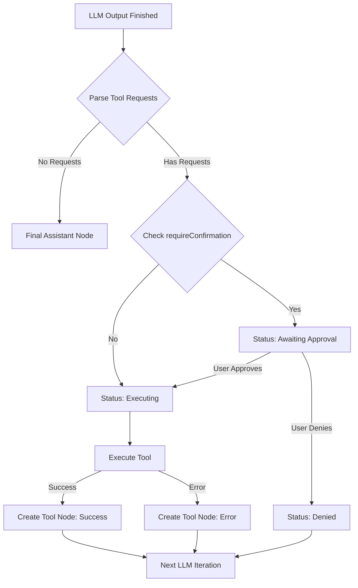

# AIO Tool Calling System Design (Phase 1)

> **状态**: Implementing
> **作者**: 咕咕
> **日期**: 2026-02-16
> **关联**: [vcp-tool-integration-RFC.md](./vcp-tool-integration-RFC.md)

## 1. 概述

本设计文档详细描述了 AIO 内部工具调用系统 (Tool Calling System) 的 Phase 1 方案。该系统旨在为 LLM 提供通用的工具发现、提示注入、文本解析与执行机制，并与现有 `llm-chat` 管线无缝集成。

**核心原则**：

- **协议无关性**: 不与特定协议（如 VCP）强绑定，通过协议插件支持多种生成/解析格式。
- **函数式核心**: 解析、发现、转换与执行核心尽量无状态，方便测试和复用。
- **显式授权**: 仅显式标记为 Agent 可调用的方法才可暴露给 LLM。
- **完成后统一解析**: 流式输出完成后再统一解析工具请求块，以获得稳定边界和可靠多工具调用能力。
- **最小侵入**: 在尽量不破坏现有 `llm-chat` 架构的前提下完成接入。

## 2. 核心架构

系统采用 **“引擎 + 协议插件 + 宏注入 + Chat 循环编排”** 的分层架构。

### 2.1 模块结构

```
src/tools/tool-calling/
├── tool-calling.registry.ts
├── ToolCallingTester.vue
├── core/
│   ├── engine.ts                 # 编排：解析 -> 执行 -> 结果格式化
│   ├── discovery.ts              # 工具发现/过滤/缓存
│   ├── parser.ts                 # 完整文本解析器（非流式）
│   ├── executor.ts               # 调用路由与执行
│   └── protocols/
│       ├── base.ts               # 协议接口
│       └── vcp-protocol.ts       # VCP 协议实现
├── composables/
│   └── useToolCalling.ts
└── types/
    └── index.ts
```

### 2.2 与 `llm-chat` 的接缝点

- **宏注入层**：[`macros/tools.ts`](src/tools/llm-chat/macro-engine/macros/tools.ts) + [`initializeMacroEngine()`](src/tools/llm-chat/macro-engine/index.ts:29)。
- **Agent 配置层**：[`AgentBaseConfig`](src/tools/llm-chat/types/agent.ts:126) 扩展 `toolCallConfig`。
- **回复编排层**：`ChatHandler` 在单轮 LLM 输出完成后统一解析并执行。
- **消息模型层**：[`MessageRole`](src/tools/llm-chat/types/common.ts:4) 扩展 `"tool"` 角色，并在各处理器中同步支持。
- **管道兼容性**：
  - **正则处理器**：利用 `regex-processor.ts` 现有的 `filterRulesByRole` 机制，通过配置 `targetRoles` 实现对工具消息的精准过滤。
  - **组装避让**：在 `injection-assembler.ts` 组装过程中，确保注入消息不会意外打断 `assistant` 与其后续 `tool` 结果的逻辑关联。
  - **格式化映射**：在 `message-format-processors.ts` 中，通过 `mergedRulesMap` 控制 `"tool"` 角色的合并与映射策略。

## 3. 类型设计

### 3.1 `ToolCallConfig`（Agent 级）

工具调用配置属于 Agent 能力配置，不属于底层 LLM API 参数。

```typescript
// src/tools/llm-chat/types/agent.ts
export interface ToolCallConfig {
  enabled: boolean;
  mode: "auto" | "manual";
  toolToggles: Record<string, boolean>;
  defaultToolEnabled: boolean;
  maxIterations: number;
  timeout: number;
  requireConfirmation: boolean;
  parallelExecution: boolean;
  protocol?: "vcp";
}
```

默认值：

```typescript
export const DEFAULT_TOOL_CALL_CONFIG: ToolCallConfig = {
  enabled: false,
  mode: "auto",
  toolToggles: {},
  defaultToolEnabled: true,
  maxIterations: 5,
  timeout: 30000,
  requireConfirmation: false,
  parallelExecution: false,
  protocol: "vcp",
};
```

在 [`AgentBaseConfig`](src/tools/llm-chat/types/agent.ts:126) 中新增：

```typescript
toolCallConfig?: ToolCallConfig;
```

### 3.2 `MethodMetadata` 扩展（显式授权）

在 [`MethodMetadata`](src/services/types.ts:18) 中扩展：

```typescript
agentCallable?: boolean;
protocolConfig?: {
  vcpCommand?: string;
};
```

规则：

- `agentCallable` 未设置时按 `false` 处理（默认不可调用）。
- 仅 `agentCallable === true` 的方法可进入 `{{tools}}` 输出。
- 存在复杂参数时建议提供 facade 方法，并在元数据中暴露 facade。

### 3.3 工具调用领域类型

```typescript
export interface ParsedToolRequest {
  requestId: string;
  toolName: string;
  rawBlock: string;
  args: Record<string, string>;
}

export interface ToolExecutionResult {
  requestId: string;
  toolName: string;
  status: "success" | "error";
  result: string;
  durationMs: number;
}

export interface ToolCallCycleResult {
  parsedRequests: ParsedToolRequest[];
  executionResults: ToolExecutionResult[];
  hasToolRequests: boolean;
}
```

## 4. 协议层设计

### 4.1 协议基础接口（`protocols/base.ts`）

```typescript
export interface ToolCallingProtocol {
  readonly id: string;
  generateToolDefinitions(
    input: {
      toolId: string;
      toolName: string;
      methods: MethodMetadata[];
    }[]
  ): string;
  parseToolRequests(finalText: string): ParsedToolRequest[];
  formatToolResults(results: ToolExecutionResult[]): string;
}
```

### 4.2 VCP 协议实现边界（`vcp-protocol.ts`）

VCP 实现负责：

- **定义生成**：将方法元数据转换为 `<<<[TOOL_DEFINITION]>>>` 文本块。
- **请求提取**：从完整回复中提取 `<<<[TOOL_REQUEST]>>>` 块。**技术对齐**：复用 `src/tools/rich-text-renderer/parser/Tokenizer.ts` 中已有的 `RE_VCP_ARG` 等正则定义。
- **参数解析**：解析 `tool_name: 「始」...「末」` 以及参数字段，产出统一 `ParsedToolRequest[]`。

VCP 实现不负责：

- 直接执行工具
- 与 UI 交互
- 中断/重试策略

## 5. ToolDiscoveryService 设计

### 5.1 输入输出

- 输入：`ToolCallConfig` + 协议类型（Phase 1 仅 `vcp`）
- 输出：协议格式工具定义文本

### 5.2 过滤流程

1. 从 [`toolRegistryManager.getAllTools()`](src/services/registry.ts:78) 获取全部工具
2. 过滤掉无 `getMetadata()` 的工具
3. 过滤 `agentCallable !== true` 的方法
4. 应用 Agent 开关：
   - 若 `toolToggles[toolId]` 有值，使用显式值
   - 否则回退 `defaultToolEnabled`
5. 将通过过滤的方法交给协议转换器

### 5.3 缓存策略

- **缓存机制**：基于 `protocol + agentId + toolCallConfigHash` 进行缓存。
- **失效驱动**：监听 `toolRegistryManager` 的工具注册/注销事件，事件触发时强制清空相关协议缓存。

## 6. `{{tools}}` 宏设计（重点）

### 6.1 宏定义

新增 [`macros/tools.ts`](src/tools/llm-chat/macro-engine/macros/tools.ts)：

```typescript
{
  name: "tools",
  type: MacroType.VALUE,
  phase: MacroPhase.SUBSTITUTE,
  description: "注入当前 Agent 可用工具定义（协议格式）",
  example: "{{tools}}",
  acceptsArgs: false,
  priority: 95,
  supported: true,
  contextFree: false,
  execute: async (context) => { ... }
}
```

选择依据：

- `VALUE`: 其返回值是文本替换结果（可为异步）
- `SUBSTITUTE`: 属于上下文替换类宏
- `contextFree: false`: 强依赖 `context.agent?.toolCallConfig`

### 6.2 宏执行逻辑

```typescript
execute: async (context) => {
  const config = context.agent?.toolCallConfig;
  if (!config?.enabled) return "";
  return toolDiscovery.generatePrompt({
    protocol: config.protocol || "vcp",
    config,
  });
};
```

### 6.3 注册入口

在 [`initializeMacroEngine()`](src/tools/llm-chat/macro-engine/index.ts:29) 中追加：

```typescript
registerToolMacros(registry);
```

### 6.4 输出规范（VCP）

每个方法输出一个 `TOOL_DEFINITION` 块，包含：

- `tool_name`
- `description`
- `parameters`
- `example`

多方法按空行分隔，块顺序稳定（`toolId + methodName` 排序），便于 diff 与缓存。

### 6.5 体积控制

- **按需控制**：Phase 1 不设硬性字符限制。
- **UI 辅助**：在 Agent 编辑器的宏预览面板中实时展示工具定义的预估 Token 数，由用户根据模型能力自行调整开启的工具数量。

## 7. 解析策略：完成后统一解析（非流式）

### 7.1 策略说明

不在 token 流中增量解析，不做半包状态机。原因：

- 流中边界不稳定，易误判未闭合块
- 多工具并发场景下复杂度高且收益低
- 完成后统一解析可直接处理完整上下文，可靠性更高

### 7.2 解析流程

1. 获取最终完整 assistant 文本
2. 使用协议解析器提取所有工具请求块
3. 对每个块解析 `tool_name` 与参数字典
4. 生成 `ParsedToolRequest[]`（可含多个请求）

### 7.3 容错规则

- 缺少 `END_TOOL_REQUEST`：该块丢弃并记录 warning
- 缺少 `tool_name`：该块丢弃并记录 warning
- 重复参数：后值覆盖前值
- 空参数值：按空字符串处理
- 未匹配到任何块：返回空数组，不视为异常

## 8. `ToolCallExecutor` 设计

### 8.1 职责

- 验证请求合法性
- 通过 `toolRegistryManager` 路由到工具实例
- 控制超时、串并行、异常捕获
- 输出标准化 `ToolExecutionResult[]`

### 8.2 执行流程

1. **确认机制**：参考 Roo 系逻辑，根据工具配置的权限等级决定是否自动允许执行；若需确认，则通过 UI 层拦截并等待用户授权。
2. **执行路由**：按 `parallelExecution` 串行/并行执行请求。
3. **超时控制**：每个调用使用 `timeout` 包装。
4. **异常处理**：将任意执行异常转换为 `status: "error"` 的结构化结果。

### 8.3 调用约定

Phase 1 采用“facade 优先”调用约定：

- LLM 请求的 `tool_name` 对应 `toolId_methodName` 或协议映射名
- 参数按 name 映射后传入目标方法
- 若方法签名不兼容，返回结构化错误并建议工具侧提供 facade

## 9. ChatHandler 集成（循环编排）

### 9.1 单轮编排

```text
用户消息 -> LLM 流式输出 -> 收集完整文本 -> 统一解析工具请求
-> 若无工具请求：直接落 assistant 节点
-> 若有工具请求：执行工具 -> 生成 tool 结果节点
-> 将 tool 结果并入上下文再次请求 LLM
-> 直到无工具请求或达到 maxIterations
```

### 9.2 迭代控制

- 每次“解析到至少一个工具请求并执行”计为 1 轮
- 超过 `maxIterations` 立即停止并落错误说明节点
- 防止模型陷入“重复请求同一工具”的死循环

### 9.3 中断与取消

- 用户停止生成时，终止当前 LLM 流与待执行工具
- 对已完成工具结果保留，对未完成标记取消
- 保证会话树一致性，不产生悬挂节点

## 10. 消息模型扩展

### 10.1 角色扩展

在 [`MessageRole`](src/tools/llm-chat/types/common.ts:4) 增加 `"tool"`：

```typescript
export type MessageRole = "user" | "assistant" | "system" | "tool";
```

在 [`ProcessableMessage`](src/tools/llm-chat/types/context.ts:23) 与相关上下文类型同步支持 `"tool"`。

### 10.2 节点元数据扩展

在 [`ChatMessageNode`](src/tools/llm-chat/types/message.ts:80) 的 `metadata` 增加：

```typescript
toolCall?: {
  requestId: string;
  toolName: string;
  status: "success" | "error" | "denied";
  durationMs: number;
  rawArgs?: Record<string, string>;
};
toolCallsRequested?: Array<{
  requestId: string;
  toolName: string;
  args: Record<string, string>;
  status: "pending" | "awaiting_approval" | "executing" | "completed" | "denied";
  error?: string;
}>;
```

约定：

- assistant 节点可存 `toolCallsRequested`（表示模型请求）
- tool 节点存 `toolCall` + 工具输出内容（表示执行结果）

## 11. UI 设计

### 11.1 Agent 编辑页：工具调用配置区

在 `CapabilitiesSection` 增加区域：

- **总开关**：启用工具调用能力。
- **工具列表开关**：按工具 ID 粒度精确控制哪些工具对 AI 可见。
- **默认策略**：新注册工具默认开启或关闭。
- **高级配置**：
  - `maxIterations`：防止死循环的最大迭代次数。
  - `timeout`：单次工具执行超时时间。
  - `requireConfirmation`：**全局确认开关**。开启后，所有工具执行前必须经过用户手动批准。
  - `parallelExecution`：是否允许模型在单次回复中并行调用多个工具。
- **Prompt 预览**：实时展示 `{{tools}}` 的生成结果及其预估 Token 数。

### 11.2 聊天页：工具调用节点设计

#### 11.2.1 工具角色节点 (`role: "tool"`)

当消息角色为 `"tool"` 时，UI 呈现应区别于普通对话：

- **视觉风格**：采用“日志式”或“卡片式”布局，弱化头像，使用工具图标作为标识。
- **背景色**：使用轻微区别于 `assistant` 的底色（如带透明度的 `success` 或 `info` 色）。
- **内容结构**：
  - 顶部栏：工具名、执行状态（成功/失败）、耗时（ms）。
  - 内容区：默认展示执行结果。如果是大型 JSON，支持表格/树形预览（复用现有 `VcpToolNode` 逻辑）。
  - 操作：支持一键复制结果。

#### 11.2.2 AI 消息内的工具调用请求 (`assistant` 消息中)

在 `assistant` 回复中检测到工具请求块时：

- **状态感知**：
  - **生成中**：显示加载动画。
  - **等待授权**：若开启 `requireConfirmation`，在工具块下方显示“批准 / 拒绝”操作区。
  - **已授权/自动执行中**：显示“执行中...”状态及扫光特效。
  - **已完成**：工具块状态更新，并指向后续的 `tool` 角色节点。

### 11.3 交互逻辑：工具调用确认面板

当工具调用需要用户确认时，在消息内部的工具请求块底部注入交互组件：

- **批准 (Approve)**：点击后立即触发 `toolCallExecutor` 执行该请求。
- **拒绝 (Deny)**：点击后取消执行，并将“用户拒绝了该操作”作为结果反馈给 AI，允许 AI 继续思考或停止。
- **参数预览**：清晰展示 AI 传入的参数，防止误操作。
- **批量操作**：若 AI 单次请求了多个工具，支持“全部批准”。

## 12. 状态流转图 (UI & Logic)



## 12. 迁移策略

### 12.1 工具侧迁移

- 逐步为已有工具补 `getMetadata()`
- 明确标注 `agentCallable: true` 的 facade 方法
- 不符合扁平参数要求的方法先不暴露

### 12.2 聊天侧迁移

- 先落地 `{{tools}}` + 完成后统一解析 + tool 节点渲染
- 再接入完整多轮工具调用循环
- 最后优化缓存、体积控制、错误可观测性

### 12.3 向后兼容

- `toolCallConfig` 缺失时按默认关闭处理
- 老会话节点无 `tool` 角色不受影响
- 不会改变原有无工具调用场景行为

## 13. 测试页 (Tool Calling Tester)

### 13.1 功能点

- 工具发现结果面板：查看 agentCallable 方法清单。
- `{{tools}}` 预览面板：查看协议文本输出及预估 Token 数。
- 完整文本解析面板：支持手动粘贴文本，测试解析器提取请求的准确性（复用现有渲染器匹配逻辑）。
- 执行面板：手动触发工具请求并查看执行结果与耗时。

### 13.2 路由与入口

- ID: `tool-calling-tester`
- 路径: `src/tools/tool-calling-tester/`

## 14. 实施路线图

1. **类型与协议基建**
   - 扩展 `ToolCallConfig`、`MethodMetadata`
   - 定义 `ToolCallingProtocol` 与 VCP 实现
2. **发现与宏**
   - 实现 `ToolDiscoveryService`
   - 增加 `{{tools}}` 宏并接入宏引擎初始化
3. **解析与执行**
   - 实现“完成后统一解析”解析器
   - 实现 `useToolCallExecutor`
4. **ChatHandler 集成**
   - 接入单轮解析执行
   - 接入多轮迭代与中断逻辑
5. **UI 与测试**
   - Agent 配置区 + 聊天工具节点渲染
   - 完成 ToolCallingTester 测试矩阵
6. **收尾**
   - 性能与体积优化
   - 文档同步与验收清单
