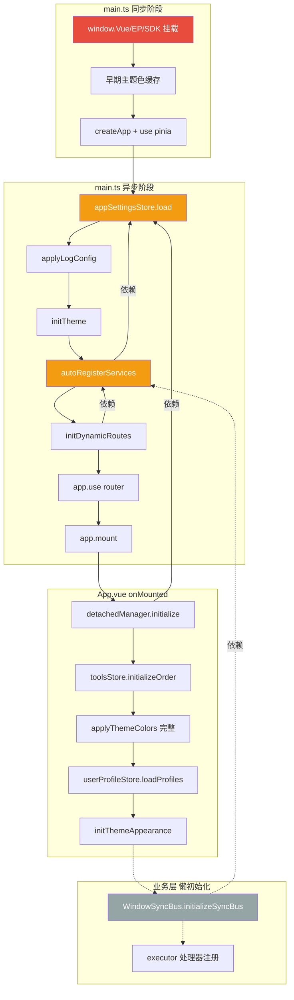

# 应用启动重构 — 影响范围与副作用分析报告

**状态**: 调查完成
**创建时间**: 2026-04-08
**关联文档**: [app-startup-refactor.md](./app-startup-refactor.md)
**调查范围**: 插件注册、通信总线、初始化时序、跨窗口同步

---

## 一、调查方法

逐行审查了以下文件的初始化逻辑和依赖关系：

| 文件                                                                                         | 行数 | 角色                     |
| -------------------------------------------------------------------------------------------- | ---- | ------------------------ |
| [`src/main.ts`](../../src/main.ts)                                                           | 339  | 应用入口，异步初始化编排 |
| [`src/App.vue`](../../src/App.vue)                                                           | 420  | 主窗口根组件             |
| [`src/views/DetachedWindowContainer.vue`](../../src/views/DetachedWindowContainer.vue)       | 237  | 分离工具窗口容器         |
| [`src/views/DetachedComponentContainer.vue`](../../src/views/DetachedComponentContainer.vue) | 328  | 分离组件窗口容器         |
| [`src/services/auto-register.ts`](../../src/services/auto-register.ts)                       | 180  | 工具/插件自动注册        |
| [`src/composables/useWindowSyncBus.ts`](../../src/composables/useWindowSyncBus.ts)           | 764  | 跨窗口通信总线           |
| [`src/composables/useDetachedManager.ts`](../../src/composables/useDetachedManager.ts)       | 319  | 分离窗口生命周期管理     |
| [`src/router/index.ts`](../../src/router/index.ts)                                           | 126  | 路由系统                 |
| [`src/stores/tools.ts`](../../src/stores/tools.ts)                                           | 164  | 工具状态管理             |
| [`src/stores/appSettingsStore.ts`](../../src/stores/appSettingsStore.ts)                     | 82   | 应用设置                 |
| [`src/config/detachable-components.ts`](../../src/config/detachable-components.ts)           | 56   | 可分离组件注册表         |

---

## 二、现有初始化时序图

### 2.1 主窗口完整启动序列

```
main.ts (同步阶段)
│
├── 1. 全局挂载: window.Vue / ElementPlus / AiohubSDK / AiohubUI  ← 插件前提
├── 2. 早期主题色: localStorage → applyThemeColors()               ← 防闪烁
├── 3. 根组件选择: pathname → App / DetachedWindow / DetachedComponent
├── 4. createApp(rootComponent)
├── 5. app.use(ElementPlus) + app.use(pinia)
├── 6. 注册全局组件: PluginUI.components
├── 7. 注册全局错误处理器
│
└── initializeApp() (异步阶段)
    │
    ├── 8.  appSettingsStore.load()           ← 从磁盘读取 JSON，无副作用
    ├── 9.  applyLogConfig(settings)          ← 配置日志级别
    ├── 10. initTheme()                       ← 主题系统初始化
    ├── 11. initMonacoShikiThemes()           ← 异步，不阻塞
    ├── 12. autoRegisterServices()            ← 全量扫描 .registry.ts
    │       ├── 12a. Vite glob 扫描所有模块
    │       ├── 12b. 逐个加载并注册 toolConfig → toolsStore.addTool()
    │       ├── 12c. 实例化 ToolRegistry → toolRegistryManager.register()
    │       ├── 12d. pluginManager.initialize() + loadAllPlugins()
    │       ├── 12e. toolsStore.initializeOrder()  ← ⚠️ 第一次调用
    │       └── 12f. toolsStore.setReady()
    ├── 13. startupManager.run()              ← 启动项任务（异步，不阻塞）
    ├── 14. initDynamicRoutes()               ← 依赖 toolsStore.tools
    ├── 15. app.use(router)
    └── 16. app.mount('#app')

App.vue onMounted (挂载后阶段)
│
├── 17. detachedManager.initialize()          ← Tauri 事件监听 + 后端查询
├── 18. toolsStore.initializeOrder()          ← ⚠️ 第二次调用（重复）
├── 19. applyLogConfig(settings)              ← ⚠️ 重复调用
├── 20. applyThemeColors(settings)            ← 完整色系应用
├── 21. userProfileStore.loadProfiles()       ← 用户档案加载
├── 22. initThemeAppearance()                 ← 壁纸/透明度/模糊
├── 23. Tauri listen: navigate-to-settings
├── 24. Tauri listen: window-detached
├── 25. Tauri listen: window-attached
└── 26. Tauri listen: request-close-confirmation
```

### 2.2 分离窗口启动序列（以 DetachedWindowContainer 为例）

```
main.ts (同步 + 异步)
│
├── 1-7.  同主窗口
└── initializeApp()
    ├── 8-10. 同主窗口
    ├── 12.   autoRegisterServices(priorityToolId)
    │         └── 仅加载优先级工具
    ├── 14-16. 路由 + 挂载
    └── 17.   setTimeout(1s) → resumeLoading()  ← 延迟加载剩余工具

DetachedWindowContainer.vue onMounted
│
├── 18. detachedManager.initialize()
├── 19. initThemeAppearance()                 ← 无参数
├── 20. applyThemeColors(settings)            ← 完整色系
├── 21. watch(toolsStore.isReady) → 加载工具组件
├── 22. checkIfFinalized()                    ← invoke("get_all_detached_windows")
└── 23. listen("finalize-component-view")
```

---

## 三、副作用与风险分析

### 3.1 插件注册系统

#### 现状

[`autoRegisterServices()`](../../src/services/auto-register.ts:38) 是插件系统的核心入口，执行以下操作：

1. Vite `import.meta.glob` 扫描所有 `*.registry.ts`
2. 逐个动态导入并注册 `toolConfig`（UI 配置）和 `ToolRegistry`（服务接口）
3. 调用 [`pluginManager.initialize()`](../../src/services/auto-register.ts:144) + `loadAllPlugins()`
4. 最终调用 [`toolsStore.setReady()`](../../src/services/auto-register.ts:154)

#### 重构影响

| 风险项                                  | 等级   | 详情                                                                                                                                                                                                                                     |
| --------------------------------------- | ------ | ---------------------------------------------------------------------------------------------------------------------------------------------------------------------------------------------------------------------------------------- |
| 插件 SDK 全局挂载时序                   | **高** | [`main.ts:41-45`](../../src/main.ts:41) 将 `Vue`/`ElementPlus`/`AiohubSDK`/`AiohubUI` 挂载到 `window`。这是所有 JS 插件运行的前提。重构 `main.ts` 时**必须保留这些同步操作**，且必须在 `autoRegisterServices` 之前执行。                 |
| 两阶段加载的兼容性                      | **高** | 分离窗口使用 `priorityToolId` 实现优先加载（[`main.ts:224-232`](../../src/main.ts:224)），剩余工具延迟 1 秒加载（[`main.ts:258-265`](../../src/main.ts:258)）。`appInitStore` 必须保留这种差异化策略，否则分离窗口冷启动时间会显著增加。 |
| `toolsStore.initializeOrder()` 双重调用 | **中** | 该方法在 [`auto-register.ts:153`](../../src/services/auto-register.ts:153) 和 [`App.vue:132`](../../src/App.vue:132) 各调用一次。方法本身是幂等的（从 settings 读取），但重构时应明确由 `appInitStore` 统一调用一次。                    |
| `toolsStore.isReady` 信号               | **中** | [`DetachedWindowContainer.vue:89`](../../src/views/DetachedWindowContainer.vue:89) 使用 `watch(() => toolsStore.isReady)` 决定何时加载工具组件。如果 `appInitStore` 改变了 `setReady()` 的调用时机，分离窗口的组件加载可能受影响。       |
| 插件全局组件注册                        | **低** | [`main.ts:132-134`](../../src/main.ts:132) 注册 `PluginUI.components` 为全局组件。这是同步操作，不受异步重构影响。                                                                                                                       |

#### 建议

- `appInitStore.initMainApp()` 中的服务注册步骤应直接复用 `autoRegisterServices()`，不要重新实现
- 保留 `priorityToolId` 参数传递机制
- `setReady()` 的调用位置不变（仍在 `autoRegisterServices` 内部）

---

### 3.2 通信总线 (WindowSyncBus)

#### 现状

[`WindowSyncBus`](../../src/composables/useWindowSyncBus.ts:40) 是跨窗口通信的核心，但有一个关键发现：

**目前没有任何根组件显式调用 `initializeSyncBus()`。**

- [`useDetachedManager`](../../src/composables/useDetachedManager.ts) 不依赖 `WindowSyncBus`
- `App.vue`、`DetachedWindowContainer.vue`、`DetachedComponentContainer.vue` 均未调用 `initializeSyncBus()`
- 总线的实际初始化是**懒加载**的——由下游业务 Composable（如 `useLlmChatSync`）在需要时触发

#### 重构影响

| 风险项               | 等级   | 详情                                                                                                                                                                                                                                |
| -------------------- | ------ | ----------------------------------------------------------------------------------------------------------------------------------------------------------------------------------------------------------------------------------- |
| 总线初始化时机不确定 | **中** | 当前的懒加载模式意味着总线可能在应用启动后很久才初始化。重构计划中的 `useRootInit` 应该**显式调用** `initializeSyncBus()`，将其从"隐式按需"变为"显式编排"。                                                                         |
| Executor 处理器注册  | **中** | [`useWindowSyncBus.ts:706`](../../src/composables/useWindowSyncBus.ts:706) 在 `initializeSyncBus` 内部注册了全局 `executor` 操作处理器。如果总线初始化被提前到 `useRootInit`，需要确保 `toolRegistryManager` 已经注册了必要的服务。 |
| 握手消息丢失         | **低** | 分离窗口在 `initializeSyncBus` 后会自动发送握手（[`useWindowSyncBus.ts:731`](../../src/composables/useWindowSyncBus.ts:731)）。只要主窗口的总线已初始化，握手就不会丢失。                                                           |

#### 建议

- 在 `useRootInit` 中添加 `initializeSyncBus()` 调用
- 确保调用顺序：`autoRegisterServices` → `initializeSyncBus`（因为总线的 executor 处理器依赖已注册的服务）

---

### 3.3 分离窗口管理器 (DetachedManager)

#### 现状

[`useDetachedManager`](../../src/composables/useDetachedManager.ts) 是单例模式，`initialize()` 方法：

1. 注册 6 个 Tauri 事件监听器（`window-detached`、`window-attached` 等）
2. 从 Rust 后端查询现有分离窗口（[`invoke("get_all_detached_windows")`](../../src/composables/useDetachedManager.ts:118)）
3. 根据 `appSettingsStore.settings.autoAdjustWindowPosition` 启动位置检查定时器

#### 重构影响

| 风险项                       | 等级   | 详情                                                                                                                                                                                                                                  |
| ---------------------------- | ------ | ------------------------------------------------------------------------------------------------------------------------------------------------------------------------------------------------------------------------------------- |
| 对 `appSettingsStore` 的依赖 | **高** | [`useDetachedManager.ts:128`](../../src/composables/useDetachedManager.ts:128) 在 `initialize()` 内部访问 `appSettingsStore.settings`。`appInitStore` 必须确保 `appSettingsStore.load()` 在 `detachedManager.initialize()` 之前完成。 |
| 幂等性                       | **低** | `initialize()` 有 `if (initialized) return` 守卫（[第 39 行](../../src/composables/useDetachedManager.ts:39)），多次调用安全。                                                                                                        |

---

### 3.4 路由系统

#### 现状

[`initDynamicRoutes()`](../../src/router/index.ts:94) 的工作方式：

1. 读取 `toolsStore.tools`，为每个工具创建路由
2. 设置 `watch`，监听后续工具注册并自动添加路由

当前调用位置在 [`main.ts:246`](../../src/main.ts:246)，在 `autoRegisterServices` 之后、`app.use(router)` 之前。

#### 重构影响

| 风险项       | 等级   | 详情                                                                                                                                                                                                                                                                         |
| ------------ | ------ | ---------------------------------------------------------------------------------------------------------------------------------------------------------------------------------------------------------------------------------------------------------------------------- |
| 路由注册时序 | **高** | 重构计划提到"改为同步挂载"（[`app-startup-refactor.md:285`](./app-startup-refactor.md)），但如果 `app.use(router)` 在 `autoRegisterServices` 之前执行，工具路由将缺失。`initDynamicRoutes` 的 `watch` 机制可以补救（后续注册的工具会自动添加路由），但首次导航可能命中 404。 |
| 分离窗口路由 | **低** | 分离窗口的路由（`/detached-window/:toolPath`）是静态定义的（[`router/index.ts:48-57`](../../src/router/index.ts:48)），不受动态路由影响。                                                                                                                                    |

#### 建议

重构后的 `main.ts` 应保持以下顺序：

```
app.use(pinia) → appInitStore.init() → initDynamicRoutes() → app.use(router) → app.mount()
```

或者，如果要实现"同步挂载"，则必须依赖 `initDynamicRoutes` 的 `watch` 机制来处理后续注册的工具路由。

---

### 3.5 主题系统

#### 现状

主题初始化分为三层：

| 层级 | 函数                                    | 职责                               | 调用位置                                                  |
| ---- | --------------------------------------- | ---------------------------------- | --------------------------------------------------------- |
| 1    | `applyThemeColors({ primary: cached })` | 从 localStorage 读取缓存色，防闪烁 | [`main.ts:106-115`](../../src/main.ts:106)（同步 IIFE）   |
| 2    | `initTheme()` / `useTheme()`            | 初始化明暗模式                     | [`main.ts:214`](../../src/main.ts:214) + 三个根组件 setup |
| 3    | `initThemeAppearance()`                 | 壁纸/透明度/模糊/色彩叠加          | 三个根组件 onMounted                                      |

#### 重构影响

| 风险项                         | 等级   | 详情                                                                                                                                                                       |
| ------------------------------ | ------ | -------------------------------------------------------------------------------------------------------------------------------------------------------------------------- |
| 早期主题色缓存                 | **低** | [`main.ts:106-115`](../../src/main.ts:106) 的同步 IIFE 必须保留在 `main.ts` 中（在 Vue 应用创建前执行），不能移入 `appInitStore`。                                         |
| `initThemeAppearance` 参数差异 | **低** | `App.vue` 和 `DetachedWindowContainer` 调用时无参数，`DetachedComponentContainer` 传入 `true`（禁用根壁纸）。`useRootInit` 的 `isDetachedComponent` 选项已正确处理此差异。 |

---

### 3.6 `applyLogConfig` 重复定义

#### 现状

[`main.ts:54-85`](../../src/main.ts:54) 和 [`App.vue:97-117`](../../src/App.vue:97) 各有一份完全相同的 `applyLogConfig` 函数定义。

#### 重构影响

无风险。重构计划中的 `src/utils/logConfig.ts` 提取方案完全正确，两处改为 import 即可。

---

## 四、隐藏依赖图



红色 = 必须保留在 main.ts 同步阶段
橙色 = 时序敏感，顺序不可调换
灰色 = 当前隐式初始化，建议显式化

---

## 五、对重构计划的修订建议

### 5.1 `appInitStore` 初始化序列修订

原计划的步骤 6 是 `initDetachableManager()`，但缺少了 `WindowSyncBus` 的显式初始化。建议修订为：

| 步骤 | 任务                                    | 完成进度 | 备注                         |
| ---- | --------------------------------------- | -------- | ---------------------------- |
| 1    | `appSettingsStore.load()`               | 10%      | 无副作用，安全               |
| 2    | `applyLogConfig()`                      | 15%      | 从新模块 `logConfig.ts` 导入 |
| 3    | `initTheme()` + `initThemeAppearance()` | 30%      |                              |
| 4    | `autoRegisterServices(priorityToolId?)` | 60%      | 保留两阶段设计               |
| 5    | `userProfileStore.loadProfiles()`       | 70%      |                              |
| 6    | `startupManager.run()`                  | 80%      | 仅主窗口                     |
| 7    | `detachedManager.initialize()`          | 90%      | 依赖步骤 1                   |
| 8    | `initializeSyncBus()`                   | 95%      | **新增**，依赖步骤 4         |
| 9    | 标记 ready                              | 100%     |                              |

### 5.2 `main.ts` 重构约束

以下操作**必须保留在 `main.ts` 中**，不能移入 `appInitStore`：

1. `window.Vue` / `window.ElementPlus` / `window.AiohubSDK` / `window.AiohubUI` 全局挂载（[第 41-45 行](../../src/main.ts:41)）
2. 早期主题色缓存读取（[第 106-115 行](../../src/main.ts:106)）
3. `app.use(pinia)` 必须在所有 store 使用之前
4. 全局错误处理器注册（`app.config.errorHandler`、`unhandledrejection`、`error`）
5. 根组件选择逻辑（`isDetachedWindow()` / `isDetachedComponentLoader()`）
6. `PluginUI.components` 全局组件注册

### 5.3 `useRootInit` 补充

建议在 `useRootInit` 中增加 `initializeSyncBus()` 调用：

```typescript
export function useRootInit(options?: { isDetachedComponent?: boolean }) {
  useTheme();

  onMounted(async () => {
    await detachedManager.initialize();
    await initThemeAppearance(options?.isDetachedComponent ?? false);
    applyThemeColors(/* ... */);

    // 新增：显式初始化通信总线
    await initializeSyncBus();
  });

  onUnmounted(() => {
    cleanupThemeAppearance();
  });
}
```

### 5.4 需要额外注意的边界情况

1. **`DOMContentLoaded` 文件拖拽监听**（[`main.ts:280-339`](../../src/main.ts:280)）：这段代码独立于 Vue 生命周期，重构时应保留在 `main.ts` 中或迁移到 `MainLayout.vue`。
2. **`watch(isDark)` 主题色重应用**（[`App.vue:59-70`](../../src/App.vue:59)）：这个 watcher 应迁移到 `MainLayout.vue`，因为它涉及 UI 层面的响应。
3. **`isSpecialRoute` 计算属性**（[`App.vue:45-49`](../../src/App.vue:45)）：重构后 `App.vue` 不再需要此判断，因为分离窗口有独立的根组件。但 `MainLayout.vue` 也不需要，因为它只在主窗口中渲染。可以安全删除。

---

## 六、结论

重构计划整体可行，核心风险集中在**初始化时序**而非功能破坏。主要修订点：

1. 将 `WindowSyncBus` 的显式初始化纳入编排序列
2. 消除 `toolsStore.initializeOrder()` 的双重调用
3. 保留 `main.ts` 中的 6 项同步前置操作
4. 保留分离窗口的两阶段加载策略

重构不会破坏插件注册机制和通信总线的核心功能，但会将多个"隐式初始化"转变为"显式编排"，这是一个正向改进。
