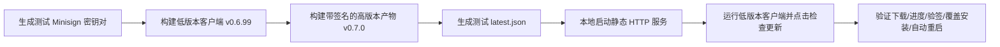

# 桌面客户端应用内增量更新（Tauri Updater）实测与验收方案

本文档记录桌面端 Tauri Updater 应用内自动更新机制的调查现状、潜在风险及端到端实测验证方案。

## 1. 调查现状与链路梳理

经过代码与构建流程排查，应用内更新系统在以下层面均已存在实现：

- **Rust 后端**：
  - 引入了 `tauri-plugin-updater = "2"`（[`src-tauri/Cargo.toml:39`](src-tauri/Cargo.toml:39)）；
  - 在 [`src-tauri/src/lib.rs:182`](src-tauri/src/lib.rs:182) 中完成注册；
  - 在 [`src-tauri/tauri.conf.json:41-50`](src-tauri/tauri.conf.json:41) 中配置了 endpoints、Minisign 公钥以及 Windows passive 安装模式。
- **前端交互**：
  - [`src/services/app-updater.ts:185`](src/services/app-updater.ts:185) 提供了 `checkForAppUpdate`、`downloadAndInstallAppUpdate`、`relaunchApp`；
  - [`src/composables/useAppUpdater.ts:38`](src/composables/useAppUpdater.ts:38) 维护状态与下载百分比；
  - [`src/views/Settings/about/AboutSettings.vue:111`](src/views/Settings/about/AboutSettings.vue:111) 提供了检查更新入口、弹窗和下载进度显示。
- **构建与发布流水线**：
  - [`.github/workflows/build.yml:217`](.github/workflows/build.yml:217) 会收集构建产物中的 `.sig`、`.zip`、`.tar.gz`；
  - [`scripts/generate-updater-manifest.ts:149`](scripts/generate-updater-manifest.ts:149) 负责扫描有 `.sig` 的产物并生成 `latest.json`。

## 2. 长期未实测原因与关键风险排查

1. **本地开发无私钥降级**：
   [`scripts/build.ts:148`](scripts/build.ts:148) 在未检测到 `TAURI_SIGNING_PRIVATE_KEY` 环境变量时，会自动剔除 pubkey 并将 `createUpdaterArtifacts` 置为 false，导致日常本地打包默认不生成 updater 产物与签名。
2. **GitHub Releases latest.json 路由死锁**：
   配置指向 `https://github.com/miaotouy/aio-hub/releases/latest/download/latest.json`。GitHub 规则下 Draft 和 Pre-release 均不指向 `latest`，测试发布容易获取不到清单或拿到旧正式版。
3. **Windows 进程退出与文件锁竞争**：
   Windows 下采用 `passive` 安装模式，旧应用退出与新安装器覆盖存在时间差，需验证是否会因未完全释放进程而导致更新中断。
4. **便携版与安装版边界**：
   需明确便携版（`-Portable.exe`）是否会被引导走安装流程。

## 3. 实测验证计划

### 阶段一：本地 Mock 闭环实测（推荐优先）

无需在线上发版，利用本地 HTTP 服务模拟 GitHub Release。



- [x] **步骤 1**：生成临时测试签名密钥：
  ```bash
  bunx tauri signer generate -w ./test-updater.key
  ```
- [x] **步骤 2**：在临时配置文件中将 endpoint 指向 `http://127.0.0.1:4000/latest.json`，并填入测试公钥。
- [x] **步骤 3**：打包旧版本应用并启动运行。
- [x] **步骤 4**：使用测试私钥打包新版本产物（生成 `.nsis.zip` 和 `.sig`）。
- [x] **步骤 5**：通过脚本生成 `latest.json` 并在 4000 端口启动静态服务。
- [x] **步骤 6**：在旧版客户端点击“检查更新”，验证全流程交互与安装重启结果。

#### 阶段一实测记录（2026-10-02）

**结论：本地 Mock 闭环全流程验证通过**。检查更新 → 清单验签 → 下载进度 → 产物验签 → passive 覆盖安装 → 自动重启，全部成功，未卡壳。

实测偏差与关键发现：

1. **版本号调整**：计划中的 `0.6.99 → 0.7.0` 调整为 `0.7.5 → 0.7.6`。原因：实测机已安装 `0.7.0-alpha.6`，且项目未开启 `allowDowngrades`（Tauri 默认 `false`），`0.6.99` 属于降级安装，silent 模式下 NSIS 安装器会直接 Abort。
2. **HTTP endpoint 需显式放行**：release 构建（非 debug）中，updater 插件对非 HTTPS endpoint 默认抛 `InsecureTransportProtocol`。本地 Mock 测试必须在插件配置中加 `"dangerousInsecureTransportProtocol": true`（见 `tauri-plugin-updater` 源码 `config.rs` 的 `validate_endpoints`）。开发态仅 debug 构建放行。
3. **签名环境变量**：`TAURI_SIGNING_PRIVATE_KEY_PATH` 在 `tauri build` 签名阶段实测不生效（仅 `tauri signer` 相关输出提及），必须使用 `TAURI_SIGNING_PRIVATE_KEY`（私钥文件内容）+ `TAURI_SIGNING_PRIVATE_KEY_PASSWORD`。
4. **风险 3（Windows 进程退出与文件锁竞争）未复现**：passive 模式覆盖安装一次成功，无文件锁报错。
5. **风险 4（便携版边界）本次未覆盖**，留待后续单独验证。
6. 复测材料已归档：测试密钥位于 `.dev-data/updater-test/`（gitignored）；临时配置、`latest.json` 生成与静态服务脚本位于系统临时目录 `opencode/updater-test/`；`latest.json` 实际生成于 `src-tauri/target/release/bundle/nsis/` 由 Mock 服务直接托管。

### 阶段二：CI 流水线实测

- [ ] 确认 GitHub Secrets 中已配置 `TAURI_SIGNING_PRIVATE_KEY` 与可选密码。
- [ ] 发起测试 Tag 构建，走查 Release 产物中是否包含 `latest.json` 与 `.nsis.zip.sig`。
- [ ] 验证真实网络环境下，下载超时与 GitHub 访问受限时的降级提示。
