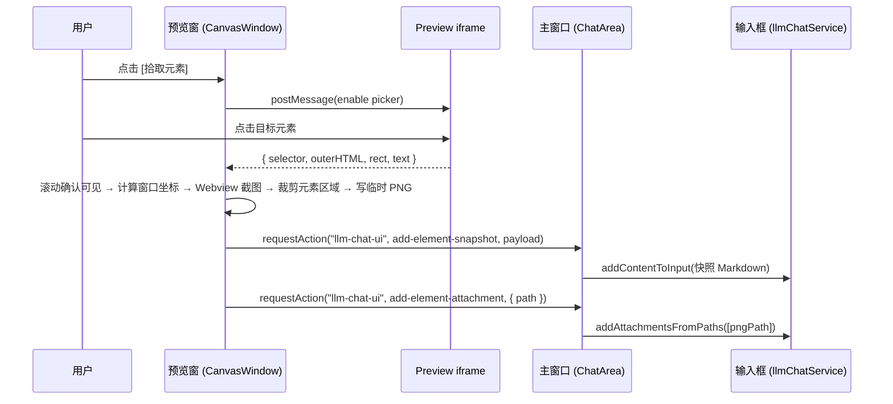

# Web Canvas 演示稿生成与预览增强计划（平替 Open Design）

> 状态：候选（方案已确认，等待排期）
>
> 涉及模块：`web-canvas`、`llm-chat`、`web-distillery`（复用）、`src-tauri`
>
> 目标版本：未定

## 1. 背景与目标

Open Design 的核心能力是"PPT 项目稿生成器"，但它的 CLI 调用链路脆弱：模型空回复或网络波动导致整个任务停止，没有继续按钮、没有自动重试，体验断裂。并且最大的提示是一个使用它家云套餐的按钮，吃相难看。

AIO Hub 不需要复刻这套 CLI 架构。我们的工具调用是 **chat 原生** 的：

- LLM 通过聊天内的工具调用（`write_canvas_file` / `apply_canvas_diff` / `commit_changes`）直接驱动画布，每个动作以 `tool` 角色节点形态完整暴露在会话树中，可见、可审批、可重试。
- 错误与重试机制在聊天中已全覆盖（见第 2 节盘点），Open Design 的痛点在我们这里天然不存在。

本计划的增量目标：

1. **slide-deck 内置模板**：让画布能承载"演示稿"类项目（多 slide 文件 + 总控页）。
2. **预览窗 → 聊天联动**：元素拾取（元素快照 + 元素截图）、控制台日志发送，作为附件/文本投喂到聊天输入框（对齐 VSCode DevTools 的"将元素发送到聊天"体验）。
3. **F12 DevTools**：预览窗原生开发者工具入口。
4. **平铺视图**：幻灯片大纲平铺（Slide Sorter）与响应式多视口预览。

## 2. 现状能力盘点（已具备，不重复建设）

| 能力                 | 现有实现                                                                                      | 说明                                                                           |
| -------------------- | --------------------------------------------------------------------------------------------- | ------------------------------------------------------------------------------ |
| 工具调用循环         | `useToolCallOrchestrator`（`src/tools/llm-chat/composables/chat/useToolCallOrchestrator.ts`） | LLM 回复 → 解析 VCP 请求 → 审批 → 执行 → 回注结果 → 迭代，直到 `maxIterations` |
| 失败工具节点展示     | `ToolCallMessage.vue`                                                                         | tool 节点渲染 `error` 状态 + 错误信息（`AlertCircle`）                         |
| 重新解析并重跑工具   | bar 内"重新解析工具"（`MessageMenubar.vue:588` → `reparse-tools` → `reparseAndOrchestrate`）  | 不重请求 LLM，直接重跑已有节点中的工具调用                                     |
| 重新生成 / 继续生成  | bar 内 `regenerate` / `continue`（`MessageMenubar.vue:242/189`）                              | 失败或中断后可重新生成、续写                                                   |
| 请求自动重试         | 请求设置 `requestSettings.maxRetries` / `retryInterval` / `retryMode`（指数退避）             | 网络波动/超时自动重试，重试耗尽后节点标记 error                                |
| 空回复诊断           | `emptyResponseDiagnostic`（`useChatResponseHandler.ts:601`）                                  | 成功但正文为空的响应标记为 `abnormal` 状态并展示诊断                           |
| 输入框内容注入       | `llmChatService.addContentToInput`（`llm-chat.registry.ts:119`）                              | 向聊天输入框追加/前置文本                                                      |
| 附件注入（文件路径） | `llmChatService.addAttachmentsFromPaths`（`llm-chat.registry.ts:147`）                        | 接收本地文件路径数组，创建 pending 资产并异步导入                              |
| 跨窗口请求           | `useWindowSyncBus.requestAction` / `onActionRequest`（`src/composables/useWindowSyncBus.ts`） | 预览窗可向主窗口发起命名空间动作请求（10s 超时）                               |
| 元素拾取脚本         | `web-distillery/inject/selector-picker.js`                                                    | 可视化元素选择，生成 CSS selector + 高亮 + 悬停/选中消息                       |
| DOM 截图             | `modern-screenshot`（`src/tools/llm-chat/utils/screenshotCapture.ts`）                        | `domToCanvas` + `canvasToPngBytes`（atob 解码，符合 CSP 规范）                 |
| DevTools feature     | `src-tauri/Cargo.toml` 已启用 `tauri` 的 `devtools` feature                                   | 预览窗可调起原生开发者工具                                                     |

**结论**：chat 侧零新增即可覆盖"错误 → 展示 → 重试/继续"全链路；本计划不触碰生成链路本身，只做画布侧能力与投喂入口。

## 3. 目标能力设计

### 3.1 slide-deck 内置模板（canvas 侧）

新增 `public/canvases/templates/builtin/slide-deck/`（版本化同步机制由 `useTemplateRegistry` 已有逻辑承担）：

```
slide-deck/
├── template.json          # id: "slide-deck", entryFile: "index.html", category: "presentation"
├── preview.png            # 模板缩略图（可选）
└── files/
    ├── index.html         # 总控页：标题、导航、容器
    ├── style.css          # 主题变量 + 版式（深色/浅色主题变量由 Agent 改写）
    ├── slides.json        # 幻灯片清单：[{ id: "slide-01", title, bg }]（驱动平铺视图）
    └── slide-01.html ...  # 每页独立 slide 文件（Agent 按清单逐页生成/续写）
```

约束：

- **零外部依赖**：不依赖 Reveal.js 等 CDN（预览 CSP 允许 `http(s):`，但离线可用性优先）。
- **每页独立文件**：契合 Physical-First 与 Diff 引擎——Agent 按页追加文件、按页 diff，中断后已生成的页保留在磁盘，`getExtraPromptContext` 的文件树 + 未提交变更足以让"继续生成"无缝接续。
- `slides.json` 由模板预置骨架（3 页示例），Agent 通过工具调用维护。

### 3.2 元素拾取 → 发送到聊天（元素快照 + 截图附件）

对齐 VSCode DevTools 行为：选中元素后，向聊天输入框附件区添加 **元素快照** 与 **元素截图**。

#### 交互流程

```
预览窗标题栏 [拾取元素] ──> 向 preview iframe 注入拾取脚本（拾取模式）
用户悬停/点击元素 ──> iframe 内生成 { selector, tagName, outerHTML(限长), 文本摘要, 元素 rect }
  │
  ├─ 快照：postMessage 回传预览窗主组件
  │         └─ requestAction("llm-chat-ui", { action: "add-element-snapshot", payload })
  │               └─ ChatArea handler → addContentToInput(格式化快照文本)
  │
  └─ 截图：预览窗计算元素在窗口中的绝对坐标
            └─ 窗口截图 → 按坐标裁剪 → 写入临时 PNG
                  └─ requestAction("llm-chat-ui", { action: "add-element-attachment", path })
                        └─ ChatArea handler → addAttachmentsFromPaths([path])
```

#### 快照内容与限长

- `selector`（完整 CSS 路径，复用 selector-picker 的 `getSelector` 算法）
- `tagName`
- `outerHTML`：截断至 8 KB（超出部分省略并在快照中标注）
- 文本摘要：`innerText` 前 200 字符
- 快照以 Markdown 代码块文本注入输入框（复用 `addContentToInput`），不落盘

#### 截图方案对比

| 方案                                       | 原理                                                                                                      | 优点                                                                                                                                                      | 风险                                                                                                              |
| ------------------------------------------ | --------------------------------------------------------------------------------------------------------- | --------------------------------------------------------------------------------------------------------------------------------------------------------- | ----------------------------------------------------------------------------------------------------------------- |
| **A. Webview 窗口截图 + 坐标裁剪（推荐）** | Tauri Webview 原生截图（Windows WebView2 原生支持；Cargo 已有 `image-png` feature），再按元素绝对坐标裁剪 | 原生渲染，支持 canvas / WebGL / 复杂合成内容；实现简单（坐标 = iframe 内 `getBoundingClientRect` + iframe 在窗口中的偏移，按 `scaleFactor` 换算物理像素） | 需要元素滚动到视口内（拾取时先 `scrollIntoView`）；macOS/Linux 的窗口截图 API 表现需真机验证                      |
| **B. iframe 内 `domToCanvas`（备选）**     | 复用 `modern-screenshot`，在 iframe 内克隆 DOM 离屏渲染                                                   | 不依赖窗口可见性                                                                                                                                          | 预览 CSP 的 `connect-src` 不含 `asset:`，资源加载可能失败；opaque origin 下脚本注入复杂；合成效果与真实渲染有偏差 |

若方案 A 在部分平台不可用，降级到方案 B 并在快照中注明"截图降级"；两种方案失败都不影响快照文本注入。

#### 跨窗口通道

复用 `ChatArea.vue:448` 已有的 `llm-chat-ui` 命名空间（`onActionRequest`），新增两个 action：

- `add-element-snapshot`（文本注入）
- `add-element-attachment`（文件附件注入，入参为文件路径）

主窗口没有打开 ChatArea 时的降级：将快照复制到剪贴板，并提示用户粘贴；截图文件保留在临时目录供手动取用。

### 3.3 控制台日志发送到聊天

现有 console 捕获链路已完整（`useCanvasPreview.ts` 注入脚本 → `CanvasPreviewPane` postMessage → 预览窗消息列表）。

新增入口：预览窗标题栏/状态栏"发送日志到 AI"按钮，路由决策：

| 日志规模        | 处理方式                                                                                             |
| --------------- | ---------------------------------------------------------------------------------------------------- |
| 总字符数 ≤ 2000 | 格式化为 ` ```log ` 代码块，`addContentToInput` 内联注入                                             |
| 总字符数 > 2000 | 写入 `{canvas}/logs/preview-console-{timestamp}.log`，`addAttachmentsFromPaths([path])` 挂为文件附件 |

日志文件写入当前画布项目目录内的 `logs/` 子目录（需排除在 `.gitignore`/Git 提交之外，避免污染画布仓库——实现时在 `GitInternalService` 过滤规则中加入 `logs/`）。日志行数与单行长度沿用 `CanvasPreviewPane` 现有上限（100 条 / 8000 字符）。

支持与元素快照组合发送（一次操作同时带上元素 + 相关日志）。

### 3.4 F12 DevTools

- `src-tauri/Cargo.toml` 已启用 `devtools` feature；在 `commands/canvas_window.rs` 新增命令 `toggle_canvas_window_devtools(app, canvas_id)`（存在性检查 + `open_devtools` / `close_devtools` / 状态查询），并注册到 `generate_handler!`。
- 入口：预览窗标题栏按钮 + 预览窗内 `F12` 快捷键（`keydown` 监听）。
- 作用域：仅 `canvas-win-*` 窗口，不影响主窗口。

### 3.5 平铺视图（Slide Sorter / 响应式多视口）

预览窗 `CanvasWindow.vue` 增加视图模式切换（复用 `CanvasPreviewPane` 渲染内核）：

| 视图         | 内容                                                                                                                                                                                                |
| ------------ | --------------------------------------------------------------------------------------------------------------------------------------------------------------------------------------------------- |
| 单一预览     | 现状不变                                                                                                                                                                                            |
| 幻灯片平铺   | 检测到 `slides.json` 时启用：CSS Grid 渲染多个 mini-iframe，URL hash 定位（`index.html#/slide-01`），`transform: scale` 等比缩放；点击卡片跳转编辑对应 slide 文件；提供当前页高亮与"应用当前页"动作 |
| 响应式多视口 | 三个并排 iframe：Desktop 1200px / Tablet 768px / Mobile 375px，同屏调试响应式                                                                                                                       |

实现约束：

- 平铺 iframe 复用同一 `srcdoc` 注入链路（CSP / console 捕获 / 错误回传），与单页预览共用 `useCanvasPreview`，避免各自维护注入脚本。
- 缩放使用 CSS `transform: scale` + `transform-origin: top left`，外层容器按缩放比预留尺寸，避免滚动条错位。
- 平铺视图下禁用元素拾取（拾取仅在单一预览视图可用），避免坐标系混淆。

## 4. 数据流

### 4.1 元素拾取（快照 + 截图）



### 4.2 日志发送

````mermaid
sequenceDiagram
    participant Frame as Preview iframe
    participant Window as 预览窗
    participant Chat as 主窗口 (ChatArea)

    Frame->>Window: postMessage(canvas-console, 累积消息)
    User->>Window: 点击 [发送日志到 AI]
    alt 日志 ≤ 2000 字符
        Window->>Chat: requestAction("llm-chat-ui", add-logs-text, { text })
        Chat->>Chat: addContentToInput(```log ... ```)
    else 日志 > 2000 字符
        Window->>Window: 写入 {canvas}/logs/preview-console-{ts}.log
        Window->>Chat: requestAction("llm-chat-ui", add-logs-attachment, { path })
        Chat->>Chat: addAttachmentsFromPaths([logPath])
    end
````

## 5. 实施阶段

| 阶段    | 内容                                                                    | 验证方式                                                                                     |
| ------- | ----------------------------------------------------------------------- | -------------------------------------------------------------------------------------------- |
| Phase 1 | slide-deck 模板 + 日志发送到聊天（含 `logs/` 排除 Git）                 | 前端构建 + 类型检查；真实 Tauri 预览窗手动验收（普通浏览器只能验证 mock 场景，见 AGENTS.md） |
| Phase 2 | 元素拾取 + 元素快照 + 截图（先验证方案 A 的跨平台表现，失败降级方案 B） | 同 Phase 1；Windows 必须真机验证 Webview 截图                                                |
| Phase 3 | F12 DevTools 命令 + 预览窗快捷键                                        | `cargo check` / 构建；Tauri 真实窗口验收                                                     |
| Phase 4 | 平铺视图（slide sorter + 响应式多视口）                                 | 真实 Tauri 窗口验收多 iframe 渲染与缩放                                                      |

## 6. 复用与边界约束

- **selector-picker 复用方式**：`selector-picker.js` 是 `web-distillery` 内部资源（通过 `?raw` 导入）。为避免跨工具 import 耦合，剪裁为 canvas 专用脚本放 `src/tools/web-canvas/inject/element-picker.js`，保留 `getSelector` 算法与高亮 UI，通信桥改用 canvas 预览既有 `postMessage` 协议（`canvas-console` 同源校验模式），不引用 `__DISTILLERY_BRIDGE__`。
- **截图坐标换算**：元素窗口坐标 = iframe 内 `rect`（含 `window.scrollX/Y`）+ iframe 在预览窗中的偏移；最终裁剪使用物理像素（乘 `scaleFactor`）。`rect` 超出窗口可视区时先 `scrollIntoView({ block: "center" })` 再截。
- **附件链路**：截图/日志文件先落盘再走 `addAttachmentsFromPaths`，复用既有 pending 资产 → 后台导入管线；不引入新的附件类型。
- **跨窗口超时**：`requestAction` 硬编码 10s 超时，失败时按 3.2 的降级策略处理（剪贴板）。
- **日志文件不进 Git**：`GitInternalService` 过滤规则追加 `logs/` 目录；`.canvas.json` 不做变更。
- **不做**：不在画布/预览窗造"生成进度"或"继续生成"按钮——这些由 chat 的消息 bar（regenerate / continue / reparse-tools）承担，本计划不复制。

## 7. 测试计划

- 纯函数单测：日志路由决策（阈值分流）、快照限长与格式化、坐标换算（iframe 偏移 + DPR）。
- 组件/集成测试：跨窗口 action 处理器（`llm-chat-ui` 新 action 的 handler 单测）。
- Tauri 真实窗口：预览窗截图与裁剪、F12 DevTools 调起、平铺视图多 iframe（参照 `tests/tauri-e2e/` 与 `tests/windows-ui-automation/` 边界说明）。

## 8. 未决问题

1. Webview 原生截图在 macOS / Linux 平台的行为（方案 A 的可移植性）——Phase 2 开工前用最小原型验证。
2. 平铺视图多 iframe 的内存占用（每 iframe 独立 webview 上下文）——在 20+ slide 规模下测量，必要时改为"懒加载可见卡片 + 不可见卡片静态占位"。
3. DevTools 入口是否同时加入主窗口（画布内嵌编辑场景），还是仅预览窗——倾向仅预览窗，减少能力面。
