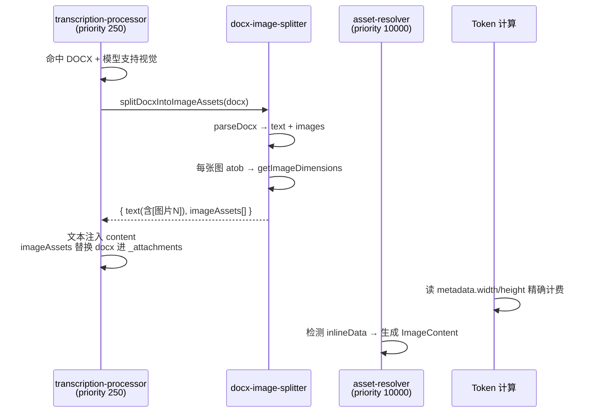

# 实施计划：DOCX 插图拆分（临时多模态直发）

## 1. 背景与目标

- **现状**：当上传带插图的 `.docx` 文件时，主对话模型即使支持视觉能力（`capabilities.vision = true`），也无法直接看到插图，只能看到转写引擎生成的文字描述（或占位符）。
- **目标**：在主模型支持视觉时，将 `.docx` 内的插图提取为**临时图片附件**，直接作为多模态内容发送。文本中保留 `[图片 N]` 占位符以建立对应关系。整个过程对用户透明，不污染资产库。
- **非目标**：
  - 不修改 UI（附件卡片列表保持原样）。
  - 不注册正式 Asset（不使用 AssetManager）。

## 2. 设计决策

### 2.1 路线选择

选用**路线 1：最小 Asset + 内联数据**。

- 发送管道（`asset-resolver`）和 Token 计算（`calculateMessageTokens`）都能识别这个形状。
- base64 数据永不进入文本分词器，避免了“本地分词器对 base64 支持不好”的问题。

### 2.2 对用户透明

- 拆分的插图 Asset 存在于内存 `msg._attachments` 中，但**不渲染**到 UI 的附件卡片区域（`AttachmentCard` 列表）。
- 用户仍然只在聊天界面看到原始的 `.docx` 附件卡片——反正文档本身支持点开预览。

## 3. 数据形状：临时插图 Asset

```typescript
{
  id: `docx-img-${docxAsset.id}-${img.index}`, // 内存唯一标识，不入库
  type: "image",
  name: `${docxAsset.name} - 图片 ${img.index}`,
  path: "",                                     // 无磁盘路径
  size: img.estimatedBytes,
  mimeType: img.mimeType,
  sourceModule: "llm-chat-docx-split",
  createdAt: new Date().toISOString(),
  origins: [],
  importStatus: "complete",
  metadata: { width: dims.width, height: dims.height },  // ← Token 侧吃
  inlineData: { base64: img.base64, mimeType: img.mimeType }, // ← 发送侧吃
}
```

## 4. 改动清单

### 4.1 ✅ 扩展类型定义 (`src/types/asset-management.ts`)

在 `Asset` 接口中新增可选的 `inlineData` 字段：

```typescript
inlineData?: {
  base64: string;
  mimeType: string;
};
```

### 4.2 ✅ 新建拆分工具 (`src/tools/llm-chat/core/context-utils/docx-image-splitter.ts`)

导出 `splitDocxIntoImageAssets(docxAsset: Asset)`，职责：

1. 读取 `.docx` 二进制数据（复用 `assetManagerEngine.getAssetBinary`）。
2. 调用 `parseDocx(buffer)` 提取文本和图片。
3. 对每张图片用纯 JS 解码 base64（CSP 合规），然后用 `getImageDimensions` 获取宽高。
4. 组装上述“临时插图 Asset”数组。

### 4.3 ✅ 接入拦截逻辑 (`src/tools/llm-chat/core/context-processors/transcription-processor.ts`)

在消息附件循环中，**优先判断 DOCX + 视觉能力**：

```
if (isDocxAssetLike(asset) && context.capabilities.vision) {
  // 1. 调 splitDocxIntoImageAssets
  // 2. 文本（含 [图片 N]）注入 content
  // 3. 临时插图 Asset 替换原 docx 进 _attachments
  // 4. 原 docx 移除（下层的 asset-resolver 不再处理）
}
```

不支持视觉时，**完全保留现有转写引擎路径**。

### 4.4 ✅ 资产解析器识别内联数据 (`src/tools/llm-chat/core/context-processors/asset-resolver.ts`)

在 `processImageAsset` 或 `execute` 循环中前置判断：

```
if (asset.inlineData) {
  // 纯 JS 解码 base64，跳过 getAssetBinary(asset.path)
}
```

其余缩放/转换逻辑复用现有 `processImageAsset`。

### 4.5 ❌ UI 改动

**零改动，不渲染**。

## 5. 流程总览



## 6. 安全约束验证

| 约束                         | 状态                                                  |
| ---------------------------- | ----------------------------------------------------- |
| base64 不泄漏进分词器        | ✅ 走 `_attachments`(Asset) 路径，不进 `content` 文本 |
| CSP 合规(禁止 fetch dataUrl) | ✅ `atob()` + `Uint8Array`                            |
| 不污染资产库                 | ✅ 无 AssetManager 调用                               |
| 管道顺序正确                 | ✅ TP(250) < TL(600) < AR(10000)                      |
| 现存路径不受影响             | ✅ 不支持视觉时完全保留                               |

## 7. 前置准备

- [x] 确认 `getImageDimensions` 接口（吃 ArrayBuffer，主线程 Canvas API）
- [x] 确认 Token 计算只读 `metadata.width/height`
- [x] 确认 token-limiter 只拼接 text 块，不碰 base64
- [x] 确认发送管道的 `ImageContent` 格式
- [x] 确认方案：用户拍板“路线 1”+“方案 a（对用户透明）”
