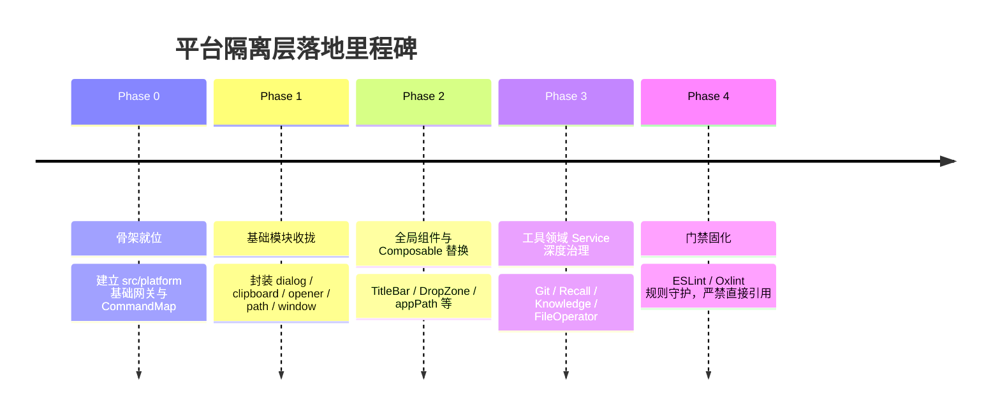

# AIO Hub 前端平台隔离层与类型安全桥接方案 (Platform Bridge)

> 状态：待实施 (Ready for Implementation)  
> 版本：v1.0.0  
> 提出日期：2026-10-04  
> 编制人：咕咕（架构师）  
> 关联调查文档：[`docs/design/地基迁移调查/webview2-migration-investigation.md`](../design/地基迁移调查/webview2-migration-investigation.md)  
> 上级工程规划：[`docs/Plan/electron-migration-master-plan.md`](./electron-migration-master-plan.md:84) (阶段零)  
> 总体计划索引：[`docs/Plan/README.md`](./README.md)

---

## 1. 战略动机与核心目标

### 1.1 现状与痛点

AIO Hub 当前拥有 40+ 个垂类工具及多个后台服务，前端业务规模快速增长。经过全量代码扫描，前端与底座运行时的耦合存在如下严重隐患：

1. **调用点极度分散，裸调用泛滥**：
   - 前端存在约 **493 处** 直接导入 `@tauri-apps/*` 的语句，分散在 **240+ 个文件** 中（包括许多直接处理 UI 的 `.vue` 单文件组件）；
   - 前端通过 `invoke("cmd_name", args)` 调用的 Rust 后端命令涉及约 **250 个独立命令名**，累计调用点位超过 **540 处**。
2. **缺乏编译期类型安全，运行时故障难捕获**：
   - 绝大多数 `invoke` 都是裸字符串传参。如果 Rust 侧重构、命令重命名、增删入参字段或改变返回类型，前端构建（TypeScript / Vite）完全无法感知，只能在运行时暴雷；
   - 依赖调用方在每个文件各自手写 `<ReturnType>` 泛型，极易出现类型声明与后端实际返回值不一致。
3. **接口碎片化与标准不一**：
   - 文件系统操作存在 `plugin-fs`（如 `readTextFile`）与 Rust 强力指令（如 `read_text_file_force`）随意混用；
   - 原生对话框 `plugin-dialog` 在不同工具中派生出 `openDialog`、`openFile`、`saveFile` 等 5 种别名，无法统一配置安全过滤器或默认目录；
   - 路径处理虽有 `src/utils/appPath.ts` 的规范约束，但缺乏编译期硬隔离，仍有零散直接调用底座路径 API 的情况。
4. **底座演进被严重绑架**：
   - 无论未来是实施 Electron 迁移（见规划主纲），还是在 Web 浏览器环境中开发与组件测试（Storybook / Vite Test），前端都无法轻易摆脱对真实 Tauri IPC 的强依赖。

### 1.2 建设目标

本方案旨在前端 `src/platform/` 建设一套**集中化、强类型、防御式、平台中立**的平台隔离层（Facade / Adapter 架构）：

- **类型安全 (Type-Safe Command Map)**：为所有后端命令提供中央类型字典，命令名补全、入参检查、出参推导全部在编译期闭环，彻底杜绝拼写错误与参数漏传。
- **环境解耦 (Pluggable Runtime Engine)**：业务层统一使用 `@/platform`，屏蔽 Tauri / Electron / Browser Fallback 的差异，支持未来零成本切换底座或做端到端 Mock。
- **防御校验与统一可观测性**：在 Bridge 网关层统一拦截空值、非法路径，并无缝集成模块日志、调用耗时测量与全局错误回退。
- **渐进治理与零业务阻断**：提供平滑过渡契约（支持非类型化兜底过渡），确保在迁移的任何一个中间状态下，主应用的打包、测试与运行 100% 正常。

---

## 2. 目标拓扑架构

```mermaid
graph TD
    subgraph UIandTools [业务层 (Vue 组件 / Composables / 工具 Services)]
        VueViews[Views & Components (TitleBar, DropZone 等)]
        ToolServices[40+ 效率工具领域服务 (Git, Knowledge, Recall, OCR...)]
        ConfigLogger[基础设施 (configManager, logger 等)]
    end

    subgraph PlatformLayer [src/platform/ 统一平台隔离层 (Facade)]
        BridgeEntry[@/platform/index.ts 统一门面]

        subgraph CoreGateways [核心抽象与网关]
            TypeRegistry[Type Registry (CommandMap / EventMap)]
            Bridge[bridge.ts (Typed invoke / listen / emit)]
            Env[env.ts (Runtime Detector: Tauri | Electron | Browser | Test)]
        end

        subgraph DomainModules [通用能力模块]
            ModWindow[modules/window.ts (窗口管理/特效/状态)]
            ModFS[modules/fs.ts (文件读写/安全校验/目录操作)]
            ModPath[modules/path.ts (路径解析/AppData/标准目录)]
            ModDialog[modules/dialog.ts (统一原生对话框 open/save)]
            ModClipboard[modules/clipboard.ts (剪贴板读写/监听)]
            ModOpener[modules/opener.ts (外部打开 URL/文件管理器)]
            ModSystem[modules/system.ts (系统信息/托盘/更新/进程)]
        end
    end

    subgraph Adapters [底层运行时适配器 (Adapters)]
        TauriAdapter[Tauri 2.x Runtime Adapter (@tauri-apps/*)]
        ElectronAdapter[Future Electron Bridge Adapter (window.aiohub)]
        MockAdapter[Browser / Test Mock Fallback Adapter]
    end

    UIandTools -->|仅允许引用 @/platform| BridgeEntry
    BridgeEntry --> CoreGateways
    BridgeEntry --> DomainModules
    DomainModules --> Bridge
    Bridge --> TypeRegistry
    Bridge --> Env
    Env -.->|动态派发| TauriAdapter
    Env -.->|未来启用| ElectronAdapter
    Env -.->|开发降级| MockAdapter
```

---

## 3. 详细设计与核心接口契约

### 3.1 目录拓扑结构

新建 `src/platform/` 目录，各子文件职责如下：

```text
src/platform/
├── types/
│   ├── commands.ts             # 【核心】所有后端命令的入参、出参强类型映射字典 (CommandMap)
│   ├── events.ts               # 【核心】全局跨进程事件与 Payload 映射字典 (EventMap)
│   └── common.ts               # 基础类型定义（平台枚举、窗口位置、对话框选项等）
├── core/
│   ├── env.ts                  # 运行时环境探测（Tauri / Electron / Web / Node / Vitest）
│   ├── bridge.ts               # 强类型 invoke / listen / emit 网关，含日志与耗时埋点
│   └── errors.ts               # 统一平台错误封装 (PlatformError)
├── modules/
│   ├── window.ts               # 窗口控制：最小化、最大化、关闭、置顶、特效、配置持久化
│   ├── fs.ts                   # 统一文件与目录操作：read/write text/binary, exists, trash
│   ├── path.ts                 # 路径操作与安全解析：接管 appPath.ts，统一 getAppConfigDir
│   ├── dialog.ts               # 原生对话框：showOpenDialog, showSaveDialog, showConfirm
│   ├── clipboard.ts            # 剪贴板：readText, writeText, monitor
│   ├── opener.ts               # 外部打开：openUrl, revealInFileManager, openPath
│   └── system.ts               # 系统与运行时：getPlatformInfo, exitApp, tray, relaunch
└── index.ts                    # 门面导出入口
```

---

### 3.2 强类型命令契约 (`types/commands.ts`)

为了同时实现**强类型约束**和**老代码无缝平移**，命令注册表采用分级字典设计：

```typescript
// src/platform/types/commands.ts

export interface CommandDefinition<TArgs = void, TReturn = void> {
  args: TArgs;
  return: TReturn;
}

/**
 * 后端命令全量强类型映射表
 * 命令名必须与 Rust src-tauri/src/commands.rs 中的注册名称完全一致
 */
export interface CommandMap {
  // === 窗口控制与特效 ===
  'save_window_config': CommandDefinition<{ label: string }, void>;
  'apply_window_config': CommandDefinition<{ window: unknown }, boolean>;
  'close_detached_window': CommandDefinition<{ label: string }, void>;
  'create_tool_window': CommandDefinition<{ config: unknown }, string>;
  'focus_window': CommandDefinition<{ label: string }, void>;
  'ensure_window_visible': CommandDefinition<{ label: string }, boolean>;
  'apply_window_effect': CommandDefinition<{ effect: string }, void>;
  'set_window_shadow': CommandDefinition<{ show: boolean }, void>;
  'clear_window_state': CommandDefinition<{ label: string }, void>;

  // === 路径与文件系统 (Force / AppData 系列) ===
  'get_app_config_dir': CommandDefinition<void, string>;
  'path_exists': CommandDefinition<{ path: string }, boolean>;
  'is_directory': CommandDefinition<{ path: string }, boolean>;
  'read_text_file_force': CommandDefinition<{ path: string }, string>;
  'write_text_file_force': CommandDefinition<{ path: string; content: string }, void>;
  'read_file_binary': CommandDefinition<{ path: string }, number[]>;
  'write_file_force': CommandDefinition<{ path: string; content: number[] }, void>;
  'delete_file_to_trash': CommandDefinition<{ filePath: string }, void>;
  'create_dir_force': CommandDefinition<{ path: string }, void>;
  'copy_path_force': CommandDefinition<{ source: string; target: string; overwrite?: boolean }, void>;
  'move_path_force': CommandDefinition<{ source: string; target: string; overwrite?: boolean }, void>;
  'list_directory': CommandDefinition<{ path: string }, string[]>;
  'open_file_directory': CommandDefinition<{ path: string }, void>;

  // === 系统与运维 ===
  'exit_app': CommandDefinition<void, void>;
  'set_show_tray_icon': CommandDefinition<{ show: boolean }, void>;
  'update_tray_setting': CommandDefinition<{ enabled?: boolean; minimizeToTray?: boolean }, void>;
  'open_url': CommandDefinition<{ url: string }, void>;
  'get_local_ips': CommandDefinition<void, string[]>;
  'append_app_log': CommandDefinition<{ level: string; target: string; message: string }, unknown>;

  // === 资产系统 ===
  'get_asset_base_path': CommandDefinition<void, string>;
  'list_all_assets': CommandDefinition<void, unknown[]>;
  'remove_asset_completely': CommandDefinition<{ assetId: string }, void>;

  // === 其他业务专用模块（按阶段补充） ===
  // 如 knowledge_*, recall_*, git_*, ocr_*, wa_* 等
}

/** 支持强类型扩展机制，允许领域工具局部追加自己的指令类型 */
export type KnownCommand = keyof CommandMap;
```

---

### 3.3 核心通信网关 (`core/bridge.ts`)

```typescript
// src/platform/core/bridge.ts
import { invoke as tauriInvoke } from '@tauri-apps/api/core';
import { listen as tauriListen, emit as tauriEmit, type UnlistenFn } from '@tauri-apps/api/event';
import { currentPlatform, isTauriRuntime } from './env';
import { PlatformError } from './errors';
import { createModuleLogger } from '@/utils/logger';
import type { CommandMap, KnownCommand } from '../types/commands';
import type { EventMap, KnownEvent } from '../types/events';

const logger = createModuleLogger('platform:bridge');

/**
 * 强类型后端调用门面
 */
export async function invoke<K extends KnownCommand>(
  command: K,
  args?: CommandMap[K]['args']
): Promise<CommandMap[K]['return']>;
export async function invoke<TReturn = unknown>(
  command: string,
  args?: Record<string, unknown>
): Promise<TReturn>;
export async function invoke(command: string, args?: unknown): Promise<unknown> {
  const startTime = performance.now();
  
  if (isTauriRuntime()) {
    try {
      const result = await tauriInvoke(command, args as Record<string, unknown> | undefined);
      const cost = Math.round(performance.now() - startTime);
      if (cost > 1000) {
        logger.warn(`[SLOW_INVOKE] 命令 ${command} 耗时异常: ${cost}ms`, { command, args });
      }
      return result;
    } catch (err) {
      const cost = Math.round(performance.now() - startTime);
      logger.error(`[INVOKE_FAILED] 命令 ${command} 执行失败 (${cost}ms):`, err);
      throw new PlatformError(`调用后端命令 '${command}' 失败`, { cause: err, command, args });
    }
  }

  // 未来接入 Electron 时在此派发：
  // if (currentPlatform === 'electron') {
  //   return window.aiohub.invoke(command, args);
  // }

  // 纯 Web / 单元测试降级
  logger.warn(`[MOCK_FALLBACK] 非原生环境调用命令: ${command}`);
  throw new PlatformError(`当前环境 [${currentPlatform}] 不支持原生命令 '${command}'`, { command });
}

/**
 * 强类型跨进程事件监听
 */
export async function listen<K extends KnownEvent>(
  event: K,
  handler: (payload: EventMap[K]) => void
): Promise<UnlistenFn>;
export async function listen<TPayload = unknown>(
  event: string,
  handler: (payload: TPayload) => void
): Promise<UnlistenFn>;
export async function listen(event: string, handler: (payload: any) => void): Promise<UnlistenFn> {
  if (isTauriRuntime()) {
    return tauriListen(event, (ev) => handler(ev.payload));
  }
  return () => {};
}

/**
 * 强类型跨进程事件派发
 */
export async function emit<K extends KnownEvent>(
  event: K,
  payload: EventMap[K]
): Promise<void>;
export async function emit(event: string, payload?: unknown): Promise<void>;
export async function emit(event: string, payload?: unknown): Promise<void> {
  if (isTauriRuntime()) {
    await tauriEmit(event, payload);
  }
}
```

---

### 3.4 模块门面设计规范

#### 1. 原生对话框模块 (`modules/dialog.ts`)
收敛此前 70 处 import 和 5 种别名，统一入参与出参语义：
```typescript
// src/platform/modules/dialog.ts
export interface OpenDialogOptions {
  title?: string;
  defaultPath?: string;
  directory?: boolean;
  multiple?: boolean;
  filters?: Array<{ name: string; extensions: string[] }>;
}

export async function openFileDialog(options: OpenDialogOptions = {}): Promise<string[] | string | null> {
  // 封装 @tauri-apps/plugin-dialog 的 open
  // 提供参数防御、默认路径修正
}

export async function saveFileDialog(options: { title?: string; defaultPath?: string; filters?: Array<{ name: string; extensions: string[] }> }): Promise<string | null> {
  // 封装 @tauri-apps/plugin-dialog 的 save
}
```

#### 2. 文件与路径系统模块 (`modules/fs.ts` & `modules/path.ts`)
整合 `src/utils/appPath.ts`，统一文件读写与沙箱访问：
- `resolveAppPath(...)`：与 AGENTS.md 约束对齐，桌面端强制通过统一接口解析数据路径；
- `readTextFile(path)` / `writeTextFile(path, content)`：优先走强力无锁保障命令，提供统一 UTF-8 编码与异常转换；
- `moveToTrash(path)`：统一使用操作系统废纸篓，杜绝不可逆硬删除失误。

#### 3. 窗口控制模块 (`modules/window.ts`)
收敛 `TitleBar.vue`、`useDetachedManager.ts` 等直接调用的 Tauri 窗口方法：
- `minimizeWindow()`、`toggleMaximizeWindow()`、`closeWindow()`；
- `saveWindowConfig(label)`、`applyWindowConfig(label)`；
- `setWindowVibrancy(effect)`、`setWindowShadow(show)`。

---

## 4. 实施阶段与执行待办

为确保改造过程中**业务零阻断、打包零故障、测试零回退**，本方案采用四阶段递进实施：



### Phase 0：基础设施与核心网关搭建（当前仓库内首发）
- [ ] 创建 `src/platform/` 目录组织结构与 TypeScript 路径别名（已在 `tsconfig.json` 配置 `@/`）；
- [ ] 编写 `src/platform/core/env.ts`：实现精准的运行时识别（Tauri, Electron, Browser, Node）；
- [ ] 编写 `src/platform/types/commands.ts` 与 `src/platform/types/events.ts`：录入首批 50+ 个通用命令契约；
- [ ] 编写 `src/platform/core/bridge.ts`：实现 `invoke`、`listen`、`emit`，带日志与超时报警；
- [ ] 编写单元测试验证 `bridge.ts` 在 Mock / Tauri 环境下的类型检查与异常行为。
- **验收出口**：`bun run check:frontend` 通过，现有 Tauri 开发服务不受任何影响。

### Phase 1：通用外围能力模块实现
- [ ] 实现 `src/platform/modules/dialog.ts`：封装原生打开/保存文件及选择目录对话框；
- [ ] 实现 `src/platform/modules/clipboard.ts`：封装文本与系统剪贴板读写；
- [ ] 实现 `src/platform/modules/opener.ts`：封装外部 URL 打开与文件管理器定位；
- [ ] 实现 `src/platform/modules/path.ts`：承接并平滑代理现有的 `src/utils/appPath.ts`；
- [ ] 实现 `src/platform/modules/window.ts`：封装当前窗口最小化、最大化、关闭及状态保存。
- **验收出口**：通过单测验证各 module 能正确转发到 Tauri 底层，具备完整的 TypeScript 智能提示。

### Phase 2：全局核心组件与基础设施收敛
- [ ] 改造 `src/components/TitleBar.vue`：完全移除 `@tauri-apps/*` 导入，改用 `@/platform`；
- [ ] 改造 `src/components/ComponentHeader.vue` 与 `src/components/common/DropZone.vue`；
- [ ] 改造 `src/components/common/AvatarSelector.vue` 与 `src/components/common/InfoCard.vue`；
- [ ] 改造 `src/composables/useAssetManager.ts`：将裸 invoke 替换为类型化 platform 调用；
- [ ] 改造 `src/composables/useDetachedManager.ts`、`useDetachable.ts`。
- **验收出口**：运行 `bun run check:frontend` 与 `bun run test`，窗口拖拽、对话框选择、资产加载在真机中验证正常。

### Phase 3：40+ 业务工具领域逐批迁移
按风险与复杂度从低到高分批推进：
- [ ] **批次 3A（高频基础工具，约 10 个）**：
  - `aio-file-operator`、`text-diff`、`symlink-mover`、`color-picker`、`sketch-pad` 等。
- [ ] **批次 3B（中型与算法工具，约 15 个）**：
  - `git-analyzer`、`git-committer`、`dir-search`、`directory-janitor`、`content-deduplicator`、`ffmpeg-tools` 等。
- [ ] **批次 3C（复杂核心系统，约 5 个）**：
  - `knowledge-base`、`recall`、`skill-manager`、`llm-chat`（持久化与搜索）、`background-runtime`。
- **验收出口**：前端代码中对 `@tauri-apps/*` 的直接依赖从 493 处降至 0（除 `src/platform` 自身外）。

### Phase 4：工程门禁与防劣化守卫
- [ ] 配置 ESLint / Oxlint 规则（`no-restricted-imports`）：
  - 规定除 `src/platform/**` 与 `src-tauri/**` 外，禁止在任何前端代码中 `import from '@tauri-apps/*'`；
- [ ] 更新 [`docs/guide/contribution-guide.md`](../guide/contribution-guide.md) 和 [`AGENTS.md`](../../AGENTS.md) 中的底层调用规范；
- [ ] 完善统一平台层架构文档 [`docs/architecture/platform-bridge-architecture.md`](../architecture/platform-bridge-architecture.md)。

---

## 5. 风险应对与回退策略

| 潜在风险 | 影响程度 | 应对预案 |
|---|---|---|
| **类型声明膨胀与维护成本** | 中 | 采用重载与泛型回退：除 `KnownCommand` 获得极致补全外，允许未入字典的命令使用 `invoke<TReturn>(string, args)` 过渡，不卡死业务迭代。 |
| **异步调用性能损耗** | 极低 | `bridge.ts` 纯粹做内联参数透传，无额外序列化开销；耗时测量（`performance.now()`）在生产环境仅在异常慢调用时触发输出。 |
| **测试与 Mock 难度** | 低 | 隔离后前端单测可直接在 Node / Vitest 环境中 `vi.spyOn(platform, 'invoke')`，单测不再依赖真实 Webview 环境，测试效率大幅提升。 |
| **多端（移动端）差异** | 极低 | 移动端（`mobile/`）拥有独立的目录与配置；桌面端隔离层仅作用于 `src/`，完全不破坏移动端的独立编译。 |

---

## 6. 准入与准出核对表

### 6.1 准入核对表 (Entry Checklist)
- [x] 完成全量 `@tauri-apps/*` 引用点与 250+ 个 Rust 命令全景排查；
- [x] 确认与 `electron-migration-master-plan.md` 阶段零规划完全对齐；
- [x] 确认现有前端 TypeScript 与 Vite 构建健康。

### 6.2 准出核对表 (Exit Checklist)
- [ ] `src/platform/` 骨架及核心子模块全部落地；
- [ ] 前端业务代码不再直接 import `@tauri-apps/*`；
- [ ] `bun run check:frontend`、`bun run check` 与现有自动化测试全部通过；
- [ ] 真实桌面运行态走查：窗口控制、文件读写、资产管理、模态对话框交互 100% 正常；
- [ ] ESLint 限制规则就位，CI 阻止新增非法 import。
