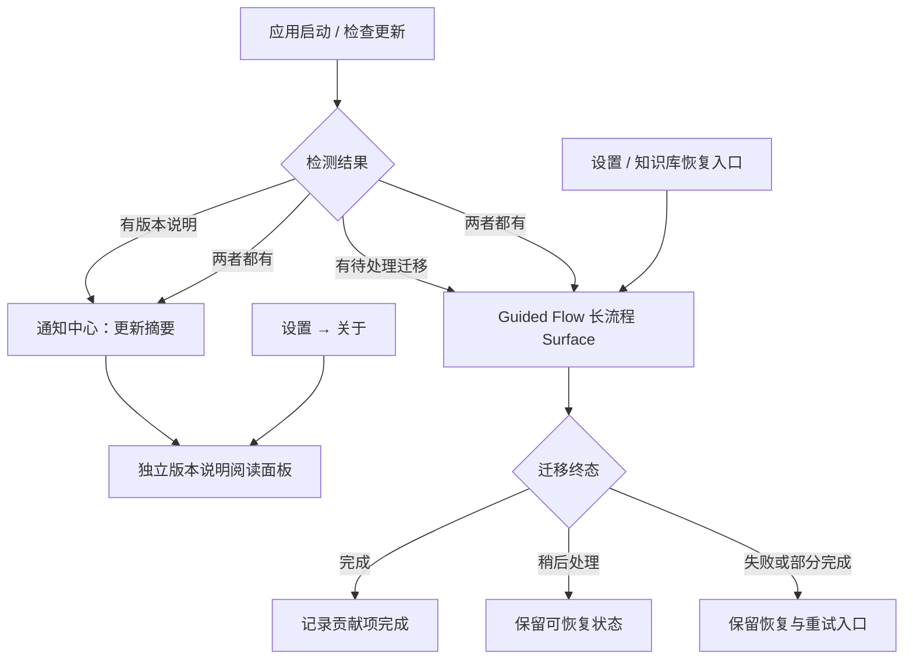

# Guided Flow 长交互容器与升级信息分层方案

> 状态：Phase A–C 已实现，待真实 Tauri / WebView 验收
>
> 创建日期：2026-08-03
>
> 修订日期：2026-08-05
>
> 关联文档：
>
> - [Guided Flow 引导模块收口计划](./guided-flow-plan.md)
> - [知识库迁移方式重构方案](../../src/tools/knowledge-base/docs/Plan/knowledge-base-guided-migration-refactor-plan.md)
> - [0.7.0-alpha.1 发布就绪与体验计划](./v0.7.0-alpha.1-release-readiness-and-experience-plan.md)
>
> 本文记录两项交互决策：
>
> 1. 长时间、多状态、多步骤的迁移交互不再继续复用通用 `BaseDialog` 的外层几何；
> 2. 版本说明与数据迁移任务在用户入口和可见流程上分开。
>
> 本文不是对现有实现的逐行描述。实现前仍需以当前代码、现有领域状态和真实 Tauri 窗口行为为准。

> 实现记录（2026-08-05）：已新增 `GuidedFlowSurface`，完成主内容保持挂载但隐藏/`inert`、Shell 双栏布局、默认 footer 与 step-owned footer 互斥、迁移步骤单一滚动责任、独立版本说明阅读面板及通知 action 分发。前端类型检查与相关组件/流程测试已通过；真实 Tauri 几何与透明链路仍按第 8.2 节验收。

## 1. 结论摘要

### 1.1 为长流程增加专用 Surface

升级迁移引导使用专用的 `GuidedFlowSurface`（暂定名），而不是继续让 `BaseDialog` 同时承担通用弹窗和长流程容器的职责。

Surface 的重点是稳定的布局边界和清晰的退出语义，不是把普通弹窗简单放大：

- Surface 固定在标题栏以下，占满剩余应用视口；
- 标题栏继续保留，不隐藏、不销毁 `MainLayout`；
- Guided Flow 激活时，只隐藏标题栏以下的主界面内容区，包括 Sidebar 和主要内容区域；
- 主界面内容保持挂载，关闭 Flow 后恢复原来的路由和页面状态；
- Surface 使用主题系统已有的半透明背景和模糊效果，使窗口外的桌面背景成为视觉底层；
- 背后的业务 UI 不应透过 Surface 继续可见或可交互；
- 步骤切换只替换流程内容，不重新创建外层 Surface，不做高度自适应动画；
- 迁移执行、失败、重试和恢复继续使用同一个流程容器。

动画不是本方案的目标。若保留进入/退出动画，也只能是非必要的轻量效果，并且不能影响布局稳定性、焦点和退出控制。本方案不对性能收益作承诺。

### 1.2 版本说明与迁移任务分开

版本说明是阅读信息，迁移引导是需要用户确认和执行的任务。两者可以共享版本检测结果，但不共享同一个必须连续完成的可见流程：

- 版本说明可以从通知中心、关于页等入口单独打开；
- 迁移事项只有在确实存在待处理贡献项时才进入 Guided Flow；
- 阅读或关闭版本说明不等于迁移完成；
- 迁移完成也不应强迫用户重新阅读整篇版本说明；
- 如果版本说明和迁移事项同时存在，不连续强制弹出两个阅读/任务弹窗。

版本说明阅读面板是否复用 Guided Flow runtime，可以在实现时单独决定；产品语义上必须保持只读，不修改迁移状态。

### 1.3 验收重点

验收不以“动画是否顺滑”为重点，而关注：

1. 标题栏仍然可见，Surface 正确位于标题栏下方；
2. Sidebar 和主内容区域被隐藏且不能获得交互焦点；
3. Surface 外层位置和尺寸不随步骤内容变化；
4. 每个交互表面只有一个明确的滚动责任人；
5. 迁移执行期间的关闭、稍后处理、失败和恢复语义与现有领域状态一致；
6. 版本说明阅读不会误改迁移状态。

## 2. 当前实现与问题边界

### 2.1 当前组件关系

| 区域     | 当前实现                                                             | 本次处理                                                    |
| -------- | -------------------------------------------------------------------- | ----------------------------------------------------------- |
| 主界面   | `MainLayout` 中包含 `TitleBar`、全局弹层和 `common-layout`           | 保持 `MainLayout` 挂载，只隐藏标题栏以下的主界面内容        |
| 外层流程 | `GuidedFlowModal.vue` 复用 `BaseDialog.vue`                          | 改为专用 Surface，迁移流程不再依赖普通弹窗的宽高和过渡      |
| 流程壳层 | `GuidedFlowShell.vue` 负责 header、步骤信息、内容和 footer           | 保留流程运行时能力，重新明确 Surface、Shell、步骤的布局责任 |
| 迁移步骤 | `MigrationStep.vue` 自己管理迁移子阶段、内容滚动和 step-owned footer | 保留领域操作；需要收紧滚动和 footer 契约                    |
| 升级说明 | `UpgradeSummaryStep` 中包含版本说明展示                              | 拆出只读阅读入口，迁移概览只引用与任务相关的提示            |
| 通知中心 | 已有持久化通知和 `metadata`                                          | 后续补充版本说明 action；本次不顺带重写通知系统             |

### 2.2 本次不解决的问题

以下问题如果没有现有代码或产品需求支撑，不在本方案中新增：

- 不新增独立 Tauri 原生窗口；
- 不为了容器改造重写 Guided Flow Manager 的持久化模型；
- 不新增 `interrupted` 等迁移执行状态；
- 不把所有模块都改成长交互容器；
- 不建设完整的升级中心页面；
- 不把通知去重、版本确认和历史版本合并扩展成独立的大型项目；
- 不以“透出壁纸”推导性能收益；
- 不通过禁止滚动或固定页面高度掩盖内部布局问题。

如果后续需要可靠支持进程崩溃、断电或任务管理器强杀后的迁移恢复，应另行设计迁移执行日志、检查点和幂等恢复机制，不能假设 Surface 自身可以完成这件事。

## 3. 信息架构



### 3.1 版本说明

版本说明分成三层，不从长文机械截断：

1. **通知摘要**：标题、版本、发布时间、简短摘要和重点；
2. **阅读面板**：完整正文、重点列表和兼容提示；
3. **迁移提示**：只在确实影响用户操作时，在迁移概览或具体步骤中引用相关内容。

阅读面板可以关闭和重复打开。它只记录阅读相关行为，不调用贡献项完成回调，也不修改迁移 Flow 状态。

版本说明按每个版本记录，还是按一次升级批次合并，属于待确认的产品规则，不在本方案中默认决定。

### 3.2 迁移引导

迁移引导只展示当前待处理事项。建议的外层流程是：

1. `overview`：说明检测到什么、影响什么、用户需要确认什么；
2. `migration`：由贡献项提供领域步骤，内部可以有方案确认、执行、校验和清理等 UI 子阶段；
3. `complete`：说明哪些工作已完成、哪些可选清理未执行，以及如何再次查看结果。

`plan`、`executing`、`verify`、清理展开状态等属于贡献项内部状态，不应被误写成新的外层 Guided Flow 步骤。具体哪些状态需要持久化，以领域实现为准。

## 4. GuidedFlowSurface 设计

### 4.1 承载范围

Surface 使用 `position: fixed`，从标题栏底部开始覆盖：

```css
top: var(--titlebar-height, 0px);
left: 0;
right: 0;
bottom: 0;
```

实际实现应优先使用项目已有的标题栏高度变量和主题变量，不在业务组件中重复定义窗口几何。

Guided Flow 激活时的主界面处理：

- `MainLayout` 保持挂载；
- `TitleBar` 保持可见；
- 隐藏 `MainLayout` 中标题栏以下的 `common-layout`，包括 Sidebar 和 `main-content`；
- 主界面内容不能获得鼠标、键盘或辅助技术焦点；
- 不使用 `v-if` 销毁路由页面，避免恢复时丢失页面状态；
- 其他位于 `MainLayout` 内的全局弹层需要有明确处理策略，不能意外浮在 Surface 上方。

隐藏主界面的类名和状态来源可以由 `GuidedFlowHost` 或共享 store 提供，但不能通过组件名称含糊表达为“隐藏整个 `MainLayout`”。

### 4.2 视觉层

Surface 的视觉层遵循主题系统：

- 使用主题提供的半透明容器背景；
- 使用 `backdrop-filter: blur(var(--ui-blur))` 或项目已有的毛玻璃封装；
- 背后业务 UI 已被隐藏，因此半透明层不应透出 Sidebar、页面卡片或业务文字；
- 透明链路需要在真实 Tauri 窗口中确认，包括窗口透明配置、`html/body/#app` 背景和标题栏以下容器背景；
- 文字、按钮、边框和错误提示必须满足当前主题下的可读性；
- 动画可有可无，不能成为布局和验收前提。

### 4.3 布局

建议采用双栏布局，但双栏不是硬性视觉比例要求：

```text
GuidedFlowSurface
└── GuidedFlowShell
    ├── header（标题、当前状态、关闭/稍后处理）
    └── body
        ├── rail（步骤大纲，可在窄窗口折叠或调整布局）
        └── main
            ├── content（当前步骤内容）
            └── footer（默认操作区，或由步骤接管）
```

布局要求：

- Surface 外框在流程存活期间不随步骤内容变化；
- `body` 和主内容区域设置 `min-height: 0`，避免 flex 子项把外层撑高；
- rail 不参与主内容高度测量；
- 步骤信息不能因为长标题、错误提示或日志展开而改变 Surface 外框；
- 窄窗口下需要有明确的 rail 降级方案，不能只固定为 25%–30% 宽度；
- 内容溢出应在内部边界处理，不能把滚动传递到 document 或窗口级页面。

### 4.4 滚动和 footer 契约

必须明确每一种布局模式的滚动责任，避免出现嵌套滚动容器：

- **默认 footer 模式**：Shell 的 `content` 负责滚动，footer 固定在内容区底部；
- **step-owned footer 模式**：步骤根节点填满 `main`，步骤自己提供 content 和 footer；Shell 不再同时提供外层滚动；
- 同一模式下不能同时让 Shell content 和步骤 body 都承担同一段内容的滚动；
- 日志终端、代码区域等确实需要独立滚动的局部区域可以例外，但必须有明确的高度边界和键盘滚动行为；
- 步骤切换后，新的主要 content 默认回到顶部；执行中的任务不得因父组件更新而丢失运行状态。

当前 `MigrationStep` 已使用 step-owned footer 和内部 `.migration-body` 滚动，迁移改造时应先落实上述契约，再调整样式，不要只在外层继续叠加 `overflow` 规则。

## 5. 退出和恢复语义

### 5.1 当前版本只约束用户交互

Surface 需要根据当前 Flow 和贡献项状态决定可见操作，但不能只用全局 `busy` 推断领域安全性。至少要区分：

- **未开始确认**：可以稍后处理；
- **执行中**：操作按钮禁用，不允许通过普通关闭绕过领域约束；
- **失败或部分完成**：可以关闭并保留恢复入口；
- **完成待清理**：清理是否可选由贡献项决定；
- **完成**：显示完成反馈并退出。

“关闭”“稍后处理”“跳过”和“最小化”不是同义词，具体文案和是否存在由 Flow definition 与贡献项策略决定。对于当前知识库迁移，用户看到“稍后处理”应对应 `deferred`，不能用“跳过”掩盖实际语义。

### 5.2 系统窗口关闭

本次容器改造不承诺解决所有强制终止场景：

- 自定义标题栏关闭、Alt+F4 和系统关闭事件是否需要拦截，应结合 `blockingScope` 和迁移领域能力实现；
- 突然崩溃、断电或进程强杀不能依赖前端事件记录状态；
- 如果未来要求中断后精确恢复，需要单独增加后端执行日志和检查点；
- 容器改造本身不得假设迁移已经具备幂等恢复能力。

### 5.3 主界面恢复

关闭或完成 Surface 后：

- 恢复标题栏以下主界面显示；
- 保持原路由和页面状态；
- 不因为 Surface 关闭而强制导航到固定页面；
- 如果有待恢复的迁移事项，由 Guided Flow 状态和入口决定下一次展示时机。

## 6. 状态边界

以下状态不能合并：

| 状态                            | 所属系统             | 含义                                                         | 是否代表迁移完成  |
| ------------------------------- | -------------------- | ------------------------------------------------------------ | ----------------- |
| `notification.read`             | 通知中心             | 用户看过通知摘要                                             | 否                |
| release acknowledgement         | 应用生命周期         | 版本说明被确认、跳过或按产品规则处理                         | 否                |
| Guided Flow status              | Guided Flow runtime  | 当前流程 pending、in-progress、deferred、failed 或 completed | 不一定            |
| contribution / migration status | 升级贡献项和领域服务 | 迁移事项真实完成、部分完成或失败                             | 是/否，按领域规则 |

版本说明阅读面板不得调用 contribution 完成回调。迁移完成也不得被实现成“通知已读”的副作用。

Surface 的视觉改造不应隐式改变 Guided Flow definition version 或领域迁移版本。只有步骤定义、数据结构或恢复语义发生不兼容变化时，才需要另行设计版本升级和旧状态处理。

## 7. 实现拆分建议

### Phase A：建立 Surface 边界（已实现）

- 新增专用 `GuidedFlowSurface`；
- 保留 `MainLayout` 和 `TitleBar` 挂载；
- 仅隐藏标题栏以下的 `common-layout`；
- 迁移现有 `GuidedFlowModal` 的流程连接、层级和必要事件；
- 固定 header/body/main/footer 的布局边界；
- 建立默认 footer 与 step-owned footer 的互斥契约。

### Phase B：收敛滚动和迁移步骤（已实现）

- 明确 `MigrationStep` 的 content、footer 和内部局部滚动责任；
- 保留现有迁移领域操作、报告和重试语义；
- 不在本阶段新增 `interrupted` 或新的后端恢复模型；
- 检查稍后处理、失败、部分完成、清理和关闭行为是否与现有状态一致。

### Phase C：拆分版本说明入口（已实现）

- 增加独立的只读版本说明阅读面板；
- 关于页的“版本说明”打开阅读面板；
- 迁移入口只打开待处理的 Guided Flow；
- 通知中心 action 只负责打开对应版本说明或迁移入口，不直接调用迁移完成逻辑；
- 保持 notification read、release acknowledgement 和 contribution status 分离。

## 8. 验证门槛

### 8.1 组件级

至少验证：

- Guided Flow 激活时 `TitleBar` 仍然可见；
- Sidebar 和主内容区域不可见、不可交互，且关闭后恢复；
- Surface 外框不随步骤内容高度变化；
- 默认 footer 与 step-owned footer 不会同时出现；
- 每种布局模式只有一个主要滚动责任人；
- 错误提示、重试和日志展开不会撑大外层 Surface；
- `prefers-reduced-motion` 下不依赖动画完成状态；
- 版本说明阅读不改变迁移状态。

### 8.2 真实 Tauri / WebView

必须至少验证：

| 场景               | 通过标准                                                           |
| ------------------ | ------------------------------------------------------------------ |
| 打开迁移引导       | 标题栏仍可用，Surface 从标题栏下方开始，背后主界面不可见且不可交互 |
| 概览 → 迁移        | 外框不跳变，内容和 footer 边界稳定                                 |
| 迁移执行中         | 操作状态明确，普通关闭不会绕过领域约束                             |
| 执行失败 → 重试    | 错误可读，重试可用，外框不被错误内容撑开                           |
| 关闭后恢复         | 下次打开时使用现有 Guided Flow/领域状态恢复，不重复标记完成        |
| 通知 → 版本说明    | 只改变阅读相关状态，不标记迁移完成                                 |
| 低高度和窄宽度窗口 | 无裁切、无按钮溢出，rail 和内容有合理降级                          |

如果没有真实 Tauri 运行证据，只能说明“前端构建或组件测试通过”，不能说明“真实窗口体验已验证”。

## 9. 已落地决策与待确认事项

本轮实现已落地两项不新增领域状态的产品规则：

1. 版本说明沿用现有按版本记录的生命周期边界，每个版本生成一条包含 revision 的稳定键通知；同一版本同一 revision 不重复创建通知；
2. Guided Flow 活跃时迁移 Surface 层级高于版本说明阅读面板。主内容和通知抽屉均不能绕过当前迁移任务打开阅读面板。

以下事项仍需结合后续领域需求确认：

1. `module` 级迁移是否允许用户继续操作其他模块；
2. 系统窗口关闭和最小化在执行迁移期间的具体行为；
3. 多个 contribution 是串行展示，还是先展示总览再逐个处理；
4. 完成页是否保留为外层 Guided Flow 步骤。

这些问题不影响当前 Surface、阅读面板和通知分层；后续实现仍不得在组件中自行发明新的持久化状态或恢复语义。
