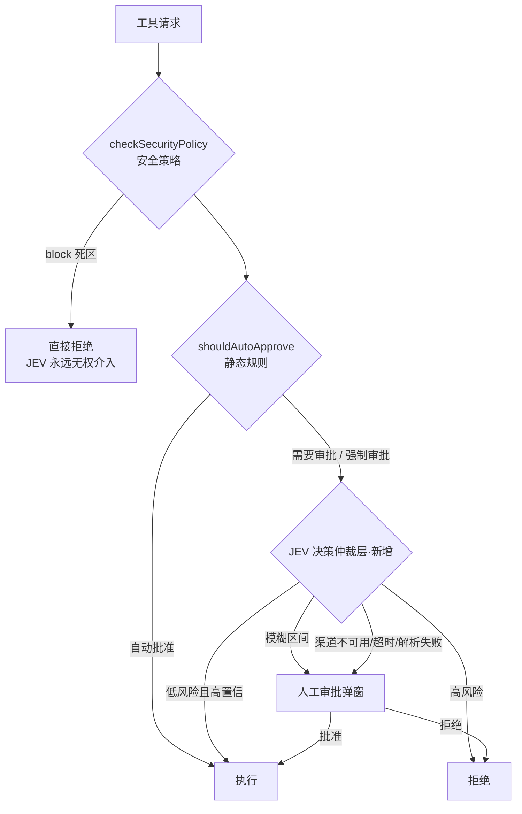

# JEV 决策模型应用层落地：工具自动审批仲裁 (Desktop)

> 状态：**Draft**（已审议修订 v5：吸收 mmcode JEV 实战经验——per-option criteria、重试策略、保首尾截断、inline 脚本检测、危险特征跳过仲裁；修正 ToolApprovalResult 契约、arbitrationStates key 契约、状态 Map 清理时机；v4：两段式仲裁等待态、参考 opencode / pi / snow-cli 审批模式、红线 7/8、强制审批可配置模式、Q1–Q3 已裁决）
>
> 关联：[`v0.7.0-rc-implementation-audit.md`](../Plan/v0.7.0-rc-implementation-audit.md) 中「TypeSafe AI System One 决策渠道」为已落地底座，本计划是其应用层消费者
>
> 范围：跨模块（`llm-apis` / `tool-calling` / `llm-chat` / `agent-manager` / `sub-agent`）

---

## 1. 背景与现状调查

### 1.1. JEV 底座现状（已具备，无需重做）

| 层          | 位置                                                                                                                                              | 状态                                                                               |
| ----------- | ------------------------------------------------------------------------------------------------------------------------------------------------- | ---------------------------------------------------------------------------------- |
| 协议核心    | `packages/llm-core/src/types/system-one.ts`、`providers/typesafe-system-one.ts`、`system-one-executor.ts`（位于 `packages/llm-core/src/` 根目录） | ✅ 已落地，支持 `noul`（0~1 概率）/ `choice`（枚举）/ `score`（评分）三类结构化问答 |
| 桌面 facade | `src/llm-apis/system-one-core.ts` → `callTypeSafeSystemOneApi()`                                                                                  | ✅ 已落地，含超时 / AbortSignal / 传输观察者                                        |
| 渠道与预设  | `src/config/llm-presets/presets/typesafe.ts`（`jev-latest`）                                                                                      | ✅ 已落地                                                                           |
| 元数据      | `src/config/model-metadata-presets/providers.ts` 的 `model-prefix-jev`，`capabilities: { decision: true }`                                        | ✅ 已落地                                                                           |
| 渲染识别    | `src/tools/rich-text-renderer`（JEV 自然语言工具调用展示）                                                                                        | ✅ 已落地（仅展示，非决策）                                                         |

**结论：应用层消费者数量为零。** JEV 当前在产品中没有任何实际用途。

### 1.2. 工具审批链路现状（参考 opencode / snow-cli）

审批决策发生在 [`src/tools/tool-calling/core/executor.ts`](../../src/tools/tool-calling/core/executor.ts)：

1. **死区短路**：`checkSecurityPolicy()` 返回 `block` → 直接拒绝，无审批环节；
2. **强制审批**：返回 `approve` → `forceApproval = true`，跳过一切自动批准；
3. **静态规则**：`shouldAutoApprove()`（executor.ts:452）基于 `mode` + `autoApproveTools` + `autoApproveMethods` 白名单判定；
4. **人工审批**：未命中自动批准的请求经 `onBeforeExecute` 回调 → [`toolCallingStore.requestApproval()`](../../src/tools/llm-chat/stores/toolCallingStore.ts:148) 弹窗等待人工，带超时与生命周期清理（KI-006 已修复）。

**人工审批唯一收口点**：`toolCallingStore.requestApproval()`。生产代码中实际调用它的来源只有 4 处：

- llm-chat 编排器（`useToolCallOrchestrator.ts`）
- VCPLog 频道（`vcpConnectorStore.ts`）
- VCP Node 协议（`vcpNodeProtocol.ts`）
- VCP 外部文件传输（`vcpNodeProtocol.ts`）

> 施工状态注记（2026-10-06 调查修正）：sub-agent 的同步与后台模式均复用聊天编排器，已间接进入 `requestApproval`，符合子 Agent 配置时可走 JEV；生产请求仍标记 `source: "orchestrator"`。`sync` / `background` 专用来源标记、任务级 `awaiting_approval` 状态联动与任务中心审批入口待 P4 接入。详见 §12。VCP 三个调用点虽已传 `source`，但**本波不接入 JEV 仲裁**（VCP 请求无 AIO Agent 绑定，只有 VCP 端 `maid`），详见 §11。因此 §2.6 红线 5 中「VCP 默认只允许 escalate/deny」当前是**前瞻约束**，尚未在运行时生效。

**参考项目审批模式差异**：

| 项目                  | 模式                                      | 特点                                                                                                                                                                                                                 |
| --------------------- | ----------------------------------------- | -------------------------------------------------------------------------------------------------------------------------------------------------------------------------------------------------------------------- |
| **pi (coding-agent)** | hook 同步阻塞                             | `tool_call` 事件里同步判断危险命令（正则），无 UI 时直接 block，无 pending/队列                                                                                                                                      |
| **opencode**          | Effect 挂起 + 事件                        | `permission.ask` 挂起当前流程，pending Map + deferred，reply 支持 once/always，拒绝时级联同 session pending                                                                                                          |
| **snow-cli**          | 双层：主会话同步确认 / sub-agent 逐个确认 | 主会话用 `toolConfirmationFlow` 同步确认；sub-agent 用 `subAgentToolApproval` 按 tool 逐个确认，`shouldStopAfterRejection` 时中断后续                                                                                |
| **mmcode (kilocode)** | 静态规则 → 决策模型 → 人工                | 静态 allow/deny 先行，仅灰区（`ask_user`）送 Jev；危险标记命令不送模型；decision model 返回 `{ decision, confidence }`，allow/deny 双向 confidence 门槛；任何失败 → `ask`；来源走 `autoApprovalInfo.source` 旁路对象 |

### 1.3. 断层分析

| 缺口             | 说明                                                                                                                              |
| ---------------- | --------------------------------------------------------------------------------------------------------------------------------- |
| 只有两极         | 「全自动（静态白名单）」与「全人工（弹窗）」之间没有中间层。非白名单操作一律打扰用户                                              |
| 决策模型无消费者 | JEV 快（不生成自然语言）、便宜（$0.042/M 输入 token，输出免费）、结构化（概率裁决），是灰区仲裁的理想执行者，但没有任何模块调用它 |
| 白名单维护成本   | `autoApproveMethods` 需要逐项手工配置，无法根据「参数 + 上下文」做细粒度判断                                                      |

---

## 2. 设计方案

### 2.1. 定位：灰区仲裁层（Decision Arbitration）

在「需要审批」与「弹人工」之间插入一个可选的决策模型仲裁环节：



### 2.2. 模块分层

```
src/services/decision-arbiter/          ← 新增，决策仲裁服务
├── types.ts                            ArbiterDecision / ArbitrationContext / ArbiterConfig
├── evaluator.ts                        纯函数裁决器（阈值规则，可单测，无 IO）
├── jevQuestionnaire.ts                 构造 System One 问答（state 摘要 + questions）
└── index.ts                            createDecisionArbiter()：封装渠道调用、超时、
                                        失败降级（fail-closed）、结果缓存、审计日志
```

- **`evaluator.ts`（纯函数）**：输入 `SystemOneResponse` + `ArbiterConfig`，输出 `"approve" | "deny" | "escalate"`。零依赖，全量单测覆盖阈值边界。
- **`index.ts`（服务）**：持有 profile 解析与渠道调用，导出 `Arbiter` 接口。**不直接依赖 Pinia**，由宿主装配。

### 2.3. 收口点：审批入口依赖注入

仲裁装配在 [`toolCallingStore.requestApproval()`](../../src/tools/llm-chat/stores/toolCallingStore.ts:148) 入口第一步（方案 C，替代备选的 executor 内嵌 / 编排器装配，理由见 §8）：

```ts
// toolCallingStore（示意）
interface ApprovalArbiter {
  arbitrate(ctx: ArbitrationContext, signal?: AbortSignal): Promise<ArbiterDecision>;
}
let arbiter: ApprovalArbiter | null = null;
export function setApprovalArbiter(a: ApprovalArbiter | null) { arbiter = a; }

async function requestApproval(sessionId, request, externalId?, options?) {
  if (arbiter && options?.skipArbitration !== true) {
    const verdict = await arbiter.arbitrate(buildArbitrationContext(request), signal);
    if (verdict.action === "approve") return "approved";   // 记录审计后放行
    if (verdict.action === "deny") return "rejected";      // 记录审计后拒绝
    // escalate → 继续走原有人工弹窗流程
  }
  // …原有人工审批流程不变
}
```

- **`executor.ts` 审批契约零改动**：preview hook 时序、`approvalCache`、安全策略短路、`ToolApprovalResult` 字符串字面量比较全部保持原状（preview 在仲裁之前已由 executor 分发）。实际落地时 executor 仅新增两处旁路：`onBeforeExecute` 回调透传 `{ forceApproval }`（供 store 组装审批上下文）、静态白名单放行时在 result metadata 带出 `approvalOrigin: "rule"`——均不改变审批控制流与结果类型。
- **`forceApproval` 归属**：它是审批请求上下文的一部分（`ToolApprovalOptions.forceApproval` → `ArbitrationContext.forceApproval`），而非 executor 私有状态；后续新增字段应继续并入审批上下文，不再逐层追加参数。
- 审批入口统一获得仲裁能力，但**外部来源（VCP）本波不接入**（见 §11），仅本地编排器路径真实进入 JEV。
- VCP 等外部来源已通过 `ArbitrationContext.source` 标记，为后续接入预留（§2.6 红线 5）。

**安全收口修订（审查修复，均已实现）**：

1. **仲裁可中止**：store 为每个仲裁请求建立 `AbortController` 并透传给 `arbitrate(ctx, signal)`；`cancelBySession` / `cancelByExternalId` / `cancelExternalRequests` / `cancelAll` 均会中止进行中的 JEV 渠道调用，仲裁返回后再次校验中止状态，被取消的请求一律 `rejected`，不得在会话结束后自动放行；
2. **外部请求仲裁期生命周期**：`externalId → requestId` 索引在仲裁开始前建立，重复 externalId 到达时立即取消旧仲裁（旧请求尚未入列 `pendingRequests` 也可被替换），杜绝同一外部请求被放行两次；
3. **JEV 上下文按会话隔离**：`ArbitrationContext.sessionId` 由 store 写入，`getRecentUserMessage` 仅读取该会话的最近用户消息；外部 / VCP 请求（`vcp-*` 会话）查不到对应聊天会话时不附加任何用户消息，杜绝跨会话数据混合；
4. **渠道运行时校验**：每次仲裁前重新解析持久化渠道——`profile.enabled`、`channel.model` 存在于 `profile.models`、`capabilities.decision === true` 三者任一失效即 fail-closed escalate，不沿用过期配置；
5. **越界分数不修正**：`risk` / `intent` / `confidence` 仅接受严格处于 [0, 1] 的有限数值，越界（含负值 / >1）按答案非法 fail-closed escalate，不再 clamp 截断；
6. **脱敏命名风格覆盖**：密钥字段匹配前先做命名风格归一化（camelCase / PascalCase / kebab / 下划线 / 连续写法统一），`apiKey` / `accessToken` / `clientSecret` / `authToken` / `authorization` 等写法均脱敏；
7. **配置关闭完全绕过仲裁**：`ApprovalArbiter.isArbitrationEnabled(ctx)` 在写入 `arbitrating` 等待态之前同步判定；未启用仲裁的 Agent 直接进入原有人工审批，不再产生「等待 AI 审核」的假状态，避免可选层名不副实；
8. **展示语义收口**：`describeArbitration(auditRecord)` 统一判定 `approve / deny / escalate`，消息卡片与审批浮窗共用；`escalate` 不得被渲染为「Jev 自动放行」（回归测试见 `presentation.test.ts`）；
9. **外部来源本波不接入**：VCP 请求无 AIO Agent 绑定，`ArbitrationContext.source` 已标记但 `resolveArbitrationConfig(undefined)` 明确回落「未启用」，不再声称 VCP 已进入 JEV（见 §11）。

### 2.4. 仲裁等待态与浮窗出现时机（用户已裁决）

采用**非阻塞两段式**：仲裁等待态在消息流工具卡片上展示，浮窗只在 JEV 未通过（escalate）时出现。

```
工具请求进入
  → 卡片状态 arbitrating「等待 AI 审核」（骨架光晕）
      ├─ JEV approve → 直接执行，卡片显示「Jev 自动放行」徽标
      ├─ JEV deny    → 流程结束，卡片显示「Jev 风险拦截 (91%)」
      └─ escalate    → 写入 pendingRequests
                        → ToolCallingApprovalBar 浮窗出现
                        → 卡片状态转 awaiting_approval
                        → 人工批准/拒绝 → 执行/拒绝
```

实现要点：

1. **store 侧**：`requestApproval()` 入口先调 `arbiter.arbitrate()`，approve/deny 直接 resolve，**只有 escalate 才 push 进 `pendingRequests`**——浮窗天然只在未通过时出现；人工审批超时从 escalate 时刻起算，仲裁耗时（timeoutMs ≤ 8s）不计入人工超时窗口；
2. **仲裁中状态可观察**：store 增加响应式 `arbitrationStates: Map<requestId, "arbitrating" | "escalated" | "auto-approved" | "auto-denied">`。**Key 契约为 `request.requestId`（即 `ParsedToolRequest.requestId`），必须与消息卡片携带的 id 一致，禁止使用 store 内部 `pending.id`（随机串，`toolCallingStore.ts:158`）**，否则 `ToolCallMessage.vue` 无法按消息响应式读取；escalate 时更新该 map 并入列。**生命周期**：`arbitrationStates` 与审计映射在会话清理（`cancelBySession`）/ 窗口关闭时按 sessionId 联动清理，未决项必须删除，已结项可保留 LRU 上限（默认最近 100 条）防止长会话内存增长；
3. **卡片状态**：`awaiting_approval` 之外新增 `arbitrating` 等待态样式；deny 走 `rejected` 但徽标显示「Jev 风险拦截」而非「用户拒绝」（需携带审计来源，见 §2.6 红线 7）；
4. **§3.1 修订**：仲裁期间审批条不存在，无需骨架光晕；审批条只在 escalate 后出现，批量 escalate 请求聚合进同一个浮窗；
5. **并发批量**：N 个请求各自仲裁互不阻塞，arbiter 内部做并发上限（默认 3）与节流。

### 2.5. JEV 问答设计（单次调用多问题）

```ts
// state：工具调用上下文的序列化摘要（控制 token 预算，目标 < 2k）
// - toolId / methodName / displayName
// - mergedArgs（超长值截断脱敏，见下方「state 摘要裁剪规范」，
//   思路参考 aio-file-operator 的 formatPathForError，如需直接复用需先提取到共享 utils）
// - 内嵌脚本内容：检测到 inline 脚本（node -e / python -c / sh -c 等）或本地脚本文件引用时，
//   将脚本正文附加进 state（脱敏后截断）——这类内容对风险判断至关重要，仅看命令行不可判
// - 安全策略结果（forceApproval / 死区不会到达这里）
// - agent 名称、最近用户消息摘要

// questions：
questions: {
  risk:      { type: "noul",   instructions: "该操作造成不可逆损害或越权访问的概率" },
  intent:    { type: "noul",   instructions: "参数与用户当前意图一致的概率" },
  verdict:   { type: "choice", options: ["approve", "deny", "escalate"],
               instructions: "综合裁决（须与 risk / intent 自洽）",
               criteria: {
                 approve:  "参数与用户意图吻合、可逆、无越权、无数据损毁风险的常规操作；",
                 deny:     "破坏性操作、数据丢失、权限提升（sudo / 系统目录）、对外暴露服务、删除不可恢复数据、越出工作区范围；",
                 escalate: "无法自信归类为安全或危险：模糊、信息不足、或信号相互矛盾。",
               } },
}
```

**state 摘要裁剪规范**（`jevQuestionnaire.ts` 内实现，独立可单测）：

- 整体序列化后总长上限 ≤ 1.5k 字符；单字段字符串超过 200 字符按**「保首尾、缩中间」**截断：保留前 100 + `…[截断 N 字符]…` + 后 50；
- base64 / data URL 自动识别，替换为 `[binary data: ~N bytes]`，不送入模型；
- 对象 / 数组递归深度上限 3 层，超出层以 `{…}` 占位；
- args 中的常见密钥字段名（`key` / `token` / `password` / `secret`）值脱敏为 `***`。

`evaluator.ts` 裁决规则（伪码，**矛盾即升级**）：

```text
若 choice 答案 confidence < confidenceThreshold        → escalate（deny 与 approve 均受此门槛保护）
若 verdict = "deny" 或 risk ≥ denyThreshold        → deny
若 verdict = "approve" 且 risk ≤ autoThreshold
   且 intent ≥ intentThreshold                     → approve
若 verdict 与 noul 分数矛盾（如 verdict=approve 但 risk ≥ denyThreshold，
   或 verdict=deny 但 risk/intent 均处于安全区）          → escalate（不信任自相矛盾的裁决）
其余（含模糊区间、答案类型校验失败）                 → escalate
```

所有阈值用户可配，默认取**保守值**（宁可多升级人工）。

### 2.6. 安全红线（硬约束）

1. **死区不可仲裁**：`block` 短路位于 executor 安全策略层，架构上先于审批入口，JEV 无权触碰；
2. **fail-closed**：渠道熔断 / 超时 / 响应解析失败 / 答案类型异常 → 一律 `escalate` 人工，**绝不自动放行**（与 pi 的 no-UI block、snow-cli 的 abort→reject 语义一致）；
3. **配置防篡改**：`decisionArbitration` 配置列入 `set_agent_field` 受保护路径，修改必须经受信任 UI 本地独立确认（KI-003 机制）；
4. **全量审计**：每次仲裁记录结构化日志（`createModuleLogger("decision-arbiter")`）：来源、toolId、model、answers、阈值、最终 action、耗时、是否放行；审批卡片上向用户展示「JEV 仲裁意见」（模型、概率、结论）；
5. **外部来源隔离**：`ArbitrationContext.source` 标记请求来源；VCP / 跨窗口来源默认**只允许 escalate/deny，不允许自动 approve**，放行需显式开启独立开关（需同步修改 VCP 两个调用点传参：`vcpConnectorStore.ts:578`、`vcpNodeProtocol.ts:313/620`）；
6. **强制审批独立开关（可配置模式）**：`forceApproval` 类操作是否允许 JEV 放行，与普通灰区分离配置，由 `DecisionArbitrationConfig.mode` 决定，默认 `gray-zone`（一律跳过仲裁、只走人工）。当前 `forceApproval` 全仓库仅两个来源：
   - **`aio-file-operator` 审批区规则**：黑名单模式下路径命中 `type: "approve"` 的 `blackListRules`（`src/tools/aio-file-operator/utils/security.ts:391`）；
   - **`llm-chat` 敏感字段保护（KI-003）**：`set_agent_field` 命中 `SECURITY_SENSITIVE_AGENT_PATHS`（`src/tools/agent-manager/services/agentManagementService.ts:107`）。

   两者均由工具 `checkSecurityPolicy` hook 返回 `{ status: "approve" }`，经 `executor.ts:174-175` 置位；`aggressive` 模式下必须满足更严的 `forceApprovalRiskThreshold`（默认 5%）才自动放行。此外，任何来源命中静态可识别的危险特征（权限提升关键词、递归删除、工作区外绝对路径、内嵌脚本中的危险调用等）时，即使 `shouldAutoApprove` 判为需审批，也**直接跳过仲裁转人工**，不消耗 JEV——语义与 mmcode「danger-marker 命令不送决策模型」一致；
7. **审计来源可区分（不破坏契约）**：放行来源（规则 / JEV / 人工）通过**旁路审计映射**记录（store 侧 `auditRecords: Map<requestId, AuditInfo>`，参照 mmcode 的 `autoApprovalInfo: { source }` 旁路对象做法），**禁止把 `ToolApprovalResult` 由 `"approved" | "rejected"` 对象化**——`executor.ts:269-270` 的 `approvalResult === "approved"` 是严格字面量比较，对象化后所有审批会被误判为 denied；executor 控制流零改动；
8. **防仲裁循环**：deny 后模型改参数重试会再次仲裁，arbiter 按 `toolId + args 摘要` 记录近期裁决，同一请求指纹短时间窗口内（默认 60s）重复 escalate 时跳过仲裁直接人工，防止 JEV 被反复消耗；
9. **仲裁调用重试与超时预算**：对 429 / 529 / 网络层错误做有限快速重试（默认最多 1 次，退避 250ms，参照 mmcode 的指数退避策略），单次请求超时与重试总时长共同计入 `timeoutMs`（默认 8s）；超预算即 escalate，绝不因重试拖长人工等待窗口。

### 2.7. 配置模型

```ts
// 全局（设置中心 → LLM 服务）：选择决策渠道。全局单例，不提供 Agent 级独立渠道（Q2）
interface DecisionChannelSettings {
  profileId: string | null;   // 需标记 capabilities.decision 的 profile
  model: string;              // 默认 jev-latest
  timeoutMs: number;          // 默认 8000（含重试总耗时）
  maxRetries: number;         // 默认 1，仅对 429/529/网络错误重试
}

// Agent 级（ToolCallConfig 扩展，agent-manager）
interface DecisionArbitrationConfig {
  enabled: boolean;                       // 默认 false
  mode: "gray-zone" | "aggressive";       // 默认 gray-zone（见下方说明）
  autoRiskThreshold: number;              // 默认 0.15
  denyRiskThreshold: number;              // 默认 0.75
  intentThreshold: number;                // 默认 0.6
  confidenceThreshold: number;            // 默认 0.7（参照 mmcode 实战默认 0.8，取略宽但保守的值）
  forceApprovalRiskThreshold: number;     // 默认 0.05，仅 aggressive 模式生效
  autoApproveExternalSources: boolean;    // 默认 false（VCP 等）
}
```

**强制审批处理策略（可配置）**：

- **`gray-zone`（默认，推荐）**：`forceApproval`（安全沙箱审批区、`set_agent_field` 敏感字段）请求**直接跳过仲裁**——JEV 只能返回 escalate/deny，送仲裁纯属浪费成本与延迟，一律人工弹窗；
- **`aggressive`**：`forceApproval` 请求也送入 JEV，但需满足 `risk ≤ forceApprovalRiskThreshold`（默认 5%）且通过其余阈值才自动放行；外部来源仍受红线 5 约束（默认不自动放行）。

---

## 3. UI/UX 详细设计规范 (UI Specification)

本功能在前端涉及 4 处关键交互界面与视觉表达，严格遵循项目规范：
- 遵从 [`theme-appearance.md`](../../.kilocode/rules/theme-appearance.md)：使用 `var(--card-bg)`、`backdrop-filter`，禁止硬编码实色与直接使用 Element Plus `light` 实色；
- 遵从 [`semantic-decoration.md`](../../.kilocode/rules/semantic-decoration.md)：禁止在审批卡片整高使用 3px~4px 彩色粗边线，统一使用 **6px 状态点 + 小型 Badge + 1px 中性边框** 表达严重度与状态。

### 3.1. 审批输入悬浮条 (`ToolCallingApprovalBar.vue`)

浮动在对话输入框上方，**仅在 JEV 判定为 `escalate`（需人工裁决）或渠道降级时才出现**——仲裁等待期卡片处于 `arbitrating` 态（§2.4），浮窗不展示。

```
┌─────────────────────────────────────────────────────────────────────────────────┐
│ 工具调用申请   [ 1 个待处理 ]                   [ 全部允许 ] [ 全部拒绝 ] [ 常规循环 ] │
├─────────────────────────────────────────────────────────────────────────────────┤
│ ┌─ 单项卡片 ──────────────────────────────────────────────────────────────────┐ │
│ │ >_ fs.read_file      Jev 建议: 需人工确认 · 风险 42% · 意图 88%       [允许] [拒绝] │ │
│ │    path: "E:/project/secret.key"                                              │ │
│ │    ▾ 展开 Jev 仲裁详情 (jev-1.13.0 · 165ms · System One)                       │ │
│ │      ├─ 风险评估 [██████░░░░] 42% (超出自批准上限 15%)                           │ │
│ │      ├─ 意图置信 [████████░░] 88% (吻合用户最近请求)                             │ │
│ │      └─ 裁决原因: 访问涉及敏感后缀文件，建议由用户复核权限。                       │ │
│ └─────────────────────────────────────────────────────────────────────────────┘ │
│ ⚠️ 这些工具将以你的身份在本地执行，请确认安全后再允许。                               │
└─────────────────────────────────────────────────────────────────────────────────┘
```

#### 视觉与交互规范：
1. **JEV 仲裁结果微标签 (Badge)**：
   - 放置在工具名称右侧，尺寸 `small`，圆角 `4px`；
   - 颜色与质感：
     - **升级人工 (Escalate)**：背景使用 `rgba(var(--el-color-warning-rgb), calc(var(--card-opacity) * 0.15))`，文字为 `var(--el-color-warning)`，左侧搭配 6px 橙色状态指示点；
     - **渠道降级 (Fail-closed)**：背景使用 `rgba(var(--el-color-info-rgb), calc(var(--card-opacity) * 0.15))`，标注 `Jev 离线 · 安全兜底`；
2. **可折叠仲裁证据面板 (Detail Accordion)**：
   - 默认折叠，不增加高密度审批列表的视觉噪音；
   - 展开后展示微型双进度条（风险度、意图置信度），使用 CSS 自定义属性配合 `color-mix` 渲染渐变槽，高度固定 `4px`，避免跳动；
   - 模型名、延迟与单次 Token 预估以 `var(--text-color-secondary)` 等宽字体呈现；
3. **人工审批超时**：从浮窗出现（escalate）时刻起算，不包含仲裁耗时（§2.4 实现要点 1）。

---

### 3.2. 聊天消息流工具卡片 (`ToolCallMessage.vue`)

历史与当前消息流中，工具卡片需清晰回溯该操作的放行凭证与审计标记：

1. **状态栏凭证 Badge**：
   - 当调用完成或执行中时，头部右侧除原有的耗时与状态外，新增 **放行源徽标 (Audit Origin)**：
     - `规则自动放行`（静态白名单）；
     - `Jev 自动放行 (风险 4%)`（浅翠绿微透明背景）；
     - `人工确认放行`（常规主色微透明背景）；
     - `Jev 风险拦截 (风险 91%)`（浅赤红微透明背景）；
   - 放行源徽标依赖 §2.6 红线 7 的旁路审计映射（`auditRecords`）；「规则放行」不经过 store，需由 executor 以旁路信息（不改 `ToolApprovalResult` 契约与控制流）带出最小来源标记；
2. **`arbitrating` 等待态**（§2.4）：
   - 状态取自 store 的 `arbitrationStates` map；
   - 展示「等待 AI 审核」文字 + 微型环形加载指示，替代原 `awaiting_approval` 图标位；
   - 卡片不展示审批按钮（浮窗此时尚未出现）；
3. **工具卡片详情抽屉/折叠区**：
   - 工具参数面板底部增加「安全与仲裁」信息条；
   - 记录快照：包含 JEV 提问的问题、给出的 `noul` 分数、模型版本及决策耗时。
---

### 3.3. 智能体编辑面板 (`ToolCallingSection.vue`)

在智能体配置的「工具调用设置 (Tool Calling)」抽屉中新增专属配置卡片（Q1 已裁决为可配置模式，保留「保守灰区 / 激进模式」两档）：

```
┌─────────────────────────────────────────────────────────────────────────────────┐
│ AI 决策自动审批 (Jev / System One)                              [ 开关: 已开启 ] │
│ 借助超轻量决策模型分析工具参数与意图，对低风险灰区操作自动放行，减少弹窗打扰。          │
├─────────────────────────────────────────────────────────────────────────────────┤
│ 仲裁策略模式:                                                                    │
│  (•) 保守灰区 (推荐)      - 强制审批区(安全沙箱等)始终弹窗，仅仲裁常规未白名单工具    │
│  ( ) 激进模式 (极客模式)  - 允许 Jev 在极低风险(<5%)下放行部分审批区操作，具有一定风险 │
│                                                                                 │
│ 自动化阈值调节:                                                                  │
│  自动放行风险上限: [────●────────────] 15%   (低于此风险且意图吻合方可自动放行)          │
│  高危直接拒绝下限: [──────────────●──] 75%   (高于此风险直接阻断，不打扰用户)            │
│  意图一致性最低要求: [────────●───────] 60%   (低于此一致性强制转人工审核)              │
│  裁决置信度最低要求: [──────────●─────] 70%   (低于此置信度不采纳裁决，approve/deny 均转人工) │
│                                                                                 │
│ 外部来源安全防线:                                                                │
│  [ 开关: 关 ] 允许 VCP / 外部协同工具调用自动放行                                  │
│  (关闭时，所有通过 VCP 远程发起的工具请求必须由人工确认，Jev 仅提供建议不自动放行)      │
└─────────────────────────────────────────────────────────────────────────────────┘
```

#### 视觉与交互规范：
1. **模式卡片单选组 (Segmented Radio)**：
   - 使用卡片化 Radio 替换普通单选框，直观呈现「保守」与「激进」的安全边界对比；
   - 选择激进模式时，弹出内联黄色警示提示（`ElAlert`，`type="warning"`）；
2. **滑块与数值联动 (Dual-control Slider)**：
   - `el-slider` 配套 `format-tooltip`，端点增加安全区间色带指示；
   - 自动放行风险上限最高锁定在 `30%`，超出需弹出二次确认框，防止误配置导致全自动放行；
3. **受保护字段防篡改 (KI-003 对齐)**：
   - 本区域的所有表单变更均标记为敏感字段，Agent 无法通过工具调用静默下调阈值。
4. **外部来源开关当前不生效**：`autoApproveExternalSources` 仅作用于经该 Agent 配置仲裁的请求；VCP 无 Agent 绑定，本波不接入 JEV，故该开关对 VCP 暂为死配置（见 §11.2）。

---

### 3.4. 全局设置中心 (`Settings/llm-service/`)

全局设置用于指定默认 System One 仲裁服务端点与渠道绑定：

1. **服务提供者选择器**（✅ 已实现）：
   - 复用 [`LlmModelSelector`](../../src/components/common/LlmModelSelector.vue) 现有的 `capabilities?: Partial<ModelCapabilities>` 属性（无需新增属性），传入 `:capabilities="{ decision: true }"` 即可完成能力过滤；
   - 自动筛选出打上 `capabilities.decision: true` 标记的模型（如 `jev-latest`, `jev-1.13.0`, `openjev-mini`）；
2. **连通性与决策探测器 (Ping & Decision Test)**（❌ 未实现，待补）：
   - 选项旁提供「⚡ 测试仲裁连通性」轻量按钮；
   - 点击后在 1 秒内向 System One 发送预设 mock 决策请求（`test-decision`），在按钮下方通过 `Tag` 动态呈现：
     - 成功：`✅ 延迟 124ms · 计费: $0.000002 · 决策状态正常`；
     - 失败：`❌ 渠道无响应 / 401 密钥失效`，附带排查引导。
   - 当前 `LlmServiceSettings.vue` 仅实现「选择决策模型 + 保存配置」。

---

## 4. 实施拆解

> 施工状态图例：`[x]` 已完成 · `[~]` 部分完成 · `[ ]` 未完成 · `[!]` 已裁决本波不做

### P1 — 决策仲裁服务（纯逻辑层）
- [x] 新建 `src/services/decision-arbiter/`：types / evaluator / jevQuestionnaire / index（另有 dangerFeatures / presentation / channelConfig）
- [x] `callTypeSafeSystemOneApi` 接入：profile 解析、超时、AbortSignal 透传、有限重试（红线 9，429/529/网络错误，默认 1 次 + 250ms 退避，计入 timeoutMs）；并发上限（默认 3）与请求指纹缓存（红线 8）
- [x] `jevQuestionnaire.ts`：verdict question 带 **per-option criteria**（§2.5）；state 摘要实现「保首尾缩中间」裁剪 + base64/密钥脱敏 + **inline 脚本内容检测**（node -e / python -c / sh -c 等）
- [x] `evaluator.ts`：阈值裁决 + **矛盾即升级**规则（verdict 与 noul 分数相悖 → escalate）
- [x] 单测：evaluator 阈值边界（含 confidence 双向门槛）、矛盾裁决、fail-closed 路径、重试退避、答案类型校验失败、state 摘要截断/脱敏/脚本检测

### P2 — 审批链路接入
- [x] `toolCallingStore`：`setApprovalArbiter` 注入口 + `requestApproval` 仲裁前置（escalate 才入列，浮窗后置出现）+ `skipArbitration` 选项
- [x] `arbitrationStates` 响应式 map（`arbitrating` / `escalated` / `auto-approved` / `auto-denied`）**以 `request.requestId` 为 key**（红线 7 契约），并在 `cancelBySession`/窗口关闭时联动清理（LRU 上限 100）
- [x] 放行来源（规则 / JEV / 人工）走**旁路审计映射** `auditRecords: Map<requestId, AuditInfo>`，**不改 `ToolApprovalResult` 字符串契约**（红线 7）
- [x] llm-chat 初始化时按全局 + Agent 配置装配 arbiter（`setupApprovalArbiter`）
- [~] `ArbitrationContext.source` 来源标记：编排器已传；vcp-log / vcp-node / vcp-file-transfer 三个调用点已传 `source`，但**本波不接入 JEV**（无 Agent 绑定，`[!]` 见 §11）；`sync` 未实现
- [x] 集成测试：mock arbiter 的 approve / deny / escalate / 渠道异常 / 超时路径；确认 preview hook 与 approvalCache 时序不受影响；deny-重试防循环生效
- [x] `isArbitrationEnabled` 配置关闭绕过：未启用仲裁时直接人工，不写 `arbitrating` 等待态

### P3 — 安全加固与 UI
- [~] `set_agent_field` 受保护路径验证：`decisionArbitration` 位于 `toolCallConfig` 下，已被 `SECURITY_SENSITIVE_AGENT_PATHS` 前缀覆盖（agentManagementService.ts:94）；专项篡改回归测试待补
- [x] 危险特征跳过仲裁判定：任一来源命中静态危险特征（权限提升 / 递归删除 / 工作区外绝对路径 / 危险内嵌脚本）→ 直接转人工，不调 arbiter（红线 6）
- [x] `ToolCallMessage.vue`：新增 `arbitrating` 等待态（「等待 AI 审核」+ 环形加载）+ 放行源徽标（规则放行 / Jev 放行 / 人工放行 / Jev 阻断 / Jev 建议人工确认）（SVG 图标为主，避免 emoji）
- [x] `ToolCallingApprovalBar.vue`：单项卡片增加 JEV 仲裁徽标、风险/意图微型进度条与折叠面板（仅 escalate 后出现）
- [x] `ToolCallingSection.vue`：新增「AI 决策自动审批」配置卡片（模式选择、阈值滑块含 confidence 与 forceApproval、VCP 外部来源开关）
- [~] 设置中心：决策渠道选择（按 `capabilities.decision` 过滤）已完成；**快速连通性测试按钮未实现**

### P4 — 后台任务与 sub-agent 接入
- [x] 调查后台任务实际审批路径（2026-10-06）：同步 / 后台 sub-agent 均经聊天编排器间接进入 `requestApproval`，JEV 按子 Agent 配置生效；任务级 `awaiting_approval` 尚未联动。调查结果与后续边界见 §12。
- [x] 补齐任务审批上下文与状态联动：审批入口按子会话（即 execution lane 身份）解析活动后台任务，命中后来源标记 `background`，并把仲裁中 / 人工等待 / 审批结算投影到任务快照；复用现有仲裁收口。独立运行时与跨窗口来源仍另行定义可信身份和配置归属，遵循红线 5。
- [x] 任务中心提供逐项批准 / 拒绝、待审批提醒与仲裁记录；`approval_required` 通知复用可靠投递队列，任务快照持久化精简审批审计（`approvals`），历史回溯不依赖 store 的内存审计 Map。父会话审批条按 `parentSessionId` 展示后台子任务升级人工的提醒。

### P5 — 验证收口
- [ ] 真实 `jev-latest` 渠道冒烟（含网络失败降级）
- [ ] 死区绕过尝试、配置篡改链路回归
- [x] `tests/tauri-e2e` 新增 `decision-arbitration` preset / spec：mock System One 决策端点 + VCP 工具调用场景，覆盖 approve 自动放行、deny 风险拦截、escalate 弹窗、静态危险特征跳过、渠道失败 fail-closed 降级、gray-zone 强制审批跳过（approve/deny/escalate 三条可见路径 + 安全红线）
  - 已在真机运行验证：`bun run test:tauri:e2e -- --preset decision-arbitration` → 6 passing（真实 app 装配 + Rust 代理 + mock 渠道）。
  - 回归中发现并修复一处产品缺陷：`callTypeSafeSystemOneApi`（`src/llm-apis/system-one-core.ts`）对本地 / IP 决策端点未像 chat 路径那样强制走 Rust 代理，导致被前端 capability 限制拦截而 fail-closed 转人工；现按 `useLlmRequest` 同规则对本地 / IP baseUrl 强制 `networkStrategy: "proxy"`，并补单测。
  - 测试夹具修正：mock 的 VCP 工具参数改为随 marker 变化（`{"e2e":"<marker>"}`），避免红线 8 的 60s 指纹去重把不同用例误判为同一请求。
- [x] `tests/tauri-e2e` 新增 `background-task-approval` preset / spec：种子调度方 + 可被调用子 Agent（`subAgentConfig.enabled` + `decisionArbitration.enabled`），覆盖「子任务升级人工 → 任务中心 `awaiting_approval` → 逐项批准 → 恢复完成 + 审计记录」与「JEV 自动放行不弹审批」两条路径。
  - 真机运行验证：`bun run test:tauri:e2e -- --preset background-task-approval` → 2 passing。
- [~] `bun run check:frontend` / `build:vite` / 相关测试通过；`bun run check` 全量待跑

---

## 5. 测试要点

| 类别             | 用例                                                                                                                                   |
| ---------------- | -------------------------------------------------------------------------------------------------------------------------------------- |
| evaluator 纯函数 | 阈值边界值、choice/score 组合、confidence 门槛（approve 与 deny 双向）、**verdict 与 noul 矛盾 → escalate**、类型不匹配 → escalate     |
| fail-closed      | 渠道超时 / 熔断 / JSON 解析失败 / noul 越界（含负值与 >1，不截断修正）→ escalate；profile 停用 / 模型缺失 / decision 能力失效 → escalate；仲裁 signal 中止 → escalate |
| 重试预算         | 429/网络错误有限重试成功；重试总耗时超 timeoutMs → escalate                                                                            |
| state 摘要       | 「保首尾缩中间」截断、base64 与密钥字段脱敏（含 camelCase / PascalCase / kebab / 连续写法）、inline 脚本内容被附加进 state              |
| 收口点           | approve 短路返回、deny 短路返回、escalate 才入列 pendingRequests、skipArbitration 生效                                                 |
| 等待态           | arbitrating 状态渲染、escalate 后浮窗出现、人工超时不包含仲裁耗时                                                                      |
| 状态契约         | `arbitrationStates` 以 `request.requestId` 为 key 命中消息卡片；会话清理后未决项被删除                                                 |
| 取消语义         | 仲裁进行中 `cancelBySession` / 重复 externalId 替换 / `cancelExternalRequests` → signal 中止且 JEV 迟到 approve 仍 rejected             |
| 时序兼容         | preview hook 仍先于审批分发一次；批量审批 approvalCache 不重复仲裁                                                                     |
| 强制审批         | gray-zone 下两个来源跳过仲裁；aggressive 下超过 forceApprovalRiskThreshold 仍不放行                                                    |
| 危险特征         | 静态危险特征（权限提升 / 递归删除 / 工作区外路径）跳过仲裁直接人工                                                                     |
| 安全             | 死区永不触达仲裁；VCP 来源默认不放行；`set_agent_field` 篡改被拦截                                                                     |
| 防循环           | 同一请求指纹 60s 内重复 escalate → 跳过仲裁直接人工                                                                                    |
| 审计契约         | 每次仲裁产出结构化日志字段完整；origin 走旁路审计映射，`ToolApprovalResult` 保持字符串字面量（回归：executor `=== "approved"` 仍成立） |

---

## 6. 对 RC 清单的影响

- 本功能若纳入 0.7.0-rc.1，需在审计文档 §2.2 增加「JEV 决策仲裁」条目，并在 §4 阶段一补充 `bun test src/services/decision-arbiter/`；
- 若按独立小版本（0.7.0-rc.2 或 feat 分支）交付，RC 清单不变。

---

## 7. 备选方案记录（为什么不选）

| 方案                        | 说明                                                              | 落选理由                                                                             |
| --------------------------- | ----------------------------------------------------------------- | ------------------------------------------------------------------------------------ |
| A. executor.ts 内嵌仲裁     | 在 `needsApproval` 判定后直接调 JEV                               | executor 引入渠道 IO 依赖，破坏纯执行层；VCP 等外部入口被动启用，风险面不可控        |
| B. 编排器层装配             | 在 `useToolCallOrchestrator` 各调用点包装                         | 需逐个改造所有审批来源，遗漏即失效；VCP / 跨窗口路径分散                             |
| **C. 审批入口注入（选定）** | `toolCallingStore.requestApproval` 入口统一仲裁，arbiter 依赖注入 | 单一收口覆盖全部来源；store 只依赖 `ApprovalArbiter` 接口，保持分层；executor 零改动 |

---

## 8. 开放问题裁决记录

- **Q1（已裁决：采用可配置模式）**：保留 `gray-zone`（默认，强制审批项不送仲裁）与 `aggressive`（允许 JEV 在 `forceApprovalRiskThreshold` 默认 5% 内放行强制审批项）两档，由用户配置；对应 §2.6 红线 6、§2.7、§3.3；
- **Q2（已裁决：暂不做独立渠道配置）**：保持全局单渠道（`DecisionChannelSettings`）+ Agent 级 `enabled` 开关；不做 Agent 级独立选渠道/模型，后续确有需要再评估；
- **Q3（已裁决：尽量减少手工）**：既然引入 AI 审批就是为了减少手工，低风险命中的请求**直接自动放行**，不增加「每次询问」轻提示档；仅保留审计日志与工具卡片状态回溯。

---

## 9. 参照实现记录（mmcode JEV 实战）

本计划 v5 吸收了 mmcode（kilocode 分支）已落地的 JEV 决策模型经验，对照提交链：

- `f4d9546e3e` 初版：TypeSafe Jev 提供商 + AI 审批开关 + 置信度阈值（对应本计划 P1/P2）；
- `0f03d697eb` 上下文增强：对话上下文注入 + inline 脚本检测 + 「保首尾缩中间」截断（对应 §2.5）；
- `cf12a263b4` 状态流转：`evaluating → approved / ask_user / denied` 状态机 + UI 反馈（对应 §2.4）。

**采纳项**：

1. `jev.ts` 的 per-option criteria 设计——choice 问题为每个选项写可执行判定准则（§2.5）；
2. 有限重试 + 指数退避（429/529/网络错误），并纳入超时预算（红线 9）；
3. 「保首尾缩中间」截断与 base64/密钥脱敏（§2.5 state 裁剪规范）；
4. inline 脚本内容检测（node -e / python -c / sh -c）（§2.5）；
5. 危险特征命令不送决策模型、直接转人工（红线 6）；
6. 放行来源通过旁路对象记录，不改基础裁决类型（红线 7）。

**未采纳 / 差异项**：

- mmcode 全局单开关 + 仅在 Task/命令审批单点接入；本计划采用「Agent 级 `enabled` + 全局渠道」分层，本地聊天与 sub-agent 已复用 `requestApproval` 仲裁收口；VCP 保持人工，跨窗口与独立后台运行时的仲裁归属待定义（§11 / §12）；
- mmcode 无并发上限、请求指纹防循环与外部来源隔离；本计划补齐（红线 5/8）。


## 10.施工提示

1. **类型扩展同步**：
   在实现 `setApprovalArbiter` 注入时，建议在 `toolCallingStore` 中定义清晰的 `ApprovalArbiter` 接口，并确保 TypeScript 类型能够无缝对接未来编写的 `src/services/decision-arbiter/` 产物。
2. **UI 动效与防抖**：
   在 [`ToolCallMessage.vue`](src/tools/llm-chat/components/ToolCallMessage.vue) 中渲染 `arbitrating` 等待态时，应注意与现有的骨架光晕或加载动画样式保持一致（复用项目现有的 UI token 和变量，严禁出现硬编码颜色）。
3. **测试覆盖重点**：
   务必对 `evaluator.ts` 中的**“矛盾即升级”**（如 verdict=approve 但 risk 高于 denyThreshold）编写详尽的单元测试，这是保证系统在面对 AI 逻辑自相矛盾时能够“宁错杀不放过（fail-closed/escalate）”的关键安全防线。

---

## 11. 审查回写与偏差记录（施工收官）

本节记录一轮施工审查后的收口结论，作为文档与代码对齐的依据。

### 11.1 本轮已修复

1. **`escalate` 展示语义 bug（P1，行为 bug）**：`ToolCallMessage.vue` 原先把任何非 deny 的 `origin:"jev"` 都渲染为「Jev 自动放行」，导致 JEV 升级人工时卡片显示与实际相反。现抽取共享判定 [`describeArbitration()`](../../src/services/decision-arbiter/presentation.ts)，`escalate` 明确渲染为「Jev 建议人工确认」（渠道降级为「Jev 离线 · 安全兜底」），审批浮窗与消息卡片共用同一 action 解释，回归测试见 `presentation.test.ts`。
2. **配置关闭时仍显示「等待 AI 审核」（P1）**：新增 `ApprovalArbiter.isArbitrationEnabled()`，`requestApproval` 在写入 `arbitrating` 等待态之前同步判定；未启用仲裁直接走人工，可选层真正可选（`toolCallingStore.ts` + `index.ts`）。
3. **审计展示收口**：两个 UI 不再各自解释 approve/deny/escalate、风险/意图百分比与 degraded 状态，统一由 `describeArbitration()` 产出结构化语义，文案由各 UI 决定。

### 11.2 本波明确不接入（已裁决 `[!]`）

- **VCP / 外部来源不走 JEV**：VCP 请求只有 VCP 端 `maid`，没有 AIO Agent 绑定，`resolveArbitrationConfig(undefined)` 会静默回落到默认禁用。本波决定**不**通过「静默默认启用」或「绑定当前活动 Agent」的方式强行接入，而是明确保持「外部来源直接人工」。
- 三个 VCP 调用点仍保留 `source` 标记（`vcp-log` / `vcp-node` / `vcp-file-transfer`），为后续「全局外部来源仲裁配置」预留，但不声称已生效。
- `DecisionArbitrationConfig.autoApproveExternalSources` 与 §3.3 的「外部来源安全防线」开关当前对 VCP **是死配置**，待 P4 定义外部来源配置归属后再启用。
- §2.6 红线 5「VCP 默认只允许 escalate/deny」当前是前瞻约束，未在运行时生效。

### 11.3 计划文本已修正的偏差

- 删除 §3.4 中「需给 `LlmModelSelector` 新增 `filter-capability` 属性」的待施工项：该能力已由现有 `capabilities?: Partial<ModelCapabilities>` 提供。
- §2.3「`executor.ts` 零改动」修正为「审批契约/控制流零改动」，并记录实际新增的两处旁路（`forceApproval` 透传、`approvalOrigin: "rule"`）。
- 明确 `forceApproval` 属于**审批请求上下文**（`ToolApprovalOptions.forceApproval`），非 executor 私有状态。
- 移除审查前文档中写死的未来日期，改为不绑定具体日期的表述。
- §1.2 直接调用点为编排器 + VCP 三处；2026-10-06 进一步沿调用链确认 sub-agent 同步 / 后台模式复用编排器，已间接接入仲裁。P4 待补齐专用来源标记、任务状态与人工处理入口，详见 §12。

### 11.4 仍未实现（保留为待办）

- 设置中心「测试仲裁连通性」按钮（§3.4 第 2 项）。
- `set_agent_field` 篡改链路的专项回归测试。
- 真实 `jev-latest` 渠道冒烟与死区绕过回归。
- 本地 Agent 真实装配链路（`llmChatStore → setupApprovalArbiter → createDecisionArbiter → resolveArbitrationConfig`）的**真机**集成测试：已由 `bun run test:tauri:e2e -- --preset decision-arbitration` 覆盖（mock 渠道，真实 app 装配）；单元层仍以 mock arbiter 覆盖收口行为。

---

## 12. P4 后台任务审批调查（2026-10-06）

### 12.1 调查结论与实际调用链

**本地 sub-agent 已复用工具审批和 JEV 仲裁；P4 主要补齐任务级状态、人工处理入口与审计关联。** 仅搜索 `requestApproval()` 的直接调用点，会遗漏子会话经聊天服务进入编排器的间接路径。

```text
sub-agent.ask(mode: foreground / background)
  → runInExecutionLane(sub-agent:<childSessionId>)
  → llmChatService.sendMessage({ sessionId, agentId: targetAgent.id, delegationDepth })
  → llmChatStore.sendMessage → sessionGenerationManager → useChatHandler
  → useChatExecutor.executeRequest → useToolCallOrchestrator.orchestrate
  → processCycle → executeToolRequests
      ├─ 安全策略 block：直接 denied
      ├─ 静态规则自动批准：直接执行
      └─ 需要审批：toolCallingStore.requestApproval(childSessionId, request, ...)
          → 子 Agent 配置启用时 JEV 仲裁
          → approve / deny 返回；escalate 或关闭仲裁时进入人工待处理队列
```

依据：[`sub-agent.registry.ts`](../../src/tools/sub-agent/sub-agent.registry.ts) 的同步派发（约 800–824 行）与 `askInBackground`（约 1045–1066 行）、[`useChatExecutor.ts`](../../src/tools/llm-chat/composables/chat/useChatExecutor.ts) 的 Agent 解析与编排器入口、[`useToolCallOrchestrator.ts`](../../src/tools/llm-chat/composables/chat/useToolCallOrchestrator.ts) 的 `requestApproval` 回调（约 279–294 行）。

- 审批携带子会话 ID、`executionAgent.id`、Agent 显示名、`forceApproval` 与该轮 `AbortSignal`。仲裁配置通过 [`setupApprovalArbiter.ts`](../../src/tools/llm-chat/composables/chat/setupApprovalArbiter.ts) 读取**子 Agent 自身**的 `toolCallConfig.decisionArbitration`；仅开启父 Agent 的仲裁配置无法启用子 Agent 仲裁。
- intent 摘要按子会话读取最近一条 `role: "user"` 消息，通常是派发给子 Agent 的指令；父会话用户消息没有单独透传。
- 同步 / 后台模式都传 `source: "orchestrator"`。`ask` 的实际 mode 枚举是 `foreground` / `background`（默认 `foreground`）；`ArbitrationSource` 定义的 `sync` / `background` 是另一套来源标记，生产代码尚未使用这两个标记。当前 [`isExternalSource()`](../../src/services/decision-arbiter/types.ts) 将 `orchestrator` 与 `background` 视为本地来源，其余来源视为外部；使用 `sync` 前需明确其含义与安全分类。
- JEV 仅处理进入审批环节的请求；死区拦截与静态自动批准继续保持 executor 的既有优先级。

### 12.2 已落地能力与任务层缺口

| 项目 | 当前实现 | P4 影响 |
| --- | --- | --- |
| 后台派发 | `askInBackground` 创建 detached 子会话，以异步链立即返回 handle；同一子会话按 lane 串行 | 可直接在现有执行链补任务审批上下文 |
| JEV 仲裁 | 聊天 store 初始化装配 arbiter；子会话复用 `requestApproval` | 避免新增另一套后台仲裁器 |
| 任务审批状态 | `awaiting_approval`、`approval_requested`、`currentOperation.kind: "approval"` 与 `attention` 已有数据契约和展示映射，执行链尚未写入 | 工具消息可显示等待审批，任务快照仍保留 `running` / `llm_generation` |
| 人工处理入口 | [`ToolCallingApprovalBar.vue`](../../src/tools/llm-chat/components/message-input/ToolCallingApprovalBar.vue) 只展示当前主会话或带 `externalId` 的请求；后台本地请求未传 `externalId` | 留在父会话时子任务的审批条被过滤；当前需打开子会话处理 |
| 任务中心 / 伴生视图 | 详情支持查看、打开子会话、取消、追加消息；伴生视图只读，均缺少审批控件 | 透视等待状态后仍需切换子会话才能人工处理 |
| 审批关联 | `ToolApprovalOptions` / `PendingToolRequest` 未携带 `taskId`；仲裁与审计按工具 `requestId` 保存 | 任务中心缺少明确的 task → request 关联，需建立执行期关联 |
| 历史审计 | `arbitrationStates` / `auditRecords` 为有容量上限的内存 Map；任务关系 metadata 在轮次结束后写入 | 历史任务仲裁展示需保存摘要或引用，不能只依赖当前 Map |
| 可靠审批提醒 | `TaskNotification.kind: "approval_required"` 与持久化队列已定义，生产调用未接入 | 复用 [`deliveryQueue.ts`](../../src/services/background-tasks/deliveryQueue.ts) 投递提醒，父会话未加载时保留待处理信息 |

**用户可感知的风险**：子任务进入人工审批时，父会话看不到审批条，任务中心仍显示运行中。默认人工审批持续等待，启用审批超时后才自动拒绝；这会呈现为任务长期停滞。该结论来自代码路径核对，待真实 Tauri 场景确认交互表现。

### 12.3 取消、拒绝与追加指令的现有行为

1. **取消已贯通**：`bindTaskCancellation` 仅对 lane 当前活动任务调用 `llmChatStore.abortSending(childSessionId)`；后者先 `cancelBySession` 清理人工待处理和仲裁中的请求，再中止生成。取消排队任务保留当前活动任务的执行。
2. **拒绝粒度为单个工具请求**：[`executor.ts`](../../src/tools/tool-calling/core/executor.ts) 先为本批需要审批的请求创建审批 Promise，再串行或并行执行。单项拒绝返回 `denied`，后续请求继续按各自审批结果执行；编排器仅在整批结果均为 `denied`（或静默标记）时停止工具循环。参考 snow-cli 的“任一拒绝即停”会改变当前行为，需单独裁决。
3. **追加指导等待 lane 释放**：`send_task_message` 与生成共享 lane，保持 append-only 契约。任务卡在审批时，追加消息也会排在该轮生成之后；本轮审批处理应提供专门入口，后续安全点消费沿后台任务 Phase 4 的 runner 方案推进。
4. **重启以中断恢复**：registry 加载持久化快照后，将非终态任务标记 `interrupted`。审批 Promise 和内存仲裁记录随进程结束释放；后续重试应产生新的执行尝试和审批请求。

### 12.4 独立后台 JS 运行时边界

[`src/background-runtime/main.ts`](../../src/background-runtime/main.ts) 当前标记版本为 `0.1.0-poc`，仅处理 `runtime.ping` / `runtime.getInfo`、ready 事件和心跳，尚未承接子 Agent 推理或工具审批。

当前 `mode: "background"` 的子任务在主窗口的聊天 store / 异步链中执行；独立隐藏窗口虽已具备生命周期与通信壳，其能力不能直接推导为子 Agent 已支持关闭主窗口后持续执行。将 runner 移入该运行时后，需补充跨窗口审批请求 / 响应协议、可信 Agent 与任务身份、取消传递及配置读取边界。

### 12.5 建议的 P4 实施顺序

1. **任务与执行上下文关联**：发送链透传任务 ID、lane 与本地后台来源；沿用 `request.requestId` 作为工具请求和审计主键。人工队列的 `pending.id` 是另一标识，批准 / 拒绝操作需解析到对应队列项，并校验任务仍活动及 lane 归属。
2. **状态与可操作入口**：仲裁阶段展示等待 AI 审核；升级人工后更新任务 `awaiting_approval`、当前操作、attention 与活动记录。任务中心提供逐项批准 / 拒绝，父会话展示待处理提醒；一批存在多个审批时，待处理集合清空后再恢复执行态。
3. **审计与可靠提醒**：保存任务所需的精简仲裁摘要，复用可靠通知队列。取消、超时与终态返回统一收敛状态，迟到裁决保持终态保护。
4. **独立 runner / 跨窗口承接**：与 [`background-agent-observability-and-intervention.md`](../../src/tools/sub-agent/docs/Plan/background-agent-observability-and-intervention.md) 的 Phase 4 runner 抽取协同，另行明确外部来源授权归属与“单项拒绝是否停整个任务”的策略。

**现有验证边界**：`sub-agent.registry.test.ts` mock 了 `llmChatService.sendMessage`，覆盖会话句柄、lane 串行、排队任务取消与追加消息契约；store 仲裁测试覆盖收口行为，两者尚未贯通真实子会话审批链。本次仅调查与回写文档，未执行代码测试或真机验证。后续优先覆盖后台请求的子 Agent 配置归属、人工等待可见与可处理、取消审批后迟到结果无法重新执行这三类行为。

### 12.6 P4 已落地实现（2026-10-06）

在 §12.5 建议顺序的第 1~3 步范围内落地，第 4 步（独立 runner / 跨窗口）保持待办：

1. **任务与执行上下文关联（实现偏差）**：未沿 `sendMessage` 链逐层透传 `taskId`，而是在执行方于生成轮次开始时把该 lane 的执行任务登记到 registry（`markExecutingTask` / `clearExecutingTask`），审批收口点再用审批请求的 `sessionId`（子会话 ID，即 `executionLaneKey = sub-agent:<childSessionId>` 的身份）反查该 lane 上**正在执行**的任务。**同一 lane 串行执行，但同一子会话可同时存在多个非终态任务**（运行中的任务 + `queued` 排队任务），因此不存在「同一子会话至多一个非终态任务」的前提；`resolveActiveTask()` 优先命中执行中的任务，无法确定执行归属时放弃关联而不是误挂到排队任务。`request.requestId` 仍为审批与审计主键。该校验点见 [`approvalBridge.ts`](../../src/services/background-tasks/approvalBridge.ts) 的 `resolveActiveTask()`。
2. **桥接装配**：新增 `BackgroundTaskApprovalBridge` 接口（[`background-tasks/types.ts`](../../src/services/background-tasks/types.ts)），由 `setupApprovalArbiter()` 注入 `toolCallingStore`。审批入口在仲裁中 / 升级人工 / 结算三个节点回调：升级人工时任务进入 `awaiting_approval` + `attention`，追加 `approval_requested` 活动并投递 `approval_required` 可靠通知；一批审批全部结算后才恢复 `running`，每条请求在自身结算时确认对应通知（避免多项审批残留 pending 通知）。
3. **审计持久化**：任务快照新增 `approvals: BackgroundTaskApprovalRecord[]`（每任务保留最近 10 条），在结算时写入精简审计（结果 / 来源 / JEV 动作与风险 / 原因），不再依赖 store 有容量上限的内存审计 Map。**最终处理来源与 JEV 证据分别保留**：escalate 后人工 / 超时 / 取消结算时，最终 `origin` 取本次处理来源，此前的 JEV `arbiter` 快照（action / risk / confidence / reason）从原审计记录保留，任务历史可回放升级人工的仲裁依据。
4. **人工入口**：任务中心详情新增「工具审批」区，逐项批准 / 拒绝未决请求，并在批准前展示请求参数、解析 / 验证错误与此前的 JEV 仲裁意见；回放审计记录。父会话审批条按 `PendingToolRequest.parentSessionId` 展示后台子任务的升级人工提醒，用户无需切换到子会话。JEV 自动裁决（approve / deny）后清除该请求的「等待 AI 审核」当前操作，不残留等待态。
5. **e2e**：`tests/tauri-e2e/specs/background-task-approval.spec.ts`（preset `background-task-approval`）覆盖 escalate → 任务中心批准 → 恢复完成 + 审计记录，以及 JEV 自动放行不弹审批两条路径；真机运行 2 passing。

**仍需后续**：独立后台运行时 / 跨窗口来源的可信身份与配置归属；任务中心对 `approval_required` 通知的独立展示与手动确认；多项审批的「单项拒绝是否停整个任务」策略裁决。
