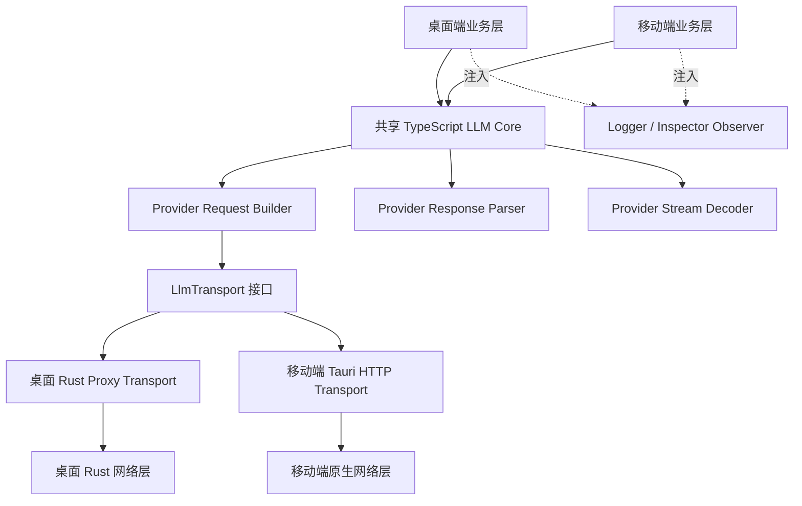

# LLM Provider Adapter 多端共享与 Rust 边界调查

> 状态：实施中（OpenAI Responses 共享与双端接入已完成，批次 7 继续施工 Claude/Cohere）
>
> 最后更新：2026-07-15
>
> 移动端校准基线：`af864a1f0a8ac82d46460e80bf6cdc8df862f466`
>
> 关联现状文档：[`docs/architecture/llm-apis-architecture.md`](../architecture/llm-apis-architecture.md)

## 实施进度（2026-07-15）

已完成首个可验证批次：

- 新增 `packages/llm-core` Bun workspace，并由桌面端和移动端通过 `@aiohub/llm-core` 引用。
- 建立纯 TypeScript 的 canonical `LlmRequest`、`LlmResponse`、`ProviderAdapter`、`WireRequest`、`WireResponse`、`LlmTransport`、Observer 和流式事件类型。
- 为 JSON、multipart 和顶层请求体定义显式 `LocalFileRef`，并提供严格 tagged 校验与嵌套引用检测，避免把普通 Provider JSON 误判为本地文件。
- 实现与应用框架无关的增量 SSE / JSONL 分帧器，覆盖 UTF-8 跨 chunk、逐字节切块、CRLF/LF、粘包、流末尾无换行、`[DONE]` 和取消。
- 将桌面端与移动端原有 `sse-parser` 入口改为共享 Core 的兼容 Facade；现有 Adapter 导入路径和调用签名不变。
- 将两端正文与推理 delta 提取逻辑合并为共享实现，保留 OpenAI、OpenAI Responses、DeepSeek/OneAPI、Claude、Gemini、Vertex AI、Cohere 和 Hugging Face 行为并集。
- 共享包独立类型检查通过，独立 Vitest 共 23 个用例通过；桌面 SSE 回归 3 个用例、移动端现有 5 个用例、移动端类型检查和两端 Vite 构建通过。

已完成第二个可验证批次：

- 将移动端 `useLlmRequest` 的 Profile Store、KeyManager、Provider 执行器、logger 和 error handler 收束为显式 `LlmRequestDependencies`，新增可直接测试的 `createLlmRequest`；现有无参 `useLlmRequest()` 入口和 Provider 分派行为保持不变。
- 冻结 `sendRequest(options, profileId?)` 的首批 Facade 契约：显式 Profile 覆盖当前选中 Profile、默认流式与 5 分钟超时、Profile 网络选项注入、Key 轮询结果注入、成功/失败上报及错误重抛。
- 覆盖 Agent 已接线的 `maxTokens`、`temperature`、`topP`、`frequencyPenalty`、`presencePenalty`、`stop` 透传，并验证正文流、推理流和最终 API usage 三条交付路径保持独立且无丢失。
- 新增移动端 OpenAI-Compatible wire payload 基线，覆盖 URL、鉴权/自定义 Header、标准生成参数映射和未知 Provider 扩展参数透传。
- 新增 OpenAI-Compatible 固定 SSE fixture，验证正文 delta、推理 delta、详细 usage 和 `[DONE]` 的解析结果；移动端 Vitest 现为 10 个用例，移动端类型检查通过。

已完成第三个可验证批次：

- 将移动端 OpenAI-Compatible 的请求构建与非流式响应解析拆成可独立调用的纯函数，并通过 `createOpenAiCompatibleApi` 显式注入 Transport、响应状态校验和 logger；现有 `callOpenAiCompatibleApi(profile, options)` 兼容入口保持不变。
- 修正自定义 Chat Completions 端点构建时未传入 Profile 的问题，纯 builder 现可直接覆盖自定义相对端点、Header 和最终 Provider body。
- 将 `relaxIdCerts`、`http1Only` 收束为 Transport 控制字段：它们会进入移动网络层，但不再被未知参数透传机制误写入 Provider JSON。
- OpenAI-Compatible 单测不再通过模块 mock 劫持平台网络函数，改为直接注入测试 Transport，并新增纯 builder、自定义端点和非流式拒绝响应覆盖。
- 共享包 23 个用例、移动端全量 12 个用例、移动端与桌面端类型检查及两端 Vite 生产构建通过；构建仅保留既有的第三方 `vconsole` eval、大 chunk 和动态导入提示。

已完成第四个可验证批次：

- 在 `@aiohub/llm-core` 新增完整的 OpenAI-Compatible 纯 Provider 实现，覆盖 URL/Header、canonical 消息和标准/扩展参数到 `WireRequest` 的映射、非流式响应解析、usage/tool call/annotation/图片资产归一化，以及实现 `ProviderAdapter` 契约的增量流式 Decoder。
- 流式 Decoder 以逐字节 fixture 验证 UTF-8、CRLF/LF、正文与推理 delta、分片 tool call、详细 usage、`[DONE]` 和最终 `completed.response`；共享包测试由 23 个增加到 28 个。
- 桌面 OpenAI Chat 已使用共享 body builder、非流式 parser 和流式 Decoder；现有 `fetchWithTimeout`、Rust 代理、大 body 异步序列化、Inspector Header、自定义 Header 模板、DeepSeek reasoning artifact 和图片兼容扫描仍保留在桌面 Facade。
- 新增桌面差分 payload 与流式回归，确认标准参数、未知 Provider 扩展、`extra_body`、thinking、requestId、正文/推理回调、usage、finish reason 和 tool calls 接线等价；同时修复 `repetitionPenalty` 声明但未提取，以及 `extraBody` 同时泄漏为 camelCase 顶层字段的既有问题。
- 共享包 28 个用例、根 Vitest 全集 60 个测试文件/424 个用例、移动端全量 12 个用例及两端 Vite 生产构建通过；构建仅保留既有的第三方 `vconsole` eval、大 chunk、动态导入和插件耗时提示。

已完成第五个可验证批次：

- 在 `@aiohub/llm-core` 新增通用 Provider 执行器，统一串联 Adapter 请求构建、`LlmTransport.send`、非流式解析、流式 Decoder、canonical 事件派发和最终响应交付；同时提供接收已构建 `WireRequest` 的过渡入口，允许应用 Facade 分批迁移复杂请求映射。
- 新增桌面 `LlmTransport`，将 `WireRequest` 收束到现有 `fetchWithTimeout` 平台入口，保留 Rust 代理、Inspector、超时、取消、TLS/HTTP 选项和异步 JSON 序列化，并将 Fetch `Response` 转为状态、Header 和原始字节流保真的 `WireResponse`。
- 桌面 OpenAI Chat 的流式与非流式路径现均由共享执行器、共享 Adapter 响应语义和桌面 Transport 驱动，移除 Adapter 内直接 fetch、二次 SSE Facade 分帧和重复图片扫描；桌面兼容层继续映射 DeepSeek reasoning artifact、annotations、audio、logprobs、system fingerprint 和 service tier。
- 当前 Rust 代理仍只展开旧式 `local-file://` 字符串；桌面 Transport 会继续识别并标记该路径，但对 tagged JSON `LocalFileRef`、multipart `LocalFileRef` 和顶层 `file-ref` 显式拒绝，待阶段 5 `/proxy/json-expand` 与 raw/upload 路径实现后再开放，避免把文件引用对象原样误发给 Provider。
- 共享包现为 6 个测试文件/30 个用例，根 Vitest 全集 62 个测试文件/430 个用例，移动端全量 4 个测试文件/12 个用例；共享包与两端类型检查、两端 Vite 生产构建均通过。构建仅保留既有的第三方 `eval`、大 chunk、动态导入、Node 外部化和插件耗时提示。

已完成第六个可验证批次：

- 新增移动端 `LlmTransport`，将共享 `WireRequest` 收束到现有 Tauri HTTP `fetchWithTimeout`，统一 JSON、文本、字节和 multipart 序列化、状态校验、超时/取消、响应 Header/字节流保真及 Observer 事件；tagged JSON、multipart 和顶层 `LocalFileRef` 在原生展开路径实现前继续显式拒绝。
- 移动端 OpenAI-Compatible 现通过兼容 Facade 将既有 `LlmProfile`、`LlmRequestOptions` 和多模态消息转换为 canonical DTO，再直接调用共享 `ProviderAdapter.buildRequest` 与统一执行器；正文和推理事件仍分别映射到 `onStream`、`onReasoningStream`，最终 usage、tool calls、annotations、audio、logprobs、system fingerprint 和 service tier 映射回现有 `LlmResponse`。
- 删除移动端重复的 OpenAI-Compatible wire builder、非流式 parser 和 SSE 解析循环；保留 `openAiUrlHandler` 兼容入口供模型列表与其他端点继续使用，并保持 KeyManager、Profile 显式覆盖、错误重抛和聊天 Token Counting 回退边界不变。
- canonical OpenAI-Compatible 映射补齐工具定义 `strict`、视频 `video_metadata`、图片 MIME 推断和 image-document 转换；未知 Provider 扩展参数继续透传，`relaxIdCerts`、`http1Only` 等 Transport 控制字段不会进入 Provider JSON。
- 共享包 6 个测试文件/30 个用例、根 Vitest 全集 62 个测试文件/430 个用例、移动端全量 5 个测试文件/16 个用例、lint、两端前端类型检查和两端 Vite 生产构建通过。首次并发全量验证时 AIO File Operator 的一个无关用例触发 5 秒超时，单独复跑及无构建争用的第二次根全量验证均通过；lint 仅保留 `mermaidFixer.ts` 既有的 4 条 unreachable warning，构建仅保留既有第三方 `eval`、大 chunk、动态导入、Node 外部化和插件耗时提示。

已完成第七个可验证子批次（批次 7 尚未整体完成）：

- 在 `@aiohub/llm-core` 新增完整的 OpenAI Responses Provider，实现 canonical 消息、system instructions、多模态输入、reasoning artifact 回放、扁平函数工具、参数与自定义端点到 `WireRequest` 的映射，以及非流式 parser 和增量流式 Decoder。
- Responses 流式 Decoder 覆盖正文、推理、拒绝、partial image、usage、tool call、Provider error 和最终 `response.completed`，并通过逐字节 UTF-8、CRLF/LF fixture 验证；原始 `response.output` 与 response id 通过 canonical metadata 保真交付，供桌面 Facade 生成下一轮回放 artifact。
- 桌面与移动端 `callOpenAiResponsesApi` 均改为直接调用共享 `ProviderAdapter.buildRequest`、统一执行器和各自 Transport；删除两端重复的请求 builder、非流式 parser、直接 fetch 与 SSE 循环，同时保留桌面自定义 Header resolver、网络策略、图像生成工具、reasoning artifact，以及两端既有正文/推理/partial image 回调契约。
- 移动端补齐显式 `responsesStore`、`include`、`onPartialImage` 与图片响应类型；Responses 内部控制字段不再被未知参数机制误透传。函数工具在共享 builder 中按 Responses API wire contract 扁平化为 `type/name/parameters/strict`，不再沿用 Chat Completions 的嵌套 `function` 结构。
- 共享包现为 7 个测试文件/33 个用例，根 Vitest 全集 63 个测试文件/435 个用例，移动端全量 6 个测试文件/18 个用例；lint、共享包及两端类型检查、两端 Vite 生产构建均通过。lint 仅保留 `mermaidFixer.ts` 既有的 4 条 unreachable warning，构建仅保留既有第三方 `eval`、大 chunk、动态导入、Node 外部化和插件耗时提示。

实施顺序相对原计划有一处受控调整：仓库已经存在多组 Provider Adapter 单测，因此先落地阶段 1 的无业务侵入骨架和公共分帧器，再继续补齐阶段 0 的完整 wire fixture、两端差分记录和性能基线。现阶段阶段 0 已完成移动 Facade、OpenAI-Compatible 与 OpenAI Responses 基线，但 Claude、Gemini、Cohere、Vertex fixture、其余双端差分记录和性能基线仍未完成；阶段 1.5 已完成移动 Facade、双端 OpenAI-Compatible、双端 OpenAI Responses 与桌面 OpenAI Chat 的平台请求隔离，其余文本 Provider 仍待解耦；阶段 2/3 已完成 OpenAI-Compatible 共享与双端接入，阶段 4 已完成 OpenAI Responses 子批次，Claude/Cohere 仍是批次 7 的剩余主线。Android/iOS 真机流式读取、取消和后台切换行为仍待批次 9 验证。桌面 OpenAI-Compatible 请求构建仍在 Facade 中保留多媒体预处理、DeepSeek 回放和未知参数注入，再以过渡 `WireRequest` 入口进入共享执行器；将这些映射完全 canonical 化并改为直接调用 `ProviderAdapter.buildRequest` 仍待批次 7 后续收口。

此前记录的全仓验证阻塞均已处理：Smart OCR 历史表格引用改用 Element Plus 导出的 `TableInstance`；OpenAI Adapter 测试已与第三方兼容模型支持 `reasoning_effort` 的现行契约对齐，并保留不支持模型的负向覆盖；聊天草稿测试将一次性模块加载移出 `beforeEach`，避免全量并发时触发 hook 超时。桌面 `check:frontend`、根 Vitest 全集（59 个测试文件、417 个用例）及桌面 Vite 生产构建均已通过。

## 1. 背景

AIO Hub 桌面端与移动端都包含 LLM Provider 适配能力，但目前分别维护实现：

- 桌面端适配器位于 `src/llm-apis/`，覆盖聊天、Responses、Embedding、图片、音频、视频等能力。
- 移动端适配器位于 `mobile/src/tools/llm-api/core/adapters/`，独立实现 OpenAI、OpenAI Responses、Claude、Gemini、Cohere、Vertex AI 等协议。
- 桌面端默认通过 `src-tauri/src/commands/llm_proxy.rs` 中的 Rust 代理访问上游，但 Provider 请求结构构建和响应语义解析仍在 TypeScript 中完成。

初步讨论曾考虑将整个 LLM 渠道适配器下沉到 Rust，以统一桌面端和移动端实现。进一步调查后，本文件建议调整方向：

> **Provider 请求结构构建与响应语义解析继续使用共享 TypeScript；Rust 仅承担稳定、系统相关的 Transport 能力。**

该方案优先解决多端重复实现和大请求传输问题，同时避免 Provider 协议变化导致频繁 Rust 编译和双端原生构建。

## 2. 调查结论

### 2.1. 推荐决策

1. 新建纯 TypeScript 的共享 LLM Provider Core，供桌面端和移动端共同使用。
2. 将当前 Adapter 拆分为请求构建、非流式响应解析和流式响应解析三个纯逻辑部分。
3. 通过依赖注入提供平台 Transport、日志、Inspector 和运行时取消能力。
4. Rust 保留并增强网络代理、TLS、HTTP 版本、系统代理、本地文件读取、连接池和底层取消能力。
5. 不因“统一多端实现”而把 Provider 协议整体迁移到 Rust。
6. 只有在基准测试证明某段响应解析存在实际瓶颈，或需要脱离 WebView 后台运行时，才选择性下沉该能力。

### 2.2. 不建议整体下沉 Rust 的原因

Provider Adapter 属于变化频繁的协议防腐层，常见变更包括：

- 新增或调整请求字段。
- 修改自定义端点和请求头规则。
- 兼容第三方 OpenAI-Compatible 渠道的非标准行为。
- 扩展流式事件、reasoning artifact、tool call、usage 和媒体结果解析。
- 跟进 OpenAI Responses、Gemini、Claude 等上游协议演进。

这些工作在 TypeScript 中具备更快的开发反馈：

- 可使用 Vitest 快速验证请求体和响应 fixture。
- 不需要等待 Cargo 增量编译、Tauri 重启或移动端原生重新构建。
- 更容易检查和调试原始 JSON/SSE 数据。
- `Record<string, unknown>`、自定义参数和非标准响应兼容成本较低。

请求对象的字段映射和普通 JSON 解析通常不是性能瓶颈。当前更明显的成本来自大请求序列化、重复 JSON 编解码、Base64 跨边界传输和二进制流处理。

### 2.3. `af864a1f` 合并后的校准结论

本次移动端合并没有修改 `mobile/src/tools/llm-api/` 下的 Provider Adapter、请求类型或请求入口，因此“共享 TypeScript Provider Core + 平台 Transport”的主决策保持不变。合并后需要纳入迁移约束的是 Adapter 上下游已经扩展的业务契约：

- `useChatExecutor` 会优先使用智能体绑定的 Profile 和 Model，并将 `maxTokens`、`temperature`、`topP`、`frequencyPenalty`、`presencePenalty`、`stop` 传入 `useLlmRequest`。
- 移动端聊天运行时分别消费 `onStream` 和 `onReasoningStream`，最终再从 `LlmResponse` 合并正文、推理内容和 usage。
- `useChatResponseHandler` 优先使用 API 返回的 `promptTokens` / `completionTokens`，缺失时调用移动端 Rust Token Counting command 做本地估算。
- Agent Preset 注入、上下文 Token 风险计算、会话树和自动命名均位于 Provider Adapter 上游，不能随 Adapter 一起迁入共享 Core。
- 移动端已增加独立的 `test:run` 脚本，可以承担共享 Adapter 接入后的移动端契约与回归测试。

因此，阶段 0 不能只冻结 Provider wire fixture，还必须冻结当前移动端 `useLlmRequest.sendRequest(options, profileId?)` 的兼容入口，以及正文流、推理流、最终 usage 三类消费行为。共享事件模型可以作为 Core 内部的 canonical contract，但移动端迁移期间需要由兼容层映射回现有回调和最终响应，避免同时重构 LLM Chat。

## 3. 当前边界与问题

### 3.1. 当前桌面端链路

```text
useLlmRequest
  -> TypeScript Provider Adapter
  -> 构建 Provider 请求体并序列化
  -> fetchWithTimeout
  -> 解析已序列化 JSON
  -> 包装为 ProxyRequest 并再次序列化
  -> Axum localhost 代理
  -> Rust 反序列化 ProxyRequest
  -> reqwest 再次序列化 Provider body
  -> 上游 API
  -> 原始 SSE / JSON / 二进制响应
  -> localhost 代理转发
  -> TypeScript Provider Adapter 解析
  -> LlmResponse
```

其中 Provider 请求结构与响应语义都在 TypeScript，Rust 代理只理解通用 HTTP 请求。

### 3.2. 主要问题

#### 多端重复实现

桌面端与移动端分别维护 Provider Adapter，容易产生以下漂移：

- 同一 Provider 的字段支持不一致。
- 流式事件、usage、tool call 或 reasoning 解析行为不一致。
- 修复只落在其中一端。
- 测试用例和协议 fixture 重复建设。

#### 桌面端 JSON 重复编解码

对于普通 JSON 请求，当前代理路径会经历多次 parse/stringify。请求体结构构建本身成本不高，但重复处理会放大大型上下文和多模态请求的内存占用。

#### 大文件和 Base64 跨边界

项目历史上曾使用 Tauri IPC Channel 代理原始请求和响应，后因大型多媒体数据的 IPC 序列化与流处理成本改为 Axum 回环 HTTP。后续设计不能简单恢复旧 Channel 实现。

大文件应继续通过路径或资产引用交给 Rust 读取，避免 Base64 在 WebView、IPC 和 Rust 之间重复复制。

#### Adapter 与平台代码耦合

当前部分桌面 Adapter 直接依赖以下平台模块：

- `fetchWithTimeout`
- 应用 logger 和 error handler
- Inspector hook
- 设置页中的自定义 Header 模板解析
- 桌面路径别名

移动端则直接依赖自己的请求工具和类型。这些依赖使 Adapter 不能直接作为共享包使用。

#### 移动端业务层与请求入口的契约已加深

合并 `af864a1f` 后，移动端 `useLlmRequest` 不再只服务简单文本聊天。智能体绑定、预设注入、推理流展示、API usage 校准和生成速度统计都通过该入口串联。这里的耦合不应进入共享 Provider Core，但迁移必须提供稳定的 Facade：

- 保留显式 `profileId` 覆盖能力，不能退回只读取当前选中 Profile。
- 保留调用方已传入的标准生成参数和未知扩展参数；当前 Agent 已接线的六类参数不得丢失，参数清理仍由 Provider Adapter 完成。
- 同时交付正文增量和推理增量，并在完成时返回完整的 canonical response。
- 保留 API usage 的精度；本地 Token Counting 只作为聊天业务层回退，不能混入 Provider 解析。

#### 回环代理安全边界

当前 Axum 服务绑定 `127.0.0.1`，使用宽松 CORS，并接受调用方提供的目标 URL、Headers 和 Body。即使暂不移除回环代理，也应增加每次应用启动生成的 capability token，并收紧 Origin/CORS 策略，避免它成为无鉴权的本地通用 HTTP 代理。

## 4. 目标架构



### 4.1. 共享 TypeScript Core 的职责

- 统一请求、响应和 Provider 类型。
- 根据统一请求构建 Provider wire payload。
- 构建 Provider URL 和 Headers。
- 解析非流式 JSON 响应。
- 对 SSE、JSONL 等流进行分帧和 Provider 语义解析。
- 归一化文本、推理、工具调用、usage、引用和媒体元数据。
- 保留 `extraBody`、自定义 Header 和自定义端点扩展能力。
- 提供纯函数和 fixture 测试，不直接访问应用状态。

### 4.2. 应用业务层保留的职责

- Profile 的 CRUD 和持久化。
- API Key 轮询、熔断和恢复。
- 模型能力与参数过滤策略。
- Agent Manager 的模型绑定、生成参数、预设消息和导入兼容字段。
- LLM Chat 上下文管道、会话树和持久化。
- 上下文 Token 预估、风险阈值、生成速度等会话指标。
- VCP 工具发现、审批、执行和迭代循环。
- UI 消息、错误展示和生成状态。
- Inspector 的界面状态和跨窗口同步。

### 4.3. Rust / 平台 Transport 的职责

- 执行通用 HTTP 请求。
- 系统代理、自定义代理和直连策略。
- TLS 证书策略和 HTTP/1.1、HTTP/2 控制。
- `reqwest::Client` 连接池复用。
- 本地文件和资产引用读取。
- 大型 JSON、multipart 和二进制请求传输。
- 原始响应状态、Headers 和 Body 流转发。
- 请求取消、连接超时和底层网络错误归一化。

Rust Transport 不应理解以下概念：

- OpenAI、Claude、Gemini 等 Provider 类型。
- `LlmProfile`、`ModelCapabilities` 或智能体配置。
- Provider 请求字段和响应事件含义。
- VCP 工具调用或聊天会话状态。

## 5. 建议的共享包结构

推荐使用独立 Bun workspace package，而不是让移动端继续跨目录引用桌面端源码。

```text
packages/llm-core/
├── package.json
├── tsconfig.json
├── src/
│   ├── index.ts
│   ├── types/
│   │   ├── request.ts
│   │   ├── response.ts
│   │   ├── transport.ts
│   │   └── provider.ts
│   ├── providers/
│   │   ├── openai/
│   │   ├── anthropic/
│   │   ├── gemini/
│   │   ├── cohere/
│   │   └── vertexai/
│   ├── request-builder/
│   ├── response-parser/
│   ├── stream-parser/
│   └── utils/
└── tests/
    └── fixtures/
```

根 `package.json` 的 workspace 配置届时需要加入 `packages/*`。

### 5.1. 共享包约束

共享包不得直接依赖：

- Vue、Pinia、Element Plus、Varlet。
- 桌面端或移动端 Store。
- `@tauri-apps/*`。
- DOM UI 元素和组件生命周期。
- 应用级 logger、error handler 或 Inspector 单例。
- `@/` 等绑定单一应用 Vite root 的路径别名。
- `src/views/`、`mobile/src/views/` 等 UI 目录。

允许使用的运行时基础类型包括：

- `Uint8Array`
- `AbortSignal`，但只能出现在运行时 TransportOptions 中，不能进入可序列化请求 DTO。
- `AsyncIterable<Uint8Array>` 或项目自定义流接口。
- JSON-safe 数据结构。

## 6. 接口草案

### 6.1. Provider Adapter

```typescript
export interface ProviderAdapter {
  readonly id: string;

  buildRequest(
    profile: ProviderProfile,
    request: LlmRequest
  ): Promise<WireRequest> | WireRequest;

  parseResponse(response: WireResponse): Promise<LlmResponse>;

  createStreamDecoder(context: StreamDecoderContext): ProviderStreamDecoder;
}
```

`buildRequest` 只负责协议映射，不直接执行网络请求。

### 6.2. Wire Request

```typescript
export interface LocalFileRef {
  kind: "local-file-ref";
  path: string;
  contentType?: string;
}

export type WireJsonValue =
  | JsonPrimitive
  | LocalFileRef
  | WireJsonValue[]
  | { [key: string]: WireJsonValue };

export interface WireRequest {
  method: "GET" | "POST" | "PUT" | "PATCH" | "DELETE";
  url: string;
  headers: Record<string, string>;
  body?: WireBody;
  streaming: boolean;
}

export type WireBody =
  | { kind: "json"; value: WireJsonValue }
  | { kind: "text"; value: string; contentType?: string }
  | { kind: "bytes"; value: Uint8Array; contentType: string }
  | { kind: "multipart"; parts: MultipartPart[] }
  | { kind: "file-ref"; ref: LocalFileRef };
```

Provider Adapter 构建由 JSON 值和受控 `LocalFileRef` 组成的结构化 payload；Transport 负责校验文件引用并进行一次最终序列化。`LocalFileRef` 还必须允许作为 multipart part 的数据源，不能只覆盖“整个请求体就是一个文件”的少数场景。普通 Provider JSON 不得被误判为文件引用。

### 6.3. Transport

```typescript
export interface LlmTransport {
  send(request: WireRequest, options: TransportOptions): Promise<WireResponse>;
}

export interface TransportOptions {
  requestId: string;
  signal?: AbortSignal;
  timeoutMs?: number;
  network?: NetworkOptions;
  observer?: TransportObserver;
}

export interface WireResponse {
  status: number;
  statusText: string;
  headers: Record<string, string>;
  body: AsyncIterable<Uint8Array>;
}
```

共享 Adapter 只依赖 `LlmTransport` 接口，不关心桌面端使用 Axum 代理还是移动端使用 Tauri HTTP 插件。

### 6.4. 流式 Decoder

```typescript
export type LlmStreamEvent =
  | { type: "text-delta"; delta: string }
  | { type: "reasoning-delta"; delta: string }
  | { type: "tool-call"; toolCall: LlmToolCall }
  | { type: "usage"; usage: TokenUsage }
  | { type: "partial-image"; asset: MediaAssetRef; index: number }
  | { type: "completed"; response: LlmResponse };

export interface ProviderStreamDecoder {
  push(chunk: Uint8Array): LlmStreamEvent[];
  finish(): LlmStreamEvent[];
}
```

Decoder 自己维护 UTF-8 边界、SSE/JSONL 缓冲和 Provider 累积状态。调用方消费统一事件，不再通过多个可选回调拼装最终结果。

移动端首次接入时不要求同步改造 LLM Chat。应用侧 Facade 应将 `text-delta` 映射到现有 `onStream`，将 `reasoning-delta` 映射到 `onReasoningStream`，并将 `completed.response` 返回给 `useChatResponseHandler`。`usage`、`reasoningContent`、`finishReason`、`toolCalls` 和 annotations 必须以最终 response 为准，流式事件不能导致最终结果缺字段。

### 6.5. Observer

```typescript
export interface TransportObserver {
  onRequest?(event: TransportRequestEvent): void;
  onResponseStart?(event: TransportResponseStartEvent): void;
  onResponseChunk?(event: TransportChunkEvent): void;
  onError?(event: TransportErrorEvent): void;
}
```

桌面端可通过 Decorator 或 `TransportOptions.observer` 注入 Inspector。共享 Provider Adapter 不应直接导入 `inspectorHookRegistry`。

## 7. Rust Transport 优化方向

### 7.1. 拆分 raw 与 json-expand 路径

建议将当前 `/proxy` 拆分为两个明确路径：

#### `/proxy/raw`

- 原样转发 JSON、文本、二进制和 multipart。
- 不解析 Provider 请求体。
- 避免 TypeScript `JSON.parse`、ProxyRequest 包装和 Rust `.json()` 再序列化。
- 支持原始 method，而不是固定为 POST。

#### `/proxy/json-expand`

- 仅用于包含 `local-file://` 或后续结构化 FileRef 的 JSON 请求。
- Rust 解析一次 JSON，读取并展开本地文件，再序列化一次发送上游。
- 保持现有大文件不经过 IPC/Base64 的设计目标。

### 7.2. Client 池

当前代理每次请求重新构建 `reqwest::Client`。后续应按以下网络策略组合缓存 Client：

- proxy mode / proxy URL
- relax invalid certs
- HTTP/1.1 only
- 其他会影响 ClientBuilder 的稳定选项

目标是复用连接池和 TLS 会话，避免每次请求重新创建 Client。

### 7.3. 回环代理鉴权

启动代理时生成随机 capability token，通过 `start_llm_proxy_server` 返回给当前 WebView。每个代理请求必须携带该 token，Rust 端验证后才允许转发。

同时应：

- 移除 `CorsLayer::permissive()`。
- 仅允许实际 Tauri WebView 所需的 Origin 和 Headers。
- 不把 capability token 持久化到磁盘。
- 应用重启后使旧 token 自动失效。

### 7.4. 不恢复旧式原始 Channel 代理

如果未来使用 Tauri Channel，应只发送小型、批量后的规范化事件，不能传输大块 Base64 或二进制，也不能在 Channel 接收端累积完整响应后才构造结果。

在 Provider 解析继续保留于 TypeScript 的前提下，现阶段保留流式 HTTP Response 比把原始字节改走 Channel 更直接。

## 8. 施工状态与批次计划

### 8.1. 当前状态核查（2026-07-15）

| 原阶段                         | 状态               | 已落地                                                                                                    | 未闭环                                                                                                      |
| ------------------------------ | ------------------ | --------------------------------------------------------------------------------------------------------- | ----------------------------------------------------------------------------------------------------------- |
| 阶段 0：契约冻结与基线         | 部分完成           | 移动 `sendRequest` Facade、OpenAI-Compatible 与 Responses wire/stream fixture、正文/推理/usage 契约已冻结 | Claude、Gemini、Cohere、Vertex fixture 与其余双端差分记录尚缺；大文本、文件和媒体性能基线尚缺               |
| 阶段 1：共享包骨架             | 已完成             | `packages/llm-core`、canonical DTO、Wire 类型、LocalFileRef、SSE/JSONL 分帧器及独立测试已落地             | 无阻塞项，后续按 Provider 扩展类型                                                                          |
| 阶段 1.5：应用依赖解耦         | 部分完成           | 移动请求入口、双端 OpenAI-Compatible、双端 OpenAI Responses 和双端 Transport 已完成依赖收束               | Claude、Gemini、Cohere、Vertex 仍直接依赖应用 fetch、logger、error handler、i18n、Header resolver 等模块    |
| 阶段 2：桌面 OpenAI-Compatible | 主链路完成         | 共享纯 Adapter、统一执行器、桌面 Transport、流式与非流式接线和差分回归已完成                              | 桌面多媒体预处理、DeepSeek 回放和部分扩展参数仍通过过渡 `WireRequest` 入口进入执行器，尚未完全 canonical 化 |
| 阶段 3：移动 OpenAI-Compatible | 代码完成，真机待验 | 移动 Transport、canonical 映射、兼容 Facade、旧 builder/parser/SSE 循环删除和回归测试已完成               | Android/iOS 的真实流式读取、取消与后台切换尚未验证                                                          |
| 阶段 4：其他 Provider          | 进行中             | OpenAI Responses 共享 Adapter、双端 Facade、wire/stream fixture 与差分回归已完成                          | Claude、Gemini、Cohere、Vertex、Embedding、模型列表和媒体能力仍未共享                                       |
| 阶段 5：Rust Transport 优化    | 未开始             | 桌面 Transport 已对暂不支持的 tagged FileRef 显式拒绝，避免静默误发                                       | raw/json-expand、multipart/file-ref 原生展开、Client 池、capability token、严格 CORS 和性能复测均未落地     |

当前不存在需要先停工清债的架构阻塞。下一步的主要成本已经从“搭骨架”转为“迁移重复协议实现”；如果继续把依赖解耦、共享 Adapter、桌面接线、移动接线分别算作独立批次，会反复支付差分测试、全量类型检查和两端构建成本。

### 8.2. 批次调整原则

- **批次按可交付能力划分，不按单个文件或单个重构动作划分。** 一个迁移批次必须同时包含 fixture/差分基线、共享 Adapter、桌面 Facade、移动 Facade、旧重复实现清理和验收。
- **同协议族合并施工。** OpenAI Responses 与 Anthropic/Cohere、Gemini 与 Vertex AI 分别共享大量事件、消息、工具调用和鉴权映射，应在同批内提取公共构件，避免连续复制临时兼容层。
- **阶段 0 与阶段 1.5 不再单独排尾批。** 缺失的 fixture、差分记录和应用依赖解耦随对应 Provider 批次一并完成；性能基线随 Transport 批次完成。
- **一个宏批次允许包含多个原子提交。** 中间提交用于降低审查和回退风险，但只有整批通过共享包测试、两端回归、类型检查和 Vite 生产构建后才标记批次完成。
- **旧实现只保留到同批差分验证结束。** 批次验收时删除已被共享 Core 取代的 builder、parser 和流循环，不把长期双实现留给下一批。

### 8.3. 调整后的施工批次

#### 批次 1-6：共享基础设施与 OpenAI-Compatible 双端闭环（已完成）

对应本文件顶部记录的六个可验证批次，已经完成共享包骨架、公共流解析、移动 Facade 契约、OpenAI-Compatible 纯 Adapter、统一执行器以及桌面/移动 Transport 接入。

该里程碑仍有两个明确尾项，但不再各自拆成小批：桌面 OpenAI-Compatible 的过渡 `WireRequest` 映射并入批次 7 收口；Android/iOS 真机行为并入批次 9 的 Transport 验收。

#### 批次 7：主流文本协议族 I（OpenAI Responses + Anthropic Claude + Cohere）

当前子进度：OpenAI Responses 已完成共享 Core、桌面/移动接线、旧实现删除和全量验收；Anthropic Claude、Cohere 及桌面 OpenAI-Compatible canonical 收口尚未完成，因此批次 7 保持进行中。

- 一次补齐三类协议的固定 wire/stream fixture、异常/取消用例和桌面/移动差分记录。
- 在共享 Core 中实现 OpenAI Responses、Anthropic Messages 和 Cohere Chat 的 builder、非流式 parser 与增量 Decoder，并复用统一执行器。
- 同批完成桌面与移动 Facade 接线，保留 Profile、KeyManager、Inspector、i18n/error mapping 和现有回调契约。
- 收口桌面 OpenAI-Compatible 尚存的多媒体预处理、DeepSeek reasoning artifact 回放和扩展参数映射，使聊天主链统一直接调用 `ProviderAdapter.buildRequest`。
- 删除两端被取代的 Responses、Claude、Cohere 请求构建、响应解析和 SSE 循环；保留仅属于应用层的兼容映射。
- 验收以三类 Provider 的最终 `WireRequest`、流式事件、`LlmResponse` 双端等价为准，不把“完成某一个 Provider”提前算作整批完成。

#### 批次 8：Google 协议族与向量能力（Gemini + Vertex AI + Embedding）

- 将 Gemini Developer API、Vertex Gemini 和 Vertex Anthropic 的共有消息、内容 part、工具、reasoning、usage 与流事件归一化为共享构件。
- 同批迁移 Gemini、Vertex AI 的桌面与移动聊天链路，覆盖 Vertex 鉴权/Header 差异，但不把认证状态放入共享 Core。
- 扩展 canonical Embedding 请求/响应，并迁移 OpenAI、Gemini、Cohere 的 Embedding builder/parser；模型列表只复用 URL/Header/Transport 构件，不强行塞入聊天 Adapter 接口。
- 补齐多模态输入、tool call/tool result、Gemini thought、Vertex Claude、批量 Embedding 和维度/usage 差分 fixture。
- 删除已取代的两端 Gemini/Vertex 聊天实现和桌面重复 Embedding 协议逻辑，并完成共享包、桌面、移动全量验收。

#### 批次 9：Transport、文件引用、安全与真机闭环

- 将桌面 Rust 代理拆分为 `/proxy/raw` 与 `/proxy/json-expand`，支持 JSON 嵌套 tagged `LocalFileRef`、multipart part 和顶层 `file-ref` 的受控原生读取。
- 增加按稳定网络策略复用的 `reqwest::Client` 池，以及 capability token、严格 Origin/CORS 和敏感 Header/日志保护。
- 为桌面与移动 Transport 建立同一组合约用例，覆盖状态/Header 保真、流式字节、取消、超时、流中断、multipart、二进制和文件引用。
- 完成大文本、本地文件和媒体请求的序列化次数、峰值内存、TTFB 基线与复测，结果写回本文件；没有基准证据时不下沉 Provider 语义解析。
- 使用项目真实 Tauri 运行方式验证 Android/iOS 流式读取、取消和后台切换，并记录无法自动化的设备/系统版本边界。
- 本批涉及 Rust，除两端前端验证外必须通过桌面端与移动端后端检查。

#### 批次 10：同步媒体能力（图片 + 音频 + 模型列表）

- 扩展共享 Core 的媒体请求、媒体资产和二进制/URL 响应契约，复用批次 9 的 FileRef 与 multipart 能力。
- 迁移 OpenAI、Gemini、SiliconFlow、xAI 图片生成以及 OpenAI 音频生成的请求构建和响应解析；Provider 特有参数继续通过显式扩展字段承载。
- 统一桌面和移动可复用的模型列表请求路径、URL/Header 规则与错误语义，同时保留应用侧模型元数据写入边界。
- 覆盖输入图片编辑、Base64/URL 资产、音频二进制、Provider JSON 错误和大文件不穿过 WebView 内存的回归。
- 接入现有媒体生成业务 Facade 后删除重复协议代码；不在运行时读取全局模型元数据规则补齐 `mediaGenParams`。

#### 批次 11：异步媒体任务（视频 + 音乐）与总验收

- 为创建任务、轮询、进度、取消、完成资产和 Provider 错误建立共享的异步任务契约，不将轮询状态塞入一次性聊天响应模型。
- 迁移 OpenAI/Gemini 视频、Suno NewAPI 和 MiniMax Music 等异步媒体 Adapter，统一可共享的任务生命周期，保留 Provider 专有状态映射。
- 覆盖任务创建后恢复、轮询超时、主动取消、失败终态、多资产结果和应用重启后的兼容行为。
- 清点并删除两端剩余的重复 Provider builder/parser/stream loop，确认共享包不导入 Vue、Pinia、Tauri、Store 或 UI 模块。
- 执行第 9 节全量测试和第 10 节架构、行为、性能、安全验收，更新架构文档后结束本计划。

批次 7-11 是交付批次，不等同于单个 Git 提交。建议每批内部按“共享协议与 fixture -> 桌面/移动接线 -> 删除旧实现与全量验收”组织 2-4 个可审查提交；任一中间提交均不得宣称该宏批次完成。

## 9. 测试策略

### 9.1. 请求构建测试

每个 Provider 至少覆盖：

- 最小文本请求。
- System/User/Assistant 多轮消息。
- 多模态内容。
- 工具定义、tool choice 和 tool result。
- 推理参数和 reasoning artifact 回放。
- 自定义 Header、端点和 `extraBody`。
- 参数清理和未知参数透传。

测试应比较最终 WireRequest，而不是只验证中间辅助函数。

### 9.2. 流式解析测试

同一个 fixture 必须以多种切块方式输入 Decoder：

- 完整事件一个 chunk。
- 每个字节一个 chunk。
- UTF-8 多字节字符中间切断。
- 多个事件粘在一个 chunk。
- CRLF 与 LF 混合。
- 流末尾无换行。

无论切块方式如何，输出的 `LlmStreamEvent[]` 和最终 `LlmResponse` 必须一致。

### 9.3. Transport 合约测试

桌面和移动 Transport 应共享一套合约用例：

- 状态码与 Headers 保真。
- 非流式 JSON 和文本响应。
- SSE 持续传输。
- 用户取消。
- TTFB 超时和流中断。
- 本地文件引用。
- multipart 与二进制响应。

### 9.4. 移动端 Facade 回归测试

- 显式 `profileId` 覆盖当前选中 Profile，且 Key 轮询/熔断仍作用于最终选中的 Profile。
- Agent 的 `maxTokens`、`temperature`、`topP`、penalty 和 stop 参数无损进入 WireRequest。
- `text-delta` 与 `reasoning-delta` 分别且有序地进入现有两个回调。
- 流结束后返回的 `LlmResponse` 保留 usage、reasoning、finish reason、tool calls 和 annotations。
- API usage 缺失时仍由聊天业务层触发本地 Token Counting 回退；共享 Core 不伪造 usage。
- 取消、超时和 Provider 错误仍能触发 KeyManager 上报与当前错误处理路径。

### 9.5. 构建验证

实施阶段每个迁移批次至少执行：

- `bun run check:frontend`
- `bun run build`
- `cd mobile && bun run test:run`
- `cd mobile && bun run check:frontend`
- `cd mobile && bun run build`

涉及 Rust Transport 时额外执行对应桌面端和移动端后端检查。

## 10. 验收标准

### 架构验收

- 桌面端和移动端使用同一个 Provider Adapter 实现。
- 共享包不导入 Vue、Pinia、Tauri、应用 Store 或 UI 模块。
- Provider Adapter 不直接执行 fetch/invoke。
- Transport 不理解 Provider 语义。
- Inspector、logger 和错误处理通过注入或包装接入。

### 行为验收

- 同一请求在桌面端和移动端生成等价 WireRequest。
- 相同响应 fixture 在两端得到等价的 LlmResponse 和流式事件。
- Key 轮询、熔断、取消、超时和主动 interrupt 行为无回归。
- reasoning artifact、tool call、usage、annotations 和媒体元数据不丢失。
- `extraBody` 与非标准 OpenAI-Compatible 字段保持兼容。
- 移动端智能体绑定的 Profile、Model 和生成参数在迁移后保持等价。
- 正文流、推理流和最终 response 三条交付路径不重复、不丢失且顺序稳定。
- API usage 缺失时仍可走移动端本地 Token Counting 回退，Core 不生成虚假的精确 usage。

### 性能验收

- 普通 JSON 代理路径不再进行不必要的重复 parse/stringify。
- 本地大文件不会以 Base64 穿过 Tauri IPC。
- 流式输出不会等待完整响应结束后才交付给 UI。
- 峰值内存和主线程阻塞不高于迁移前基线。

### 安全验收

- 回环代理请求必须携带当次运行有效的 capability token。
- 不再使用任意 Origin 可访问的宽松 CORS。
- Rust 只读取明确标记的本地文件引用。
- 日志和 Inspector 不意外持久化 API Key 或 capability token。

## 11. 风险与应对

| 风险                                | 影响                        | 应对                                                |
| ----------------------------------- | --------------------------- | --------------------------------------------------- |
| 当前 Adapter 混入 UI/Store 依赖     | 无法直接迁移共享包          | 先通过 Transport、Observer、HeaderResolver 接口解耦 |
| 桌面与移动类型已发生漂移            | 共享类型迁移困难            | 先建立 canonical DTO，再写兼容转换层                |
| 第三方 OpenAI-Compatible 行为不标准 | 严格类型导致兼容下降        | 保留 JsonValue、extraBody 和 Header 扩展口          |
| 流式解析重构造成边界问题            | 丢字、重复字或完成状态异常  | 使用多切块 fixture 和差分测试                       |
| 媒体请求包含大二进制                | 共享层或 IPC 内存膨胀       | 使用 FileRef/AssetRef，Transport 负责读取和上传     |
| Workspace/alias 配置不一致          | Vite 或 Vitest 构建失败     | 共享包只用包内相对路径和 package exports            |
| 移动端聊天依赖旧回调式流接口        | 接入共享 Decoder 时行为回归 | 先保留 Facade 映射，再单独迁移消费接口              |
| usage 缺失或字段命名不一致          | Token 展示和上下文风险失真  | fixture 覆盖 Provider usage，并保留应用层本地回退   |
| 一次迁移范围过大                    | 难以定位回归                | 按 Provider 逐个迁移，保留短期 fallback             |

## 12. 暂不实施的内容

本计划不包含：

- 将 LLM Chat 会话和上下文管道迁移到 Rust。
- 将 VCP 工具调用引擎迁移到 Rust。
- 将 Profile 或 KeyManager 的持久化迁移到 Rust。
- 将 Agent Manager、Preset 注入或移动端 Token Counting command 纳入共享 Provider Core。
- 立即移除所有桌面端 Adapter 文件。
- 立即使用 Tauri Channel 替代所有流式 HTTP 响应。
- 在没有基准测试的情况下迁移 Provider 响应解析到 Rust。

## 13. 最终建议

多端共享 TypeScript Provider Adapter 在技术上不存在明显阻碍，关键不在语言，而在依赖边界。优先将 Adapter 改造成纯协议模块，再通过 Transport 和 Observer 注入平台能力，可以同时获得：

- 桌面与移动协议行为一致。
- Provider 适配保持快速开发和测试反馈。
- Rust 专注处理其擅长的网络、文件和系统能力。
- 避免为高频 Provider 变更承担不必要的原生编译负担。
- 后续仍保留按实测结果选择性下沉的空间。

因此，建议以“**共享 TypeScript Provider Core + 平台 Transport**”作为下一阶段的正式演进方向。

## 14. 架构师审查意见与补充 (Gugu's Review)

在对桌面端 `src/llm-apis/`、移动端 `mobile/src/tools/llm-api/core/adapters/` 以及 Rust 端 `llm_proxy.rs` 进行深度源码审查后，补充以下关键工程与安全设计，以确保方案落地时的健壮性：

### 14.1. 安全防线：Capability Token 强鉴权

当前 Rust 端的 Axum 代理服务绑定在 `127.0.0.1` 且使用了宽松的 CORS 策略，这在本地多应用共存环境下存在潜在的安全隐患（如恶意网页通过本地回环读取敏感文件或盗用 API Key）。

- **设计补充**：
  1.  **Token 签发**：Tauri 启动并调用 `start_llm_proxy_server` 时，在 Rust 端生成一个随机的 `uuid`（Capability Token），仅保存在内存中。
  2.  **Token 传递**：将此 Token 作为 `ProxyServerInfo` 的一部分返回给前端 WebView。
  3.  **请求校验**：前端在向本地代理发送请求时，必须在 Header 中携带 `X-Proxy-Token: <token>`。
  4.  **严格 CORS**：Rust 端的 Axum 拒绝任何不带正确 Token 或 Origin 不匹配的请求。

### 14.2. 内存优化：WireBody 与结构化内容显式支持 FileRef

为了避免大文件（如音视频、大图片）在 TS 端被读取为 `Uint8Array` 导致 WebView 内存暴涨，需要在 `WireBody`、JSON 结构化内容和 multipart part 中显式支持 `LocalFileRef`（即本地路径或资产 ID）。只给顶层 `WireBody` 增加文件分支并不足以覆盖 Provider 常见的嵌套多模态 JSON。

- **设计补充**：
  ```typescript
  export type WireBody =
    | { kind: "json"; value: WireJsonValue }
    | { kind: "text"; value: string; contentType?: string }
    | { kind: "bytes"; value: Uint8Array; contentType: string }
    | { kind: "multipart"; parts: MultipartPart[] }
    | { kind: "file-ref"; ref: LocalFileRef };
  ```
  当整个请求体就是本地文件时可使用顶层 `file-ref`；当文件位于 Provider JSON 或 multipart 中时，应在对应叶子节点放置 tagged `LocalFileRef`。桌面端 Transport 仅对包含嵌套引用的 JSON 走 `/proxy/json-expand`，顶层文件和 multipart 则走对应的 raw/upload 路径，由 Rust 读取并上传，**文件内容全程不经过 WebView 内存**。

### 14.3. 迁移步骤微调：阶段 1.5 依赖解耦

目前桌面端的部分 Adapter 隐式依赖了 `fetchWithTimeout`、`logger` 和 `inspectorHookRegistry`，移动端 Adapter 则直接依赖 Tauri HTTP 与应用类型。在把代码搬到 `packages/llm-core` 之前，必须在两端**原地**进行解耦，将这些依赖抽象为接口，通过构造函数或配置项注入（Dependency Injection），避免搬迁到共享包时引发大面积的编译报错。该步骤已正式并入第 8 节迁移计划。
