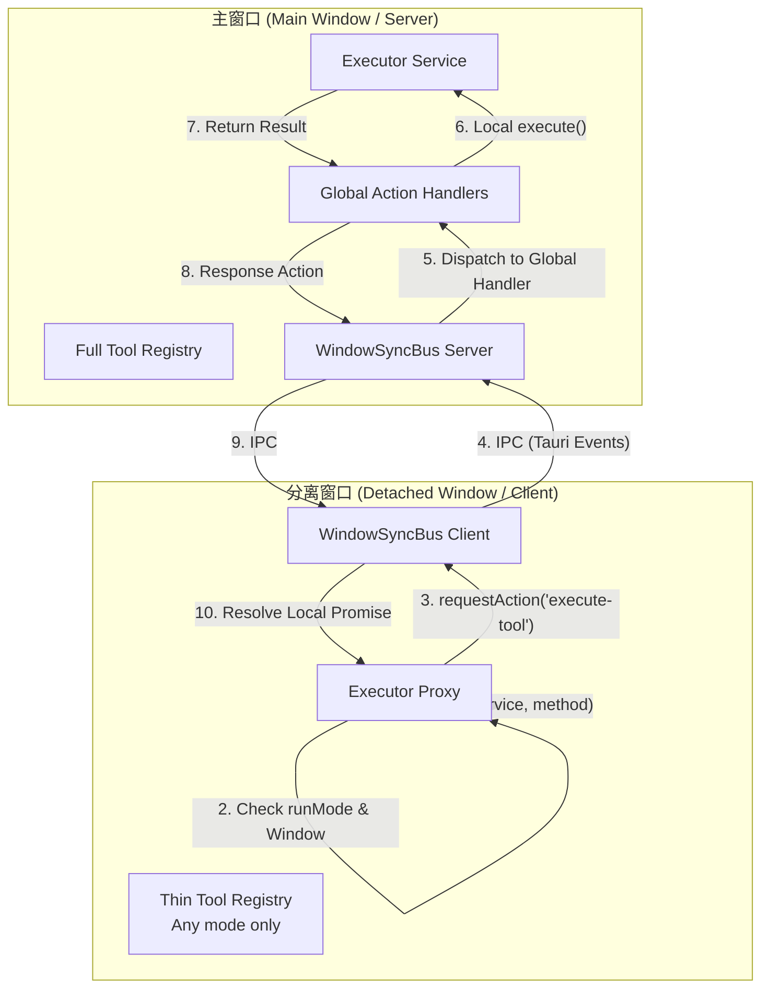

# 架构优化建议：多窗口分布式执行引擎 (Main-Hub Architecture)

## 1. 现状分析与深度调研

经过对 codebase 的深入调研，AIO Hub 目前的多窗口同步架构已初具雏形，但也存在明显的“业务层硬编码”和“基础设施不透明”问题。

### 1.1 已实现的防御性设计 (调查结论)

- **分阶段加载**：`src/services/auto-register.ts` 已支持 `priorityToolId`。分离窗口启动时会优先加载目标工具，但目前在 1 秒后仍会调用 `loadRemaining()` 加载全量工具，导致“瘦身”不彻底。
- **启动项限制**：`src/main.ts` 已写死只有非分离窗口才会执行 `startupManager.run()`。
- **业务层代理**：`llm-chat` 模块通过 `useLlmChatSync.ts` 已经实现了一套完整的 `Action Proxy`（如 `send-message` 等），但该逻辑是硬编码在业务层的。

### 1.2 核心痛点

1.  **基础设施不透明**：`src/services/executor.ts` 目前仅支持本地执行。如果工具未在当前窗口加载，调用将直接失败。
2.  **总线能力受限**：`useWindowSyncBus.ts` 目前仅支持注册**单个** `actionHandler`，无法满足多个模块同时监听跨窗口动作的需求。
3.  **Promise 隔离与交互断裂**：Tool Calling 的审批流依赖 `resolve` 句柄，而句柄无法序列化。分离窗口的 UI 无法直接触达主窗口的执行引擎。
4.  **资源竞态**：`VCP Connector` 等带副作用的工具在多窗口同时初始化时，会导致 WebSocket 重复连接或 IO 冲突。

## 2. 核心设计：主从分布式架构 (Headless Server & Thin Client)

将主窗口定位为应用的 **"Headless Server"** (权威源)，分离窗口/组件定位为 **"Thin Client"** (渲染/交互端)。

### 2.1 架构逻辑图

### 2.2 工具分类与 runMode

在 `ToolRegistry` 接口中引入 `runMode` 属性：

- **`main-only` (默认)**：仅在主窗口实例化并运行。适用于带副作用、高负载或有外部连接的工具（如 `vcp-connector`, `git-analyzer`）。
- **`any`**：可在任何窗口运行。适用于纯函数、无副作用的轻量工具（如 `json-formatter`）。

### 2.3 透明转发层 (Transparent Execution Proxy)

在 `executor.ts` 实现环境感知路由：

- 如果当前是分离窗口且工具是 `main-only`，自动将请求封装并转发给主窗口执行。
- 返回一个等待回传结果的本地 Promise，使工具开发者无需关心窗口架构。

## 3. 实施步骤

### 第一阶段：基础设施升级 (Core Infrastructure)

1.  **WindowSyncBus 重构**：支持 `onActionRequest` 注册多个处理器（使用命名空间或 Set），避免模块间冲突。
2.  **Executor 透明化**：在 `executor.ts` 中集成 `useWindowSyncBus` (需处理单例引用)，实现自动转发逻辑。
3.  **Registry 扩展**：在 `ToolRegistry` 接口添加 `runMode`，并修改 `autoRegisterServices`，使其在分离窗口永久跳过 `main-only` 工具的加载。

### 第二阶段：业务层下沉与闭环 (Interaction Loop)

1.  **Tool Calling 闭环**：利用通用 `Action Proxy` 重构 `ToolCallingApprovalBar.vue`，解决跨窗口审批的 Promise 隔离问题。
2.  **LLM Chat 迁移**：将 `useLlmChatSync.ts` 中的硬编码 Action 逐步迁移到通用的 `Executor Proxy`。

### 第三阶段：典型案例迁移 (Case Migration)

- **VCP Connector**：标记为 `main-only`，WebSocket 仅在主窗口维持，分离窗口通过代理获取连接状态。
- **Canvas 系统**：利用此架构实现“主窗口持久化，画布窗口预览”的解耦。

## 4. 预期收益

- **启动性能**：分离窗口初始化时间降低 60% 以上，内存占用显著下降。
- **可靠性**：消除多窗口资源竞争，确保工具调用在分离场景下依然闭环。
- **开发者体验**：底层透明转发，上层业务逻辑保持线性，无需手动处理 `requestAction`。
