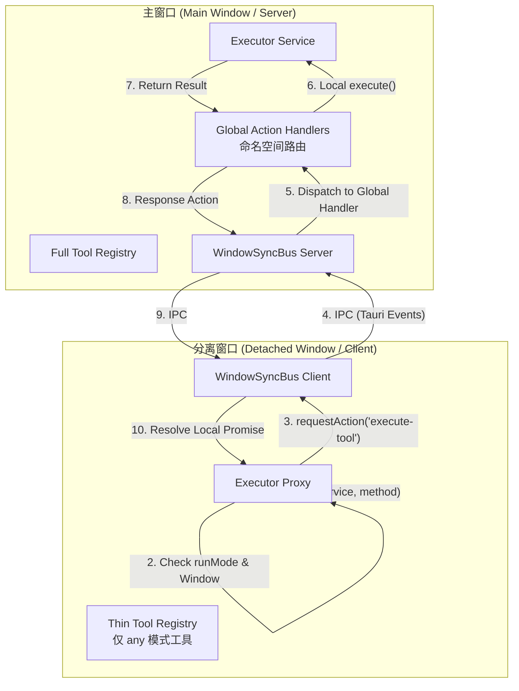

# 架构优化建议：多窗口分布式执行引擎 (Main-Hub Architecture)

**状态**: `Implementing` (施工中)
**最后核查**: 2026-04-05
**施工调查完成**: 2026-04-05

---

## 0. 核查结论摘要

> 以下是基于代码逐行核查的结论。现状描述整体准确，核心方案合理可行，但有 **6 处需要修正/补充** 的细节（已在正文中以 `[核查修正]` 标注）。

| 核查项                   | 结果          | 备注                                                                                                |
| ------------------------ | ------------- | --------------------------------------------------------------------------------------------------- |
| 1.1 分阶段加载描述       | ✅ 准确       | [`auto-register.ts:30`](src/services/auto-register.ts:30) + [`main.ts:260`](src/main.ts:260)        |
| 1.1 启动项限制描述       | ✅ 准确       | [`main.ts:239`](src/main.ts:239)                                                                    |
| 1.1 业务层代理描述       | ✅ 准确       | [`useLlmChatSync.ts:198-276`](src/tools/llm-chat/composables/chat/useLlmChatSync.ts:198)            |
| 1.2.1 Executor 不透明    | ✅ 准确       | [`executor.ts:59-143`](src/services/executor.ts:59) 仅本地查找                                      |
| 1.2.2 单个 actionHandler | ✅ 准确       | [`useWindowSyncBus.ts:50`](src/composables/useWindowSyncBus.ts:50) 覆盖式赋值                       |
| 1.2.3 Promise 隔离       | ✅ 准确       | [`useLlmChatSync.ts:108`](src/tools/llm-chat/composables/chat/useLlmChatSync.ts:108) 排除 `resolve` |
| 1.2.4 资源竞态           | ⚠️ 描述需修正 | VCP WS 已下沉到 Store，真正风险是 `initialize()` 重复执行                                           |
| 2.2 runMode 声明位置     | ⚠️ 需补充     | 应放在 `ToolConfig` 或静态导出上，而非仅在 `ToolRegistry` 实例上                                    |
| 第二阶段描述             | ⚠️ 需修正     | Tool Calling 闭环已实现，任务应为"通用化下沉"                                                       |
| 预期收益数据             | ⚠️ 缺乏基准   | "60%" 需要实测验证                                                                                  |

---

## 1. 现状分析与深度调研

经过对 codebase 的深入调研，AIO Hub 目前的多窗口同步架构已初具雏形，但也存在明显的"业务层硬编码"和"基础设施不透明"问题。

### 1.1 已实现的防御性设计 (调查结论)

- **分阶段加载**：[`auto-register.ts:30`](src/services/auto-register.ts:30) 已支持 `priorityToolId`。分离窗口启动时会优先加载目标工具，但目前在 1 秒后仍会调用 [`loadRemaining()`](src/main.ts:260) 加载全量工具，导致"瘦身"不彻底。
- **启动项限制**：[`main.ts:239`](src/main.ts:239) 已写死只有非分离窗口才会执行 `startupManager.run()`。
- **业务层代理**：`llm-chat` 模块通过 [`useLlmChatSync.ts:198-276`](src/tools/llm-chat/composables/chat/useLlmChatSync.ts:198) 已经实现了一套完整的 `Action Proxy`（如 `send-message` 等 20+ 种操作），但该逻辑是硬编码在业务层的。

### 1.2 核心痛点

1.  **基础设施不透明**：[`executor.ts`](src/services/executor.ts:59) 目前仅支持本地执行。通过 `toolRegistryManager.getRegistry()` 查找本地实例，如果工具未在当前窗口加载，调用将直接失败。
2.  **总线能力受限**：[`useWindowSyncBus.ts:50`](src/composables/useWindowSyncBus.ts:50) 的 `actionHandler` 是覆盖式赋值（`this.actionHandler = handler`），仅支持注册**单个**处理器。搜索发现 [`component-tester`](src/tools/component-tester/composables/useSyncDemoState.ts:43) 和 [`llm-chat`](src/tools/llm-chat/composables/chat/useLlmChatSync.ts:283) 都在使用 `onActionRequest`，后注册者会覆盖前者，存在实际冲突风险。
3.  **Promise 隔离与交互断裂**：Tool Calling 的审批流依赖 `resolve` 句柄，[`useLlmChatSync.ts:108-112`](src/tools/llm-chat/composables/chat/useLlmChatSync.ts:108) 同步时显式排除了不可序列化的 `resolve`。[`ToolCallingApprovalBar.vue`](src/tools/llm-chat/components/message-input/ToolCallingApprovalBar.vue:22) 已通过 `isDetached` 判断实现了跨窗口代理，但方案是硬编码在 UI 组件内的。
4.  **`[核查修正]` 工具初始化竞态**：~~`VCP Connector` 等带副作用的工具在多窗口同时初始化时，会导致 WebSocket 重复连接或 IO 冲突。~~ 实际情况：VCP Connector 的 WebSocket 逻辑已下沉到 Pinia Store 单例（参见 [`ARCHITECTURE.md:686`](src/tools/vcp-connector/ARCHITECTURE.md:686)），不会因组件重新挂载而重复连接。**真正的风险**是 [`auto-register.ts`](src/services/auto-register.ts:104) 的 `loadRemaining()` 会在分离窗口触发工具的 [`initialize()`](src/services/registry.ts:79) 方法，导致有副作用的初始化逻辑在多窗口重复执行。

## 2. 核心设计：主从分布式架构 (Headless Server & Thin Client)

将主窗口定位为应用的 **"Headless Server"** (权威源)，分离窗口/组件定位为 **"Thin Client"** (渲染/交互端)。

### 2.1 架构逻辑图



### 2.2 工具分类与 runMode

**`[核查修正]`** `runMode` 需要在**两个位置**声明，以满足不同阶段的需求：

1.  **[`ToolConfig`](src/services/types.ts:77) 接口**（静态声明）：在模块导入后、实例化前即可读取，供 [`autoRegisterServices`](src/services/auto-register.ts:30) 在加载阶段决定是否跳过。
2.  **[`ToolRegistry`](src/services/types.ts:86) 接口**（运行时声明）：供 [`executor.ts`](src/services/executor.ts:59) 在执行阶段判断是否需要转发。

可选值：

- **`main-only` (默认)**：仅在主窗口实例化并运行。适用于带副作用、高负载或有外部连接的工具（如 `vcp-connector`）。默认值采用保守策略，确保未标记的工具不会在分离窗口意外初始化。
- **`any`**：可在任何窗口运行。适用于纯函数、无副作用的轻量工具（如 `json-formatter`）。

### 2.3 透明转发层 (Transparent Execution Proxy)

在 [`executor.ts`](src/services/executor.ts:59) 实现环境感知路由：

- 如果当前是分离窗口且工具是 `main-only`，自动将请求封装并转发给主窗口执行。
- 返回一个等待回传结果的本地 Promise，使工具开发者无需关心窗口架构。

## 3. 实施步骤

### 第一阶段：基础设施升级 (Core Infrastructure)

1.  **WindowSyncBus 重构**：将 [`actionHandler`](src/composables/useWindowSyncBus.ts:50) 从单一处理器改为**命名空间路由表**（`Map<string, ActionHandler>`）。
    - Action 名称统一采用 `namespace:action` 格式（如 `llm-chat:send-message`、`executor:execute-tool`）。
    - 无命名空间的旧格式走兼容通道（默认路由到第一个注册的处理器），避免 breaking change。
    - `onActionRequest` 签名变更为 `onActionRequest(namespace: string, handler: ActionHandler)`。

2.  **Executor 透明化**：在 [`executor.ts`](src/services/executor.ts:59) 中集成 `useWindowSyncBus`，注册 `executor:execute-tool` 处理器，实现自动转发逻辑。

3.  **Registry 扩展**：
    - 在 [`ToolConfig`](src/services/types.ts:77) 和 [`ToolRegistry`](src/services/types.ts:86) 接口添加 `runMode?: 'main-only' | 'any'`。
    - 修改 [`autoRegisterServices`](src/services/auto-register.ts:30) 的 `loadRemaining()`，使其在分离窗口中：先导入模块读取 `toolConfig.runMode`，若为 `main-only` 则跳过实例化和注册。

### 第二阶段：业务层下沉与通用化 (Generalization)

**`[核查修正]`** Tool Calling 的跨窗口闭环已在 [`ToolCallingApprovalBar.vue`](src/tools/llm-chat/components/message-input/ToolCallingApprovalBar.vue:22) 和 [`useLlmChatSync.ts:247-271`](src/tools/llm-chat/composables/chat/useLlmChatSync.ts:247) 中**完整实现**。本阶段的目标不是"解决问题"，而是将硬编码方案**下沉为通用基础设施**。

1.  **Tool Calling 通用化**：将 `ToolCallingApprovalBar.vue` 中的 `isDetached ? bus.requestAction(...) : store.method(...)` 模式替换为通用的 Executor Proxy 调用，消除 UI 组件中的窗口环境判断逻辑。

2.  **LLM Chat Action 迁移**：将 [`useLlmChatSync.ts:198-276`](src/tools/llm-chat/composables/chat/useLlmChatSync.ts:198) 中的 20+ 个硬编码 Action 分类处理：
    - **Store 操作类**（如 `send-message`, `switch-session`）：迁移到通用 Executor Proxy，通过 `executor:execute-tool` 路由。
    - **状态同步类**（如 `update-chat-settings`）：保留在 `llm-chat:*` 命名空间下，因为这些操作与 Chat 的状态引擎紧耦合。

### 第三阶段：典型案例迁移 (Case Migration)

- **VCP Connector**：标记为 `main-only`，WebSocket 仅在主窗口维持，分离窗口通过代理获取连接状态。
- **Canvas 系统**：利用此架构实现"主窗口持久化，画布窗口预览"的解耦。

## 4. 预期收益

- **启动性能**：分离窗口将跳过 `main-only` 工具的导入和初始化，预计初始化时间和内存占用**显著下降**（具体比例需实测，取决于 `main-only` 工具占比）。
- **可靠性**：消除多窗口工具 `initialize()` 重复执行的竞态风险，确保工具调用在分离场景下依然闭环。
- **开发者体验**：底层透明转发，上层业务逻辑保持线性，无需手动处理 `requestAction` 和窗口类型判断。

## 5. 风险与注意事项

1.  **兼容性过渡**：`onActionRequest` 签名变更需要提供兼容层，确保旧代码（如 `component-tester`）在迁移前不会立即崩溃。
2.  **Executor 单例问题**：[`executor.ts`](src/services/executor.ts:59) 目前是纯函数导出，集成 `useWindowSyncBus` 需要处理 Composable 在非组件上下文中的调用问题（可能需要全局初始化）。
3.  **调试复杂度**：透明转发增加了调用链深度，需要在日志中清晰标注"本地执行"vs"远程转发"，便于排查问题。
4.  **`runMode` 默认值策略**：默认 `main-only` 是保守选择。需要在迁移时逐一审视现有工具，将确实无副作用的轻量工具标记为 `any`。建议在迁移初期维护一份白名单。

---

## 6. 施工前调查报告

> 以下是施工前对所有相关文件的完整逐行调查。

### 6.1 `requestAction` 调用点完整清单

共搜索到 **35 个** `requestAction` 调用点（不含文档引用），分布在 **8 个文件**中。

#### component-tester (2 个调用点)

| Action | 文件 | 行号 |
|--------|------|------|
| `test-notify` | [`useSyncDemoState.ts`](src/tools/component-tester/composables/useSyncDemoState.ts:82) | 82 |
| `update-sync-data` | [`useSyncDemoState.ts`](src/tools/component-tester/composables/useSyncDemoState.ts:92) | 92 |

#### llm-chat (33 个调用点)

| Action | 文件 | 行号 | handleActionRequest 中有对应 case? |
|--------|------|------|------|
| `send-message` | [`useMessageInputActions.ts`](src/tools/llm-chat/composables/input/useMessageInputActions.ts:103) | 103 | ✅ |
| `abort-sending` | [`useMessageInputActions.ts`](src/tools/llm-chat/composables/input/useMessageInputActions.ts:112) | 112 | ✅ |
| `select-continuation-model` | [`useMessageInputActions.ts`](src/tools/llm-chat/composables/input/useMessageInputActions.ts:320) | 320 | ❌ **缺失** |
| `complete-input` | [`useMessageInputActions.ts`](src/tools/llm-chat/composables/input/useMessageInputActions.ts:429) | 429 | ❌ **缺失** |
| `switch-session` | [`useMessageInputActions.ts`](src/tools/llm-chat/composables/input/useMessageInputActions.ts:438) | 438 | ✅ |
| `create-session` | [`useMessageInputActions.ts`](src/tools/llm-chat/composables/input/useMessageInputActions.ts:453) | 453 | ✅ |
| `send-message` | [`useDetachedChatInput.ts`](src/tools/llm-chat/composables/ui/useDetachedChatInput.ts:36) | 36 | ✅ |
| `abort-sending` | [`useDetachedChatInput.ts`](src/tools/llm-chat/composables/ui/useDetachedChatInput.ts:41) | 41 | ✅ |
| `send-message` | [`useDetachedChatArea.ts`](src/tools/llm-chat/composables/ui/useDetachedChatArea.ts:30) | 30 | ✅ |
| `abort-sending` | [`useDetachedChatArea.ts`](src/tools/llm-chat/composables/ui/useDetachedChatArea.ts:35) | 35 | ✅ |
| `regenerate-from-node` | [`useDetachedChatArea.ts`](src/tools/llm-chat/composables/ui/useDetachedChatArea.ts:40) | 40 | ✅ |
| `delete-message` | [`useDetachedChatArea.ts`](src/tools/llm-chat/composables/ui/useDetachedChatArea.ts:45) | 45 | ✅ |
| `switch-sibling` | [`useDetachedChatArea.ts`](src/tools/llm-chat/composables/ui/useDetachedChatArea.ts:50) | 50 | ✅ |
| `toggle-enabled` | [`useDetachedChatArea.ts`](src/tools/llm-chat/composables/ui/useDetachedChatArea.ts:55) | 55 | ✅ |
| `edit-message` | [`useDetachedChatArea.ts`](src/tools/llm-chat/composables/ui/useDetachedChatArea.ts:60) | 60 | ✅ |
| `create-branch` | [`useDetachedChatArea.ts`](src/tools/llm-chat/composables/ui/useDetachedChatArea.ts:65) | 65 | ✅ |
| `abort-node` | [`useDetachedChatArea.ts`](src/tools/llm-chat/composables/ui/useDetachedChatArea.ts:70) | 70 | ✅ |
| `analyze-context` | [`useDetachedChatArea.ts`](src/tools/llm-chat/composables/ui/useDetachedChatArea.ts:75) | 75 | ❌ **缺失** |
| `update-agent` ×2 | [`ChatArea.vue`](src/tools/llm-chat/components/ChatArea.vue:280) | 280, 306 | ✅ |
| `select-agent` | [`ChatArea.vue`](src/tools/llm-chat/components/ChatArea.vue:387) | 387 | ❌ **缺失** |
| `update-user-profile` | [`ChatArea.vue`](src/tools/llm-chat/components/ChatArea.vue:402) | 402 | ✅ |
| `update-chat-settings` ×2 | [`ChatSettingsDialog.vue`](src/tools/llm-chat/components/settings/ChatSettingsDialog.vue:227) | 227, 269 | ✅ |
| `approve-tool-call` | [`ToolCallingApprovalBar.vue`](src/tools/llm-chat/components/message-input/ToolCallingApprovalBar.vue:25) | 25 | ✅ |
| `reject-tool-call` | [`ToolCallingApprovalBar.vue`](src/tools/llm-chat/components/message-input/ToolCallingApprovalBar.vue:33) | 33 | ✅ |
| `silent-cancel-tool-call` | [`ToolCallingApprovalBar.vue`](src/tools/llm-chat/components/message-input/ToolCallingApprovalBar.vue:41) | 41 | ✅ |
| `silent-approve-tool-call` | [`ToolCallingApprovalBar.vue`](src/tools/llm-chat/components/message-input/ToolCallingApprovalBar.vue:49) | 49 | ✅ |
| `approve-all-tool-calls` | [`ToolCallingApprovalBar.vue`](src/tools/llm-chat/components/message-input/ToolCallingApprovalBar.vue:58) | 58 | ✅ |
| `reject-all-tool-calls` | [`ToolCallingApprovalBar.vue`](src/tools/llm-chat/components/message-input/ToolCallingApprovalBar.vue:68) | 68 | ✅ |
| `silent-cancel-all-tool-calls` | [`ToolCallingApprovalBar.vue`](src/tools/llm-chat/components/message-input/ToolCallingApprovalBar.vue:78) | 78 | ✅ |
| `silent-approve-all-tool-calls` | [`ToolCallingApprovalBar.vue`](src/tools/llm-chat/components/message-input/ToolCallingApprovalBar.vue:88) | 88 | ✅ |

#### ⚠️ 发现的现有 Bug：4 个 Action 缺少 Handler

以下 4 个 action 在 [`useLlmChatSync.ts:198-276`](src/tools/llm-chat/composables/chat/useLlmChatSync.ts:198) 的 `handleActionRequest` 中**没有对应的 case 分支**，在分离窗口中调用时会返回 `Unknown action` 错误：

1. **`select-continuation-model`** — 涉及模型选择对话框，可能需要特殊处理（UI 交互不可序列化）
2. **`complete-input`** — 输入补全操作
3. **`select-agent`** — 智能体切换
4. **`analyze-context`** — 上下文分析

> 这些 bug 属于现有遗漏，应在第二阶段迁移时一并修复。

### 6.2 `onActionRequest` 注册点

仅 **2 处**注册，且确认存在实际覆盖冲突：

| 使用者 | 文件 | 行号 | 命名空间（计划） |
|--------|------|------|------|
| component-tester | [`useSyncDemoState.ts`](src/tools/component-tester/composables/useSyncDemoState.ts:43) | 43 | `component-tester` |
| llm-chat | [`useLlmChatSync.ts`](src/tools/llm-chat/composables/chat/useLlmChatSync.ts:283) | 283 | `llm-chat` |

**当前冲突行为**：由于 `loadRemaining()` 会加载所有工具，当主窗口加载完毕后，`llm-chat` 的 handler 会覆盖 `component-tester` 的 handler，导致 `component-tester` 的 `test-notify` 和 `update-sync-data` action 在分离窗口中失效。

### 6.3 Executor 非组件上下文可行性分析

**结论：不存在技术障碍。**

- [`singleton.ts`](src/utils/singleton.ts:20) 的 `getOrCreateInstance()` 使用全局 `Map`，不依赖 Vue 的组件上下文
- [`useWindowSyncBus()`](src/composables/useWindowSyncBus.ts:646) 通过 `getOrCreateInstance("WindowSyncBus", ...)` 获取单例
- `WindowSyncBus` 构造函数调用 `getCurrentWebviewWindow()`（Tauri API，模块级别可用）和 `computed()`（Vue 3 中可在任何上下文调用）
- **前提条件**：Bus 单例必须已被创建。`App.vue` 在 `initializeApp()` 中会初始化 Bus，`executor.ts` 在工具注册之后才被调用，时序安全
- Executor 中只需 `const bus = useWindowSyncBus();` 即可获取 Bus 实例，无需额外的全局初始化

### 6.4 工具 `initialize()` 副作用分布

搜索 `src/tools/` 下所有 `.ts` 文件，仅发现 **1 处** Registry 级别的 `initialize()` 实现：

| 工具 | 文件 | 副作用描述 |
|------|------|-----------|
| tool-calling | [`tool-calling.registry.ts:24`](src/tools/tool-calling/tool-calling.registry.ts:24) | 等待 TaskManager 初始化 |

**影响评估**：`runMode` 默认 `main-only` 的保守策略影响面极小——大多数工具没有 `initialize()` 副作用。但此默认值仍有价值：防止未来新增工具在分离窗口意外初始化，以及减少不必要的模块导入和实例化开销。

### 6.5 命名空间路由设计决策

**选定方案：Handler 接收短名称**

| 维度 | 方案 A: Handler 收短名称 | 方案 B: Handler 收完整名称 |
|------|------------------------|--------------------------|
| handleActionRequest 改动 | ❌ 不改 | ✅ 所有 case 加前缀 |
| requestAction 调用方改动 | ✅ 35 处加前缀 | ❌ 不改 |
| 风险 | 低（机械化批量加前缀） | 中（switch/case 逻辑变更） |
| 未来新增 action | 自然带命名空间 | 需记住用完整名称 |

**选择方案 A 的理由：**
1. `handleActionRequest` 不变 → 业务逻辑零风险
2. 调用方加前缀是简单的字符串前缀追加，搜索替换即可
3. 未来新增 action 天然带 namespace，代码一致性更好

**路由规则：**
- Action 格式为 `namespace:action`（如 `llm-chat:send-message`）
- Bus 解析 `:` 前面的部分匹配命名空间处理器，传给 handler 的 action 只包含 `:` 后面的短名称
- 不含 `:` 的 action 走 `defaultActionHandler` 兼容通道
- 找不到匹配的命名空间且无默认处理器时，记录警告并返回错误响应

---

## 7. 细化施工步骤（第一阶段）

基于调查结果，将第一阶段细化为 **4 个步骤**，每步可独立验证：

### Step 1: WindowSyncBus 命名空间路由表

**改动文件：** [`useWindowSyncBus.ts`](src/composables/useWindowSyncBus.ts)

1. 将 `actionHandler: ActionHandler | null = null` (line 50) 替换为：
   ```typescript
   private actionHandlers = new Map<string, ActionHandler>();
   private defaultActionHandler: ActionHandler | null = null;
   ```

2. 重写 `handleActionRequest` (line 286-322)：
   - 解析 `action` 中的 `:` 前缀为命名空间
   - 匹配命名空间处理器 → 传递**短名称**
   - Fallback 到 `defaultActionHandler` → 传递**完整名称**
   - 都没有 → 返回错误响应（而非静默忽略）

3. 重写 `onActionRequest` (line 537-542) 为重载：
   ```typescript
   onActionRequest(namespace: string, handler: ActionHandler): UnlistenFn;
   onActionRequest(handler: ActionHandler): UnlistenFn;
   ```

4. 更新 `cleanup` (line 616-639)：
   - `this.actionHandlers.clear(); this.defaultActionHandler = null;`

5. 更新 `useWindowSyncBus()` 返回值 (line 693)：正确 bind 和类型导出。

### Step 2: 迁移现有 `onActionRequest` 使用者

**改动文件：**

1. [`useSyncDemoState.ts`](src/tools/component-tester/composables/useSyncDemoState.ts:43)：
   - `bus.onActionRequest(async (action, params) => {...})` → `bus.onActionRequest('component-tester', async (action, params) => {...})`
   - `requestAction("test-notify", ...)` → `requestAction("component-tester:test-notify", ...)`
   - `requestAction("update-sync-data", ...)` → `requestAction("component-tester:update-sync-data", ...)`

2. [`useLlmChatSync.ts`](src/tools/llm-chat/composables/chat/useLlmChatSync.ts:283)：
   - `bus.onActionRequest(handleActionRequest)` → `bus.onActionRequest('llm-chat', handleActionRequest)`

### Step 3: 迁移 `requestAction` 调用方（llm-chat）

**改动文件（6 个）：** 所有 `requestAction` 调用添加 `llm-chat:` 前缀。

| 文件 | 改动数量 |
|------|---------|
| [`useMessageInputActions.ts`](src/tools/llm-chat/composables/input/useMessageInputActions.ts) | 6 处 |
| [`useDetachedChatInput.ts`](src/tools/llm-chat/composables/ui/useDetachedChatInput.ts) | 2 处 |
| [`useDetachedChatArea.ts`](src/tools/llm-chat/composables/ui/useDetachedChatArea.ts) | 9 处 |
| [`ChatArea.vue`](src/tools/llm-chat/components/ChatArea.vue) | 4 处 |
| [`ChatSettingsDialog.vue`](src/tools/llm-chat/components/settings/ChatSettingsDialog.vue) | 2 处 |
| [`ToolCallingApprovalBar.vue`](src/tools/llm-chat/components/message-input/ToolCallingApprovalBar.vue) | 8 处 |

### Step 4: Registry runMode + auto-register 瘦身

**改动文件：**

1. [`types.ts`](src/services/types.ts:77)：`ToolConfig` 和 `ToolRegistry` 添加 `runMode?: 'main-only' | 'any'`
2. [`auto-register.ts`](src/services/auto-register.ts:104)：`loadRemaining()` 在分离窗口跳过 `main-only` 工具

> **注意**：Executor 透明化（原第一阶段 Step 2）推迟到第二阶段，因为：
> - 当前所有跨窗口调用都通过 `requestAction` 手动代理，已可工作
> - Executor 透明化依赖 runMode 标记完善后才有意义
> - 第一阶段聚焦在"消除冲突 + 减少开销"，不引入新的执行路径
