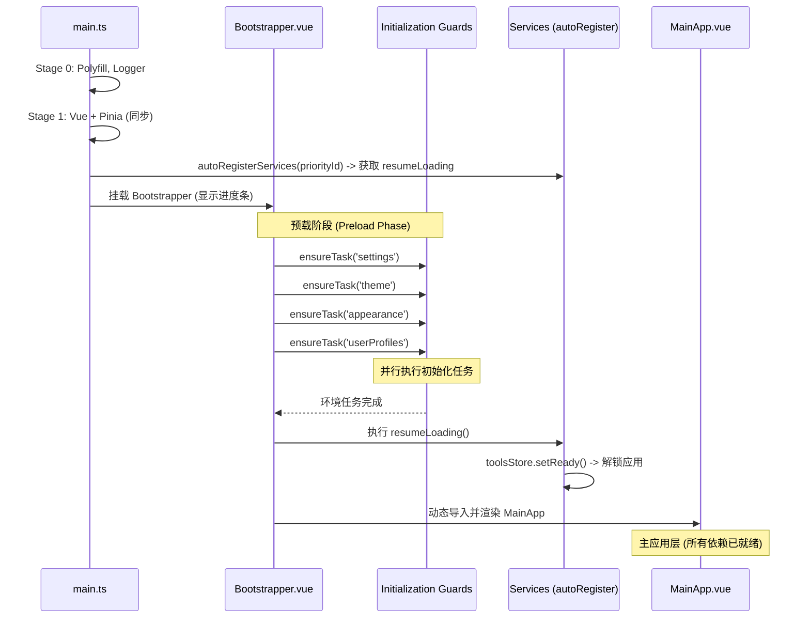

# `main.ts` 引导程序重构技术规范 (v2.0)

**状态**: Draft (调查后修订版)
**最后更新**: 2026-04-06
**作者**: 咕咕 (Kilo 版)

---

## 1. 调查结论总结

### 1.1 核心痛点 (调查确认)

1. **背景消失风险**：外观初始化 (`initThemeAppearance`) 依赖 CSS 变量注入。调查确认：若注入晚于 Vue 挂载，`var(--card-bg)` 等变量在首屏渲染时为 undefined。
2. **初始化时序混乱**：`WindowSyncBus` 目前在 `GlobalProviders.vue` 的 `onMounted` 中初始化。调查确认：分离窗口在渲染组件前若未建立连接，会产生读取状态为空的竞态风险。
3. **GlobalProviders 静态依赖链污染**：
   - **依赖链**：`GlobalProviders` -> `TranscriptionDialog` -> `RichCodeEditor` -> `@guolao/vue-monaco-editor`。
   - **结论**：无论是否使用编辑器，主窗口和所有分离窗口都会全量加载 Monaco/Shiki 及其汉化插件，导致 Bundle 体积冗余。
   - `ImageViewer` 和 `VideoViewer` 同样存在第三方库副作用的静态导入问题。
4. **`App.vue` 初始化“假挂载”**：
   - `main.ts` 执行完 `initializeApp` 后立即挂载，但真正的业务初始化（`detachedManager`, `toolsStore`, `userProfileStore`）在 `App.vue:onMounted` 才开始。
   - 这导致骨架屏显示时间过长，且无法在 `main.ts` 层面进行有效的任务调度。
5. **加载体验缺乏透明度**：当前骨架屏仅为静态占位，用户无法获知加载进度（如：正在加载插件、正在同步状态等）。

### 1.2 改进原则

1. **三层架构**：将主窗口启动流程分为 **引导层 (Bootstrap)** -> **预载层 (Preload)** -> **主应用层 (MainApp)**。
2. **初始化前置**：环境初始化（Settings, Theme, Appearance）必须在 `MainApp` 渲染前完成。
3. **连接优先**：分离窗口必须先建立 `SyncBus` 连接，再进行 UI 渲染。
4. **按需 Provider**：`GlobalProviders` 应根据窗口类型动态决定加载哪些子组件，避免分离窗口的 Bundle 污染。
5. **组件自愈**：重型库（如 Monaco）的初始化由使用它的组件通过 `ensureTask` 机制自行触发，而非 `main.ts` 统一探测。
6. **Pinia 优先**：所有涉及 Store 的初始化任务必须在 `app.use(pinia)` 之后执行。

---

## 2. 架构设计：三层启动模型

### 2.1 整体流程图



### 2.2 各层职责

| 层级         | 组件/模块          | 职责                                                    | 加载方式                |
| :----------- | :----------------- | :------------------------------------------------------ | :---------------------- |
| **引导层**   | `main.ts`          | Polyfill, Vue/Pinia 创建，策略分发                      | 静态 + 动态导入         |
| **预载层**   | `Bootstrapper.vue` | 显示进度条，并行执行 `ensureTask`，完成后渲染 `MainApp` | 动态导入                |
| **主应用层** | `MainApp.vue`      | 原 `App.vue` 的核心布局逻辑，此时所有依赖已就绪         | 动态导入 (预载层完成后) |

---

## 3. 目录结构设计

```

src/
├── main.ts # 极简入口
├── App.vue # 根组件，根据窗口类型渲染不同内容
├── init/
│ ├── index.ts # 引导器工厂
│ ├── guards.ts # 【新建】初始化守卫 (ensureTask 机制)
│ ├── env.ts # 环境初始化 (Settings/Theme/Appearance/Handshake)
│ ├── business.ts # 业务初始化 (Plugins/UserProfiles/StartupTasks)
│ └── utils/
│ └── window-detector.ts # 窗口类型检测工具
├── components/
│ ├── Bootstrapper.vue # 【新建】预载层组件 (进度条 + 任务调度)
│ ├── MainApp.vue # 【新建】主应用层组件 (原 App.vue 核心逻辑)
│ └── GlobalProviders.vue # 【优化】按需加载子组件
└── views/
├── DetachedWindowContainer.vue
└── DetachedComponentContainer.vue

```

---

## 4. 核心机制：初始化守卫 (Initialization Guards)

### 4.1 设计理念

**问题**：`main.ts` 无法准确预测每个窗口需要什么重型库（如 Monaco、Shiki、Buffer）。

**方案**：建立"任务池"机制，由业务组件按需触发。

### 4.2 `src/init/guards.ts` 接口定义

```typescript
// src/init/guards.ts

const taskStatus = new Map<string, Promise<void>>();
const taskProgress = new Map<string, number>(); // 可选：用于进度条

/**
 * 确保任务已执行（幂等）
 *
 * **核心机制：Promise 缓存**
 * - 第一次调用：执行 initFn()，保存 Promise，返回它
 * - 后续调用：直接返回已缓存的同一个 Promise
 * - 多个组件同时调用：只会触发一次 initFn()，所有调用共享同一个 Promise
 *
 * @param taskId 任务唯一标识
 * @param initFn 初始化函数
 */
export async function ensureTask(taskId: string, initFn: () => Promise<void>): Promise<void> {
  if (!taskStatus.has(taskId)) {
    taskStatus.set(taskId, initFn());
  }
  return taskStatus.get(taskId)!;
}

// ==================== 预定义任务 ====================

/**
 * L0: Buffer Polyfill
 * 必须在 music-metadata 等库加载前执行
 */
export const ensureBuffer = () =>
  ensureTask("buffer", async () => {
    const { Buffer } = await import("buffer");
    (window as any).Buffer = Buffer;
    taskProgress.set("buffer", 100);
  });

/**
 * L2: Monaco 汉化 + Shiki 主题桥接
 * 由 RichCodeEditor 等组件按需触发
 */
export const ensureMonaco = () =>
  ensureTask("monaco", async () => {
    // 1. 运行 NLS 汉化劫持（必须在 Monaco 加载前）
    await import("@/utils/monaco-i18n/nls");

    // 2. 初始化 Shiki 主题桥接
    const { initMonacoShikiThemes } = await import("@/utils/monacoShikiSetup");
    await initMonacoShikiThemes();

    taskProgress.set("monaco", 100);
  });

/**
 * L2: 用户档案加载
 * 主窗口预载阶段必须完成
 */
export const ensureUserProfiles = () =>
  ensureTask("userProfiles", async () => {
    const { useUserProfileStore } = await import("@/tools/llm-chat/stores/userProfileStore");
    const store = useUserProfileStore();
    await store.loadProfiles();
    taskProgress.set("userProfiles", 100);
  });

/**
 * L3: 插件系统初始化
 * 主窗口预载阶段必须完成
 */
export const ensurePlugins = () =>
  ensureTask("plugins", async () => {
    const { pluginManager } = await import("@/services/plugin-manager");
    await pluginManager.initialize();
    await pluginManager.loadAllPlugins();
    taskProgress.set("plugins", 100);
  });
```

### 4.3 组件自愈示例

```vue
<!-- RichCodeEditor.vue -->
<script setup lang="ts">
import { onBeforeMount } from "vue";
import { ensureMonaco } from "@/init/guards";

const props = defineProps<{ editorType?: "codemirror" | "monaco" }>();

onBeforeMount(async () => {
  if (props.editorType === "monaco") {
    // 组件自己触发 Monaco 初始化
    await ensureMonaco();
  }
});
</script>
```

### 4.4 关于"自动复用"的说明

**问题**：如果 `RichCodeEditor` 在多个地方被使用，或者多个组件都调用了 `ensureMonaco()`，会重复初始化吗？

**答案**：**不会**。`ensureTask` 机制的核心就是 **Promise 缓存**。

```typescript
// 伪代码演示
const p1 = ensureMonaco(); // 第一次调用：执行初始化，返回 Promise A
const p2 = ensureMonaco(); // 第二次调用：直接返回 Promise A（同一个！）
const p3 = ensureMonaco(); // 第三次调用：还是返回 Promise A

// p1 === p2 === p3 (严格相等)
```

**技术原理**：

1.  `taskStatus` 是一个全局 `Map`，存储所有任务的 Promise。
2.  第一次调用时，`initFn()` 被执行，返回的 Promise 被存入 Map。
3.  后续调用时，直接从 Map 中取出已存在的 Promise 返回。
4.  即使多个组件**同时**调用（例如在同一个 `onMounted` 周期内），由于 JavaScript 的事件循环机制，第一个调用会先完成 `taskStatus.set()`，后续调用会立即命中缓存。

**类似机制**：

- **Pinia Store**: `useStore()` 返回单例实例。
- **Vue 生命周期**: 每个组件的 `onMounted` 只执行一次。
- **React `useEffect`**: 依赖不变时不重新执行。
- **Singleton Pattern**: 许多库（如 `axios` 实例）使用单例模式。

**结论**：**无需手动探测初始化状态**。组件只需放心调用 `ensureTask()`，系统会自动处理复用。

---

## 5. 预载层组件：`Bootstrapper.vue` (原 4.4)

### 5.1 职责

1. 显示加载进度条（带任务状态描述）。
2. 并行执行所有"首屏必须"的 `ensureTask`。
3. 完成后动态导入并渲染 `MainApp.vue`。

### 5.2 伪代码

```vue
<!-- Bootstrapper.vue -->
<script setup lang="ts">
import { ref, onMounted } from "vue";
import { ensureTask, ensureBuffer, ensureUserProfiles, ensurePlugins } from "@/init/guards";
import { useAppSettingsStore } from "@/stores/appSettingsStore";
import { initTheme } from "@/composables/useTheme";
import { initThemeAppearance } from "@/composables/useThemeAppearance";

const props = defineProps<{
  resumeLoading: () => Promise<void>;
}>();

const progress = ref(0);
const statusText = ref("正在启动...");
const tasks = [
  { id: "buffer", fn: ensureBuffer, weight: 0.1 },
  {
    id: "settings",
    fn: async () => {
      const store = useAppSettingsStore();
      await store.load(); // 或者是 initEnvironmentLite
    },
    weight: 0.15,
  },
  { id: "theme", fn: initTheme, weight: 0.1 },
  { id: "appearance", fn: initThemeAppearance, weight: 0.15 },
  { id: "userProfiles", fn: ensureUserProfiles, weight: 0.2 },
  { id: "plugins", fn: ensurePlugins, weight: 0.2 },
  {
    id: "toolsRegistry",
    fn: async () => {
      // ⚠️ 重要：必须调用 resumeLoading，否则 toolsStore.setReady() 不会触发
      // 应用将永远卡在 Loading 状态
      await props.resumeLoading();
    },
    weight: 0.1,
  },
];

const MainApp = ref<any>(null);

onMounted(async () => {
  let completedWeight = 0;

  for (const task of tasks) {
    try {
      statusText.value = `正在加载：${task.id}...`;
      await task.fn();
      completedWeight += task.weight;
      progress.value = Math.round(completedWeight * 100);
    } catch (error) {
      console.error(`Task ${task.id} failed:`, error);
      // 非致命错误继续执行
    }
  }

  // 所有任务完成后，动态导入 MainApp
  MainApp.value = await import("@/components/MainApp.vue");
});
</script>

<template>
  <div v-if="!MainApp" class="bootstrapper">
    <div class="progress-bar">
      <div class="progress-fill" :style="{ width: progress + '%' }"></div>
    </div>
    <p class="status-text">{{ statusText }}</p>
  </div>
  <component v-else :is="MainApp" />
</template>
```

---

## 6. 主应用层：`MainApp.vue` (原 4.5)

### 6.1 职责

这是原 `App.vue` 的瘦身版，仅包含：

- UI 布局（侧边栏、主内容区）
- 事件监听（路由变化、窗口分离/附着）
- 状态同步

**移除的逻辑**（已迁移到 `Bootstrapper` 或 `guards.ts`）：

- ~~`detachedManager.initialize()`~~ -> 移至 `Bootstrapper`
- ~~`toolsStore.initializeOrder()`~~ -> 移至 `Bootstrapper`
- ~~`userProfileStore.loadProfiles()`~~ -> 移至 `ensureUserProfiles`
- ~~`initThemeAppearance()`~~ -> 移至 `Bootstrapper`

---

## 7. 窗口类型策略 (原 4.6)

| 窗口类型                                 | 使用的引导策略                                   | 说明                                  |
| :--------------------------------------- | :----------------------------------------------- | :------------------------------------ |
| **主窗口** (`/`)                         | `Bootstrapper` -> `MainApp`                      | 全量预载，显示进度条                  |
| **分离工具** (`/detached-window/:id`)    | 直接渲染 `DetachedWindowContainer` + 组件自愈    | 跳过预载层，组件按需触发 `ensureTask` |
| **分离组件** (`/detached-component/:id`) | 直接渲染 `DetachedComponentContainer` + 组件自愈 | 同上，最轻量                          |

---

## 8. 实施细节与约束

### 8.1 窗口类型检测逻辑 (`src/init/utils/window-detector.ts`)

```typescript
export function detectWindowType(): WindowType {
  const pathname = window.location.pathname;

  if (pathname === "/" || pathname === "") return "main";
  if (pathname.startsWith("/detached-window/")) return "detached-tool";
  if (pathname.startsWith("/detached-component/")) return "detached-component";

  return "main";
}
```

### 8.2 环境初始化握手协议 (`src/init/env.ts`)

分离窗口（Lite/Tool 模式）**不直接访问磁盘 IO**，必须通过握手获取快照。

```typescript
export async function initEnvironmentLite() {
  const appSettingsStore = useAppSettingsStore();
  const { useWindowSyncBus } = await import("@/composables/useWindowSyncBus");
  const bus = useWindowSyncBus();

  try {
    // 1. 发起握手请求
    await bus.requestInitialState();
    // 2. 握手逻辑会自动填充 store (假设 store 已有相应监听)
  } catch (e) {
    // 3. Fallback: 握手超时则回退到本地加载
    console.warn("[EnvLite] 握手失败，回退到本地加载");
    await appSettingsStore.load();
  }

  await initTheme();
  await initThemeAppearance();
}
```

### 8.3 样式局部化与 SDK 隔离

- **样式迁移**：将 `katex.css`, `viewer.css` 从 `main.ts` 移除，分别移入 `KatexRenderer.vue` 和 `ImageViewer.vue` 的 `<style>` 或动态 `import` 中。
- **SDK 挂载**：`window.AiohubSDK` 的挂载逻辑仅在 `MainApp.vue` 或其配套的初始化任务中执行，分离窗口不应感知。

---

## 9. 实施路线图

| 阶段  | 任务                                                                      | 预计工时 |
| :---- | :------------------------------------------------------------------------ | :------- |
| **1** | 创建 `src/init/guards.ts`，定义 `ensureTask` 和预定义任务                 | 1h       |
| **2** | 创建 `Bootstrapper.vue` 组件，实现进度条和任务调度                        | 2h       |
| **3** | 创建 `MainApp.vue`，从 `App.vue` 迁移布局逻辑                             | 2h       |
| **4** | 修改 `App.vue`，根据窗口类型分发到 `Bootstrapper` 或 `Detached*Container` | 1h       |
| **5** | 在 `RichCodeEditor` 等组件中集成 `ensureMonaco`                           | 1h       |
| **6** | 优化 `GlobalProviders.vue`，实现按需加载子组件                            | 1h       |
| **7** | 清理 `main.ts` 中的静态导入和冗余逻辑                                     | 1h       |
| **8** | 测试验证（主窗口/分离窗口/组件窗口）                                      | 2h       |

**总计**: 约 11 小时

---

## 10. 验收标准

1. **功能验收**:
   - 主窗口所有功能正常运行，进度条显示正确
   - 分离工具窗口能正确加载目标工具，且 Bundle 体积显著减小
   - 分离组件窗口能正确渲染目标组件

2. **性能验收**:
   - 主窗口 JS 束体积减少 30% 以上（重型库被拆分）
   - 分离窗口的 JS 束体积减少 50% 以上
   - 首屏加载时间（到可交互）减少 20% 以上

3. **代码验收**:
   - `main.ts` 行数减少至 50 行以内
   - `App.vue` 行数减少至 150 行以内（仅保留布局逻辑）
   - 所有初始化逻辑已迁移至 `guards.ts` 或 `Bootstrapper.vue`

---

**文档结束**
