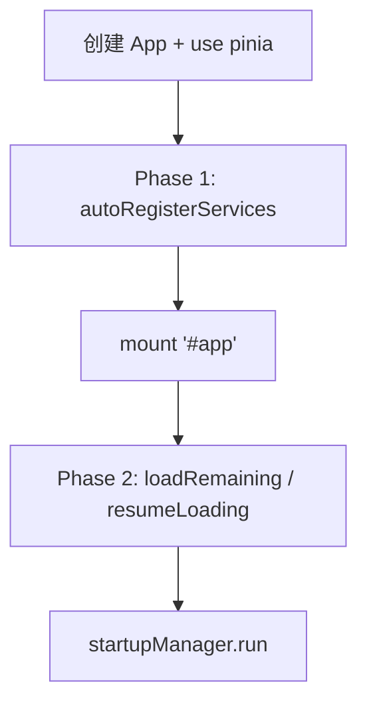

# `main.ts` 引导程序重构技术规范

**版本**: 1.2
**状态**: Draft
**最后更新**: 2026-04-06 (修正接口错误，补充实施约束)
**作者**: 咕咕 (Kilo 版)

---

## 1. 概述

### 1.1 背景

当前项目的入口文件 `src/main.ts` 承担了过多的初始化职责，导致以下问题：

1. **静态依赖污染**：顶层静态导入了 ElementPlus、PluginSDK、PluginUI、Monaco 汉化等重型模块，导致 Vite 在构建时无法为不同窗口类型生成差异化的 JS 束。
2. **全量扫描开销**：`autoRegisterServices` 和 `plugin-ui` 采用 `import.meta.glob({ eager: true })` 全量扫描模式，分离窗口在初始化时会解析大量无关的工具注册信息。
3. **初始化逻辑耦合**：基础环境初始化（如 Buffer Polyfill）与业务特定初始化（如 Monaco 汉化）混合在一起，缺乏按需调度的手段。

### 1.2 目标

1. **首屏减负**：通过动态导入 (`import()`) 将重型库的解析延迟到需要时执行。
2. **按需加载**：根据窗口类型（主窗口 / 分离工具 / 分离组件）执行差异化的初始化策略。
3. **逻辑解耦**：将 `main.ts` 中的初始化任务物理拆分为独立的 Module，便于维护和测试。

### 1.3 适用范围

本规范适用于所有参与 `main.ts` 重构的开发人员。重构后，`main.ts` 应仅保留环境检测和策略分发逻辑，所有具体初始化代码应迁移至 `src/init/` 目录。

---

## 2. 依赖分层模型

我们将初始化任务按依赖紧急度和功能范围划分为五个层级（L0 - L4）：

| 层级   | 名称                     | 职责                                             | 导入方式 | 适用窗口          |
| :----- | :----------------------- | :----------------------------------------------- | :------- | :---------------- |
| **L0** | 核心层 (Essential)       | Buffer Polyfill, 基础 Logger, 基础 ErrorHandler  | 静态导入 | 所有窗口          |
| **L1** | 基础层 (Framework)       | Vue 实例创建，Pinia 初始化，基础主题色应用       | 静态导入 | 所有窗口          |
| **L2** | 环境层 (Environment)     | AppSettings 加载，WindowSyncBus 握手，主题初始化 | 动态导入 | 所有窗口          |
| **L3** | UI 扩展层 (UIExtensions) | ElementPlus 注册，全局组件，$message 挂载        | 动态导入 | 主窗口 / 分离工具 |
| **L4** | 业务层 (Business)        | 插件系统启动，启动项任务，Monaco 汉化，动态路由  | 动态导入 | 仅主窗口          |

---

## 3. 目录结构设计

```
src/
├── main.ts                     # 极简入口，仅负责策略分发
├── init/                       # 【新建】引导程序目录
│   ├── index.ts                # 引导程序工厂 (createBootstrapper)
│   ├── types.ts                # 策略接口定义
│   ├── core/
│   │   ├── polyfills.ts        # L0: 环境补丁 (Buffer, globalThis 挂载)
│   │   └── logger.ts           # L0: 基础日志系统初始化
│   ├── modules/
│   │   ├── framework.ts        # L1: Vue/Pinia 初始化
│   │   ├── environment.ts      # L2: Settings/Theme/WindowSyncBus
│   │   ├── ui.ts               # L3: ElementPlus/全局组件
│   │   ├── services.ts         # L4: 插件系统/服务注册
│   │   └── extra.ts            # L4: Monaco/Shiki/文件拖拽
│   └── strategies/
│       ├── main.strategy.ts    # 主窗口全量策略 (L0-L4)
│       ├── tool.strategy.ts    # 分离工具窗口中量策略 (L0-L3)
│       └── lite.strategy.ts    # 纯组件窗口极简策略 (L0-L2)
```

---

## 4. 策略定义

### 4.1 `MainStrategy` (主窗口全量策略)

**适用场景**: 主窗口 (`window.location.pathname === '/'`)

**加载模块**:

1. L0: `polyfills`, `logger`
2. L1: `framework`
3. L2: `environment`
4. L3: `ui`
5. L4: `services`, `extra`

**关键行为**:

- 全量注册 ElementPlus 组件和指令
- 挂载 `window.AiohubSDK` 和 `window.AiohubUI`
- 启动插件管理器 (`pluginManager.loadAllPlugins()`)
- 执行启动项任务 (`startupManager.run()`)
- 预注册 Monaco Shiki 主题
- 监听文件拖拽事件

### 4.2 `ToolStrategy` (分离工具窗口中量策略)

**适用场景**: 分离工具窗口 (`/detached-window/:toolPath`)

**加载模块**:

1. L0: `polyfills`, `logger`
2. L1: `framework`
3. L2: `environment` (精简版)
4. L3: `ui` (精简版)

**关键行为**:

- 仅注册必要的 ElementPlus 组件（按需）
- 不挂载全局 SDK
- 跳过插件管理器初始化
- 跳过启动项任务
- 跳过 Monaco 汉化（除非目标工具是代码编辑器）
- 初始化 WindowSyncBus 以同步主窗口状态

### 4.3 `LiteStrategy` (纯组件窗口极简策略)

**适用场景**: 分离组件窗口 (`/detached-component/:componentId`)

**加载模块**:

1. L0: `polyfills`, `logger`
2. L1: `framework`
3. L2: `environment` (极简版 — 使用 `initEnvironmentLite`)

**关键行为**:

- 不注册 ElementPlus 组件（依赖主窗口或基础 CSS）
- 不挂载全局 SDK
- 跳过所有业务初始化
- 仅初始化 WindowSyncBus 以接收状态同步

**⚠️ 握手协议要求**:

`LiteStrategy` 的环境初始化**不得强依赖本地磁盘 IO**（如 `appConfigDir` 读取、本地数据库访问）。基础配置（AppSettings、Theme 等）应通过 `WindowSyncBus` 的握手协议从主窗口同步获取：

1. 分离窗口启动时，通过 `bus.requestInitialState()` 向主窗口发起广播握手
2. 主窗口收到请求后，将当前 Settings 快照序列化并推送给分离窗口
3. 分离窗口使用接收到的快照初始化 `appSettingsStore`，跳过本地文件读取
4. 如果握手超时（例如主窗口未运行），则 fallback 到本地磁盘加载

这确保了分离窗口的启动不依赖文件系统的 IO 延迟，同时保证与主窗口的配置一致性。

---

## 5. 核心模块接口定义

### 5.1 `src/init/types.ts`

```typescript
/**
 * 引导策略接口
 */
export interface BootstrapStrategy {
  /**
   * 策略名称
   */
  name: string;

  /**
   * 执行引导
   * @returns 返回 Vue 应用实例
   */
  bootstrap(): Promise<any>;

  /**
   * 挂载应用
   * @param selector CSS 选择器
   */
  mount(selector: string): void;
}

/**
 * 窗口类型枚举
 */
export type WindowType = "main" | "detached-tool" | "detached-component";

/**
 * 引导配置
 */
export interface BootstrapConfig {
  /**
   * 窗口类型
   */
  windowType: WindowType;

  /**
   * 优先级工具 ID（仅分离窗口有效）
   */
  priorityToolId?: string;
}
```

### 5.2 `src/init/modules/framework.ts`

```typescript
import { createApp, type App } from "vue";
import { createPinia } from "pinia";

/**
 * 初始化 Vue 应用和 Pinia
 */
export function initFramework(rootComponent: any): { app: App; pinia: any } {
  const pinia = createPinia();
  const app = createApp(rootComponent);
  app.use(pinia);

  return { app, pinia };
}
```

### 5.3 `src/init/modules/environment.ts`

```typescript
import { useAppSettingsStore } from "@/stores/appSettingsStore";
import { initTheme } from "@/composables/useTheme";
import { applyThemeColors } from "@/utils/themeColors";

export interface EnvironmentOptions {
  priorityToolId?: string;
}

/**
 * 初始化环境 — 完整版（主窗口使用）
 * 直接从本地磁盘加载 Settings
 */
export async function initEnvironment(options?: EnvironmentOptions) {
  // 1. 加载应用设置
  const appSettingsStore = useAppSettingsStore();
  const settings = await appSettingsStore.load();

  // 2. 初始化主题
  await initTheme();

  // 3. 应用主题色
  applyThemeColors({
    primary: settings.themeColor,
    success: settings.successColor,
    warning: settings.warningColor,
    danger: settings.dangerColor,
    info: settings.infoColor,
  });

  return { settings };
}

/**
 * 初始化环境 — 极简版（LiteStrategy / ToolStrategy 使用）
 *
 * 不直接访问磁盘，而是通过 WindowSyncBus 握手协议
 * 从主窗口同步基础配置。仅在握手超时时 fallback 到本地加载。
 */
export async function initEnvironmentLite(options?: EnvironmentOptions) {
  const appSettingsStore = useAppSettingsStore();

  // 1. 尝试通过 WindowSyncBus 从主窗口获取 Settings 快照
  // 注意：WindowSyncBus 实例应通过 useWindowSyncBus Composable 获取
  const { useWindowSyncBus } = await import("@/composables/useWindowSyncBus");
  const bus = useWindowSyncBus();

  try {
    // 实际接口为 requestInitialState，无 timeout 参数，通过全局事件监听快照推送
    await bus.requestInitialState();

    // ⚠️ applySnapshot 方法需要在 appSettingsStore 中新增实现
    // 这里假设握手逻辑会触发 store 的更新，或者在此处等待快照返回并应用
    // appSettingsStore.applySnapshot(snapshot);
  } catch {
    // 2. 握手失败/超时，fallback 到本地磁盘加载
    console.warn("[EnvLite] 握手失败，回退到本地加载");
    await appSettingsStore.load();
  }

  // 3. 初始化主题（复用同一逻辑）
  await initTheme();

  const settings = appSettingsStore.settings;
  applyThemeColors({
    primary: settings.themeColor,
    success: settings.successColor,
    warning: settings.warningColor,
    danger: settings.dangerColor,
    info: settings.infoColor,
  });

  return { settings };
}
```

### 5.4 `src/init/modules/ui.ts`

```typescript
import type { App } from "vue";
import ElementPlus from "element-plus";
import zhCn from "element-plus/es/locale/lang/zh-cn";
import "element-plus/dist/index.css";
import "element-plus/theme-chalk/dark/css-vars.css";
import * as ElementPlusIconsVue from "@element-plus/icons-vue";
import { customMessage } from "@/utils/customMessage";
import * as PluginUI from "@/services/plugin-ui";

export interface UiOptions {
  full: boolean; // 是否全量注册
}

/**
 * 初始化 UI 框架
 */
export function initUi(app: App, options?: UiOptions) {
  // 注册 ElementPlus
  app.use(ElementPlus, { locale: zhCn });

  // 全量模式下注册所有图标和插件 UI 组件
  if (options?.full) {
    for (const [name, component] of Object.entries(ElementPlusIconsVue)) {
      app.component(name, component);
    }

    Object.entries(PluginUI.components).forEach(([name, component]) => {
      app.component(name, component);
    });
  }

  // 挂载全局 $message
  app.config.globalProperties.$message = customMessage;
}
```

### 5.5 `src/init/modules/services.ts`

```typescript
import { autoRegisterServices } from "@/services/auto-register";
import { startupManager } from "@/services/startup-manager";
import { initMonacoShikiThemes } from "@/utils/monacoShikiSetup";

export interface ServicesOptions {
  priorityToolId?: string;
  runStartupTasks: boolean;
}

/**
 * 初始化业务服务（插件、启动项、Monaco）
 */
export async function initServices(options?: ServicesOptions) {
  // 1. 注册工具服务（支持优先级工具）
  const resumeLoading = await autoRegisterServices(options?.priorityToolId);

  // ⚠️ 警告：即使没有 priorityToolId，也必须确保 resumeLoading() 被调用
  // 否则 toolsStore.setReady() 不会执行，应用将卡在 Loading 状态。
  if (!options?.priorityToolId) {
    await resumeLoading();
  }

  // 2. 执行启动项任务（仅主窗口）
  if (options?.runStartupTasks) {
    await startupManager.run();
  }

  // 3. 预注册 Monaco Shiki 主题（不阻塞）
  initMonacoShikiThemes().catch(() => {});

  // 4. 异步加载剩余服务
  if (options?.priorityToolId) {
    setTimeout(() => {
      resumeLoading().catch(console.error);
    }, 1000);
  }
}
```

---

## 6. 重构后的 `main.ts`

```typescript
/**
 * 应用入口 - 极简版
 *
 * 职责：环境检测 + 策略分发
 */
import "./init/core/polyfills";
import { createBootstrapper } from "./init";
import { detectWindowType } from "./init/utils/window-detector";

async function start() {
  // 1. 快速识别环境并创建引导器
  const windowType = detectWindowType();
  const bootstrapper = createBootstrapper(windowType);

  // 2. 执行引导（内部根据策略执行动态 import）
  await bootstrapper.bootstrap();

  // 3. 挂载
  bootstrapper.mount("#app");
}

start().catch(console.error);
```

---

## 7. 关键改造点

### 7.1 `autoRegisterServices` 的"精确打击"

**现状**: 当前实现会扫描整个 `src/tools/` 目录。

**优化方案**:

```typescript
// 在 LiteStrategy 中
if (windowType === "detached-component" && priorityToolId) {
  // 直接动态导入目标工具，跳过 glob 扫描
  const module = await import(`../tools/${priorityToolId}/${priorityToolId}.registry.ts`);
  toolRegistryManager.register(module.default);
}
```

### 7.2 样式局部化

**现状**: `katex.css`, `viewer.css` 等在 `main.ts` 顶层导入。

**优化方案**:

- 将 `katex.css` 移入 `KatexRenderer.vue` 组件内动态导入。
- 将 `viewer.css` 移入 `ImageViewer.vue` 组件内动态导入。

### 7.3 全局 SDK 挂载隔离

**现状**: 所有窗口都挂载 `window.AiohubSDK`。

**优化方案**:

- 仅在 `MainStrategy` 中执行全局挂载。
- 分离窗口通过 `WindowSyncBus` 间接访问所需服务。
- **注意**：当前版本的全局挂载逻辑可能在 `main.ts` 中以其他形式存在，或尚未实现。实施时需先确认挂载逻辑的实际位置，再决定迁移目标。

---

## 8. 关键约束与注意事项

### 8.1 Pinia 初始化必须先行

`autoRegisterServices()` 内部深度依赖 Pinia（使用了 `useToolsStore()`），因此必须在 `app.use(pinia)` 完成后才能调用。

### 8.2 强制初始化顺序

必须遵循以下执行链条，确保依赖关系正确：



### 8.3 `loadRemaining` 不可省略

即使没有 `priorityToolId`（即执行全量注册时），也必须确保 `resumeLoading()` 被调用。因为 `toolsStore.setReady()` 的调用逻辑被封装在该函数内部。如果跳过，应用将永久停留在 Loading 遮罩层。

---

## 10. 实施计划

| 阶段 | 任务                                 | 预计工时 | 负责人 |
| :--- | :----------------------------------- | :------- | :----- |
| 1    | 创建 `src/init/` 目录结构            | 0.5h     | -      |
| 2    | 迁移 L0-L2 模块逻辑                  | 2h       | -      |
| 3    | 迁移 L3-L4 模块逻辑                  | 2h       | -      |
| 4    | 实现三种策略                         | 2h       | -      |
| 5    | 重写 `main.ts` 入口                  | 1h       | -      |
| 6    | 测试验证（主窗口/分离窗口/组件窗口） | 2h       | -      |
| 7    | 清理旧代码                           | 0.5h     | -      |

**总计**: 约 10 小时

---

## 11. 验收标准

1. **功能验收**:
   - 主窗口所有功能正常运行
   - 分离工具窗口能正确加载目标工具
   - 分离组件窗口能正确渲染目标组件

2. **性能验收**:
   - 分离窗口的 JS 束体积减少 50% 以上
   - 分离窗口的首屏加载时间减少 30% 以上
   - 分离窗口的内存占用减少 40% 以上

3. **代码验收**:
   - `main.ts` 行数减少至 50 行以内
   - 所有初始化逻辑已迁移至 `src/init/`
   - 通过 TypeScript 类型检查

---

## 10. 附录

### 10.1 窗口类型检测逻辑

```typescript
// src/init/utils/window-detector.ts
export function detectWindowType(): WindowType {
  const pathname = window.location.pathname;

  if (pathname === "/" || pathname === "") {
    return "main";
  }

  if (pathname.startsWith("/detached-window/")) {
    return "detached-tool";
  }

  if (pathname.startsWith("/detached-component/")) {
    return "detached-component";
  }

  // 默认返回 main 以兼容未知路由
  return "main";
}
```

### 10.2 动态导入性能说明

使用 `await import()` 会触发代码分割（Code Splitting），Vite 会将重型库打包为独立的 Chunk。首次访问时会有一次网络请求开销，但这是**一次性**的，后续访问会使用浏览器缓存。

对于分离窗口，由于跳过了重型库的导入，整体 JS 解析时间会显著减少，足以抵消动态导入的微小延迟。

---

**文档结束**
