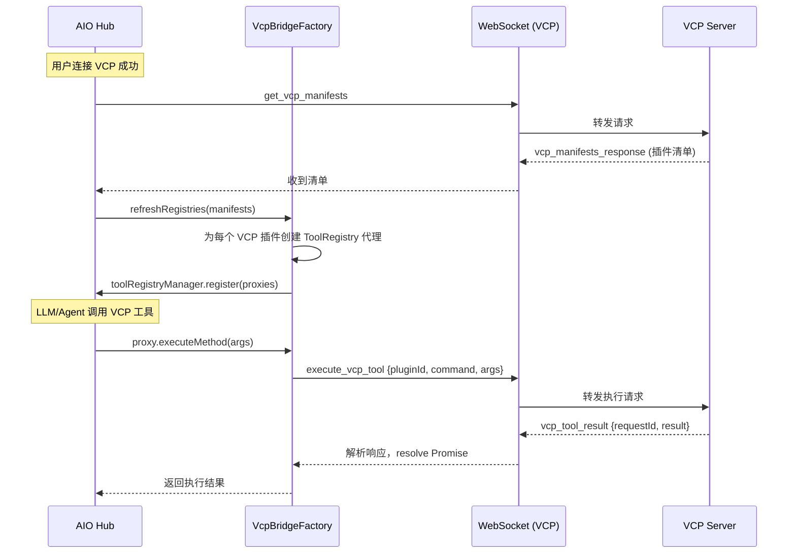

# VCP Tool Bridge 实施计划

**状态**: `Implementing`
**前置文档**: [vcp-tool-bridge-integration.md](./vcp-tool-bridge-integration.md) | [tool-registry-multi-instance-rfc.md](./tool-registry-multi-instance-rfc.md)

---

## 0. 现状确认

经代码审查，以下基础设施**已经就绪**，无需修改：

| 文件 | 状态 | 说明 |
|------|------|------|
| [`src/services/types.ts`](src/services/types.ts) | ✅ 已就绪 | `ToolRegistryFactory` 接口已定义（L159-174） |
| [`src/services/registry.ts`](src/services/registry.ts) | ✅ 已就绪 | `ToolRegistryManager` 已支持 `registerFactory`/`unregisterFactory` |
| [`src/services/auto-register.ts`](src/services/auto-register.ts) | ✅ 已就绪 | 已适配数组、工厂、对象实例等多种导出格式 |

因此，本次实施**只涉及 `src/tools/vcp-connector/` 内部的变更**。

---

## 1. 整体架构



---

## 2. 文件变更清单

### 2.1 需要新建的文件

| # | 文件路径 | 职责 |
|---|---------|------|
| 1 | `src/tools/vcp-connector/services/VcpBridgeFactory.ts` | 核心桥接工厂，实现 `ToolRegistryFactory`，负责将 VCP 插件映射为 AIO 工具 |
| 2 | `src/tools/vcp-connector/services/VcpToolProxy.ts` | 单个 VCP 插件的 `ToolRegistry` 代理实现 |

### 2.2 需要修改的文件

| # | 文件路径 | 变更内容 |
|---|---------|---------|
| 3 | `src/tools/vcp-connector/types/distributed.ts` | 增加桥接相关类型（`VcpBridgeManifest`、新的消息类型等） |
| 4 | `src/tools/vcp-connector/services/vcpNodeProtocol.ts` | 增加 `sendGetVcpManifests`、`sendExecuteVcpTool` 方法，以及对应的 `handle` 方法 |
| 5 | `src/tools/vcp-connector/stores/vcpDistributedStore.ts` | 增加桥接工具的状态管理（远程工具清单、连接状态等） |

### 2.3 可能需要修改的文件（视集成方式而定）

| # | 文件路径 | 说明 |
|---|---------|------|
| 6 | `src/tools/vcp-connector/composables/useVcpConnection.ts` 或类似文件 | 在 WS 连接成功后触发 `get_vcp_manifests`，在断开时触发 `unregisterFactory` |

---

## 3. 详细设计

### 3.1 类型扩展 (`types/distributed.ts`)

```typescript
// ===== 新增：桥接相关类型 =====

/** VCP 侧返回的插件清单（来自 VCPToolBridge 插件） */
export interface VcpBridgeManifest {
  pluginId: string;        // VCP 插件唯一 ID
  pluginName: string;      // 插件显示名
  description: string;     // 插件描述
  commands: VcpBridgeCommand[];  // 插件暴露的命令列表
}

/** VCP 插件暴露的单个命令 */
export interface VcpBridgeCommand {
  name: string;            // 命令名称
  displayName?: string;    // 显示名称
  description: string;     // 命令描述
  parameters: any;         // JSON Schema 格式的参数描述
  returnType?: string;     // 返回类型描述
}

/** VCP -> AIO: 清单响应 */
export interface VcpManifestsResponse {
  manifests: VcpBridgeManifest[];
}

/** AIO -> VCP: 执行远程工具请求 */
export interface ExecuteVcpToolRequest {
  requestId: string;
  pluginId: string;
  command: string;
  args: Record<string, any>;
}

/** VCP -> AIO: 远程工具执行结果 */
export interface VcpToolExecutionResult {
  requestId: string;
  status: 'success' | 'error';
  result?: any;
  error?: string;
}
```

同时扩展 `VcpDistributedMessage.type` 联合类型，增加：
- `'get_vcp_manifests'`
- `'vcp_manifests_response'`
- `'execute_vcp_tool'`
- `'vcp_tool_result'`

### 3.2 VcpToolProxy (`services/VcpToolProxy.ts`)

**职责**：将一个 VCP 插件映射为一个 AIO `ToolRegistry` 实例。

```typescript
// 伪代码骨架
export class VcpToolProxy implements ToolRegistry {
  readonly id: string;       // 格式: `vcp-bridge:{pluginId}`
  readonly name: string;
  readonly description: string;

  private commands: VcpBridgeCommand[];
  private executeRemote: (pluginId: string, command: string, args: any) => Promise<any>;

  constructor(manifest: VcpBridgeManifest, executeFn: RemoteExecuteFn) {
    this.id = `vcp-bridge:${manifest.pluginId}`;
    this.name = manifest.pluginName;
    this.description = manifest.description;
    this.commands = manifest.commands;
    this.executeRemote = executeFn;

    // 为每个 command 动态挂载方法到 this 上
    for (const cmd of manifest.commands) {
      (this as any)[cmd.name] = async (args: any) => {
        return this.executeRemote(manifest.pluginId, cmd.name, args);
      };
    }
  }

  getMetadata(): ServiceMetadata {
    return {
      methods: this.commands.map(cmd => ({
        name: cmd.name,
        displayName: cmd.displayName || cmd.name,
        description: cmd.description,
        parameters: this.convertJsonSchemaToParams(cmd.parameters),
        returnType: cmd.returnType || 'Promise<any>',
        agentCallable: true,           // VCP 桥接的工具默认对 Agent 可用
        distributedExposed: false,     // 不需要再次暴露回 VCP
      })),
    };
  }

  private convertJsonSchemaToParams(schema: any): MethodParameter[] {
    // 将 JSON Schema 转换为 AIO 的 MethodParameter 格式
    // ...
  }
}
```

**关键设计决策**：
- `id` 使用 `vcp-bridge:` 前缀，便于识别和批量管理
- 每个 command 动态挂载为实例方法，符合 AIO 的 `registry[methodName](args)` 调用约定
- `agentCallable: true` 确保 LLM Agent 可以发现和调用这些工具
- `distributedExposed: false` 避免循环暴露

### 3.3 VcpBridgeFactory (`services/VcpBridgeFactory.ts`)

**职责**：管理 VCP 桥接工具的全生命周期。

```typescript
// 伪代码骨架
export class VcpBridgeFactory implements ToolRegistryFactory {
  readonly factoryId = 'vcp-bridge';

  private sendJson: ((data: any) => void) | null = null;
  private pendingRequests = new Map<string, { resolve, reject, timeout }>();
  private currentManifests: VcpBridgeManifest[] = [];

  /** 设置 WebSocket 发送函数（由连接管理层注入） */
  setSendFunction(fn: (data: any) => void) {
    this.sendJson = fn;
  }

  /** ToolRegistryFactory 接口实现 */
  async createRegistries(): Promise<ToolRegistry[]> {
    // 首次调用时，向 VCP 请求清单
    if (this.currentManifests.length === 0) {
      this.currentManifests = await this.fetchManifests();
    }
    return this.currentManifests.map(m => new VcpToolProxy(m, this.executeRemote.bind(this)));
  }

  /** 向 VCP 请求工具清单 */
  private async fetchManifests(): Promise<VcpBridgeManifest[]> {
    return new Promise((resolve, reject) => {
      const requestId = crypto.randomUUID();
      const timeout = setTimeout(() => {
        this.pendingRequests.delete(requestId);
        reject(new Error('获取 VCP 工具清单超时'));
      }, 10000);

      this.pendingRequests.set(requestId, { resolve, reject, timeout });
      this.sendJson!({
        type: 'get_vcp_manifests',
        data: { requestId },
      });
    });
  }

  /** 处理 VCP 返回的清单响应 */
  handleManifestsResponse(requestId: string, manifests: VcpBridgeManifest[]) {
    const pending = this.pendingRequests.get(requestId);
    if (pending) {
      clearTimeout(pending.timeout);
      this.pendingRequests.delete(requestId);
      pending.resolve(manifests);
    }
  }

  /** 转发工具执行请求到 VCP */
  private async executeRemote(pluginId: string, command: string, args: any): Promise<any> {
    return new Promise((resolve, reject) => {
      const requestId = crypto.randomUUID();
      const timeout = setTimeout(() => {
        this.pendingRequests.delete(requestId);
        reject(new Error(`VCP 工具执行超时: ${pluginId}.${command}`));
      }, 30000);

      this.pendingRequests.set(requestId, { resolve, reject, timeout });
      this.sendJson!({
        type: 'execute_vcp_tool',
        data: { requestId, pluginId, command, args },
      });
    });
  }

  /** 处理 VCP 返回的执行结果 */
  handleToolResult(requestId: string, result: VcpToolExecutionResult) {
    const pending = this.pendingRequests.get(requestId);
    if (pending) {
      clearTimeout(pending.timeout);
      this.pendingRequests.delete(requestId);
      if (result.status === 'success') {
        pending.resolve(result.result);
      } else {
        pending.reject(new Error(result.error || 'VCP 工具执行失败'));
      }
    }
  }

  /** 刷新工具注册（连接恢复或清单变更时调用） */
  async refresh(): Promise<void> {
    // 1. 先注销旧的
    await toolRegistryManager.unregisterFactory(this.factoryId);
    // 2. 清空缓存
    this.currentManifests = [];
    // 3. 重新注册
    await toolRegistryManager.register(this);
  }

  /** 清理（断开连接时调用） */
  async teardown(): Promise<void> {
    // 拒绝所有 pending 请求
    for (const [id, pending] of this.pendingRequests) {
      clearTimeout(pending.timeout);
      pending.reject(new Error('VCP 连接已断开'));
    }
    this.pendingRequests.clear();
    // 注销工厂
    await toolRegistryManager.unregisterFactory(this.factoryId);
    this.currentManifests = [];
  }
}
```

**关键设计决策**：
- 使用 `pendingRequests` Map 实现请求-响应模式的异步调用
- 所有请求都有超时保护（清单 10s，执行 30s）
- 提供 `refresh()` 支持热更新，`teardown()` 支持优雅断开
- `sendJson` 通过依赖注入设置，不直接持有 WebSocket 引用

### 3.4 协议层扩展 (`vcpNodeProtocol.ts`)

在现有 `VcpNodeProtocol` 类中增加：

```typescript
// 发送方法
sendGetVcpManifests(requestId: string): void;
sendExecuteVcpTool(request: ExecuteVcpToolRequest): void;

// 接收处理（需要在消息分发处增加 case）
handleVcpManifestsResponse(data: VcpManifestsResponse): void;
handleVcpToolResult(data: VcpToolExecutionResult): void;
```

### 3.5 Store 扩展 (`vcpDistributedStore.ts`)

增加以下状态和方法：

```typescript
// 新增状态
bridgeManifests: ref<VcpBridgeManifest[]>([]),  // 从 VCP 拉取的远程工具清单
bridgeStatus: ref<'idle' | 'fetching' | 'ready' | 'error'>('idle'),

// 新增方法
setBridgeManifests(manifests: VcpBridgeManifest[]): void;
setBridgeStatus(status: ...): void;
```

### 3.6 连接生命周期集成

需要找到 WebSocket 连接/断开的入口点，在其中：

**连接成功后**：
1. 创建 `VcpBridgeFactory` 实例
2. 注入 `sendJson` 函数
3. 调用 `toolRegistryManager.register(factory)` 触发清单拉取和工具注册

**断开/错误时**：
1. 调用 `factory.teardown()` 清理所有代理工具和 pending 请求

**收到消息时**：
- `vcp_manifests_response` → `factory.handleManifestsResponse()`
- `vcp_tool_result` → `factory.handleToolResult()`

---

## 4. 实施顺序

| 步骤 | 内容 | 依赖 |
|------|------|------|
| Step 1 | 扩展 `types/distributed.ts` 增加桥接类型 | 无 |
| Step 2 | 实现 `VcpToolProxy.ts` | Step 1 |
| Step 3 | 实现 `VcpBridgeFactory.ts` | Step 1, 2 |
| Step 4 | 扩展 `vcpNodeProtocol.ts` 增加桥接协议方法 | Step 1 |
| Step 5 | 扩展 `vcpDistributedStore.ts` 增加桥接状态 | Step 1 |
| Step 6 | 在连接管理层（composable/service）中集成生命周期 | Step 3, 4, 5 |
| Step 7 | 测试验证 | Step 6 |

---

## 5. 需要进一步确认的问题

在实施 Step 6 之前，需要确认 VCP WebSocket 连接的管理入口在哪个文件中（需要查看 `useVcpConnection.ts` 或类似 composable），以确定在哪里注入 `VcpBridgeFactory` 的生命周期钩子。

---

## 6. 风险与注意事项

1. **ID 冲突**：`vcp-bridge:{pluginId}` 格式确保不会与本地工具 ID 冲突
2. **循环暴露**：代理工具的 `distributedExposed: false` 防止 AIO 将 VCP 工具再暴露回 VCP
3. **超时处理**：所有远程调用都有超时，防止永久挂起
4. **断线清理**：`teardown()` 确保断开时拒绝所有 pending 请求并注销工具
5. **热重载**：`ToolRegistryManager` 的 `initialized` 标志位允许覆盖注册，支持 `refresh()` 场景