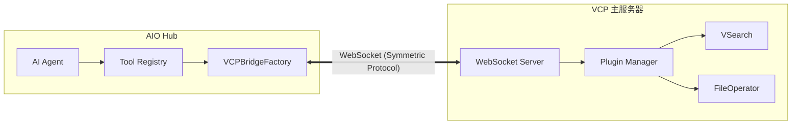

# 技术方案：VCP 原生工具桥接与多实例集成 (VCP Tool Bridge Integration)

**状态**: `Draft`  
**创建日期**: 2026-03-25  
**作者**: 咕咕 (Gugu_Kilo)  
**相关模块**: `vcp-connector`, `src/services/registry.ts`, `VCPToolBox/Plugin.js`

---

## 1. 背景与动机

目前 VCP (Variable & Command Protocol) 与 AIO (All-in-One Tools) 的连接是非对称的：AIO 可以作为分布式节点向 VCP 提供工具，但 VCP 内部积累的 79+ 原生插件（如 `VSearch`, `FileOperator`, `ChromeBridge` 等）却无法被 AIO 的 Agent 直接调用。

本方案旨在利用 AIO 的 **"工具注册系统多实例支持 (RFC)"**，将 VCP 作为一个强大的“外部工具库”接入 AIO，实现能力的双向对等共享。

---

## 2. VCP 工具范式调查结论

在实施桥接前，对 VCP 的运行范式进行了深度调查：

| 特性 | VCP 现状 | 对桥接的影响 |
| :--- | :--- | :--- |
| **文件锁定** | `stdio` 插件随用随开，`direct` 插件内存常驻。 | **不建议 AIO 直接读取目录**。应通过 VCP 提供的接口获取元数据，避免配置级联失效。 |
| **配置级联** | 插件配置由全局 `config.env`、插件 `config.env` 和 `manifest` 三层合并。 | AIO 无法简单复现 VCP 的配置环境，必须由 VCP 运行环境处理执行逻辑。 |
| **能力粒度** | 一个插件通常包含多个 `invocationCommands` (命令标识符)。 | 完美契合 AIO 的**多实例**构想，可将一个 VCP 插件拆分为多个 AIO 逻辑工具。 |
| **执行协议** | 使用自定义的 `<<<[TOOL_REQUEST]>>>` 语法。 | AIO 桥接层需要负责协议的转换与封装。 |

---

## 3. 架构设计

桥接系统采用 **“Provider-Consumer”** 模式。为了保持 VCP 核心的纯净与稳定，VCP 侧的桥接逻辑将采用 **“非侵入式插件化”** 设计。

### 3.1. 逻辑组件

1.  **VCP Provider (VCP 侧 - 桥接插件)**:
    *   作为一个 `hybridservice` 类型的管理插件运行。
    *   **上下文获取**: 通过 VCP 的依赖注入机制获取 `pluginManager` 实例，从而访问所有已加载工具的元数据。
    *   **通讯增强**: 扩展现有的 `WebSocketServer` 处理器，专门处理来自 AIO 的 `vcp_manifest_request` 消息。
    *   **优势**: 无需修改 VCP 核心代码，支持即插即用，且能利用 VCP 插件的热重载特性。
2.  **AIO Bridge Factory (AIO 侧)**:
    *   实现 `ToolRegistryFactory` 接口。
    *   **Discovery**: 通过 WebSocket 向 VCP 请求工具清单。
    *   **Mapping**: 将 VCP 插件的每个 `commandIdentifier` 映射为一个独立的 `ToolRegistry` 实例。
    *   **Forwarding**: 将 AIO 的方法调用封装为 VCP 协议并转发执行。

### 3.2. 拓扑结构



---

## 4. 协议定义 (WebSocket)

### 4.1. 元数据同步 (Sync Manifests)
**AIO -> VCP**:
```json
{ "type": "get_vcp_manifests", "data": {} }
```

**VCP -> AIO**:
```json
{
  "type": "vcp_manifest_response",
  "data": {
    "plugins": [
      {
        "name": "FileOperator",
        "displayName": "文件操作器",
        "capabilities": {
          "invocationCommands": [
            { "commandIdentifier": "ReadFile", "description": "读取文件..." },
            { "commandIdentifier": "WriteFile", "description": "写入文件..." }
          ]
        }
      }
    ]
  }
}
```

### 4.2. 远程执行 (Remote Execution)
**AIO -> VCP**:
```json
{
  "type": "execute_tool",
  "data": {
    "requestId": "req-123",
    "toolName": "FileOperator",
    "toolArgs": { "command": "ReadFile", "path": "test.txt" }
  }
}
```

---

## 5. 多实例映射逻辑 (Mapping Strategy)

为了实现 RFC 要求的“细粒度权限隔离”，AIO Bridge 将采取以下映射策略：

1.  **ID 扁平化**: 
    *   VCP 插件: `FileOperator`
    *   AIO 工具实例 1: `vcp-file-read` (仅暴露 ReadFile)
    *   AIO 工具实例 2: `vcp-file-write` (仅暴露 WriteFile)
2.  **配置注入**: 
    AIO 的 `ToolRegistry` 实例将保留指向 VCP 的引用，确保执行时能正确路由。
3.  **动态刷新**: 
    当 VCP 侧发生热重载（插件增删）时，VCP 主动推送 `update_vcp_manifests`，AIO 侧的 Factory 重新触发 `createRegistries()`。

---

## 6. 安全与权限

*   **复用审核流**: AIO 调用的 VCP 工具将触发 VCP 原生的 `toolApprovalManager`，管理员可以在 VCP 管理面板进行二次确认。
*   **AIO 侧开关**: 用户可以在 AIO 的分布式配置页面，针对每个 VCP 导出的子工具设置 `enabled/disabled`。

---

## 7. 实施计划

1.  **阶段一 (VCP 端)**: 在 `WebSocketServer.js` 中实现清单导出接口。
2.  **阶段二 (AIO 端)**: 实现 `VCPBridgeFactory` 并在注册中心挂载。
3.  **阶段三 (UI 适配)**: 在 AIO 的分布式节点页面展示“从 VCP 接收到的工具”。

---

## 8. 结论

通过将 VCP 视为 AIO 的一个 `ToolRegistryFactory`，我们不仅解决了工具共享的非对称问题，还利用 AIO 的多实例特性，提升了 VCP 插件在复杂 Agent 场景下的可用性和安全性。