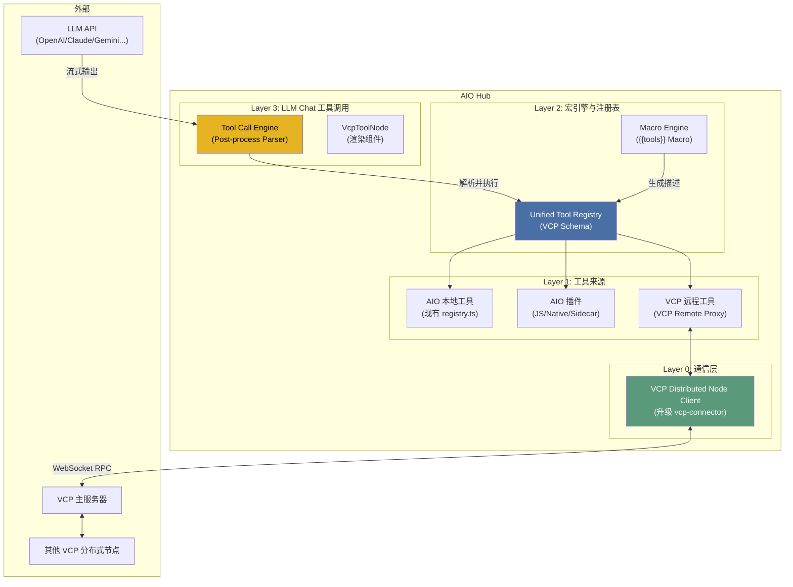
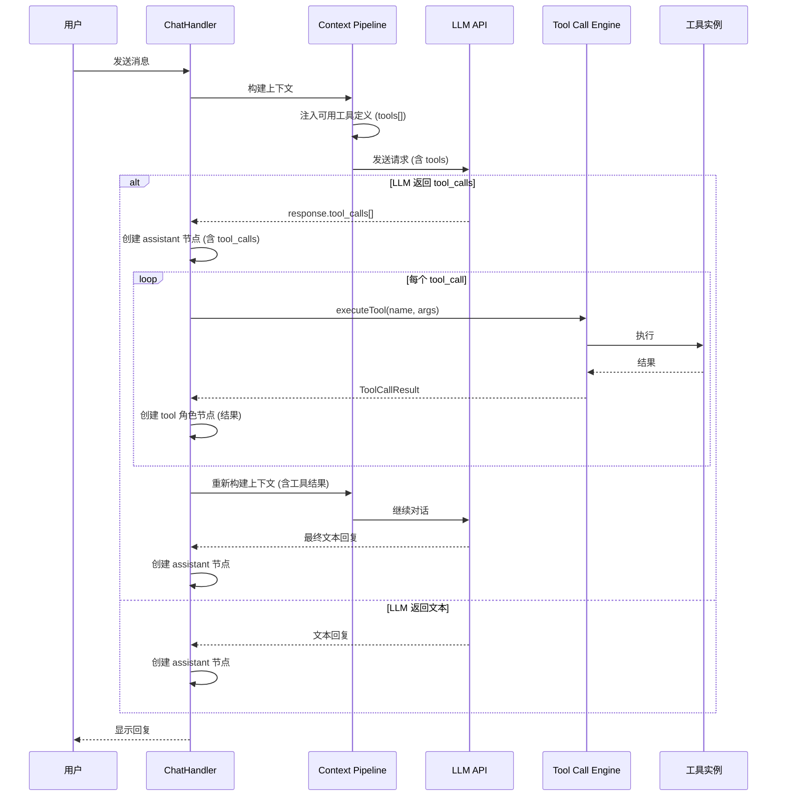

# RFC: VCP 分布式协作 + AIO Function Calling 架构

> **状态**: RFC (Request for Comments)
> **作者**: 咕咕
> **日期**: 2026-02-10
> **关联**: VCP 分布式架构调查报告

---

## 0. 摘要

本 RFC 提出两个相互关联但可独立实施的目标：

1. **AIO llm-chat Text-based Tool Calling** — 让 AI 通过 VCP 纯文本标记协议调用 AIO 本地工具和插件。
2. **AIO ↔ VCP 分布式协作** — AIO 作为 VCP 的分布式节点，将本地能力暴露给 VCP，同时可选地消费 VCP 远程工具。

### 核心决策 1：放弃原生 Tool-Call，拥抱 VCP 文本协议

为了最大化兼容性（支持逆向渠道、中转 API）并降低适配成本，AIO **不会**优先使用 OpenAI/Claude 的原生 `tool_calls` 参数，而是采用 VCP 的**纯文本流标记协议**：

- **调用格式**：LLM 在回复中输出 `<<<[TOOL_REQUEST]>>>` 块，使用 `「始」` `「末」` 定界符包裹参数。
- **注入方式**：工具的调用说明（Schema）直接作为 System Prompt 的一部分注入。
- **解析方式**：流式输出完成后，由 ChatHandler 统一解析回复文本中的所有标记，触发本地串行或并行执行。
- **优势**：模型 API 无关、支持单次回复多工具调用、与 VCP 生态完全对齐。

### 核心决策 2：VCP 渠道感知与执行权转移

当 AIO 检测到当前使用的 LLM 渠道属于 **VCP 转发渠道**时，将触发以下行为控制：

- **执行权转移**：AIO 本地的 `ToolCallExecutor` 将被禁用。LLM 输出的 `<<<[TOOL_REQUEST]>>>` 标记将由 VCP 服务器拦截并执行。AIO 仅负责渲染执行进度。
- **分布式对齐**：只有在 AIO 成功作为“分布式节点”连接到该 VCP 服务器时，才会向 System Prompt 注入工具描述。这确保了 LLM 请求的工具一定能通过分布式链路路由回 AIO 执行。

---

## 1. 动机与目标

### 1.1 当前状态

| 组件           | 状态      | 说明                                     |
| -------------- | --------- | ---------------------------------------- |
| AIO 插件系统   | ✅ 已实现 | 支持 JS / Native / Sidecar 三种类型      |
| AIO 服务注册表 | ✅ 已实现 | `ToolRegistryManager` + `execute()`      |
| AIO VCP 连接器 | ⚠️ 仅观察 | 只接收 `/vcpinfo` 调试消息，无分布式能力 |
| AIO 工具调用   | ❌ 未实现 | llm-chat 尚无 Function Calling 支持      |
| VCP 分布式系统 | ✅ 成熟   | 星型拓扑，WebSocket RPC，超栈追踪        |

### 1.2 目标

1. **AIO llm-chat 支持文本工具调用** — 让 AI 能通过文本标记调用本地工具（AIO 内置 + AIO 插件）。
2. **AIO 可作为 VCP 分布式节点** — 将 AIO 的能力（OCR、文件处理等）暴露给 VCP。
3. **AIO 可消费 VCP 远程工具** — 连接 VCP 后获取其他节点的工具能力（Phase 3）。

### 1.3 非目标

- 不实现原生 `tool_calls` 参数适配（除非未来有极强需求）。
- 不替代 VCP 主服务器的角色。
- **不在 AIO 本地运行 Node.js 格式的 VCP 插件**（VCP 插件由 VCP 服务管理，AIO 仅通过分布式连接消费或运行自己的 JS/Native 插件）。

---

## 2. 架构总览



**关键变化**（相比原方案）：移除了 `VCP 本地插件` 适配器层。VCP 工具只通过分布式连接获取，不在 AIO 本地加载。

---

## 3. 分层设计

### 3.1 Layer 0: VCP 分布式节点客户端

**目标**: 升级现有 `vcp-connector`，使其支持完整的分布式节点协议。

#### 3.1.1 当前 vs 目标

| 能力       | 当前                | 目标                                       |
| ---------- | ------------------- | ------------------------------------------ |
| 连接端点   | `/vcpinfo` (观察者) | `/vcp-distributed-server/` (分布式节点)    |
| 认证方式   | VCP_Key in URL      | VCP_Key in URL (相同)                      |
| 消息方向   | 单向接收            | 双向通信                                   |
| 工具注册   | ❌                  | ✅ `register_tools`                        |
| IP 上报    | ❌                  | ✅ `report_ip`                             |
| 工具执行   | ❌                  | ✅ 接收 `execute_tool`，返回 `tool_result` |
| 占位符同步 | ❌                  | ✅ `update_static_placeholders`            |
| 观察者模式 | ✅ 保留             | ✅ 保留（可同时连接两个端点）              |

#### 3.1.2 连接模式

```typescript
// 新增连接模式枚举
type VcpConnectionMode =
  | "observer" // 仅观察（现有行为）
  | "distributed" // 分布式节点
  | "both"; // 同时启用两种连接

interface VcpDistributedConfig {
  /** 分布式节点连接模式 */
  mode: VcpConnectionMode;
  /** 节点名称（在 VCP 中显示） */
  serverName: string;
  /** 要暴露给 VCP 的工具 ID 列表（空 = 全部） */
  exposedToolIds: string[];
  /** 是否自动注册本地工具 */
  autoRegisterTools: boolean;
}
```

#### 3.1.3 协议消息处理

```typescript
// 需要实现的消息处理器
interface DistributedNodeProtocol {
  // 发送方向（AIO → VCP）
  sendRegisterTools(tools: VcpToolManifest[]): void;
  sendReportIp(localIPs: string[], publicIP: string): void;
  sendUpdateStaticPlaceholders(placeholders: Record<string, string>): void;
  sendToolResult(requestId: string, status: "success" | "error", result: any): void;

  // 接收方向（VCP → AIO）
  handleExecuteTool(
    requestId: string,
    toolName: string,
    toolArgs: Record<string, any>
  ): Promise<void>;
}
```

#### 3.1.4 文件结构变更

```
src/tools/vcp-connector/
├── vcpConnector.registry.ts
├── VcpConnector.vue
├── components/
│   ├── monitor/          # 现有观察者 UI（保留）
│   └── distributed/      # 新增：分布式节点管理 UI
│       ├── NodeStatusPanel.vue
│       ├── ExposedToolsList.vue
│       └── RemoteToolsList.vue
├── composables/
│   ├── useVcpWebSocket.ts          # 现有（保留）
│   └── useVcpDistributedNode.ts    # 新增：分布式节点逻辑
├── stores/
│   ├── vcpConnectorStore.ts        # 现有（扩展）
│   └── vcpDistributedStore.ts      # 新增：分布式状态
├── services/
│   └── vcpNodeProtocol.ts          # 新增：协议实现
└── types/
    ├── protocol.ts                 # 现有（扩展）
    └── distributed.ts              # 新增：分布式类型
```

#### 3.1.6 分布式协议实现 (Layer 0)

**消息路由流程**：

1. **接收 `execute_tool`**：`VcpNodeProtocol` 接收到消息。
2. **权限校验**：检查请求的 `toolName` 是否在 `exposedToolIds` 列表中，且该方法在元数据中标记为 `distributedExposed: true`。
3. **本地执行**：调用 `toolRegistryManager.execute(toolName, args)`。
4. **返回结果**：将执行结果通过 `tool_result` 消息回传。

```typescript
// src/tools/vcp-connector/services/vcpNodeProtocol.ts

async function handleExecuteTool(requestId: string, toolName: string, args: any) {
  try {
    // 1. 查找工具
    const tool = toolRegistryManager.getTool(toolName);
    const method = tool?.getMetadata()?.methods.find((m) => m.name === toolName);

    // 2. 校验分布式暴露权限
    if (!method?.distributedExposed) {
      throw new Error(`Tool ${toolName} is not exposed for distributed execution`);
    }

    // 3. 执行
    const result = await toolRegistryManager.execute(toolName, args);

    // 4. 回传
    ws.send({ type: "tool_result", data: { requestId, status: "success", result } });
  } catch (err) {
    ws.send({ type: "tool_result", data: { requestId, status: "error", error: err.message } });
  }
}
```

---

### 3.2 Layer 1: 工具来源

AIO 的工具来源分为两类，全部通过统一注册表暴露：

| 来源             | 说明                          | 执行方式         |
| ---------------- | ----------------------------- | ---------------- |
| **AIO 内置工具** | 各 `*.registry.ts` 导出的服务 | 本地直接调用     |
| **AIO 插件**     | JS / Native / Sidecar 插件    | 通过插件系统执行 |

#### 3.2.1 VCP 远程工具代理 (VCP Remote Proxy)

~~**目标**: 当 AIO 连接到 VCP 主服务器时，将 VCP 上的远程工具注册为 AIO 的可用工具。~~
废弃，不主动调用vcp的工具，真有需求的用户就自己做插件处理吧。其实连接vcp后有vcp服务器自己处理调用就是了。

---

### 3.3 Layer 2: 统一工具注册表扩展

**目标**: 扩展现有的 `ToolRegistryManager`，使其能生成 VCP 格式的工具描述文本，用于注入 System Prompt。

#### 3.3.1 工具元数据增强 (VCP Schema)

```typescript
// src/services/types.ts 扩展

/** VCP 格式的工具指令定义 */
interface VcpInvocationCommand {
  commandIdentifier: string;
  description: string; // 包含参数说明、定界符说明的详细 Prompt
  example: string; // 包含 <<<[TOOL_REQUEST]>>> 的示例
}

/** 增强的工具注册接口 */
interface ToolRegistryEnhanced extends ToolRegistry {
  readonly source?: ToolSource;
  readonly llmCallable?: boolean;
  /** 是否允许通过分布式连接被外部调用 */
  readonly distributedExposed?: boolean;

  /** 获取 VCP 格式的调用指令定义 */
  getVcpInvocationCommands?(): VcpInvocationCommand[];
}
```

#### 3.3.2 宏机制集成 ({{tools}})

不再硬编码注入逻辑，而是通过宏引擎提供 `{{tools}}` 宏。用户可以在智能体的 System Prompt 或预设消息中灵活引用。

```typescript
// src/tools/llm-chat/macro-engine/macros/tools.ts

export function registerToolMacros(registry: MacroRegistry): void {
  registry.register({
    name: "tools",
    type: MacroType.VALUE,
    phase: MacroPhase.SUBSTITUTE,
    description: "注入当前智能体可用的工具调用说明",
    execute: async (context) => {
      const config = context.agent?.parameters?.toolCall;
      if (!config?.enabled) return "";

      // 调用 ToolDiscoveryService 获取格式化的 VCP Prompt
      return toolDiscovery.getVcpToolPrompts(config);
    },
  });
}
```

---

### 3.4 Layer 3: LLM Chat 工具调用引擎

**目标**: 在 llm-chat 中实现完整的 Function Calling 支持。

#### 3.4.1 工具调用流程



#### 3.4.2 工具调用配置

工具调用配置位于智能体的 `AgentBaseConfig` 中（而非 `LlmParameters`），因为它是 Agent 级别的能力配置，不应与 LLM API 参数混淆：

```typescript
// src/tools/llm-chat/types/agent.ts 扩展

interface ToolCallConfig {
  /** 是否启用工具调用（总开关） */
  enabled: boolean;

  /** 工具调用模式 */
  mode: "auto" | "manual";

  /**
   * 工具开关映射
   * key: 工具 ID（对应 ToolRegistry.id）
   * value: 是否启用该工具
   *
   * 未出现在映射中的工具遵循 defaultToolEnabled 的默认行为。
   * UI 上表现为每个工具一个独立开关。
   */
  toolToggles: Record<string, boolean>;

  /**
   * 未在 toolToggles 中明确配置的工具的默认启用状态
   * true: 新工具默认启用（白名单模式 → 只禁用特定工具）
   * false: 新工具默认禁用（黑名单模式 → 只启用特定工具）
   * @default true
   */
  defaultToolEnabled: boolean;

  /** 最大连续工具调用次数（防止无限循环） */
  maxIterations: number;

  /** 工具调用超时（毫秒） */
  timeout: number;

  /** 是否在工具调用前需要用户确认 */
  requireConfirmation: boolean;

  /** 并行工具调用策略 */
  parallelExecution: boolean;
}
```

**默认值**：

```typescript
const DEFAULT_TOOL_CALL_CONFIG: ToolCallConfig = {
  enabled: false, // 默认不启用工具调用
  mode: "auto",
  toolToggles: {}, // 空映射 = 全部遵循 defaultToolEnabled
  defaultToolEnabled: true, // 默认所有工具可用
  maxIterations: 5,
  timeout: 30000,
  requireConfirmation: false,
  parallelExecution: false,
};
```

**在 `AgentBaseConfig` 中的位置**：

```typescript
// src/tools/llm-chat/types/agent.ts
export interface AgentBaseConfig {
  // ... 现有字段 ...

  /**
   * 工具调用配置
   * 控制该智能体是否启用工具调用，以及哪些工具可用
   */
  toolCallConfig?: ToolCallConfig;
}
```

#### 3.4.3 宏处理流程

工具定义的注入现在由现有的 `MacroProcessor` 在 `SUBSTITUTE` 阶段处理。

1.  **Pipeline 执行**：`injection-assembler` 组装 System Prompt。
2.  **宏替换**：`MacroProcessor` 扫描到 `{{tools}}`，调用工具宏。
3.  **动态生成**：宏执行函数根据当前 Agent 的 `toolCall` 配置，从 `ToolRegistry` 提取 Schema 并转换为 VCP 文本。
4.  **发送请求**：LLM 接收到包含工具说明的完整 Prompt。

#### 3.4.4 工具调用执行器

```typescript
// src/tools/llm-chat/composables/useToolCallExecutor.ts

interface ToolCallResult {
  toolCallId: string;
  toolName: string;
  status: "success" | "error";
  result: string;
  duration: number;
}

/**
 * 工具调用执行器
 * 处理 LLM 返回的 tool_calls，执行工具并收集结果
 */
function useToolCallExecutor() {
  const toolDiscovery = useToolDiscovery();

  /**
   * 执行一批工具调用
   */
  async function executeToolCalls(
    toolCalls: LlmToolCall[],
    config: ToolCallConfig
  ): Promise<ToolCallResult[]> {
    // 1. 如果需要用户确认，弹出确认对话框
    if (config.requireConfirmation) {
      const approved = await showToolCallConfirmation(toolCalls);
      if (!approved) {
        return toolCalls.map((tc) => ({
          toolCallId: tc.id,
          toolName: tc.function.name,
          status: "error" as const,
          result: "用户拒绝了工具调用",
          duration: 0,
        }));
      }
    }

    // 2. 根据配置决定串行或并行执行
    if (config.parallelExecution) {
      return Promise.all(toolCalls.map((tc) => executeSingleTool(tc, config)));
    } else {
      const results: ToolCallResult[] = [];
      for (const tc of toolCalls) {
        results.push(await executeSingleTool(tc, config));
      }
      return results;
    }
  }

  async function executeSingleTool(
    toolCall: LlmToolCall,
    config: ToolCallConfig
  ): Promise<ToolCallResult> {
    const startTime = Date.now();
    try {
      const args = JSON.parse(toolCall.function.arguments);
      const result = await toolDiscovery.executeTool(toolCall.function.name, args, {
        timeout: config.timeout,
      });
      return {
        toolCallId: toolCall.id,
        toolName: toolCall.function.name,
        status: "success",
        result: typeof result === "string" ? result : JSON.stringify(result),
        duration: Date.now() - startTime,
      };
    } catch (error) {
      return {
        toolCallId: toolCall.id,
        toolName: toolCall.function.name,
        status: "error",
        result: error instanceof Error ? error.message : String(error),
        duration: Date.now() - startTime,
      };
    }
  }

  return { executeToolCalls };
}
```

#### 3.4.5 工具开关配置界面

**目标**: 在智能体编辑器的"功能扩展"（`CapabilitiesSection`）tab 中，新增工具调用配置区域，让用户可以直观地管理每个工具的开关状态。

##### 3.4.5.1 UI 位置与结构

配置界面位于 `AgentEditor` → `CapabilitiesSection.vue` 中，在"资产管理"和"虚拟时间线"之间插入：

```
功能扩展 Tab
├── 资产管理（现有）
├── ─────────────
├── 🆕 工具调用配置
│   ├── 总开关：启用工具调用 [Switch]
│   ├── 工具调用模式：auto / manual [Radio]
│   ├── 工具列表（可搜索）
│   │   ├── [Switch] directory-tree — 目录树生成
│   │   ├── [Switch] ocr — OCR 文字识别
│   │   ├── [Switch] text-diff — 文本差异对比
│   │   └── ... (从 ToolRegistryManager 动态获取)
│   ├── 默认启用新工具 [Switch]
│   └── 高级选项（折叠）
│       ├── 最大迭代次数 [InputNumber]
│       ├── 超时时间 [InputNumber]
│       ├── 执行前确认 [Switch]
│       └── 并行执行 [Switch]
├── ─────────────
└── 虚拟时间线（现有）
```

##### 3.4.5.2 组件设计

新增独立组件 `ToolCallConfigSection.vue`，在 `CapabilitiesSection.vue` 中引用：

```typescript
// src/tools/llm-chat/components/agent/agent-editor/sections/ToolCallConfigSection.vue

// 核心逻辑：
// 1. 从 ToolRegistryManager.getAllTools() 获取所有已注册工具
// 2. 过滤出 llmCallable 的工具（未来扩展，当前先显示所有有 getMetadata() 的工具）
// 3. 根据 editForm.toolCallConfig.toolToggles 渲染每个工具的开关状态
// 4. 工具列表支持搜索过滤
// 5. 总开关关闭时，工具列表区域整体禁用（灰显）
```

##### 3.4.5.3 搜索索引注册

在 `agentEditConfig.ts` 的 `capabilities` tab 中追加搜索项：

```typescript
{
  id: "capabilities",
  label: "功能扩展",
  icon: Zap,
  items: [
    { id: "assets", label: "资产管理", keywords: "assets 资产 图片 音频" },
    // 🆕 新增
    { id: "toolCall", label: "工具调用", keywords: "tool call function calling 工具调用 函数调用" },
    { id: "toolCallToggle", label: "工具开关", keywords: "tool toggle enable disable 工具 开关 启用 禁用" },
    { id: "virtualTime", label: "虚拟时间线", keywords: "virtual time 虚拟时间" },
  ],
}
```

##### 3.4.5.4 EditAgentDialog 数据流

`EditAgentDialog.vue` 的 `editForm` 需要新增 `toolCallConfig` 字段：

```typescript
// defaultFormState 追加
const defaultFormState = {
  // ... 现有字段 ...
  toolCallConfig: {
    enabled: false,
    mode: "auto" as const,
    toolToggles: {} as Record<string, boolean>,
    defaultToolEnabled: true,
    maxIterations: 5,
    timeout: 30000,
    requireConfirmation: false,
    parallelExecution: false,
  },
};

// handleSave 中追加
emit("save", {
  // ... 现有字段 ...
  toolCallConfig: editForm.toolCallConfig,
});
```

##### 3.4.5.5 宏与开关的联动

`{{tools}}` 宏在执行时读取 Agent 的 `toolCallConfig`，根据开关过滤工具列表：

```typescript
// src/tools/llm-chat/macro-engine/macros/tools.ts

export function registerToolMacros(registry: MacroRegistry): void {
  registry.register({
    name: "tools",
    type: MacroType.VALUE,
    phase: MacroPhase.SUBSTITUTE,
    description: "注入当前智能体可用的工具调用说明",
    execute: async (context) => {
      const config = context.agent?.toolCallConfig;
      if (!config?.enabled) return "";

      // 1. 从 ToolRegistryManager 获取所有工具
      const allTools = toolRegistryManager.getAllTools();

      // 2. 过滤：根据 toolToggles 和 defaultToolEnabled
      const enabledTools = allTools.filter((tool) => {
        const toggle = config.toolToggles[tool.id];
        // 明确配置了开关 → 使用配置值
        if (toggle !== undefined) return toggle;
        // 未配置 → 使用默认值
        return config.defaultToolEnabled;
      });

      // 3. 过滤：只保留有 getVcpInvocationCommands 的工具
      const callableTools = enabledTools.filter(
        (tool) => typeof (tool as any).getVcpInvocationCommands === "function"
      );

      if (callableTools.length === 0) return "";

      // 4. 生成 VCP 格式的工具描述文本
      return formatVcpToolPrompts(callableTools);
    },
  });
}
```

**关键联动逻辑**：

- `toolCallConfig.enabled === false` → `{{tools}}` 宏返回空字符串，不注入任何工具描述
- `toolCallConfig.enabled === true` → 根据 `toolToggles` 过滤后生成工具描述
- 工具在 `toolToggles` 中被设为 `false` → 该工具不会出现在 `{{tools}}` 的输出中
- 工具不在 `toolToggles` 中 → 遵循 `defaultToolEnabled` 的值

---

## 4. 实施阶段

### Phase 1: Function Calling 基础设施（独立于 VCP）

**优先级**: 🔴 最高 — 这是 AIO llm-chat 的核心能力增强

| 任务                        | 说明                                                    |
| --------------------------- | ------------------------------------------------------- |
| 扩展 `ToolRegistryManager`  | 增加 `ToolSource`、`llmCallable`、`getVcpInvocation()`  |
| 实现 `ToolDiscoveryService` | 聚合工具来源，生成 VCP 格式的 Prompt 文本               |
| 实现 `{{tools}}` 宏         | 宏引擎集成，允许在 System Prompt 中动态插入工具列表     |
| 实现 `useToolCallExecutor`  | 工具调用执行器，解析回复文本中的 `<<<[TOOL_REQUEST]>>>` |
| 扩展 ChatHandler            | 支持 tool_calls 响应的循环处理                          |
| 扩展消息节点类型            | 支持 `role: 'tool'` 节点和 `tool_calls` 字段            |
| UI: 工具调用渲染            | 复用/扩展现有 `VcpToolNode` 组件                        |
| UI: 工具调用配置面板        | 在智能体参数中添加工具调用配置                          |

### Phase 2: VCP 分布式节点（AIO → VCP 方向）

**优先级**: 🟡 中等 — 让 AIO 的能力可被 VCP 生态消费

| 任务                           | 说明                                               |
| ------------------------------ | -------------------------------------------------- |
| 升级 `vcp-connector`           | 支持 `/vcp-distributed-server/` 端点               |
| 实现 `DistributedNodeProtocol` | 双向 WebSocket 消息处理                            |
| 工具注册                       | 将 AIO 本地工具转换为 VCP 格式并注册               |
| 工具执行                       | 接收 VCP 下发的 `execute_tool`，路由到本地工具执行 |
| UI: 分布式节点管理面板         | 节点状态、已暴露工具列表                           |

### Phase 3: VCP 远程工具消费（VCP → AIO 方向）

**优先级**: 🟢 较低 — 需要 VCP 侧协议扩展配合

| 任务                      | 说明                                                |
| ------------------------- | --------------------------------------------------- |
| 实现 `VcpRemoteToolProxy` | 将 VCP 远程工具包装为 AIO ToolRegistry              |
| VCP 协议扩展              | 需要 VCP 支持"反向工具查询"或通过 HTTP API 间接实现 |
| UI: 远程工具列表          | 展示可用的 VCP 远程工具                             |

---

## 5. 数据流示例

### 5.1 用户在 AIO llm-chat 中触发工具调用（目录树查看）

**场景**: 用户在聊天中发送一个本地路径，AI 自主判断需要调用目录树工具查看内容，然后基于结果回答问题。这体现了 Function Calling 的核心价值——AI 作为"中间人"自主决策调用什么工具，而非用户手动去工具页操作。

```
用户: "帮我看看 E:\projects\my-app 这个项目的结构，用了什么技术栈？"
  ↓
ChatHandler → Context Pipeline
  ↓ (ToolInjectorProcessor 注入 tools[])
LLM API ← 请求 (含 tools: [{name: "directory_tree_generate", ...}])
  ↓
LLM API → 返回 tool_calls: [{
    name: "directory_tree_generate",
    args: {
      path: "E:\\projects\\my-app",
      showFiles: true,
      maxDepth: 3,
      filterMode: "gitignore"
    }
  }]
  ↓
ChatHandler → useToolCallExecutor
  ↓
ToolDiscoveryService.executeTool("directory_tree_generate", args)
  ↓ (路由到 AIO 内置目录树工具 DirectoryTreeRegistry.generateTree())
Rust 后端扫描目录 → 返回 TreeGenerationResult {
    structure: { name: "my-app", is_dir: true, children: [...] },
    stats: { total_dirs: 12, total_files: 47, ... }
  }
  ↓
ChatHandler → 创建 tool 角色节点（含目录树文本） → 重新发送给 LLM
  ↓
LLM API → 返回最终文本回复:
  "这是一个 Vue 3 + Vite 项目，使用 TypeScript 开发。
   从目录结构来看：
   - src/components/ 下有 15 个组件
   - 使用了 Pinia 做状态管理（src/stores/）
   - 有 Tailwind CSS 配置（tailwind.config.js）
   - 测试框架是 Vitest（vitest.config.ts）..."
  ↓
用户看到回复（包含结构化的项目分析）
```

### 5.2 VCP 通过分布式连接调用 AIO 的目录树能力

**场景**: VCP 部署在云端服务器，用户通过 VCP 对话时需要查看本地开发机（运行 AIO 的机器）上的项目结构。AIO 作为分布式节点，将本地文件系统能力暴露给 VCP。

```
VCP 用户对话: "帮我看看本地开发机上 D:\work\backend 的目录结构"
  ↓
VCP 主服务器 → 识别到需要调用 AIO 节点的 directory_tree_generate
  ↓
VCP 主服务器 → WebSocket → AIO (execute_tool: {
    name: "directory_tree_generate",
    args: { path: "D:\\work\\backend", showFiles: true, maxDepth: 3, filterMode: "gitignore" }
  })
  ↓
AIO DistributedNodeProtocol.handleExecuteTool()
  ↓ (路由到本地目录树工具)
Rust 后端扫描本地目录 → 返回 TreeGenerationResult
  ↓
AIO → WebSocket → VCP 主服务器 (tool_result: 目录树结构数据)
  ↓
VCP 继续对话流程，LLM 基于目录树结果生成回复
```

### 5.3 VCP 渠道感知：执行权转移流程

**场景**: 用户在 AIO llm-chat 中使用了一个 VCP 转发渠道（即 LLM 请求实际通过 VCP 主服务器中转）。此时 AIO 的工具调用不由本地执行，而是由 VCP 服务器拦截并执行。

**前置条件**:

- AIO 已作为分布式节点连接到该 VCP 服务器（Phase 2 已完成）
- 当前 Agent 使用的 LLM Profile 被标识为 VCP 渠道

```
用户: "帮我看看 E:\projects\my-app 这个项目的结构"
  ↓
ChatHandler → 检测当前 LLM Profile 是否为 VCP 渠道
  ↓ (isVcpChannel === true)

=== 与普通流程的关键差异 ===

[1] System Prompt 注入阶段:
    {{tools}} 宏执行时检测到 VCP 渠道模式
      ↓
    检查 AIO 是否已作为分布式节点连接到该 VCP 服务器
      ↓
    ✅ 已连接 → 注入工具描述（这些工具将由 VCP 侧路由回 AIO 执行）
    ❌ 未连接 → 返回空字符串，不注入任何工具描述
                （避免 LLM 请求了工具但无人能执行的情况）

[2] LLM 请求发送:
    请求通过 VCP 渠道发送 → VCP 主服务器接收
      ↓
    VCP 主服务器转发给 LLM API
      ↓
    LLM 返回含 <<<[TOOL_REQUEST]>>> 标记的回复

[3] 工具执行阶段（关键差异）:
    VCP 主服务器拦截 LLM 回复中的 <<<[TOOL_REQUEST]>>>
      ↓
    VCP 主服务器解析工具调用 → 识别目标节点为 AIO
      ↓
    VCP → WebSocket → AIO (execute_tool)
      ↓
    AIO DistributedNodeProtocol.handleExecuteTool()
      ↓ (本地执行)
    AIO → WebSocket → VCP (tool_result)
      ↓
    VCP 主服务器将结果拼回对话上下文 → 继续 LLM 对话

[4] AIO 端的渲染:
    AIO 本地的 ToolCallExecutor 被禁用（不重复执行）
      ↓
    AIO 仅渲染 VCP 推送的执行进度和最终结果
      ↓
    用户在 AIO llm-chat 中看到完整的对话（含工具调用过程）
```

**VCP 渠道检测逻辑**:

```typescript
// src/tools/llm-chat/composables/useVcpChannelDetection.ts

interface VcpChannelState {
  /** 当前 LLM Profile 是否为 VCP 转发渠道 */
  isVcpChannel: boolean;
  /** 对应的 VCP 服务器地址 */
  vcpServerUrl: string | null;
  /** AIO 是否已作为分布式节点连接到该服务器 */
  isDistributedConnected: boolean;
  /** 最终判定：是否应将执行权交给 VCP */
  shouldDelegateExecution: boolean;
}

function useVcpChannelDetection(profileId: Ref<string>): VcpChannelState {
  // 实现思路:
  // 1. 从 LlmProfile 的元数据中检测是否为 VCP 渠道
  //    (可能通过 baseUrl 匹配、或 profile 上的 vcpServerId 标记)
  // 2. 检查 vcpDistributedStore 中是否有到该服务器的活跃连接
  // 3. shouldDelegateExecution = isVcpChannel && isDistributedConnected
}
```

**与核心决策 2 的对应关系**:

| 核心决策 2 要求       | 实现方式                                                |
| --------------------- | ------------------------------------------------------- |
| AIO 检测 VCP 转发渠道 | `useVcpChannelDetection` 检查 LlmProfile 元数据         |
| 本地 Executor 被禁用  | `shouldDelegateExecution === true` 时跳过本地执行       |
| VCP 服务器拦截执行    | VCP 主服务器侧逻辑（不在 AIO 实现范围内）               |
| 分布式对齐前提        | `isDistributedConnected === false` 时不注入 `{{tools}}` |

---

## 6. 风险与待决事项

### 6.1 技术风险

| 风险                       | 影响                                                   | 缓解措施                                               |
| -------------------------- | ------------------------------------------------------ | ------------------------------------------------------ |
| VCP 文本协议解析鲁棒性     | `<<<[TOOL_REQUEST]>>>` 可能被 LLM 生成不完整或格式异常 | 实现宽容解析器 + 错误恢复机制；测试多种 LLM 的输出行为 |
| 工具调用无限循环           | LLM 反复请求工具调用不收敛                             | `maxIterations` 硬限制 + 重复调用检测                  |
| 分布式连接断开时的工具调用 | VCP 渠道下分布式连接断开，工具调用悬挂                 | WebSocket 心跳检测 + 超时回退 + UI 状态提示            |
| 大型工具结果超出上下文窗口 | 目录树等工具可能返回超长结果                           | 结果截断策略 + 摘要模式                                |

### 6.2 待决事项

| 编号 | 问题                                                                             | 负责方      | 状态     |
| ---- | -------------------------------------------------------------------------------- | ----------- | -------- |
| D-1  | VCP 渠道的识别方式：通过 baseUrl 匹配还是在 LlmProfile 上增加显式标记字段？      | 咕咕        | 待定     |
| D-2  | `distributedExposed` 字段的默认值：新工具默认暴露还是默认不暴露？                | 咕咕 + 姐姐 | 待定     |
| D-3  | VCP 文本协议的具体标记格式是否需要与 VCP 侧严格对齐？还是 AIO 可以有自己的变体？ | 咕咕        | 建议对齐 |
| D-4  | Phase 3（VCP 远程工具消费）的优先级和具体协议设计                                | 咕咕        | 延后     |
| D-5  | 工具调用结果的持久化：是否需要将工具调用记录保存到对话历史中？                   | 咕咕        | 建议保存 |

---

## 7. 术语表

| 术语                                | 说明                                                                        |
| ----------------------------------- | --------------------------------------------------------------------------- |
| **VCP**                             | VCP ToolBox，云端 AI 工具平台，提供分布式协作能力                           |
| **AIO**                             | All-In-One Hub，本项目，桌面端 AI 工具集合                                  |
| **分布式节点**                      | 通过 WebSocket 连接到 VCP 主服务器的客户端，可暴露本地工具供远程调用        |
| **Tool Calling / Function Calling** | AI 通过结构化方式调用外部工具的能力                                         |
| **VCP 文本协议**                    | 使用 `<<<[TOOL_REQUEST]>>>` 等纯文本标记在 LLM 输出中嵌入工具调用请求的协议 |
| **执行权转移**                      | 当检测到 VCP 渠道时，AIO 不在本地执行工具调用，而是由 VCP 服务器拦截执行    |
| **`{{tools}}` 宏**                  | 宏引擎中的内置宏，在 System Prompt 中动态展开为可用工具的描述文本           |
| **ToolRegistry**                    | AIO 工具注册接口，每个工具模块通过实现此接口向系统注册自己的可调用方法      |
| **ToolRegistryManager**             | 全局工具注册管理器，聚合所有已注册工具的元数据和执行入口                    |
| **`distributedExposed`**            | 工具元数据字段，标记该工具/方法是否允许通过分布式连接被外部 VCP 调用        |

---
