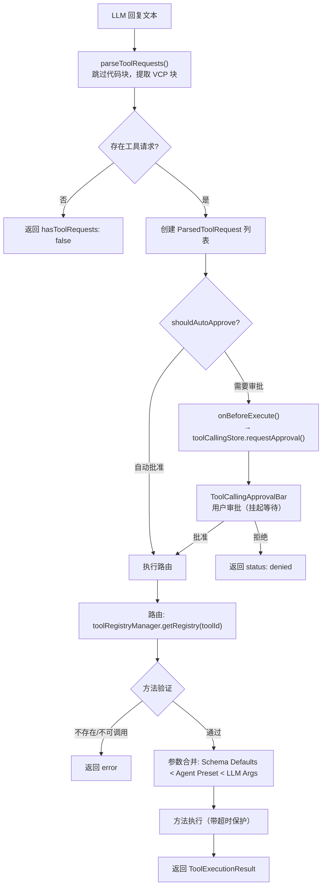
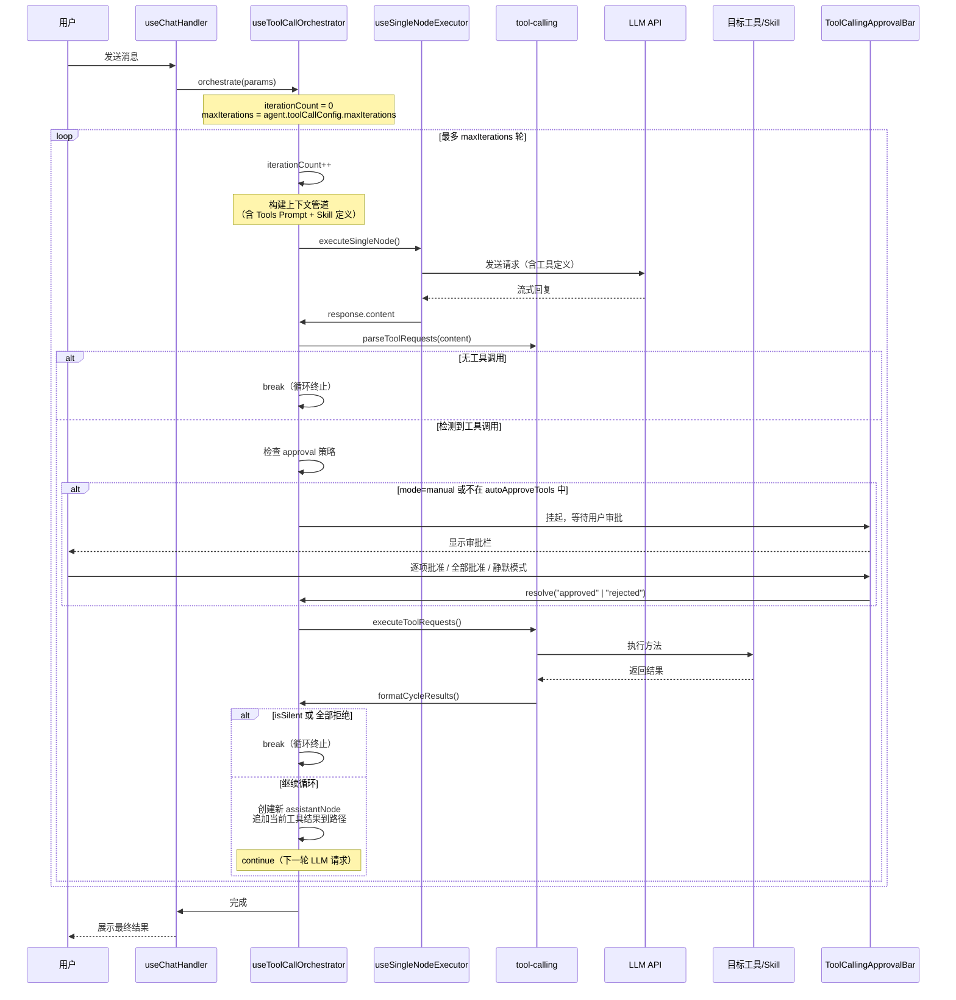

# Agent、工具调用与技能系统：集成架构文档

> **状态**: Active | **最后更新**: 2026-05-10

本文档解释了 AIO Hub 中 **Agent 系统**、**工具调用系统** 和 **技能系统** 是如何串联运作的，包括完整的请求循环体系、用户控制机制以及它们之间的数据流。

---

## 1. 三大系统定位

```
┌───────────────────────────────────────────────────────────────┐
│                    ChatAgent (配置模板)                       │
│  控制一切：工具开关、批准策略、循环参数、Skill 绑定           │
├───────────────────────────────────────────────────────────────┤
│              tool-calling (运行时基础设施)                    │
│  解析 LLM 工具调用请求 → 路由到注册的工具 → 执行并回注结果    │
├───────────────────────────────────────────────────────────────┤
│               skill-manager (能力扩展层)                      │
│  通过 ToolRegistryFactory 桥接为 Tool，动态披露 Skill 能力    │
└───────────────────────────────────────────────────────────────┘
```

### 1.1. ChatAgent — 策略控制中心

[`ChatAgent`](src/tools/llm-chat/types/agent.ts) 是一个配置模板，它携带了控制工具调用行为的全部配置：

```typescript
// ChatAgent.toolCallConfig 的关键字段
interface ToolCallConfig {
  enabled: boolean; // 总开关
  mode: "auto" | "manual"; // 自动批准 vs 每步审批
  maxIterations: number; // 最大循环轮次（防止死循环）
  timeout: number; // 单次执行超时（ms）
  parallelExecution: boolean; // 同轮多请求是否并行执行
  toolToggles: Record<string, boolean>; // 按工具 ID 开关
  autoApproveTools: Record<string, boolean>; // 按工具 ID 自动批准
  defaultToolEnabled: boolean; // 默认启用
  defaultAutoApprove: boolean; // 默认自动批准
  protocol: "vcp"; // 通信协议
}
```

Agent 是**策略定义者**，工具调用系统是**策略执行者**。

### 1.2. tool-calling — 运行时基础设施

`tool-calling` 模块提供三个核心能力：

| 能力         | 入口                                                                          | 说明                                               |
| ------------ | ----------------------------------------------------------------------------- | -------------------------------------------------- |
| **工具发现** | [`createToolDiscoveryService()`](src/tools/tool-calling/core/discovery.ts:64) | 扫描所有 `agentCallable` 方法，生成工具定义 Prompt |
| **请求解析** | [`parseToolRequests()`](src/tools/tool-calling/core/parser.ts:12)             | 从 LLM 输出中提取 VCP 协议块                       |
| **方法执行** | [`executeToolRequests()`](src/tools/tool-calling/core/executor.ts:300)        | 路由到目标工具方法，带超时保护和审批控制           |

### 1.3. skill-manager — 能力扩展层

Skill 系统通过 **`SkillBridgeFactory`** 将自己注册到 `toolRegistryManager`，使得 Skill 能力对 LLM 可见且可调用。

| 组件                                                                              | 角色                                           |
| --------------------------------------------------------------------------------- | ---------------------------------------------- |
| [`SkillBridgeFactory`](src/tools/skill-manager/services/SkillBridgeFactory.ts:19) | 实现 `ToolRegistryFactory`，在应用启动时注册   |
| [`SkillManagerProxy`](src/tools/skill-manager/services/SkillManagerProxy.ts:18)   | 单例 `ToolRegistry`，承载所有 Skill 的调用方法 |
| [`SkillLoader`](src/tools/skill-manager/services/SkillLoader.ts)                  | 前端薄封装，调用 Rust 后端扫描 Skill 清单      |

---

## 2. 统一注册体系：Skill 如何成为 Tool

```
应用启动
  │
  ▼
toolRegistryManager 初始化
  │
  ├── 扫描内部模块 (tools/) → 注册 ToolRegistry 实例
  │   例如: directory-tree, system-pulse, canvas...
  │
  └── 扫描 ToolRegistryFactory 实例
       │
       └── SkillBridgeFactory.createRegistries()
            │
            ├── 检查 config.enabled
            ├── SkillLoader.scanAll() → Rust 扫描 Skill 文件
            │    ├── {appDataDir}/skills/  (用户安装)
            │    └── {AIO内置目录}/skills/ (系统内置)
            │
            └── 返回 [skillManagerProxy] (单例 ToolRegistry)
                 │
                 └── SkillManagerProxy.getMetadata()
                      ├── skill_run_script (通用)
                      ├── skill_read_file (通用)
                      ├── skill_list_dir  (通用)
                      └── activate_<name> × N (每 Skill 一个)
                           ↑ 动态生成，描述承载摘要信息
```

**关键设计**：Skill 不需要单独注册到工具发现系统，它通过 `ToolRegistryFactory` 模式被 `toolRegistryManager` 统一管理。LLM 看到的是一组标准工具方法，完全不知道背后是本地工具还是外部 Skill。

---

## 3. 工具调用闭环

### 3.1. VCP 协议 — LLM 与系统的通信语言

VCP (Variable & Command Protocol) 使用三组 XML 风格标记：

| 标记                                                      | 用途         | 放置位置         |
| --------------------------------------------------------- | ------------ | ---------------- |
| `<<<[TOOL_DEFINITION]>>>` / `<<<[END_TOOL_DEFINITION]>>>` | 工具定义块   | System Prompt    |
| `<<<[TOOL_REQUEST]>>>` / `<<<[END_TOOL_REQUEST]>>>`       | LLM 调用请求 | LLM 回复中       |
| `<<<[TOOL_RESULT]>>>` / `<<<[END_TOOL_RESULT]>>>`         | 执行结果回注 | 追加到对话上下文 |

**参数编码**使用中文书名号，避免与 JSON/XML 冲突：

```
tool_name:「始」directory-tree「末」,
command:「始」listFiles「末」,
path:「始」src/tools「末」
```

### 3.2. 单次工具调用生命周期



### 3.3. 路由规则

LLM 输出 `tool_name: skill:system`, `command: activate_gitnexus` → 执行器内部映射到 `skillManagerProxy.activate_gitnexus()`。

参数合并优先级：

1. Schema 默认值（方法定义的 `defaultValue`）
2. Agent 预设参数（`toolCallConfig.toolSettings[toolId]`）
3. LLM 实时参数（`request.args`）

---

## 4. 完整循环体系

### 4.1. 编排器入口

整个循环由 [`useToolCallOrchestrator.orchestrate()`](src/tools/llm-chat/composables/chat/useToolCallOrchestrator.ts:49) 控制。

### 4.2. 循环流程图



### 4.3. 终止条件

循环在以下任一条件满足时终止：

| 条件         | 触发位置                                                                                               | 说明                                           |
| ------------ | ------------------------------------------------------------------------------------------------------ | ---------------------------------------------- |
| 无工具调用   | [`useToolCallOrchestrator.ts:337`](src/tools/llm-chat/composables/chat/useToolCallOrchestrator.ts:337) | LLM 回复中不含 VCP 请求块                      |
| 静默模式     | [`useToolCallOrchestrator.ts:295`](src/tools/llm-chat/composables/chat/useToolCallOrchestrator.ts:295) | 用户开启"静默执行"，当前轮完成后停止           |
| 全部拒绝     | [`useToolCallOrchestrator.ts:295`](src/tools/llm-chat/composables/chat/useToolCallOrchestrator.ts:295) | 用户拒绝了所有待审批请求                       |
| 达到最大迭代 | [`useToolCallOrchestrator.ts:89`](src/tools/llm-chat/composables/chat/useToolCallOrchestrator.ts:89)   | `iterationCount >= maxIterations`（默认 5 轮） |
| 请求被取消   | `abortController.abort()`                                                                              | 用户主动取消生成                               |

### 4.4. 重新解析模式

系统支持"重新解析"（Reparse）：不发起新的 LLM 请求，直接对已有助手回复内容重新执行 VCP 解析和工具调用。

触发方式：右键助手消息 → "重新解析工具调用"。

代码路径：[`useToolCallOrchestrator.reparseAndOrchestrate()`](src/tools/llm-chat/composables/chat/useToolCallOrchestrator.ts:361)，设置 `isReparse=true` 后在 `orchestrate()` 内跳过第一轮 LLM 请求（第 95-98 行），直接从现有 `assistantNode.content` 进行 VCP 解析。

---

## 5. 用户控制机制

### 5.1. 审批栏 UI

[`ToolCallingApprovalBar`](src/tools/llm-chat/components/message-input/ToolCallingApprovalBar.vue) 在输入框上方动态显示，提供以下控制：

| 控制             | 操作                     | 效果                      |
| ---------------- | ------------------------ | ------------------------- |
| **逐项批准**     | 点击单个请求的"播放"按钮 | 仅批准该请求              |
| **逐项拒绝**     | 点击单个请求的"X"按钮    | 拒绝该请求，返回 `denied` |
| **全部允许**     | 点击"全部允许"按钮       | `approveAll(sessionId)`   |
| **全部拒绝**     | 点击"全部拒绝"按钮       | `rejectAll(sessionId)`    |
| **静默模式切换** | 点击"静默执行"开关       | 当前轮执行完后停止循环    |

### 5.2. 审批挂起机制

[`toolCallingStore.requestApproval()`](src/tools/llm-chat/stores/toolCallingStore.ts:22) 创建了一个 Promise，该 Promise 直到用户点击批准/拒绝按钮后才会 resolve：

```typescript
// 执行器侧 - 发起审批
const approvalResult = await toolCallingStore.requestApproval(
  sessionId,
  request
);
// 这里会挂起，直到 UI 侧调用 approveRequest() 或 rejectRequest()
```

这种 Promise 挂起模式使得审批流完全同步于工具调用循环，无需回调地狱（重构前存在过）。

### 5.3. 自动批准策略

[`shouldAutoApprove()`](src/tools/tool-calling/core/executor.ts:287) 的判断逻辑：

1. 全局 `mode` 是否为 `"auto"`
2. 是 → 检查该工具是否在 `autoApproveTools` 白名单中
3. 是 → 自动批准，跳过 UI 审批栏
4. 否 → 或 mode 为 `"manual"` → 进入审批挂起

多层自动批准优先级：

```
方法级 autoApproveMethods[methodKey]
  > 工具级 autoApproveTools[toolId]
  > 全局 defaultAutoApprove
```

### 5.4. 静默模式

静默模式是一个**单次状态**（per-cycle），由用户在审批栏中切换。其行为：

- **常规循环**（默认）：工具执行完后，继续下一轮 LLM 请求，直到无工具调用或达到 maxIterations
- **静默执行**：当前轮执行完毕后，**立即停止循环**，不再发起下一轮 LLM 请求

静默状态的传递路径：

```
ToolCallingApprovalBar (isSilent ref)
  → 同步到 toolNode.metadata.isSilent
  → useToolCallOrchestrator 检查并 break
```

---

## 6. Skill 的渐进式披露策略

Skill 系统严格遵循 [Agent Skills 规范](https://agentskills.io/llms.txt) 的三层信息披露：

### 6.1. Level 1: Metadata（工具定义层）

LLM 在每次请求的 System Prompt 中看到 `SkillManagerProxy` 注册的所有方法描述。对于 Skill，LLM 看到的是：

```
[工具] skill:system.activate_gitnexus
激活技能 "gitnexus"。
描述: Git-based code intelligence and knowledge graph system...
可用脚本: analyze, status, wiki
可用文件: 5 个
调用此方法将返回该技能的完整指令和资源索引。
```

这就是 **渐进式披露的核心**：`activate_<name>` 方法的 **description** 承载了 Skill 的摘要信息，LLM 通过阅读描述即可判断是否需要该 Skill。

### 6.2. Level 2: Instructions（指令激活层）

当 LLM 决定调用 `skill:system.activate_gitnexus()` 时，[`SkillManagerProxy.buildSkillInstruction()`](src/tools/skill-manager/services/SkillManagerProxy.ts:168) 返回：

```xml
<skill_context id="skill:gitnexus">
## gitnexus
[完整的 SKILL.md 内容]

### 可用文件
- SKILL.md (4.2 KB)
- references/usage.md (8.1 KB)
...

### 可用脚本
- analyze: [bash] 扫描代码库并生成索引
- status: [bash] 检查索引状态
...

### 宿主环境信息
- 操作系统: Windows NT 10.0.xxxxx
- 默认 Shell: PowerShell
- 命令链接: 使用 `;` 串联命令
...
</skill_context>
```

此时 LLM 获得了该 Skill 的**完整操作指令**，包括可用资源列表和宿主环境信息。

### 6.3. Level 3: Resources（资源按需加载层）

LLM 可以继续调用通用工具来获取具体文件内容：

```
// 示例结构，非具体格式
skill:system.skill_read_file(skill_id="gitnexus", path="references/usage.md")
skill:system.skill_list_dir(skill_id="gitnexus", sub_dir="references")
skill:system.skill_run_script(skill_id="gitnexus", script_name="analyze", args="")
```

这三层设计对 **LLM 前缀缓存（Prefix Caching）** 极其友好，因为完整的 SKILL.md 内容不会出现在每轮 System Prompt 中，只有在真正需要时才作为工具执行结果注入对话流。

### 6.4. 脚本安全执行

所有脚本调用由 Rust 侧统一处理：

1. **路径校验**：确认脚本在 `scripts/` 下，拒绝 `../` 穿越
2. **运行时探测**：`bun → node → python` 优先级
3. **进程隔离**：`current_dir` 锁定在 Skill 根目录
4. **超时控制**：默认 60 秒

---

## 7. 完整数据流全景

### 7.1. 启动时：注册与发现

```mermaid
graph TD
    subgraph 启动阶段
        A[应用启动] --> B[toolRegistryManager 初始化]
        B --> C1[扫描 tools/ 下的 ToolRegistry]
        B --> C2[扫描 ToolRegistryFactory]
        C2 --> D[SkillBridgeFactory.createRegistries()]
        D --> E[SkillLoader.scanAll()]
        E --> F["Rust: 扫描 skills/ 目录"]
        F --> G[返回 SkillManifest 列表]
        G --> H[注册 SkillManagerProxy]
    end

    subgraph 每次请求阶段
        I[用户发送消息] --> J[useChatExecutor.executeRequest()]
        J --> K[useToolCallOrchestrator.orchestrate()]
        K --> L[构建上下文管道]
        L --> M1[tool-calling: generateToolsPrompt()]
        M1 --> N[注入工具定义到 System Prompt]
        L --> M2[skill-manager: SkillManagerProxy方法描述]
        M2 --> N
    end
```

### 7.2. 运行时：请求 → 工具调用 → 回复

```
用户消息
  │
  ▼
┌────────────────────────────────────────────┐
│  useToolCallOrchestrator.orchestrate()     │
│                                            │
│  while (iterationCount < maxIterations)    │
│  ┌──────────────────────────────────────┐  │
│  │ 1. 构建上下文管道                    │  │
│  │    - Session Loader                  │  │
│  │    - Injection Assembler             │  │
│  │    - Knowledge Processor             │  │
│  │    - Worldbook Processor             │  │
│  │    - Token Limiter                   │  │
│  │    - Message Formatter               │  │
│  │    - Asset Resolver                  │  │
│  │                                      │  │
│  │ 2. LLM API 请求 → 接收回复           │  │
│  │                                      │  │
│  │ 3. VCP 解析 (parseToolRequests)      │  │
│  │    └── 提取 <<<[TOOL_REQUEST]>>> 块  │  │
│  │                                      │  │
│  │ 4. 审批挂起                          │  │
│  │    ├── Auto → 跳过                   │  │
│  │    └── Manual → ApprovalBar → 等待   │  │
│  │                                      │  │
│  │ 5. 执行 (executeToolRequests)        │  │
│  │    ├── toolRegistryManager 路由      │  │
│  │    ├── 本地工具 → 直接调用方法       │  │
│  │    └── Skill → SkillManagerProxy     │  │
│  │        └── Rust 后端安全执行         │  │
│  │                                      │  │
│  │ 6. 结果回注 (formatCycleResults)     │  │
│  │    └── <<<[TOOL_RESULT]>>> 格式      │  │
│  │                                      │  │
│  │ 7. 检查终止条件 → break/continue     │  │
│  └──────────────────────────────────────┘  │
└────────────────────────────────────────────┘
  │
  ▼
最终回复展示给用户
```

### 7.3. 核心文件索引

| 层级       | 文件                                                                                                                                               | 职责                         |
| ---------- | -------------------------------------------------------------------------------------------------------------------------------------------------- | ---------------------------- |
| Agent 配置 | [`src/tools/llm-chat/types/agent.ts`](src/tools/llm-chat/types/agent.ts)                                                                           | ToolCallConfig 类型定义      |
| 编排器     | [`src/tools/llm-chat/composables/chat/useToolCallOrchestrator.ts`](src/tools/llm-chat/composables/chat/useToolCallOrchestrator.ts)                 | 核心循环逻辑                 |
| 执行器     | [`src/tools/llm-chat/composables/chat/useChatExecutor.ts`](src/tools/llm-chat/composables/chat/useChatExecutor.ts)                                 | 请求执行入口                 |
| 工具调用   | [`src/tools/tool-calling/composables/useToolCalling.ts`](src/tools/tool-calling/composables/useToolCalling.ts)                                     | 统一门面                     |
| 工具发现   | [`src/tools/tool-calling/core/discovery.ts`](src/tools/tool-calling/core/discovery.ts)                                                             | Prompt 生成 + 缓存           |
| 工具执行   | [`src/tools/tool-calling/core/executor.ts`](src/tools/tool-calling/core/executor.ts)                                                               | 执行路由 + 审批 + 超时       |
| VCP 协议   | [`src/tools/tool-calling/core/protocols/vcp-protocol.ts`](src/tools/tool-calling/core/protocols/vcp-protocol.ts)                                   | 请求/结果格式化              |
| 审批 UI    | [`src/tools/llm-chat/components/message-input/ToolCallingApprovalBar.vue`](src/tools/llm-chat/components/message-input/ToolCallingApprovalBar.vue) | 用户审批界面                 |
| 审批状态   | [`src/tools/llm-chat/stores/toolCallingStore.ts`](src/tools/llm-chat/stores/toolCallingStore.ts)                                                   | Promise 挂起 + 审批管理      |
| Skill 工厂 | [`src/tools/skill-manager/services/SkillBridgeFactory.ts`](src/tools/skill-manager/services/SkillBridgeFactory.ts)                                 | 注册为 ToolRegistryFactory   |
| Skill 代理 | [`src/tools/skill-manager/services/SkillManagerProxy.ts`](src/tools/skill-manager/services/SkillManagerProxy.ts)                                   | 承载所有 Skill 方法          |
| Skill 加载 | [`src/tools/skill-manager/services/SkillLoader.ts`](src/tools/skill-manager/services/SkillLoader.ts)                                               | 调用 Rust 扫描 Skill         |
| 工具注册   | [`src/services/registry.ts`](src/services/registry.ts)                                                                                             | toolRegistryManager 统一管理 |

---

## 8. 总结

Agent、Tool Calling 和 Skill 系统形成了一个层次分明、职责清晰的能力扩展体系：

1. **Agent** 是「策略层」，通过 `ToolCallConfig` 定义**什么可以用、怎么用**
2. **Tool Calling** 是「执行层」，提供**解析 → 路由 → 执行 → 回注**的标准化闭环
3. **Skill** 是「扩展层」，通过 `ToolRegistryFactory` 桥接为**对 LLM 透明的工具能力**

三者通过 `toolRegistryManager` 统一注册、通过 VCP 协议统一通信、通过 `useToolCallOrchestrator` 统一编排。用户在整个过程中拥有**逐项审批、批量批准、静默执行**等精细控制能力，而 Skill 的渐进式披露策略确保了 LLM 上下文的高效利用。
