# LLM Chat 工具 UI 结构图

本文档详细展示 LLM Chat 工具的完整UI结构，包括内部组件和外部依赖关系。

> **注意**: LLM Chat 是整个应用中最复杂的工具模块，包含 90+ 个组件文件，大量使用了独立的 `rich-text-renderer` 模块和通用组件库。

---

## 0. 完整组件关系总览

```mermaid
flowchart TB
    subgraph LlmChatVue["🏠 LlmChat.vue (主入口)"]
        direction TB

        subgraph LeftArea["📋 左侧区域"]
            LeftSidebar["LeftSidebar"]
            AgentsSidebar["AgentsSidebar<br/>智能体列表"]
            ParametersSidebar["ParametersSidebar<br/>参数配置"]
        end

        subgraph CenterArea["💬 中央对话区 ChatArea.vue"]
            ComponentHeader["ComponentHeader<br/>可拖拽标题栏"]

            subgraph MessageView["消息视图"]
                MessageList["MessageList"]
                FlowTreeGraph["FlowTreeGraph<br/>对话树图"]
                ChatSearchPanel["ChatSearchPanel<br/>搜索面板"]
            end

            subgraph MessageComponents["消息组件"]
                ChatMessage["ChatMessage"]
                CompressionMessage["CompressionMessage<br/>压缩节点"]
                MessageHeader["MessageHeader"]
                MessageContent["MessageContent"]
                MessageMenubar["MessageMenubar"]
                BranchSelector["BranchSelector"]
                MessageDataEditor["MessageDataEditor<br/>数据编辑器"]
            end

            subgraph InputArea["输入区域"]
                MessageInput["MessageInput"]
                MessageInputToolbar["MessageInputToolbar"]
                MiniSessionList["MiniSessionList"]
                QuickActionSelector["QuickActionSelector"]
            end

            MessageNavigator["MessageNavigator<br/>消息导航"]
        end

        subgraph RightArea["📁 右侧区域"]
            SessionsSidebar["SessionsSidebar<br/>会话列表"]
        end
    end

    subgraph Dialogs["🔲 对话框层"]
        subgraph AgentDialogs["智能体相关"]
            CreateAgentDialog["CreateAgentDialog"]
            EditAgentDialog["EditAgentDialog"]
            ImportAgentDialog["ImportAgentDialog"]
            STPresetImportDialog["STPresetImportDialog"]
            AgentAssetsDialog["AgentAssetsDialog"]
        end

        subgraph SettingsDialogs["设置相关"]
            ChatSettingsDialog["ChatSettingsDialog"]
            EditUserProfileDialog["EditUserProfileDialog"]
            ChatRegexHelpDialog["ChatRegexHelpDialog"]
        end

        subgraph FeatureDialogs["功能管理"]
            WorldbookManagerDialog["WorldbookManagerDialog"]
            QuickActionManagerDialog["QuickActionManagerDialog"]
        end

        subgraph ExportDialogs["导入导出"]
            ExportSessionDialog["ExportSessionDialog"]
            ExportBranchDialog["ExportBranchDialog"]
            ExportAgentDialog["ExportAgentDialog"]
        end

        ContextAnalyzerDialog["ContextAnalyzerDialog<br/>上下文分析"]
    end

    subgraph TreeGraphComponents["🌲 对话树图组件"]
        GraphNode["GraphNode"]
        GraphNodeContent["GraphNodeContent"]
        GraphNodeMenubar["GraphNodeMenubar"]
        GraphNodeDetailPopup["GraphNodeDetailPopup"]
        HistoryPanel["HistoryPanel"]
    end

    subgraph AgentEditorComponents["🤖 智能体编辑器"]
        AgentEditor["AgentEditor<br/>(分段式编辑器)"]

        subgraph AgentSections["编辑器分段 (sections/)"]
            BasicInfoSection["BasicInfoSection"]
            PersonalitySection["PersonalitySection"]
            CapabilitiesSection["CapabilitiesSection"]
            OutputDisplaySection["OutputDisplaySection"]
        end

        subgraph AgentSubEditors["子编辑器"]
            AgentPresetEditor["AgentPresetEditor"]
            ModelParametersEditor["ModelParametersEditor"]
            WorldbookSelector["WorldbookSelector"]
            QuickActionSelector2["QuickActionSelector"]
            AgentAssetsManager2["AgentAssetsManager"]
        end

        subgraph ParamPanels["参数面板 (parameters/)"]
            ContextCompressionConfigPanel["ContextCompressionConfigPanel"]
            SafetySettingsPanel["SafetySettingsPanel"]
            PostProcessingPanel["PostProcessingPanel"]
            CustomParamsPanel["CustomParamsPanel"]
            ContextStatsCard["ContextStatsCard"]
        end
    end

    subgraph WorldbookComponents["📖 世界书系统"]
        WorldbookManager["WorldbookManager"]
        WorldbookOverview["WorldbookOverview"]
        WorldbookDetail["WorldbookDetail"]
        WorldbookSelector2["WorldbookSelector"]
    end

    subgraph QuickActionComponents["⚡ 快捷动作系统"]
        QuickActionSelector["QuickActionSelector"]
        QuickActionManagerDialog["QuickActionManagerDialog"]
        QuickActionFullManager["QuickActionFullManager"]
    end

    subgraph ContextAnalyzerViews["🔍 上下文分析视图"]
        StructuredView["StructuredView"]
        RawRequestView["RawRequestView"]
        MacroDebugView["MacroDebugView"]
        AnalysisChartView["AnalysisChartView"]
    end

    subgraph ExternalDeps["📦 外部依赖"]
        subgraph RichTextRenderer["🎨 rich-text-renderer"]
            RichTextRendererVue["RichTextRenderer.vue"]
            LlmThinkNode["LlmThinkNode"]
            CodeBlockNode["CodeBlockNode"]
            MermaidNode["MermaidNode"]
            KatexNode["KatexNode"]
            LlmThinkRulesEditor["LlmThinkRulesEditor"]
            MarkdownStyleEditor["MarkdownStyleEditor"]
        end

        subgraph CommonComponents["🧩 通用组件库"]
            Avatar["Avatar"]
            AvatarSelector["AvatarSelector"]
            BaseDialog["BaseDialog"]
            DynamicIcon["DynamicIcon"]
            DocumentViewer["DocumentViewer"]
            LlmModelSelector["LlmModelSelector"]
            RichCodeEditor["RichCodeEditor"]
            InfoCard["InfoCard"]
            FileIcon["FileIcon"]
            ChatRegexEditor["ChatRegexEditor"]
        end
    end

    %% 主要连接关系
    LeftSidebar --> AgentsSidebar
    LeftSidebar --> ParametersSidebar

    MessageList --> ChatMessage
    MessageList --> CompressionMessage
    ChatMessage --> MessageHeader
    ChatMessage --> MessageContent
    ChatMessage --> MessageMenubar
    ChatMessage --> BranchSelector
    MessageMenubar --> MessageDataEditor

    MessageInput --> MessageInputToolbar
    MessageInput --> MiniSessionList

    FlowTreeGraph --> GraphNode
    GraphNode --> GraphNodeContent
    GraphNode --> GraphNodeMenubar

    ChatArea --> EditAgentDialog
    ChatArea --> EditUserProfileDialog
    ChatArea --> ChatSettingsDialog

    EditAgentDialog --> AgentEditor
    AgentEditor --> AgentSections
    AgentEditor --> AgentSubEditors
    AgentEditor --> AgentAssetsDialog
    AgentEditor --> WorldbookManagerDialog
    AgentEditor --> EditUserProfileDialog

    AgentSubEditors --> AgentPresetEditor
    AgentSubEditors --> ModelParametersEditor
    AgentSubEditors --> AgentAssetsManager2
    AgentPresetEditor --> PresetMessageEditor
    AgentPresetEditor --> MacroSelector

    ModelParametersEditor --> ParamPanels
    ParamPanels --> ContextCompressionConfigPanel
    ParamPanels --> SafetySettingsPanel
    ParamPanels --> PostProcessingPanel
    ParamPanels --> CustomParamsPanel
    ParamPanels --> ContextStatsCard

    MessageInput --> QuickActionSelector
    QuickActionSelector --> QuickActionManagerDialog

    ContextAnalyzerDialog --> StructuredView
    ContextAnalyzerDialog --> RawRequestView
    ContextAnalyzerDialog --> MacroDebugView
    ContextAnalyzerDialog --> AnalysisChartView

    ChatSettingsDialog --> SettingItemRenderer

    %% 外部依赖连接
    MessageContent -.->|渲染| RichTextRendererVue
    MessageContent -.->|思考块| LlmThinkNode
    EditAgentDialog -.->|样式编辑| MarkdownStyleEditor
    EditAgentDialog -.->|思考规则| LlmThinkRulesEditor
    ChatSettingsDialog -.->|正则编辑| ChatRegexEditor

    MessageHeader -.-> Avatar
    ChatMessage -.-> DynamicIcon
    Dialogs -.-> BaseDialog
    ParametersSidebar -.-> LlmModelSelector
    MessageContent -.-> DocumentViewer
```

### 图例说明

| 符号     | 含义              |
| -------- | ----------------- |
| `──>`    | 组件包含/父子关系 |
| `-.->`   | 外部依赖引用      |
| 📋 📁 💬 | 布局区域标识      |
| 🔲       | 对话框/弹出层     |
| 📦       | 外部模块依赖      |

### 核心数据流

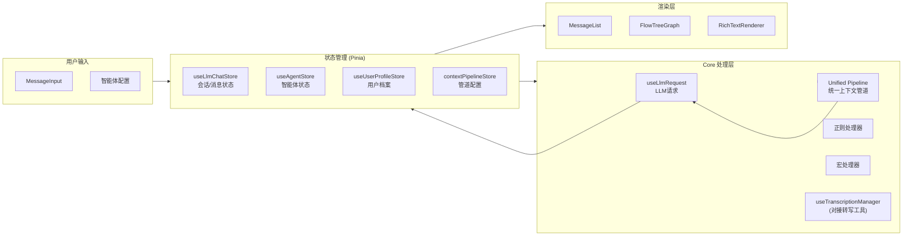

---

## 1. 整体布局结构

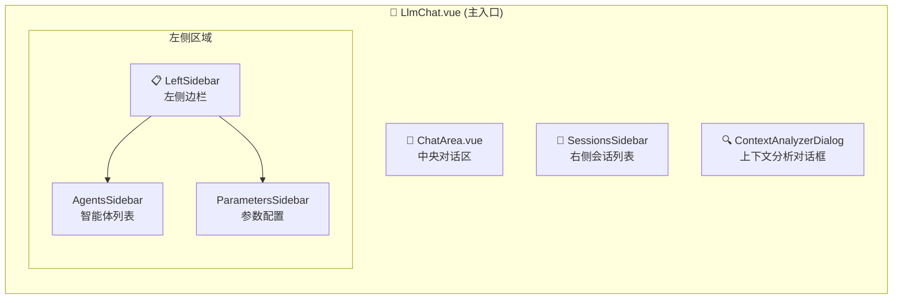

---

## 2. ChatArea 核心组件树

ChatArea 是对话的核心区域，包含消息展示、输入和多个对话框：

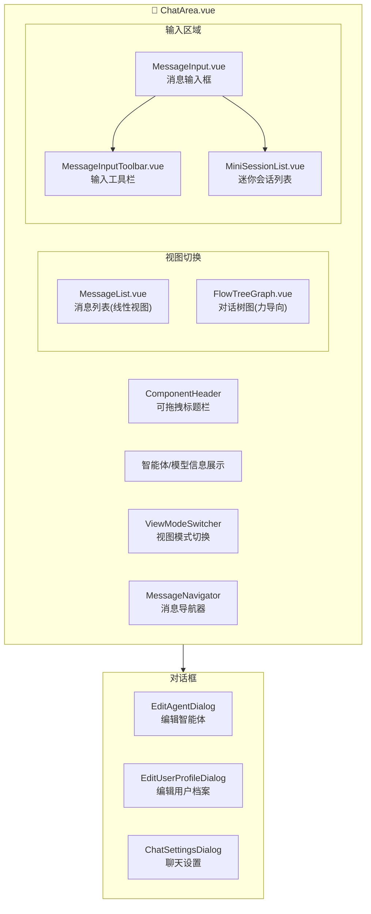

---

## 3. 消息组件层次 (message/)

消息组件负责渲染每条对话消息：

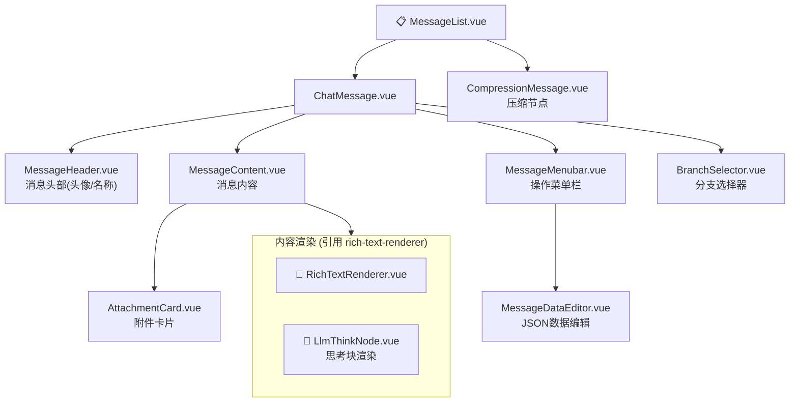

---

## 4. 智能体管理组件 (agent/)

智能体管理已重构为高度模块化的分段式编辑器：

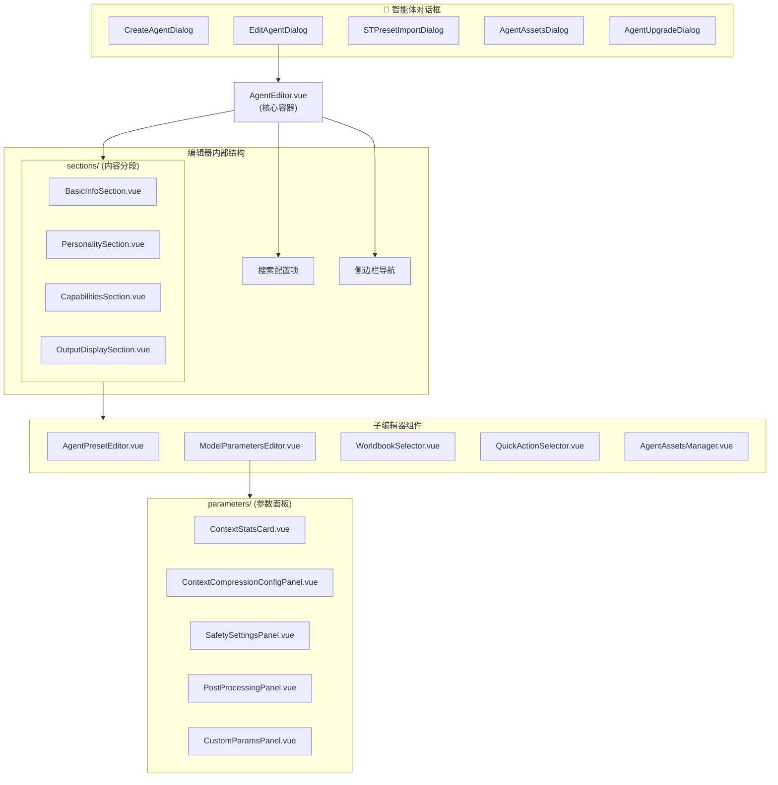

---

## 5. 对话树图组件 (conversation-tree-graph/)

力导向布局的对话树可视化：

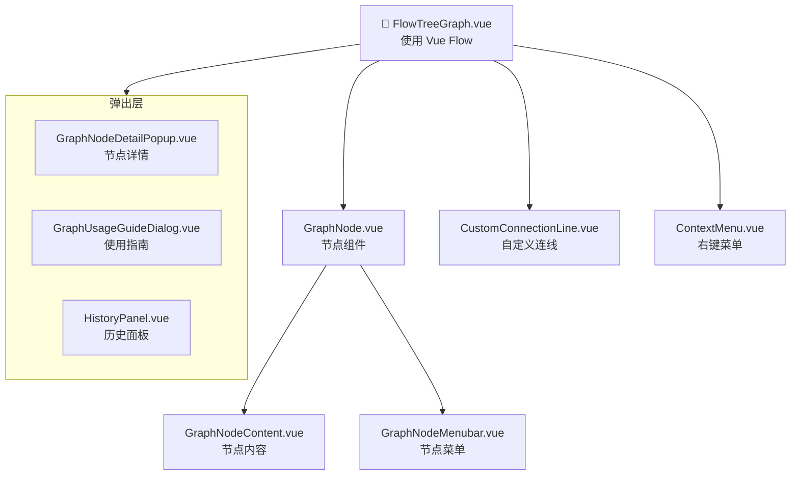

---

## 6. 上下文分析器 (context-analyzer/)

分析和调试对话上下文：

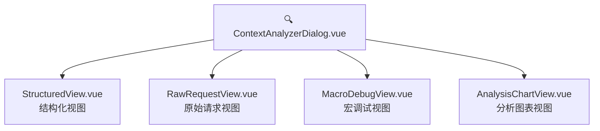

---

## 7. 导入导出组件 (export/)

会话和智能体的导入导出：

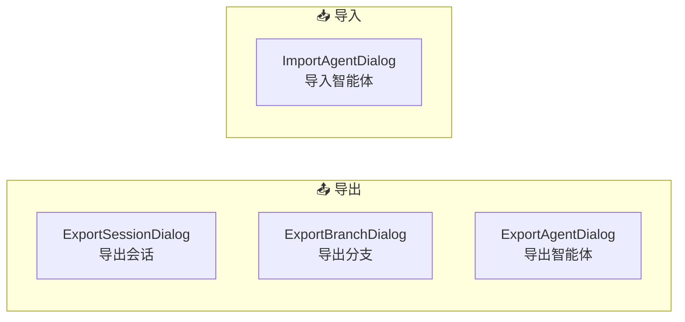

---

## 8. 设置组件 (settings/)

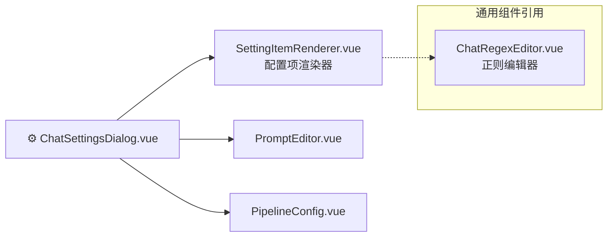

---

## 9. 外部依赖：富文本渲染器 (rich-text-renderer/)

LLM Chat 大量依赖独立的富文本渲染模块：

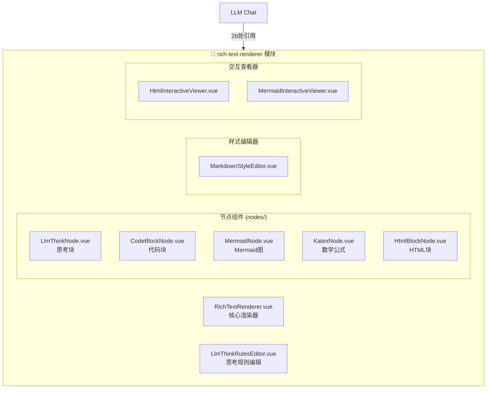

---

## 10. 外部依赖：通用组件库 (components/common/)

LLM Chat 使用的通用组件：

```mermaid
flowchart LR
    subgraph CommonComponents["🧩 通用组件"]
        Avatar["Avatar.vue"]
        AvatarSelector["AvatarSelector.vue"]
        BaseDialog["BaseDialog.vue"]
        DynamicIcon["DynamicIcon.vue"]
        DocumentViewer["DocumentViewer.vue"]
        FileIcon["FileIcon.vue"]
        InfoCard["InfoCard.vue"]
        LlmModelSelector["LlmModelSelector.vue"]
        RichCodeEditor["RichCodeEditor.vue"]
        ModelSelectDialog["ModelSelectDialog.vue"]
        TranscriptionDialog["TranscriptionDialog.vue"]
        VideoPlayer["VideoPlayer.vue"]
        ImageViewer["ImageViewer.vue"]
    end
```

---

## 11. Composables 层 (composables/)

LLM Chat 使用的组合式函数：

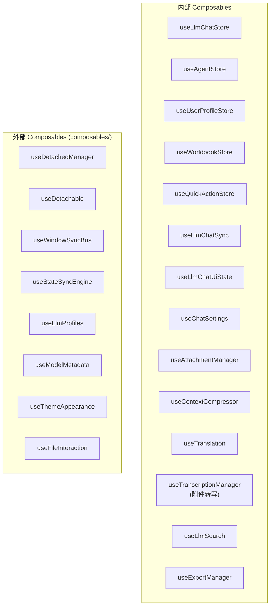

---

## 12. 完整组件文件清单

### llm-chat/components/ 目录结构

```
components/
├── ChatArea.vue # 核心对话区域
├── AttachmentCard.vue # 附件卡片
│
├── agent/ # 智能体管理
│ ├── AgentAssetsDialog.vue
│ ├── AgentAssetsManager.vue # 资产管理器 (新增)
│ ├── AgentPresetBatchDialog.vue
│ ├── AgentPresetEditor.vue
│ ├── AgentUpgradeDialog.vue # 升级对话框 (新增)
│ ├── CreateAgentDialog.vue
│ ├── EditAgentDialog.vue
│ ├── MacroSelector.vue
│ ├── MiniAgentList.vue
│ ├── ModelParametersEditor.vue
│ ├── ParameterItem.vue
│ ├── PresetMessageEditor.vue
│ ├── STPresetImportDialog.vue
│ ├── agent-editor/ # 分段式编辑器 (重构)
│ │ ├── AgentEditor.vue
│ │ ├── agentEditConfig.ts
│ │ └── sections/
│ │ ├── BasicInfoSection.vue
│ │ ├── CapabilitiesSection.vue
│ │ ├── OutputDisplaySection.vue
│ │ └── PersonalitySection.vue
│ └── parameters/ # 参数子面板
│ ├── ContextCompressionConfigPanel.vue
│ ├── ContextStatsCard.vue
│ ├── CustomParamsPanel.vue
│ ├── PostProcessingPanel.vue
│ └── SafetySettingsPanel.vue
│
├── common/ # 模块内通用
│ ├── ChatRegexEditor.vue
│ ├── ChatRegexHelpDialog.vue
│ ├── ChatRegexRuleForm.vue
│ └── ConfigSection.vue
│
├── context-analyzer/ # 上下文分析
│ ├── AnalysisChartView.vue
│ ├── ContextAnalyzerDialog.vue
│ ├── MacroDebugView.vue
│ ├── RawRequestView.vue
│ └── StructuredView.vue
│
├── conversation-tree-graph/ # 对话树图
│ ├── ContextMenu.vue
│ └── flow/
│ ├── FlowTreeGraph.vue
│ └── components/
│ ├── CustomConnectionLine.vue
│ ├── GraphNode.vue
│ ├── GraphNodeContent.vue
│ ├── GraphNodeDetailPopup.vue
│ ├── GraphNodeMenubar.vue
│ ├── GraphUsageGuideDialog.vue
│ └── HistoryPanel.vue
│
├── export/ # 导入导出
│ ├── ExportAgentDialog.vue
│ ├── ExportBranchDialog.vue
│ ├── ExportOptionsPanel.vue
│ ├── ExportPreviewSection.vue
│ ├── ExportSessionDialog.vue
│ └── ImportAgentDialog.vue
│
├── message/ # 消息组件
│ ├── BranchSelector.vue
│ ├── ChatMessage.vue
│ ├── CompressionMessage.vue # 压缩节点
│ ├── MessageContent.vue
│ ├── MessageDataEditor.vue # 数据编辑器
│ ├── MessageHeader.vue
│ ├── MessageList.vue
│ ├── MessageMenubar.vue
│ ├── MessageNavigator.vue
│ └── ViewModeSwitcher.vue
│
├── message-input/ # 消息输入
│ ├── ChatCodeMirrorEditor.vue # CodeMirror 编辑器 (新增)
│ ├── MessageInput.vue
│ ├── MessageInputAttachments.vue # 附件管理 (新增)
│ ├── MessageInputToolbar.vue # 工具栏
│ └── MiniSessionList.vue # 迷你列表
│
├── quick-action/ # 快捷动作系统 (新增)
│ ├── QuickActionDetail.vue
│ ├── QuickActionFullManager.vue
│ ├── QuickActionManagerDialog.vue
│ └── QuickActionSelector.vue
│
├── search/ # 聊天搜索 (新增)
│ └── ChatSearchPanel.vue
│
├── settings/ # 设置
│ ├── ChatSettingsDialog.vue
│ ├── PipelineConfig.vue # 管道配置
│ ├── settings-types.ts
│ └── settingsConfig.ts
│
├── sidebar/ # 侧边栏
│ ├── AgentListItem.vue
│ ├── AgentsSidebar.vue
│ ├── LeftSidebar.vue
│ ├── ParametersSidebar.vue
│ └── SessionsSidebar.vue
│
├── user-profile/ # 用户档案
│ └── EditUserProfileDialog.vue
│
└── worldbook/ # 世界书系统 (新增)
├── WorldbookDetail.vue
├── WorldbookFullManager.vue
├── WorldbookManager.vue
├── WorldbookManagerDialog.vue
├── WorldbookOverview.vue
└── WorldbookSelector.vue

```

### llm-chat/composables/ 目录结构

```

composables/
├── chat/
│ ├── useChatExecutor.ts
│ ├── useChatHandler.ts
│ ├── useChatResponseHandler.ts
│ ├── useLlmChatSync.ts
│ ├── useLlmSearch.ts # 聊天搜索逻辑
│ ├── useTopicNamer.ts
│ └── useTranslation.ts
├── features/
│ ├── useAttachmentManager.ts # 附件管理逻辑
│ ├── useChatContextStats.ts
│ ├── useContextCompressor.ts
│ ├── useExportManager.ts # 导入导出逻辑
│ └── useTranscriptionManager.ts
├── input/
│ ├── useChatInputManager.ts
│ ├── useChatInputTokenPreview.ts
│ ├── useMessageInputActions.ts
│ └── useMessageInputResize.ts
├── session/
│ ├── useBranchManager.ts
│ ├── useNodeManager.ts
│ ├── useSessionManager.ts
│ └── useSessionNodeHistory.ts
├── settings/
│ ├── useChatSettings.ts
│ └── usePluginSettings.ts
├── storage/
│ ├── useAgentStorageSeparated.ts
│ ├── useChatStorageSeparated.ts
│ ├── useQuickActionStorage.ts
│ ├── useUserProfileStorage.ts
│ └── useWorldbookStorageSeparated.ts
├── ui/
│ ├── useAnchorRegistry.ts
│ ├── useDetachedChatArea.ts
│ ├── useDetachedChatInput.ts
│ ├── useLlmChatStateConsumer.ts
│ ├── useLlmChatUiState.ts
│ └── useResolvedAvatar.ts
└── visualization/
├── useContextChart.ts
├── useFlowTreeGraph.ts
└── useGraphActions.ts

```

**总计: 90+ 个组件文件, 30+ 个 Composables**
