# LLM Chat 工具 UI 结构图

本文档详细展示 LLM Chat 工具的完整UI结构，包括内部组件和外部依赖关系。

> **注意**: LLM Chat 是整个应用中最复杂的工具模块，包含 60+ 个组件文件，大量使用了独立的 `rich-text-renderer` 模块和通用组件库。

---

## 0. 完整组件关系总览

```mermaid
flowchart TB
    subgraph LlmChatVue["🏠 LlmChat.vue (主入口)"]
        direction TB

        subgraph LeftArea["📋 左侧区域"]
            LeftSidebar["LeftSidebar"]
            AgentsSidebar["AgentsSidebar<br/>智能体列表"]
            ParametersSidebar["ParametersSidebar<br/>参数配置"]
        end

        subgraph CenterArea["💬 中央对话区 ChatArea.vue"]
            ComponentHeader["ComponentHeader<br/>可拖拽标题栏"]

            subgraph MessageView["消息视图"]
                MessageList["MessageList"]
                FlowTreeGraph["FlowTreeGraph<br/>对话树图"]
            end

            subgraph MessageComponents["消息组件"]
                ChatMessage["ChatMessage"]
                CompressionMessage["CompressionMessage<br/>压缩节点"]
                MessageHeader["MessageHeader"]
                MessageContent["MessageContent"]
                MessageMenubar["MessageMenubar"]
                BranchSelector["BranchSelector"]
                MessageDataEditor["MessageDataEditor<br/>数据编辑器"]
            end

            subgraph InputArea["输入区域"]
                MessageInput["MessageInput"]
                MessageInputToolbar["MessageInputToolbar"]
                MiniSessionList["MiniSessionList"]
            end

            MessageNavigator["MessageNavigator<br/>消息导航"]
        end

        subgraph RightArea["📁 右侧区域"]
            SessionsSidebar["SessionsSidebar<br/>会话列表"]
        end
    end

    subgraph Dialogs["🔲 对话框层"]
        subgraph AgentDialogs["智能体相关"]
            CreateAgentDialog["CreateAgentDialog"]
            EditAgentDialog["EditAgentDialog"]
            ImportAgentDialog["ImportAgentDialog"]
            STPresetImportDialog["STPresetImportDialog"]
        end

        subgraph SettingsDialogs["设置相关"]
            ChatSettingsDialog["ChatSettingsDialog"]
            EditUserProfileDialog["EditUserProfileDialog"]
            ChatRegexHelpDialog["ChatRegexHelpDialog"]
        end

        subgraph ExportDialogs["导入导出"]
            ExportSessionDialog["ExportSessionDialog"]
            ExportBranchDialog["ExportBranchDialog"]
            ExportAgentDialog["ExportAgentDialog"]
        end

        ContextAnalyzerDialog["ContextAnalyzerDialog<br/>上下文分析"]
    end

    subgraph TreeGraphComponents["🌲 对话树图组件"]
        GraphNode["GraphNode"]
        GraphNodeContent["GraphNodeContent"]
        GraphNodeMenubar["GraphNodeMenubar"]
        GraphNodeDetailPopup["GraphNodeDetailPopup"]
        HistoryPanel["HistoryPanel"]
    end

    subgraph AgentEditorComponents["🤖 智能体编辑器"]
        AgentPresetEditor["AgentPresetEditor"]
        PresetMessageEditor["PresetMessageEditor"]
        ModelParametersEditor["ModelParametersEditor"]
        MacroSelector["MacroSelector"]

        subgraph ParamPanels["参数面板"]
            ContextCompressionConfigPanel["ContextCompressionConfigPanel"]
            SafetySettingsPanel["SafetySettingsPanel"]
            PostProcessingPanel["PostProcessingPanel"]
            CustomParamsPanel["CustomParamsPanel"]
            ContextStatsCard["ContextStatsCard"]
        end
    end

    subgraph ContextAnalyzerViews["🔍 上下文分析视图"]
        StructuredView["StructuredView"]
        RawRequestView["RawRequestView"]
        MacroDebugView["MacroDebugView"]
        AnalysisChartView["AnalysisChartView"]
    end

    subgraph ExternalDeps["📦 外部依赖"]
        subgraph RichTextRenderer["🎨 rich-text-renderer"]
            RichTextRendererVue["RichTextRenderer.vue"]
            LlmThinkNode["LlmThinkNode"]
            CodeBlockNode["CodeBlockNode"]
            MermaidNode["MermaidNode"]
            KatexNode["KatexNode"]
            LlmThinkRulesEditor["LlmThinkRulesEditor"]
            MarkdownStyleEditor["MarkdownStyleEditor"]
        end

        subgraph CommonComponents["🧩 通用组件库"]
            Avatar["Avatar"]
            AvatarSelector["AvatarSelector"]
            BaseDialog["BaseDialog"]
            DynamicIcon["DynamicIcon"]
            DocumentViewer["DocumentViewer"]
            LlmModelSelector["LlmModelSelector"]
            RichCodeEditor["RichCodeEditor"]
            InfoCard["InfoCard"]
            FileIcon["FileIcon"]
            ChatRegexEditor["ChatRegexEditor"]
        end
    end

    %% 主要连接关系
    LeftSidebar --> AgentsSidebar
    LeftSidebar --> ParametersSidebar

    MessageList --> ChatMessage
    MessageList --> CompressionMessage
    ChatMessage --> MessageHeader
    ChatMessage --> MessageContent
    ChatMessage --> MessageMenubar
    ChatMessage --> BranchSelector
    MessageMenubar --> MessageDataEditor

    MessageInput --> MessageInputToolbar
    MessageInput --> MiniSessionList

    FlowTreeGraph --> GraphNode
    GraphNode --> GraphNodeContent
    GraphNode --> GraphNodeMenubar

    ChatArea --> EditAgentDialog
    ChatArea --> EditUserProfileDialog
    ChatArea --> ChatSettingsDialog

    EditAgentDialog --> AgentPresetEditor
    EditAgentDialog --> ModelParametersEditor
    EditAgentDialog --> MacroSelector
    EditAgentDialog --> EditUserProfileDialog
    AgentPresetEditor --> PresetMessageEditor
    AgentPresetEditor --> MacroSelector

    ModelParametersEditor --> ContextCompressionConfigPanel
    ModelParametersEditor --> SafetySettingsPanel
    ModelParametersEditor --> PostProcessingPanel
    ModelParametersEditor --> CustomParamsPanel
    ModelParametersEditor --> ContextStatsCard

    ContextAnalyzerDialog --> StructuredView
    ContextAnalyzerDialog --> RawRequestView
    ContextAnalyzerDialog --> MacroDebugView
    ContextAnalyzerDialog --> AnalysisChartView

    ChatSettingsDialog --> SettingItemRenderer

    %% 外部依赖连接
    MessageContent -.->|渲染| RichTextRendererVue
    MessageContent -.->|思考块| LlmThinkNode
    EditAgentDialog -.->|样式编辑| MarkdownStyleEditor
    EditAgentDialog -.->|思考规则| LlmThinkRulesEditor
    ChatSettingsDialog -.->|正则编辑| ChatRegexEditor

    MessageHeader -.-> Avatar
    ChatMessage -.-> DynamicIcon
    Dialogs -.-> BaseDialog
    ParametersSidebar -.-> LlmModelSelector
    MessageContent -.-> DocumentViewer
```

### 图例说明

| 符号     | 含义              |
| -------- | ----------------- |
| `──>`    | 组件包含/父子关系 |
| `-.->`   | 外部依赖引用      |
| 📋 📁 💬 | 布局区域标识      |
| 🔲       | 对话框/弹出层     |
| 📦       | 外部模块依赖      |

### 核心数据流

```mermaid
flowchart LR
    subgraph UserInput["用户输入"]
        MessageInput2["MessageInput"]
        AgentConfig["智能体配置"]
    end

    subgraph StateManagement["状态管理 (Pinia)"]
        LlmChatStore["useLlmChatStore<br/>会话/消息状态"]
        AgentStore["useAgentStore<br/>智能体状态"]
        UserProfileStore["useUserProfileStore<br/>用户档案"]
        ContextPipelineStore["contextPipelineStore<br/>管道配置"]
    end

    subgraph Processing["Core 处理层"]
        LlmRequest["useLlmRequest<br/>LLM请求"]
        UnifiedPipeline["Unified Pipeline<br/>统一上下文管道"]
        RegexProcessor["正则处理器"]
        TranscriptionProcessor["转写处理器"]
        MacroProcessor["宏处理器"]
    end

    subgraph Rendering["渲染层"]
        MessageList2["MessageList"]
        FlowTreeGraph2["FlowTreeGraph"]
        RichTextRenderer2["RichTextRenderer"]
    end

    UserInput --> StateManagement
    StateManagement --> Processing
    Processing --> UnifiedPipeline
    UnifiedPipeline --> LlmRequest
    LlmRequest --> StateManagement
    StateManagement --> Rendering
```

---

## 1. 整体布局结构

```mermaid
flowchart TB
    subgraph LlmChatVue["💬 LlmChat.vue (主入口)"]
        direction TB

        subgraph LeftSection["左侧区域"]
            direction TB
            LeftSidebar["📋 LeftSidebar<br/>左侧边栏"]
            AgentsSidebar["AgentsSidebar<br/>智能体列表"]
            ParametersSidebar["ParametersSidebar<br/>参数配置"]
        end

        ChatArea["💬 ChatArea.vue<br/>中央对话区"]
        SessionsSidebar["📁 SessionsSidebar<br/>右侧会话列表"]
        ContextAnalyzerDialog["🔍 ContextAnalyzerDialog<br/>上下文分析对话框"]

        LeftSidebar --> AgentsSidebar
        LeftSidebar --> ParametersSidebar
    end
```

---

## 2. ChatArea 核心组件树

ChatArea 是对话的核心区域，包含消息展示、输入和多个对话框：

```mermaid
flowchart TB
    subgraph ChatAreaVue["💬 ChatArea.vue"]
        ComponentHeader["ComponentHeader<br/>可拖拽标题栏"]
        AgentInfo["智能体/模型信息展示"]
        ViewModeSwitcher["ViewModeSwitcher<br/>视图模式切换"]

        subgraph Views["视图切换"]
            MessageList["MessageList.vue<br/>消息列表(线性视图)"]
            FlowTreeGraph["FlowTreeGraph.vue<br/>对话树图(力导向)"]
        end

        subgraph InputArea["输入区域"]
            MessageInput["MessageInput.vue<br/>消息输入框"]
            MessageInputToolbar["MessageInputToolbar.vue<br/>输入工具栏"]
            MiniSessionList["MiniSessionList.vue<br/>迷你会话列表"]
        end

        MessageNavigator["MessageNavigator<br/>消息导航器"]
    end

    subgraph Dialogs["对话框"]
        EditAgentDialog["EditAgentDialog<br/>编辑智能体"]
        EditUserProfileDialog["EditUserProfileDialog<br/>编辑用户档案"]
        ChatSettingsDialog["ChatSettingsDialog<br/>聊天设置"]
    end
    ChatAreaVue --> Dialogs
    MessageInput --> MessageInputToolbar
    MessageInput --> MiniSessionList
```

---

## 3. 消息组件层次 (message/)

消息组件负责渲染每条对话消息：

```mermaid
flowchart TB
    MessageList["📋 MessageList.vue"] --> ChatMessage["ChatMessage.vue"]
    MessageList --> CompressionMessage["CompressionMessage.vue<br/>压缩节点"]

    ChatMessage --> MessageHeader["MessageHeader.vue<br/>消息头部(头像/名称)"]
    ChatMessage --> MessageContent["MessageContent.vue<br/>消息内容"]
    ChatMessage --> MessageMenubar["MessageMenubar.vue<br/>操作菜单栏"]
    ChatMessage --> BranchSelector["BranchSelector.vue<br/>分支选择器"]

    MessageMenubar --> MessageDataEditor["MessageDataEditor.vue<br/>JSON数据编辑"]

    subgraph ContentRendering["内容渲染 (引用 rich-text-renderer)"]
        RichTextRenderer["🎨 RichTextRenderer.vue"]
        LlmThinkNode["💭 LlmThinkNode.vue<br/>思考块渲染"]
    end
    MessageContent --> ContentRendering
    MessageContent --> AttachmentCard["AttachmentCard.vue<br/>附件卡片"]
```

---

## 4. 智能体管理组件 (agent/)

智能体编辑器包含复杂的配置界面：

```mermaid
flowchart TB
    subgraph AgentComponents["🤖 智能体组件"]
        CreateAgentDialog["CreateAgentDialog<br/>创建智能体"]
        EditAgentDialog2["EditAgentDialog<br/>编辑智能体"]
        STPresetImportDialog["STPresetImportDialog<br/>SillyTavern导入"]
    end

    EditAgentDialog2 --> AgentPresetEditor["AgentPresetEditor.vue<br/>预设消息编辑器"]
    EditAgentDialog2 --> ModelParametersEditor["ModelParametersEditor.vue<br/>模型参数编辑器"]
    EditAgentDialog2 --> MacroSelector["MacroSelector.vue<br/>宏选择器"]

    subgraph ParamPanels["参数子面板 (parameters/)"]
        ContextStatsCard["ContextStatsCard.vue"]
        ContextCompressionConfigPanel["ContextCompressionConfigPanel.vue"]
        SafetySettingsPanel["SafetySettingsPanel.vue"]
        PostProcessingPanel["PostProcessingPanel.vue"]
        CustomParamsPanel["CustomParamsPanel.vue"]
    end

    ModelParametersEditor --> ParamPanels
    ModelParametersEditor --> ParameterItem["ParameterItem.vue"]

    subgraph RichTextEditors["样式编辑器 (引用 rich-text-renderer)"]
        LlmThinkRulesEditor["LlmThinkRulesEditor.vue<br/>思考规则编辑"]
        MarkdownStyleEditor["MarkdownStyleEditor.vue<br/>Markdown样式编辑"]
    end

    EditAgentDialog2 --> RichTextEditors
    AgentPresetEditor --> PresetMessageEditor["PresetMessageEditor.vue<br/>预设消息编辑"]
    AgentPresetEditor --> MacroSelector["MacroSelector.vue<br/>宏选择器"]
```

---

## 5. 对话树图组件 (conversation-tree-graph/)

力导向布局的对话树可视化：

```mermaid
flowchart TB
    FlowTreeGraph2["🌲 FlowTreeGraph.vue<br/>使用 Vue Flow"] --> GraphNode["GraphNode.vue<br/>节点组件"]
    FlowTreeGraph2 --> CustomConnectionLine["CustomConnectionLine.vue<br/>自定义连线"]
    FlowTreeGraph2 --> ContextMenu["ContextMenu.vue<br/>右键菜单"]

    GraphNode --> GraphNodeContent["GraphNodeContent.vue<br/>节点内容"]
    GraphNode --> GraphNodeMenubar["GraphNodeMenubar.vue<br/>节点菜单"]

    subgraph Popups["弹出层"]
        GraphNodeDetailPopup["GraphNodeDetailPopup.vue<br/>节点详情"]
        GraphUsageGuideDialog["GraphUsageGuideDialog.vue<br/>使用指南"]
        HistoryPanel["HistoryPanel.vue<br/>历史面板"]
    end

    FlowTreeGraph2 --> Popups
```

---

## 6. 上下文分析器 (context-analyzer/)

分析和调试对话上下文：

```mermaid
flowchart TB
    ContextAnalyzerDialog2["🔍 ContextAnalyzerDialog.vue"] --> StructuredView["StructuredView.vue<br/>结构化视图"]
    ContextAnalyzerDialog2 --> RawRequestView["RawRequestView.vue<br/>原始请求视图"]
    ContextAnalyzerDialog2 --> MacroDebugView["MacroDebugView.vue<br/>宏调试视图"]
    ContextAnalyzerDialog2 --> AnalysisChartView["AnalysisChartView.vue<br/>分析图表视图"]
```

---

## 7. 导入导出组件 (export/)

会话和智能体的导入导出：

```mermaid
flowchart LR
    subgraph Export["📤 导出"]
        ExportSessionDialog["ExportSessionDialog<br/>导出会话"]
        ExportBranchDialog["ExportBranchDialog<br/>导出分支"]
        ExportAgentDialog["ExportAgentDialog<br/>导出智能体"]
    end

    subgraph Import["📥 导入"]
        ImportAgentDialog["ImportAgentDialog<br/>导入智能体"]
    end
```

---

## 8. 设置组件 (settings/)

```mermaid
flowchart LR
    ChatSettingsDialog["⚙️ ChatSettingsDialog.vue"] --> SettingItemRenderer["SettingItemRenderer.vue<br/>配置项渲染器"]
    ChatSettingsDialog --> PromptEditor["PromptEditor.vue"]
    ChatSettingsDialog --> PipelineConfig["PipelineConfig.vue"]

    subgraph Common["通用组件引用"]
        ChatRegexEditor["ChatRegexEditor.vue<br/>正则编辑器"]
    end

    SettingItemRenderer -.-> ChatRegexEditor
```

---

## 9. 外部依赖：富文本渲染器 (rich-text-renderer/)

LLM Chat 大量依赖独立的富文本渲染模块：

```mermaid
flowchart TB
    subgraph RichTextRendererModule["🎨 rich-text-renderer 模块"]
        RichTextRendererVue["RichTextRenderer.vue<br/>核心渲染器"]

        subgraph Nodes["节点组件 (nodes/)"]
            LlmThinkNode2["LlmThinkNode.vue<br/>思考块"]
            CodeBlockNode["CodeBlockNode.vue<br/>代码块"]
            MermaidNode["MermaidNode.vue<br/>Mermaid图"]
            KatexNode["KatexNode.vue<br/>数学公式"]
            HtmlBlockNode["HtmlBlockNode.vue<br/>HTML块"]
        end

        subgraph StyleEditor["样式编辑器"]
            MarkdownStyleEditor2["MarkdownStyleEditor.vue"]
        end

        subgraph Viewers["交互查看器"]
            HtmlInteractiveViewer["HtmlInteractiveViewer.vue"]
            MermaidInteractiveViewer["MermaidInteractiveViewer.vue"]
        end

        LlmThinkRulesEditor2["LlmThinkRulesEditor.vue<br/>思考规则编辑"]
    end

    LlmChat["LLM Chat"] -->|"26处引用"| RichTextRendererModule
```

---

## 10. 外部依赖：通用组件库 (components/common/)

LLM Chat 使用的通用组件：

```mermaid
flowchart LR
    subgraph CommonComponents["🧩 通用组件"]
        Avatar["Avatar.vue"]
        AvatarSelector["AvatarSelector.vue"]
        BaseDialog["BaseDialog.vue"]
        DynamicIcon["DynamicIcon.vue"]
        DocumentViewer["DocumentViewer.vue"]
        FileIcon["FileIcon.vue"]
        InfoCard["InfoCard.vue"]
        LlmModelSelector["LlmModelSelector.vue"]
        RichCodeEditor["RichCodeEditor.vue"]
        ModelSelectDialog["ModelSelectDialog.vue"]
        TranscriptionDialog["TranscriptionDialog.vue"]
        VideoPlayer["VideoPlayer.vue"]
        ImageViewer["ImageViewer.vue"]
    end
```

---

## 11. Composables 层 (composables/)

LLM Chat 使用的组合式函数：

```mermaid
flowchart TB
    subgraph Internal["内部 Composables"]
        useLlmChatStore["useLlmChatStore"]
        useAgentStore["useAgentStore"]
        useUserProfileStore["useUserProfileStore"]
        useLlmChatSync["useLlmChatSync"]
        useLlmChatUiState["useLlmChatUiState"]
        useChatSettings["useChatSettings"]
        useAttachmentManager["useAttachmentManager"]
        useContextCompressor["useContextCompressor"]
        useTranslation["useTranslation"]
        useTranscriptionManager["useTranscriptionManager"]
    end

    subgraph External["外部 Composables (composables/)"]
        useDetachedManager["useDetachedManager"]
        useDetachable["useDetachable"]
        useWindowSyncBus["useWindowSyncBus"]
        useStateSyncEngine["useStateSyncEngine"]
        useLlmProfiles["useLlmProfiles"]
        useModelMetadata["useModelMetadata"]
        useThemeAppearance["useThemeAppearance"]
        useFileInteraction["useFileInteraction"]
    end
```

---

## 12. 完整组件文件清单

### llm-chat/components/ 目录结构

```
components/
├── ChatArea.vue                    # 核心对话区域
├── AttachmentCard.vue              # 附件卡片
│
├── agent/                          # 智能体管理
│   ├── AgentPresetEditor.vue
│   ├── CreateAgentDialog.vue
│   ├── EditAgentDialog.vue
│   ├── MacroSelector.vue
│   ├── ModelParametersEditor.vue
│   ├── ParameterItem.vue
│   ├── PresetMessageEditor.vue
│   ├── STPresetImportDialog.vue
│   └── parameters/                 # 参数子面板 (新增)
│       ├── ContextCompressionConfigPanel.vue
│       ├── ContextStatsCard.vue
│       ├── CustomParamsPanel.vue
│       ├── PostProcessingPanel.vue
│       └── SafetySettingsPanel.vue
│
├── common/                         # 模块内通用 (新增)
│   ├── ChatRegexEditor.vue
│   ├── ChatRegexHelpDialog.vue
│   ├── ChatRegexRuleForm.vue
│   └── ConfigSection.vue
│
├── context-analyzer/               # 上下文分析
│   ├── AnalysisChartView.vue
│   ├── ContextAnalyzerDialog.vue
│   ├── MacroDebugView.vue
│   ├── RawRequestView.vue
│   └── StructuredView.vue
│
├── conversation-tree-graph/        # 对话树图
│   ├── ContextMenu.vue
│   └── flow/
│       ├── FlowTreeGraph.vue
│       └── components/
│           ├── CustomConnectionLine.vue
│           ├── GraphNode.vue
│           ├── GraphNodeContent.vue
│           ├── GraphNodeDetailPopup.vue
│           ├── GraphNodeMenubar.vue
│           ├── GraphUsageGuideDialog.vue
│           └── HistoryPanel.vue
│
├── export/                         # 导入导出
│   ├── ExportAgentDialog.vue
│   ├── ExportBranchDialog.vue
│   ├── ExportSessionDialog.vue
│   └── ImportAgentDialog.vue
│
├── message/                        # 消息组件
│   ├── BranchSelector.vue
│   ├── ChatMessage.vue
│   ├── CompressionMessage.vue      # 压缩节点 (新增)
│   ├── MessageContent.vue
│   ├── MessageDataEditor.vue       # 数据编辑器 (新增)
│   ├── MessageHeader.vue
│   ├── MessageList.vue
│   ├── MessageMenubar.vue
│   ├── MessageNavigator.vue
│   └── ViewModeSwitcher.vue
│
├── message-input/                  # 消息输入
│   ├── MessageInput.vue
│   ├── MessageInputToolbar.vue     # 工具栏 (新增)
│   └── MiniSessionList.vue         # 迷你列表 (新增)
│
├── settings/                       # 设置
│   ├── ChatSettingsDialog.vue
│   ├── PipelineConfig.vue          # 管道配置 (新增)
│   ├── PromptEditor.vue            # 提示词编辑器 (新增)
│   ├── SettingItemRenderer.vue     # 配置渲染器 (新增)
│   ├── settings-types.ts           # 设置类型定义
│   └── settingsConfig.ts
│
├── sidebar/                        # 侧边栏
│   ├── AgentListItem.vue
│   ├── AgentsSidebar.vue
│   ├── LeftSidebar.vue
│   ├── ParametersSidebar.vue
│   └── SessionsSidebar.vue
│
└── user-profile/                   # 用户档案
    └── EditUserProfileDialog.vue
```

**总计: 60+ 个组件文件**
