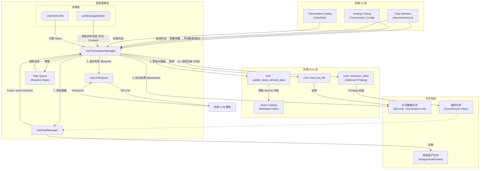

# 转写功能架构文档

> 本文档描述了 AIO Hub 中“转写功能”的当前实现架构，涵盖图片描述、音频转录等场景。

## 概述

转写功能允许用户将图片或音频资产通过 LLM 转换为文本描述（OCR/ASR），并将结果与原始资产关联，供后续聊天、搜索、Token 计算等场景使用。

**核心特性：**
- **自动触发**：资产导入时根据设置自动加入转写队列
- **队列管理**：支持并发控制、重试机制、状态跟踪
- **元数据关联**：转写结果与资产元数据双向绑定
- **多格式支持**：图片（视觉描述 + OCR）、音频（语音转文字）、视频（视觉+听觉综合描述）
- **配置灵活**：支持全局配置及分类型精细配置
- **外部依赖可选**：支持配置本地 FFmpeg 路径以增强视频处理能力（压缩/转码），未配置时采用直传模式

## 架构图



## 组件说明

### 前端逻辑层

| 组件 | 路径 | 职责 |
|------|------|------|
| `useTranscriptionManager` | `src/tools/llm-chat/composables/useTranscriptionManager.ts` | 核心管理器，负责任务队列、LLM 调用、结果保存、状态查询 |
| `useAssetManager` | `src/composables/useAssetManager.ts` | 资产二进制数据读取 |
| `useLlmRequest` | `src/composables/useLlmRequest.ts` | 统一 LLM 请求发送 |
| `useMessageBuilder` | `src/tools/llm-chat/composables/useMessageBuilder.ts` | 构建聊天消息时自动包含转写内容 |
| `chatTokenUtils` | `src/tools/llm-chat/utils/chatTokenUtils.ts` | 计算 Token 时包含转写内容 |

### 后端 Rust 层

| 组件 | 路径 | 职责 |
|------|------|------|
| `update_asset_derived_data` | `src-tauri/src/commands/asset_manager.rs` | 更新资产元数据中的 `derived` 字段 |
| `read_text_file` | `src-tauri/src/commands/asset_manager.rs` | 安全读取文本文件（用于获取转写内容） |
| Asset Catalog | `.catalog/assets.jsonl` | 资产元数据索引，存储 `derived` 映射 |

### 文件系统结构

```
AppData/assets/
├── images/2025-12/          # 原始图片
├── audio/2025-12/           # 原始音频
├── video/2025-12/           # 原始视频
└── derived/                 # 衍生数据目录
    ├── images/2025-12/{uuid}/transcription.md
    ├── audio/2025-12/{uuid}/transcription.md
    └── video/2025-12/{uuid}/transcription.md
```

## 数据流

### 1. 触发阶段
- **自动触发**：资产导入成功 → `asset-imported` 事件 → `useTranscriptionManager.init()` 监听 → 根据设置决定是否加入队列
- **手动触发**：用户通过 UI（附件卡片、设置对话框）手动添加任务

### 2. 处理阶段
1. **任务入队**：`addTask()` 创建 `TranscriptionTask` 对象，状态 `pending`
2. **队列调度**：`processQueue()` 根据并发设置取出任务，状态改为 `processing`
3. **数据准备**：
   - **图片/音频**：直接通过 `useAssetManager` 读取二进制数据，转换为 Base64。
   - **视频 (Video)**：
     - **检查配置**：检查是否配置了有效的 `ffmpegPath`。
     - **压缩决策**：如果配置了 FFmpeg 且文件大小 > `maxDirectSize` (如 10MB)，则调用后端 `compress_video` 进行本地压缩（降低分辨率/码率），生成临时文件。
     - **直传模式**：如果未配置 FFmpeg 或文件较小，直接读取原始文件。
     - **最终转换**：将（原始或压缩后的）视频数据转换为 Base64 字符串。
4. **LLM 请求**：
   - 构建 Payload：使用 `image_url` (兼容性做法) 或原生 `video` 字段，填入 Base64 数据。
   - 调用 `useLlmRequest.sendRequest()`。
5. **结果保存**：
   - 写入文件：`derived/{type}/{date}/{uuid}/transcription.md`
   - 更新元数据：调用 `update_asset_derived_data` 命令，将路径、提供者、时间戳写入 `asset.metadata.derived.transcription`

### 3. 消费阶段
- **状态查询**：`getTranscriptionStatus()` 结合内存队列和元数据返回状态
- **内容读取**：`getTranscriptionText()` 调用 `read_text_file` 命令读取文件
- **消息构建**：`useMessageBuilder` 在构建用户消息时自动获取转写内容并附加
- **Token 计算**：`chatTokenUtils` 在计算 Token 时包含转写内容

## 关键实现细节

### 任务队列管理
- **状态机**：`pending` → `processing` → `completed`/`error`
- **并发控制**：通过 `maxConcurrentTasks` 配置（默认 1）
- **重试机制**：失败后根据 `maxRetries` 配置自动重试
- **错误处理**：错误信息写入 `derived.error` 字段，不影响原始资产

### 元数据设计
```typescript
// AssetMetadata 新增字段
interface AssetMetadata {
  derived?: Record<string, DerivedDataInfo>;
}

interface DerivedDataInfo {
  path?: string;          // 衍生文件相对路径
  updatedAt: string;      // ISO 8601 时间戳
  provider?: string;      // 提供者标识，如 "gpt-4o", "manual"
  error?: string;         // 错误信息（如果生成失败）
}
```

### 配置系统
配置通过 `ChatSettings` 管理，支持：
- **全局开关**：启用/禁用转写功能
- **自动转写**：资产导入时自动触发
- **模型选择**：`profileId:modelId` 格式的模型标识符
- **Prompt 定制**：支持全局 Prompt 及分类型（图片/音频）定制
- **并发与重试**：最大并发任务数、最大重试次数

## 配置项参考

```typescript
// src/tools/llm-chat/components/settings/settingsConfig.ts
transcription: {
  enabled: boolean;
  autoTranscribe: boolean;
  modelIdentifier: string; // "openai:gpt-4o"
  customPrompt?: string;
  temperature: number;
  maxTokens: number;
  maxConcurrentTasks: number;
  maxRetries: number;
  enableTypeSpecificConfig: boolean;
  ffmpegPath?: string; // 用户配置的本地 FFmpeg 可执行文件路径
  image: { /* 图片专用配置 */ };
  audio: { /* 音频专用配置 */ };
  video: {
    maxDirectSizeMB: number; // 直传阈值，默认 10MB
    compressionPreset: string; // "balanced" | "quality" | "speed"
  };
}
```

## 使用场景

### 1. 聊天附件增强
用户发送图片/音频/视频附件 → 自动转写 → 转写内容作为上下文附加到消息中 → LLM 获得更丰富的输入信息（包括视频的视觉与听觉内容）。

### 2. 资产库搜索
转写内容可被全文搜索索引，用户可通过描述文字查找图片/音频/视频素材。

### 3. 无障碍支持
为视觉/听觉障碍用户提供文字描述

### 4. 内容分析
批量转写后可用于内容分析、标签生成、摘要提取等

## 相关文件变更

本次实现涉及的主要文件变更：

### 后端 (Rust)
- `src-tauri/src/commands/asset_manager.rs`：新增 `DerivedDataInfo` 结构体，扩展 `AssetMetadata`，实现 `update_asset_derived_data` 命令
- `src-tauri/src/lib.rs`：注册新命令

### 前端 (TypeScript/Vue)
- `src/types/asset-management.ts`：同步类型定义
- `src/tools/llm-chat/composables/useTranscriptionManager.ts`：核心实现
- `src/tools/llm-chat/utils/chatTokenUtils.ts`：Token 计算逻辑更新
- `src/tools/llm-chat/composables/useMessageBuilder.ts`：消息构建逻辑更新
- `src/tools/llm-chat/components/dialogs/TranscriptionDialog.vue`：转写查看/编辑对话框
- `src/tools/llm-chat/components/AttachmentCard.vue`：附件卡片集成转写状态
- `src/tools/llm-chat/components/settings/ChatSettingsDialog.vue`：转写配置界面
- `src/tools/llm-chat/components/settings/settingsConfig.ts`：配置定义

## 未来扩展方向

1. **更多衍生类型**：OCR 文字提取、语音情感分析、视频关键帧描述
2. **本地模型集成**：集成 Whisper、CLIP 等本地模型，降低 API 成本
3. **批量操作**：支持批量转写、批量导出
4. **缓存优化**：转写结果缓存，避免重复处理
5. **流式输出**：支持流式转写，实时显示进度

---

*文档最后更新：2025-12-10*
*对应提交：转写功能实现（commit hash: ...）*