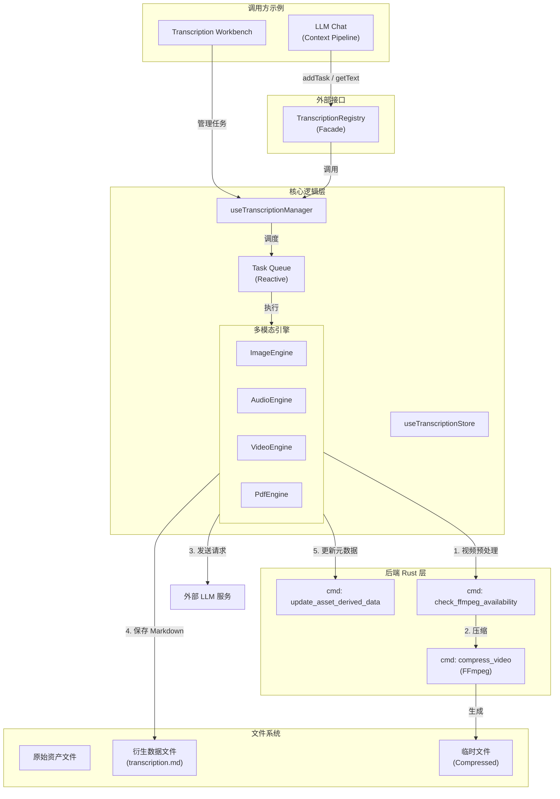

# 转写功能架构文档 (Transcription Architecture)

> 本文档描述了 AIO Hub 中“转写功能”的实现架构。该功能现已作为独立工具模块运行，为全应用提供多模态内容提取能力。

## 概述

转写功能允许用户将图片、音频、视频或 PDF 资产通过 LLM 转换为文本描述（OCR/ASR/视觉描述），并将结果作为资产的“衍生数据 (Derived Data)”持久化，供后续聊天、搜索、内容分析等场景使用。

**核心特性：**

- **解耦架构**：独立于聊天模块，通过 `TranscriptionRegistry` 提供跨模块服务。
- **插件化引擎**：针对不同模态（图片、音频、视频、PDF）提供专属转写引擎。
- **任务队列管理**：支持并发控制、速率限制、自动重试和状态跟踪。
- **智能视频处理**：集成 FFmpeg 实现大视频自动压缩、抽帧，优化 Token 消耗。
- **智能图片切分**：支持对超长图片进行自动空白检测与切块，提升模型识别率。
- **资产系统深度集成**：转写结果与资产元数据双向绑定，支持结果复用。

## 架构图



## 组件说明

### 1. 前端架构 (TypeScript/Vue)

| 组件                      | 路径                                                             | 职责                                                             |
| ------------------------- | ---------------------------------------------------------------- | ---------------------------------------------------------------- |
| `TranscriptionRegistry`   | `src/tools/transcription/transcription.registry.ts`              | **外观服务**。提供单例接口，供其他工具（如聊天、搜索）调用。     |
| `useTranscriptionManager` | `src/tools/transcription/composables/useTranscriptionManager.ts` | **核心调度器**。负责任务队列管理、并发控制、速率限制和引擎分发。 |
| `useTranscriptionStore`   | `src/tools/transcription/stores/transcriptionStore.ts`           | **状态中心**。存储任务列表、全局配置及调度状态。                 |
| `ITranscriptionEngine`    | `src/tools/transcription/types.ts`                               | **引擎接口**。定义了 `canHandle` 和 `execute` 标准接口。         |
| `engines/*`               | `src/tools/transcription/engines/`                               | **模态引擎实现**。包含 Image, Audio, Video, Pdf 的具体转写逻辑。 |

### 2. 后端架构 (Rust)

| 命令/模块                   | 路径                                        | 职责                                                   |
| --------------------------- | ------------------------------------------- | ------------------------------------------------------ |
| `update_asset_derived_data` | `src-tauri/src/commands/asset_manager.rs`   | 将转写结果的路径及模型信息持久化到资产数据库。         |
| `compress_video`            | `src-tauri/src/commands/video_processor.rs` | 调用 FFmpeg 对视频进行压缩（降低分辨率、帧率或体积）。 |
| `check_ffmpeg_availability` | `src-tauri/src/commands/video_processor.rs` | 检查用户配置的 FFmpeg 路径是否有效。                   |

## 核心流程

### 1. 任务调度流程

1. `addTask` 将任务加入 `pending` 队列。
2. `processQueue` 根据 `maxConcurrentTasks` 弹出任务，并检查 `executionDelay`（速率限制）。
3. 根据资产类型匹配对应的引擎实现。
4. 引擎执行完成后，调用 `saveTranscriptionResult` 保存文件并更新资产元数据。

### 2. 视频转写特化流程 (Video Pipeline)

1. **大小检查**：如果视频体积 > `maxDirectSizeMB` 且配置了 FFmpeg，则触发压缩。
2. **本地压缩**：调用 Rust 后端执行 FFmpeg 任务（Preset: `auto_size`）。
3. **临时转换**：使用压缩后的临时文件进行 Base64 编码。
4. **请求发送**：将视频数据发送给具备视觉理解能力的模型。
5. **清理**：任务完成后自动删除临时压缩文件。

### 3. 图片切分流程 (Image Slicer)

1. **长宽比检测**：如果图片长宽比超过阈值，触发切分逻辑。
2. **空白检测**：调用 `SmartOcrRegistry` 寻找图片中的空白行作为切割点。
3. **分块请求**：将图片切分为多个块，按序发送给 LLM，确保长图内容不被模糊或丢失。

## 数据持久化

转写结果作为资产的**衍生数据**存储：

### 1. 文件系统结构

```
AppData/assets/
├── images/2025-12/          # 原始图片
├── audio/2025-12/           # 原始音频
├── video/2025-12/           # 原始视频
└── derived/                 # 衍生数据目录
    ├── images/2025-12/{uuid}/transcription.md
    ├── audio/2025-12/{uuid}/transcription.md
    └── video/2025-12/{uuid}/transcription.md
```

### 2. 元数据设计

资产元数据的 `derived.transcription` 字段包含：

- `path`: Markdown 文件的相对路径。
- `provider`: 执行转写的模型 ID（如 "gpt-4o"）或 "manual"（手动编辑）。
- `updatedAt`: ISO 8601 格式的完成时间。
- `warning`: 可选的警告信息（如“模型返回空内容”）。
- `error`: 可选的错误描述（如果生成失败）。

```typescript
interface DerivedDataInfo {
  path?: string;
  updatedAt: string;
  provider?: string;
  warning?: string;
  error?: string;
}
```

## 消费与应用

转写结果通过 `TranscriptionRegistry.getTranscriptionText(asset)` 被以下组件消费：

- **LLM Chat (上下文管道)**: `transcription-processor` 自动获取转写文本并注入到 Prompt 中，使纯文本模型具备“理解”多模态内容的能力。
- **Token 计算器**: 在发送请求前，`chatTokenUtils` 预先读取转写内容以进行精确的上下文长度预估。
- **附件卡片 (AttachmentCard)**: 实时展示转写状态，并允许用户一键查看或手动校对转写文本。
- **全局搜索**: 转写文本可被索引，支持用户通过自然语言搜索图片、音视频素材。

## 使用场景

1.  **多模态对话增强**: 为不支持视觉/音频输入的模型提供内容描述。
2.  **长视频/长文档摘要**: 通过 FFmpeg 压缩和分段处理，提取长媒体的核心信息。
3.  **无障碍辅助**: 为视觉或听觉障碍用户提供文字化的内容替代。
4.  **资产管理自动化**: 自动为导入的素材生成描述标签，提升管理效率。

## 未来扩展方向

1.  **本地模型集成**: 引入 Whisper (语音)、CLIP (视觉) 等本地模型以降低 API 成本。
2.  **流式转写**: 支持实时显示转写进度和部分结果。
3.  **批量操作**: 支持在转写工作台中对大量资产进行一键批量转写。
4.  **缓存优化**: 优化衍生数据的同步机制，提升大批量任务下的 IO 性能。

## 配置系统

转写配置支持全局默认与按模态精细化覆盖：

- **全局配置**：并发数、重试次数、FFmpeg 路径、保底模型。
- **分类配置**：可为图片、音频、视频、文档分别设置不同的模型、Prompt、温度和 Token 上限。

---

_文档最后更新：2026-01-15_
_更新内容：同步解耦后的独立工具架构，增加视频压缩与图片切分说明。_
