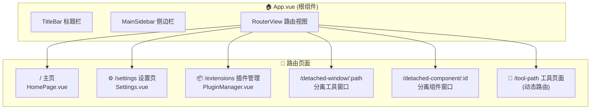
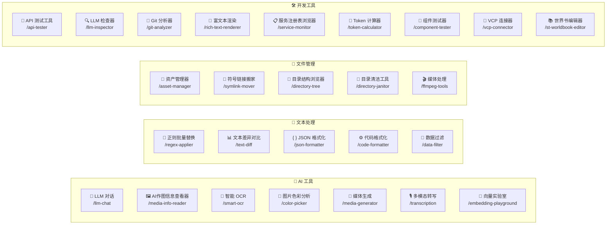
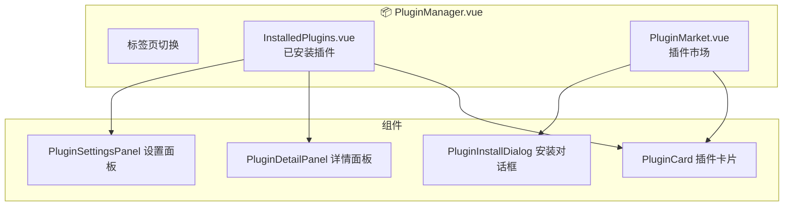
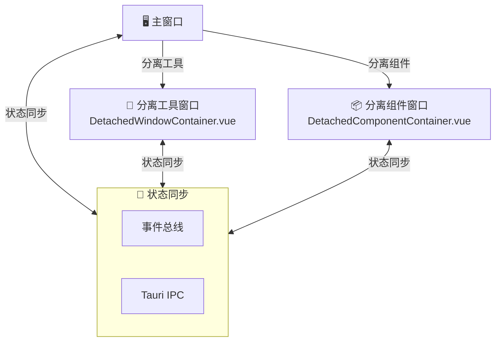

# AIO Hub 应用 UI 界面关系图

本文档展示了整个应用的UI界面层次结构和导航关系。

## 1. 应用整体结构

---

## 2. 工具模块 (Tools) 结构

根据类别划分的工具模块：

---

## 3. 设置页 (Settings) 模块结构

设置页采用单页滚动+侧边导航的设计，包含12个功能模块：

```mermaid
flowchart TB
    subgraph SettingsPage["⚙️ Settings.vue 设置页"]
        SettingsNav["左侧导航栏"]
        SettingsContent["右侧内容区"]
    end

    subgraph Modules["📋 设置模块"]
        General["🔧 通用设置<br/>GeneralSettings.vue"]
        ThemeColors["🎨 主题色配置<br/>ThemeColorSettings.vue"]
        ThemeAppearance["🖼️ 主题壁纸外观<br/>ThemeAppearanceSettings.vue"]
        CssOverride["📝 CSS 样式覆盖<br/>CssOverrideSettings.vue"]
        LlmService["🤖 LLM AI 服务配置<br/>LlmServiceSettings.vue"]
        ModelMetadata["📊 AI 模型元数据<br/>ModelMetadataSettings.vue"]
        OcrService["📷 云端 OCR 服务<br/>OcrServiceSettings.vue"]
        UserProfiles["👤 用户档案管理<br/>UserProfileSettings.vue"]
        AssetSettings["📦 资产管理<br/>AssetSettings.vue"]
        ToolsSettings["🔧 工具模块<br/>ToolsSettings.vue"]
        LogSettings["📋 日志配置<br/>LogSettings.vue"]
        About["ℹ️ 关于<br/>AboutSettings.vue"]
    end

    SettingsNav --> General
    SettingsNav --> ThemeColors
    SettingsNav --> ThemeAppearance
    SettingsNav --> CssOverride
    SettingsNav --> LlmService
    SettingsNav --> ModelMetadata
    SettingsNav --> OcrService
    SettingsNav --> UserProfiles
    SettingsNav --> AssetSettings
    SettingsNav --> ToolsSettings
    SettingsNav --> LogSettings
    SettingsNav --> About
```

---

## 4. 插件管理页结构

---

## 5. 通用组件库

应用中跨模块复用的通用组件：

```mermaid
flowchart LR
    subgraph CommonComponents["🧩 通用组件 (components/common)"]
        Avatar["Avatar 头像"]
        AvatarSelector["AvatarSelector 头像选择器"]
        BaseDialog["BaseDialog 基础对话框"]
        DocumentViewer["DocumentViewer 文档查看器"]
        DraggablePanel["DraggablePanel 可拖拽面板"]
        DropZone["DropZone 拖放区域"]
        DynamicIcon["DynamicIcon 动态图标"]
        FileIcon["FileIcon 文件图标"]
        ImageViewer["ImageViewer 图片查看器"]
        VideoPlayer["VideoPlayer 视频播放器"]
        VideoViewer["VideoViewer 视频查看器"]
        AudioPlayer["AudioPlayer 音频播放器"]
        AudioViewer["AudioViewer 音频查看器"]
        PdfViewer["PdfViewer PDF 查看器"]
        LlmModelSelector["LlmModelSelector 模型选择器"]
        RichCodeEditor["RichCodeEditor 代码编辑器"]
        InfoCard["InfoCard 信息卡片"]
        TranscriptionDialog["TranscriptionDialog 转写弹窗"]
        PromptEditor["PromptEditor 提示词编辑器"]
    end
```

---

## 6. 窗口分离机制

应用支持将工具和组件分离为独立窗口：

---

## 7. 导航路径汇总表

| 路径                    | 页面名称         | 组件文件                  |
| ----------------------- | ---------------- | ------------------------- |
| `/`                     | 主页             | `HomePage.vue`            |
| `/settings`             | 设置页           | `Settings.vue`            |
| `/extensions`           | 插件管理         | `PluginManager.vue`       |
| `/llm-chat`             | LLM 对话         | `LlmChat.vue`             |
| `/smart-ocr`            | 智能 OCR         | `SmartOcr.vue`            |
| `/media-info-reader`    | AI作图信息查看器 | `MediaInfoReader.vue`     |
| `/color-picker`         | 图片色彩分析     | `ColorPicker.vue`         |
| `/media-generator`      | 媒体生成         | `MediaGenerator.vue`      |
| `/transcription`        | 多模态转写       | `TranscriptionTool.vue`   |
| `/embedding-playground` | 向量实验室       | `EmbeddingPlayground.vue` |
| `/regex-applier`        | 正则批量替换     | `RegexApplier.vue`        |
| `/text-diff`            | 文本差异对比     | `TextDiff.vue`            |
| `/json-formatter`       | JSON 格式化      | `JsonFormatter.vue`       |
| `/code-formatter`       | 代码格式化       | `CodeFormatter.vue`       |
| `/data-filter`          | 数据过滤         | `DataFilter.vue`          |
| `/asset-manager`        | 资产管理器       | `AssetManager.vue`        |
| `/symlink-mover`        | 符号链接搬家     | `SymlinkMover.vue`        |
| `/directory-tree`       | 目录结构浏览器   | `DirectoryTree.vue`       |
| `/directory-janitor`    | 目录清洁工具     | `DirectoryJanitor.vue`    |
| `/ffmpeg-tools`         | 媒体处理         | `FFmpegTool.vue`          |
| `/api-tester`           | API 测试工具     | `ApiTester.vue`           |
| `/llm-inspector`        | LLM 检查器       | `LlmInspector.vue`        |
| `/git-analyzer`         | Git 分析器       | `GitAnalyzer.vue`         |
| `/rich-text-renderer`   | 富文本渲染       | `RichTextRenderer.vue`    |
| `/service-monitor`      | 服务注册表浏览器 | `ServiceMonitor.vue`      |
| `/token-calculator`     | Token 计算器     | `TokenCalculator.vue`     |
| `/component-tester`     | 组件测试器       | `ComponentTester.vue`     |
| `/vcp-connector`        | VCP 连接器       | `VcpConnector.vue`        |
| `/st-worldbook-editor`  | 世界书编辑器     | `StWorldbookEditor.vue`   |

---

> **注意**: LLM Chat 工具由于结构复杂，其详细组件关系图请参见 [llm-chat-ui-structure.md](./llm-chat-ui-structure.md)
