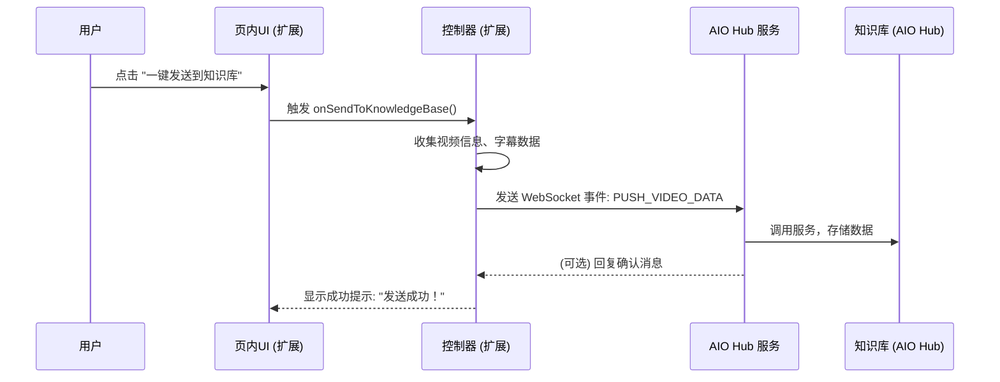

# 浏览器连接器 (Browser Connector) & B站伴侣 - 架构设计文档

## 1. 项目愿景与目标

### 1.1. 背景

现有的第三方B站字幕扩展等工具，通常与特定网站深度绑定，技术陈旧，闭源跑路，且无法与 AIO Hub 的现有生态（如LLM服务、知识库）进行深度集成。

### 1.2. 核心目标

我们旨在构建一个通用的**浏览器连接器 (Browser Connector)**，它将作为 AIO Hub 与浏览器页面之间的**数据桥梁**。**B站伴侣**将是基于此连接器实现的第一个功能模块。

**核心目标**：

1.  **页内原生体验优先**: 将核心功能（如字幕展示、时间轴同步、章节列表）直接注入目标页面，构建一个独立的、功能完备的**页内应用 (In-Page App)**，确保最佳的实时交互体验。
2.  **事件驱动的数据推送**: AIO Hub 的角色从“远程控制器”转变为“**数据接收与服务中心**”。通信以扩展侧发起的事件为主，将处理好的数据（如视频信息、字幕文本）单向推送到 AIO Hub 进行后续处理（如存入知识库、AI总结）。
3.  **模块化功能**: 将针对特定网站（如B站、YouTube）的交互逻辑封装成独立的“功能模块”，在扩展内部按需加载和执行。
4.  **轻量级通信桥梁**: 通过 WebSocket 建立 AIO Hub 与浏览器扩展之间的轻量级通信链路，主要用于数据上报和触发 AIO Hub 的后端服务。
5.  **生态深度融合**: 扩展内的 UI 可以调用 AIO Hub 的能力（如 LLM 服务、知识库），实现“页内操作，云端赋能”的模式。

---

## 2. 整体架构

架构以**浏览器扩展为核心**，AIO Hub 为辅，旨在解决多页状态管理复杂性的问题。

1.  **Chrome 扩展 (核心应用)**: 作为功能的主体，负责 UI 注入、页面元素交互、状态管理和数据采集。
    - **控制器 (Controller)**: 负责监听播放器事件、操作 DOM、管理自身UI状态。
    - **页内 UI (In-Page UI)**: 以 Shadow DOM 形式注入的 Vue/Svelte 组件，提供字幕、章节、控制按钮等所有核心交互界面。
2.  **AIO Hub (服务中心)**:
    - **浏览器连接器服务**: 运行在 AIO Hub 内部，负责维护 WebSocket 连接，接收并处理来自扩展的数据。
    - **工具 UI (可选)**: 提供一个界面，用于展示从浏览器接收到的数据，或进行一些全局配置。

### 2.1. 架构图

```mermaid
graph TD
    subgraph AIO Hub
        direction LR
        A[B站伴侣数据面板]
        Y[知识库/AI服务]
        subgraph Browser Connector Service
            direction LR
            B_Router[数据路由器]
            B_WS[WebSocket 服务]
            B_Handler[数据处理器]
        end
    end

    subgraph Chrome 浏览器
        direction LR
        subgraph "Extension (页内应用)"
            direction TB
            C_UI[页内UI (字幕/按钮等)]
            C_Controller[B站控制器]
            C_WS[WebSocket 客户端]
        end
        D[Bilibili 播放器]
    end

    %% 核心交互在浏览器内部完成
    C_UI -- 用户操作 --> C_Controller
    C_Controller -- 控制/监听 --> D
    D -- 播放器事件 --> C_Controller
    C_Controller -- 更新状态 --> C_UI

    %% 数据推送到 AIO Hub
    C_UI -- "发送到知识库" --> C_Controller
    C_Controller -- 收集数据 --> C_Controller
    C_Controller -- 准备好的数据 --> C_WS
    C_WS -- WebSocket 消息 --> B_WS

    %% AIO Hub 处理数据
    B_WS -- 接收消息 --> B_Router
    B_Router -- 路由到处理器 --> B_Handler
    B_Handler -- 处理后更新 --> A
    B_Handler -- 调用服务 --> Y
```

### 2.2. 技术选型

- **通信方式**: WebSocket。由 Tauri 后端启动一个 WebSocket Server，扩展作为 Client 连接。
- **扩展 (Chrome Extension)**:
  - **核心逻辑与UI**: **Vue 3** 或 Svelte。推荐使用 Vue 3 以便复用 AIO Hub 的部分组件和 Composables 逻辑。
  - **样式隔离**: **必须使用 Shadow DOM**，防止与目标页面样式冲突。
- **AIO Hub**: Vue 3, Pinia (复用现有技术栈)。

---

## 3. WebSocket 通信协议

协议以**从扩展到 AIO Hub 的单向事件推送为主**。

### 3.1. 消息结构

```typescript
interface WebSocketMessage {
  // 消息来源模块的唯一标识
  // e.g., 'bilibili-companion', 'youtube-companion'
  source: string;
  // 消息类型，主要为 event
  type: "event" | "request" | "response";
  // 消息唯一ID，用于追踪 request-response
  id?: string;
  // 事件或动作名
  action: string;
  // 载荷
  payload: any;
}
```

### 3.2. 消息类型

#### 3.2.1. 事件 (扩展 -> AIO Hub)

由扩展主动上报，用于数据推送或状态通知。

- **推送视频与字幕信息**: `{"source": "bilibili-companion", "type": "event", "action": "PUSH_VIDEO_DATA", "payload": { videoInfo: {...}, subtitles: [...] }}`
- **通知AIO Hub打开面板**: `{"source": "bilibili-companion", "type": "event", "action": "SHOW_AIO_PANEL", "payload": { message: "数据已发送，请查收" }}`
- **连接状态通知**: `{"source": "bilibili-companion", "type": "event", "action": "CONNECTION_STATUS", "payload": {"status": "connected", "tabId": 123, "url": "..."}}`

#### 3.2.2. 请求/响应 (扩展 <-> AIO Hub)

用于扩展请求 AIO Hub 的后端能力（如LLM）。

- **扩展请求AI总结**: `{"source": "bilibili-companion", "type": "request", "id": "req-1", "action": "SUMMARIZE_TEXT", "payload": { text: "..." }}`
- **AIO Hub 成功响应**: `{"source": "bilibili-companion", "type": "response", "id": "req-1", "action": "SUMMARIZE_TEXT_SUCCESS", "payload": { summary: "..." }}`
- **AIO Hub 失败响应**: `{"source": "bilibili-companion", "type": "response", "id": "req-1", "action": "SUMMARIZE_TEXT_ERROR", "payload": { message: "API请求失败" }}`

---

## 4. 核心交互流程

流程起点为用户在**注入页面的UI**上的操作。



---

## 5. 项目文件结构规划

### 5.1. AIO Hub 侧 (简化)

```
src/
├── services/
│   └── browser-connector/
│       ├── connector.registry.ts   # 核心服务，管理WebSocket和消息路由
│       └── data-handler.ts      # 负责处理接收到的数据
└── tools/
    └── bilibili-companion/
        ├── BilibiliCompanion.vue  # 数据展示/配置UI
        └── store.ts               # Pinia状态管理
```

### 5.2. Chrome 扩展 (核心)

```
extensions/
└── bilibili-companion-extension/ # 功能独立的扩展项目
    ├── src/
    │   ├── main.ts                # 扩展主入口，负责UI挂载
    │   ├── App.vue                # 注入的UI主组件 (根组件)
    │   ├── components/            # UI组件 (字幕行、按钮等)
    │   │   └── SubtitleList.vue
    │   ├── services/
    │   │   ├── bilibili.controller.ts # B站播放器交互逻辑
    │   │   └── connection.registry.ts  # 封装WebSocket连接
    │   └── store.ts               # 扩展内部的状态管理 (Pinia)
    ├── manifest.json
    └── ... (构建配置)
```

---

## 6. 分阶段执行计划

### Phase 1: 构建功能完备的独立扩展 (MVP)

1.  **项目初始化**: 创建一个独立的 Vue 3 + Vite 的浏览器扩展项目。
2.  **UI 注入**: 实现通过 `main.ts` 将 `App.vue` 组件挂载到B站播放页面的 Shadow DOM 中。
3.  **播放器交互**: 实现 `bilibili.controller.ts`，负责监听播放器事件（播放、暂停、进度），并能控制播放器。
4.  **核心UI功能**: 在 `App.vue` 和其子组件中，实现字幕列表展示、当前行高亮、点击字幕跳转播放。
5.  **独立运行**: 确保扩展在不连接 AIO Hub 的情况下，核心功能可完全独立、稳定运行。

### Phase 2: 与 AIO Hub 建立数据通道

1.  **WebSocket 服务**: 在 AIO Hub 中实现 `connector.registry.ts`，启动 WebSocket 服务并监听连接。
2.  **扩展连接**: 在扩展中实现 `connection.registry.ts`，连接到 AIO Hub 的 WebSocket 服务。
3.  **数据推送**: 在扩展的 UI 中添加“发送到知识库”按钮，点击后，通过 WebSocket 发送 `PUSH_VIDEO_DATA` 事件。
4.  **数据接收与处理**: 在 AIO Hub 的 `data-handler.ts` 中实现对接收数据的解析和处理逻辑（例如，打印到控制台）。
5.  **端到端验证**: 验证从扩展点击按钮到 AIO Hub 成功接收到完整数据的链路。

### Phase 3: AIO Hub 服务集成与能力赋能

1.  **知识库集成**: 将 `data-handler.ts` 接收到的数据正式存入 AIO Hub 的知识库模块。
2.  **AI 总结请求**: 在扩展中添加“AI总结”按钮，实现通过 `request/response` 模式调用 AIO Hub 的 LLM 服务。
3.  **数据展示面板**: 开发 `BilibiliCompanion.vue`，用于展示从扩展接收到的历史记录或进行相关配置。

### Phase 4: 体验优化与多站支持

1.  **健壮性**: 优化连接中断、页面刷新等边缘情况下的逻辑。
2.  **抽象化**: 将 `bilibili.controller.ts` 中的通用逻辑抽象出来，为支持 YouTube 等其他网站做准备。
3.  **配置化**: 添加设置项，如 AIO Hub 连接地址、端口等。

## 附录

### bilibili.controller.ts

```typescript
/**
 * @file Bilibili Player Controller
 * @description 提取并封装了与B站播放器交互的核心逻辑，用于获取视频信息、字幕和控制播放。
 * @author 咕咕
 */

/**
 * B站视频信息
 */
/**
 * B站分P信息
 */
export interface BilibiliPageInfo {
  cid: number;
  page: number;
  part: string;
  duration: number;
}

/**
 * B站视频章节信息
 */
export interface BilibiliChapterInfo {
  type: number;
  from: number;
  to: number;
  content: string;
}

/**
 * B站字幕基础信息
 */
export interface BilibiliSubtitleInfo {
  id: number;
  lan: string;
  lan_doc: string;
  subtitle_url: string;
}

/**
 * B站视频信息
 */
export interface BilibiliVideoInfo {
  url: string;
  title: string;
  aid: number;
  ctime: number;
  author?: string;
  pages: BilibiliPageInfo[];
  chapters: BilibiliChapterInfo[];
  subtitles: BilibiliSubtitleInfo[];
}

export class BilibiliPlayerController {
  private lastAidOrBvid: string | null = null;

  private videoInfo: {
    aid: number | null;
    pages: BilibiliPageInfo[];
    pagesMap: Record<string, BilibiliPageInfo>;
  } = {
    aid: null,
    pages: [],
    pagesMap: {},
  };

  /**
   * 获取当前页面的 <video> 元素
   * @returns HTMLVideoElement | undefined
   */
  public getVideoElement(): HTMLVideoElement | undefined {
    const videoWrapper = document.getElementById("bilibili-player");
    return videoWrapper?.querySelector("video") as HTMLVideoElement | undefined;
  }

  /**
   * 跳转视频到指定时间
   * @param time - 目标时间（秒）
   * @param togglePause - 是否切换播放/暂停状态
   */
  public seek(time: number, togglePause: boolean = false): void {
    const video = this.getVideoElement();
    if (video) {
      video.currentTime = time;
      if (togglePause) {
        video.paused ? video.play() : video.pause();
      }
    }
  }

  /**
   * 控制视频播放或暂停
   * @param play - true: 播放, false: 暂停
   */
  public async setPlay(play: boolean): Promise<void> {
    const video = this.getVideoElement();
    if (video) {
      if (play) {
        await video.play();
      } else {
        video.pause();
      }
    }
  }

  /**
   * 获取当前视频的状态
   * @returns { paused: boolean, currentTime: number } | undefined
   */
  public getVideoStatus(): { paused: boolean; currentTime: number } | undefined {
    const video = this.getVideoElement();
    if (video) {
      return {
        paused: video.paused,
        currentTime: video.currentTime,
      };
    }
  }

  /**
   * 获取当前视频的aid, bvid, cid, 字幕列表等核心信息
   * @param force - 是否强制刷新
   * @returns BilibiliVideoInfo | null
   */
  public async fetchVideoInfo(force: boolean = false): Promise<BilibiliVideoInfo | null> {
    if (force) {
      this.lastAidOrBvid = null;
    }

    const pathSearchs: Record<string, string> = {};
    location.search.slice(1).replace(/([^=&]*)=([^=&]*)/g, (matchs, a, b) => {
      pathSearchs[a] = b;
      return "";
    });

    let aidOrBvid = pathSearchs.bvid; // 兼容稍后再看
    if (!aidOrBvid) {
      let path = location.pathname;
      if (path.endsWith("/")) {
        path = path.slice(0, -1);
      }
      const paths = path.split("/");
      aidOrBvid = paths[paths.length - 1];
    }

    if (!aidOrBvid || aidOrBvid === this.lastAidOrBvid) {
      return null;
    }

    this.lastAidOrBvid = aidOrBvid;

    try {
      // 统一处理流程：无论是 av 号还是 bv 号，都先调用 view 接口获取最全的信息
      const isAv = aidOrBvid.toLowerCase().startsWith("av");
      const queryParam = isAv ? `aid=${aidOrBvid.slice(2)}` : `bvid=${aidOrBvid}`;
      const viewRes = await fetch(`https://api.bilibili.com/x/web-interface/view?${queryParam}`, {
        credentials: "include",
      }).then((res) => res.json());

      if (viewRes.code !== 0) {
        throw new Error(`Failed to fetch video view info: ${viewRes.message}`);
      }

      const viewData = viewRes.data;
      const aid: number = viewData.aid;
      const cid: number = viewData.cid;
      const title: string = viewData.title;
      const ctime: number = viewData.ctime;
      const author: string | undefined = viewData.owner?.name;
      const pages: any[] = viewData.pages;

      // 获取到 aid 和 cid 后，再调用 player/v2 接口获取章节和字幕等补充信息
      // 注意：此接口未来可能需要 WBI 签名，目前依赖浏览器 Cookie 环境
      const playerRes = await fetch(
        `https://api.bilibili.com/x/player/wbi/v2?aid=${aid}&cid=${cid}`,
        { credentials: "include" }
      ).then((res) => res.json());
      if (playerRes.code !== 0) {
        // player 接口失败不应阻断主流程，可以优雅降级
        console.warn(
          `[BilibiliPlayerController] Failed to fetch player info: ${playerRes.message}`
        );
      }

      let chapters: any[] = playerRes.data?.view_points ?? [];
      let subtitles: any[] = playerRes.data?.subtitle?.subtitles ?? [];

      chapters = chapters.filter((chapter) => chapter.type === 2);

      this.videoInfo.aid = aid;
      this.videoInfo.pages = pages;
      this.videoInfo.pagesMap = {};
      pages.forEach((page) => {
        this.videoInfo.pagesMap[page.page + ""] = page;
      });

      return {
        url: location.origin + location.pathname,
        title,
        aid,
        ctime,
        author,
        pages,
        chapters,
        subtitles,
      };
    } catch (error) {
      console.error("[BilibiliPlayerController] Failed to fetch video info:", error);
      this.lastAidOrBvid = null; // 失败后允许重试
      return null;
    }
  }

  /**
   * 获取当前分P的字幕列表
   * @returns 字幕信息列表 | null
   */
  public async fetchCurrentPartSubtitles(): Promise<any[] | null> {
    const urlSearchParams = new URLSearchParams(window.location.search);
    const p = urlSearchParams.get("p") || "1";
    const page = this.videoInfo.pagesMap[p];
    if (!page || !this.videoInfo.aid) return null;

    const cid: number = page.cid;

    try {
      const res = await fetch(
        `https://api.bilibili.com/x/player/wbi/v2?aid=${this.videoInfo.aid}&cid=${cid}`,
        {
          credentials: "include",
        }
      ).then((res) => res.json());

      const subtitles = res.data.subtitle.subtitles.filter((item: any) => item.subtitle_url);
      return subtitles.length > 0 ? subtitles : null;
    } catch (error) {
      console.error("[BilibiliPlayerController] Failed to fetch subtitles:", error);
      return null;
    }
  }

  /**
   * 根据字幕信息，获取具体的字幕内容 (JSON)
   * @param subtitleInfo - 从 fetchVideoInfo 或 fetchCurrentPartSubtitles 获取的单条字幕信息
   * @returns 字幕内容JSON | null
   */
  public async fetchSubtitleContent(subtitleInfo: { subtitle_url: string }): Promise<any | null> {
    if (!subtitleInfo?.subtitle_url) return null;

    let url = subtitleInfo.subtitle_url;
    if (url.startsWith("http://")) {
      url = url.replace("http://", "https://");
    }
    try {
      return await fetch(url).then((res) => res.json());
    } catch (error) {
      console.error("[BilibiliPlayerController] Failed to fetch subtitle content:", error);
      return null;
    }
  }
}
```
