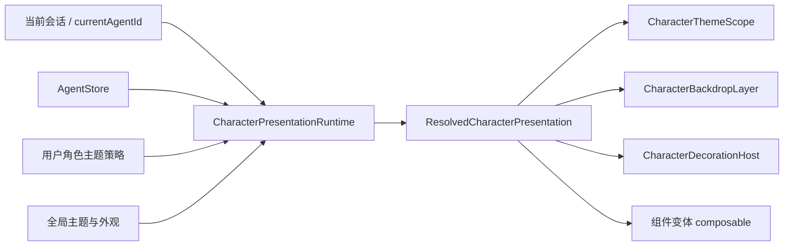

# 基于角色配置与资产的主题系统调研

> 状态：Investigation / Architecture Draft  
> 调研日期：2026-08-17  
> 范围：桌面端优先；本轮只形成设计，不实现运行时代码

## 1. 背景与目标

AIO Hub 已经具备亮暗模式、主题色、壁纸、透明度、毛玻璃、边框、窗口特效和全局自定义 CSS，但这些能力目前都属于“用户的全局外观设置”。角色侧已经具备头像、图片、音频、视频、分组资产、富文本样式、视觉化输出指南以及完整导入导出能力，却还没有一个正式的“角色呈现层”。

本调研要回答的是：

1. 选择某个角色后，怎样让聊天界面乃至应用外壳呈现该角色的视觉风格；
2. 怎样从“跟随角色换壁纸”平滑扩展到颜色、材质、组件变体、装饰素材和状态动效；
3. 怎样让角色主题可以随角色包导入导出，又不把任意 CSS、HTML 或脚本直接注入主应用；
4. 怎样兼容当前全局主题、用户自定义 CSS、分离窗口、会话绑定和未来多角色场景；
5. 第一阶段如何以较小代价落地，同时不形成后续难以拆除的临时实现。

## 2. 结论摘要

### 2.1 推荐方向

不要把角色主题实现成“选择角色时改写 `appSettings.appearance`”。应新增一个独立的、运行时解析的 **角色呈现覆盖层**：

```text
基础设计 token
  → 亮/暗模式与全局用户外观
    → 角色呈现配置
      → 会话临时覆盖
        → 无障碍与性能强制约束
```

它有五个核心性质：

1. **声明式**：角色只能声明允许的 token、组件变体、素材和状态，不直接执行代码；
2. **可作用域化**：首期只影响 LLM Chat，后续才允许扩展到应用外壳；
3. **引用既有 Agent 资产**：主题配置保存 `assetId`，不另建第二套文件系统；
4. **不污染用户设置**：角色切换只改变运行时覆盖，不保存成用户的全局壁纸或主题色；
5. **能力分级**：壁纸、色板、材质、组件变体、装饰、动效分别授权和降级。

### 2.2 第一阶段最合适的落点

第一阶段只实现：

- Agent 增加版本化的 `presentation` 配置；
- 用户增加“跟随角色外观”总开关与作用范围设置；
- 当前会话依据 `displayAgentId` 解析角色壁纸；
- 在 LLM Chat 内部增加独立背景层，支持静态图、填充方式、不透明度、叠加色和淡入淡出；
- 分离聊天窗口使用同一份解析结果；
- 导入的角色主题默认需要用户允许后才应用；
- 主题失效、资产丢失或角色未配置时无缝回退到全局外观。

这比直接复用 `body::before` 稍多一点工作，但能避免“角色壁纸只能做成全局副作用”的架构债务。

## 3. 仓库现状

### 3.1 全局主题与外观系统

当前系统分为三个相互关联但职责不同的部分。

#### 3.1.1 亮暗模式

`src/composables/useTheme.ts` 维护：

- `auto | light | dark`；
- `isDark`；
- 系统配色监听；
- `theme-changed` 通知。

它解决的是基础明暗模式，不负责角色级呈现。

#### 3.1.2 主题色

`src/utils/themeColors.ts` 根据主色生成 Element Plus 色阶，并把结果写入根元素 CSS 变量。当前主题色也是全局值。

#### 3.1.3 外观与壁纸

`src/composables/useThemeAppearance.ts` 和 `src/styles/theme-appearance.css` 已覆盖：

- 静态壁纸、文件夹轮播、内置壁纸；
- `cover / contain / fill / tile`；
- 壁纸不透明度；
- 背景叠加、混合模式、壁纸取色；
- UI 透明度、模糊、边框、代码块透明度；
- Windows/macOS 窗口特效；
- 分离窗口的壁纸特殊处理。

但当前实现直接向 `document.documentElement.style` 写入 `--wallpaper-url`、`--bg-color`、`--card-bg` 等变量，壁纸则由全局 `body::before` 绘制。这意味着它天然是“全窗口外观状态”，不适合作为聊天区域内随角色频繁切换的覆盖层。

更重要的是，`updateAppearanceSetting()` 会防抖保存到 `appSettings`。如果角色切换复用这条链路，会产生以下问题：

- 角色主题覆盖掉用户原本的壁纸和外观偏好；
- 切换角色造成配置文件频繁写入；
- 壁纸取色结果和轮播索引混入用户设置；
- 多窗口会互相争抢根变量；
- 离开聊天工具后角色主题是否继续存在变得不可控。

因此，角色主题必须复用其中的“算法与类型能力”，但不能复用它的“持久化状态和根节点副作用”。

### 3.2 角色选择语义

`src/tools/llm-chat/composables/ui/useLlmChatUiState.ts` 当前维护全局单例的 `currentAgentId`。主动选择角色时还会把角色写入当前会话的 `displayAgentId`。

`src/tools/llm-chat/types/session.ts` 已经有 `displayAgentId`，这对角色主题非常重要：

- `currentAgentId` 更像当前 UI 选中项；
- `displayAgentId` 是会话持久化的展示角色；
- 切换会话时，主题应跟随会话展示角色，而不是仅依赖最后一次点击的全局 ID；
- 多窗口中也应以窗口正在展示的会话上下文为准。

推荐把“当前角色主题来源”定义为：

```text
显式会话主题覆盖
  > 当前会话 displayAgentId
  > 当前 UI currentAgentId（仅无会话时用于预览）
  > 无角色主题
```

### 3.3 Agent 数据与资产系统

`src/tools/agent-manager/types/agent.ts` 已有：

- `icon`；
- `assetGroups`；
- `assets`；
- `richTextStyleOptions`；
- `visualGuideline`；
- 每个资产的 `id / path / type / group / usage / options`。

`src/tools/agent-manager/utils/agentAssetUtils.ts` 和 `agentAssetService.ts` 已解决：

- Agent 私有目录；
- 相对路径；
- Tauri 资产 URL 转换；
- 内置预设资产本地化；
- 资产缓存和消息内协议解析。

这意味着角色主题没有必要创建另一套“主题资产管理器”。更合适的做法是让角色呈现配置通过稳定的 `assetId` 引用 `AgentAsset`：

```ts
wallpaper: {
  assetId: "theme_wallpaper_night";
}
```

不建议直接在主题配置中存文件路径。资产 ID 比路径更适合重命名、导入迁移、缺失诊断和未来远程包签名。

### 3.4 Agent 导入导出

`src/tools/agent-manager/services/agentExportService.ts` 目前采用“排除本地字段，其余字段导出”的方式，Zip/文件夹/PNG 包也已经能携带 Agent 资产。只要：

- `ExportableAgent` 增加角色呈现字段；
- 主题引用的文件同时存在于 `assets`；
- 导入预检能识别缺失引用；

角色主题就可以沿用现有 Agent 包，不需要立即发明新的包格式。

不过当前 `AgentExportFile.version` 仍为 1。推荐先让 `presentation` 自身携带独立 `version`，减少为了一个可选扩展就整体升级包格式的压力；只有导入语义发生不兼容变化时再升级顶层导出版本。

### 3.5 全局自定义 CSS

`src/composables/useCssOverrides.ts` 会把任意用户 CSS 放进 `<head>` 并全局生效。这适合本机用户自己定制，但不适合作为可分享角色包的主题机制：

- CSS 可以命中任意内部选择器；
- DOM 改版会让主题大面积失效；
- 可以隐藏安全提示、授权按钮和错误信息；
- 可以加载远程资源或制造高开销效果；
- 难以预览主题究竟会影响哪些区域；
- 难以对移动端、分离窗口和未来布局做兼容。

结论：**角色包首期不得携带会在主应用上下文执行的任意 CSS。** 高级作者能力如果未来开放，应进入隔离的 iframe/WebView/插件沙盒，而不是复用全局 CSS Override。

### 3.6 现有角色设计资产

`docs/design/角色/青绡/青绡-画图Prompt与UI场景.md` 已明确提出：

- 角色专属色板；
- 快速对话头像、空状态、思考态、错误态、Toast 等 UI 触点；
- 思考中触角与翅翼动效；
- 当前尚无“主题动效与 Agent 绑定”的底层系统。

这份设计实际上已经验证了需求不止是壁纸。角色呈现系统至少要能表达：

- 静态视觉身份；
- 页面位置；
- 运行状态；
- 同一角色的多种素材；
- 动效和无动效降级。

## 4. 外部方案调研

### 4.1 Godot Theme：token + 类型变体

Godot 的 Theme 系统不是给任意控件塞一段 CSS，而是集中提供颜色、常量、字体、图标和 StyleBox，并允许控件使用 Theme Type Variation 继承基础控件类型后做变体。

对 AIO Hub 的启发：

- 角色主题应该覆盖语义 token，而不是追逐 DOM 选择器；
- “角色按钮”“角色卡片”“角色消息气泡”应是受控的组件变体；
- 组件变体继承默认组件，以保证未声明属性仍然可用；
- 新版应用只要维持 token 和变体契约，旧主题就能继续降级工作。

参考：

- https://docs.godotengine.org/en/stable/tutorials/ui/gui_using_theme_editor.html
- https://docs.godotengine.org/en/stable/tutorials/ui/gui_theme_type_variations.html

### 4.2 VS Code：分离颜色主题、文件图标和产品图标

VS Code 把颜色主题、文件图标主题、产品图标主题拆成独立贡献点；颜色主题还把工作台颜色和语法 token 颜色分开。用户可以做局部 customization，但扩展主题仍然通过结构化贡献注册，而不是直接控制整个产品 DOM。

对 AIO Hub 的启发：

- “颜色/材质”“组件形态”“角色装饰资产”不应塞进一个不可分解的大 CSS 文件；
- 每类能力应有独立开关和 fallback；
- 角色可以只提供壁纸和主色，也可以进一步提供组件变体，缺一部分不应导致整个主题不可用；
- 用户应能只关闭动效或装饰，而保留角色色板。

参考：

- https://code.visualstudio.com/api/extension-guides/color-theme
- https://code.visualstudio.com/api/extension-guides/product-icon-theme

### 4.3 Firefox themes：受限 manifest

Firefox WebExtension theme manifest 通过 `colors`、`images`、`properties` 等有限字段描述浏览器外观。它证明一个可分享主题包不必拥有任意代码权限，也能提供颜色和图像层面的明显个性化。

对 AIO Hub 的启发：

- 可分享角色主题首选有限 manifest；
- 未识别字段可以保留但不执行；
- 主题能力应有明确版本和允许列表；
- 主题包的资源 URL 应限制在包内资产，不默认加载远程内容。

参考：

- https://developer.mozilla.org/en-US/docs/Mozilla/Add-ons/WebExtensions/manifest.json/theme

### 4.4 CSS 自定义属性与层叠

CSS 自定义属性默认可以继承，适合把语义 token 放到聊天容器或应用外壳作用域；Cascade Layers 能明确基础样式、组件样式和覆盖层的顺序。

对 AIO Hub 的启发：

- 聊天级角色主题可把同名 token 写到 `.character-theme-scope`，子组件自然继承；
- 不需要为了角色主题把全局 `:root` 改来改去；
- 项目未来可逐步引入 `@layer base, components, character-theme, user-overrides`，但用户自定义 CSS 的兼容迁移要单独验证；
- 对未使用 token 的老组件，角色主题只是不生效，不应破坏布局。

参考：

- https://developer.mozilla.org/en-US/docs/Web/CSS/CSS_cascading_variables/Using_CSS_custom_properties
- https://developer.mozilla.org/en-US/docs/Web/CSS/@layer

### 4.5 SillyTavern：UI Theme、背景和角色精灵相互分离

SillyTavern 当前把 UI Theme、聊天背景和 Visual Novel 角色精灵作为相邻但不同的能力：

- UI Theme 管控颜色、模糊、阴影和 UI 行为；
- 背景可锁定到具体聊天；
- Visual Novel 模式按角色和表情显示精灵，并允许角色目录约定和默认表情。

对 AIO Hub 的启发：

- 背景绑定到“会话”比只绑定全局角色选择更稳定；
- 角色主题与角色状态精灵应共享资产，但保持不同层次；
- “跟随当前说话角色自动整套换肤”在多角色聊天中会过度闪烁，首期应固定跟随会话展示角色；
- 角色精灵/表情适合以后作为状态装饰，而不是首期壁纸功能的隐式副作用。

参考：

- https://docs.sillytavern.app/usage/core-concepts/uicustomization/
- https://docs.sillytavern.app/usage/user-settings/visual-novel/

### 4.6 Character Card V3：角色包已经开始标准化资产

Character Card V3 规范加入 `assets`，定义了 `icon`、`background`、`emotion` 等已知类型，并允许扩展类型；`.charx` 可把资产嵌入包内，也允许外部 URI。

对 AIO Hub 的启发：

- AIO 自身的 AgentAsset 模型方向是正确的；
- 导入 CCv3 时可把 `background` 映射为角色壁纸候选，把 `emotion` 映射为未来状态素材候选；
- 不应把所有 CCv3 背景自动视为“允许改变整个应用外观”，仍需用户授权和作用范围；
- 外部 URI 应先本地化或明确标记为远程资源，不能静默绕过网络与隐私策略。

参考：

- https://github.com/kwaroran/character-card-spec-v3

## 5. 产品语义

### 5.1 名称建议

代码层不建议直接把顶层字段命名为 `theme`。`theme` 在项目内已经表示亮暗模式和全局颜色主题，也容易让人误以为它只包含色板。

推荐：

- 产品文案：**角色主题**；
- 数据字段：`presentation` 或 `characterPresentation`；
- 核心类型：`CharacterPresentationConfig`；
- 运行时结果：`ResolvedCharacterPresentation`。

“Presentation” 可以自然包含壁纸、token、组件变体、装饰和动效，不与现有 `useTheme()` 冲突。

### 5.2 作用范围

建议支持三个层级，但分阶段开放：

| 范围        | 含义                                   | 建议阶段 |
| ----------- | -------------------------------------- | -------- |
| `chat`      | 仅 LLM Chat 中间区和聊天侧边栏         | MVP      |
| `workspace` | 当前工具工作区，不改标题栏和全局工具栏 | 第二阶段 |
| `app`       | 主窗口应用外壳，包括标题栏和主侧边栏   | 后期     |

默认必须是 `chat`。导入角色不得自行把范围提升为 `app`；`app` 级主题需要用户在本机显式授权。

### 5.3 主题来源与优先级

建议把来源拆开：

```text
角色自带 presentation
  + 用户针对该角色的本地开关/覆盖
  + 当前会话的临时选择
  + 全局“允许哪些角色主题能力”策略
```

推荐优先级从低到高：

1. 应用基础 token；
2. 亮暗模式与用户全局外观；
3. 角色 presentation；
4. 当前会话临时覆盖；
5. 用户自定义 CSS；
6. 无障碍、减少动效、性能保护和安全提示的强制规则。

第 5、6 层的确切层叠顺序实现前要做兼容测试。原则是：角色主题不能让用户失去控制，也不能覆盖关键安全 UI。

### 5.4 激活规则

建议规则如下：

- 进入已有会话：跟随 `session.displayAgentId`；
- 无会话但选择了 Agent：显示该 Agent 的主题预览；
- 新建会话：在会话落盘时固定 `displayAgentId`；
- 用户切换 Agent：更新当前会话展示角色，随后切换主题；
- Agent 被删除或主题配置无效：回退全局主题；
- 多 Agent/群聊：首期仍跟随会话展示角色，不跟随每条消息的 speaker；
- 分离窗口：以该窗口正在展示的会话为准，不读取主窗口当前路由状态猜测。

## 6. 数据模型草案

以下结构用于表达方向，不代表最终字段名已经冻结。

```ts
export interface CharacterPresentationConfig {
  version: 1;
  enabled?: boolean;

  /** 角色建议范围；导入包不能越过用户本地允许范围 */
  preferredScope?: "chat" | "workspace" | "app";

  /** 该呈现更适合的明暗基底，不强制修改系统模式 */
  colorScheme?: "inherit" | "light" | "dark";

  wallpaper?: CharacterWallpaperConfig;
  palette?: CharacterPaletteConfig;
  surfaces?: CharacterSurfaceConfig;
  typography?: CharacterTypographyConfig;
  componentVariants?: CharacterComponentVariants;
  decorations?: CharacterDecorationSpec[];
  motion?: CharacterMotionConfig;
}

export interface CharacterWallpaperConfig {
  assetId: string;
  fit?: "cover" | "contain" | "fill" | "tile";
  position?: string;
  opacity?: number;
  overlayColor?: string;
  overlayOpacity?: number;
  blendMode?: BlendMode;
  blur?: number;
  scale?: number;
  transitionMs?: number;
}

export interface CharacterPaletteConfig {
  primary?: string;
  secondary?: string;
  accent?: string;
  success?: string;
  warning?: string;
  danger?: string;

  /** 显式语义 token，严格白名单 */
  tokens?: Partial<Record<CharacterThemeToken, string>>;

  /** 缺省时是否允许从壁纸离线提取并缓存 */
  deriveFromWallpaper?: "off" | "muted" | "vibrant";
}

export type CharacterThemeToken =
  | "background"
  | "surface"
  | "surfaceElevated"
  | "sidebar"
  | "input"
  | "textPrimary"
  | "textSecondary"
  | "border"
  | "focusRing"
  | "assistantBubble"
  | "userBubble";

export interface CharacterSurfaceConfig {
  opacity?: number;
  blur?: number;
  borderOpacity?: number;
  borderRadiusScale?: number;
  shadow?: "none" | "soft" | "glow";
}

export interface CharacterTypographyConfig {
  /** 首期只允许项目内置字体 token，不允许任意 URL */
  family?: "system" | "rounded" | "serif" | "mono-accent";
  headingWeight?: number;
  letterSpacing?: number;
}

export interface CharacterComponentVariants {
  button?: "default" | "soft" | "pill" | "ornamented";
  card?: "default" | "flat" | "glass" | "framed";
  input?: "default" | "soft" | "framed";
  message?: "default" | "soft" | "glass" | "ribbon";
  sidebar?: "default" | "flat" | "glass";
}
```

### 6.1 为什么用 token 白名单

允许角色写：

```json
{
  "tokens": {
    "assistantBubble": "rgba(42, 72, 65, 0.72)",
    "focusRing": "#7ecfb3"
  }
}
```

不允许角色写：

```css
.el-message-box__btns button:first-child {
  display: none;
}
```

前者稳定、可验证、可预览、可降级；后者依赖内部 DOM，还能影响安全与授权流程。

### 6.2 资产引用约束

- 主题配置只引用 `assetId`；
- 解析器在当前 Agent 的 `assets` 中查找；
- 资产类型必须符合用途，例如 wallpaper 只能接受 image/video 的受支持子集；
- 缺失引用产生诊断，不阻断 Agent 本身导入；
- 导出预检列出“主题引用了但未打包”的资产；
- 删除资产前检查 presentation 引用并提示；
- 远程 URI 导入后优先本地化；未本地化资源不默认自动加载。

## 7. 运行时架构

### 7.1 总体结构



建议新增模块：

```text
src/features/character-presentation/
  types.ts
  constants.ts
  schema.ts
  resolveCharacterPresentation.ts
  useCharacterPresentationRuntime.ts
  useCharacterPresentationScope.ts
  components/
    CharacterPresentationScope.vue
    CharacterBackdropLayer.vue
    CharacterDecorationHost.vue
    CharacterDecorationSlot.vue
  __tests__/
```

如果团队更倾向工具内聚，MVP 可以先放在 `src/tools/llm-chat/character-presentation/`，但类型和解析器最好不要依赖 LLM Chat 组件，以便后续提升到 workspace/app 范围。

### 7.2 Runtime 职责

`useCharacterPresentationRuntime()` 应只负责运行时状态，不持久化 Agent 或全局外观：

- 监听当前会话和 `displayAgentId`；
- 加载 Agent 详情；
- 合并角色配置、用户能力策略和会话覆盖；
- 校验资产引用；
- 生成可直接渲染的 URL 和 CSS token；
- 发布当前状态，如 `idle / thinking / responding / error`；
- 在切换时预加载图片并做双层淡入淡出；
- 缓存壁纸取色结果；
- 暴露诊断信息供编辑器预览。

它不应：

- 调用 `appSettingsStore.update({ appearance: ... })`；
- 修改 Agent 配置；
- 写入全局自定义 CSS；
- 根据消息内容临时猜测主题；
- 允许主题配置创建任意 Vue 组件。

### 7.3 Scope 组件

MVP 可在 `LLMChat.vue` 的根容器增加：

```vue
<CharacterPresentationScope :presentation="resolvedPresentation">
  <CharacterBackdropLayer />
  <现有聊天布局 />
</CharacterPresentationScope>
```

Scope 组件负责：

- 设置 `data-character-theme`、`data-character-id`；
- 把 token 写在自己的 style 上；
- 提供当前组件变体；
- 建立局部 stacking context；
- 保证背景、内容、装饰和浮层的 z-index 分层；
- 主题关闭时不额外包裹破坏布局。

### 7.4 为什么不能直接复用全局 `body::before`

全局壁纸层适合用户外观，不适合角色主题：

- 无法只作用于聊天区域；
- 分离窗口已有特殊隐藏逻辑；
- 角色切换会影响设置页和其他工具；
- 多窗口需要不同角色时会冲突；
- 无法自然容纳角色装饰和状态素材。

角色背景应是聊天作用域内部的真实层或伪元素。全局外观壁纸继续留在 `body::before`，两者职责分离。

### 7.5 色板解析

建议解析为三层：

1. 读取当前全局计算样式作为 base；
2. 应用角色显式 palette/token；
3. 做对比度、色域和格式校验，得到 effective token。

不要把角色色板写回 `themeColor`。如果角色只提供主色，可以复用 `themeColors.ts` 的纯色阶算法，但需要先把“计算颜色”和“写根 DOM”拆开，形成无副作用函数：

```ts
createThemePalette(primary, isDark): ThemePalette
applyThemePalette(targetElement, palette): void
```

当前 `applyThemeColors()` 同时计算和写根节点，角色主题接入前最好解耦。

## 8. 装饰插槽系统

### 8.1 不直接暴露 Vue slot 给角色包

Vue slot 是组件作者之间的编译期契约。角色包是运行时数据，不能携带 Vue 模板后注入主应用。

应提供一组稳定的 **装饰表面（Decoration Surface）**，角色配置只声明“把哪个资产以什么方式放到哪个表面”。

### 8.2 建议的稳定插槽

首批只选少量高价值位置：

| 插槽 ID                  | 位置                 | 典型用途           |
| ------------------------ | -------------------- | ------------------ |
| `chat.backdrop`          | 聊天内容最底层       | 壁纸、纹理、粒子图 |
| `chat.empty.primary`     | 无消息空状态中心     | 角色立绘、坐姿     |
| `chat.input.leading`     | 输入框左侧           | 小头像、徽记       |
| `chat.input.trailing`    | 输入框右侧           | 翅翼、挂件         |
| `chat.sidebar.top`       | Agent/会话侧边栏顶部 | 角色标牌           |
| `chat.message.assistant` | 助手消息气泡装饰层   | 角标、边框纹样     |
| `chat.status`            | 思考/生成状态区域    | 状态立绘、呼吸动画 |

后续才考虑：

- `app.titlebar.start/end`；
- `app.sidebar.top/bottom`；
- `notification.avatar`；
- `dialog.corner`。

越接近全局安全 UI，越要保守。

### 8.3 装饰描述草案

```ts
export interface CharacterDecorationSpec {
  id: string;
  slot: CharacterDecorationSlotId;
  assetId: string;
  state?: CharacterPresentationState | CharacterPresentationState[];

  anchor?: "center" | "top-left" | "top-right" | "bottom-left" | "bottom-right";
  fit?: "contain" | "cover" | "natural";
  width?: string;
  maxWidth?: string;
  opacity?: number;
  blendMode?: BlendMode;
  mirror?: boolean;
  offset?: { x?: string; y?: string };
  zGroup?: "background" | "content-decoration" | "foreground-decoration";
  motionPreset?: "none" | "float" | "breathe" | "pulse" | "fade";
  reducedMotionFallback?: "static" | "hidden";
}
```

限制：

- `pointer-events: none` 为默认且首期不可更改；
- 尺寸和偏移需要解析/限制，避免覆盖整个应用；
- 不支持任意 style 字符串；
- 不支持任意 HTML；
- SVG 首期按图片加载，不以内联可执行 DOM 注入；
- 动效只使用内置 preset；
- 插槽宿主决定裁剪、最大面积和 z-index 上限。

### 8.4 状态驱动

角色装饰真正像游戏 UI 的关键，不是堆很多静态图片，而是由稳定状态驱动。

建议初始状态机：

```ts
type CharacterPresentationState =
  "idle" | "thinking" | "responding" | "success" | "error";
```

状态来源必须来自应用事件，而不是分析 LLM 文本：

- `idle`：无生成任务；
- `thinking`：请求已发出、尚未开始输出或处于 thinking block；
- `responding`：流式正文输出；
- `success`：完成后短暂状态；
- `error`：请求失败后短暂状态。

青绡的触角/翅翼动效就可以映射到 `chat.status + thinking`。这样角色设计稿能被数据化，而不需要每个角色写脚本。

## 9. 组件样式变更

### 9.1 先做语义变体，不做布局重写

“像游戏一样”不等于允许角色任意改整个 DOM。建议把组件样式支持拆成三档：

#### A. Token 覆盖

颜色、圆角、阴影、透明度、模糊、边框、间距的小范围调整。兼容性最好，应最先支持。

#### B. 组件变体

由应用预先实现若干受控样式：

- `button: pill`；
- `card: framed`；
- `message: ribbon`；
- `input: soft`；
- `sidebar: glass`。

角色只选择变体，不提供实现代码。

#### C. 布局模板

例如 RPG HUD、视觉小说、终端面板。这已经超出普通角色主题，应属于独立的“聊天布局/场景运行时”能力，和 `docs/design/世界场景运行时与MVU兼容能力调查.md` 中的自定义页面宿主协调，不应塞进角色主题 MVP。

### 9.2 组件契约

组件逐步增加语义标记：

```html
<div data-ui-component="chat-message" data-ui-role="assistant"></div>
```

或通过 composable 获取变体：

```ts
const variant = useCharacterComponentVariant("message");
```

不要把 `.el-card > .el-card__body:nth-child(1)` 之类内部结构写进主题规范。

### 9.3 Element Plus 边界

项目大量使用 Element Plus。角色主题可以覆盖部分 Element Plus CSS 变量，但不能假设所有组件都在角色 scope 内通过 CSS 继承：

- Dialog、Popover、Dropdown 等常 Teleport 到 `body`；
- 其变量可能读取根节点；
- 全局弹层可能不属于当前聊天主题；
- 把聊天角色 token 写到 `:root` 会重新引入全局冲突。

建议：

- MVP 不给 Teleport 弹层套角色主题；
- 后续由统一弹层封装传入 `popper-class` / namespace，并让弹层读取明确的 presentation context；
- 权限、确认、错误类弹窗始终使用应用基础主题，避免角色装饰干扰判断。

## 10. 用户控制与信任模型

### 10.1 全局设置

建议新增：

- 跟随角色主题：开/关；
- 默认作用范围：聊天 / 工作区 / 应用；
- 允许角色壁纸；
- 允许角色色板；
- 允许组件变体；
- 允许装饰素材；
- 允许动效；
- 低性能模式；
- 减少动效时隐藏还是静态化。

### 10.2 每角色设置

建议本地维护，不一定写回可分享 Agent：

- 对此角色启用/禁用主题；
- 允许范围；
- 只使用壁纸；
- 忽略角色色板；
- 忽略动效；
- 选择某张候选背景；
- 恢复角色默认配置。

这些是用户偏好，不应被导出给别人。

### 10.3 导入提示

导入带 presentation 的角色时显示能力摘要：

```text
该角色包含：
- 1 张聊天壁纸
- 8 张状态/表情素材
- 自定义主色与消息气泡颜色
- 2 个装饰位置
- 无脚本、无远程资源
```

用户可选择：

- 导入并启用；
- 导入但暂不启用；
- 仅导入角色，不导入主题资产。

对于传统角色卡，默认仍以兼容和低打扰为主。

## 11. 安全、隐私与性能边界

### 11.1 禁止项

角色主题 MVP 禁止：

- 任意 JavaScript；
- 任意 Vue/HTML 模板；
- 主应用任意 CSS；
- 网络字体；
- 自动请求远程图片/视频；
- 可点击的装饰覆盖层；
- 修改安全确认、权限对话框、更新提示；
- 持续高频全屏粒子或无限制滤镜；
- 主题切换时改写全局用户设置。

### 11.2 资源预算

建议给主题包设软/硬限制：

- 单张壁纸建议不超过 8-12 MB；
- 首期仅静态图片；视频壁纸后置；
- 同时活跃的装饰图层不超过 4 个；
- 解码后大图按显示尺寸生成缓存版本；
- 切换时预加载下一张，超时则先回退纯色；
- 不对每次 Agent 切换重复做颜色提取；
- 动效遵守 `prefers-reduced-motion`；
- 窗口失焦或聊天不可见时暂停非必要动画。

具体阈值应通过真实 WebView 性能测试确定。

### 11.3 可访问性

角色主题应用后必须校验：

- 正文和背景对比度；
- 焦点环可见；
- 错误/警告不能只靠颜色区分；
- 装饰不遮挡文本和按钮；
- 减少动效设置优先；
- 主题配置错误时可一键临时禁用。

不建议为了“保持作者原色”而允许不可读的主题直接生效。可以在编辑器显示告警并在运行时修正关键 token。

## 12. 与现有能力的关系

### 12.1 `richTextStyleOptions`

只负责角色回复内容内部的 Markdown 样式，不应扩张为整个聊天界面主题。

### 12.2 `visualGuideline`

它是给 LLM 的输出指导，不是 UI 主题配置。模型输出不能成为稳定的应用皮肤来源。

### 12.3 Agent Assets

继续作为唯一角色文件资产来源。角色主题只是资产的一个消费者。

### 12.4 全局 CSS Override

继续作为本机高级用户能力。角色包不得自动写入或启用它。

### 12.5 世界/场景运行时

角色主题负责“角色身份附着在现有产品 UI 上”；世界场景运行时负责“一个自定义应用/游戏式界面”。二者可以共享 token、资产解析和安全渲染基础设施，但产品层级不同。

## 13. 兼容与迁移

### 13.1 旧 Agent

没有 `presentation` 的 Agent 行为完全不变。

### 13.2 现有背景资产

当前 `AgentAsset.usage` 已有 `background`。迁移时可以把它作为候选提示，但不能仅凭 `usage: background` 就自动决定该资产是聊天壁纸、消息背景还是 LLM 输出中的场景图。

推荐规则：

- 有显式 `presentation.wallpaper.assetId`：使用显式配置；
- 无显式配置但只有一个 `usage: background`：编辑器可提供“一键设为角色壁纸”；
- 多个背景资产：要求用户或作者明确选择；
- 不做静默推断。

### 13.3 Character Card V3

后续导入映射建议：

- `icon` → Agent icon / avatar；
- `background` → AgentAsset + presentation wallpaper 候选；
- `emotion` → AgentAsset group + decoration/state 候选；
- `user_icon` → 用户档案资产候选；
- 未识别 `x_*` → 保留扩展元数据，不执行。

### 13.4 AIO Agent 包

在导出预检中增加：

- presentation schema 版本；
- 引用资产存在性；
- 远程 URI；
- 不受支持的能力；
- 超预算资源；
- 是否包含本地用户覆盖（默认不导出）。

## 14. 编辑器设计

建议在 AgentEditor 新增“外观”或“角色主题”一级区块，不放在“输出显示”中，因为它控制的是应用 UI，不是 LLM 输出。

编辑器分为：

1. **预览**：聊天区域缩略预览，可切换亮暗基底；
2. **背景**：从 Agent 资产选择壁纸；
3. **色彩与材质**：主色、表面、模糊、圆角；
4. **组件样式**：选择受控变体；
5. **装饰与状态**：给插槽绑定资产和状态；
6. **兼容性**：缺失资产、对比度、性能和导出诊断。

首期只实现前两项和少量色彩字段，但数据模型和 UI 导航应给后续留位。

## 15. 分阶段实施路线

### Phase 0：基础解耦

目标：为角色覆盖层清理必要边界，不改变产品行为。

- 把主题色“计算”与“写根节点”拆开；
- 抽取壁纸 URL、fit、overlay 的纯解析函数；
- 明确 LLM Chat 根容器和 stacking context；
- 建立 presentation schema 与诊断类型；
- 给 AgentAsset 删除/导出流程增加通用引用检查接口。

### Phase 1：跟随角色换聊天壁纸

目标：完成用户最早设想，且不污染全局外观。

- `ChatAgent.presentation.version = 1`；
- `presentation.wallpaper`；
- AgentEditor 壁纸选择和预览；
- 全局跟随开关；
- 基于 `displayAgentId` 激活；
- `CharacterBackdropLayer`；
- 静态图预加载和淡入淡出；
- 分离窗口同步；
- 导入导出和缺失资产诊断；
- 相关单测与 Vite 构建。

### Phase 2：角色色板与材质

- 主色和有限语义 token；
- 表面透明度、模糊、边框、圆角、阴影；
- 对比度检测；
- 壁纸自动取色缓存；
- 仅在聊天 scope 生效；
- 主题预览和一键禁用。

### Phase 3：组件变体

- 给聊天消息、输入框、侧边栏、卡片建立稳定变体契约；
- 实现少量高质量内置变体；
- 禁止主题直接依赖 Element Plus 内部 DOM；
- 建立视觉回归基线。

### Phase 4：装饰插槽与状态

- `chat.empty`、`chat.status`、`chat.input.*` 等宿主；
- 静态图和内置 motion preset；
- `idle / thinking / responding / error` 状态；
- reduced-motion 和资源预算；
- 青绡作为首个完整验证角色。

### Phase 5：工作区/应用外壳范围

只有在聊天 scope 稳定后再评估：

- MainLayout 与 TitleBar scope；
- 全局装饰 host；
- 跨工具主题连续性；
- 设置页和安全弹窗排除规则；
- 多窗口不同角色冲突；
- 用户明确授权和快速逃生开关。

## 16. MVP 预计改动面

实现 Phase 1 时大致涉及：

- `src/tools/agent-manager/types/agent.ts`：新增 presentation 类型/字段；
- `src/tools/agent-manager/types/agentImportExport.ts`：导出类型；
- AgentEditor：新增角色主题设置区块；
- `src/tools/llm-chat/LLMChat.vue`：接入 scope/backdrop；
- `src/tools/llm-chat/composables/ui/useLlmChatUiState.ts` 或更上层会话派生：明确激活 Agent；
- `src/tools/agent-manager/utils/agentAssetUtils.ts`：主题资产 URL 解析可复用入口；
- Agent 导入导出服务：引用诊断；
- 新的 character-presentation runtime/types/components/tests；
- 用户外观设置：总开关和能力策略；
- 文档：主题系统架构、Agent 资产说明、用户外观指南。

不建议 Phase 1 修改：

- 全局 `body::before` 的现有用户壁纸语义；
- 全局 CSS Override；
- 世界场景运行时；
- 消息富文本 renderer；
- 任意插件执行权限。

## 17. 验证计划

### 17.1 单元测试

- presentation schema 合法/非法输入；
- 资产缺失和类型不匹配；
- scope 权限降级；
- 主题合并优先级；
- `displayAgentId` 切换；
- Agent 删除后的回退；
- reduced-motion；
- 旧 Agent 无 presentation；
- 导入导出 round trip。

### 17.2 组件测试

- 壁纸加载成功、失败、切换和取消；
- 主题关闭时 DOM 与当前布局一致；
- 长消息和滚动不受背景层影响；
- 左右侧边栏折叠；
- 弹窗不被角色主题错误覆盖；
- 缺失资源显示诊断但不阻断聊天。

### 17.3 真实 Tauri 验证

普通浏览器不能替代以下验证：

- `convertFileSrc` 和 Agent 私有资产路径；
- 主窗口与分离聊天窗口；
- 窗口透明/亚克力/Mica；
- 大图解码和切换性能；
- 跨窗口 Agent/会话同步。

### 17.4 构建

前端改动完成后至少运行：

```bash
bun run check:frontend
bun run build:vite
```

并只运行和 character-presentation、Agent 导入导出、LLM Chat 状态相关的测试。

## 18. 主要风险

| 风险                           | 说明                                   | 缓解方式                                   |
| ------------------------------ | -------------------------------------- | ------------------------------------------ |
| 全局变量污染                   | 角色切换改写根 CSS，影响其他工具和窗口 | 默认 chat scope，作用域变量                |
| 主题与用户设置互相覆盖         | 角色壁纸被保存成全局壁纸               | 独立 runtime，不写 appSettings.appearance  |
| 任意 CSS 破坏安全 UI           | 分享角色可以隐藏按钮或伪造界面         | 白名单 token、内置变体、禁止主应用任意 CSS |
| Element Plus Teleport 丢上下文 | 弹层不继承聊天 scope                   | MVP 不主题化全局弹层，后续显式上下文       |
| 多角色聊天频繁闪烁             | 根据当前 speaker 换整套主题            | 跟随会话展示角色，不跟随每条消息           |
| 大量资产拖慢 WebView           | 大图、动图、滤镜、粒子同时运行         | 预算、预加载、暂停、静态降级               |
| 角色卡生态映射过度             | 把普通背景/表情误认为完整应用主题      | 显式映射、用户确认、候选而非静默应用       |
| 内部 DOM 改版导致主题失效      | 主题依赖类名和层级                     | 语义 token、组件变体、稳定插槽 ID          |

## 19. 待决策问题

开始实现 Phase 1 前，产品上只需要确认少数问题：

1. 角色壁纸默认只影响聊天中间区，还是连 LLM Chat 左右侧边栏一起影响？本方案推荐整个 LLM Chat 工具区域；
2. 导入带主题的 AIO Agent 是否默认启用？本方案推荐“本机创建默认启用，外部导入先提示”；
3. 角色主题是否允许建议暗色/亮色？本方案推荐只提供建议，不自动改用户的系统模式；
4. 是否把青绡作为首个完整验收角色？推荐，因为现有文档已经覆盖空状态、思考态和动效触点；
5. 首期是否支持视频壁纸？不推荐，应先稳定静态图路径和多窗口行为。

## 20. 最终建议

角色主题系统值得做，而且当前仓库已经有大部分基础：成熟的全局主题变量、壁纸处理、Agent 私有资产、会话展示角色和导入导出。真正缺的不是再加一个“角色壁纸字段”，而是一个把这些能力连接起来、同时隔离副作用的呈现层。

推荐按以下顺序推进：

```text
独立运行时覆盖层
  → 会话级角色壁纸
    → 色板和材质 token
      → 受控组件变体
        → 稳定装饰插槽
          → 状态动效
            → 可选的应用外壳主题
```

其中最重要的架构边界是：

> 角色主题描述“现有 AIO Hub UI 怎样呈现这个角色”，不是让角色包获得重写 AIO Hub UI 的代码权限。

守住这条边界，系统可以逐步做得很像游戏，同时仍保持可维护、可分享、可回退和可审计。
