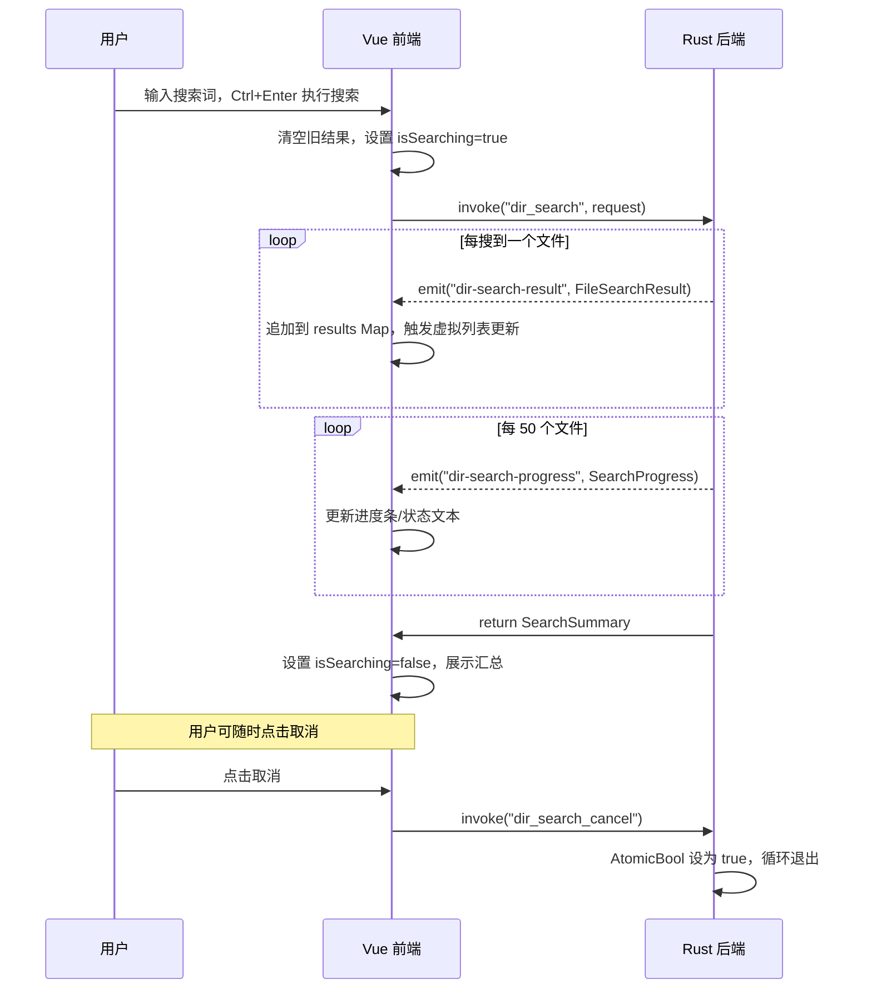

# 目录搜索工具 —— 技术设计方案

> **状态**: RFC (Request for Comments)
> **作者**: 咕咕
> **日期**: 2026-05-14
> **工具 ID**: `dir-search`
> **工具名称**: 目录搜索 / Dir Search

---

## 1. 需求背景

姐姐经常需要对特定目录下的文档进行批量搜索和替换，但单独开一个 VSCode 实例太重（插件太多、启动慢）。VSCode 搜索的核心其实是 `ripgrep` —— 而我们项目的 Rust 后端**已经引入了 ripgrep 的核心库 `ignore`**，可以直接利用。

**核心目标**：在 AIO Hub 中提供一个轻量级的"目录内容搜索与替换"工具，核心是"输入一个路径 → 搜索其中的文件内容"，后续可扩展为搜文件名等。

**设计决策**：

- **命名**：`dir-search`，强调"给定目录范围"而非"全系统搜索"
- **分离窗口**：工具自带全局分离功能，无需额外处理
- **快捷键**：暂不设全局快捷键，用的时候点进来即可
- **替换安全**：不做文件备份，替换操作通过二次确认弹窗保护

---

## 2. 调查发现

### 2.1 Rust 依赖现状（零新增依赖）

| 库                  | 版本 | 用途                                                                 | 已存在 |
| ------------------- | ---- | -------------------------------------------------------------------- | ------ |
| `ignore`            | 0.4  | ripgrep 核心 —— 高性能并行目录遍历，自动尊重 `.gitignore`，glob 过滤 | ✅     |
| `regex`             | 1    | Rust 正则引擎                                                        | ✅     |
| `walkdir`           | 2    | 递归目录遍历（备用）                                                 | ✅     |
| `content_inspector` | 0.2  | 文本/二进制内容检测，自动跳过二进制文件                              | ✅     |
| `rayon`             | 1.10 | 并行计算（可选，`ignore` 自带并行）                                  | ✅     |

**结论：不需要引入任何新的 Rust 依赖。**

### 2.2 项目模式参考

| 参考模块                                                                          | 可复用模式                                                                          | 优先级 |
| --------------------------------------------------------------------------------- | ----------------------------------------------------------------------------------- | ------ |
| [`directory_janitor.rs`](../../src-tauri/src/commands/directory_janitor.rs)       | 🥇 **主要骨架** — 事件流架构、`AtomicBool` 取消机制、`State<'_>` 注入模式、进度上报 | 主要   |
| [`llmchat_search.rs`](../../src-tauri/src/commands/llmchat_search.rs)             | 🥈 字节→字符偏移量转换（grapheme）、偏移量区间合并算法、预过滤优化模式              | 次要   |
| [`regex-applier`](../../src/tools/regex-applier/)                                 | 工具注册模式（`toolConfig` + `ToolRegistry`）、正则引擎前端逻辑                     | 参考   |
| [`events.rs`](../../src-tauri/src/events.rs)                                      | Tauri 事件结构体定义模式（`#[derive(Clone, Serialize)]`）                           | 参考   |
| [`content_deduplicator.rs`](../../src-tauri/src/commands/content_deduplicator.rs) | 多文件内容读取与比对逻辑                                                            | 参考   |

> **注意**：`llmchat_search.rs` 是"小数据集同步搜索"（一次性返回全部结果），架构模式**不适用于** dir-search 的"大目录流式搜索"场景。仅复用其中的具体技术细节。

---

## 3. 功能规格

### 3.1 核心功能（P0 - MVP）

| 功能                    | 描述                                                        |
| ----------------------- | ----------------------------------------------------------- |
| **目录选择**            | 顶部目录栏通过 Tauri 对话框或拖拽目录到输入框选择搜索根目录 |
| **文本搜索**            | 在指定目录下递归搜索匹配文本                                |
| **正则搜索**            | 支持 Rust regex 语法的正则表达式搜索                        |
| **大小写敏感**          | 可切换大小写敏感/不敏感模式                                 |
| **全词匹配**            | 可切换整词匹配模式                                          |
| **路径过滤（Include）** | glob 模式限定搜索范围，如 `*.md,*.txt`                      |
| **路径排除（Exclude）** | glob 模式排除目录/文件，如 `node_modules,*.lock`            |
| **结果树形展示**        | 按文件分组，展示匹配行号、行内容、高亮匹配片段              |
| **流式结果**            | 搜索过程中实时推送结果到前端，不阻塞 UI                     |
| **取消搜索**            | 随时中断正在进行的搜索                                      |
| **文件预览**            | 右栏预览面板展示文件全文，高亮匹配行和匹配词                |
| **打开文件**            | 右键/按钮调用系统默认编辑器打开文件（可选跳转到行号）       |

### 3.2 替换功能（P1）

| 功能           | 描述                                                     |
| -------------- | -------------------------------------------------------- |
| **单文件替换** | 替换单个文件中的所有匹配项                               |
| **全量替换**   | 一键替换所有文件中的匹配项                               |
| **替换预览**   | 替换前展示 diff 预览                                     |
| **二次确认**   | 替换操作前弹出确认对话框，显示影响范围（文件数、匹配数） |

### 3.3 增强功能（P2 - 后续迭代）

| 功能         | 描述                                        |
| ------------ | ------------------------------------------- |
| **搜索历史** | 记忆最近的搜索词和搜索目录                  |
| **预设保存** | 保存常用的搜索配置（如"搜索所有 Markdown"） |
| **上下文行** | 可配置匹配行上下的上下文行数                |
| **多根目录** | 同时搜索多个目录                            |
| **路径补全** | 目录输入框支持 Tab 路径补全                 |

---

## 4. 技术架构

### 4.1 整体架构

```
┌─────────────────────────────────────────────────┐
│                    Vue 前端                       │
│  ┌──────────┐  ┌──────────────┐  ┌────────────┐ │
│  │ SearchBar │  │ ResultsTree  │  │ FilePreview│ │
│  │ (搜索栏)  │  │ (虚拟滚动)   │  │ (文件预览) │ │
│  └─────┬─────┘  └──────┬───────┘  └────────────┘ │
│        │               │                          │
│  ┌─────┴───────────────┴───────────────────────┐ │
│  │              Composable Layer                │ │
│  │  useDirSearch() — 搜索状态 + 逻辑编排        │ │
│  └─────────────────────┬───────────────────────┘ │
│                        │ invoke / listen           │
├────────────────────────┼──────────────────────────┤
│                   Tauri IPC                        │
├────────────────────────┼──────────────────────────┤
│                    Rust 后端                       │
│  ┌─────────────────────┴───────────────────────┐ │
│  │           dir_search command                 │ │
│  │  ┌─────────┐  ┌──────────┐  ┌────────────┐ │ │
│  │  │ ignore  │  │  regex   │  │ content_   │ │ │
│  │  │ crate   │  │  crate   │  │ inspector  │ │ │
│  │  │(遍历+   │  │(正则匹配)│  │(跳过二进制)│ │ │
│  │  │ glob)   │  │          │  │            │ │ │
│  │  └─────────┘  └──────────┘  └────────────┘ │ │
│  └─────────────────────────────────────────────┘ │
└─────────────────────────────────────────────────┘
```

### 4.2 Rust 后端设计

#### 4.2.1 核心数据结构

```rust
// ===== 搜索请求 =====
#[derive(Debug, Deserialize)]
#[serde(rename_all = "camelCase")]
pub struct SearchRequest {
    /// 搜索根目录
    pub root_path: String,
    /// 搜索模式（文本内容）
    pub pattern: String,
    /// 是否使用正则表达式
    pub is_regex: bool,
    /// 是否大小写敏感
    pub case_sensitive: bool,
    /// 是否全词匹配
    pub whole_word: bool,
    /// 包含的 glob 模式列表，如 ["*.md", "*.txt"]
    pub include_globs: Vec<String>,
    /// 排除的 glob 模式列表，如 ["node_modules", "*.lock"]
    pub exclude_globs: Vec<String>,
    /// 匹配行的上下文行数（上下各几行）
    pub context_lines: Option<usize>,
    /// 最大结果数限制（防止内存爆炸）
    pub max_results: Option<usize>,
}

// ===== 单个匹配项 =====
#[derive(Debug, Clone, Serialize)]
#[serde(rename_all = "camelCase")]
pub struct SearchMatch {
    /// 匹配所在行号（1-based）
    pub line_number: usize,
    /// 行内容（完整的一行文本）
    pub line_content: String,
    /// 匹配在行内的起始字符偏移（char 索引，非字节偏移）
    /// 实现时需将 Rust regex 返回的字节偏移转换为 char 索引，
    /// 以适配前端 JS 的字符串操作。参考 llmchat_search.rs 的 grapheme 转换。
    pub match_start: usize,
    /// 匹配在行内的结束字符偏移（char 索引，非字节偏移）
    pub match_end: usize,
}

// ===== 单个文件的搜索结果（流式事件） =====
#[derive(Debug, Clone, Serialize)]
#[serde(rename_all = "camelCase")]
pub struct FileSearchResult {
    /// 文件绝对路径
    pub file_path: String,
    /// 文件相对于搜索根目录的路径（用于展示）
    pub relative_path: String,
    /// 该文件中的所有匹配
    pub matches: Vec<SearchMatch>,
}

// ===== 搜索进度事件 =====
#[derive(Debug, Clone, Serialize)]
#[serde(rename_all = "camelCase")]
pub struct SearchProgress {
    /// 已扫描的文件数
    pub files_scanned: usize,
    /// 已找到匹配的文件数
    pub files_matched: usize,
    /// 总匹配数
    pub total_matches: usize,
    /// 当前正在扫描的文件路径
    pub current_file: Option<String>,
}

// ===== 搜索完成汇总 =====
#[derive(Debug, Serialize)]
#[serde(rename_all = "camelCase")]
pub struct SearchSummary {
    /// 总扫描文件数
    pub files_scanned: usize,
    /// 包含匹配的文件数
    pub files_matched: usize,
    /// 总匹配数
    pub total_matches: usize,
    /// 搜索耗时（毫秒）
    pub duration_ms: f64,
    /// 是否被用户取消
    pub cancelled: bool,
}

// ===== 替换请求 =====
#[derive(Debug, Deserialize)]
#[serde(rename_all = "camelCase")]
pub struct ReplaceRequest {
    /// 要替换的文件路径列表（空 = 替换所有搜索结果）
    pub file_paths: Vec<String>,
    /// 搜索模式
    pub pattern: String,
    /// 替换文本
    pub replacement: String,
    /// 是否正则
    pub is_regex: bool,
    /// 是否大小写敏感
    pub case_sensitive: bool,
    /// 是否全词匹配
    pub whole_word: bool,
}

// ===== 替换结果 =====
#[derive(Debug, Serialize)]
#[serde(rename_all = "camelCase")]
pub struct ReplaceResult {
    /// 成功替换的文件数
    pub files_replaced: usize,
    /// 失败的文件数
    pub files_failed: usize,
    /// 总替换次数
    pub total_replacements: usize,
    /// 错误详情
    pub errors: Vec<ReplaceError>,
}

#[derive(Debug, Serialize)]
#[serde(rename_all = "camelCase")]
pub struct ReplaceError {
    pub file_path: String,
    pub error: String,
}
```

#### 4.2.2 核心搜索逻辑（伪代码）

```rust
#[tauri::command]
pub async fn dir_search(
    request: SearchRequest,
    window: tauri::Window,
    cancellation: State<'_, DirSearchCancellation>,
) -> Result<SearchSummary, String> {
    cancellation.reset();

    // 1. 构建 ignore::WalkBuilder
    let mut builder = WalkBuilder::new(&request.root_path);
    builder
        .hidden(false)           // 搜索隐藏文件
        .git_ignore(true)        // 尊重 .gitignore
        .git_global(true)        // 尊重全局 gitignore
        .git_exclude(true);      // 尊重 .git/info/exclude

    // 2. 应用 include/exclude glob 过滤
    for glob in &request.include_globs {
        // 使用 ignore::overrides::OverrideBuilder
        override_builder.add(glob)?;
    }
    for glob in &request.exclude_globs {
        override_builder.add(&format!("!{}", glob))?;
    }
    builder.overrides(override_builder.build()?);

    // 3. 构建正则/文本匹配器
    let matcher = build_matcher(&request)?;

    // 4. 遍历文件并搜索
    for entry in builder.build() {
        if cancellation.is_cancelled() { break; }

        let entry = entry?;
        if !entry.file_type().map_or(false, |ft| ft.is_file()) { continue; }

        // 跳过二进制文件
        let content = fs::read(&entry.path())?;
        if content_inspector::inspect(&content).is_binary() { continue; }

        // 逐行搜索
        let matches = search_in_content(&content, &matcher);

        if !matches.is_empty() {
            // 流式发送：每个文件的结果立即推给前端
            window.emit("dir-search-result", FileSearchResult {
                file_path: entry.path().to_string_lossy().to_string(),
                relative_path: /* ... */,
                matches,
            })?;
        }

        // 定期发送进度
        if files_scanned % 50 == 0 {
            window.emit("dir-search-progress", SearchProgress { ... })?;
        }
    }

    // 5. 返回汇总
    Ok(SearchSummary { ... })
}
```

#### 4.2.3 Tauri 命令清单

| 命令                  | 功能                           | 事件                                       |
| --------------------- | ------------------------------ | ------------------------------------------ |
| `dir_search`          | 执行搜索，流式返回结果         | `dir-search-result`, `dir-search-progress` |
| `dir_search_cancel`   | 取消正在进行的搜索             | —                                          |
| `dir_replace`         | 执行批量替换（P1）             | `dir-replace-progress`                     |
| `dir_replace_preview` | 获取替换预览，不实际修改（P1） | —                                          |
| `open_file_in_editor` | 用系统默认编辑器打开文件       | —                                          |

### 4.3 前端设计

#### 4.3.1 目录结构

```
src/tools/dir-search/
├── DirSearch.vue                  # 主 UI 组件（顶部目录栏 + 左右分栏编排）
├── dir-search.registry.ts         # 工具注册
├── types.ts                       # 类型定义
├── components/
│   ├── DirectoryBar.vue           # 顶部目录输入栏（拖放支持）
│   ├── SearchPanel.vue            # 左栏主容器（搜索输入 + 结果列表）
│   ├── SearchInput.vue            # 搜索/替换输入区（模式切换、过滤器）
│   ├── ResultsTree.vue            # 搜索结果树形列表（虚拟滚动）
│   ├── ResultItem.vue             # 单条匹配结果行（高亮渲染）
│   ├── FilePreview.vue            # 右栏文件预览面板（代码高亮 + 行号定位）
│   └── ReplaceBar.vue             # 替换输入区（P1，内嵌于 SearchInput）
├── composables/
│   ├── useDirSearch.ts            # 核心搜索逻辑编排
│   ├── useDirSearchUiState.ts     # UI 状态持久化（分栏宽度、折叠状态）
│   └── useSearchHistory.ts        # 搜索历史管理（P2）
├── stores/
│   └── store.ts                   # Pinia 状态管理
└── config/
    └── defaults.ts                # 默认配置
```

#### 4.3.2 UI 布局

采用**顶部目录栏 + 左右分栏**布局，左栏为搜索面板（可拖拽宽度、可折叠），右栏为文件预览区。

布局模式参考 [`LlmChat.vue`](../../src/tools/llm-chat/LlmChat.vue) 和 [`SmartOcr.vue`](../../src/tools/smart-ocr/SmartOcr.vue) 的成熟分栏实现。

```
┌──────────────────────────────────────────────────────────────────┐
│  📁 目录栏 (DirectoryBar)                        [选择目录]       │
│  ┌───────────────────────────────────────────────────────────┐   │
│  │ D:/projects/my-app                          (支持拖放目录) │   │
│  └───────────────────────────────────────────────────────────┘   │
├────────────────────────┬─────────────────────────────────────────┤
│  搜索面板 (SearchPanel) │← 拖拽 →│  文件预览 (FilePreview)         │
│                        │         │                                │
│  ┌──────────────────┐  │         │  📄 src/utils/helper.ts         │
│  │ 搜索内容... [Aa][.*][W] │  │         │  ─────────────────────────── │
│  └──────────────────┘  │         │   10 │ import { foo } from "bar";  │
│  ┌──────────────────┐  │         │   11 │                             │
│  │ 替换为...   [替换] │  │         │   12 │ const r = searchText();  │
│  └──────────────────┘  │         │   13 │ // next line                │
│  包含: *.md, *.txt     │         │   ...                            │
│  排除: node_modules    │         │   45 │ // optimize search logic │
│  ──────────────────── │         │   46 │ function process() {        │
│  结果 128个 · 32文件 · 45ms│         │   ...                            │
│                        │         │   78 │ return searchResults();  │
│  ▼ 📄 helper.ts (5)   │         │   79 │ }                           │
│   12 │ ..searchText.. │         │                                │
│   45 │ ..search log.. │         │                                │
│   78 │ ..searchRes..  │         │                                │
│                        │         │                                │
│  ▼ 📄 usage.md (3)    │         │                                │
│   5  │ ..search fea.. │         │                                │
│   12 │ ..search bar.. │         │                                │
│                        │         │                                │
│  ▶ 📄 Nav.vue (2)     │         │                                │
│  ▶ 📄 README.md (1)   │         │                                │
│  ← 可折叠              │         │                                │
└────────────────────────┴─────────────────────────────────────────┘
```

#### 4.3.3 布局交互细节

**顶部目录栏 (`DirectoryBar`)**：

- 始终固定在最顶部，不参与分栏
- 支持 **拖放目录**（dragover/drop 事件 → Tauri 路径解析）
- 右侧 [📁 选择目录] 按钮调用 Tauri `dialog.open({ directory: true })`
- 路径输入框支持手动编辑、Tab 补全（P2）

**左栏搜索面板 (`SearchPanel`)**：

- **可拖拽宽度**：通过右侧 `resize-handle` 拖拽调整，范围 280~600px，默认 360px
- **可折叠/展开**：使用项目标准 `SidebarToggleIcon` 组件，折叠后左侧显示梯形展开按钮
- **宽度和折叠状态持久化**：通过 `useDirSearchUiState()` composable 保存到 AppData
- 搜索输入 + 过滤器 + 结果列表从上到下依次排列
- 结果列表占据剩余高度，使用虚拟滚动

**右栏文件预览 (`FilePreview`)**：

- 占据左栏右侧的全部剩余空间（`flex: 1`）
- 点击左栏搜索结果的某行 → 右栏加载对应文件 → 自动滚动到匹配行
- 文件内容使用 CodeMirror/Monaco 只读模式渲染（复用项目的 `RichCodeEditor`）
- 匹配行高亮（行背景色 + 行内匹配词高亮）
- 未选择文件时显示空状态占位图

**分栏拖拽实现（复用项目成熟模式）**：

```
参考实现：LlmChat.vue 第 60~118 行
- mousedown → 记录起始位置和起始宽度
- document.mousemove → 计算 delta，clamp 到 min/max
- document.mouseup → 清除拖拽状态
- 拖拽时设置 document.body.style.cursor='col-resize' + userSelect='none'
```

#### 4.3.4 关键 UI 要素

- **搜索栏三按钮**：`[Aa]` 大小写敏感、`[.*]` 正则模式、`[W]` 全词匹配 —— 与 VSCode 一致
- **虚拟滚动**：结果列表使用虚拟滚动，支持 10 万+ 匹配项不卡顿
- **匹配高亮**：参考 [`SessionItem.vue`](../../src/tools/llm-chat/components/sidebar/SessionItem.vue) 的高亮模式
  - 后端返回 `match_start` / `match_end` 偏移量
  - 前端拆分为 `HighlightPart[]`（`{ text, isMatch }`）
  - 渲染：`<span v-if="part.isMatch" class="highlight">{{ part.text }}</span>`
  - 高亮样式：`color: var(--primary-color); background: rgba(var(--primary-color-rgb), 0.15)`
- **文件折叠**：文件节点可折叠/展开，显示匹配数
- **Ctrl+Enter 执行搜索**：搜索输入框默认支持多行（Enter 换行，Ctrl+Enter 执行搜索）
- **文件预览联动**：点击结果行 → 右栏打开文件并定位到对应行号

#### 4.3.5 状态管理（Pinia Store）

```typescript
interface DirSearchState {
  // 搜索参数
  rootPath: string;
  pattern: string;
  replacement: string;
  isRegex: boolean;
  caseSensitive: boolean;
  wholeWord: boolean;
  includeGlobs: string; // 逗号分隔的 glob
  excludeGlobs: string; // 逗号分隔的 glob

  // 搜索状态
  isSearching: boolean;
  results: Map<string, FileSearchResult>; // filePath -> result
  summary: SearchSummary | null;
  progress: SearchProgress | null;

  // UI 状态
  expandedFiles: Set<string>; // 展开的文件路径
  showReplace: boolean; // 是否显示替换栏
}
```

### 4.4 流式搜索的通信时序



---

## 5. 实施计划

### Phase 1：MVP 搜索（预计 3-4 小时）

| 步骤 | 内容                                                                                       |
| ---- | ------------------------------------------------------------------------------------------ |
| 1.1  | Rust：创建 `src-tauri/src/commands/dir_search.rs`，实现 `dir_search` + `dir_search_cancel` |
| 1.2  | Rust：在 `commands.rs` 注册模块，在 `lib.rs` 注册命令和 State                              |
| 1.3  | Rust：在 `events.rs` 添加搜索事件结构体                                                    |
| 1.4  | 前端：创建 `src/tools/dir-search/` 目录结构                                                |
| 1.5  | 前端：实现 `types.ts` 类型定义                                                             |
| 1.6  | 前端：实现 `dir-search.registry.ts` 工具注册                                               |
| 1.7  | 前端：实现 `useDirSearch.ts` composable                                                    |
| 1.8  | 前端：实现 `DirectoryBar.vue` 顶部目录输入栏（含拖放）                                     |
| 1.9  | 前端：实现 `SearchInput.vue` 搜索/替换输入区                                               |
| 1.10 | 前端：实现 `ResultItem.vue` 单条匹配高亮渲染                                               |
| 1.11 | 前端：实现 `ResultsTree.vue` 结果列表（带虚拟滚动）                                        |
| 1.12 | 前端：实现 `SearchPanel.vue` 左栏容器                                                      |
| 1.13 | 前端：实现 `FilePreview.vue` 右栏文件预览面板                                              |
| 1.14 | 前端：实现 `useDirSearchUiState.ts` UI 状态持久化                                          |
| 1.15 | 前端：实现 `DirSearch.vue` 主布局（顶部栏 + 左右分栏 + 拖拽/折叠）                         |
| 1.16 | 在 `src/config/tools.ts` 添加排序                                                          |

### Phase 2：替换功能（预计 2 小时）

| 步骤 | 内容                                             |
| ---- | ------------------------------------------------ |
| 2.1  | Rust：实现 `dir_replace` + `dir_replace_preview` |
| 2.2  | 前端：实现 `ReplaceBar.vue`（含二次确认弹窗）    |
| 2.3  | 前端：在结果列表中添加单文件替换/全部替换操作    |

### Phase 3：增强体验（按需）

| 步骤 | 内容                                 |
| ---- | ------------------------------------ |
| 3.1  | 搜索历史持久化                       |
| 3.2  | 搜索预设保存                         |
| 3.3  | 目录输入 Tab 路径补全                |
| 3.4  | Agent 服务注册（暴露搜索能力给 LLM） |

---

## 6. 性能考量

| 关注点         | 策略                                                                            |
| -------------- | ------------------------------------------------------------------------------- |
| **大目录遍历** | `ignore` crate 自带并行遍历（基于 `crossbeam`），自动跳过 `.gitignore` 中的文件 |
| **二进制文件** | 使用 `content_inspector` 在读取前几字节后判断，跳过二进制文件                   |
| **海量结果**   | 前端使用虚拟滚动；后端设置 `max_results` 上限（默认 10,000）                    |
| **大文件**     | 对单文件大小设上限（默认 5MB），超过的文件跳过并在日志中提示                    |
| **内存**       | 流式处理，逐文件读取，不将所有文件内容同时加载到内存                            |
| **取消响应**   | `AtomicBool` 在每个文件遍历循环中检查，确保毫秒级响应                           |

---

## 6.1 实现注意事项

以下是基于对项目现有代码（特别是 `llmchat_search.rs` 和 `directory_janitor.rs`）调查后总结的关键实现细节：

### 6.1.1 偏移量：字节 → 字符转换

Rust `regex` crate 返回的 `Match.start()` / `Match.end()` 是**字节偏移**，而前端 JavaScript 的 `String.slice()` 操作的是 **char 索引**。对于包含中文、emoji 等多字节字符的文本，如果不转换会导致高亮错位。

**推荐实现**（参考 [`llmchat_search.rs` 第 246-248 行](../../src-tauri/src/commands/llmchat_search.rs)）：

```rust
// 方案 A：chars 级别（对逐行搜索场景已足够）
let match_start = line[..mat.start()].chars().count();
let match_end = match_start + line[mat.start()..mat.end()].chars().count();

// 方案 B：grapheme 级别（处理组合 emoji 更精确，需 unicode-segmentation crate）
use unicode_segmentation::UnicodeSegmentation;
let match_start = line[..mat.start()].graphemes(true).count();
let match_end = match_start + line[mat.start()..mat.end()].graphemes(true).count();
```

dir-search 是逐行搜索（行内容较短），**方案 A（chars）已经足够**，无需引入 grapheme 级别的复杂度。

### 6.1.2 多匹配项偏移量合并

当一行中存在多个匹配项且可能重叠时（例如正则 `a|ab` 匹配 "abc"），需要合并重叠区间。经典算法（参考 [`llmchat_search.rs` 第 253-266 行](../../src-tauri/src/commands/llmchat_search.rs)）：

```rust
match_offsets.sort_by_key(|m| m.0);
let mut merged = Vec::new();
if let Some(first) = match_offsets.first().copied() {
    let mut current = first;
    for &next in &match_offsets[1..] {
        if next.0 <= current.1 {
            current.1 = current.1.max(next.1);
        } else {
            merged.push(current);
            current = next;
        }
    }
    merged.push(current);
}
```

### 6.1.3 事件结构体注册

搜索相关的事件结构体（`DirSearchResult`、`DirSearchProgress`）应在 [`events.rs`](../../src-tauri/src/events.rs) 中统一定义，与现有的 `DirectoryScanProgress` 保持一致的组织模式。

### 6.1.4 预过滤优化（可选）

`llmchat_search.rs` 使用"全文粗筛 → 细致解析"的两阶段策略。dir-search 可以考虑类似思路：先对文件全文做一次 `regex.is_match(&content)` 粗筛，不匹配直接跳过逐行搜索。但需要权衡：

- ✅ 好处：大量不匹配文件可以快速跳过
- ⚠️ 代价：匹配的文件会被读取两遍（全文筛 + 逐行搜索）

对于 `ignore` crate 的并行遍历场景，逐行搜索本身已经很快（遇到第一个匹配就知道这个文件有结果），预过滤的净收益取决于"匹配文件占比"。**建议 MVP 阶段不做预过滤**，后续根据性能测试再决定。

---

## 7. 与现有工具的关系

| 现有工具              | 关系                                                                                                                                                                                      |
| --------------------- | ----------------------------------------------------------------------------------------------------------------------------------------------------------------------------------------- |
| **regex-applier**     | regex-applier 专注于"规则预设 + 文本/文件内容替换"；dir-search 专注于"跨目录搜索 + 交互式浏览"。两者定位不同，不合并。但后续可考虑在 dir-search 中引用 regex-applier 的预设来做批量替换。 |
| **directory-janitor** | 共享 Rust 端的"目录扫描 + 事件流 + 取消"模式，但不共享代码（职责不同）。                                                                                                                  |
| **text-diff**         | 替换预览功能可复用 text-diff 的 diff 渲染逻辑。                                                                                                                                           |

---

## 8. 已确认的设计决策

| 问题       | 决策                                         |
| ---------- | -------------------------------------------- |
| 工具命名   | `dir-search`，显示名"目录搜索"               |
| 分离窗口   | 工具自带全局分离功能，无需额外处理           |
| 全局快捷键 | 暂不设置，用的时候点进来即可                 |
| 替换安全   | 不做文件备份，替换操作通过二次确认弹窗保护   |
| 扩展性     | 核心是"输入路径"，后续可扩展为搜文件名等模式 |
