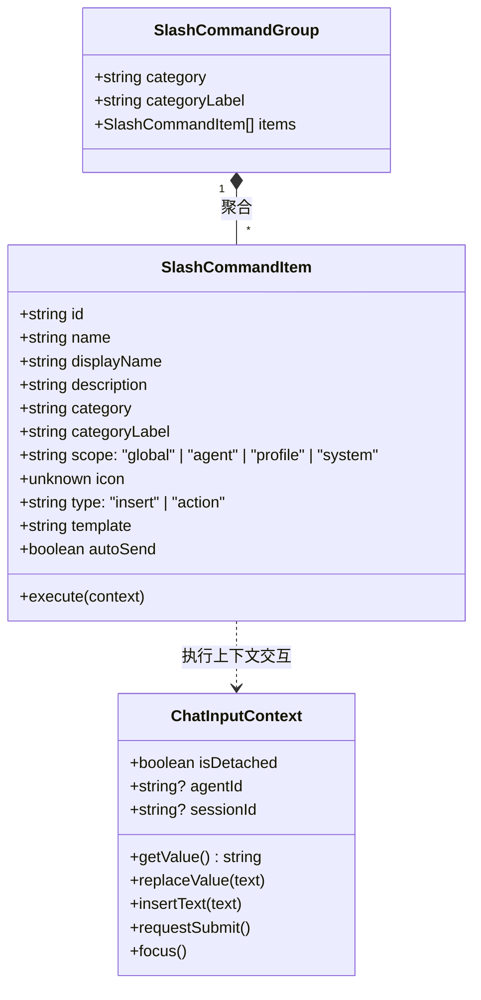
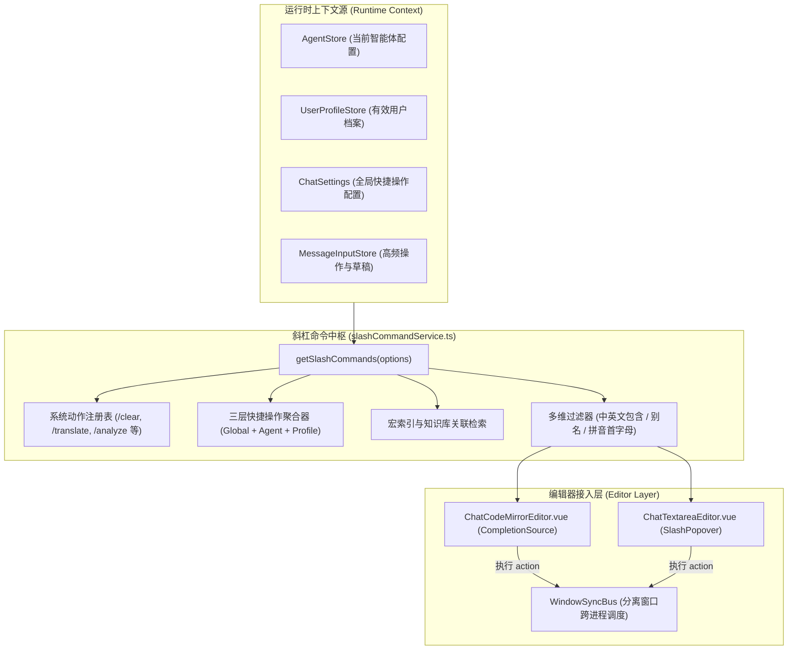

# LLM 聊天斜杠命令与自定义装配种类系统设计 (Slash Command System Design)

> 文档状态：RFC / Implementing  
> 责任模块：`src/tools/llm-chat`  
> 关联文档：[`docs/Plan/user-feedback-todo-plan-2026-09-30.md`](../Plan/user-feedback-todo-plan-2026-09-30.md)  
> 负责人：咕咕 (Architect)

---

## 1. 背景与深度调研分析

### 1.1 现状与问题反思

在前版斜杠命令设计中，过多套用了业界 Web 端产品（如 Discord、Notion、Cursor）的泛化概念（如抽象的 `role`、`format`、`workflow` 分类，以及脱离实际的 `/retry`、`/branch` 占位指令），缺乏对 AIO Hub `llm-chat` 运行时架构和工程能力的实际调研：

1. **快捷操作（Quick Actions）体系被降级割裂**：
   - 实际运行态中，快捷操作是由 **Global（全局设置） + Agent（当前智能体专属） + UserProfile（当前生效用户档案）** 三层动态合并计算而来的（见 [`src/tools/llm-chat/components/message-input/MessageInputToolbar.vue`](../../src/tools/llm-chat/components/message-input/MessageInputToolbar.vue:138)）。
   - 快捷操作的执行并非静态模板插入，而是带有由 [`MacroProcessor`](../../src/tools/llm-chat/macro-engine/MacroProcessor.ts:1) 处理的动态宏上下文（注入选区/输入框内容的 `context.input`、`userName`、`charName`、会话索引等）以及行级正则后处理（`lineProcessing`，见 [`src/tools/llm-chat/stores/messageInputStore.ts`](../../src/tools/llm-chat/stores/messageInputStore.ts:382)）。
   - 此前设计仅简单遍历全局启用的 `quickActionSets` 做纯文本替换，导致智能体专属指令丢失、宏计算失效、行处理失效。
2. **高频核心系统操作严重缺席**：
   - AIO Hub 输入区具备大量高价值但藏在二级菜单里的工具动作，包括：
     - **上下文分析器**：[`handleAnalyzeContextWithInput()`](../../src/tools/llm-chat/stores/messageInputStore.ts:479)（预览 Token 统计、注入层与 System Prompt）。
     - **输入即时翻译**：[`handleTranslateInput()`](../../src/tools/llm-chat/stores/messageInputStore.ts:637)（选中内容或全文即时翻译并替换/追加）。
     - **上下文手动压缩**：[`handleCompressContext()`](../../src/tools/llm-chat/stores/messageInputStore.ts:674)（提取摘要压缩历史会话）。
     - **路径转附件**：[`handleConvertPaths()`](../../src/tools/llm-chat/stores/messageInputStore.ts:701)（粘贴本地路径/QQ聊天记录后一键转换为安全 Asset 附件）。
     - **多模态转写与 OCR**：[`handleSmartTranscribeAll()`](../../src/tools/llm-chat/stores/messageInputStore.ts:602) / [`handleForceTranscribeAll()`](../../src/tools/llm-chat/stores/messageInputStore.ts:618)。
     - **临时模型切换与清理**：[`handleSelectTemporaryModel()`](../../src/tools/llm-chat/stores/messageInputStore.ts:195) / [`clearTemporaryModel()`](../../src/tools/llm-chat/stores/messageInputStore.ts:724)。
     - **草稿剪贴板流转**：[`handleCutDraft()`](../../src/tools/llm-chat/stores/messageInputStore.ts:730) / [`handlePasteDraft()`](../../src/tools/llm-chat/stores/messageInputStore.ts:734)。
   - 原设计仅有孤立的 `/clear`，未能将上述核心能力整合进键盘流。
3. **多窗口/分离窗口架构（Detached Window）未适配**：
   - `MessageInput` 和 `ChatArea` 均支持从主窗口分离为独立悬浮窗（[`useDetachedChatInput.ts`](../../src/tools/llm-chat/composables/ui/useDetachedChatInput.ts:15)）。
   - 在分离窗口中，部分动作（如打开模型选择对话框、切换会话、打开设置等）必须通过 [`useWindowSyncBus()`](../../src/composables/useWindowSyncBus.ts:1) 经由 IPC 代理到主窗口执行，不能假设直接操作当前 DOM。
4. **与宏补全（`{{`）缺乏统一规划**：
   - 系统既有 `{{` 宏补全引擎（[`macroCompletionSource`](../../src/tools/llm-chat/components/message-input/ChatCodeMirrorEditor.vue:143)），斜杠系统应与之平滑互补，且支持在斜杠候选中快速检索宏变量与显式知识库引用。

### 1.2 核心设计目标

- **键盘流全功能整合**：键入 `/` 即可快速检索系统操作、多级快捷操作组、宏模板与核心辅助功能，无需脱离键盘点击工具栏小图标。
- **真实三层装配分类 (Assembly Categories)**：
  - `system`（系统与工具操作）：清空、翻译、压缩、分析、路径转附件、转写、草稿管理。
  - `model`（模型与通道）：单轮临时模型覆盖、续写模型切换、流式切换。
  - `quick-action`（快捷操作组）：由当前上下文的 **Global + Agent + UserProfile** 动态聚合，每个组对应一个装配种类，保留完整的宏引擎动态求值与逐行正则后处理。
  - `macro`（动态宏指令）：常用系统与时间宏的直接候选。
  - `knowledge`（知识库显式检索）：检索并插入当前 Agent 绑定的 Knowledge Base 引用。
- **原生支持中文与多别名 (Aliases)**：原生中文指令名、首字母缩写、英文别名并重，全面兼容 IME Composition 状态。
- **双引擎编辑器对齐**：完全适配 `ChatCodeMirrorEditor`（原生 CompletionSource 驱动）与 `ChatTextareaEditor`（绝对定位轻量浮层）。
- **多窗口架构自适应**：执行上下文感知 `isDetached` 状态，必要时自动转发至主窗口执行。

---

## 2. 概念模型与领域设计



### 2.1 装配种类体系 (Assembly Category Architecture)

结合 AIO Hub 本地能力，装配种类明确划分为 5 大类别：

1. **`system`（系统与编辑工具）**：
   - `/clear` (清空输入框)
   - `/translate` (翻译输入框/选区文本)
   - `/compress` (手动执行上下文压缩)
   - `/analyze` (打开当前输入与会话的上下文分析器)
   - `/path2file` (本地路径一键转换为附件)
   - `/transcribe` (触发附件转写/OCR)
   - `/cut-draft` / `/paste-draft` (跨会话草稿流转)
2. **`model`（模型与生成配置）**：
   - `/model` (选择临时模型，支持快捷清除)
   - `/stream` (切换打字机流式开关)
3. **`quick-action`（动态快捷操作种类）**：
   - 种类 ID 对应快捷操作组 ID（如 `qa-code-review`），种类标签对应组名（如“代码审校”）。
   - 继承三层作用域（当前生效 Agent 专属组 + 当前有效 UserProfile 专属组 + 全局组）。
   - 执行时自动传递光标选区，送入 `MacroProcessor` 注入 `context.input` 并执行 `lineProcessing`。
4. **`knowledge`（知识库引用）**：
   - 针对当前 Agent 关联的 Knowledge Base 条目，快速生成 `【kb::...】` 显式查询语法。
5. **`macro`（动态宏变量速查）**：
   - 快速填入常用占位符（如 `{{date}}`、`{{user}}`、`{{clipboard}}`）。

### 2.2 核心接口契约 ([`src/tools/llm-chat/types/slash-command.ts`](../../src/tools/llm-chat/types/slash-command.ts))

```typescript
export type SlashCommandCategory =
  | "system" // 系统与编辑工具
  | "model" // 模型与推理设置
  | "quick-action" // 快捷操作装配组
  | "knowledge" // 知识库引用
  | "macro"; // 宏与变量

export interface ChatInputContext {
  getValue(): string;
  replaceValue(text: string): void;
  insertText(text: string, from?: number, to?: number): void;
  requestSubmit(): void;
  focus(): void;
  /** 是否处于分离悬浮窗口中 */
  isDetached?: boolean;
  /** 当前生效的 Agent ID */
  agentId?: string;
  /** 当前所属会话 ID */
  sessionId?: string;
}

export interface SlashCommandItem {
  id: string;
  /** 原生支持中文名称（如 "清空"、"翻译"、"代码审校"） */
  name: string;
  /** 别名列表，支持英文缩写、拼音首字母等（如 ["clear", "qk"]） */
  aliases?: string[];
  displayName: string;
  description: string;
  category: string;
  categoryLabel?: string;
  /** 来源作用域 */
  scope?: "global" | "agent" | "profile" | "system";
  icon?: unknown;
  type: "insert" | "action";
  template?: string;
  autoSend?: boolean;
  execute?: (context: ChatInputContext) => Promise<void> | void;
}

export interface SlashCommandGroup {
  category: string;
  categoryLabel: string;
  items: SlashCommandItem[];
}
```

---

## 3. 系统架构与数据流



### 3.1 三层快捷操作组聚合逻辑

为了与工具栏 [`MessageInputToolbar.vue:138`](../../src/tools/llm-chat/components/message-input/MessageInputToolbar.vue:138) 保持完全一致的业务逻辑：

1. **收集三层关联 ID**：
   - 全局 ID：`chatSettings.quickActionSetIds || []`
   - Agent 专属 ID：`currentAgent.quickActionSetIds || []`
   - Profile 专属 ID：`effectiveProfile.quickActionSetIds || []`
2. **去重并加载**：通过 `quickActionStore.ensureSetsLoaded(allIds)` 确保数据就绪。
3. **转换为装配种类条目**：
   - 每个 Action 转换为一条 `insert` 型指令。
   - 标注 `scope`（显示 `[全局]`、`[智能体]` 或 `[档案]` 标签）。
   - 在执行插入时，委托调用 [`inputStore.handleQuickAction(action)`](../../src/tools/llm-chat/stores/messageInputStore.ts:368)，完整保留宏替换和行正则处理。

### 3.2 系统高频动作映射表

| 命令 (`name`) | 别名 (`aliases`)   | 显示名称         | 说明                                           | 对应运行时 Action                            |
| :------------ | :----------------- | :--------------- | :--------------------------------------------- | :------------------------------------------- |
| `清空`        | `clear`, `qk`      | 清空输入框       | 清空当前输入框全部内容与草稿                   | `context.replaceValue("")`                   |
| `翻译`        | `translate`, `fy`  | 翻译输入         | 对输入框选区或全文执行即时中英互译             | `inputStore.handleTranslateInput()`          |
| `压缩`        | `compress`, `ys`   | 压缩上下文       | 对当前历史对话发起智能上下文压缩               | `inputStore.handleCompressContext()`         |
| `分析`        | `analyze`, `fx`    | 上下文分析器     | 预览当前输入拼装后的完整 LLM 请求与 Token 构成 | `inputStore.handleAnalyzeContextWithInput()` |
| `路径转附件`  | `path2file`, `lj`  | 路径转附件       | 扫描并提取输入文本中的本地文件/图片为附件      | `inputStore.handleConvertPaths()`            |
| `智能转写`    | `transcribe`, `zx` | 智能转写全部附件 | 调度 OCR 与音视频模型转写输入附件              | `inputStore.handleSmartTranscribeAll()`      |
| `临时模型`    | `model`, `ls`      | 指定临时模型     | 覆盖当前单轮对话模型（支持随时清除）           | `inputStore.handleSelectTemporaryModel()`    |
| `剪切草稿`    | `cut-draft`        | 剪切全局草稿     | 将输入框草稿剪切到跨会话全局剪贴板             | `inputStore.handleCutDraft()`                |
| `粘贴草稿`    | `paste-draft`      | 粘贴全局草稿     | 从全局剪贴板恢复草稿内容与附件                 | `inputStore.handlePasteDraft()`              |

---

## 4. 编辑器交互与 IME 深度适配细节

### 4.1 触发与分词规则

- **触发前缀判断**：斜杠必须位于**行首或空白字符之后**，使用 Unicode 兼容正则匹配 `/(?:^|\s)\/([^\s/]*)$/u`。避免在 URL（如 `https://...`）或本地路径中误唤起补全。
- **拼音输入法屏障 (IME Composition Barrier)**：
  - 在 `compositionstart` 到 `compositionend` 阶段，补全引擎保持挂起或静默模式，禁止拦截用户的选词数字键（`1`~`9`）或空格键。
  - 在 `compositionend` 触发后，立即使用最终提交的汉字执行二次匹配。
- **快捷键规范**：
  - 发送操作**严禁**使用单回车，必须遵循全仓库规范使用 `Ctrl + Enter`。
  - 斜杠命令弹窗选项的激活选择由 `Enter` 或 `Tab` 触发；`Escape` 键立即隐藏浮层。

### 4.2 分离窗口 (Detached Window) 桥接

当 `context.isDetached === true` 时，涉及全局弹窗的操作（如打开高级设置、打开模型选择器）通过 `useWindowSyncBus` 派发：

```typescript
if (context.isDetached) {
  bus.requestAction("llm-chat:select-temporary-model", {});
  customMessage.info("正在主窗口中打开模型选择器...");
} else {
  inputStore.handleSelectTemporaryModel();
}
```

---

## 5. 样式与视觉规范

严格遵循 [`theme-appearance.md`](../../.kilocode/rules/theme-appearance.md) 与 [`semantic-decoration.md`](../../.kilocode/rules/semantic-decoration.md)：

1. **背景质感**：
   - 补全下拉弹层统一使用 `background-color: var(--container-bg);` 与 `backdrop-filter: blur(var(--ui-blur));`。
2. **候选条目设计**：
   - 高度统一、紧凑排版。
   - 禁止在条目左侧增加粗描边（低面积装饰原则）。
   - 作用域与种类采用小型 Tag 胶囊展示（如 `系统`、`智能体`、`全局`），文字颜色使用 `var(--text-color)` 与 `var(--text-color-secondary)`。
   - 选中高亮采用 `background-color: var(--el-fill-color-light);` 配合主色前景色。

---

## 6. 演进与落地计划

1. **Phase 1 (中枢服务与三层聚合重构)**：
   - 重构 [`src/tools/llm-chat/services/slashCommandService.ts`](../../src/tools/llm-chat/services/slashCommandService.ts)，实现上述原生系统动作注册表与三层快捷操作聚合。
   - 支持中英文别名匹配与拼音首字母过滤。
2. **Phase 2 (双编辑器接入与执行联动)**：
   - 更新 `ChatCodeMirrorEditor.vue` 补全源，接入宏引擎执行与分离窗口代理。
   - 完善 `ChatTextareaEditor.vue` 的轻量浮层定位与快捷键响应。
3. **Phase 3 (实机走查与测试验证)**：
   - 验证主窗口与分离窗口下的各种指令行为。
   - 验证拼音输入法输入 `/ceshi` 时的上屏稳定性。
