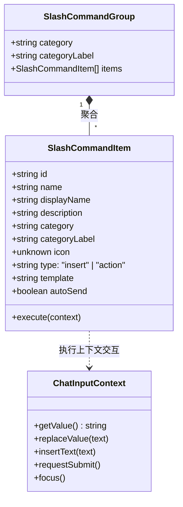
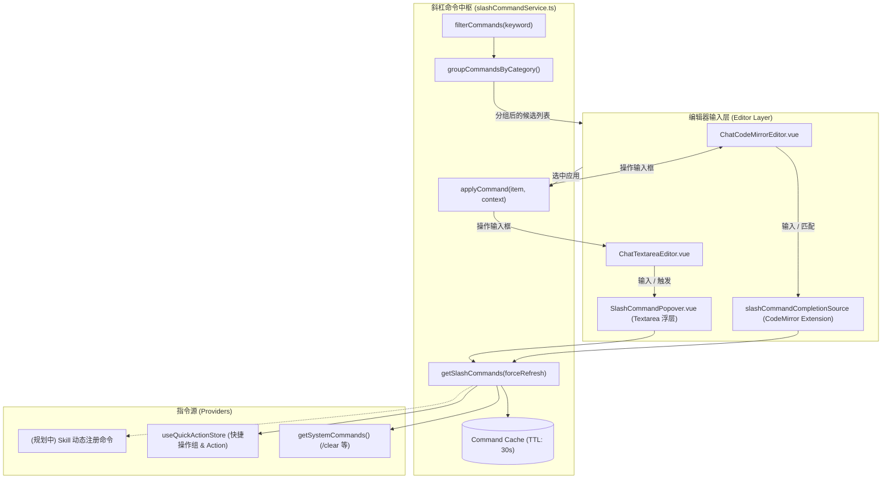

# LLM 聊天斜杠命令与自定义装配种类系统设计 (Slash Command System Design)

> 文档状态：RFC / Implementing  
> 责任模块：`src/tools/llm-chat`  
> 关联文档：[`docs/Plan/user-feedback-todo-plan-2026-09-30.md`](../Plan/user-feedback-todo-plan-2026-09-30.md)  
> 负责人：咕咕 (Architect)

---

## 1. 背景与设计目标

### 1.1 背景现状

在目前的 `llm-chat` 对话模块中：

1. **宏补全已有雏形**：输入 `{{` 时可唤起系统内置宏与上下文宏列表（基于 `macroCompletionSource`）。
2. **快捷操作散落在外**：存在基于分组管理的快捷操作（Quick Actions），但用户必须离开键盘、在面板中寻找并点击才能发送或填入。
3. **缺乏沉浸式斜杠指令**：现代对话与代码编辑器普遍采用以 `/` 驱动的统一操作入口。用户缺乏一种无需脱离键盘、输入 `/` 即可快速检索系统动作、人设设定、输出规范或多步思考框架的交互方式。

### 1.2 核心目标

- **全面原生支持中文命令**：
  - **命令名中文化**：指令名（`name`）原生支持纯中文、英文或中英混排（例如 `/清空`、`/润色`、`/代码审校`、`/clear`），完全契合中文用户与设计/产品人员的使用习惯。
  - **中英文别名机制 (Aliases)**：每条命令均可声明别名列表（例如 `name: "清空"`, `aliases: ["clear", "qk"]`），无论键入 `/清空` 还是 `/clear` 均能准确定位。
  - **输入法 (IME) 深度兼容**：在拼音或五笔输入法未确认提交（Composition 状态）时优雅响应，不发生打断或误吞首字符。
- **键盘流体验**：键入 `/` 立即弹出轻量补全浮层，支持拼音、中文包含、英文名模糊过滤，回车或 Tab 快速应用。
- **自定义装配种类 (Assembly Categories)**：支持用户与系统按业务职能对指令与片段进行分类（如角色设定、工作流、格式规范、系统操作），分类清晰且具备视觉标识。
- **双模态指令执行**：
  - `insert` 型：将模板内容填入光标处，与现有 `{{宏}}` 引擎无缝配合（支持配置自动发送）。
  - `action` 型：直接执行前端操作（如 `/clear` 清空输入框、未来可扩展 `/retry`、`/branch`、`/compact`）。
- **双编辑器架构适配**：兼容 `ChatCodeMirrorEditor`（原生 CompletionSource 驱动）与 `ChatTextareaEditor`（通用定位浮层）。
- **零额外存储心智负担**：直接复用并扩展已有的快捷操作组（Quick Actions），每个组天然对应一个自定义装配种类，用户无需学习第二套管理后台。

---

## 2. 概念模型与领域设计



### 2.1 装配种类 (Assembly Category)

系统内置核心种类与用户自定义扩展：

- `system`：系统操作（清空、重试、压缩上下文等）。
- `role` / `character`：角色扮演与系统人设（如编程助手、辩论对手、创意文案）。
- `format` / `output`：输出格式规范（Markdown 表格、JSON Schema、Mermaid 架构图）。
- `workflow` / `step`：多步思考框架（COT 深度推演、红蓝对抗审校、测试用例推导）。
- `prompt` / `custom`：用户从快捷操作组中自定义的业务分类（组 ID 即种类 ID，组名即分类名）。

### 2.2 核心接口契约 ([`src/tools/llm-chat/types/slash-command.ts`](../../src/tools/llm-chat/types/slash-command.ts))

```typescript
export type SlashCommandCategory =
  "system" | "prompt" | "role" | "format" | "workflow" | "custom";

export interface ChatInputContext {
  getValue(): string;
  replaceValue(text: string): void;
  insertText(text: string): void;
  requestSubmit(): void;
  focus(): void;
}

export interface SlashCommandItem {
  id: string;
  /** 原生支持中文名称（如 "清空"、"润色"） */
  name: string;
  /** 别名列表，支持英文缩写、拼音首字母等（如 ["clear", "qk"]） */
  aliases?: string[];
  displayName: string;
  description: string;
  category: string;
  categoryLabel?: string;
  icon?: unknown;
  type: "insert" | "action";
  template?: string;
  autoSend?: boolean;
  execute?: (context: ChatInputContext) => Promise<void> | void;
}

export interface SlashCommandGroup {
  category: string;
  categoryLabel: string;
  items: SlashCommandItem[];
}
```

---

## 3. 系统架构与数据流



### 3.1 聚合与缓存策略

1. **统一中枢 `slashCommandService.ts`**：
   - 避免每次键盘敲击都遍历与反序列化快捷操作文件，设置内存缓存（TTL 30秒）。
   - 提供 `invalidateSlashCommandCache()`：在快捷操作管理面板增删改分组或操作时即时失效。
2. **来源解耦与降级**：
   - 系统指令为同步纯函数，快捷操作存储读取失败时做安全捕获降级，不阻断系统指令的使用。

---

## 4. 编辑器交互与适配细节

### 4.1 中文命令匹配与输入法 (IME) 兼容策略

在中文输入场景下，用户经常在输入 `/` 后直接用拼音输入法输入汉字（如 `/qingkong` -> 选择 `清空`）。

- **正则模式**：采用支持 Unicode 字符的正则匹配 `/(?:^|\s)\/([^\s/]*)$/u`，确保任何中文字符、字母、数字均能作为关键词捕获。
- **Composition 事件屏障**：
  - 在 `compositionstart` 至 `compositionend` 阶段，补全引擎保持挂起或仅作被动过滤，避免在用户按下数字键选词时被 CodeMirror / 自定义浮层拦截为选项确认。
  - 当 IME `compositionend` 触发后，立即使用最终上屏的汉字进行全量二次匹配。
- **多维度命中算法**：
  匹配权重优先排序：
  1. `name` 完全匹配（如输入的中文与命令名一致）
  2. `aliases` 完全匹配（如输入拼音首字母或英文别名）
  3. `name` 前缀匹配 / 包含匹配
  4. `displayName` 或 `description` 包含匹配
  5. 分类名称 (`categoryLabel`) 命中

### 4.2 CodeMirror 6 模式

- **匹配规则**：光标前正则匹配 `/(?:^|\s)\/([^\s/]*)$/u`。支持在行首或空格后键入 `/` 唤起。
- **自定义补全渲染器**：
  - 复用 `@codemirror/autocomplete` 的 `Completion` 机制。
  - 为每个候选条目定制 DOM：原生中文/英文指令名高亮、别名提示（如 `(/clear)`）、分类标签 Badge、描述摘要。
  - 选中后自动替换当前触发的 `/keyword` 文本片段。如果是 `action` 型指令，由 execute 处理，同时取消默认文本插入。

### 4.3 Textarea 模式

- **浮层组件 `SlashCommandPopover.vue`**：
  - 监听 `input` / `keydown` / `compositionend` 事件。检测到行首或空格后的 `/` 时激活浮层。
  - 基于光标位置或文本域偏移量进行绝对定位。
  - 拦截键盘 `ArrowUp`、`ArrowDown`、`Enter`、`Tab` 与 `Escape`，实现键盘流闭环。

### 4.3 与宏系统 `{{...}}` 的协同关系

- 斜杠命令插入的 `template` 中完全支持嵌套现有宏语法（如 `{{clipboard}}`、`{{selected_text}}`、`{{date}}`）。
- 斜杠命令负责**结构模板与上下文装配的快速就位**，在最终敲击发送时统一交由对话管道的宏引擎做实时替换求值。

---

## 5. 样式与主题自适应规范

遵循全仓库主题与语义装饰规范（[`theme-appearance.md`](../../.kilocode/rules/theme-appearance.md) 与 [`semantic-decoration.md`](../../.kilocode/rules/semantic-decoration.md)）：

1. **背景与毛玻璃**：
   - 浮层容器采用 `background-color: var(--container-bg);` 与 `backdrop-filter: blur(var(--ui-blur));`。
2. **分类与状态标识**：
   - 严禁对每行添加粗单边描边。
   - 分类标签采用轻量级 Badge / Tag，选中状态采用 `var(--card-hover-bg)` 配合主色微高亮。
3. **输入与发送规范**：
   - 遵从仓库规则：发送动作由 `Ctrl + Enter` 控制，补全选中由 `Enter` 或 `Tab` 触发，避免发送误触。

---

## 6. 后续演进路线 (Roadmap)

1. **Phase 1 (MVP)**：完成系统内置 `/clear` 指令与快捷操作组的一体化候选聚合，接入 CodeMirror 与 Textarea。
2. **Phase 2 (扩展系统指令)**：
   - `/retry`：重新生成上一轮回答。
   - `/branch`：从当前消息创建分支对话。
   - `/compact`：手动请求对前文进行摘要压缩。
3. **Phase 3 (Skill 联动)**：
   - 允许启用的 `Skill`（来自 `skill-manager`）将其特有工具调用或模板挂载为动态斜杠指令（如 `/ocr`、`/format-code`）。
