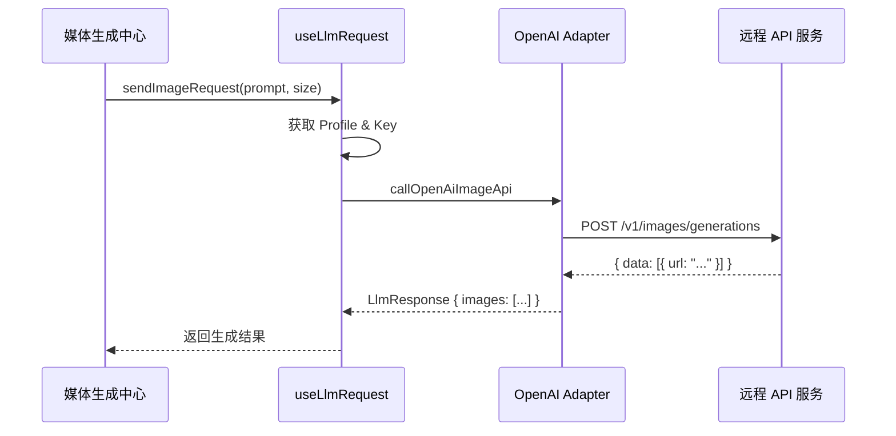

# LLM 适配器基础设施多模态扩展方案

## 1. 背景与动机

当前的 LLM 适配器基础设施（`src/llm-apis`）主要围绕“对话 (Chat)”模式设计。随着媒体生成中心（Media Generation Hub）的需求提出，现有的基础设施在处理以下场景时存在局限：

- **图片生成**: 响应通常是 URL 列表而非文本。
- **视频生成**: 涉及异步长时任务、状态轮询和视频 URL 返回。
- **语音合成 (TTS)**: 响应通常是二进制音频流。
- **参数解耦**: 生成类 API 通常只需要单一的 `prompt`，而不需要完整的 `messages` 历史。

本方案旨在对 `useLlmRequest` 及其底层适配器进行重构，以支持一站式的多模态媒体生成。

## 2. 现状分析

### 2.1. 局限性观察

1.  **`useLlmRequest.ts` 的强制性**: 内部逻辑（第 122 行）强制要求 `messages` 参数，这不符合图片/视频生成的 API 习惯。
2.  **`callOpenAiCompatibleApi` 的硬编码**: 目前默认请求端点固定为 `chat/completions`。
3.  **响应模型缺失**: `LlmResponse` 缺乏 `images` 和 `videos` 字段，无法承载生成结果。
4.  **异步流处理局限**: 现有的 SSE 解析器主要针对文本流，不适合处理二进制流或复杂的异步状态回传。

## 3. 扩展设计

### 3.1. 类型定义扩展 (`src/llm-apis/common.ts`)

引入专门的生成选项和响应结构：

```typescript
// 图片生成选项
export interface ImageGenerationOptions extends Omit<LlmRequestOptions, "messages"> {
  prompt: string;
  n?: number;
  size?: string; // e.g., "1024x1024"
  quality?: "standard" | "hd";
  style?: "vivid" | "natural";
  responseFormat?: "url" | "b64_json";
}

// 视频生成选项
export interface VideoGenerationOptions extends Omit<LlmRequestOptions, "messages"> {
  prompt: string;
  image?: string; // 图生视频的参考图 Asset ID 或 URL
  duration?: number;
  resolution?: string;
  aspectRatio?: string;
}

// 音频生成选项 (TTS)
export interface AudioGenerationOptions extends Omit<LlmRequestOptions, "messages"> {
  input: string;
  voice: string;
  responseFormat?: string;
  speed?: number;
}

// 响应结构扩展
export interface LlmResponse {
  content: string;
  // ... 现有字段 ...
  images?: Array<{
    url?: string;
    b64_json?: string;
    revisedPrompt?: string;
  }>;
  videos?: Array<{
    url: string;
    id?: string;
    status?: "pending" | "processing" | "completed" | "failed";
  }>;
}
```

### 3.2. 适配器层重构 (`src/llm-apis/openai-compatible.ts`)

新增专门的执行函数，利用已有的 `openAiUrlHandler` 进行端点映射：

#### `callOpenAiImageApi`

- **端点**: `images/generations`
- **处理**: 解析返回的 `data` 数组，填充到 `LlmResponse.images`。

#### `callOpenAiVideoApi`

- **端点**: `videos` 或自定义端点。
- **处理**: 针对异步 API，返回任务 ID。由上游 `Manager` 负责调用 `videoStatus` 端点进行轮询。

#### `callOpenAiAudioApi`

- **端点**: `audio/speech`
- **处理**: 接收 `arraybuffer`，返回包含 Base64 数据或 Blob URL 的响应。

### 3.3. 中间件重构 (`src/composables/useLlmRequest.ts`)

解耦 `sendRequest` 并增加模态专用方法：

```typescript
export function useLlmRequest() {
  // ... 现有逻辑 ...

  /**
   * 图片生成请求
   */
  const sendImageRequest = async (options: ImageGenerationOptions): Promise<LlmResponse> => {
    // 逻辑：获取 Profile -> 选取 Key -> 调用 callOpenAiImageApi
  };

  /**
   * 视频生成请求
   */
  const sendVideoRequest = async (options: VideoGenerationOptions): Promise<LlmResponse> => {
    // 逻辑：调用 callOpenAiVideoApi
  };

  /**
   * TTS 请求
   */
  const sendAudioRequest = async (options: AudioGenerationOptions): Promise<LlmResponse> => {
    // 逻辑：调用 callOpenAiAudioApi
  };

  return {
    sendRequest, // 保持兼容 Chat
    sendImageRequest,
    sendVideoRequest,
    sendAudioRequest,
  };
}
```

## 4. 核心流程图



## 5. 实施计划

1.  **Phase 1 (类型层)**: 更新 `src/llm-apis/common.ts`，定义多模态请求与响应结构。
2.  **Phase 2 (适配器层)**: 在 `openai-compatible.ts` 中实现 `callOpenAiImageApi`。
3.  **Phase 3 (中间件层)**: 扩展 `useLlmRequest.ts`，暴露 `sendImageRequest` 等方法，并移除对非 Chat 请求的 `messages` 强制校验。
4.  **Phase 4 (异步支持)**: 完善视频生成的轮询机制（`videoStatus`）支持。

---

##　参考：

src\llm-apis\参考docs\媒体生成
src\llm-apis\参考docs\媒体生成\谷歌香蕉.md
src\llm-apis\参考docs\媒体生成\谷歌veo.md
src\llm-apis\参考docs\媒体生成\oai-视频.md
src\llm-apis\参考docs\媒体生成\oai-图片.md
src\llm-apis\参考docs\媒体生成\oai-tts.md
src\llm-apis\参考docs\媒体生成\xai-图片.md

---

_文档版本: 1.0 | 日期: 2026-01-20 | 作者: 咕咕 (Kilo)_
