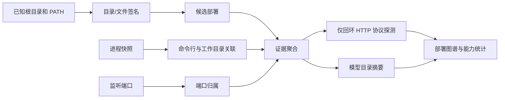

# 本机 AI 部署发现设计

> 状态：构想 / 待评审  
> 日期：2026-08-31  
> 范围：桌面端（优先 Windows），只读扫描本机的 AI 项目、运行时、本地服务与模型资产。

## 1. 问题

用户安装开源 AI 项目时，常得到的是带有 Web UI、Python/Node 环境、模型目录和启动脚本的整合包。可能会关心：

- 机器上有多少个可用的 LLM、ASR、TTS、图像生成和工作流部署；
- 哪些项目只是同一推理后端或模型资产的不同交互壳；
- 哪些服务正在运行，能否由 AIO Hub 直接连接；
- 哪些模型或运行时副本占用重复磁盘空间。

现有的环境设置、LLM 渠道模型拉取、资产去重与目录扫描分别解决了其中的一段，但它们没有共同的数据模型，也不会建立“项目 - 运行时 - 服务 - 模型资产”之间的归属关系。

## 2. 本机取样扫描

设计前执行了一次受控取样：只检查常见安装位置、PATH、进程、典型本地监听端口和一个只读 HTTP 探针；没有全盘递归、没有读取模型内容、没有访问非回环网络。为避免把本机路径写入设计结论，以下只保留归纳后的证据。

| 观察                 | 结果                                                                                                                                                                         | 对设计的影响                                                                                                 |
| -------------------- | ---------------------------------------------------------------------------------------------------------------------------------------------------------------------------- | ------------------------------------------------------------------------------------------------------------ |
| Ollama               | 找到用户目录模型根、程序安装位置和 PATH 命令；`ollama serve` 正在运行并监听 `127.0.0.1:11434`；`/api/tags` 成功响应，但模型数为 0                                            | 同一部署可由目录、可执行文件、进程、端口和协议五类证据交叉确认；无模型也应显示为可用运行时，而不是判为未安装 |
| audio.cpp WebUI 项目 | 发现项目私有 venv 正在执行 `webui.py`；目录同时包含 `models`、模型规格、WebUI、ASR/TTS 启动脚本和原生构建文件；关联到回环 `7865` 端口，Uvicorn HTTP 探针返回 200             | 不能用 `python.exe` 直接分类；命令行、项目根结构、监听端口和启动脚本组合后，才能把它识别为可运行的多能力部署 |
| ComfyUI 离线实例     | 通过 Everything 索引定位到 4 个同时包含 `main.py`、`nodes.py`、`folder_paths.py` 的代码根；3 个自带 `models`，另 1 个将模型拆至上级共享 `userdata/models`；均未监听默认 8188 | 模型目录不能作为 ComfyUI 代码根的必要条件；应将部署识别与模型资产关联分两步完成，并支持共享模型根            |
| 普通 Python 进程     | 同时存在 Conda、uv 工具和系统 Python 进程                                                                                                                                    | 运行时本身不是部署；除非它能关联到已知项目根、启动命令或本地服务，否则只能作为弱证据                         |
| 命名目录             | 找到若干含 `tts`、`comfy` 等字样的安装/更新/CLI 目录                                                                                                                         | 文件夹名和 PATH 命令只能生成候选，不能计入“部署数量”                                                         |

这次取样说明，扫描结果必须给出证据和置信度，不能只靠目录名、文件扩展名、默认端口或进程名做二元判断。

## 3. 目标与非目标

### 3.1 目标

- 建立本机 AI 能力清单，按 LLM、ASR、TTS、图像生成、工作流、Embedding/OCR 等分类展示部署数量。
- 将项目、私有运行时、监听服务和模型资产关联为一个部署图谱。
- 识别已运行且可验证的本地 HTTP 服务，并让用户选择是否将其导入为 AIO Hub 渠道。
- 汇总模型目录、文件数和占用；对可能重复的模型资产提供后续分析入口。
- 所有首轮操作只读、可取消、受目录/文件/时限预算保护。

### 3.2 非目标

- 不做无提示的全盘递归扫描，不扫描网络共享或所有挂载磁盘。
- 不自动修改项目配置、停止进程、迁移模型、创建链接或删除文件。
- 不将“发现某个模型文件”视为“模型一定可运行”。
- 不在首版为每一种 Python WebUI 写专用控制台或安装器。

## 4. 领域模型

扫描的基本单位是部署，而不是文件夹或模型文件。一个部署可拥有多个运行时、服务和模型资产；同一模型资产也可能被多个部署引用。

```text
Deployment
  |- Runtime        Python venv / Ollama daemon / llama.cpp binary
  |- Service        PID + executable + command line + listening port + probe
  |- ModelAsset     GGUF / SafeTensors / ONNX / PyTorch directory or file
  `- Evidence       path marker / process / port / HTTP response / config reference
```

建议的最小字段：

| 对象           | 关键字段                                                                                    |
| -------------- | ------------------------------------------------------------------------------------------- |
| `AiDeployment` | 稳定 `deploymentId`、`detectorId`、名称、能力分类、项目根、状态、置信度、证据列表、占用摘要 |
| `Runtime`      | 类型、可执行路径、版本、工作目录、关联部署                                                  |
| `LocalService` | PID、脱敏命令行、绑定地址、端口、协议、探测结果、可导入能力、关联运行时                     |
| `ModelAsset`   | 路径、格式、大小、修改时间、可选流式 SHA-256、被引用部署                                    |
| `Evidence`     | 来源、脱敏值、强度、采集时间、解释文本；原始命令行/响应只在本次扫描内存中短暂存在           |

置信度应由证据组合计算：结构目录或文件名是弱证据；启动命令与项目根相符是中证据；端口归属、HTTP 协议响应、配置文件引用是强证据。`status` 与统计计数分开定义：结构签名足以确认项目存在但没有运行证据时可标为“已发现未运行”，但只有达到中证据的候选才进入“已确认部署”计数；仅有文件名或目录名的候选仍为“待确认”。

`deploymentId` 不得只使用 PID 或 `detectorId`。首版使用规范化项目根、运行时可执行路径、配置身份和（如存在）服务端口生成稳定指纹；进程重启后只要这些身份未变，应复用同一部署记录。用户的忽略规则按该 ID 或规范化路径保存。

## 5. 扫描流程



1. **已知位置扫描**：只从 detector 声明的用户目录、应用数据目录、标准安装目录、PATH 和用户主动选取的根目录开始，形成本次扫描的 `allowedRoots`；所有后续来源（包括 Everything）返回的路径都必须与 `allowedRoots` 求交后才能读取或进入结果。
2. **目录签名识别**：检查有限深度的标记文件和目录，不读取大模型内容。例如 ComfyUI 的 `main.py + nodes.py + folder_paths.py + custom_nodes`；模型根既可能位于项目内，也可能由 `extra_model_paths` 或整合包的共享 `userdata` 指向。
3. **进程关联**：收集 PID、可执行文件、工作目录和命令行；将 venv Python 的脚本路径回溯到项目根。裸 `python.exe` 不单独形成部署。
4. **端口与协议验证**：获取监听端口到 PID 的归属；仅对 detector 声明的精确端点和允许地址发起请求，并记录绑定地址。绑定 `0.0.0.0`/`::` 的服务即使可通过回环访问，也要标记为对外暴露风险。
5. **模型资产摘要**：按格式、目录、大小和修改时间汇总。需要确定重复时才由用户发起流式哈希扫描。
6. **证据聚合**：按稳定部署身份合并候选；PID 只作为运行实例证据，不作为唯一身份。输出已确认、已发现未运行、待确认三种状态，并按上一节的独立计数规则生成统计。

首版建议默认预算为：单次最多 32 个根目录、单根最大深度 6、最多检查 20,000 个目录和 100,000 个文件；单个标记/配置文件最多读取 64 KiB，扫描总时限 30 秒，单个 HTTP 探针 1 秒、探针总时限 10 秒、并发不超过 4。取消令牌必须贯穿目录遍历、进程/端口查询、Everything 请求和 HTTP 探针；达到任一预算时保留已收集结果并返回“预算耗尽”原因。

## 6. Detector 注册表

Detector 是声明式规则，不是前端散落的 `if`。每个 detector 至少包含：能力分类、已知根目录、项目标记、运行时/进程标记、端口来源（默认端口、命令行/配置解析或仅使用实际监听端口）、协议探针、可导入能力/适配器和结果解释。探针必须绑定到明确的 HTTP 方法、路径和响应校验，不能用任意 `200` 作为协议兼容证明。

首批 detector 以证据最清晰的类别为准：

| Detector                           | 目录或进程特征                                                                       | 协议验证                                                                          | 初始状态                 |
| ---------------------------------- | ------------------------------------------------------------------------------------ | --------------------------------------------------------------------------------- | ------------------------ |
| Ollama                             | 用户模型根、`ollama` 可执行文件、`ollama serve`                                      | `GET /api/tags`，默认 11434                                                       | 首版                     |
| ComfyUI                            | `main.py`、`nodes.py`、`folder_paths.py`、`custom_nodes`；模型根可在项目内或共享目录 | ComfyUI 队列/系统端点，默认 8188 可改；仅标记工作流能力，不作为 LLM 渠道导入      | 首版                     |
| audio.cpp 系列                     | 项目根、模型规格、ASR/TTS/WebUI 启动脚本、项目 venv 启动命令                         | 仅在探测到实际监听端口后验证；仅在对应 TTS/ASR 端点通过验证时提供 `audiocpp` 导入 | 首版调研后确定具体子类型 |
| llama.cpp / vLLM / Xinference      | 可执行文件或启动模块、模型目录、服务命令行                                           | 各自的回环 HTTP 健康/模型端点                                                     | 第二批                   |
| Whisper / Piper / Coqui 等离线项目 | 项目与模型目录、脚本入口                                                             | 通常无常驻服务，先展示“已发现未运行”                                              | 第二批                   |

Detector 的命中必须保留可解释且已脱敏的证据。用户需要能看到“为什么识别为 ComfyUI”，也需要能将误报标为忽略，避免同一目录在后续扫描中反复出现。命令行中的 `--api-key`、`Authorization`、密码、URL userinfo 和配置中的密钥必须在进入证据、日志、缓存和 IPC 前脱敏；完整 HTTP 响应只在内存中按字段解析，不持久化。

## 7. 可复用后端能力

| 现有能力                                    | 可复用方式                                                                   | 不直接复用的原因                                                       |
| ------------------------------------------- | ---------------------------------------------------------------------------- | ---------------------------------------------------------------------- |
| `document_converter` 的可执行文件嗅探       | 复用“候选路径 -> 存在性 -> 有时限版本命令 -> 结构化候选结果”的 detector 模式 | 规则仍应属于 AI detector，不能让文档转换模块承担通用发现               |
| `skill_manager::get_well_known_skill_paths` | 复用已知路径表的声明方式                                                     | 路径集合与匹配语义不同                                                 |
| `git_scan_repositories`                     | 参考深度/目录数预算、跳过链接、canonical 去重和 `spawn_blocking`             | Git 仓库的 `.git` 终止规则不适用于 AI 项目                             |
| `dir_search`                                | 参考 `ignore::WalkBuilder`、glob、资源预算、取消和进度事件                   | 当前实现与文本匹配、读取字节预算紧耦合                                 |
| `directory_tree`                            | 参考不跟随链接的并行目录遍历                                                 | 它会物化完整目录树，不适合宽范围发现                                   |
| `asset_manager` 哈希                        | 复用 SHA-256 语义和重复分组 UI 经验                                          | 现有哈希用 `fs::read` 整体读入，不能处理大权重文件；新实现必须流式读取 |
| `system_pulse` / `sysinfo`                  | 现有依赖可用于进程快照                                                       | 目前只读取进程数量，尚未提供命令行、exe 与端口归属接口                 |

当前仓库没有监听端口到 PID 的发现实现。Windows 首版需要新增独立的平台适配层；不能把 `netstat` 文本解析或播放器的特定 HTTP 调用伪装成通用能力。

## 8. 落地边界

建议新增独立的 Rust command 模块 `src-tauri/src/commands/local_ai_discovery.rs`，由它持有一次扫描的取消状态、进度事件、候选合并和只读结果。它不应直接复用资产管理的目录或索引格式。

前端可作为独立工具“本机 AI 环境”，环境设置中提供扫描根目录、默认排除目录、是否包含 PATH/进程探测和 Everything 加速器等偏好项。资产管理只通过跳转或引用显示关联模型资产，不成为外部部署的真源。

扫描缓存应保存签名结果和目录修改时间，而不是保存模型文件内容；候选文件至少保存规范化路径、大小、mtime 和可用的文件 ID，目录 mtime 只作为加速提示，不能作为跳过文件复核的唯一条件。下一次扫描应重新检查发生文件级变化的目录、进程和端口。用户手动选择的额外根目录必须可查看、编辑和移除。

### 8.1 Everything 本机索引加速器（可选）

Everything HTTP Server 可纳入“运行环境与外部依赖”设置，但它是候选路径索引服务，不是 AI 运行时，也不是扫描功能的必需依赖。默认关闭；AIO Hub 保持自身受预算的目录扫描，Everything 不可用、被关闭或返回异常时应无感降级到该路径。

建议配置放在 `environment.discovery.everything`，而不是可执行文件路径字段：

```ts
interface EverythingDiscoverySettings {
  enabled: boolean;
  baseUrl: string; // 默认 http://127.0.0.1（Everything HTTP Server 默认端口 80）
}
```

- 默认端点仅允许回环地址 `127.0.0.1` 或 `::1`；使用局域网地址须由用户逐次明确确认，首版不提供远端扫描能力。URL 必须拒绝用户名、密码、非 HTTP(S) scheme、DNS 主机名和 IPv4-mapped IPv6 等绕过回环校验的写法。
- 启用或“检测服务”时，先请求 `GET /`，确认响应正文或标识头符合 `Everything HTTP Server`，再允许执行检索；连接失败只显示未就绪，不自动启动 Everything 或修改其 HTTP Server 设置。检索返回的每一条路径仍必须与 `allowedRoots` 求交，越界结果丢弃。
- 检索仅用于按文件名和路径定位候选，例如 ComfyUI 的 `main.py`、`nodes.py`、`folder_paths.py`；命中后仍必须在本地读取有限标记并运行 detector 复核，不能仅凭 Everything 索引计数。
- 不读取、保存或上传索引之外的文件内容；也不把 Everything HTTP 的 Basic Auth 密码写入普通应用配置。`baseUrl` 不得携带 userinfo；后续如支持认证，必须先提供系统凭据存储方案。
- 检测到服务绑定 `0.0.0.0`/`::` 且未配置认证时，设置页应显示安全警告，建议用户在 Everything 中改为仅监听回环地址，或在使用后关闭 HTTP Server。当前取样环境正属于该风险状态；AIO Hub 的请求仍只发往 `127.0.0.1`。

## 9. 安全与隐私

- 默认只扫描 detector 的已知目录与用户明确添加的根目录；禁止从盘符根目录自动扩张。
- 默认跳过符号链接、junction、网络共享、回收站、依赖目录和构建输出目录；用户可在设置中调整受限白名单。
- 可选使用用户已启用的 Everything 本机索引作为候选路径加速器，但不能成为唯一扫描来源；AIO Hub 仍需用本地结构标记复核命中，也不应要求用户开放无认证 HTTP 文件下载服务。
- 首轮不读取模型内容、配置密钥、浏览器数据或项目源码全文；只读文件名、相对路径、元数据和 detector 必需的小型标记文件。
- 进程命令行、环境变量和配置引用必须先经过密钥/凭据脱敏；HTTP 探针只访问 `127.0.0.1`、`::1` 或经用户确认的本地网络地址，且只调用 detector 声明的精确端点。请求结果中不持久化 API 密钥、凭据、完整响应体或带敏感参数的 URL。
- 任何绑定非回环地址的 AI 服务都应显示暴露风险；“通过回环探针可访问”不等同于“服务仅对本机开放”。
- 文件哈希、导入渠道、创建链接、迁移或清理必须是明确的后续用户动作，并提供影响范围预览。

## 10. 分期与验证

### Phase 1：已知部署与本地服务

- 建立 Ollama、ComfyUI 和一个 Python 项目型 detector。
- 实现受预算的已知目录扫描、PATH 检查、进程快照、Windows 监听端口到 PID 归属、证据合并和回环 HTTP 探针。
- 在结果中区分“已运行”“已发现未运行”“待确认”，并允许查看证据。

### Phase 2：渠道导入与协议能力

- 对通过协议和能力验证的端点提供“导入为渠道”预览，复用已有 LLM 模型列表与连接检查，不自动写入配置；ComfyUI 等工作流服务不显示 LLM 渠道导入。
- 导入预览必须展示目标 provider/adapter、base URL、模型列表端点、可用能力和所需凭据；未通过协议验证的服务只能显示“已发现/查看服务”。

### Phase 3：模型资产与重复分析

- 增加 GGUF、SafeTensors、ONNX、PyTorch 等格式识别与目录占用摘要。
- 为用户选定目录提供流式哈希、跨部署重复分组和安全迁移建议。

测试应覆盖 detector 的正例、同名误报、符号链接、空模型根、共享模型根、运行但无模型的服务、非 AI Python 进程、端口被非目标进程占用、同一项目多实例、稳定 ID 在重启后的复用、Everything 越界路径过滤、凭据脱敏、文件原地变化后的缓存失效、协议不兼容时禁止导入、取消和资源预算到达。真实验收需在 Windows Tauri 运行态用受控目录夹具及真实本地服务完成；普通浏览器不替代进程、端口和 IPC 验证。

## 11. 待定事项

- 首版是否将“浏览器内下载的模型缓存”纳入默认扫描，还是仅作为用户主动添加的根目录。
- ComfyUI 及各类整合包的 detector 是否采用内置规则库，或允许社区/插件贡献 detector。
- 如何定义“同类部署”的统计口径：按独立项目根、独立运行时还是可独立提供服务的实例。当前建议主统计按独立项目根，服务与模型数作为辅助指标。
- Phase 1 先覆盖 Windows 端口归属；macOS/Linux 的端口适配和跨平台最小实现留待后续阶段评估。
