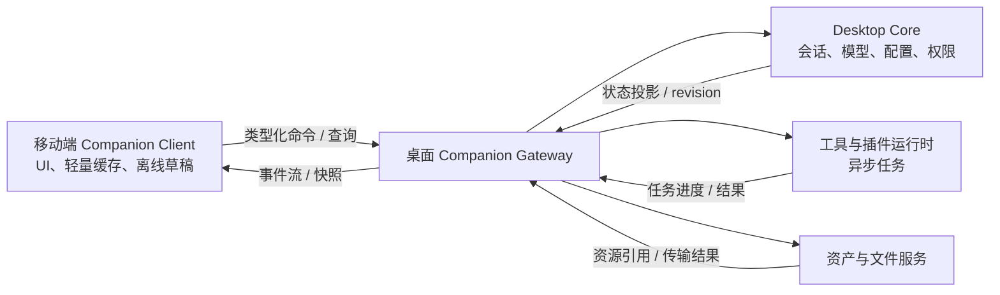

# 移动端作为桌面 Companion 的连接构想

> **状态：构想记录，暂不进入实施计划。**
>
> 本文记录移动端与桌面端协作的方向性设计，用于后续讨论和架构决策；它不代表已批准的需求、排期、接口契约或开发任务。具体实现开始前必须重新核对桌面端、移动端和网络环境的实际边界。

## 1. 背景与目标

移动端不必与桌面端做完全对等的数据同步客户端。对于模型配置、插件、工具运行时、桌面文件、资产管理和异步任务等能力，桌面端具备更完整的执行环境；让两个端各自持有完整业务状态并同步，会引入持续的数据迁移、冲突合并、密钥复制和双端能力重复实现成本。

因此，本构想将桌面 AIO Hub 定位为用户私有的 **Companion Backend**，移动端定位为其 **Companion Client**：

- 移动端负责移动场景的界面、交互、轻量缓存和离线草稿；
- 桌面端负责权威业务状态、模型密钥、工具/插件执行、资产和长期任务；
- 移动端通过受控协议向桌面表达意图，桌面执行后向移动端返回状态投影和事件流；
- 远程访问优先借助用户已有或自行选择的虚拟局域网、VPN 或内网穿透，而不是由 AIO Hub 官方维护默认业务中继。

目标是让用户能在手机上安全使用“自己桌面上的 AIO Hub 能力”，而不是把桌面和手机变成一套需要复杂双向同步的对等副本。

## 2. 非目标

本文明确不包含以下承诺：

- 不将此构想拆分为实施阶段、任务列表、时间表或验收标准；
- 不承诺 AIO Hub 官方提供公网 Relay、TURN、信令或流量中继服务；
- 不将现有桌面内部 HTTP/LLM proxy 直接暴露给局域网或公网；
- 不承诺桌面未运行、未联网时移动端仍能使用桌面私有能力；
- 不把移动端现有独立模式直接替换为纯远程壳应用；
- 不在本阶段确定某个特定虚拟网络产品、VPN 方案或第三方服务为唯一依赖。

## 3. 核心术语

| 术语                             | 含义                                                                                            |
| -------------------------------- | ----------------------------------------------------------------------------------------------- |
| **Companion Backend**            | 运行于桌面 AIO Hub 内部的受控后端边界，向已配对移动设备提供有限的会话、任务、资产和工具能力。   |
| **Companion Client**             | 移动端中连接、展示和控制某台已配对桌面的功能区域。                                              |
| **配对**                         | 建立“某台移动设备可以请求某台桌面服务”的长期设备身份与权限关系，不等同于记住一个 IP 地址。      |
| **Endpoint**                     | 到达桌面 Companion Backend 的具体网络地址，例如局域网地址、虚拟局域网地址或用户自定义隧道地址。 |
| **虚拟局域网 / Overlay Network** | 由用户选择和管理的私有网络层，使不在同一物理局域网的手机和桌面可像处于私网中一样互访。          |
| **状态投影**                     | 桌面端权威对象面向移动 UI 的可展示子集，而不是移动端可直接写入的完整持久化对象。                |

## 4. 产品形态

建议保留两个明确的移动端工作模式：

### 4.1 Standalone 模式

移动端继续使用自身可用的本地模型配置、会话和轻量功能。该模式适合用户没有桌面、桌面不在线或希望手机独立工作时使用。

### 4.2 Companion 模式

移动端连接到某一台已配对桌面，使用桌面持有的能力：

- 桌面模型 Profile 与密钥；
- 桌面会话、Agent、知识和相关配置；
- 桌面工具、插件和异步任务；
- 桌面管理的资产与文件处理能力。

界面必须清晰标识当前正在使用的桌面、连接状态及连接路径，避免用户混淆“手机本地数据”和“桌面数据”。例如：

```text
已连接：办公室 Windows · 虚拟局域网直连
```

这两个模式不应隐式地把全部业务对象做双向合并；若未来需要数据迁移或导入，应作为显式用户操作另行设计。

## 5. 权威性与数据流

在 Companion 模式中，桌面是权威源（source of truth）。移动端不直接操作桌面数据库、配置文件或本地文件系统。



### 5.1 移动端发送意图

移动端发送的是业务意图，而不是底层状态写入。例如：

- `sendChatTurn`；
- `cancelTask`；
- `createSession`；
- `runTool`；
- `createUploadSession`；
- `attachAsset`。

每个可重试的写操作应具有 `operationId`，以便在移动网络重连或用户重复点击时进行幂等处理。

### 5.2 桌面端返回投影与事件

桌面端返回面向移动端的 DTO、资源 revision 和事件 cursor。移动端断线重连后，应能够：

1. 查询当前任务状态；
2. 从上一个 cursor 拉取事件；
3. 在事件历史不可用时获取最新快照；
4. 重新订阅仍在运行的任务或聊天流。

桌面执行的 LLM 请求、工具调用和文件任务不能绑定于某一条手机连接；手机进入后台或切换网络后，桌面任务可继续执行。

### 5.3 资产边界

移动端只持有 `assetId`、轻量快照、受控预览地址或经过授权的临时下载能力；不写入桌面绝对路径、系统 URI 或桌面密钥。上传和下载应采用独立的数据传输边界，并具备分块、校验、取消和恢复能力，而不是将大型二进制内容塞进普通状态事件。

## 6. 网络方向

### 6.1 总原则

AIO Hub 负责 Companion 应用协议与设备安全，不负责成为用户数据的默认公网传输网络。

远程连接优先顺序为：

```text
局域网直连
  → 虚拟局域网 / VPN 直连
  → 用户自定义内网穿透或隧道
  → 不可达
```

这意味着 AIO Hub 可从多个 Endpoint 中选择可达地址，而无需理解其底层是否经过 NAT 穿透、私有网络、用户 VPS 或第三方网络。

### 6.2 局域网直连

同一物理局域网中，可使用本地发现与直接连接。此路径适合低延迟访问与本地大文件传输，但仍必须经过 Companion 的配对和应用层授权。

### 6.3 虚拟局域网 / VPN

这是推荐的远程访问主路径。用户可选择自己的虚拟局域网、VPN 或自托管私网方案，使手机与桌面获得相互可达的私有地址：

```text
手机 ── 用户选择的虚拟网络 ──> 桌面 Companion Gateway
```

AIO Hub 不依赖某一网络厂商；后续如有必要，可增加可插拔的网络适配器，用于检测客户端、获取虚拟网地址、诊断状态和辅助配置，但 Companion 核心协议不得与任何单一网络实现耦合。

### 6.4 用户自定义内网穿透

高级用户可通过自有 VPS、反向隧道、WireGuard、FRP 或其他私有网络方式提供 Endpoint。AIO Hub 只把该地址视为一个经过用户确认的访问路径。

使用自定义公网地址不意味着削弱认证要求：网络通道只解决可达性，设备配对、证书/指纹校验、权限 scope 和敏感操作确认仍必须存在。

### 6.5 不提供默认官方 Relay

默认不设计由 AIO Hub 官方长期承担的应用级 Relay。这样避免把免费开源个人产品带入持续的带宽、可用性、滥用防护、合规和运维负担。

未来若出现社区 Relay、企业部署或可选付费托管，也应作为独立的网络提供者，不改变“桌面为后端、应用协议端到端受控”的基本边界。

## 7. Endpoint 解析与连接选择

Companion 层只需要抽象出可验证、可排序的访问端点：

```ts
interface DesktopEndpoint {
  source: "lan" | "overlay" | "custom";
  address: string;
  port: number;
  transport: "http" | "https" | "ws" | "wss";
  priority: number;
  certificateFingerprint?: string;
}
```

连接器应按优先级尝试端点，并向用户报告实际使用的路径：

```text
已连接 · 局域网直连
已连接 · 虚拟局域网
已连接 · 用户自定义隧道
桌面在线，但当前不可达
桌面离线
```

Endpoint 是可变的网络信息；桌面身份不是。移动端必须以稳定的 `desktopId` 和配对产生的密钥材料识别桌面，不能因为 IP 或域名变化而把另一台机器误认为已配对设备。

## 8. 安全边界

桌面作为后端时，风险远高于普通的聊天同步：它可能持有模型密钥、桌面资产、工具权限、浏览器会话或文件系统能力。因此网络可达不等于已获授权。

### 8.1 配对

配对应建立设备身份，而不仅是分发访问 URL。推荐由一次性二维码或短期配对会话承载：

- `desktopId` 与展示名称；
- 协议版本；
- 临时 nonce 和过期时间；
- 桌面公钥或证书指纹；
- 可选的候选 Endpoint。

移动端生成或持有自己的设备身份；桌面端在本机明确确认后，保存设备 ID、公钥、scope、撤销状态和最后活动时间。

### 8.2 授权

每台已配对设备应具备明确 scope，例如：

```ts
type DeviceScope =
  | "chat:read"
  | "chat:write"
  | "assets:read"
  | "assets:upload"
  | "tools:execute"
  | "desktop:notifications";
```

高风险操作仍可要求桌面端即时确认，包括具有文件写入、Shell、浏览器自动化、插件管理或高成本模型调用能力的操作。

### 8.3 协议边界

不得将桌面内部 Tauri command、内部 HTTP proxy 或任意 URL 转发接口直接作为远程 API 暴露。Companion API 必须是语义化、类型化、最小授权的服务面：

- 不接受任意本机文件路径；
- 不允许任意 Tauri command 调用；
- 不允许任意 URL 代理；
- 不将 API Key 下发给移动端；
- 不把网络地址本身当作身份凭据。

现有桌面 LLM proxy 仅适用于桌面内部调用，其回环绑定和 origin/capability 边界应保持不变：`src-tauri/src/commands/llm_proxy.rs`。

## 9. 可用性与移动端限制

移动应用可能被系统挂起、杀死网络连接，或在 Wi-Fi 与蜂窝网络之间切换。因此不能将聊天流、工具执行或文件任务的存活性绑定于单个 WebSocket。

Companion 协议需要以任务为核心：

```text
移动端提交命令
  → 桌面创建 taskId
  → 桌面持续执行
  → 移动端暂时断线或进入后台
  → 移动端重连后查询 taskId、拉取 cursor、继续订阅
```

连接层可使用请求响应和事件流的组合；具体采用 HTTP、WebSocket 或其他传输方式应留待实施设计阶段决定。无论传输形式如何，任务查询、取消、快照恢复和事件补偿都是必要的应用层能力。

## 10. 对现有架构的影响（方向性）

若未来进入实施，应新建明确的 Companion 边界，而不是扩展现有内部代理：

```text
桌面端
  Companion Gateway / Connector
  ├─ pairing 与设备授权
  ├─ endpoint 解析与连接状态
  ├─ 受控 Companion API
  ├─ 任务与事件适配
  └─ 审计与敏感操作确认

移动端
  Desktop Connection Store / Composable
  ├─ 已配对桌面管理
  ├─ endpoint 选择与连接恢复
  ├─ capability 缓存
  ├─ 事件 cursor
  └─ Companion UI 状态
```

桌面内部的领域模型、工具注册、插件运行时和资产系统不应被网络层直接泄漏。跨端共享的内容应当是稳定 DTO、能力声明和协议 schema，而不是 Pinia store、数据库实现细节或桌面内部对象。

## 11. 后续需要重新决策的问题

以下问题保留给未来真正立项时处理：

- 是否只支持局域网与用户手动配置的虚拟网络，还是提供某些网络适配器；
- 如何处理 iOS、Android 与桌面端的后台、证书、网络切换和防火墙差异；
- Companion Gateway 的监听策略：指定虚拟网接口，还是全接口监听配合系统防火墙；
- 是否采用额外的端到端应用层加密，以及相应密钥轮换和设备恢复方案；
- 哪些桌面工具可以远程调用，哪些必须拒绝或要求本机确认；
- Standalone 与 Companion 模式之间是否提供显式迁移、导入或导出；
- 资产上传、预览、下载和断点续传的精确协议；
- 应用协议版本协商、兼容窗口与旧桌面版本降级策略；
- 是否存在社区、企业或自托管 Relay 的独立需求。

这些问题在没有明确用户场景、威胁模型、平台验证和维护责任划分之前，不应视为既定实现方案。

