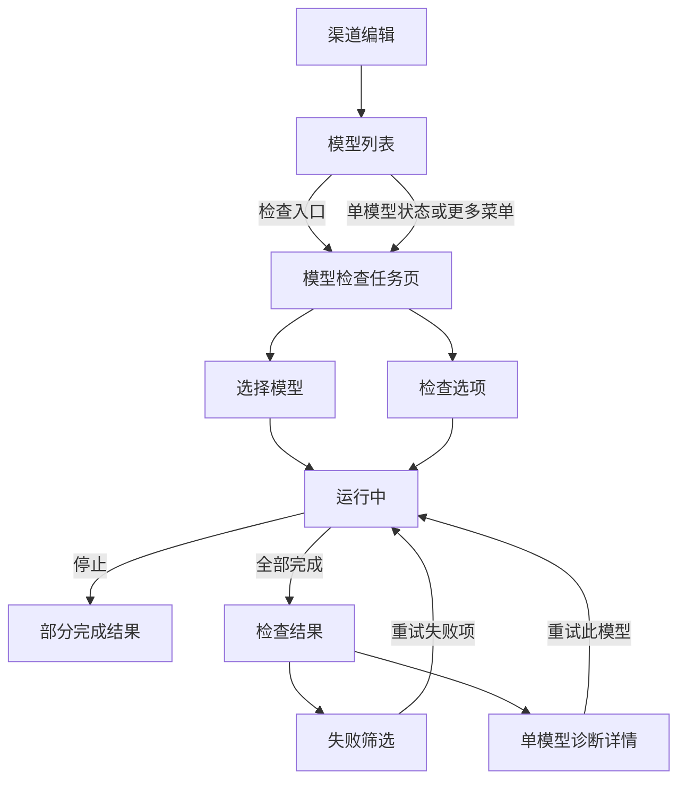

# 移动端 LLM 模型检查交互设计

> 状态：首批实现完成
>
> 日期：2026-07-16
>
> 关联计划：[`docs/Plan/llm-channel-probe-improvement-plan.md`](../Plan/llm-channel-probe-improvement-plan.md)

## 1. 设计结论

移动端不复刻桌面端的宽弹窗和表格式结果。模型检查应作为渠道编辑中的独立全屏任务页，复用当前未保存的渠道快照，并围绕三种核心任务组织：

1. 从模型列表快速检查单个模型。
2. 选择多个模型后批量检查，并能随时停止。
3. 在结果页快速定位失败项，再进入单项诊断详情。

现有“从 API 获取”继续表示模型发现与导入，不作为推理健康检查，也不与模型检查结果混用。

## 2. 设计定位

### 2.1. 用户与场景

目标用户是需要配置自定义渠道、排查端点和模型能力的技术用户。页面应强调可扫描、可中断、错误可追溯，不使用营销式大标题、装饰性卡片或高强度动效。

设计参数：

| 维度     | 取值 | 说明                                 |
| -------- | ---: | ------------------------------------ |
| 差异度   | 3/10 | 保持现有设置页秩序和操作习惯         |
| 动效强度 | 2/10 | 只表现状态变化和页面转场             |
| 信息密度 | 7/10 | 技术信息较多，但通过分层避免首屏拥挤 |

### 2.2. 设计原则

- 检查与编辑分离：检查页不修改模型和渠道配置。
- 快照优先：始终检查点击时的 `innerProfile` 深拷贝，不依赖保存或防抖完成。
- 结果就地可见：模型列表回显最近一次运行态结果，完整诊断进入详情页。
- 失败优先：批量结束后优先支持筛选和重试失败项。
- 成本显式：图片和音频必须二次确认，视频和音乐明确不可自动检查。
- 状态不只依赖颜色：图标、文字和颜色共同表达状态。
- 不保存敏感信息：结果、日志和复制内容不得包含 API Key、鉴权 Header 或完整错误体。

## 3. 信息架构



建议不新增持久化路由。检查任务页作为 `ProfileEditor` 内的原生 Vue 全屏任务层存在，直接持有未保存渠道快照；不要使用 `var-popup` 作为页面骨架。Varlet 只用于按钮、复选框、开关、进度等叶子控件。

## 4. 入口设计

### 4.1. 批量入口

模型列表标题调整为：

```text
模型 12                         [检查] [更多]
```

- “检查”使用 `ScanSearch` 或项目当前 Lucide 图标族中的等价图标，并带文字，模型为空时禁用。
- “更多”打开操作菜单，承载“从 API 获取”“手动添加”“清空模型”。
- 不再在窄屏标题行横排三个文字按钮，避免 320px 至 375px 屏幕换行。

### 4.2. 单模型入口

模型行不再继续增加第三个圆形图标。建议将编辑和删除收进模型行的“更多”菜单，并提供：

- 检查模型
- 编辑模型
- 删除模型

模型行底部显示最近一次运行态摘要：

```text
GPT-4.1 mini
gpt-4.1-mini
Chat                 检查成功  824 ms  >
```

点击结果摘要进入检查页并默认只选中当前模型。尚未检查时显示“尚未检查”，仍可点击进入。

### 4.3. 与模型获取的语义区分

- “从 API 获取”会拉取模型列表并进入导入流程。
- “模型检查”会发起最小真实推理请求并产生结构化诊断。
- 模型列表获取成功不得显示成“模型可用”或复用推理检查的成功状态。

## 5. 模型检查任务页

### 5.1. 页面骨架

```text
┌────────────────────────────────┐
│ ‹  模型检查                 重置 │
├────────────────────────────────┤
│ 搜索模型                       │
│ [全部] [可检查] [失败]           │
│ 已选 8/12              全选/取消 │
├────────────────────────────────┤
│ □ GPT-4.1 mini           Chat   │
│   gpt-4.1-mini        上次 824ms │
│ ────────────────────────────── │
│ □ text-embedding-3       向量    │
│   text-embedding-3-small 尚未检查 │
│ ────────────────────────────── │
│ □ image-1               图片  ¥  │
│   需要付费确认                   │
│                                │
├────────────────────────────────┤
│ [选项]              [检查 8 个模型]│
└────────────────────────────────┘
```

页面由原生 `header`、滚动内容区和安全区底部操作栏组成。底部操作栏使用 `env(safe-area-inset-bottom)`，不得遮挡最后一行内容。

### 5.2. 选择区

- 搜索匹配模型名称和 ID，输入使用本地过滤，不影响选择状态。
- 顶部使用分段控制切换“全部”“可检查”“失败”。首轮无结果时隐藏“失败”。
- 分组沿用模型现有 group，但检查页默认展开所有命中分组。
- 每行点击整行切换选择，复选框触控区至少 44 x 44px。
- “全选”只选择当前过滤范围内可检查的模型。
- 视频、音乐行不可选择，状态为“不支持自动检查”。
- 图片、音频可以选择，但显示“需要付费确认”，不得用普通能力标签弱化成本提示。

### 5.3. 检查选项

底部“选项”按钮打开自研底部面板，包含：

| 选项      | 控件                     | 展示条件           | 默认值 |
| --------- | ------------------------ | ------------------ | ------ |
| 并发数    | `1 / 2 / 3 / 4` 分段控制 | 选择两个及以上模型 | 3      |
| 流式 Chat | 开关                     | 已选模型包含 Chat  | 关闭   |
| 超时      | 菜单                     | 始终显示           | 60 秒  |

并发上限建议为 4。移动设备网络和 WebView 资源更有限，没有必要暴露桌面端的 8 并发上限。

图片和音频的付费授权不设计成可长期保留的开关。点击开始检查时，如果选择中包含付费能力，弹出一次性确认面板：

```text
本次包含 2 个付费媒体模型

检查会向上游发送真实生成请求，可能产生费用。

[返回调整]  [确认并检查]
```

授权仅对本次运行有效。视频和音乐不会出现在确认范围内，因为首批不执行这两类探测。

## 6. 运行中状态

### 6.1. 固定进度区

运行开始后，选择控件变为只读，顶部显示：

```text
正在检查  5/12
成功 3   失败 1   运行中 1   等待 7
```

可使用线性进度条表达真实完成比例。进度变化写入 `aria-live="polite"`，但避免每个网络事件都播报，只在完成数变化时更新。

### 6.2. 行状态

结果顺序保持用户选择时的模型顺序，不按完成时间跳动。

| 状态   | 图标与文字              | 行内信息               |
| ------ | ----------------------- | ---------------------- |
| 等待   | `Clock` + 等待中        | 不显示假进度           |
| 运行   | `LoaderCircle` + 检查中 | 显示已用时间           |
| 成功   | `CircleCheck` + 成功    | 总耗时、TTFB           |
| 失败   | `CircleX` + 失败        | 本地化错误分类与短摘要 |
| 停止   | `Square` + 已停止       | 区分在途取消和未执行   |
| 不支持 | `Ban` + 不支持          | 显示能力原因           |

颜色使用现有 `--success-color`、`--warning-color`、`--danger-color` 和文本 token，不另建一套探测品牌色。

### 6.3. 停止与离开

- 底部主按钮切换为“停止检查”，使用危险语义但不使用强烈常驻红底，可采用描边按钮。
- 停止后保留已完成结果，在途请求标记“已停止”，未开始项标记“未执行”。
- 运行时点击返回或系统返回键，弹出“退出将停止本次检查”。操作为“继续检查”和“停止并退出”。
- 首批不做后台检查。页面卸载必须触发同一个批量 `AbortController`。

## 7. 结果状态

### 7.1. 汇总区

完成后顶部显示一行紧凑汇总，不使用大面积成功卡片：

```text
已完成 12 个模型    成功 9    失败 3
```

下方分段控制为“全部”“失败”“成功”。如果存在失败，默认切换到“失败”，帮助用户直接处理问题。

底部操作栏提供：

- 有失败时：“重试失败项”作为主按钮。
- 全部成功时：“再次检查”作为主按钮。
- 次按钮：“重新选择”。

### 7.2. 单项诊断详情

点击结果行进入原生全屏详情层，不使用 Snackbar 承载诊断信息。详情结构：

1. 模型名称、ID、能力和检查时间。
2. 状态摘要与面向用户的短错误说明。
3. 指标：总耗时、TTFB、HTTP、Tokens。
4. 诊断：阶段、稳定错误分类、已脱敏详情。
5. 响应摘要或错误摘要，提供复制按钮。
6. 底部“重试此模型”。

阶段和分类同时保留本地化名称与稳定代码，例如：

```text
响应校验
semantic-validation

模型不可用
model-unavailable
```

复制内容使用结构化纯文本，只包含模型 ID、能力、时间、HTTP、阶段、分类和脱敏摘要。

## 8. 状态生命周期

### 8.1. 结果保留

- 结果只保留在当前 `ProfileEditor` 页面运行态，不跨应用重启。
- 返回渠道编辑后，模型行继续显示本次结果摘要。
- 再次进入检查页时保留选择和结果，用户可直接重试。

### 8.2. 配置变化

检查开始时生成不可变 Profile 快照。返回编辑页后，如果以下字段发生变化，已有结果显示“配置已变化”，再次进入时要求重新检查：

- Provider 类型
- Base URL
- API Key 集合
- 自定义 Header 或 Endpoint
- 代理、证书或 HTTP/1 配置
- 模型 ID 或能力

实现时可比较不含明文 Key 的配置指纹。指纹只用于失效判断，不写入探测结果或日志。

### 8.3. Key 健康

- 模型检查不得直接写 `isBroken`。
- 不通过普通 `useLlmRequest.sendRequest()` 发起检查，因为它会重新读取已保存 Store，并自动写入 Key 健康状态。
- 如需上报 Key 健康，只允许由独立策略根据结构化结果执行一次动作。
- 用户取消、配置错误、模型不可用和能力不支持不污染 Key 健康状态。

## 9. 组件与状态边界

建议组件：

```text
mobile/src/tools/llm-api/
├── components/
│   ├── ModelList.vue
│   └── probe/
│       ├── ModelProbeTaskPage.vue
│       ├── ModelProbeModelList.vue
│       ├── ModelProbeOptionsSheet.vue
│       ├── ModelProbeCostConfirm.vue
│       └── ModelProbeDetailPage.vue
├── composables/
│   └── useModelProbe.ts
└── probe/
    ├── types.ts
    ├── key-health-policy.ts
    └── channel-probe-service.ts
```

职责划分：

| 模块                     | 职责                                               |
| ------------------------ | -------------------------------------------------- |
| `ModelProbeTaskPage`     | 页面阶段、选择、过滤、离开保护、底部动作           |
| `useModelProbe`          | 结果字典、运行状态、进度、快照、取消和重试         |
| `channel-probe-service`  | Adapter、Executor、移动 Transport、TTFB 和批量并发 |
| `@aiohub/llm-core/probe` | 计划解析、语义校验、错误分类和共享结果契约         |
| `key-health-policy`      | 将结构化结果映射成一次 Key 健康动作                |

移动端服务应复用 `mobileLlmTransport` 的 observer 和 `AbortSignal`，不要复制 URL、Header、请求体或流式解析逻辑。

## 10. 视觉与交互规格

- 页面背景使用 `--color-surface` 或 AIO 主题对应 token。
- 底部栏使用 `--container-bg` 和 `backdrop-filter: blur(var(--ui-blur))`。
- 输入使用 `--input-bg`，分隔线使用 `--border-color`。
- 圆角使用 `--app-radius-md` 和 `--app-radius-lg`，不新增固定 20px 大圆角体系。
- 模型列表使用分隔线和留白组织，不给每个结果再包一层装饰卡片。
- 最小触控目标为 44 x 44px。
- 模型 ID、稳定错误码使用等宽字体，正文继续使用项目字体。
- 只对 `transform` 和 `opacity` 做 150ms 至 200ms 状态转场。
- `prefers-reduced-motion` 下关闭旋转以外的非必要转场，运行状态仍通过文字更新。
- 所有图标按钮提供 `aria-label`，进度和结果汇总提供可读文本。
- 用户提示通过 `customMessage` 和 `customDialog` 封装，不在新增业务代码中直接调用 `Snackbar` 或 `Dialog`。

## 11. 必备状态

实现必须覆盖：

- 无模型：解释需要先添加模型，主动作“从 API 获取”。
- 无选择：底部主按钮禁用，并显示“请选择至少一个可检查模型”。
- 全部不支持：展示能力原因，不允许开始。
- 运行中：真实进度、停止、离开保护。
- 部分成功：保留成功结果，默认聚焦失败项。
- 全部成功：显示汇总与再次检查入口。
- 全部失败：显示失败分类分布和重试入口。
- 用户取消：区分已完成、已停止和未执行。
- 配置已变化：旧结果标记过期，不与新快照混用。
- 页面恢复：应用回到前台后继续展示真实任务状态，不伪造完成。

## 12. 首批范围与后续范围

### 首批必须实现

- 单模型和批量检查。
- 搜索、全选、可检查筛选和结果筛选。
- 并发 1 至 4、Chat 流式开关、60 秒默认超时。
- 批量取消和离开保护。
- 图片、音频一次性成本确认。
- 视频、音乐明确不支持。
- 结构化详情、复制脱敏诊断、单项重试和失败重试。
- 当前渠道编辑会话内的结果回显与配置变化失效。

### 暂不实现

- 跨重启持久化历史。
- 后台周期检查和系统通知。
- 自动禁用整个渠道。
- 视频、音乐自动探测。
- 跨渠道批量检查。

## 13. 验收标准

### 交互

- 320px 宽度下标题、筛选和底部按钮不横向溢出。
- 单模型从模型列表进入时默认只选择该模型。
- 批量结果顺序稳定，不因请求完成顺序跳动。
- 停止会终止在途请求并阻止后续任务启动。
- 返回手势和系统返回键在运行中都触发离开保护。
- 付费媒体未确认时绝不发送请求。

### 语义

- “从 API 获取”和“模型检查”不会共用成功文案或结果状态。
- 失败分类、阶段、HTTP、TTFB、Usage 和响应摘要可在详情中查看。
- 不支持能力不会回退到 Chat。
- 配置变化后旧结果明确标记过期。

### 安全与可访问性

- UI、日志和复制诊断中没有明文 Key 或鉴权 Header。
- 状态不用颜色单独表达。
- 触控目标、对比度、屏幕阅读器标签和动态播报满足移动端基本可访问性要求。
- 深色、浅色和用户自定义主题下均使用项目 token，不出现固定白底或黑底。

## 14. 实现顺序建议

1. 先完成移动端 Probe Service、快照、取消和自动化测试。
2. 再完成 `useModelProbe` 状态机与无 UI 单测。
3. 接入全屏任务页、选择和运行态。
4. 接入详情、复制诊断、结果筛选和重试。
5. 最后改造模型列表入口与运行态摘要，并补移动端生产构建验证。
