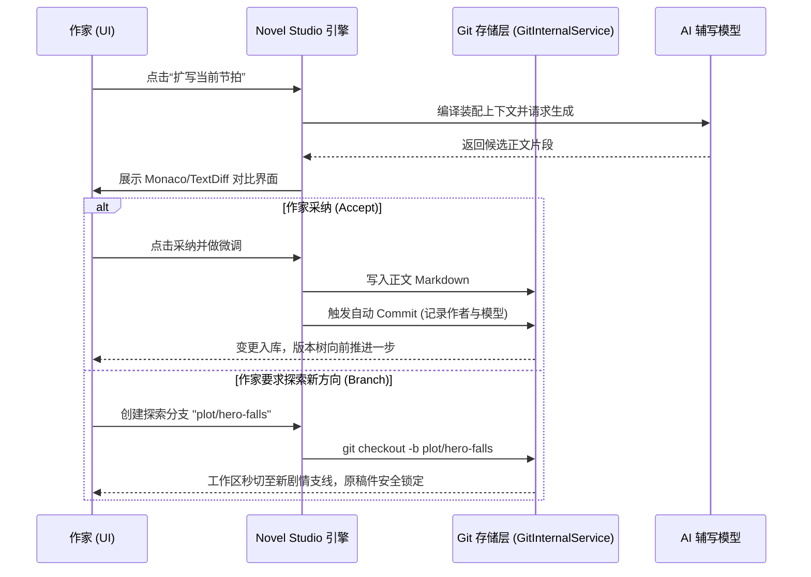
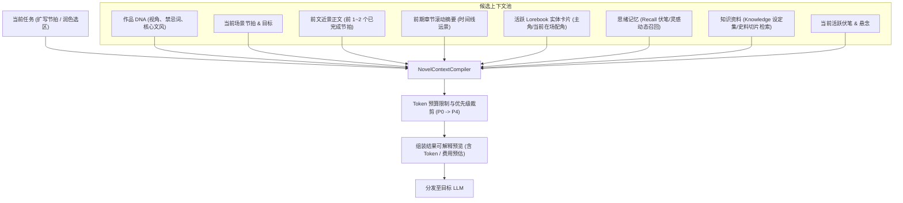
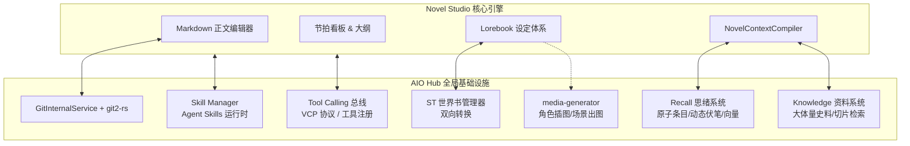

# 小说工坊 (Novel Studio) 架构设计方案

> 状态：Draft (架构设计与技术选型已确认)  
> 工具 ID：`novel-studio`  
> 归档位置：`docs/design/novel-studio-design.md`  
> 核心范式：**Docs-as-Code**、**Git-as-a-State-Engine**、**Lorebook 设定体系**、**非破坏式人机协同**

---

## 1. 核心定位与设计原则

长篇小说创作具有超长篇幅、多线伏笔、严密设定及上下文漂移等挑战。常规的通用会话续写或单体数据库存储，在长周期创作下面临上下文漂移、状态追踪脱节和版本回溯困难等挑战。

小说工坊的设计核心是**深度复用项目已有的 Git 与本地文件系统基建，避免重复建设专有状态格式**，将长篇小说的生产流映射为成熟的工程化工作流。

### 1.1 核心原则

1. **纯粹文件与 Docs-as-Code**：
   - 卷、章、场景正文按物理目录直接存储为标准 Markdown。
   - 避免将小说正文紧耦合于单体会话树或私有存储，保障创作资产的长期可控与跨工具互操作性。
2. **Git 作为原生状态与版本引擎 (Git-as-a-State-Engine)**：
   - 直接采用工业级版本管理体系，无需维护自定义补丁或专有快照格式。每个小说项目本质上是一个标准 Git 仓库。
   - **Commit** 即创作原子存档与快照；**Branch** 即分支剧情推演；**Diff** 即审查与差异合流；**Blame** 即人机创作溯源。
3. **Lorebook 设定集体系（单实体单文件）**：
   - 角色、地点、势力、物品与世界法则均以独立 Markdown 存储（置于 `lorebook/` 目录），顶部使用 YAML FrontMatter 维护结构化属性，正文维护详细设定与背景。
   - 彻底避免单体大 JSON 导致的合并冲突与性能瓶颈，天然兼容版本追踪，且完全规避了与 OpenAI Codex 代码工具的认知混淆。
4. **上下文白盒化与精细预算**：
   - 显式透明化每次 LLM 调用的 Prompt 装配流水线，支持查看召回理由、Token 预算及手动排除特定实体。
5. **多模型角色分工 (Model Role Mapping)**：
   - 构思大纲、正文扩写、格式化摘要与逻辑审校分流至不同成本与专长的模型。
6. **基建深度复用与生态共振**：
   - 全面打通 AIO Hub 的高阶基建：Git 引擎、思绪记忆 (Recall)、知识文档 (Knowledge)、Agent Skills 规范包、工具调用总线 (Tool Calling) 与世界书体系，拒绝孤岛式自研。

### 1.2 施工防坑红线（工程审计要点）

1. **Git 前后端性能分工防爆线**：
   - **前端 `isomorphic-git`**：严格锁定职责为高频、单文件工作区操作（`add`、`commit`、`status`）。
   - **后端 Tauri (`git2-rs`)**：承接所有涉及全库历史的重型操作（全库 commit 树状图渲染、跨分支全局比较、深层 Blame 追溯、垃圾回收），严防前端在万次提交下卡死。
2. **段落级人机署名与 Blame 防覆盖**：
   - Git Blame 物理粒度为“行”，长篇小说往往整段不换行。若作者仅在 AI 生成的千字段落中修改两个标点，标准 Blame 会将整段误归于作者。
   - 编辑器内强制实施**软回车（Soft Wrap）与段落换行约束**；UI 层渲染 Blame 时结合词级/句子级 Diff 进行混合着色，精准标识 AI 骨干与人工精修痕迹。
3. **节拍表 (Beats) 与正文真理源 (SSOT) 单向驱动**：
   - 节拍完成状态以创作者为主导：手动勾选或点击“采纳扩写”时联动勾选。
   - **严禁**让系统尝试通过正则或模型去逆向解析正文来“猜测”节拍完成度，杜绝因行文调整导致的节拍状态幻觉震荡。
4. **Lorebook YAML FrontMatter 宽容解析与降级保护**：
   - 面对 AI 自动提取或更新的人物状态，YAML 解析必须带容错保护 (`try-catch`)。
   - 解析失败时无缝降级为纯文本正文渲染，并在 UI 上标出醒目的非阻断警告，绝不允许因单个 YAML 缩进错误卡死整个写作工作区。
5. **快捷键与心流保护规范**：
   - 遵循应用全局规范：任何输入与发送动作一律绑定 `Ctrl + Enter`，**严格禁止单回车发送**，全力保护文学创作连续换行时的沉浸心流。

---

## 2. 领域模型与项目存储结构

小说项目在磁盘上以标准的本地目录与 Git 仓库结构组织，天然具备无缝导入外部编辑器（Obsidian、VS Code 等）的开放性。

### 2.1 物理存储结构

```text
{workspace}/novel-projects/{projectId}/
├── .git/                                # 原生 Git 仓库（由 GitInternalService / isomorphic-git 托管）
│
├── manuscript/                          # 正文稿件目录（按卷/章结构组织）
│   ├── vol-01-序卷/
│   │   ├── ch-01-晨昏交界.md
│   │   ├── ch-02-黑塔来客.md
│   │   └── ch-03-夜行.md
│   └── vol-02-破晓/
│       └── ...
│
├── lorebook/                            # 世界观与实体设定集（Lorebook 体系）
│   ├── characters/                      # 角色卡片（单人单文件）
│   │   ├── protagonist.md               # 顶部 YAML 状态属性 + 描述正文
│   │   └── mentor.md
│   ├── locations/                       # 地点与场景设定
│   │   └── royal-capital.md
│   ├── factions/                        # 势力与组织
│   └── rules/                           # 世界法则、历史纪元、战力体系
│
├── structure/                           # 情节与大纲编排
│   ├── outline.md                       # 全书宏观总纲与卷目标
│   ├── beats.yaml                       # 细粒度章节节拍与情节线卡片（轻量结构化）
│   └── timeline.yaml                    # 故事内时间线与关键历史事件
│
├── context-cache/                       # 派生缓存（受 .gitignore 忽略，随时可重新生成）
│   ├── summaries/                       # 单章结构化摘要缓存
│   │   └── ch-01.summary.json
│   └── style-profiles/                  # 文风样本与基调指引
│
└── .studio/
    ├── project.json                     # 项目元数据（标题、类型、视角、基调、默认语言）
    ├── role-bindings.json               # 模型角色分工绑定配置
    └── .gitignore                       # 默认忽略缓存与临时文件
```

### 2.2 Lorebook 实体规范示例

以人物卡片 `lorebook/characters/alice.md` 为例：

```markdown
---
id: char_alice_001
name: 艾丽丝
aliases: [白鹰, 影法师]
role: protagonist
status:
  currentLocation: loc_royal_capital
  health: left_arm_fracture # 第15章受伤状态
  inventory: [item_ancient_amulet]
tags: [法师, 叛逃者]
---

# 艾丽丝 (Alice)

## 外貌与性格特征

银发蓝瞳，神情冷静淡漠，惯用右手单手结印。有在紧张时摆弄项链的下意识习惯。

## 核心动机与秘密

调查三年前导师失踪的真相，暗中对教皇厅持戒备态度。
```

---

## 3. 情节编排与节拍系统 (Beat Sheet & Story Board)

基于长篇与网文创作的实际流转节奏，工坊采用业界成熟且符合创作者人体工程学的**节拍表（Beat Sheet）与看板（Story Board）**体系，兼顾结构化视界与交互操作的轻量敏捷。

```text
┌────────────────────────────────────────────────────────────────────────┐
│ 卷: 第一卷 · 序曲        [全卷目标: 展现主角困境并触发核心转折]       │
├────────────────────┬────────────────────┬──────────────────────────────┤
│ 第 1 章: 晨昏交界   │ 第 2 章: 黑塔来客   │ 第 3 章: 夜行 (正在编写)     │
├────────────────────┼────────────────────┼──────────────────────────────┤
│ 节拍 1:            │ 节拍 1:            │ 节拍 1:                      │
│ - [x] 遭遇神秘信使 │ - [x] 鉴定信物真伪 │ - [x] 躲避禁卫军搜捕         │
│ 节拍 2:            │ 节拍 2:            │ 节拍 2:                      │
│ - [x] 发现导师印鉴 │ - [x] 潜入藏书阁   │ - [ ] (当前) 与接头人暗巷碰头 │
│ 节拍 3:            │ 节拍 3:            │ 节拍 3:                      │
│ - [x] 决定深夜出逃 │ - [x] 触发警报陷阱 │ - [ ] 突遭背叛引发短兵相接   │
└────────────────────┴────────────────────┴──────────────────────────────┘
```

1. **宏观大纲（Outline）**：按卷/阶段记录主线目标、支线冲突及核心转折。
2. **章节节拍（Beats）**：
   - 每一章细分为 3~6 个核心情节点（Scene Beats）。
   - 状态追踪：待创作、起草中、已完成。
   - AI 可以针对**单一未完成的节拍**进行精准扩写，而不是盲目无界限续写。
3. **情节线（Story Arcs）标签**：
   - 为节拍打上主线、角色支线（如感情线、复仇线）或伏笔（Foreshadowing）标签，在看板上清晰直观呈现各线推进进度。

---

## 4. Git-as-a-State-Engine 工作流与协同机制

系统将日常写作动作全部无感映射为 Git 事务，作家享受现代版本控制的全部红利，但不需要记忆任何终端 Git 命令。



### 4.1 原子提交与人机混合署名 (Blame 追踪)

- **作者主动保存**：按 `Ctrl+S` 时生成提交：
  - Author: `AuthorName <author@local>`
  - Message: `chore(draft): 手动保存 ch-03`
- **采纳 AI 生成**：确认合并 AI 建议时生成提交：
  - Author: `Claude-3.7-Sonnet <ai-agent@novel-studio>`
  - Message: `feat(ai-expand): ch-03 扩写节拍2 [接头人暗巷碰头]`
- **段落级 Blame 精细化映射**：
  - 标准 Git Blame 物理上按行记录。为避免小说创作者修改段落内标点导致整段归属被全额覆盖，系统采用**分层溯源策略**：
    - **粗粒度（行/提交级）**：后端 `git2-rs` 快速抽取该文件的 Blame 索引；
    - **细粒度（段落/词句级）**：对比相邻提交的 Diff 块，识别段落内的微小修改，在 UI 侧将“AI 主干”与“人工润色”以轻量双色下划线呈现，兼具性能与精确度。
- **前后端 Git 算力防爆划分**：
  - **前端 `isomorphic-git`**：仅驻留于前端 Web Worker，承载单章节的 `stage / commit / checkout`，秒级响应，避免高频 IPC；
  - **后端 `git2-rs`**：涉及跨章节全库历史（分支树图、Blame 追溯、多分支合并演练）全部下沉至 Tauri Rust 原生命令执行。

### 4.2 剧情分支推演与合并 (Branching & Merging)

- **剧情分歧点**：在关键决裂或多选推演点，用户可一键“创建剧情分支”。
- **支线探索**：在独立分支上由作者撰写或 AI 辅写数章实验性情节。
- **合并决策**：
  - 若推演符合预期，使用 `git merge` 将支线合并回主干 `main`。
  - 若探索未达预期，直接切回 `main` 分支丢弃实验分支，主线稿件不受任何污染。

### 4.3 差异核验与防丢机制 (Diff & Stage)

- 所有 AI 的生成产物必须通过差异比对界面（复用 [`src/tools/text-diff`](src/tools/text-diff)）呈现。
- 支持单句选择性应用（Cherry-pick 级局部替换），避免粗粒度的全章覆盖冲掉已有修改。

---

## 5. 上下文编译器 (NovelContextCompiler)

即便模型上下文窗口不断扩充，未经筛选的全书拼接仍会导致注意力漂移、基调稀释及不必要的 Token 消耗。工坊实行**流式结构化上下文装配**：



### 5.1 上下文装配优先级 (Priority Cascade)

| 优先级        | 类别             | 装配内容                                                         | 裁剪原则                    |
| :------------ | :--------------- | :--------------------------------------------------------------- | :-------------------------- |
| **P0 (强制)** | 任务指令与硬规则 | 写作任务、叙事 POV（第一/第三人称）、严禁出现的禁用词与敏感词    | 永远不可裁剪                |
| **P1 (核心)** | 当前场景要素     | 当前节拍目标、在场角色的 Lorebook 卡片（包含当前伤病与携带物品） | 优先完整保留                |
| **P2 (近景)** | 前序顺滑过渡     | 上一个节拍或前文最后 1000~2000 字正文原稿                        | 按 Token 预算从前部向后裁剪 |
| **P3 (记忆)** | 思绪与伏笔支撑   | Recall 召回的活跃伏笔/人物习惯、前序相关章节一句话摘要           | 超出预算则按相关度截断      |
| **P4 (补充)** | 知识库与背景     | Knowledge 检索的世界观史料片段、地点势力静态描述                 | 预算吃紧时优先剔除          |

---

## 6. 模型角色分工矩阵 (Model Role Mapping)

通过 [`.studio/role-bindings.json`](docs/design/novel-studio-design.md:73) 配置不同环节的执行模型，兼顾文学质量与调用成本：

| 角色标识       | 角色名称      | 核心职责                                       | 推荐模型类型                                                | 频次 / 成本画像    |
| :------------- | :------------ | :--------------------------------------------- | :---------------------------------------------------------- | :----------------- |
| **`planner`**  | 架构师 / 策划 | 大纲结构推演、情节转折发散、伏笔埋设建议       | 高逻辑推理模型 (如 Claude 3.7 Sonnet, DeepSeek-R1, o3-mini) | 低频、中等 Token   |
| **`drafter`**  | 执笔写手      | 针对细粒度节拍进行正文扩写、对白打磨           | 叙事文学表现力强、语流顺畅的模型                            | 高频、大输出 Token |
| **`reviewer`** | 审校编辑      | 检查人设立体度、逻辑连续性核验、语病与套话排查 | 独立于 `drafter` 的不同模型 (避免同源偏见)                  | 中频、大输入 Token |
| **`utility`**  | 记录侍从      | 提取单章摘要、更新人物状态、分析伏笔提及       | 轻量低延迟模型 (如 Gemini Flash, GPT-4o-mini)               | 极高频、低单价     |

---

## 7. AIO Hub 全局高阶基建赋能与生态协同

小说工坊全面融入 AIO Hub 的全域平台能力，与底层服务、工具总线及认知生态形成深度化学反应：



### 7.1 双轨 Git 状态底座 (Dual-Track Git Engine)

- **轻量前端轨**：基于下沉后的 `GitInternalService`（由 `isomorphic-git` 驱动），专注于单文件的高频保存、原子提交与工作区状态流转。
- **重型原生轨**：后端 Tauri 调用 `git2-rs`，负责大跨度分支合并、版本树拓扑图生成、整卷全文搜索与复杂段落级 Blame 分析，彻底解除前端内存天花板。

### 7.2 思绪 (Recall) 与 知识 (Knowledge) 双域赋能

- **伏笔与灵感动态思绪 (Recall)**：
  - 创作过程中的闪念灵感、隐秘伏笔和角色特定口癖，可一键暂存为 Recall 条目，打上标签（如 `#伏笔 #第3卷 #艾丽丝`）。
  - 上下文编译器通过 `{{recall}}` 宏与标签自动在扩写对应情节时注入，条目被回收后打上 `#已回收` 标记，实现“动态记忆池”闭环。
- **大体量史料与资料库检索 (Knowledge)**：
  - 针对数万字的世界观百科、前作参考设定或真实历史文献，挂载为项目的 Knowledge 资料库。
  - 上下文编译器调用检索管线（语义向量 + BM25 + RRF 融合），按需提取最高相关的百字片段，杜绝无脑全量塞入。

### 7.3 创作专用 Agent Skills 体系（生态外挂与渐进式披露）

小说工坊接入 [`src/tools/skill-manager`](src/tools/skill-manager)，创作者无需把特定流派的规则写死在代码里，而是通过符合 [Agent Skills 规范](https://agentskills.io/llms.txt) 的技能包进行可插拔扩展：

- **渐进式披露机制**：
  - **Level 1 (元数据)**：写作时模型仅感知已启用的技能摘要（如“悬疑伏笔埋设指南”、“网文黄金三章节奏核查”、“仙侠修真对白古风润色”）；
  - **Level 2 (指令注入)**：在对应任务（如扩写、审校）触发时，模型按需激活该 Skill，获取完整的 `SKILL.md` 规则指南；
  - **Level 3 (脚本执行)**：Skill 包自带的本地脚本（如字数韵律分析、违禁词扫描、角色起名算法）通过 Rust 沙箱安全执行并反馈结果。

### 7.4 Lorebook 与 SillyTavern (ST) 世界书双向互通

- 复用 [`src/tools/st-worldbook-manager`](src/tools/st-worldbook-manager) 的存储与数据转换能力：
  - **导入**：支持将现有的 ST 世界书（`.json`）一键解析并解构成 `lorebook/` 下的单实体 Markdown 文件；
  - **导出**：可将整个小说项目的 Lorebook 实体集一键打包导出为标准 ST 世界书，便于在跑团、角色扮演（llm-chat）场景中复用小说人设。

### 7.5 工具调用总线 (Tool Calling) 与多模态协同

通过接入 [`src/tools/tool-calling`](src/tools/tool-calling) 的统一调度总线，小说工坊的智能体具备多维辅助能力：

- **角色立绘与插图直出**：在 Lorebook 角色卡或精彩章节，调用 `media-generator` 根据外貌特征与场景描写生成插画并落盘至 `.studio/assets/`；
- **听书自校 (TTS 语流走查)**：调用语音朗读服务，利用听觉捕捉长句冗余、同音生僻字和语流卡顿；
- **现实资料考据**：调用网络搜索或文档提取工具（`web-distillery`），考证时代风俗、兵器规格与专业医学细节。

### 7.6 文本比对与 Token 预算

- 复用 [`src/tools/text-diff`](src/tools/text-diff) 与 Monaco DiffEditor 作为 AI 生成建议与版本历史比对的核心组件。
- 复用 [`src/tools/token-calculator`](src/tools/token-calculator) 的 BPE 分词器，装配前精准预算上下文长度与预估成本。

---

## 8. 功能分期与实施路线

### 8.1 第一阶段：轻量化 MVP (P0)

- **Git 服务抽象下沉**：从 `web-canvas` 提取通用的 `GitInternalService`。
- **本地项目管理**：基于本地文件夹初始化 Git 仓库，卷/章/场景 Markdown 树形导航。
- **正文编辑器集成**：集成 Markdown 写作区，支持自动保存并驱动 Git 提交。
- **Lorebook 基础管理**：人物、地点卡片增删改查（YAML FrontMatter 解析与渲染）。
- **节拍看板（Beat Sheet）**：单章多节拍定义与状态标记。
- **单节拍 AI 扩写 + Diff 采纳**：装配前文近景与在场人物，调用 `drafter` 模型，Diff 确认后原子 Commit。
- **快捷键交互与心流保障**：强制 `Ctrl+Enter` 发送/扩写，输入框保留标准回车换行。

### 8.2 第二阶段：版本分支与深度审校 (P1)

- **剧情分支推演 UI**：可视化分支创建、切换与合并界面（剧情平行世界推演，由后端 `git2-rs` 驱动）。
- **段落级人机 Blame 视图**：在正文旁以轻量双色下划线标注 AI 生成与作者亲修痕迹。
- **连续性自动体检**：利用 `utility` 模型在后台从正文中抽取事实，比对 Lorebook 状态并提示人物穿帮（如已骨折的手臂突然开弓）。
- **滚动章节摘要**：章节定稿后后台自动提取结构化摘要并存入缓存。
- **思绪 (Recall) 与 知识 (Knowledge) 联动**：在看板和编辑器侧栏快速提取伏笔并挂载资料库。

### 8.3 第三阶段：生态拓展与多模态 (P2)

- **Agent Skills 写作技能包扩展**：接入 `skill-manager`，支持创作者安装流派模板与修辞诊断技能包。
- **Lorebook 与 ST 世界书双向导入导出**：与 `st-worldbook-manager` 实现无缝数据桥接。
- **多模态插图与自校工具链**：集成 `media-generator` 角色立绘生成与 TTS 语音朗读。

### 8.4 暂不纳入范畴 (Out of Scope)

- 多人实时在线协同（以本地单人创作和 Git 异步流为主）。
- 全自动“一键生成全书”等不可控的端到端黑盒生成（坚持“人在回路”与精细协同原则）。
- 复杂度过高的多轨连续时间轴拖拽画布（优先保证节拍看板的直观与高响应度）。
