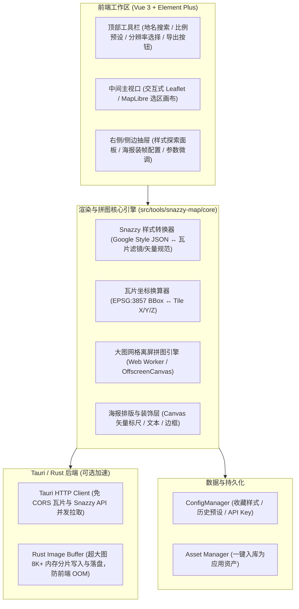
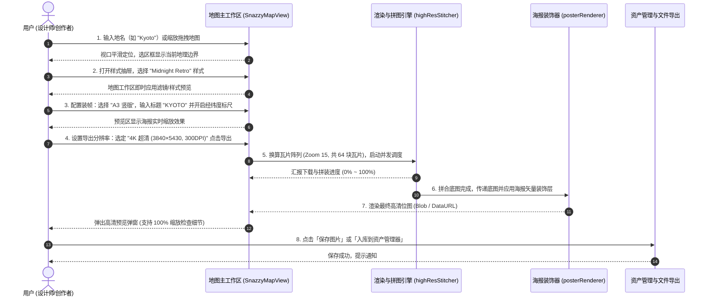

# Snazzy Maps 静态地图与高清海报生成工具设计方案

> 文档状态：`Draft / RFC`  
> 更新日期：2026-09-30
> 模块标识建议：`src/tools/snazzy-map`（或 `static-map`）

---

## 1. 背景与核心诉求

### 1.1 背景分析

Snazzy Maps（[snazzymaps.com](https://snazzymaps.com)）是设计师与开发者广泛使用的开源地图配色与样式分享社区。其核心价值在于将复杂的地理数据渲染为风格化、极简主义、赛博朋克、复古怀旧或单色水墨的艺术地图。
在影视道具制作、壁纸设计、城市画册、室内装饰海报、PPT 演示及技术可视化等场景中，高精度风格化地图存在极高需求。

### 1.2 现有痛点

1. **分辨率严重受限**：Snazzy Maps 网页原生的静态截图或 Google Static Maps API 存在尺寸上限（免费通常 640×640，高级导出上限仅 2048×2048），无法满足 4K/8K 屏幕壁纸乃至 300 DPI 印刷级（如 A3/A2 尺寸海报需要 4000×6000 像素以上）的需求。
2. **缩放与细节割裂**：用户想要在大图上展示细致的街道、水系建筑轮廓，但传统截图工具一旦拉大视口，缩放级别（Zoom Level）会自动变小，导致细节（如次级街道、建筑物细节）被抽稀；反之缩放级别放大后可视区域又过小。
3. **网络与 API Key 门槛**：Google Maps 原生服务国内访问受限且强绑信用卡绑定和 API 计费，需要支持开箱即用的免 Key 渲染回退方案。
4. **缺乏一体化海报装饰**：现成工具只导出裸图，缺少经典地图海报常见的坐标标签、经纬度刻度线、极简边框排版及城市标题设计。

### 1.3 核心目标

- **可视化选区与交互定位**：提供可交互的地图工作区，支持地名搜索、经纬度定位及任意比例区域框（Bounding Box）绘制。
- **样式生态与探索**：内置精选社区经典风格，并支持探索/同步 Snazzy Maps 线上样式库与导入自定义 Google Maps Style JSON。
- **超高分辨率拼图引擎**：解耦「地图地理范围」与「缩放细节层级（Zoom）」、「输出分辨率倍率（Scale Factor）」，支持导出高达 8K（甚至打印级）无拼接痕迹的超清无损位图。
- **海报装帧与导出排版**：内置极简海报排版模板，提供城市名标注、经纬度标签、比例尺与装饰边框。
- **AIO Hub 生态无缝集成**：与全局主题自适应、配置持久化（ConfigManager）及资产库（Asset Manager）互通。

---

## 2. 总体架构设计

### 2.1 模块全景图



### 2.2 目录结构规划

```text
src/tools/snazzy-map/
├── snazzy-map.registry.ts            # 工具路由与元数据注册
├── ARCHITECTURE.md                   # 模块架构说明
├── SnazzyMapView.vue                 # 工具主视图 (桌面专业工作区布局)
├── components/
│   ├── MapViewport.vue               # 交互式地图视口与 BBox 选框
│   ├── StyleExplorerDrawer.vue       # Snazzy 样式在线探索与分类抽屉
│   ├── StyleCustomizer.vue           # 样式 JSON 编辑与实时热加载
│   ├── PosterSettingsPanel.vue       # 海报装帧参数面板 (标题/坐标/边距)
│   ├── ExportDialog.vue              # 导出进度指示与超清预览模态框
│   └── LocationSearchInput.vue       # 城市/地名自动补全输入组件
├── core/
│   ├── geoCoordinates.ts             # 墨卡托投影计算与瓦片换算逻辑
│   ├── snazzyStyleParser.ts          # Google Maps Style 规则解析与映射
│   ├── tileProviderRegistry.ts       # 瓦片数据源定义 (OSM/Carto/Mapbox/Google)
│   ├── highResStitcher.ts            # Canvas 瓦片并发请求与网格拼图
│   ├── posterCanvasRenderer.ts       # 装饰文字、边框与经纬度海报排版渲染
│   └── snazzyApiService.ts           # Snazzy Maps 探索接口与本地缓存
├── types/
│   ├── snazzy.ts                     # Snazzy Maps 样式及 API 类型定义
│   └── export.ts                     # 导出规格、分辨率、海报配置类型
└── docs/
    └── Plan/
        └── snazzy-map-phase1-plan.md # 实施推进路线
```

---

## 3. 核心机制与技术实现

### 3.1 地图引擎选型与双渲染内核设计

为了兼顾「免配置门槛」与「极致保真还原度」，采用**双模式（Dual-Engine）渲染策略**：

| 特性维度            | 模式 A：社区瓦片引擎（推荐默认）                             | 模式 B：Google Maps JS 矢量/混合模式             |
| :------------------ | :----------------------------------------------------------- | :----------------------------------------------- |
| **底层实现**        | Leaflet / MapLibre GL + 栅格/矢量瓦片                        | 封装 Google Maps JavaScript API SDK              |
| **样式还原机制**    | 将 Snazzy 核心色板解析为 CSS Filter 矩阵/自定义 CartoDB 样式 | 原生 100% 完美应用 Snazzy JSON 规则              |
| **网络与 Key 门槛** | 开箱即用，无需 API Key，国内节点可选                         | 需配置用户个人 Google Maps API Key（需代理）     |
| **超大尺寸拼图**    | 自由计算 Tile X/Y/Z 异步下载直接 Canvas 拼合                 | 离屏平移 Viewport 分块截图再拼图                 |
| **使用场景**        | 快速海报生成、日常离线设计、无 Key 用户                      | 极高保真、包含特定复杂道路层级的 Snazzy 深度用户 |

---

### 3.2 瓦片网格与超高分辨率拼装算法 (High-Res Tile Stitcher)

要突破现有工具 2048px 限制并输出 8K（7680×4320）甚至印刷级分辨率，必须解耦**视口地理范围（BBox）**与**渲染分辨率（Resolution）**。

#### 1. 瓦片换算原理（Web Mercator EPSG:3857）

对于用户选定的经纬度矩形范围：

- 最小经纬度 $(\text{lat}_{\min}, \text{lng}_{\min})$，最大经纬度 $(\text{lat}_{\max}, \text{lng}_{\max})$；
- 给定缩放级别 $Z$（Zoom Level）：
  $$X = \lfloor \frac{\text{lng} + 180}{360} \times 2^Z \rfloor$$
  $$Y = \lfloor \left(1 - \frac{\ln(\tan(\text{lat} \times \frac{\pi}{180}) + \sec(\text{lat} \times \frac{\pi}{180}))}{\pi}\right) \times 2^{Z-1} \rfloor$$
- 范围内的瓦片矩形区间即为：$X \in [X_{\min}, X_{\max}]$, $Y \in [Y_{\min}, Y_{\max}]$。

#### 2. 分辨率倍率与 Zoom 联动计算

- **传统局限**：单纯加大 Scale 会导致地图文字过小或瓦片模糊。
- **智能计算推荐算法**：
  给定目标输出像素尺寸（如 $W = 6000, H = 4000$）和地理选区：
  1. 系统自动反推最佳瓦片层级 $Z_{\text{optimal}}$，使得在该层级下总瓦片拼接像素最接近目标尺寸；
  2. 允许用户手动调节**细节等级（Detail Level / Zoom Offset: -2 ~ +2）**：
     - 若希望画面呈现更细微的胡同/建筑阴影，提高 Zoom 并增加拼图总瓦片数；
     - 若希望呈现大区概览风格，降低 Zoom 并进行平滑缩放插值。

#### 3. 内存防护与分片合成

- **内存限制保护**：
  若导出图达到 8K~16K（例如 10000×10000 像素，原始 RGBA 缓冲达 400MB），浏览器端直接创建单张 Canvas 易导致 GPU 崩溃或 iOS/低内存设备 Crash。
- **分级处理**：
  - 中小尺寸（$\le 4096\times 4096$）：前端 `OffscreenCanvas` 双缓冲拼图；
  - 极大尺寸（$> 4096\times 4096$）：
    - 方案 1：切片拼装成带行缓冲的离屏 Canvas 导出为 Blob；
    - 方案 2：利用 Tauri Rust 后端 `tauri::command`，将瓦片 URL 列表传给 Rust 端多线程异步拉取，在 Rust 端流式写入 PNG 编码器，前端仅需展示进度条。

---

### 3.3 Snazzy Maps 样式生态整合

#### 1. 样式规范契约

Snazzy Maps 导出的核心为一组针对 Google Maps 各要素的规则数组：

```json
[
  {
    "featureType": "water",
    "elementType": "geometry",
    "stylers": [{ "color": "#193341" }]
  },
  {
    "featureType": "landscape",
    "elementType": "geometry",
    "stylers": [{ "color": "#2c5a71" }]
  },
  {
    "featureType": "road",
    "elementType": "geometry",
    "stylers": [{ "color": "#29768a" }, { "lightness": -37 }]
  },
  {
    "featureType": "poi",
    "elementType": "all",
    "stylers": [{ "visibility": "off" }]
  }
]
```

#### 2. 在线探索与发现（Style Explorer）

- 支持接入 Snazzy Maps 检索端点：
  - 热门榜单（Popular）、最新上传（Recent）、编辑精选（Staff Pick）；
  - 关键词检索（如 "cyberpunk", "retro", "dark", "paper", "mono"）；
  - 颜色色系标签过滤（黑白灰、蓝调、复古棕、暖色调等）。
- **离线与内置预设**：
  应用内置 15~20 款高质量预设（Dark Subtle, Blue Water, Midnight Commander, Paper Art, Clean Cut, Warm Antique 等），在无网络或离线状态下同样立即可用。
- **自定义导入**：
  支持直接粘贴 JSON 代码，通过内置 Monaco/CodeMirror 编辑器进行实时语法校验与着色预览。

---

### 3.4 艺术海报排版引擎 (Poster Decorator)

静态地图不仅是底图，配合装帧排版才能成为成品艺术品。工具提供内置的海报排版图层：

1. **标题与文字区（Typography）**：
   - 主标题：如城市名（"TOKYO", "BEIJING", "NEW YORK"）；
   - 副标题：国家/地区名或自定文案（"JAPAN", "35°41'22\"N 139°41'30\"E"）；
   - 经纬度自动捕捉：根据当前视口中心自动计算规范的度分秒（DMS）格式文本；
   - 字体与字间距：支持选择衬线体（Serif）、无衬线体（Sans-Serif）、等宽体（Mono），自动计算特大字间距（Letter Spacing）。
2. **装饰元素（Graphic Accents）**：
   - 极简坐标十字标（Crosshair Marker）与中央聚焦环；
   - 极简细线双边框（Fine Double Border）；
   - 比例尺（Scale Bar）与指北针标识；
   - 下方信息条（Bottom Bar）：色块调色盘标尺、经纬度刻度条。
3. **安全边距与比例裁切（Aspect Ratio & Margin）**：
   - 常见装裱比例：`1:1`（方形画芯）、`4:3`、`16:9`、`A4/A3` 国际标准纸张比例、`9:16`（手机壁纸）；
   - 内边距（Padding）控制：支持现代海报的留白边缘设计（留白底色可取样式底色或自定义纸张质感）。

---

## 4. 用户交互与操作流程



---

## 5. UI/UX 界面设计规范

遵循 AIO Hub 桌面专业工具规范：

1. **默认工作区完整展现**：
   - 打开即呈现完整的全屏地图操作区，禁止空数据等待；默认加载全球或热门城市（如北京/东京/巴黎）的经典预设，内容即可见。
2. **三栏式弹性工作流**：
   - **顶栏（Header Toolbar）**：
     - 左侧：地名搜索框（带快捷清空与搜索建议）；
     - 中间：选区比例快速切换（自由选区 / 1:1 / 4:3 / 16:9 / A3 海报）；
     - 右侧：缩放等级微调、分辨率规格下拉、立即导出按钮（带主色高亮）。
   - **主工作区（Center Viewport）**：
     - 交互式地图画布，带有可拖拽手柄的高亮选区框（遵守 `semantic-decoration.md`，手柄 8px 热区，2px 视觉边线）；
     - 视口右下角常驻显示：当前中心点经纬度、缩放级别（Zoom）、预估总瓦片数。
   - **右侧折叠面板（Right Inspector）**：
     - Tab 1: **地图样式库**（内置精选、在线 Snazzy 探索、JSON 代码编辑器）；
     - Tab 2: **海报装帧**（标题排版、字体、边框、坐标刻度、留白边距）；
     - Tab 3: **高级导出**（瓦片源切换、并发线程数、DPI 换算、自定尺寸）。
3. **输入与快捷键**：
   - 遵守全局规范：所有带发送/确认的输入操作使用 `Ctrl + Enter`，避免误触。
   - 样式 JSON 编辑器使用内置双引擎代码组件（`RichCodeEditor`），自适应明暗主题。

---

## 6. 风险评估与工程保障

| 风险点                           | 影响程度 | 解决方案与缓解措施                                                                                                                                                          |
| :------------------------------- | :------: | :-------------------------------------------------------------------------------------------------------------------------------------------------------------------------- |
| **瓦片服务器限流与封禁**         |    中    | 1. 客户端内置请求限流队列（最大并发 6~8）；<br>2. 支持切换多种开源免 Key 瓦片源（OSM, CartoDB Light/Dark, Stamen）；<br>3. 优先使用本地/内存 LRU 瓦片缓存，避免重复请求。   |
| **超大分辨率内存溢出 (OOM)**     |    高    | 1. 导出前根据目标尺寸与瓦片数预估内存消耗，超出 4096px 时给出分片进度提示；<br>2. 优先在 Web Worker 中使用 OffscreenCanvas；<br>3. 超大规格接入 Rust 后端流式写入本地文件。 |
| **Google Maps 样式完全转换困难** |    中    | 1. 样式探索库中标注“原生 Google 推荐”与“通用瓦片兼容”标签；<br>2. 对于开源瓦片，使用先进的 SVG/Canvas 像素着色器与 CSS Filter 矩阵逼近还原目标色系。                        |
| **跨境网络连接延迟**             |    中    | 1. Snazzy 样式数据和热门样式本地静态固化，不依赖首次启动外网请求；<br>2. 地理编码服务支持多种回退（Nominatim / 本地大城市预置坐标）。                                       |

---

## 7. 实施路线规划 (Roadmap)

### 第一阶段（MVP 核心闭环）

- [ ] 工具骨架搭建与注册（`snazzy-map.registry.ts`，加入桌面工具注册表）；
- [ ] 交互式地图视口与经纬度 BBox 选区组件；
- [ ] 内置 10+ 款经典 Snazzy 风格预设；
- [ ] 基础瓦片网格拼图引擎，支持最大 4K 分辨率（PNG/JPEG）导出；
- [ ] 基础城市名与经纬度文字水印海报模板。

### 第二阶段（高级样式与生态集成）

- [ ] Snazzy Maps 线上样式库探索与搜索接口集成；
- [ ] 自定义 Google Maps Style JSON 编辑器与实时解析映射；
- [ ] 完备的海报装帧系统（多种排版预设、多边框、纸张质感、字体切换）；
- [ ] 联动 AIO Hub `Asset Manager`，导出结果直接入库。

### 第三阶段（极致性能与专业打印）

- [ ] Rust 后端瓦片多线程并发抓取与 8K+ 超大图流式拼接加速；
- [ ] DPI 换算支持（针对 A4/A3/A2 物理打印尺寸设定）；
- [ ] 扩展 GeoTIFF 导出能力（保留地理投影信息用于专业 GIS/设计软件）。
