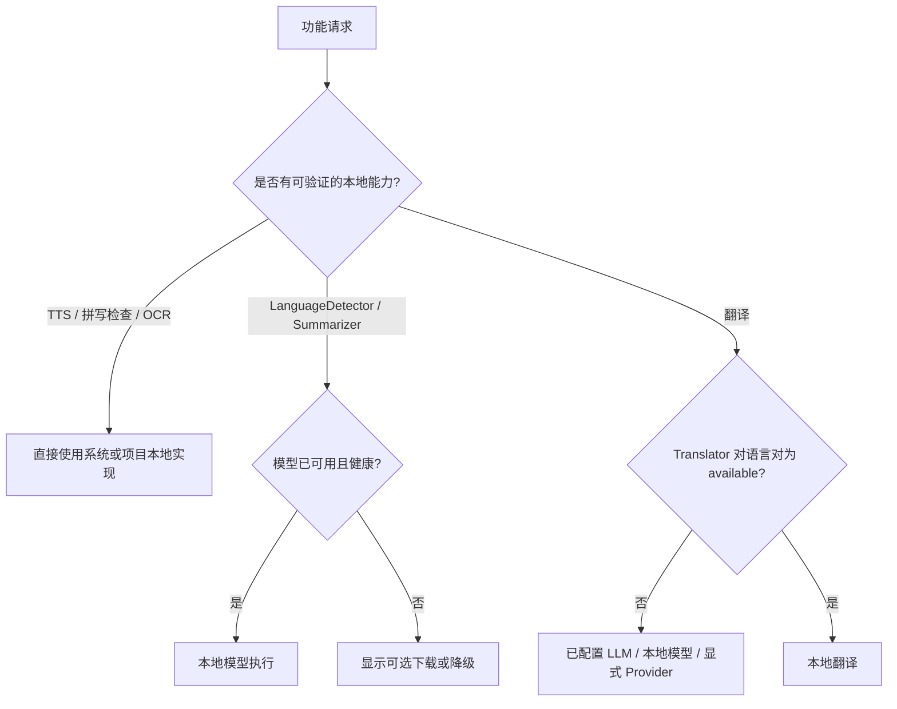

# 系统 WebView 免费能力调查记录

> 调查日期：2026-08-10  
> 状态：已完成真实 Windows Tauri WebView2 探针；部分模型下载能力仍为实验性结论。

## 1. 调查目的

评估 AIO Hub 是否能复用系统浏览器 / 系统 WebView 提供的免费能力，从而减少用户配置翻译模型、云端 API Key 或额外服务的成本。

本记录只描述已在当前开发机真实 Tauri WebView 中验证的结果，不把“浏览器存在某个 API”直接等同于“产品中可稳定交付”。

## 2. 当前浏览器表面与边界

项目中需要区分三种不同的表面：

| 表面                 | 当前实现                                    | 能否直接调用外部浏览器翻译 UI |
| -------------------- | ------------------------------------------- | ----------------------------- |
| AIO Hub 主窗口       | Tauri 系统 WebView；Windows 为 WebView2     | 否                            |
| 网页蒸馏室交互页     | 本地代理后的 sandbox iframe，并注入桥接脚本 | 否                            |
| “在系统浏览器中打开” | Tauri opener 将 URL 交给默认浏览器          | 否，仅能打开 URL              |

主窗口由 [`src-tauri/src/lib.rs`](../../src-tauri/src/lib.rs) 创建。网页蒸馏室的交互页面由 [`src/tools/web-distillery/core/iframe-bridge.ts`](../../src/tools/web-distillery/core/iframe-bridge.ts) 创建 iframe 并加载本地代理 URL；工具栏“在系统浏览器中打开”使用 [`src/tools/web-distillery/components/interactive/InteractiveToolbar.vue`](../../src/tools/web-distillery/components/interactive/InteractiveToolbar.vue) 中的 opener。

因此，AIO Hub 不能可靠地调用 Edge/Chrome 地址栏里的翻译菜单，也不能读取外部浏览器翻译后的 DOM、Cookie、密码或扩展状态。可以评估的是**应用自身 WebView 和操作系统公开暴露的能力**。

## 3. 测试环境与方法

### 3.1 环境

| 项目                           | 实测值                                                 |
| ------------------------------ | ------------------------------------------------------ |
| 平台                           | Windows 10 专业工作站版 x64                            |
| WebView Runtime                | Microsoft Edge WebView2 Runtime `151.0.4129.72`        |
| 应用运行方式                   | 已编译的 Tauri debug 二进制 + WebdriverIO Tauri E2E    |
| 页面上下文                     | `http://localhost:<port>/`，`isSecureContext === true` |
| WebView User-Agent（源码默认） | 固定为 Chrome `122.0.0.0`                              |

探针使用项目现有 [`tests/tauri-e2e/wdio.conf.ts`](../../tests/tauri-e2e/wdio.conf.ts) 启动真实 Tauri 窗口并通过 WebDriver 在 WebView 内执行 JavaScript。所有模型下载尝试都使用隔离的 E2E 用户数据目录，测试完成后清理。

### 3.2 User-Agent 对照

[`src-tauri/src/lib.rs`](../../src-tauri/src/lib.rs) 为页面设置了固定 UA。为了排除它对内建 AI API 的影响，曾临时把 Chrome `122.0.0.0` 改为 `151.0.0.0`、重新构建、重跑探针，随后恢复源码并按原始源码重新构建 debug 二进制。

结果：Translator 的语言对可用性没有变化，仍全部为 `unavailable`。因此当前结论中，固定 UA **不是** Translator 不可用的充分解释。

## 4. 实测结果

### 4.1 翻译与语言能力

| 能力                                                    | API 表面    | 可用性实测                                                                                | 结论                     |
| ------------------------------------------------------- | ----------- | ----------------------------------------------------------------------------------------- | ------------------------ |
| `Translator`                                            | `function`  | `en→zh`、`zh→en`、`en→ja`、`ja→en`、`en→es`、`es→en`、`en→fr`、`de→en` 均为 `unavailable` | 不可作为默认本地翻译后端 |
| `LanguageDetector`                                      | `function`  | `availability()` 为 `downloadable`                                                        | 仅实验性候选             |
| `Summarizer`                                            | `function`  | `availability()` 为 `downloadable`                                                        | 可进一步做受控 PoC       |
| `Writer` / `Rewriter` / `Proofreader` / `LanguageModel` | `undefined` | 无可用入口                                                                                | 不可依赖                 |

#### Translator 结论

虽然 WebView2 暴露了 `Translator`，但当前运行环境中的常用语言对均无法创建本地模型。因此不能把它接入为“无配置、免费翻译”的默认实现，也不能在 UI 中仅依据 `typeof Translator === "function"` 展示可用入口。

正确的运行时策略应为：

```text
Translator API 存在
  ↓
Translator.availability({ sourceLanguage, targetLanguage })
  ↓
仅 available / downloadable（且完成可控下载）才可进入本地翻译路径
  ↓
否则继续使用已配置 LLM、本地模型或明确的可选 Provider
```

#### LanguageDetector 下载测试

对 `LanguageDetector.create()` 做了真实模型创建与中英文日文识别测试：

1. `availability()` 初始返回 `downloadable`；
2. 在 WebView 页面中后台启动 `create()`；
3. 以 5 秒间隔轮询；
4. 最长等待 5 分钟；
5. 未进入完成或明确错误状态。

这表示 `downloadable` 不能视为当前机器上立即可交付：可能是 WebView2 模型下载通道、网络、隔离用户目录、模型服务初始化或缺少进度回调导致。产品若继续验证，必须有下载进度、超时、取消和明确降级提示，且不得阻塞普通翻译流程。

### 4.2 文字朗读（TTS）

真实 WebView 探针结果：

```text
typeof speechSynthesis === "object"
首次 getVoices() 数量：0
等待 voiceschanged / 异步加载后：10
```

检测到的本地语音包括：

- `Microsoft Huihui`（zh-CN）
- `Microsoft Kangkang`（zh-CN）
- `Microsoft Yaoyao`（zh-CN）
- `Microsoft Mark`、`Microsoft Zira`、`Microsoft David`（en-US）
- `Microsoft Ayumi`、`Microsoft Haruka`、`Microsoft Ichiro`、`Microsoft Sayaka`（ja-JP）

另外，使用 Windows SAPI (`System.Speech.Synthesis.SpeechSynthesizer`) 导出 WAV 对系统声库进行了人工试听验证：

- `Microsoft Huihui` 为可信的中文偏女声；
- `Microsoft David` 为可信的英文男声；
- `Microsoft Kangkang` 的声库元数据标记为男性，但导出的音频与 `Microsoft Yaoyao` 曾逐字节相同，实际听感也偏女声。

**不要依据系统声库的 `Gender` 元数据直接在产品 UI 标注“男声”或“女声”。** 应按实际试听、运行时声音特征或保守的“语音名称”展示。SAPI 导出的声音与 WebView `speechSynthesis` 实际播放也可能不完全一致，正式接入仍需要真实播放验证。

TTS 是当前最适合优先接入的零 API Key 能力，可用于：

- 聊天消息和翻译结果朗读；
- OCR 识别结果朗读；
- 网页蒸馏室摘要朗读；
- 外语学习和字幕辅助。

### 4.3 其他 WebView API 表面

| API                                         | 实测值            | 建议                                                                   |
| ------------------------------------------- | ----------------- | ---------------------------------------------------------------------- |
| `webkitSpeechRecognition`                   | `function`        | 需要单独验证麦克风权限、离线性、联网依赖和跨平台表现；不可承诺免费离线 |
| `spellcheck`                                | textarea 属性可用 | 可用于聊天、翻译和富文本输入框；需按词典缺失优雅降级                   |
| `EyeDropper`                                | `function`        | 可简化取色类工具                                                       |
| `IdleDetector`                              | `function`        | 有权限和隐私语义，不能静默启用                                         |
| `CompressionStream` / `DecompressionStream` | `function`        | 可用于本地导入导出或压缩辅助                                           |
| `showOpenFilePicker` / `showSaveFilePicker` | `function`        | 项目已有 Tauri 原生文件能力，优先复用项目封装                          |
| `BarcodeDetector`                           | `undefined`       | 不可依赖浏览器原生实现                                                 |

### 4.4 浏览器扩展与宿主 API

页面中存在 `chrome.webview`，这是 WebView2 宿主通信对象，不代表 Chrome/Edge 浏览器扩展已安装或可用。

当前项目未在窗口构建中调用 `browser_extensions_enabled(true)`，也未配置扩展路径。即使后续启用，扩展也不是跨平台统一能力，并且网页蒸馏室使用本地代理 URL，普通针对原始站点匹配的内容脚本不一定直接生效。

浏览器扩展不应作为当前“免费翻译”方案的首选。

## 5. 产品决策建议

### 5.1 可直接推进

1. 建立统一的 `platform-capabilities` / `local-capabilities` 探测层。
2. 在初始化后异步加载系统声音列表，使用 `voiceschanged` 处理延迟加载。
3. 将 TTS 接入聊天、翻译、OCR 和网页摘要的朗读入口。
4. 对编辑器和输入框启用 `spellcheck`，但不承诺词典覆盖。
5. 继续优先复用已有 Windows OCR 和 Tesseract 路径。

### 5.2 仅作为实验性功能

1. LanguageDetector：仅在用户主动启用或诊断页中尝试模型下载；必须具备超时、取消和回退。
2. Summarizer：先做短文本、可取消、可观察下载进度的 PoC；不可替代现有 LLM 摘要链路。
3. Speech Recognition：先验证权限、网络和隐私语义，再决定是否暴露给普通用户。

### 5.3 暂不作为默认依赖

1. WebView `Translator` 本地翻译；
2. 外部 Edge/Chrome 翻译菜单；
3. 用户 Edge 配置文件、密码、Cookie 或扩展；
4. 不受控的公共免费翻译站点接口；
5. 仅根据系统声库 Gender 元数据选择“男声”。

## 6. 推荐能力选择链



## 7. 后续验证清单

- [ ] 为 TTS 增加真实 WebView 播放测试，而不只验证声音列表和 SAPI 文件导出。
- [ ] 验证 `speechSynthesis` 的不同声库在 WebView 与 SAPI 导出之间是否一致。
- [ ] 为 LanguageDetector / Summarizer 记录下载事件、网络请求、错误和落盘位置，定位 5 分钟未完成的原因。
- [ ] 在普通持久化用户目录与 E2E 隔离目录分别验证模型下载行为。
- [ ] 为本地能力探测建立缓存、健康状态和用户可见的隐私说明。
- [ ] 对网页蒸馏室实现“选中文本/摘要翻译”前，先定义 DOM 保留、缓存、撤销与动态页面增量更新策略。

