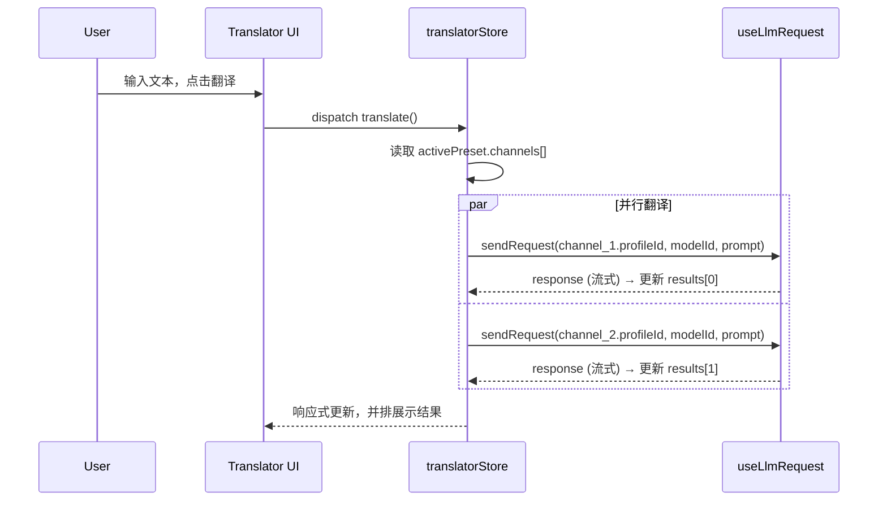

# 翻译工作台 v2 · 实施计划

> **状态**: RFC (Request for Comments)
> **前置文档**: [`translation-workbench-design.md`](./translation-workbench-design.md)（已过时，仅供参考）
> **调查结论**: 传统翻译 API 彻底抛弃，只做纯 LLM 翻译；核心卖点是"多渠道并排对比"

## 1. 定位与核心价值

翻译工作台是一个**独立工具**（`src/tools/translator/`），提供：

- **多渠道并行翻译**：同时调用 2-4 个 LLM 渠道翻译同一段文本，结果并排展示
- **对比模式**：让用户直观看到不同模型/Prompt 的翻译差异，辅助选择最佳译文
- **场景预设**：快速切换"快速查词"、"学术精翻"、"代码注释翻译"等预设组合
- **独立自治**：不侵入 llm-chat / media-generator 现有翻译逻辑，各自场景各自处理

**不做的事**：

- ❌ 传统翻译 API（DeepL / Google / Microsoft）
- ❌ 图片/文档翻译（留给 smart-ocr + VLM）
- ❌ 复杂的翻译记忆库 / 术语表管理
- ❌ 全局翻译抽象层（各工具各管各的，底层都调 useLlmRequest，无需再包一层）

## 2. 架构设计

### 2.1 整体分层

```
┌─────────────────────────────────────────────────────┐
│  UI Layer (Translator.vue)                          │
│  ┌──────────┐ ┌──────────────┐ ┌────────────────┐  │
│  │PresetBar │ │ InputPanel   │ │ ResultsPanel   │  │
│  │(预设切换) │ │ (输入+语言)  │ │ (并排对比结果) │  │
│  └──────────┘ └──────────────┘ └────────────────┘  │
├─────────────────────────────────────────────────────┤
│  State Layer                                        │
│  ┌──────────────────────────────────────────────┐   │
│  │ useTranslatorStore (Pinia)                   │   │
│  │ - presets, activePreset, channels            │   │
│  │ - inputText, results[], isTranslating        │   │
│  └──────────────────────────────────────────────┘   │
├─────────────────────────────────────────────────────┤
│  Infrastructure (已有，直接调用)                      │
│  ┌────────────────┐ ┌───────────────────────────┐   │
│  │ useLlmRequest  │ │ useLlmProfiles            │   │
│  └────────────────┘ └───────────────────────────┘   │
└─────────────────────────────────────────────────────┘
```

> **设计原则**：翻译工作台是一个完全自治的工具，直接调用 `useLlmRequest` 发请求。
> 不抽象全局翻译 composable——llm-chat 和 media-generator 各自有自己的翻译场景和上下文逻辑，
> 它们底层都调统一的 LLM 服务，没有再包一层的必要。

### 2.2 数据流



## 3. 核心类型定义

```typescript
// src/tools/translator/types.ts

/** 翻译渠道：一个 LLM Profile + Model 的组合 */
export interface TranslationChannel {
  id: string; // 渠道实例 ID
  displayName: string; // UI 显示名，如 "DeepSeek V3"
  profileId: string; // 对应 llm-profiles 中的 id
  modelId: string; // 对应 profile 中的 model id
  prompt?: string; // 可选的自定义翻译 Prompt（覆盖预设级别的）
  temperature?: number; // 可选覆盖
  maxTokens?: number; // 可选覆盖
}

/** 预设：一组渠道的组合 */
export interface TranslatorPreset {
  id: string;
  name: string; // 如 "快速查词"、"学术精翻"
  icon?: string; // Lucide 图标名
  channels: TranslationChannel[];
  defaultSourceLang: string; // 如 "auto"
  defaultTargetLang: string; // 如 "Chinese"
  prompt: string; // 预设级别的翻译 Prompt 模板
  // Prompt 模板支持占位符：{text}, {sourceLang}, {targetLang}
}

/** 单个渠道的翻译结果 */
export interface TranslationResult {
  channelId: string;
  channelName: string;
  content: string; // 翻译结果文本
  isStreaming: boolean; // 是否正在流式输出
  error?: string; // 错误信息
  duration?: number; // 耗时 (ms)
  tokenUsage?: {
    promptTokens: number;
    completionTokens: number;
  };
}

/** 翻译历史条目 */
export interface TranslationHistoryEntry {
  id: string;
  timestamp: number;
  sourceText: string;
  sourceLang: string;
  targetLang: string;
  presetId: string;
  results: TranslationResult[];
}
```

## 4. 工具内部核心逻辑

翻译工作台内部直接调用 `useLlmRequest`，不做额外抽象层。核心逻辑放在工具私有的 composable 中：

```typescript
// src/tools/translator/composables/useTranslatorCore.ts

export function useTranslatorCore() {
  const { sendRequest } = useLlmRequest();

  /**
   * 单渠道翻译（支持流式）
   */
  const translateChannel = async (
    text: string,
    channel: TranslationChannel,
    options: {
      targetLang: string;
      sourceLang?: string;
      basePrompt: string; // 预设级别的 Prompt 模板
      onStream?: (chunk: string) => void;
      signal?: AbortSignal;
    }
  ): Promise<TranslationResult> => {
    const prompt = buildPrompt(text, channel, options);
    const startTime = Date.now();

    const response = await sendRequest({
      profileId: channel.profileId,
      modelId: channel.modelId,
      messages: [{ role: "user", content: prompt }],
      temperature: channel.temperature ?? 0.3,
      maxTokens: channel.maxTokens ?? 4096,
      stream: !!options.onStream,
      onStream: options.onStream,
      signal: options.signal,
    });

    return {
      channelId: channel.id,
      channelName: channel.displayName,
      content: response.content,
      isStreaming: false,
      duration: Date.now() - startTime,
      tokenUsage: response.usage,
    };
  };

  /**
   * 多渠道并行翻译
   * 使用 Promise.allSettled，某个渠道失败不影响其他
   */
  const translateParallel = async (
    text: string,
    channels: TranslationChannel[],
    options: {
      targetLang: string;
      sourceLang?: string;
      basePrompt: string;
      onChannelStream?: (channelId: string, chunk: string) => void;
      signal?: AbortSignal;
    }
  ): Promise<TranslationResult[]> => {
    const tasks = channels.map((ch) =>
      translateChannel(text, ch, {
        ...options,
        onStream: options.onChannelStream
          ? (chunk) => options.onChannelStream!(ch.id, chunk)
          : undefined,
      })
    );
    const settled = await Promise.allSettled(tasks);
    return settled.map((r, i) =>
      r.status === "fulfilled"
        ? r.value
        : {
            channelId: channels[i].id,
            channelName: channels[i].displayName,
            content: "",
            isStreaming: false,
            error: String(r.reason),
          }
    );
  };

  return { translateChannel, translateParallel };
}
```

## 5. UI 设计

### 5.1 布局

```
┌─────────────────────────────────────────────────────────┐
│ [预设栏] 🔤快速查词 | 📚学术精翻 | 💻代码注释 | ⚙️管理  │
├─────────────────────────────────────────────────────────┤
│                                                         │
│  ┌─────────────────────┐  ┌───────────────────────────┐ │
│  │                     │  │  渠道 1: DeepSeek V3      │ │
│  │   输入区域          │  │  ─────────────────────    │ │
│  │                     │  │  翻译结果...              │ │
│  │   (支持粘贴/拖放)   │  │                           │ │
│  │                     │  ├───────────────────────────┤ │
│  │                     │  │  渠道 2: GPT-4o-mini      │ │
│  │  ┌───────────────┐  │  │  ─────────────────────    │ │
│  │  │源语言 → 目标语言│  │  │  翻译结果...              │ │
│  │  └───────────────┘  │  │                           │ │
│  │                     │  ├───────────────────────────┤ │
│  │  [翻译] [清空]      │  │  渠道 3: Claude Haiku     │ │
│  │                     │  │  ─────────────────────    │ │
│  └─────────────────────┘  │  翻译结果...              │ │
│                           └───────────────────────────┘ │
├─────────────────────────────────────────────────────────┤
│ [历史记录] (可折叠)                                      │
└─────────────────────────────────────────────────────────┘
```

### 5.2 交互要点

- **流式输出**：每个渠道独立流式，打字机效果，先到先显示
- **一键复制**：每个结果卡片右上角有复制按钮
- **耗时对比**：每个结果卡片底部显示耗时和 token 用量
- **快捷键**：Ctrl+Enter 触发翻译（遵循项目规范）
- **语言切换**：支持一键交换源/目标语言
- **自动检测**：源语言默认 "auto"，由 LLM 自行判断

## 6. 分阶段实施

### Phase 1：最小可用工具（MVP）

**目标**：能翻译、能对比、能用

1. 创建 `src/tools/translator/` 目录结构：
   ```
   src/tools/translator/
   ├── translator.registry.ts
   ├── Translator.vue
   ├── types.ts
   ├── composables/
   │   ├── useTranslatorCore.ts
   │   └── useTranslatorStore.ts
   └── components/
       ├── InputPanel.vue
       └── ResultsPanel.vue
   ```
2. 实现核心类型定义
3. 实现单渠道翻译（流式）
4. 实现多渠道并行翻译 + 并排展示
5. 硬编码 1-2 个默认预设（用户已有的 LLM Profile 中选）

**交付物**：一个能用的翻译工具，支持 1-4 个渠道并排对比

### Phase 2：预设系统 + 配置持久化

**目标**：用户可以自定义和管理预设

1. 实现预设的 CRUD（创建/编辑/删除/排序）
2. 预设持久化到 `appConfigDir/translator/presets.json`
3. 预设编辑器对话框（选择 Profile + Model + 自定义 Prompt）
4. 预设栏 UI（顶部 Tab 式切换）
5. 内置 3-4 个开箱即用的默认预设模板

### Phase 3：体验打磨 + 历史记录

**目标**：日常可用的完整工具

1. 翻译历史记录（本地持久化，可搜索）
2. 结果 Diff 高亮（标记不同渠道翻译的差异部分）
3. 语言列表管理（常用语言快速切换）
4. 快捷键优化、DropZone 支持（拖入文本文件自动填充）

### Phase 4（可选）：高级功能

- 批量翻译（多段文本队列）
- 翻译质量评分（让另一个 LLM 打分）
- 术语表注入（在 Prompt 中附加术语对照表）
- 与 llm-chat 联动（聊天中选中文本 → 发送到翻译工作台）

## 7. 技术决策记录

| 决策             | 选择                               | 理由                                                                    |
| ---------------- | ---------------------------------- | ----------------------------------------------------------------------- |
| 传统翻译 API     | **不做**                           | LLM 翻译质量已全面超越，且传统 API 网络不稳定、门槛高                   |
| 状态管理         | Pinia Store                        | 工具内部状态较复杂（预设、多渠道结果、历史），适合 Store                |
| 配置持久化       | `createConfigManager`              | 复用项目已有的文件系统配置管理器                                        |
| 流式输出         | 复用 `useLlmRequest` 的 `onStream` | 已有成熟实现，无需重造                                                  |
| 并行请求         | `Promise.allSettled`               | 某个渠道失败不影响其他渠道                                              |
| Prompt 模板      | 预设级 + 渠道级覆盖                | 灵活性与简洁性的平衡                                                    |
| 与现有翻译的关系 | 不侵入，各管各的                   | llm-chat / media-generator 各有场景，底层都调 useLlmRequest，无需再抽象 |

## 8. 与原设计文档的差异总结

| 原设计                              | v2 计划                               | 变更原因                                            |
| ----------------------------------- | ------------------------------------- | --------------------------------------------------- |
| `TranslationProvider` 接口 + 多实现 | 只有 LLM 实现，直接调 `useLlmRequest` | 传统 API 已抛弃                                     |
| `TraditionalTranslationProvider`    | ❌ 删除                               | LLM 全面超越                                        |
| `translation-profiles.json`         | ❌ 删除                               | 直接复用 `llm-profiles`                             |
| `PresetSlot` 复杂结构               | 简化为 `TranslatorPreset`             | 去掉了 `providerType` 分支                          |
| 三阶段（含传统 API 扩展）           | 四阶段（纯 LLM，聚焦对比体验）        | 方向调整                                            |
| 独立的 `useTranslationProfiles`     | ❌ 不需要                             | 直接用已有的 LLM Profile 体系                       |
| 全局共享 composable                 | ❌ 不做                               | 各工具场景不同，底层都调统一 LLM 服务，无需再包一层 |
