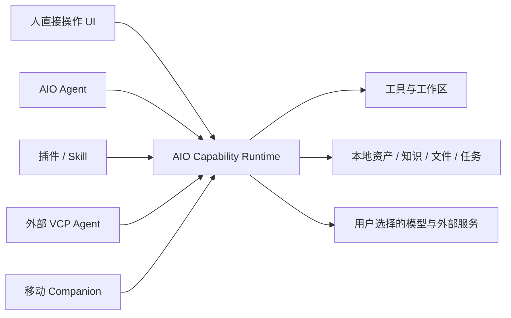
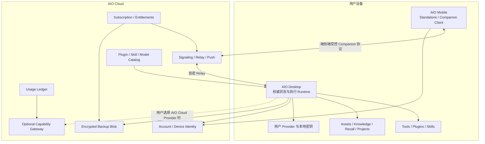

# AIO Hub 自营订阅服务调查

> 状态：可能性调查；已补充低成本云服务估算与客户端基础建设缺口，不代表进入实施排期
>
> 最后更新：2026-08-06
>
> 范围：AIO Hub 产品本体、可比产品的云服务演进、适合 AIO 的订阅对象、云服务成本、客户端基础建设与落地顺序等构想
>
> 纠偏说明：旧版错误地把 AIO 当成“功能很多的 Chat 客户端”，因此把官方模型订阅放在了产品中心。该前提不成立，本文已删除旧结论并重新调查。

## 1. 先定义 AIO Hub 是什么

### 1.1 AIO 不是 Chat 客户端

Chat 是 AIO 当前最复杂、最成熟的旗舰工作区，但不是 AIO 的产品边界。

截至 2026-08-06，桌面端 `src/tools/` 下有 47 个 registry 文件，其中约 36 个同时提供服务注册，约 18 个明确向 Agent 暴露可调用方法。它们覆盖：

- Chat、Agent、上下文、Recall、Knowledge、Embedding 与媒体生成；
- OCR、转写、FFmpeg、网页蒸馏、Git 分析、文件和目录操作；
- 资产、用户档案、世界书、画布和任务管理；
- JS、Native、Sidecar 插件；
- Agent Skill、工具调用、VCP 远程工具桥接和分布式节点。

如果把 AIO 看成 Chat 客户端，就无法解释为什么它需要：

- 工具 UI 自动注册和统一工作区；
- `ToolRegistry`、统一执行器和 Agent Callable 方法；
- JS / Native / Sidecar 三种插件运行时；
- 应用级资产库、Knowledge、Recall 和 User Profile；
- 组件/工具分离窗口和跨窗口状态同步；
- VCP 分布式节点以及桌面作为 Companion Backend 的构想。

### 1.2 AIO 的产品公式

更准确的定义是：

> **AIO Hub 是一个本地优先、可扩展、同时面向人和 Agent 的个人能力枢纽。**
>
> 它把复杂 AI、内容、文件、媒体和系统能力放进统一工作区；用户可以直接操作，Agent 可以通过同一服务边界调用，插件和 Skill 可以继续扩展，桌面还可以作为用户自己的私有执行后端被其他设备或外部 Agent 使用。

可以拆成五层：

```text
工作区 Shell
  多标签、分离窗口、自由布局、统一设置与主题

能力 Runtime
  Tool Registry、Executor、异步任务、审批与权限

扩展系统
  内置工具、JS/Native/Sidecar 插件、Agent Skills

共享本地数据底座
  Asset、Knowledge、Recall、User Profile、会话与项目

智能与连接层
  LLM/Agent 编排、VCP 节点、移动 Companion、外部调用
```

Chat、媒体生成、Web Canvas、Knowledge 工作台等，是这个能力枢纽上的不同复杂应用，而不是所有工具都依附于 Chat。

### 1.3 “Hub”的真正含义

AIO 的关键不是“有很多工具”，而是同一能力可以拥有多个入口：



因此，AIO 的商业服务应该增强这个 Hub 的连接、分发、托管和协作能力，而不是只给 Chat 换一个默认模型 Provider。

## 2. 为什么 Chat 客户端会长出自己的模型订阅

Chatbox、LobeHub 等产品的主价值链基本是：

```text
用户输入 → 调用模型 → 显示结果
```

模型调用是产品每次使用都无法绕开的生产资料。因此它们增加官方模型套餐可以同时解决：

- 用户不会申请和充值 API；
- 模型选择和协议复杂；
- 移动端配置麻烦；
- 产品需要持续收入；
- 官方可以控制默认体验和可用性。

对它们来说，“官方模型服务”接近基础设施。

AIO 的价值链则是：

```text
用户或 Agent 表达意图
  → 调用本地/远程能力
  → 处理文件、资产、知识、媒体、系统或模型
  → 形成可继续编辑、执行、复用的结果
```

LLM 是重要的调度器和生产能力，但不是所有流程的必经上游。目录清理、FFmpeg、OCR、本地检索、文件处理、画板、Git 分析和插件运行可以完全不经过官方模型。

所以，直接复制 Chatbox 的订阅会产生三个问题：

1. 只改善一部分 AI 功能的开箱体验，没有增强整个 Hub；
2. 把产品重心从“用户自己的能力环境”推向“官方云模型入口”；
3. 收入高度依赖 Token 差价，但 AIO 的真正差异化并不在模型采购。

结论不是“不做官方模型”，而是：

> **官方模型应该是 AIO 云能力中的一个 Provider，不应该成为 AIO 订阅的定义。**

## 3. 更准确的可比产品

AIO 没有一个完全同类产品。更合适的比较方法是按产品结构寻找参照。

### 3.1 Raycast：工具 Shell、扩展生态与 AI 控制层

Raycast 最接近 AIO 的“统一入口 + 扩展 + AI 调工具”结构：

- 扩展是产品能力的基本构件；
- Store 负责发现、安装和自动更新；
- 普通命令可以直接由人执行；
- 扩展声明 AI Tools 后，Raycast AI 可以在 Chat、Quick AI 和 Root Search 中调用它；
- Pro 订阅承载 AI、跨设备和团队价值。

对 AIO 的启示：

- AI 订阅的价值不只是回答问题，而是让 AI 操作整个扩展能力网络；
- 官方 Store、更新、权限和团队私有扩展属于 Hub 级服务；
- 订阅可以解锁云端 AI 控制层，但本地工具仍可独立工作。

### 3.2 Home Assistant Cloud：本地 Hub 外围的付费连接层

Home Assistant 的核心和用户数据保持本地，Nabu Casa 的订阅主要提供：

- 无需配置端口和证书的安全远程访问；
- 云备份；
- 语音助手云连接；
- Webhook 和更方便的云集成；
- 通过订阅反哺开源项目。

这与 AIO 的桌面 Companion Backend 构想高度对应。AIO 桌面拥有模型密钥、工具、插件、资产和任务；付费云层不必接管它们，只需提供安全的设备身份、连接、备份和通知。

### 3.3 Obsidian：Local-first 核心与可选官方服务

Obsidian 的本地知识库可免费使用，官方按需销售 Sync 和 Publish：

- 不订阅也能继续使用本地文件；
- Sync 解决设备、版本历史和端到端加密；
- Publish 把本地内容选择性发布为公共服务；
- 付费对象是跨边界能力，而不是本地编辑器本身。

对 AIO 的启示：

- 本地数据所有权与官方订阅可以共存；
- “备份/同步”和“发布/分享”应分成不同授权边界；
- 订阅失效不能让用户失去本地数据或核心能力。

但 AIO 不应直接复制 Obsidian 的全量多端同步。现有 Companion 构想已经明确：桌面应作为权威后端，移动端通过受控协议访问，避免把模型密钥、插件、资产和复杂任务做成多主复制。

### 3.4 Msty：本地 AI 工作台向控制中心和团队服务演进

Msty 当前产品族包含：

- Studio：本地/在线模型、知识、工具、MCP 和 AI 工作区；
- Go：移动访问；
- Nexus：集中管理模型、凭据、预设、权限和 OpenAI-compatible 访问；
- Stack：面向组织的自托管部署与治理。

这说明当产品从 Chat 成长为能力工作台后，付费重心会转向：

- 中央 Provider 和凭据管理；
- 团队共享的智能体、预设和知识；
- 访问控制、审计和多应用接入；
- 私有部署与支持。

这比单纯的模型月卡更接近 AIO 后期可能形成的产品结构。

### 3.5 n8n / Dify：本地执行引擎与托管控制面

n8n 和 Dify 都保留自托管路径，同时销售官方 Cloud 或商业自托管版本：

- 用户付费购买免运维、团队协作、权限、监控、支持和更高资源；
- 价格通常按工作流执行、消息、团队规模或资源，而不是只按 Token；
- 可变 AI 用量和稳定的软件/托管权益被分开计量。

对 AIO 的启示：如果未来出现远程任务、共享工作流、团队节点和托管执行，应该按“节点、任务、存储、并发和席位”计价，而不是全部换算成模型积分。

## 4. AIO 真正适合卖什么

### 4.1 推荐的产品分层

建议把官方商业服务作为 `AIO Cloud` 总称，下面分成三类性质完全不同的产品。

#### AIO Link：连接用户自己的 Hub

这是最符合 AIO 本体、也最类似 Nabu Casa 的订阅。

可包含：

- AIO 账号和设备身份；
- 桌面—移动端安全配对；
- 官方 Relay / 信令 / Endpoint 协调，免去 VPN、FRP 和端口配置；
- 后台任务完成、审批请求和异常的推送通知；
- 桌面在线状态和设备管理；
- 端到端加密的配置与元数据备份；
- 受控的临时资产传输；
- 远程访问审计和设备撤销。

关键原则：

- 桌面仍是业务真源和执行端；
- AIO Cloud 只处理连接和必要状态，不默认复制完整业务数据库；
- Relay 尽量传输端到端加密的数据；
- 不把桌面内部 Tauri command、文件路径或任意代理直接暴露到公网。

#### AIO Capability Cloud：官方托管能力

这是一个按需能力网络，不应和固定订阅无限绑定。

可逐步提供：

- 官方模型 Gateway；
- Web Search、网页抓取和公开网页蒸馏；
- 云端 OCR、转写、Embedding、Rerank；
- 高成本媒体生成；
- Webhook 入口、定时触发和轻量后台任务；
- 桌面离线时可运行的少量纯云 Skill。

这些服务有明显的可变成本，应使用独立的 `AIO Credits` 或按量账单。订阅可以赠送少量额度，但不能定义为无限使用。

官方模型的作用是：

- 新用户免配置完成第一次 AI 操作；
- 给 Agent 和依赖 LLM 的工具提供可靠默认 Provider；
- 作为 BYOK、本地模型之外的可选后备；
- 支撑云端任务，而不是取代用户的模型配置。

#### AIO Team / Control Plane：管理多个用户和节点

后期高价值产品可能包括：

- 团队成员、角色和设备节点；
- 共享 Agent、Skill、插件、工作流和 Knowledge；
- 统一 Provider、凭据代理和预算；
- 工具权限、自动审批政策和高风险操作审计；
- 私有插件/Skill Catalog；
- 远程节点健康、任务和版本管理；
- SSO、数据保留、私有部署与支持。

它卖的是治理和协作，不是更多 Chat 次数。

### 4.2 免费核心应该保持什么

AIO 的免费本地层应继续包含：

- 不登录即可使用的工作区 Shell；
- 本地工具和本地文件处理；
- BYOK、本地模型和用户自建 Provider；
- 本地 Asset、Knowledge、Recall、Agent 和项目；
- 本地安装的插件与 Skill；
- 手动配置的局域网、VPN 或自有隧道 Companion 路径；
- 数据导出、备份和迁移的基础能力。

否则订阅会从“增强 Hub”变成“租用自己的本地工作环境”。

### 4.3 不建议收费或锁定的对象

- 已经存在的本地工具；
- BYOK 和本地模型；
- 用户自己的文件和资产访问；
- 基础插件 API、Tool Registry 和 Skill Runtime；
- 本地数据导出；
- 高风险操作的安全审批；
- 用户自己搭建的网络和 Provider。

可以收费的是官方代运营、托管、连接、分发、协作和计算，而不是本地所有权。

## 5. 推荐套餐结构

当前阶段不应立刻锁死价格，下面只作为产品实验假设。

### Local — 免费

- 完整本地 Hub；
- BYOK / Local Model；
- 插件、Skill 和工具调用；
- 手动网络连接；
- 可获得一次性 AIO Capability Cloud 体验额度。

### Link — 约 ¥25–35 / $4–6 每月

- 3–5 台设备身份；
- 官方远程连接和 Relay；
- 任务与审批推送；
- 端到端加密的配置、Agent 和元数据备份；
- 有限备份空间和历史版本；
- 不包含大量模型成本。

该价格需要按 Relay 带宽、存储、推送和支持的真实成本重新测算。

### Plus — 约 ¥58–88 / $9–14 每月

- Link 全部能力；
- 更多设备、备份和历史；
- Webhook、定时触发和托管轻量任务；
- 官方 Catalog、跨设备配置分发和高级恢复；
- 每月少量 AIO Credits；
- 可能包含官方签名能力包或高级工作流，但不应关闭开放生态。

### Compute — 独立余额

- 模型、搜索、OCR、转写、Embedding、图片和视频按量；
- 输入、输出、图片、秒数等价格透明；
- 用户可设置“订阅额度耗尽后停止”；
- BYOK 使用不经过 AIO 计费。

### Team — 席位 + 节点 + 用量

- 席位费承载权限、共享、审计和支持；
- 节点/Relay/存储按资源；
- AI 和媒体计算按量；
- 私有部署单独报价。

## 6. 为什么不应先做模型月卡

### 6.1 它没有覆盖 AIO 的核心网络效应

AIO 的复利来自：

- 更多工具接入统一 Runtime；
- 更多工具可同时被人、Agent 和外部节点调用；
- 资产、知识、任务和结果在工具之间复用；
- 用户逐步构建自己的 Agent、Skill、工作流和能力环境。

模型月卡只降低一次请求的配置门槛，不会自然增强这些复利。

### 6.2 当前产品还没有稳定的云服务对象

AIO 当前是 `0.7.0-alpha.1`，尚未发现成熟的：

- 账号与设备身份；
- 支付和 Entitlement；
- 安全凭据存储；
- Companion Gateway；
- Relay、Push 和云备份；
- 线上 Catalog 和签名分发；
- 商业计量、退款和支持后台。

此时直接增加模型套餐，最容易造出一个与本地 Hub 松散耦合的 API 中转业务。

### 6.3 开源桌面的付费价值必须在服务端成立

桌面端使用 Apache-2.0。纯客户端付费墙不可靠，也不符合当前开放定位。真正稳定的商业价值应来自用户无法通过删掉一个条件判断得到的服务：

- 官方 Relay 和 Push；
- 加密云备份；
- 托管能力；
- 官方 Catalog、签名、扫描和更新；
- 团队控制面；
- 服务质量与支持。

## 7. AIO Cloud 的推荐架构



### 7.1 Cloud 是协调层，不是默认业务真源

- 设备、套餐、连接、Catalog 和账单由 Cloud 管理；
- 会话、项目、资产、密钥和工具状态默认仍由桌面管理；
- Backup 保存加密快照或增量，不直接成为在线数据库；
- Companion 命令由桌面验证并执行，Cloud Relay 不能绕过 scope 和审批。

### 7.2 Model Gateway 是独立 Provider

现有 `resolveModelExecution()` 和聚合渠道路由基础适合支持官方模型 Provider，但它应是 Capability Cloud 的一个模块：

- `aio-cloud` 表示渠道身份；
- Model Catalog 返回实际协议和能力；
- 客户端继续复用 OpenAI Responses、Anthropic、Gemini 等 adapter；
- AIO Account 鉴权与静态 `apiKeys` 分离；
- 所有计量和限额服务端执行；
- 不向客户端下发共享上游 Key。

### 7.3 Catalog 不应变成封闭商店

公共插件和 Skill 的发现、安装与基础更新应尽量开放。官方云服务可以提供：

- 作者身份和包签名；
- 恶意行为/权限扫描；
- 平台产物自动验证；
- 兼容性矩阵与崩溃反馈；
- 私有 Catalog 和团队分发；
- 托管构建与发布；
- 付费能力包的许可证与分成。

收费对象是信任、托管和私有分发，不是阻止用户加载本地插件。

## 8. 分阶段落地

### Phase 0：先固定产品边界

在做支付前完成：

1. 明确 AIO Hub、AIO Link、AIO Capability Cloud、AIO Team 的边界；
2. 明确 Local 模式在无账号、订阅过期和 Cloud 故障时仍然可用；
3. 定义设备身份、权限 scope、远程任务和审计契约；
4. 定义哪些数据可备份、哪些只可留在桌面、哪些可选择性发布；
5. 建立插件/Skill/模型 Catalog 的统一身份和版本契约。

### Phase 1：账号、设备身份与加密备份

这是最小可收费服务的地基：

- Account 和 Device Session；
- 系统 Keychain/Credential Manager 安全存储；
- 设备配对、撤销和恢复；
- 加密配置/元数据备份；
- 真实的恢复演练；
- Subscription/Entitlement 骨架，但先不公开收费。

### Phase 2：Companion Gateway 与 Link 内测

- 桌面 Companion Backend；
- 局域网和用户自有网络路径；
- 官方信令/Relay 作为独立 provider；
- Push、任务恢复、事件 cursor；
- 权限 scope、高风险审批和审计；
- 邀请制验证 Relay 成本与远程使用频率。

只有用户确实持续使用远程访问、推送和备份后，才正式上线 Link 订阅。

### Phase 3：Catalog 与跨设备能力分发

- 官方插件/Skill Catalog；
- 包签名、权限声明、平台产物检查；
- 自动更新与兼容提示；
- Agent、Skill、模型预设的账号级备份和显式分发；
- 私有 Catalog 作为 Team 前置能力。

### Phase 4：Capability Cloud

- 官方模型和低门槛体验；
- Search、OCR、转写、Embedding 等托管能力；
- Webhook、Scheduler 和少量云任务；
- 独立 Credits、计量、退款和风控；
- 明确国内/海外 Provider、数据和合规边界。

### Phase 5：Team / Enterprise

- 组织、席位、节点、预算和审计；
- 共享 Agent、Knowledge、Skill、插件和工作流；
- Provider 凭据代理；
- SSO、私有化、SLA 和支持。

## 9. 一个贫穷个人开发者能否负担：云服务成本估算

### 9.1 估算口径

以下不是采购承诺，而是截至 **2026-08-06** 的公开标价快照，用来判断“这个可能性值不值得继续保留”。

- 美元与人民币只按规划汇率 `1 USD ≈ ¥7.2` 粗算，不作为财务报价；
- 未含增值税、汇损、提现费、退款、拒付、人工支持、法律/隐私合规和安全事故成本；
- 未含模型、图片、视频、搜索等上游可变成本；这些必须由 Credits 或 BYOK 单独覆盖；
- 免费层只能用于验证，不应把“永久免费且永不改价”写进产品承诺；
- 最大不确定项不是数据库，而是 **Relay 流量、支付费率和个人维护时间**。

### 9.2 一套便宜但不要求自建所有东西的价格锚点

这不是最终选型，只是一套容易退出、适合小流量验证的成本基线。

| 能力                             | 可选服务与公开价格锚点                                                                              | 适合 AIO 的用法                                             | 主要风险                                                               |
| -------------------------------- | --------------------------------------------------------------------------------------------------- | ----------------------------------------------------------- | ---------------------------------------------------------------------- |
| API、Webhook、定时任务、轻量协调 | Cloudflare Workers Free；Paid 最低 `$5/月`，含 `10M` 请求和 `30M` CPU ms                            | Account API 外围、支付 Webhook、Catalog、签名 URL、轻量信令 | 复杂状态和长任务不应全部塞进 Worker                                    |
| Account、Postgres、管理后台地基  | Supabase Free；Pro `$25/月`，含 `100k MAU`、`8GB` 数据库、`100GB` Storage、`250GB` Egress           | 先购买 Auth、DB、基础后台，不自己造完整身份系统             | 免费项目和正式 SLA 边界；供应商绑定；大陆网络质量                      |
| 加密备份对象                     | Cloudflare R2 每月前 `10GB` 免费，之后标准存储 `$0.015/GB-month`；外网出口免费                      | 只保存客户端加密后的快照、增量块和 manifest                 | 请求次数、保留策略和误上传大资产仍会产生费用                           |
| Relay / TURN                     | Cloudflare Realtime TURN 每月前 `1,000GB` 免费，之后 `$0.05/GB`，按从 TURN 服务到客户端的出站流量计 | NAT 穿透失败后的兜底；默认优先直连                          | 大文件、桌面画面或持续媒体流会迅速把成本推高；不能据此承诺中国大陆体验 |
| 事务邮件                         | Resend Free `3,000 封/月`、`100 封/日`；Pro `$20/月`、`50,000 封/月`                                | 登录验证、设备通知、账单和安全邮件                          | 免费层的每日上限很容易在登录异常时触发                                 |
| Push、崩溃、远程开关             | Firebase 的 Cloud Messaging、Crashlytics、Remote Config 等列为 no-cost 产品                         | 移动 Push、崩溃聚合、云功能 kill switch                     | 又增加一个供应商；SDK、隐私披露和地区可达性要单独验证                  |
| 全球收款与税务代办               | Paddle 标准公开价 `5% + $0.50/笔`，无月费；低于 `$10` 的产品可询问定制微支付费率                    | 让 Merchant of Record 处理销售税/VAT、收据和订阅            | 低客单价固定手续费很伤；开户、提现地区和审核必须先确认                 |
| 仅支付处理的对照                 | Stripe 美国线上银行卡标准价 `2.9% + $0.30/笔`                                                       | 在已有公司、税务和结算能力时比较                            | 不是完整的全球税务代办；不能只比较表面费率                             |

如果只看服务器账单，一个 Hetzner CX23 公开起价约 `$6.49/月`，确实可以把 API、数据库甚至 coturn 都塞进一台机器。但这同时把补丁、备份、监控、入侵响应、单点故障和半夜恢复交给一个人。它适合实验或可随时丢弃的内测，不应因为“月租更低”就默认成为收费生产架构。

### 9.3 固定成本分阶段预算

| 阶段                     |                             建议直接现金上限 | 可以接受的形态                                        | 不应该做的事                                   |
| ------------------------ | -------------------------------------------: | ----------------------------------------------------- | ---------------------------------------------- |
| 文档、等待名单、假门测试 |                      `$0–5/月`（约 `¥0–36`） | 免费层、静态页面、手工邀请、假 Entitlement            | 为没有用户的服务购买高可用、独立数据库和多区域 |
| 10–100 人邀请内测        |                   `$5–30/月`（约 `¥36–216`） | Workers Paid + Supabase Free，或直接 Supabase Pro     | 自建支付、Kubernetes、多区域、全天候 Relay     |
| 出现真实付费用户         |                 `$30–50/月`（约 `¥216–360`） | Workers Paid + Supabase Pro；邮件超过免费层再加 `$20` | 因为已有月费就提前承诺 SLA 或无限流量          |
| iOS / Android 正式分发   | iOS `$99/年`；Google Play `$25` 一次性注册费 | 作为渠道门票单列，不混进云账单                        | 在未核对当期商店支付政策前设计客户端内购闭环   |

建议给这个可能性设置硬预算闸门：

1. 没有预付费或明确愿付费用户前，固定云账单尽量不超过 `$10/月`；
2. 第一批收费用户出现后，可以提高到 `$30–50/月`，但不要先买年付基础设施；
3. MRR 未超过 `$500` 前，固定基础设施尽量保持在 `$50/月` 内；
4. 任何需要 `$100/月` 以上固定成本的设计，都必须先用真实用量证明必要性；
5. 额度、预算和云功能必须有服务端 kill switch，不能依赖发新版客户端止血。

### 9.4 存储很便宜，Relay 才可能失控

按 R2 当前标准存储价和 `10GB` 免费层估算，仅计算容量、不计算请求：

| 假设                            |    总存储 |   约月费 |
| ------------------------------- | --------: | -------: |
| 100 用户，每人 `200MB` 加密备份 |    `20GB` |  `$0.15` |
| 1,000 用户，每人 `200MB`        |   `200GB` |  `$2.85` |
| 1,000 用户，每人 `1GB`          | `1,000GB` | `$14.85` |

这说明配置、Agent、元数据和小型 Knowledge 索引的备份本身并不贵。真正危险的是把完整资产库、媒体缓存或历史生成文件默认同步上云。

按 Realtime TURN 的 `1TB/月` 免费层和超额 `$0.05/GB` 估算：

| 假设                        | 月 Relay 出站 | 约月费 |
| --------------------------- | ------------: | -----: |
| 1,000 活跃用户，每人 `1GB`  |         `1TB` |   `$0` |
| 1,000 活跃用户，每人 `5GB`  |         `5TB` | `$200` |
| 10,000 活跃用户，每人 `1GB` |        `10TB` | `$450` |

因此 Link 必须从一开始就限定产品边界：

- 优先局域网、用户自有网络和端到端直连，Relay 只是失败回退；
- Relay 默认传命令、小结果和必要元数据，不承诺远程桌面、视频流或无限文件中转；
- 大资产使用短期签名上传、明确额度或用户自有对象存储；
- 服务端记录每设备、每账号和每任务的字节数，并支持即时限流；
- 定价前至少邀请制测出“每周远程任务数、直连成功率、每用户 Relay GB”。

### 9.5 低价月付的支付手续费比云账单更刺眼

按 Paddle 标准 `5% + $0.50/笔` 粗算：

|   客单价 | 单笔手续费 | 费率占比 |
| -------: | ---------: | -------: |
|  `$5/月` |    `$0.75` |  `15.0%` |
|  `$6/月` |    `$0.80` |  `13.3%` |
| `$10/月` |    `$1.00` |  `10.0%` |
| `$60/年` |    `$3.50` |   `5.8%` |

这直接挑战前文 `Link $4–6/月` 的假设。对个人开发者，更现实的验证方式是：

- 先做 `$48–60/年` 的创始用户年付，减少固定手续费和月度流失；
- 或把月付提高到能覆盖固定支付成本的价位，而不是靠“便宜”吸引没有强需求的用户；
- 如果一定要低于 `$10` 月付，先拿到微支付定制费率再公开价格；
- 不要为了省支付费率自己承担全球销售税、退款和订阅生命周期。

一个简单情景：100 名用户按 `$5/月` 支付，月收入 `$500`；Paddle 标准手续费约 `$75`，再加 `$30` 固定云成本，尚未计算支持、退款、税务、上游计算和个人时间，直接现金支出已经约占收入 `21%`。如果同样 100 人改为 `$60/年`，折算月收入仍是 `$500`，支付手续费折算约 `$29.17/月`，加 `$30` 云成本约占 `11.8%`。

### 9.6 可复算的月成本公式

```text
月直接现金成本
  = 固定平台费
  + max(0, 备份 GB - 免费 GB) × 存储单价
  + max(0, Relay GB - 免费 GB) × Relay 单价
  + 邮件 / 日志 / 监控超额
  + 支付笔数 × 固定手续费
  + 收入 × 百分比手续费
  + 模型 / 搜索 / OCR / 媒体等上游成本
  + 退款、拒付与汇损
```

Capability Cloud 不应使用“平均用户不会用很多”的无限套餐模型。最穷但最安全的做法仍是：**BYOK 优先，官方能力预付费，余额不足即停，用户自行设置月预算。**

### 9.7 最低成本推荐，不是最低服务器价格推荐

如果只验证一个可能性，推荐顺序是：

1. **先不做订阅**：等待名单 + 手工邀请 + 本地功能；
2. **先验证 Backup，再验证 Link**：Backup 的成本和协议边界更容易控制；
3. **使用托管 Auth/DB 和 MoR**：多花几十美元，少承担最容易出事故的身份、税务和订阅状态机；
4. **Relay 只做限额回退**：先测数据，不卖无限；
5. **不要同时做桌面、移动、模型 Gateway、Catalog 和 Team**；
6. 当付费用户证明价值后，再判断是否把托管服务迁到更便宜的自建组件。

这里的“贫穷”不只指现金，也指注意力。个人开发者最稀缺的是能处理故障、退款、安全告警和平台审核的时间，而不是再写一个 CRUD 服务的能力。

## 10. 应用客户端缺失的基础建设

### 10.1 仓库里已经有的地基

客户端不是从零开始，以下能力可以复用或改造：

- 桌面端已有 [`app-updater.ts`](../../../src/services/app-updater.ts)，支持 Tauri Updater 与 GitHub Release 检查；
- 桌面端已有较完整的 [`useDeepLinkHandler.ts`](../../../src/composables/useDeepLinkHandler.ts)，处理冷启动、热启动和多平台 Deep Link，并有敏感参数脱敏；
- 桌面和移动端都有 `createConfigManager`、模块 logger/error handler 和 Tauri HTTP 基础；
- 桌面端已有本地通知 store、启动管理、前端心跳/错误采集等本地运行基础；
- `web_distillery` 已实现面向 Cookie 的 Windows DPAPI、macOS Keychain、Linux libsecret/AES-GCM 加密，可作为跨平台实现经验参考；
- 移动端已有 [`http-client.ts`](../../../mobile/src/utils/http-client.ts) 的 Tauri HTTP、超时和取消封装。

但这些还不是可收费云服务的客户端平台：

- 当前 Deep Link 只处理 `add-profile`，而且历史协议允许 Key 出现在 URL 参数中；不能直接当 OAuth 回调实现；
- 通用 `ConfigManager` 写的是普通 JSON/YAML/JSONL 文件，不是安全凭据库；
- `web_distillery` 加密只服务于 Cookie，且不可用时允许明文 fallback，不能原样扩展为 Account refresh token 或设备私钥存储；
- 桌面端的 [`apiRequest.ts`](../../../src/utils/apiRequest.ts) 是 API Tester 的模板工具，不是带鉴权、重试和版本协商的 Cloud SDK；
- 移动端 [`user.ts`](../../../mobile/src/stores/user.ts) 只是把用户资料写入 `localStorage` 的占位状态，不构成真实登录会话；
- 移动端当前依赖中没有与桌面等价的 deep-link、updater、push 和安全凭据基础。

### 10.2 缺口矩阵

| 基础能力                        | 当前判断                                                         | 最小可接受实现                                                                                                                                                | 为什么是收费前置                                       |
| ------------------------------- | ---------------------------------------------------------------- | ------------------------------------------------------------------------------------------------------------------------------------------------------------- | ------------------------------------------------------ |
| Account 与 Session              | 桌面无统一 Account store/service；移动只有 localStorage 占位用户 | OAuth/OIDC 或托管 Auth；PKCE；access token 短时化；refresh 单飞刷新；登出与全设备撤销                                                                         | 无法可靠区分用户、恢复会话或处理盗用                   |
| Device Identity                 | 未发现安装身份、设备密钥、设备注册和撤销模型                     | 每次安装生成设备 ID 与非导出私钥；设备名、平台、版本、最后在线；密钥轮换和撤销                                                                                | Link、Backup 和审计都不能只信任账号 token              |
| 通用 Secret Vault               | 只有领域专用 Cookie 加密                                         | Rust/Tauri 统一 `SecretStore`；Windows Credential/DPAPI、macOS Keychain、Linux Secret Service、移动 Keychain/Keystore；不可用时明确拒绝云登录或降级为临时会话 | refresh token、设备私钥和恢复材料不能落普通配置文件    |
| AIO Cloud SDK                   | 只有分散 fetch/Tauri HTTP                                        | 统一 base URL、环境、鉴权头、超时、取消、指数退避、`Retry-After`、幂等键、request ID、客户端版本和协议版本                                                    | 否则每个工具都会复制一套易错网络逻辑                   |
| Entitlement 客户端              | 不存在                                                           | 服务端权威套餐；本地签名/缓存快照；过期时间、宽限期、刷新、降级和撤销；Local 功能永不被云故障锁死                                                             | 不能靠前端布尔值或支付成功页面决定权限                 |
| Billing 入口                    | 不存在                                                           | 浏览器 Checkout、Billing Portal、回跳校验；客户端只展示服务端 entitlement，不接受价格或套餐参数作为事实                                                       | 防止伪造套餐，处理退款、取消和 webhook 延迟            |
| Auth Deep Link / Universal Link | 桌面有协议基础，移动缺失                                         | `state`、`nonce`、PKCE verifier；一次性 code；禁止 token/key 出现在 URL；移动 App/Universal Link 与冷启动恢复                                                 | 登录回调是最容易泄漏 token 和出现重放的入口之一        |
| Encrypted Backup                | 只有 Recall 等领域本地备份，不是账号云备份                       | 数据分类、schema version、manifest、客户端加密、分块、断点续传、完整性哈希、保留策略、恢复暂存区、真实恢复演练                                                | “上传成功”不等于“能够恢复”；错误恢复会直接损坏用户数据 |
| Outbox / Inbox 与离线恢复       | 未发现统一实现                                                   | 本地持久队列、event cursor、幂等消费、重试上限、死信、冲突规则、网络状态机                                                                                    | 桌面离线、进程退出和重复推送是常态                     |
| Companion 配对协议              | 仍是设计构想                                                     | 二维码/短码配对、临时握手、设备公钥确认、scope、命令白名单、高风险审批、会话过期、直接/Relay 路径协商                                                         | 不能把任意 Tauri command、文件路径或本地代理暴露给远端 |
| Push                            | 桌面只有应用内通知，移动无 Push 注册链路                         | APNs/FCM token 注册、轮换、失效清理、用户/设备路由、敏感内容最小化、点击恢复任务上下文                                                                        | Companion 离开前台后需要可靠通知和审批入口             |
| Feature Flag / Kill Switch      | 未发现统一云开关                                                 | 服务端签名配置、缓存、默认安全值、分群、紧急关闭 Provider/Relay/上传                                                                                          | 个人开发者无法保证随时发版和用户立即升级               |
| 可观测性与隐私                  | 有本地 logger、错误处理和前端监控地基，无账号级云观测闭环        | 明确 opt-in；崩溃、请求失败率、版本、匿名安装 ID；日志脱敏；用户主动上传诊断包；删除与保留策略                                                                | 没有数据无法支持远程故障，有过量数据又会制造隐私风险   |
| Account / Device / Usage UI     | 不存在                                                           | 登录态、设备列表与撤销、套餐、用量、预算、账单入口、备份状态、导出与删除账号                                                                                  | 用户必须能理解并控制云端留下了什么                     |
| 协议与最低版本治理              | Updater 已有，但没有 Cloud 协议治理                              | `clientVersion`、`protocolVersion`、最低支持版本、向后兼容窗口、软升级和紧急阻断                                                                              | 云端演进不能假设所有桌面客户端都已更新                 |
| 测试与本地开发环境              | 没有 Cloud/Auth/Billing 一体化 fixture                           | mock server 或本地栈；过期 token、离线、重复 webhook、备份损坏、恢复回滚、Entitlement 宽限期、Relay 限额测试                                                  | 这些状态无法靠“正常路径点一遍”验证                     |

### 10.3 首先要补的不是支付按钮

建议按以下横切层次建设，且每一层都可以在没有公开收费时独立验证。

#### Client Foundation A：账号、设备和安全存储

- `AccountService` / `AccountStore`；
- `DeviceIdentityService`；
- 跨平台 `SecretStore`；
- `AioCloudClient`；
- Auth callback 与会话恢复；
- 多环境配置，但生产 endpoint 不能被普通用户配置成任意地址后仍携带官方 token。

这一层完成后，应用只获得“安全登录和识别设备”的能力，仍不应该收费。

#### Client Foundation B：可恢复的数据产品

如果先做 Backup：

- 定义可备份对象，不直接打包整个应用目录；
- 建立稳定导出格式、schema migration 和恢复事务；
- 客户端加密，服务端只看 blob、大小、版本和保留期；
- 至少完成 Windows 的上传—卸载/清空—恢复演练，再扩到 macOS/Linux；
- 移动端先作为查看状态和触发恢复的控制端，不强行同步所有桌面数据。

Backup 比 Link 更适合第一个收费验证对象，因为成本可预测、威胁面更小，也能逼迫 AIO 先补齐数据可移植性。

#### Client Foundation C：Link 的异步与权限系统

- 持久 Outbox/Inbox 和任务 cursor；
- 设备配对、scope、审批和审计；
- 直连优先、Relay 回退；
- Push 与任务恢复；
- 每账号/设备用量统计和限额；
- 紧急撤销设备、连接和云功能。

Link 不是“加一个 WebSocket”，而是远程执行、安全、可靠性和生命周期管理的组合。

#### Client Foundation D：Entitlement 与商业生命周期

最后再接：

- Checkout Session；
- Webhook 驱动的服务端套餐状态；
- 客户端 Entitlement cache/grace；
- Billing Portal；
- 取消、退款、拒付、过期、恢复订阅和账号删除；
- Credits 账本、预算和用尽即停。

支付成功回跳只负责提示刷新，不能直接把本地用户改成 Plus。

### 10.4 粗略工期：AI 能加速写代码，不能跳过平台验证

以下是单人有效工作量的数量级，不是承诺排期；“人周”包括设计、实现、测试、恢复演练和文档，不只计算代码生成时间。

| 可交付切片                                     |      粗略有效工作量 | 主要不可压缩项                                  |
| ---------------------------------------------- | ------------------: | ----------------------------------------------- |
| Account + Device + SecretStore + Cloud SDK     |          `3–6 人周` | 多平台安全存储、会话过期、Deep Link 冷/热启动   |
| 桌面端加密 Backup 可收费 MVP                   |     再加 `5–9 人周` | 数据分类、迁移、分块、损坏恢复、真实恢复演练    |
| Entitlement + Checkout + Portal + 基础运营后台 |     再加 `3–5 人周` | webhook 状态机、退款/取消、宽限期、支持工具     |
| Desktop ↔ Mobile Link MVP                      |    再加 `8–14 人周` | 配对、Push、离线队列、权限、Relay、移动后台限制 |
| 可公开售卖且能独立维护的 Link                  | 合计约 `20–34 人周` | 发布、观测、隐私、支持、故障演练和跨平台验收    |

对业余时间个人开发者，这很容易展开成 `6–12 个月`，而不是“拼好几个 SDK 两周上线”。AI 可以显著减少模板代码和查文档时间，但不能替代支付账户审核、App Store/Play 审核、真机后台行为、密钥生命周期、恢复演练和线上支持。

### 10.5 推荐砍掉的范围

为了让这件事继续停留在“可研究的可能性”而不是吞掉主产品，第一轮明确不做：

- 不同步完整 Chat、Knowledge、Asset 和插件运行态；
- 不做远程桌面、屏幕流、无限大文件 Relay；
- 不自建密码体系、全球税务、邮件投递和银行卡支付；
- 不做 Team、SSO、组织权限和私有部署；
- 不把模型套餐、Backup、Link、Catalog 同时公开；
- 不承诺中国大陆和海外同一套网络路径；
- 不让 Cloud 故障阻断 Local、BYOK、本地模型和本地插件；
- 不把 refresh token、设备私钥或恢复密钥写进 localStorage、普通 JSON 配置或 Deep Link。

### 10.6 继续调查的最低触发条件

只有出现以下信号，才值得从本文进入 architecture/plan：

1. 至少 `20` 名真实用户明确选择 Backup 或 Link，而不是笼统说“愿意支持”；
2. 至少 `5–10` 人愿意预付创始年费或接受付费内测；
3. 能用手工原型测出每用户备份 GB、每周远程任务数、直连成功率和 Relay GB；
4. 支付/MoR 账户能够以当前个人或主体身份实际开户、收款和提现；
5. 能接受先做桌面单端 Backup，不把移动 Companion 当作首发门槛；
6. 有一份明确的云数据清单、威胁模型、删除/导出政策和每月预算上限。

未达到这些条件时，最合理的结论不是“失败”，而是：**保留产品边界和接口意识，不建设云服务。**

## 11. 当前阶段的商业化建议

本文应继续留在“可能性碎片”而不是产品路线图：**不立项、不承诺日期、不提前购买长期基础设施，只保留边界、成本公式和验证触发条件。**

在 Link、Backup 或 Team Control Plane 尚未形成稳定价值前，**不建议为了“别人都有订阅”而立即上线循环收费**。

当前更合适的是：

- 保持赞助/Supporter 计划；
- 用等待名单验证用户最愿意为什么付费：官方模型、远程访问、备份、移动 Companion、插件服务还是团队管理；
- 把账号和设备体系先作为未来服务基础，不在本地功能中制造付费墙；
- 若需要尽早测试模型服务，只做小范围欢迎额度或按量充值，不把它命名成 AIO 的核心订阅。

真正适合 AIO 的订阅命题应当是：

> **让用户随时、安全、可靠地使用和扩展自己的 AIO Hub，而不是租用一个官方 Chat 入口。**

## 12. 验证指标

### Link / Companion

- 已配对用户的周远程使用率；
- 远程任务完成率和恢复率；
- p95 首次连接时间；
- Relay 每活跃用户带宽和成本；
- Push 打开率；
- 高风险审批响应与误触率。

### Backup

- 开启率；
- 每用户加密数据量；
- 真实恢复成功率；
- 版本回退使用率；
- 订阅取消后数据导出/清理成功率。

### Catalog

- 插件/Skill 安装和留存；
- 自动更新成功率；
- 权限扫描和兼容性问题拦截量；
- Agent 调用第三方能力的成功率；
- 私有 Catalog 的团队使用率。

### Capability Cloud

- 没有 API Key 的首次成功率；
- 官方能力调用占 AIO 总任务的比例；
- BYOK 与官方 Provider 的用户分层；
- 每项能力收入、成本和毛利；
- Cloud 故障对 Local 模式的影响必须接近零。

## 13. 立即需要确认的产品原则

1. 是否认可“AIO 是个人能力枢纽，Chat 是旗舰工作区而不是产品边界”；
2. 是否承诺本地工具、BYOK、本地模型、插件 Runtime 和用户数据所有权长期不依赖订阅；
3. 是否认可 Cloud 首要任务是连接和托管用户自己的 Hub，而不是接管桌面状态；
4. 是否将官方模型作为可选 Capability Provider，而不是 AIO 订阅本体；
5. 是否优先推进 Account/Device/Backup/Companion 契约，再讨论公开收费；
6. 是否接受公开 Catalog 保持开放，收入主要来自托管、签名、私有分发、团队治理和云计算；
7. 是否接受在没有预付费验证前把固定云预算锁在 `$10/月` 左右，并把首个产品收窄为 Backup 或 Link 二选一；
8. 是否接受先补 Account、Device、SecretStore、Cloud SDK 和恢复演练，再接支付按钮。

如果这些原则成立，下一份实施文档应聚焦：

> **AIO Account、Device Identity、SecretStore、Encrypted Backup 与 Companion Gateway 的产品/架构调查，并附带一个不超过 `$10/月` 的验证原型预算。**

而不是直接编写模型订阅和 Token 账本施工计划。

## 14. 仓库依据

- [`AIO Hub 架构概览`](../../architecture/overview.md)
- [`工具架构总集篇`](../../architecture/tools-architecture-overview.md)
- [`服务层架构`](../../architecture/services-architecture.md)
- [`Agent、工具调用与技能系统`](../../architecture/agent-tool-skill-integration.md)
- [`移动端作为桌面 Companion 的连接构想`](../mobile-desktop-companion-connection-concept.md)
- [`移动端设计语言与产品定位决议`](../../guide/mobile-design-language.md)
- [`LLM 模型执行路由契约`](../../architecture/llm-execution-routing.md)
- [`插件开发指南`](../../guide/plugins/index.md)

## 15. 外部资料

价格与套餐页面访问日期：2026-08-06。价格会变动，进入实施前必须重新核对。

### 15.1 产品参照

- [Raycast Extensions](https://manual.raycast.com/extensions)
- [Raycast AI Extensions](https://manual.raycast.com/ai/ai-extensions)
- [Raycast Pricing](https://www.raycast.com/pricing)
- [Home Assistant Cloud](https://www.nabucasa.com/)
- [Obsidian Pricing](https://obsidian.md/pricing)
- [Msty Pricing and Product Family](https://msty.ai/pricing/)
- [n8n Pricing](https://n8n.io/pricing/)
- [Dify Pricing](https://dify.ai/zh/pricing)
- [Chatbox AI Plans](https://chatboxai.app/zh-TW/guide/chatbox-ai/plans)
- [LobeHub Cloud Pricing](https://lobehub.com/pricing)

### 15.2 成本与基础设施价格锚点

- [Cloudflare Workers Pricing](https://developers.cloudflare.com/workers/platform/pricing/)
- [Cloudflare R2 Pricing](https://developers.cloudflare.com/r2/pricing/)
- [Cloudflare Realtime TURN Pricing](https://developers.cloudflare.com/realtime/turn/pricing/)
- [Supabase Pricing](https://supabase.com/pricing)
- [Paddle Pricing](https://www.paddle.com/pricing)
- [Stripe Pricing](https://stripe.com/pricing)
- [Resend Pricing](https://resend.com/pricing)
- [Firebase Pricing](https://firebase.google.com/pricing)
- [Hetzner Cloud](https://www.hetzner.com/cloud/)
- [Apple Developer Program Enrollment](https://developer.apple.com/help/account/membership/program-enrollment)
- [Google Play Console Registration Fee](https://support.google.com/googleplay/android-developer/answer/6112435)
