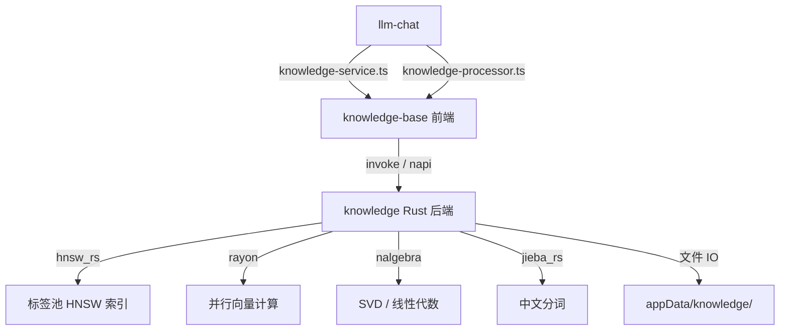

# 附录 B: knowledge 模块迁移影响分析

**状态**: ✅ 完成  
**创建日期**: 2025-05-20  
**作者**: 咕咕

---

## 1. 模块概况

`src-tauri/src/knowledge/` 是项目中**最复杂的 Rust 模块**，实现了一个完整的本地 RAG (Retrieval-Augmented Generation) 引擎。

| 指标                    | 数值                                                     |
| ----------------------- | -------------------------------------------------------- |
| Rust 源文件数           | 26                                                       |
| 总代码量                | ~163 KB                                                  |
| 暴露的 Tauri Command 数 | 26+                                                      |
| 前端 invoke 调用点      | ~14 处（集中在 4 个文件）                                |
| 外部消费者              | llm-chat（knowledge-service.ts, knowledge-processor.ts） |

---

## 2. 核心 Rust 依赖分析

| 依赖       | 用途                              | Node.js 替代方案                                  | 性能差距                                         |
| ---------- | --------------------------------- | ------------------------------------------------- | ------------------------------------------------ |
| `hnsw_rs`  | HNSW 近似最近邻搜索（标签池索引） | `hnswlib-node` 或 WASM 编译                       | 🟡 中等（hnswlib-node 是 C++ binding，性能接近） |
| `jieba_rs` | 中文分词（倒排索引）              | `nodejieba`（C++ binding）或 `@aspect/jieba-wasm` | 🟢 低（nodejieba 性能接近原生）                  |
| `nalgebra` | 线性代数 / SVD 分解（Lens 引擎）  | `ml-matrix` 或 `mathjs` 或 WASM                   | 🔴 高（JS 矩阵库在大矩阵 SVD 上慢 5-10x）        |
| `rayon`    | 并行余弦相似度计算                | `worker_threads` + SharedArrayBuffer              | 🟡 中等（需要手动分片，开销更大）                |
| `sha2`     | 内容哈希                          | Node.js `crypto` 模块                             | 🟢 无差距                                        |
| `ignore`   | 文件遍历                          | `fast-glob`                                       | 🟢 低                                            |

---

## 3. 计算密集型操作清单

按性能敏感度从高到低排列：

### 3.1. 🔴 并行向量相似度计算

**位置**: [`search/vector.rs`](../../../src-tauri/src/knowledge/search/vector.rs:298), [`search/blender.rs`](../../../src-tauri/src/knowledge/search/blender.rs:268)

```rust
// 使用 rayon 并行计算所有条目的余弦相似度
let scores: Vec<(Uuid, f32)> = base.vector_store.ids
    .par_iter()
    .enumerate()
    .filter_map(|(i, id)| {
        let stored_vec = &base.vector_store.data[start..end];
        let cos_sim = cosine_similarity(&augmented_query_vector, stored_vec);
        // BM25 风格长度归一化...
    })
    .collect();
```

- **数据规模**: 展平的 f32 向量矩阵，典型维度 768-1536，条目数百到数千
- **性能要求**: 实时检索（<100ms 响应）
- **Node.js 替代难度**: 🟡 中。可用 `SharedArrayBuffer` + `worker_threads` 实现并行，或编译为 WASM。单线程 JS 在 1000+ 条目 × 1536 维时会明显变慢。

### 3.2. 🔴 SVD 分解（Lens 引擎）

**位置**: [`search/lens.rs`](../../../src-tauri/src/knowledge/search/lens.rs:393)

```rust
// 构建 80×80 亲和力矩阵 → 拉普拉斯矩阵 → SVD 伪逆
let svd = target_matrix.svd(true, true);
let inversion_matrix = svd.solve(&laplacian.transpose(), 1e-6)?;
let propagated_energy = inversion_matrix * initial_energy;
```

- **矩阵规模**: 80×80（邻居数固定）
- **性能要求**: 每次 Lens 检索都需要执行
- **Node.js 替代难度**: 🟡 中。80×80 矩阵的 SVD 在 JS 中也能在 <10ms 完成（`ml-matrix` 库）。如果邻居数增大则差距会拉开。

### 3.3. 🟡 HNSW 索引构建与搜索

**位置**: [`tag_pool.rs`](../../../src-tauri/src/knowledge/tag_pool.rs:166)

```rust
let hnsw = Hnsw::new(m, max_elements, 16, ef_construction, DistCosine);
hnsw.parallel_insert(&refs);
```

- **数据规模**: 标签数通常 100-2000 个
- **性能要求**: 构建可离线，搜索需实时
- **Node.js 替代难度**: 🟢 低。`hnswlib-node` 是 C++ native addon，性能与 Rust 实现接近。标签数量有限，即使纯 JS 实现也可接受。

### 3.4. 🟡 残差挖掘（Blender 引擎）

**位置**: [`search/blender.rs`](../../../src-tauri/src/knowledge/search/blender.rs:36)

- 递归 Gram-Schmidt 投影 + 多层标签激活
- 计算量取决于 `max_residual_layers`（默认 4）× `k_per_layer`（默认 5）
- **Node.js 替代难度**: 🟢 低。纯数学运算，向量维度固定，JS 性能足够。

### 3.5. 🟢 Jieba 分词 + 倒排索引

**位置**: [`index/inverted_index.rs`](../../../src-tauri/src/knowledge/index/inverted_index.rs:37)

- 标准的分词 + 词频统计
- **Node.js 替代难度**: 🟢 低。`nodejieba` 是成熟的 C++ binding，API 完全对等。

---

## 4. 架构特征与迁移影响

### 4.1. 内存模型

knowledge 模块采用**全量内存缓存**设计：

- `InMemoryDatabase` 持有所有知识库的条目和向量矩阵
- 向量数据以展平的 `Vec<f32>` 存储（连续内存，对 CPU cache 友好）
- 标签池独立管理，按模型隔离

**迁移影响**: Node.js 的 GC 对大型 Float32Array 的管理不如 Rust 的手动内存控制精确。但由于数据量通常在 MB 级别（非 GB），实际影响有限。

### 4.2. 并发模型

- 使用 `RwLock` 实现读写分离（多读单写）
- `rayon` 提供数据并行
- 异步预热（`tauri::async_runtime::spawn`）

**迁移影响**: Node.js 单线程模型需要用 `worker_threads` 替代 rayon 并行。对于向量计算这种 CPU 密集型任务，需要将向量矩阵放入 SharedArrayBuffer 并分发给 worker。

### 4.3. 持久化策略

- 元数据: JSON 文件（`meta.json`）
- 条目: 单文件 JSON（`{entryId}.json`）
- 向量: 单文件 JSON（`{entryId}.vec`）
- 标签池: 二进制文件（`vectors.bin`）+ JSON 注册表

**迁移影响**: 🟢 完全可用 Node.js `fs` 模块替代，无特殊格式。

### 4.4. 事件系统

- 通过 `Tauri Emitter` 推送监控事件（RAG Trace, Index Trace）
- 前端通过 `listen()` 订阅

**迁移影响**: Electron 中可用 `ipcMain.emit` / `webContents.send` 替代，模式完全对等。

---

## 5. 前端耦合度

前端 invoke 调用**高度集中**，分布在 4 个文件中：

| 文件                           | 调用数 | 职责                     |
| ------------------------------ | ------ | ------------------------ |
| `logic/orchestrator.ts`        | 5      | 索引编排、向量同步、搜索 |
| `stores/knowledgeBaseStore.ts` | 3      | 初始化、预热、向量加载   |
| `utils/kbStorage.ts`           | 4      | CRUD 操作                |
| `utils/vectorCache.ts`         | 1      | Embedding 缓存           |

**外部消费者**（llm-chat）:

- `services/knowledge-service.ts` → 通过 `SearchOrchestrator` 间接调用
- `core/context-processors/knowledge-processor.ts` → 直接调用 `kb_get_entries`

**迁移影响**: 耦合点清晰且集中，适合通过 service 层统一抽象。

---

## 6. 迁移方案评估

### 方案 A: 完全用 Node.js 重写 ⚠️ 不推荐

| 优势        | 劣势                                  |
| ----------- | ------------------------------------- |
| 单一技术栈  | 并行向量计算性能下降 30-50%           |
| 无 IPC 开销 | SVD/线性代数库生态不如 Rust           |
|             | 重写工作量巨大（~163KB 复杂算法代码） |
|             | 内存管理不如 Rust 精确                |

### 方案 B: 保留为 Native Addon (.node) ✅ 推荐

将 knowledge 模块编译为 Node.js Native Addon（通过 `napi-rs`）：

```
┌─────────────────────────────────────────┐
│  Electron                               │
│  ├── Node.js 主进程                     │
│  │   ├── knowledge.node (Native Addon)  │
│  │   │   ├── HNSW 索引                  │
│  │   │   ├── 向量矩阵 + rayon 并行     │
│  │   │   ├── Jieba 分词                 │
│  │   │   └── SVD / 线性代数            │
│  │   └── 其他 Node.js 服务              │
│  └── Chromium (前端不变)                │
└─────────────────────────────────────────┘
```

| 优势                                              | 劣势                  |
| ------------------------------------------------- | --------------------- |
| 性能零损失                                        | 需要学习 napi-rs 绑定 |
| 代码改动最小（仅替换 Tauri Command 为 napi 导出） | 跨平台编译配置        |
| 无 IPC 序列化开销（直接内存访问）                 | 增加构建复杂度        |
| 保留 rayon 并行能力                               |                       |

### 方案 C: 保留为 Sidecar 进程 🟡 可接受

将 knowledge 模块编译为独立二进制，通过 HTTP/Unix Socket 通信：

| 优势                       | 劣势                                    |
| -------------------------- | --------------------------------------- |
| 后端代码完全不改           | IPC 序列化开销（向量数据传输）          |
| 进程隔离，崩溃不影响主进程 | 进程管理复杂度                          |
|                            | 大向量传输延迟（1536维 × 1000条 ≈ 6MB） |

### 方案 D: WASM 编译 🟡 有条件可行

将核心计算部分编译为 WASM：

| 优势               | 劣势                            |
| ------------------ | ------------------------------- |
| 跨平台零配置       | WASM 无法使用 rayon（无多线程） |
| 无 native 编译依赖 | hnsw_rs 可能不支持 WASM target  |
|                    | 性能比 native 低 20-40%         |

---

## 7. 推荐策略

### 结论: 🔴 强烈建议保留 Rust（方案 B: Native Addon）

**理由**:

1. **算法复杂度极高**: 4 个检索引擎（Keyword/Vector/Lens/Blender）包含大量精心调优的数学算法（SVD、残差挖掘、Tag Anchoring、BM25 归一化等），用 JS 重写不仅工时巨大，还容易引入精度和性能回归。

2. **并行计算是核心竞争力**: rayon 并行余弦相似度计算是实时检索的性能保障。Node.js 的 worker_threads 方案开销更大且代码复杂度高。

3. **内存布局优化**: 展平的 `Vec<f32>` 向量矩阵对 CPU cache 极其友好，这种优化在 JS 中难以复刻（即使用 Float32Array，GC 压力和内存碎片仍是问题）。

4. **napi-rs 迁移成本低**: 只需将 `#[tauri::command]` 替换为 `#[napi]` 宏，核心逻辑完全不变。且 napi-rs 支持直接传递 `Buffer`/`Float32Array`，避免序列化开销。

5. **模块边界清晰**: 前端通过 14 个 invoke 调用点与后端交互，接口稳定，非常适合作为独立 addon 暴露。

---

## 8. 迁移步骤（方案 B 详细）

### Phase 1: napi-rs 绑定层

1. 创建 `packages/knowledge-native/` 目录
2. 将 `src-tauri/src/knowledge/` 代码迁移（去除 Tauri 依赖）
3. 用 `#[napi]` 宏替换 `#[tauri::command]`
4. 处理 `AppHandle` → 传入 `app_data_dir` 路径参数
5. 处理 `State<KnowledgeState>` → 模块级全局单例

### Phase 2: 前端适配

1. 将 `invoke("kb_xxx", {...})` 替换为 `knowledgeAddon.kbXxx(...)`
2. 事件推送改为 Node.js EventEmitter → IPC → 前端
3. 保持 orchestrator/store 层接口不变

### Phase 3: 验证

1. 对比检索结果一致性（相同查询，相同结果）
2. 性能基准测试（应无退化）
3. 内存占用对比

---

## 9. 对主报告的影响

此模块应被添加到主报告 [§3.2 Rust 后端功能清单](./webview2-migration-investigation.md) 的 **🔴 强烈建议保留 Rust** 分类中：

| 模块           | 实现方式                                              | 为什么保留                                                                                                                            | Node.js 替代难度 |
| -------------- | ----------------------------------------------------- | ------------------------------------------------------------------------------------------------------------------------------------- | ---------------- |
| **knowledge/** | HNSW + rayon 并行向量计算 + nalgebra SVD + jieba 分词 | 4 个检索引擎包含复杂数学算法（SVD 伪逆、残差挖掘、Tag Anchoring），并行计算是实时检索的性能保障。163KB 精心调优的算法代码重写风险极高 | 🔴 极高          |

---

## 10. 与其他模块的关系



knowledge 模块是 **llm-chat RAG 功能的唯一后端**，迁移时必须确保零功能回归。
