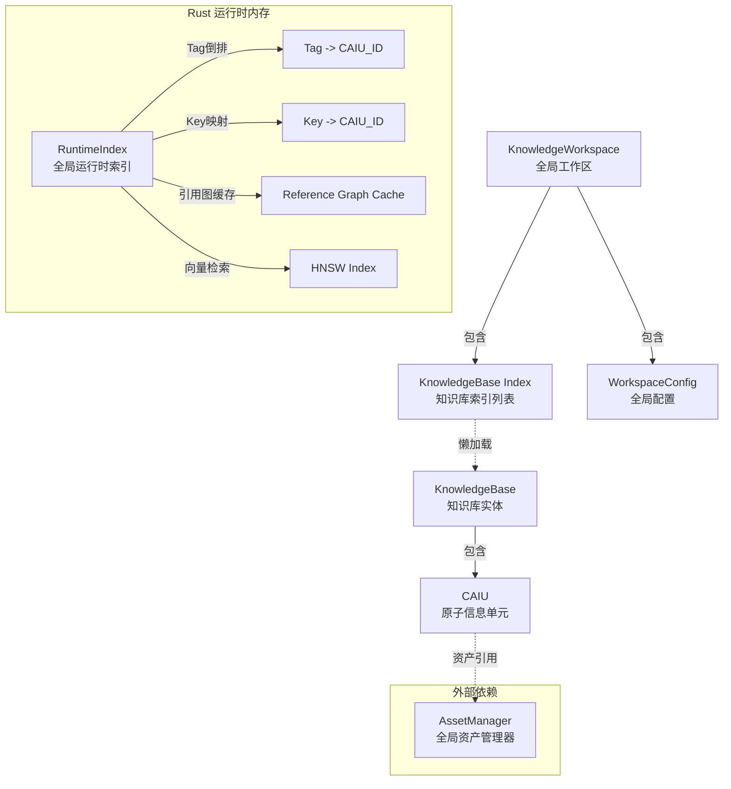
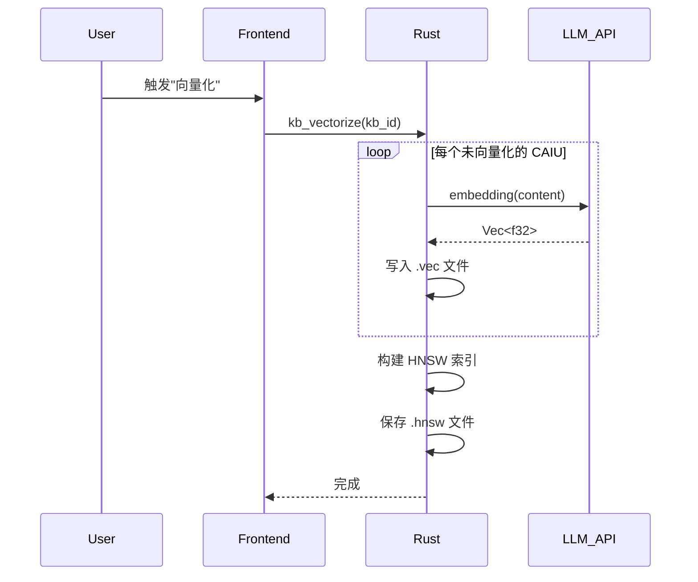

# 📐 AIO 知识库设计方案 (Full Specification)

## 一、层级总览 (Architecture Overview)

整个知识引擎由三个核心层级组成，自上而下管理知识的组织、存储与检索。



---

## 二、Rust 数据结构定义 (Rust Implementation)

为了兼顾开发体验与运行效率，系统使用 `serde` 进行序列化处理，并采用 `Uuid` 作为唯一标识。

### 2.1 全局工作区 (Workspace)

```rust
use serde::{Serialize, Deserialize};
use uuid::Uuid;
use std::collections::HashMap;

#[derive(Debug, Serialize, Deserialize)]
#[serde(rename_all = "camelCase")]
pub struct KnowledgeWorkspace {
    pub version: String,
    pub config: WorkspaceConfig,
    pub bases: Vec<KnowledgeBaseIndex>,
}

#[derive(Debug, Serialize, Deserialize)]
#[serde(rename_all = "camelCase")]
pub struct WorkspaceConfig {
    pub default_embedding_model: String,
    pub vector_index: VectorIndexConfig,
}

#[derive(Debug, Serialize, Deserialize)]
#[serde(rename_all = "camelCase")]
pub struct VectorIndexConfig {
    /// 索引算法: "hnsw", "flat", "ivf" 等
    pub algorithm: String,
    /// 向量维度，需与 embedding model 输出匹配
    pub dimension: usize,
    /// 距离度量: "cosine", "euclidean", "dot"
    pub metric: String,
    /// HNSW 特定参数: 构建时的邻居数量
    pub ef_construction: Option<usize>,
    /// HNSW 特定参数: 每个节点的最大连接数
    pub m: Option<usize>,
}

#[derive(Debug, Serialize, Deserialize)]
#[serde(rename_all = "camelCase")]
pub struct KnowledgeBaseIndex {
    pub id: Uuid,
    pub name: String,
    pub description: Option<String>,
    pub entry_count: usize,
    pub last_updated: i64,
    pub path: String, // 相对路径

    // 运行时状态 (不序列化到 JSON)
    #[serde(skip)]
    pub is_loaded: bool,
    #[serde(skip)]
    pub is_vectorized: bool,
}
```

### 2.2 知识库 (KnowledgeBase)

**注意**：对于大型文本内容，在反序列化时建议使用 `std::borrow::Cow` 以减少内存复制。

```rust
#[derive(Debug, Serialize, Deserialize)]
#[serde(rename_all = "camelCase")]
pub struct KnowledgeBase {
    pub id: Uuid,
    pub name: String,
    pub description: Option<String>,

    pub schema_version: String,
    pub content_version: u64,

    pub embedding: EmbeddingConfig,
    pub meta: KnowledgeBaseMeta,

    pub entries: Vec<Caiu>,
}

#[derive(Debug, Serialize, Deserialize)]
#[serde(rename_all = "camelCase")]
pub struct EmbeddingConfig {
    /// 使用的 embedding 模型标识
    pub model: String,
    /// 向量维度
    pub dimension: usize,
    /// 批处理大小
    pub batch_size: usize,
    /// 是否已完成向量化
    pub is_indexed: bool,
    /// 最后向量化时间戳
    pub last_indexed_at: Option<i64>,
}

#[derive(Debug, Serialize, Deserialize)]
#[serde(rename_all = "camelCase")]
pub struct KnowledgeBaseMeta {
    pub created_at: i64,
    pub updated_at: i64,
    pub author: Option<String>,
    /// 知识库级别的标签，用于分类
    pub tags: Vec<String>,
    /// 知识库图标 (Asset ID)
    pub icon: Option<String>,
}

#[derive(Debug, Serialize, Deserialize)]
#[serde(rename_all = "camelCase")]
pub struct Caiu {
    pub id: Uuid,
    pub key: String,         // 用于 [[Key]] 引用
    pub content: String,     // Markdown 内容

    pub tags: Vec<String>,   // 透镜锚点

    #[serde(default)]
    pub assets: Vec<AssetRef>,

    #[serde(default = "default_priority")]
    pub priority: i32,

    #[serde(default = "default_enabled")]
    pub enabled: bool,

    // 运行时计算的引用关系 (不持久化，通过内存缓存维护)
    #[serde(skip)]
    pub refs: Vec<Uuid>,     // 本条目引用的其他条目
    #[serde(skip)]
    pub ref_by: Vec<Uuid>,   // 引用本条目的其他条目
}

/// 资产引用结构，指向全局 AssetManager 中的资产
#[derive(Debug, Clone, Serialize, Deserialize)]
#[serde(rename_all = "camelCase")]
pub struct AssetRef {
    /// AssetManager 中的资产 ID
    pub id: String,
    /// 显示名称
    pub name: String,
    /// MIME 类型
    pub mime_type: String,
    /// 协议前缀，应为 "appdata://"
    pub protocol: String,
}

fn default_priority() -> i32 { 100 }
fn default_enabled() -> bool { true }
```

### 2.3 交互数据结构

```rust
/// 创建/更新 CAIU 的输入结构
#[derive(Debug, Serialize, Deserialize)]
#[serde(rename_all = "camelCase")]
pub struct CaiuInput {
    pub key: String,
    pub content: String,
    pub tags: Vec<String>,
    /// Asset IDs (来自 AssetManager)
    pub asset_ids: Vec<String>,
    pub priority: Option<i32>,
}

/// 搜索过滤器
#[derive(Debug, Serialize, Deserialize)]
#[serde(rename_all = "camelCase")]
pub struct SearchFilters {
    /// 限定搜索的知识库 ID 列表，None 表示搜索所有
    pub kb_ids: Option<Vec<Uuid>>,
    /// 标签过滤
    pub tags: Option<Vec<String>>,
    /// 最低相关度分数阈值 (0.0 - 1.0)
    pub min_score: Option<f32>,
    /// 返回结果数量上限
    pub limit: usize,
    /// 是否包含禁用的条目
    pub include_disabled: bool,
}

/// 搜索结果
#[derive(Debug, Serialize, Deserialize)]
#[serde(rename_all = "camelCase")]
pub struct SearchResult {
    /// 命中的 CAIU
    pub caiu: Caiu,
    /// 相关度分数 (0.0 - 1.0)
    pub score: f32,
    /// 匹配类型: "semantic", "keyword", "hybrid"
    pub match_type: String,
    /// 高亮片段 (用于 UI 展示)
    pub highlight: Option<String>,
    /// 所属知识库 ID
    pub kb_id: Uuid,
    /// 所属知识库名称
    pub kb_name: String,
}
```

---

## 三、关键技术方案

### 3.1 JSON 解析性能优化策略

为确保 Rust 端高效解析大型 JSON 结构，采用以下技术策略：

1.  **流式读取 (Streaming IO)**:
    使用 `BufReader` 配合 `serde_json::from_reader` 替代 `fs::read_to_string`，以显著降低峰值内存占用。

    ```rust
    let file = File::open("path/to/large_kb.json")?;
    let reader = BufReader::new(file);
    let kb: KnowledgeBase = serde_json::from_reader(reader)?;
    ```

2.  **并行加载 (Parallel Loading)**:
    利用 `rayon` 库并行加载和解析 Workspace 中的多个独立 KnowledgeBase 文件，缩短冷启动时间。

3.  **字符串去重 (String Interning)**:
    对于 `tags` 等高频重复字符串，在内存中使用 `string_cache` 或 `HashSet` 进行去重存储，减少内存碎片。

### 3.2 引用解析与缓存机制

系统支持基于 Wiki 风格的引用语法，通过命名空间区分库内与跨库引用。由于引用解析计算成本较高，系统采用**冷启动构建 + 内存缓存**策略。

#### 1. 引用格式

- **库内引用 (`[[Key]]`)**: 仅在当前知识库中查找 `Key`。
- **跨库引用 (`[[LibraryName::Key]]`)**: 在指定的外部库 `LibraryName` 中查找 `Key`。

#### 2. 解析规则

- 解析器优先识别命名空间分隔符 `::`。
- 若存在命名空间，则在对应名称的知识库中检索 Key。
- 若无命名空间，则严格限制在当前知识库范围内检索。
- 任意环节查找失败（库不存在或 Key 不存在）均视为断链。

#### 3. 缓存策略

1.  **冷启动异步构建**:
    - 知识库加载完成后，启动后台异步任务。
    - 遍历所有 CAIU 的 `content` 字段，正则提取 `[[...]]` 引用。
    - 构建双向引用图 (`refs` / `ref_by`) 并存入 `RuntimeIndex`。

2.  **内存缓存维护**:
    - 运行时直接从内存读取引用关系。
    - 当 CAIU 内容更新时，增量更新相关的引用边。
    - 不将引用关系序列化到磁盘，避免数据冗余和一致性问题。

### 3.3 向量存储与检索 (Vectorization)

为了在本地高效运行语义检索，系统采用轻量级的嵌入式向量索引方案。

#### 1. 存储分离

- **元数据与文本**: 存储在 `kb_xxx.json` 中。
- **向量数据**: 存储在同名的 `kb_xxx.vec` 二进制文件中，格式为：
  ```
  [HEADER: 4 bytes magic + 4 bytes version + 4 bytes dimension + 4 bytes count]
  [VECTORS: count * dimension * 4 bytes (f32)]
  [ID_MAP: count * 16 bytes (UUID)]
  ```
- **HNSW 索引**: 存储在 `kb_xxx.hnsw` 文件中（可选用 `usearch` 或 `hnswlib` 的序列化格式）。

#### 2. 向量化流程



#### 3. 增量更新策略

- **新增 CAIU**: 计算 embedding，追加到 `.vec` 文件，增量插入 HNSW 索引。
- **修改 CAIU**: 重新计算 embedding，更新 `.vec` 文件对应位置，HNSW 索引中删除旧向量并插入新向量。
- **删除 CAIU**: 标记为已删除（懒惰删除），定期执行压缩重建。

#### 4. 检索融合策略

搜索时同时执行语义检索和关键词检索，采用 RF (Reciprocal Rank Fusion) 融合算法：

```
score = Σ 1 / (k + rank_i)
```

其中 `k` 通常取 60，`rank_i` 为该结果在第 i 个检索方法中的排名。

---

## 四、文件存储结构示例

```text
e:/rc20/allinweb/all-in-one-tools/knowledge/
├── workspace.json              # 入口文件
└── bases/                      # 知识库数据目录
    ├── kb_personal.json        # 知识库元数据与文本
    ├── kb_personal.vec         # 向量数据
    ├── kb_personal.hnsw        # HNSW 索引
    ├── kb_world_setting.json
    ├── kb_world_setting.vec
    ├── kb_world_setting.hnsw
    ├── kb_coding.json
    ├── kb_coding.vec
    └── kb_coding.hnsw
```

> **注意**: 多模态资产（图片、音频等）统一存储在全局 `AssetManager` 管理的目录中，通过 `appdata://` 协议引用，不在知识库目录下独立存储。

---

## 五、Chat 集成方案 (Pipeline Integration)

基于 LLM Chat 的 **Unified Pipeline Architecture**，知识引擎将作为标准的 **ContextProcessor** 接入。

### 5.1 处理器定义

新增 `knowledge-retriever` 处理器，插入到上下文管道的中段。

| 属性         | 值                    | 说明                                                    |
| :----------- | :-------------------- | :------------------------------------------------------ |
| **ID**       | `knowledge-retriever` | 唯一标识符                                              |
| **Priority** | **350** (默认值)      | 位于 `transcription` 之后，`injection` 之前，可配置调整 |
| **Role**     | RAG 检索与注入        | 分析当前上下文，检索知识，注入 System Message           |

**执行逻辑**:

1.  **Input**: 接收 `PipelineContext`，获取最近的用户消息（包括已转写的音频/图片文本）。
2.  **Search**: 调用 Rust 后端 `kb_search` 接口，执行语义检索 + 关键词匹配。
3.  **Inject**: 将命中的 CAIU (原子信息单元) 格式化为 System Message，插入到 `context.messages` 头部。
    - _优势_: 由于在 `token-limiter` 之前执行，Token 限制器会自动计算知识的开销，并优先截断较早的会话历史，确保知识上下文不被丢弃。

### 5.2 多模态资产注入 (Structured Injection)

LLM Chat 的 `asset-resolver` 处理器不解析消息文本中的协议，它处理的是 `ChatMessageNode.attachments` 字段中的结构化附件列表。因此，知识库中的多模态内容必须通过结构化方式注入。

**处理流程**:

1.  **检索结果结构化**: `SearchResult.caiu.assets` 字段包含完整的 `AssetRef` 列表。

2.  **构建注入消息**: `knowledge-retriever` 处理器在构建注入消息时，将 `AssetRef` 转换为标准的 `ChatMessageNode` 附件格式：

    ```typescript
    const injectedMessage: ChatMessageNode = {
      role: "system",
      content: caiu.content, // 纯文本/Markdown 内容
      attachments: caiu.assets.map((assetRef) => ({
        id: assetRef.id,
        name: assetRef.name,
        mimeType: assetRef.mime_type,
        // ... 其他 Asset 元数据
      })),
    };
    ```

3.  **后续处理**:
    - 如果模型支持视觉，`asset-resolver` 会将 `attachments` 中的图片转换为 Base64 或 URL。
    - 如果模型不支持视觉，`transcription-processor` 会先对图片进行 OCR 转写，将文本追加到 `content` 中。

### 5.3 界面交互

- **Agent 配置**: 在 Agent 编辑器的 "Pipeline Config" 部分，可以启用/禁用 `knowledge-retriever`，并绑定特定的知识库（如 "只搜索 Project A 知识库"）。
- **显式引用**: 利用 **Anchor System**，注册 `knowledge_base` 锚点。该锚点类似于 `chat_history`，作为知识检索结果的插入点位，允许用户在 Prompt Template 中精确控制知识内容的插入位置。

---

## 六、前端工具架构 (Frontend Architecture)

知识库工具作为独立的 Tool 模块，位于 `src/tools/knowledge-base/` 目录下。

### 6.1 目录结构

```text
src/tools/knowledge-base/
├── KnowledgeBase.vue                    # 主入口组件
├── knowledge-base.registry.ts           # 工具注册文件
├── types/                               # 类型定义
│   ├── index.ts
│   ├── caiu.ts                          # CAIU 相关类型
│   ├── knowledge-base.ts                # 知识库类型
│   └── search.ts                        # 搜索相关类型
├── stores/                              # 状态管理
│   ├── knowledgeBaseStore.ts            # 主 Store
│   └── lensStore.ts                     # 透镜系统 Store
├── composables/                         # 组合式函数
│   ├── useKnowledgeBase.ts              # 知识库操作
│   ├── useCaiuEditor.ts                 # CAIU 编辑器
│   ├── useKnowledgeSearch.ts            # 搜索功能
│   ├── useReferenceGraph.ts             # 引用图谱
│   └── useLensSystem.ts                 # 透镜系统
├── components/                          # 组件
│   ├── KnowledgeBaseList.vue            # 知识库列表
│   ├── CaiuList.vue                     # CAIU 列表
│   ├── CaiuEditor.vue                   # CAIU 编辑器
│   ├── CaiuCard.vue                     # CAIU 卡片
│   ├── SearchPanel.vue                  # 搜索面板
│   ├── ReferenceGraphView.vue           # 引用图谱视图
│   ├── LensPanel.vue                    # 透镜面板
│   ├── VectorizationDialog.vue          # 向量化对话框
│   ├── ImportExportDialog.vue           # 导入导出对话框
│   └── KnowledgeBaseSettings.vue        # 知识库设置
└── utils/                               # 工具函数
    ├── markdown.ts                      # Markdown 处理
    ├── reference-parser.ts              # 引用解析
    └── export.ts                        # 导出功能
```

### 6.2 核心 Store 设计

```typescript
// stores/knowledgeBaseStore.ts
import { defineStore } from "pinia";
import { invoke } from "@tauri-apps/api/core";
import type { KnowledgeBase, Caiu, SearchFilters, SearchResult } from "../types";

export const useKnowledgeBaseStore = defineStore("knowledgeBase", {
  state: () => ({
    bases: [] as KnowledgeBaseIndex[],
    activeBaseId: null as string | null,
    entries: [] as Caiu[],
    searchResults: [] as SearchResult[],
    loading: false,
    vectorizing: false,
  }),

  getters: {
    activeBase: (state) => state.bases.find((b) => b.id === state.activeBaseId),
  },

  actions: {
    async loadBases() {
      this.bases = await invoke("kb_list_bases");
    },
    async switchBase(baseId: string) {
      this.activeBaseId = baseId;
      const base = await invoke("kb_get_base", { kbId: baseId });
      this.entries = base.entries;
    },
    async search(query: string, filters: SearchFilters) {
      this.searchResults = await invoke("kb_search", { query, filters });
    },
    async addEntry(content: CaiuInput) {
      const entry = await invoke("kb_add_entry", { kbId: this.activeBaseId, content });
      this.entries.push(entry);
    },
    // ... 其他 CRUD 操作
  },
});
```

---

## 七、透镜系统 (Lens System)

透镜系统是知识库的核心特性，通过标签动态过滤和聚合知识。

### 7.1 核心概念

- **透镜 (Lens)**: 一组标签的组合，定义了一个知识视角。
- **锚点 (Anchor)**: CAIU 上的标签，作为透镜的过滤依据。

### 7.2 透镜 Store

```typescript
export interface Lens {
  id: string;
  name: string;
  tags: string[]; // 必须包含的标签 (AND)
  excludeTags?: string[]; // 排除的标签 (NOT)
  color?: string;
}

export const useLensStore = defineStore("lens", {
  state: () => ({
    lenses: [] as Lens[],
    activeLensId: null as string | null,
  }),
  // ... CRUD 操作
});
```

---

## 八、界面交互设计

### 8.1 主界面布局

采用三栏式设计：

1. **左栏**: 知识库列表、全局搜索、图谱视图入口。
2. **中栏**: CAIU 列表（支持卡片/列表切换）与 Markdown 编辑器。
3. **右栏**: 透镜面板、条目引用关系图、资产库。

### 8.2 编辑器特性

- **双向链接**: 输入 `[[` 触发补全，显示已有 CAIU 的 Key。
- **资产集成**: 拖拽资产到编辑器，自动生成 ``。
- **引用预览**: 悬停在引用链接上，弹出 CAIU 预览浮窗。

---

## 九、后端架构 (Backend Architecture)

在 `src-tauri/src/` 下新增 `knowledge` 模块，保持 `lib.rs` 整洁。

```text
src-tauri/src/knowledge/
├── mod.rs              # 模块入口与 API 注册
├── core.rs             # 核心结构体 (Workspace, KnowledgeBase, Caiu)
├── index/              # 索引相关
│   ├── vector.rs       # 向量存储与检索 (HNSW)
│   ├── reference.rs    # 引用关系图构建与缓存
│   └── text.rs         # 全文检索 (Tantivy 或简单倒排)
├── io.rs               # 文件读写与流式解析
└── service.rs          # 业务逻辑服务层 (供 Command 调用)
```

### 9.1 核心 Command 定义

```rust
// 注册到 lib.rs 的命令列表
#[tauri::command]
fn kb_create_workspace(config: WorkspaceConfig) -> Result<Uuid, String>;

#[tauri::command]
fn kb_list_bases() -> Result<Vec<KnowledgeBaseIndex>, String>;

#[tauri::command]
fn kb_search(query: String, filters: SearchFilters) -> Result<Vec<SearchResult>, String>;

#[tauri::command]
fn kb_add_entry(kb_id: Uuid, content: CaiuInput) -> Result<Caiu, String>;

#[tauri::command]
fn kb_update_entry(kb_id: Uuid, caiu_id: Uuid, content: CaiuInput) -> Result<Caiu, String>;

#[tauri::command]
fn kb_delete_entry(kb_id: Uuid, caiu_id: Uuid) -> Result<(), String>;

#[tauri::command]
fn kb_vectorize(kb_id: Uuid) -> Result<(), String>;

#[tauri::command]
fn kb_get_references(kb_id: Uuid, caiu_id: Uuid) -> Result<ReferenceInfo, String>;
```

---

## 十、实施路线图 (Implementation Roadmap)

### Phase 1: 核心基础设施 (2-3 周)

- [ ] Rust 数据结构定义与序列化测试
- [ ] 文件 I/O 与流式解析实现
- [ ] 基础 Command API 实现 (CRUD)
- [ ] 前端 Store 与基础 UI 框架

### Phase 2: 检索系统 (2-3 周)

- [ ] 引用解析器实现
- [ ] 全文检索集成 (Tantivy 或简化方案)
- [ ] 向量化流程与 HNSW 索引
- [ ] 混合检索与 RRF 融合

### Phase 3: 前端完善 (2 周)

- [ ] Markdown 编辑器与双向链接
- [ ] 引用图谱可视化
- [ ] 透镜系统 UI
- [ ] 导入/导出功能

### Phase 4: Chat 集成 (1-2 周)

- [ ] `knowledge-retriever` 处理器实现
- [ ] Agent 配置界面扩展
- [ ] Anchor System 集成
- [ ] 端到端测试

---

## 十一、开放性问题 (Open Questions)

1. **向量模型选择**: 是否内置轻量级 embedding 模型（如 `all-MiniLM-L6-v2`），还是完全依赖外部 API？
2. **离线能力**: 是否需要支持完全离线的关键词检索模式？
3. **多语言支持**: 是否需要针对中文优化分词和检索策略？
4. **版本控制**: 是否需要为知识库提供 Git-like 的版本管理？
5. **协作功能**: 未来是否考虑多用户协作编辑？

---

## 十二、性能指标 (Performance Targets)

| 指标             | 目标值                     | 备注                      |
| :--------------- | :------------------------- | :------------------------ |
| 冷启动加载时间   | < 2s (10k 条目)            | 包含索引构建              |
| 语义检索响应时间 | < 500ms                    | Top-10 结果               |
| 向量化速度       | > 100 条目/秒              | 使用外部 API 时取决于网络 |
| 内存占用         | < 200MB (10k 条目)         | 不含向量索引              |
| 向量索引内存占用 | < 500MB (10k 条目, 384 维) | HNSW 索引                 |

---

## 附录 A: 术语表 (Glossary)

- **CAIU (Contextual Atomic Information Unit)**: 上下文原子信息单元，知识库的最小存储单位。
- **Lens (透镜)**: 基于标签的动态知识过滤器。
- **Anchor (锚点)**: CAIU 上的标签，用于透镜过滤。
- **RAG (Retrieval-Augmented Generation)**: 检索增强生成，结合知识检索与 LLM 生成的技术。
- **HNSW (Hierarchical Navigable Small World)**: 层次化可导航小世界图，一种高效的近似最近邻搜索算法。
- **RRF (Reciprocal Rank Fusion)**: 倒数排名融合，一种多路检索结果融合算法。

---

**文档版本**: v1.0
**最后更新**: 2026-01-29
**状态**: Draft (草案)
