# LLM Chat 工具 UI 结构图

本文档详细展示 LLM Chat 工具的完整UI结构，包括内部组件和外部依赖关系。

> **注意**: LLM Chat 是整个应用中最复杂的工具模块，包含 48+ 个组件文件，大量使用了独立的 `rich-text-renderer` 模块和通用组件库。

---

## 0. 完整组件关系总览

```mermaid
flowchart TB
    subgraph LlmChatVue["🏠 LlmChat.vue (主入口)"]
        direction TB
        
        subgraph LeftArea["📋 左侧区域"]
            LeftSidebar["LeftSidebar"]
            AgentsSidebar["AgentsSidebar<br/>智能体列表"]
            ParametersSidebar["ParametersSidebar<br/>参数配置"]
        end
        
        subgraph CenterArea["💬 中央对话区 ChatArea.vue"]
            ComponentHeader["ComponentHeader<br/>可拖拽标题栏"]
            
            subgraph MessageView["消息视图"]
                MessageList["MessageList"]
                FlowTreeGraph["FlowTreeGraph<br/>对话树图"]
            end
            
            subgraph MessageComponents["消息组件"]
                ChatMessage["ChatMessage"]
                MessageHeader["MessageHeader"]
                MessageContent["MessageContent"]
                MessageMenubar["MessageMenubar"]
                BranchSelector["BranchSelector"]
            end
            
            MessageInput["MessageInput<br/>消息输入"]
            MessageNavigator["MessageNavigator<br/>消息导航"]
        end
        
        subgraph RightArea["📁 右侧区域"]
            SessionsSidebar["SessionsSidebar<br/>会话列表"]
        end
    end
    
    subgraph Dialogs["🔲 对话框层"]
        subgraph AgentDialogs["智能体相关"]
            CreateAgentDialog["CreateAgentDialog"]
            EditAgentDialog["EditAgentDialog"]
            ImportAgentDialog["ImportAgentDialog"]
            STPresetImportDialog["STPresetImportDialog"]
        end
        
        subgraph SettingsDialogs["设置相关"]
            ChatSettingsDialog["ChatSettingsDialog"]
            EditUserProfileDialog["EditUserProfileDialog"]
        end
        
        subgraph ExportDialogs["导入导出"]
            ExportSessionDialog["ExportSessionDialog"]
            ExportBranchDialog["ExportBranchDialog"]
            ExportAgentDialog["ExportAgentDialog"]
        end
        
        ContextAnalyzerDialog["ContextAnalyzerDialog<br/>上下文分析"]
    end
    
    subgraph TreeGraphComponents["🌲 对话树图组件"]
        GraphNode["GraphNode"]
        GraphNodeContent["GraphNodeContent"]
        GraphNodeMenubar["GraphNodeMenubar"]
        GraphNodeDetailPopup["GraphNodeDetailPopup"]
        HistoryPanel["HistoryPanel"]
    end
    
    subgraph AgentEditorComponents["🤖 智能体编辑器"]
        AgentPresetEditor["AgentPresetEditor"]
        PresetMessageEditor["PresetMessageEditor"]
        ModelParametersEditor["ModelParametersEditor"]
        MacroSelector["MacroSelector"]
    end
    
    subgraph ContextAnalyzerViews["🔍 上下文分析视图"]
        StructuredView["StructuredView"]
        RawRequestView["RawRequestView"]
        MacroDebugView["MacroDebugView"]
        AnalysisChartView["AnalysisChartView"]
    end
    
    subgraph ExternalDeps["📦 外部依赖"]
        subgraph RichTextRenderer["🎨 rich-text-renderer"]
            RichTextRendererVue["RichTextRenderer.vue"]
            LlmThinkNode["LlmThinkNode"]
            CodeBlockNode["CodeBlockNode"]
            MermaidNode["MermaidNode"]
            KatexNode["KatexNode"]
            LlmThinkRulesEditor["LlmThinkRulesEditor"]
            MarkdownStyleEditor["MarkdownStyleEditor"]
        end
        
        subgraph CommonComponents["🧩 通用组件库"]
            Avatar["Avatar"]
            AvatarSelector["AvatarSelector"]
            BaseDialog["BaseDialog"]
            DynamicIcon["DynamicIcon"]
            DocumentViewer["DocumentViewer"]
            LlmModelSelector["LlmModelSelector"]
            RichCodeEditor["RichCodeEditor"]
            InfoCard["InfoCard"]
            FileIcon["FileIcon"]
        end
    end
    
    %% 主要连接关系
    LeftSidebar --> AgentsSidebar
    LeftSidebar --> ParametersSidebar
    
    MessageList --> ChatMessage
    ChatMessage --> MessageHeader
    ChatMessage --> MessageContent
    ChatMessage --> MessageMenubar
    ChatMessage --> BranchSelector
    
    FlowTreeGraph --> GraphNode
    GraphNode --> GraphNodeContent
    GraphNode --> GraphNodeMenubar
    
    EditAgentDialog --> AgentPresetEditor
    EditAgentDialog --> ModelParametersEditor
    AgentPresetEditor --> PresetMessageEditor
    AgentPresetEditor --> MacroSelector
    
    ContextAnalyzerDialog --> StructuredView
    ContextAnalyzerDialog --> RawRequestView
    ContextAnalyzerDialog --> MacroDebugView
    ContextAnalyzerDialog --> AnalysisChartView
    
    %% 外部依赖连接
    MessageContent -.->|渲染| RichTextRendererVue
    MessageContent -.->|思考块| LlmThinkNode
    EditAgentDialog -.->|样式编辑| MarkdownStyleEditor
    EditAgentDialog -.->|思考规则| LlmThinkRulesEditor
    
    MessageHeader -.-> Avatar
    ChatMessage -.-> DynamicIcon
    Dialogs -.-> BaseDialog
    ParametersSidebar -.-> LlmModelSelector
    MessageContent -.-> DocumentViewer
```

### 图例说明

| 符号 | 含义 |
|-----|------|
| `──>` | 组件包含/父子关系 |
| `-.->` | 外部依赖引用 |
| 📋 📁 💬 | 布局区域标识 |
| 🔲 | 对话框/弹出层 |
| 📦 | 外部模块依赖 |

### 核心数据流

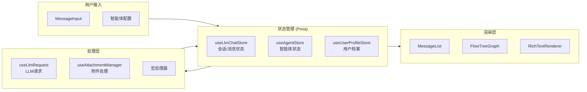

---

## 1. 整体布局结构

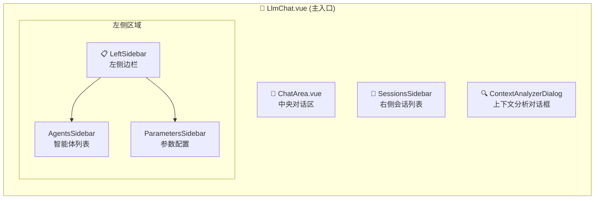

---

## 2. ChatArea 核心组件树

ChatArea 是对话的核心区域，包含消息展示、输入和多个对话框：

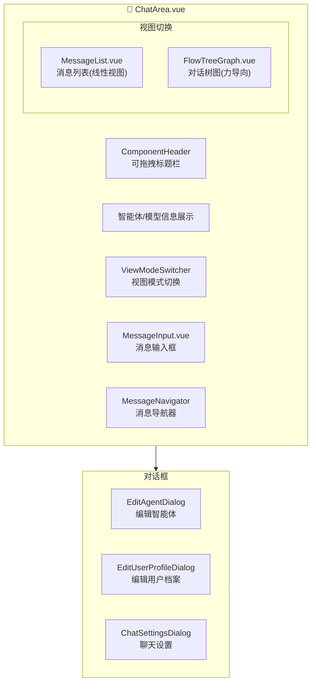

---

## 3. 消息组件层次 (message/)

消息组件负责渲染每条对话消息：

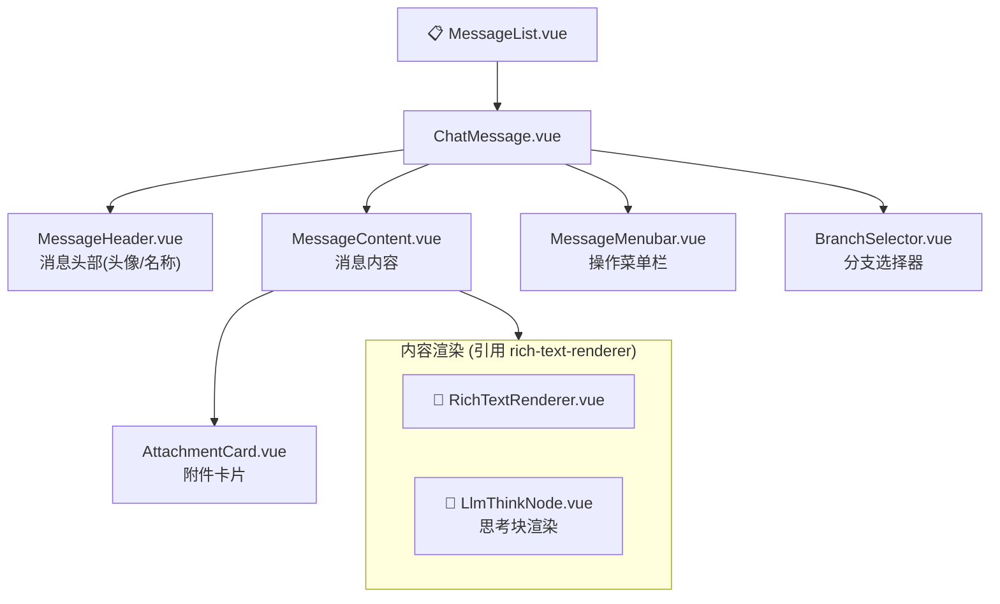

---

## 4. 智能体管理组件 (agent/)

智能体编辑器包含复杂的配置界面：

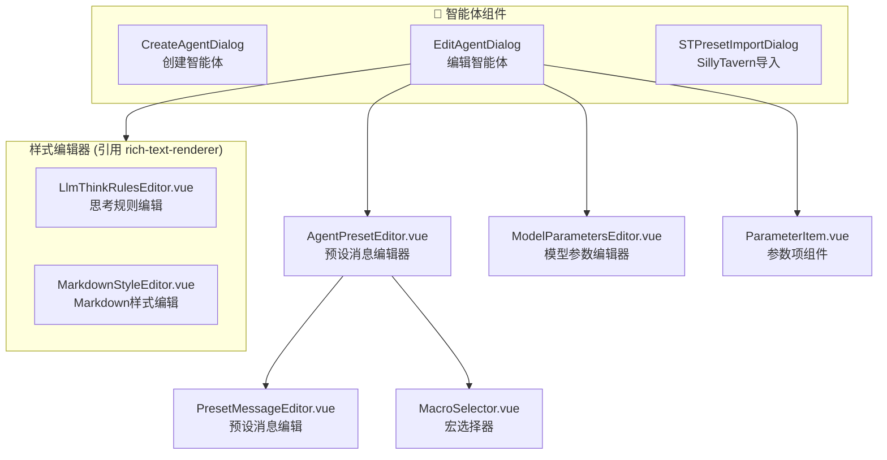

---

## 5. 对话树图组件 (conversation-tree-graph/)

力导向布局的对话树可视化：

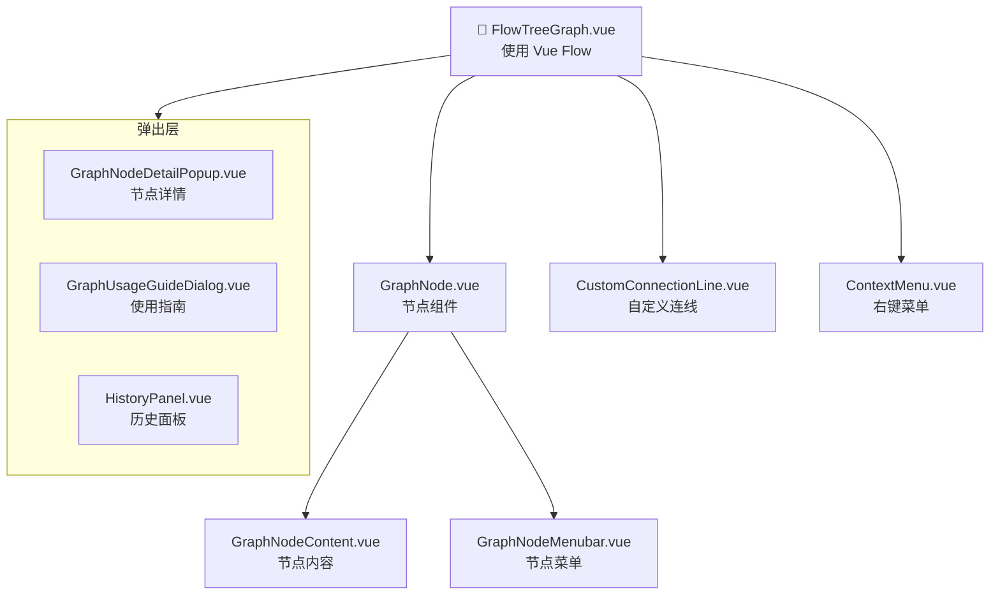

---

## 6. 上下文分析器 (context-analyzer/)

分析和调试对话上下文：

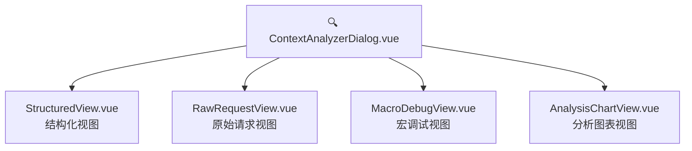

---

## 7. 导入导出组件 (export/)

会话和智能体的导入导出：

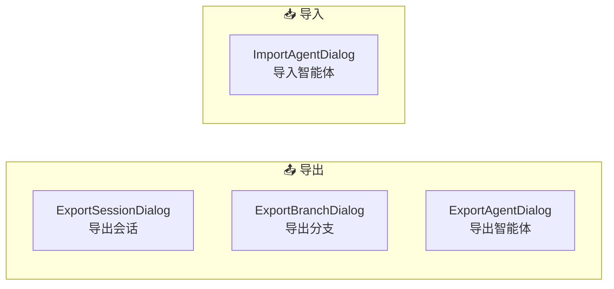

---

## 8. 外部依赖：富文本渲染器 (rich-text-renderer/)

LLM Chat 大量依赖独立的富文本渲染模块：

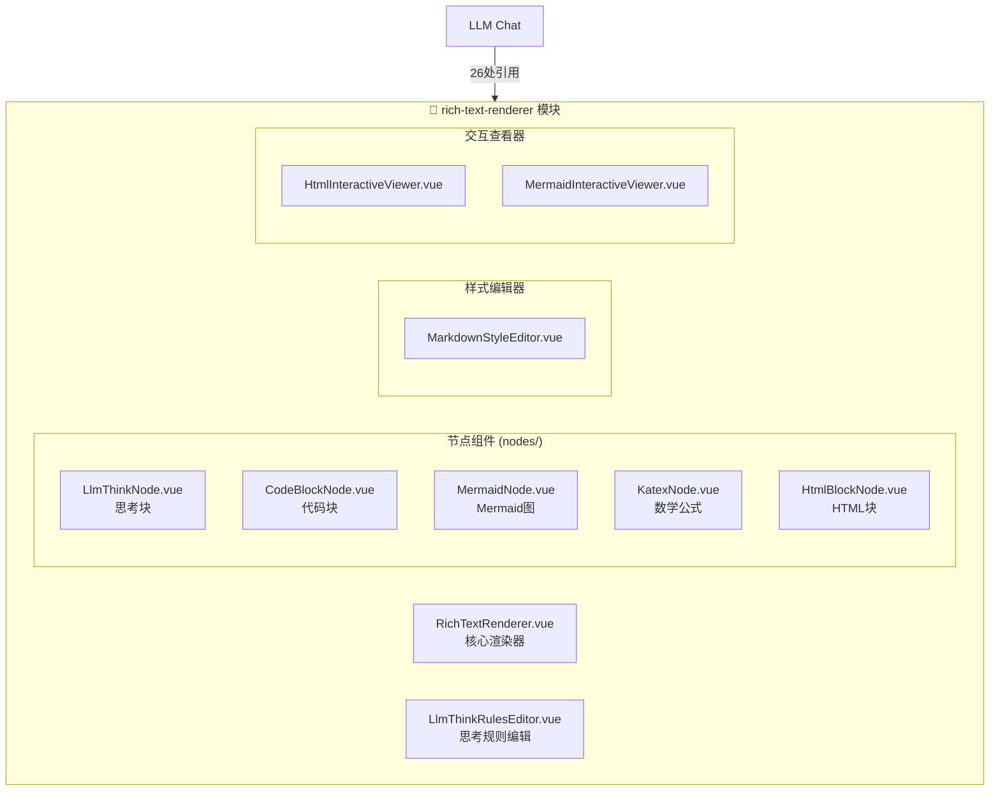

### 引用详情

| 引用位置 | 引用内容 |
|---------|---------|
| `MessageContent.vue` | RichTextRenderer, LlmThinkNode |
| `PresetMessageEditor.vue` | RichTextRenderer |
| `EditAgentDialog.vue` | LlmThinkRulesEditor, MarkdownStyleEditor |
| `ChatSettingsDialog.vue` | MarkdownStyleEditor |
| `GraphNodeDetailPopup.vue` | 类型引用 |
| 多个组件 | RichTextRendererStyleOptions, LlmThinkRule 类型 |

---

## 9. 外部依赖：通用组件库 (components/common/)

LLM Chat 使用的通用组件（47处引用）：

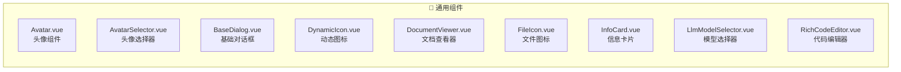

### 使用分布

| 组件 | 使用位置 |
|-----|---------|
| **Avatar** | ChatArea, MessageHeader, BranchSelector, SessionsSidebar, AgentListItem, StructuredView, GraphNodeContent, ExportAgentDialog, ExportBranchDialog, CreateAgentDialog, EditAgentDialog |
| **BaseDialog** | ChatSettingsDialog, EditUserProfileDialog, ContextAnalyzerDialog, ExportSessionDialog, ExportBranchDialog, ExportAgentDialog, ImportAgentDialog, STPresetImportDialog, ModelParametersEditor, AttachmentCard, MessageContent, GraphUsageGuideDialog |
| **DynamicIcon** | ChatArea, MessageHeader, BranchSelector, GraphNodeContent |
| **LlmModelSelector** | ParametersSidebar, ChatSettingsDialog, EditAgentDialog, ImportAgentDialog |
| **DocumentViewer** | MessageContent, AttachmentCard, RawRequestView |
| **RichCodeEditor** | PresetMessageEditor, ModelParametersEditor |
| **InfoCard** | StructuredView, MacroDebugView, AnalysisChartView |

---

## 10. 外部依赖：顶层组件

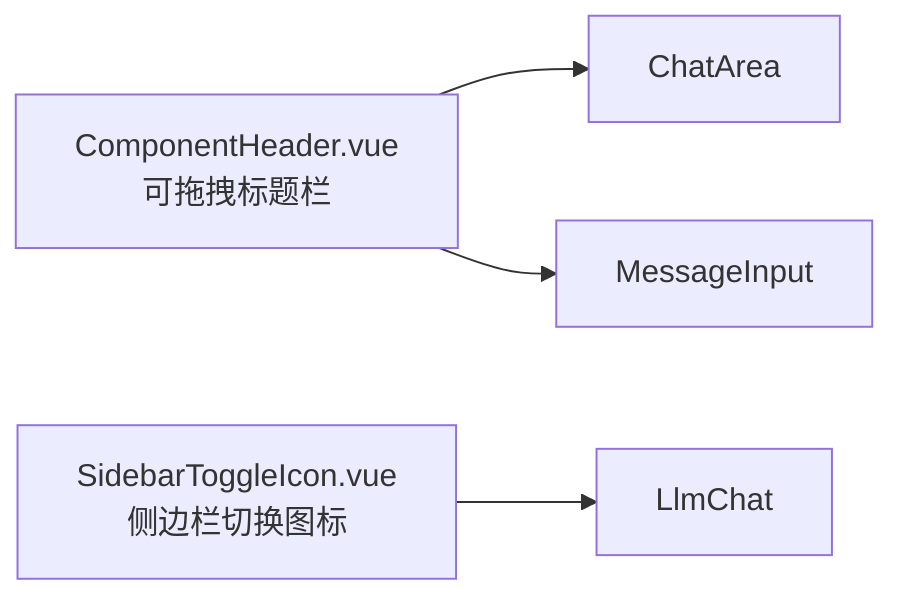

---

## 11. Composables 层 (composables/)

LLM Chat 使用的组合式函数：

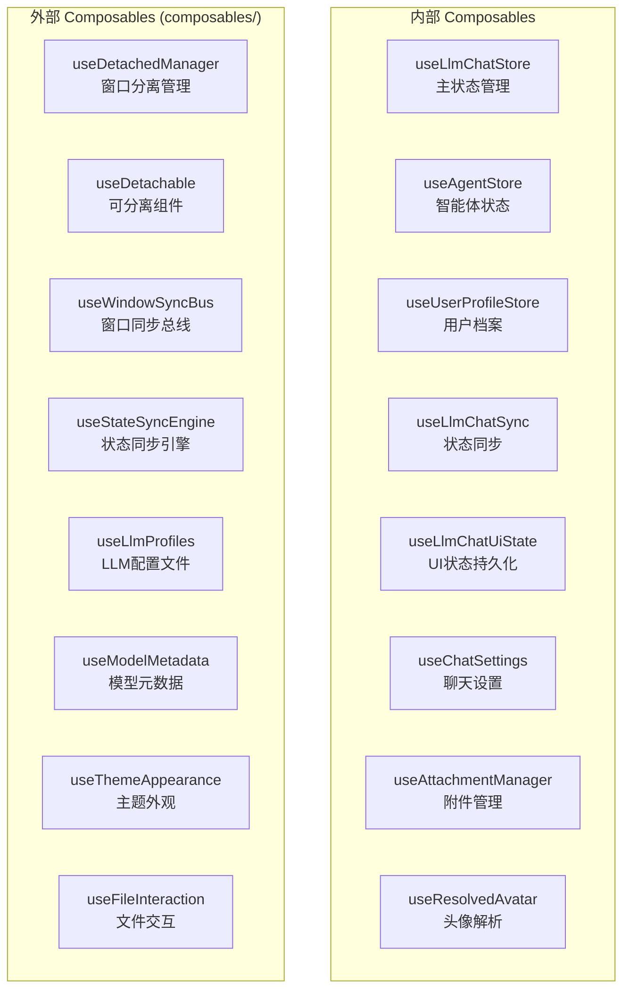

---

## 12. 完整组件文件清单

### llm-chat/components/ 目录结构

```
components/
├── ChatArea.vue                    # 核心对话区域
├── AttachmentCard.vue              # 附件卡片
│
├── agent/                          # 智能体管理 (8个)
│   ├── AgentPresetEditor.vue
│   ├── CreateAgentDialog.vue
│   ├── EditAgentDialog.vue
│   ├── MacroSelector.vue
│   ├── ModelParametersEditor.vue
│   ├── ParameterItem.vue
│   ├── PresetMessageEditor.vue
│   └── STPresetImportDialog.vue
│
├── context-analyzer/               # 上下文分析 (5个)
│   ├── AnalysisChartView.vue
│   ├── ContextAnalyzerDialog.vue
│   ├── MacroDebugView.vue
│   ├── RawRequestView.vue
│   └── StructuredView.vue
│
├── conversation-tree-graph/        # 对话树图 (9个)
│   ├── ContextMenu.vue
│   └── flow/
│       ├── FlowTreeGraph.vue
│       └── components/
│           ├── CustomConnectionLine.vue
│           ├── GraphNode.vue
│           ├── GraphNodeContent.vue
│           ├── GraphNodeDetailPopup.vue
│           ├── GraphNodeMenubar.vue
│           ├── GraphUsageGuideDialog.vue
│           └── HistoryPanel.vue
│
├── export/                         # 导入导出 (4个)
│   ├── ExportAgentDialog.vue
│   ├── ExportBranchDialog.vue
│   ├── ExportSessionDialog.vue
│   └── ImportAgentDialog.vue
│
├── message/                        # 消息组件 (8个)
│   ├── BranchSelector.vue
│   ├── ChatMessage.vue
│   ├── MessageContent.vue
│   ├── MessageHeader.vue
│   ├── MessageList.vue
│   ├── MessageMenubar.vue
│   ├── MessageNavigator.vue
│   └── ViewModeSwitcher.vue
│
├── message-input/                  # 消息输入 (2个)
│   └── MessageInput.vue
│
├── settings/                       # 设置 (3个)
│   ├── ChatSettingsDialog.vue
│   └── settingsConfig.ts
│
├── sidebar/                        # 侧边栏 (5个)
│   ├── AgentListItem.vue
│   ├── AgentsSidebar.vue
│   ├── LeftSidebar.vue
│   ├── ParametersSidebar.vue
│   └── SessionsSidebar.vue
│
├── user-profile/                   # 用户档案 (1个)
│   └── EditUserProfileDialog.vue
│
└── common/                         # 内部通用 (1个)
```

**总计: 48+ 个组件文件**
