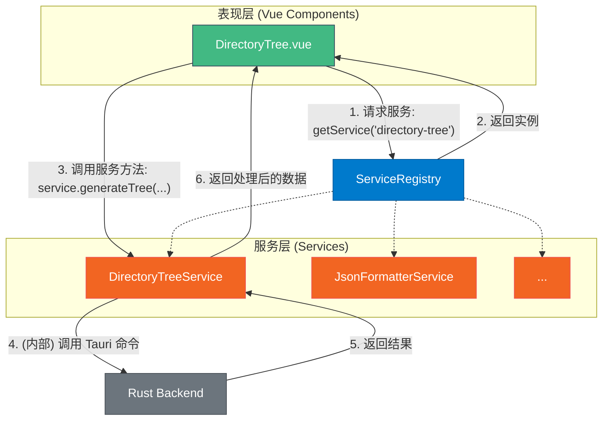

# 工具服务化重构设计方案

本文档旨在详细阐述项目工具结构的重构方案，通过引入服务层来实现业务逻辑与视图的解耦，提升代码的可维护性、可测试性和可复用性，并为未来实现 Agent 工具调用奠定基础。

## 1. 背景与动机

当前项目中的工具存在两种开发模式：

1.  **简单模式**: 以 `JsonFormatter` 为代表，UI 与业务逻辑高度耦合在单个 Vue 组件中。这种模式开发效率高，但导致逻辑难以复用和进行单元测试。
2.  **高级模式**: 以 `llm-chat` 为代表，通过 Pinia (State) 和 Composables (Logic) 实现了逻辑与视图的分离，是项目中的最佳实践。

为了统一开发模式，提升整体代码质量，并实现 `TODO.md` 中规划的“基于文本的工具调用”能力，我们需要将“高级模式”的理念制度化、框架化，推广到所有工具。

**核心目标**:

-   **逻辑解耦**: 将所有工具的核心业务逻辑从 Vue 组件中剥离出来。
-   **服务化**: 将剥离的逻辑封装成可独立实例化和调用的 **服务 (Service)**。
-   **集中管理**: 建立一个统一的 **服务注册表 (Service Registry)** 来管理所有服务的生命周期和依赖关系。
-   **协议统一**: 设计统一的工具调用协议，使任何模块（包括未来的 Agent）都能以标准化的方式调用工具能力。

## 2. 核心设计

我们将引入两个核心概念：`ToolService`（工具服务）和 `ServiceRegistry`（服务注册表）。

### 2.1. ToolService

`ToolService` 是一个抽象基类或接口，定义了所有工具服务必须遵循的基本契约。每个工具的核心功能将被封装在一个继承自 `ToolService` 的具体服务类中。

-   **职责**: 封装工具的业务逻辑、状态管理和与后端的交互，对上层（视图层）提供稳定、简洁的 API。
-   **无状态倾向**: 服务本身应尽量设计为无状态的。如果需要管理状态，应明确其范围和生命周期。
-   **示例**: `DirectoryTreeService` 将封装生成目录树、管理配置、文件交互等所有非 UI 逻辑。

### 2.2. ServiceRegistry

`ServiceRegistry` 是一个全局单例对象，它实现了 **服务定位器 (Service Locator)** 模式。

-   **职责**:
    1.  **注册 (Register)**: 在应用启动时，收集并实例化所有的 `ToolService`。
    2.  **定位 (Locate/Get)**: 为应用中的任何部分（如 Vue 组件）提供获取服务实例的统一入口。
-   **优势**: 避免了复杂的依赖注入（DI）容器，对于当前项目规模来说更轻量、更易于理解和实现。它有效地解耦了服务的使用者（组件）和服务的提供者（服务类）。

### 2.3. 新架构数据流



## 3. 接口定义 (API)

### 3.1. `ToolService` 接口

我们将创建一个基础的 `ToolService` 接口，所有具体服务都需要实现它。

**文件**: `src/services/types.ts`

```typescript
export interface ToolService {
  /**
   * 服务的唯一标识符，通常与工具路径对应。
   * @example 'directory-tree'
   */
  readonly id: string;

  /**
   * 服务初始化方法，在注册时由 ServiceRegistry 调用。
   * 可用于执行一次性设置，如加载初始配置等。
   */
  initialize?(): Promise<void>;

  /**
   * 服务销毁方法，在应用关闭或服务热重载时调用。
   * 可用于清理资源，如取消订阅、清除定时器等。
   */
  dispose?(): void;
}
```

### 3.2. `ServiceRegistry` 实现

**文件**: `src/services/registry.ts`

```typescript
import type { ToolService } from './types';

class ServiceRegistry {
  private services = new Map<string, ToolService>();

  /**
   * 注册一个或多个服务实例。
   * @param serviceInstances 要注册的服务实例。
   */
  public async register(...serviceInstances: ToolService[]): Promise<void> {
    for (const instance of serviceInstances) {
      if (this.services.has(instance.id)) {
        console.warn(`服务 "${instance.id}" 已被注册，将进行覆盖。`);
      }
      if (instance.initialize) {
        await instance.initialize();
      }
      this.services.set(instance.id, instance);
    }
  }

  /**
   * 根据 ID 获取一个已注册的服务。
   * @param id 服务的唯一标识符。
   * @returns 服务的实例。
   * @throws 如果服务未注册，则抛出错误。
   */
  public getService<T extends ToolService>(id: string): T {
    const service = this.services.get(id);
    if (!service) {
      throw new Error(`服务 "${id}"尚未注册。`);
    }
    return service as T;
  }

  /**
   * 获取所有已注册的服务。
   */
  public getAllServices(): ToolService[] {
    return Array.from(this.services.values());
  }
}

// 导出单例
export const serviceRegistry = new ServiceRegistry();

```

## 4. 实施步骤

1.  **创建基础结构**:
    *   创建 `src/services` 目录。
    *   在 `src/services` 中创建 `types.ts` 和 `registry.ts` 文件，并实现上述接口和类。

2.  **改造试点工具 (`directory-tree`)**:
    *   创建 `src/tools/directory-tree/directoryTree.service.ts`。
    *   实现 `DirectoryTreeService` 类，继承 `ToolService` 接口。
    *   将 `DirectoryTree.vue` 中的 `generateTree`, `loadConfig`, `saveConfig` 等核心逻辑迁移到 Service 中。
    *   Service 方法应返回处理好的数据，而不是直接修改 `ref`。

3.  **重构 Vue 组件**:
    *   修改 `DirectoryTree.vue`。
    *   移除所有已迁移的业务逻辑。
    *   在 `onMounted` 或需要时，通过 `serviceRegistry.getService<DirectoryTreeService>('directory-tree')` 获取服务实例。
    *   组件的 `ref` 状态由调用 Service 方法后的返回值来更新。

4.  **实现自动化服务注册**:
    *   我们将利用 Vite 的 `import.meta.glob` 功能来实现服务的自动发现和注册，避免手动维护一个巨大的服务列表。
    *   我们约定所有服务文件都必须以 `.service.ts` 结尾，并默认导出一个服务类。
    *   创建一个新文件 `src/services/auto-register.ts` 来处理此逻辑。

    **文件**: `src/services/auto-register.ts`
    ```typescript
    import { serviceRegistry } from './registry';
    import type { ToolService } from './types';

    // 定义模块导出的类型，期望是一个可以 new 的类
    type ServiceModule = {
      default: new () => ToolService;
    };

    export async function autoRegisterServices(): Promise<void> {
      // 匹配 src/tools/ 目录下所有以 .service.ts 结尾的文件
      const serviceModules = import.meta.glob<ServiceModule>('../tools/**/*.service.ts');

      const instances: ToolService[] = [];
      for (const path in serviceModules) {
        try {
          const module = await serviceModules[path]();
          const ServiceClass = module.default;
          if (ServiceClass && typeof ServiceClass === 'function') {
            instances.push(new ServiceClass());
          }
        } catch (error) {
          console.error(`自动注册服务失败: ${path}`, error);
        }
      }
      
      await serviceRegistry.register(...instances);
      console.log('自动化服务注册完成:', serviceRegistry.getAllServices().map(s => s.id));
    }
    ```

5.  **集成到应用入口**:
    *   在应用的主入口文件（如 `main.ts`）中，调用 `autoRegisterServices` 函数。

    **文件**: `src/main.ts` (示例)
    ```typescript
    import { createApp } from 'vue';
    import App from './App.vue';
    import { autoRegisterServices } from './services/auto-register';

    async function initializeApp() {
      // 优先注册所有服务
      await autoRegisterServices();

      const app = createApp(App);
      // ... 其他 app 配置
      app.mount('#app');
    }

    initializeApp();
    ```

## 5. 代码示例：`DirectoryTree` 重构前后对比

### 重构前 (`DirectoryTree.vue`)

```typescript
// ... <script setup>
const targetPath = ref("");
const isGenerating = ref(false);
const treeResult = ref("");

const generateTree = async () => {
  isGenerating.value = true;
  try {
    const result = await invoke("generate_directory_tree", { path: targetPath.value, ... });
    treeResult.value = result.tree;
  } catch (error) {
    // ... handle error
  } finally {
    isGenerating.value = false;
  }
};
</script>
```

### 重构后

**`directoryTree.service.ts`**
```typescript
import { invoke } from '@tauri-apps/api/core';
import type { ToolService } from '@/services/types';

// 定义参数和返回值的具体类型
export interface GenerateTreeOptions {
  path: string;
  showFiles: boolean;
  // ... 其他选项
}

export interface TreeGenerationResult {
  tree: string;
  stats: any;
}

export class DirectoryTreeService implements ToolService {
  public readonly id = 'directory-tree';

  public async generateTree(options: GenerateTreeOptions): Promise<TreeGenerationResult> {
    // 封装了参数构造和后端调用
    const result: TreeGenerationResult = await invoke("generate_directory_tree", {
      path: options.path,
      // ... 映射其他选项
    });
    return result;
  }

  // ... 其他方法，如 loadConfig, saveConfig
}
```

**`DirectoryTree.vue`**
```typescript
// ... <script setup>
import { serviceRegistry } from '@/services/registry';
import type { DirectoryTreeService } from './directoryTree.service';

const treeService = serviceRegistry.getService<DirectoryTreeService>('directory-tree');

const targetPath = ref("");
const isGenerating = ref(false);
const treeResult = ref("");

const handleGenerate = async () => {
  isGenerating.value = true;
  try {
    const result = await treeService.generateTree({ path: targetPath.value, ... });
    treeResult.value = result.tree;
  } catch (error) {
    // ... handle error
  } finally {
    isGenerating.value = false;
  }
};
</script>