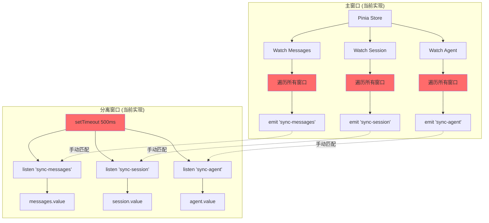
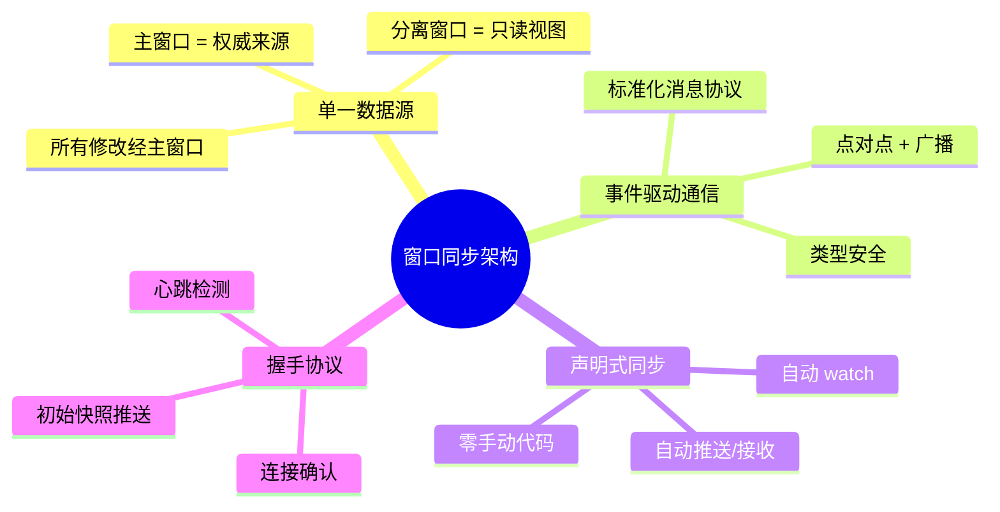
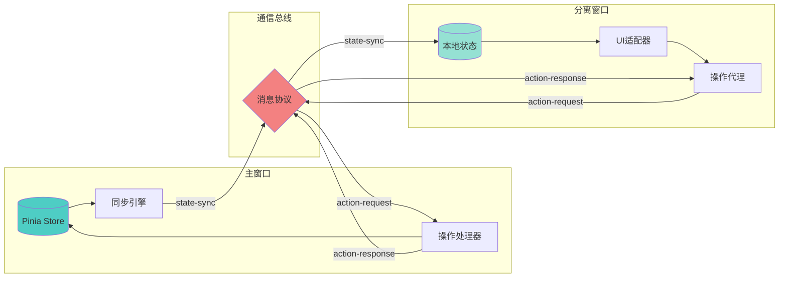
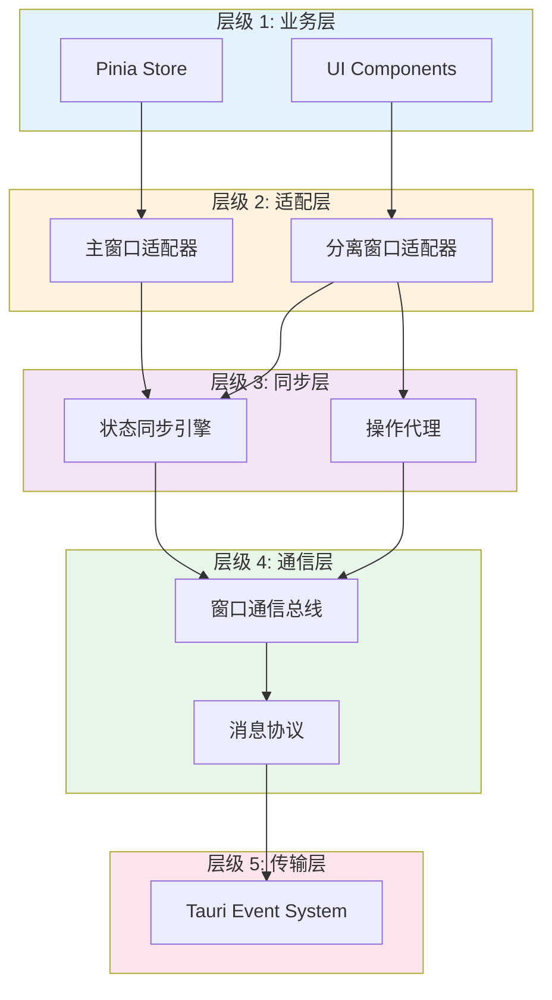
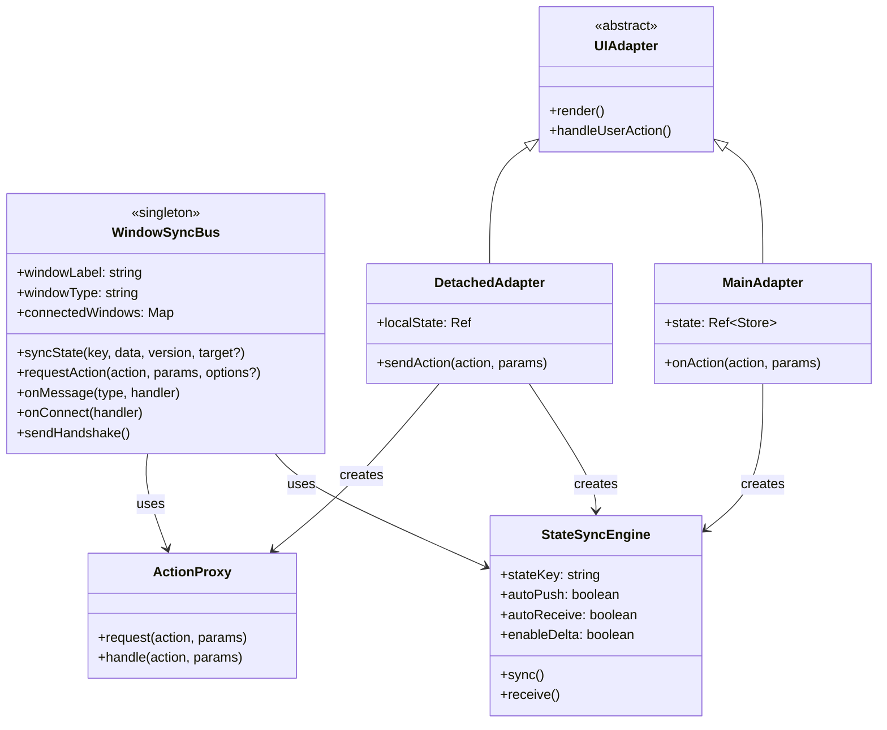
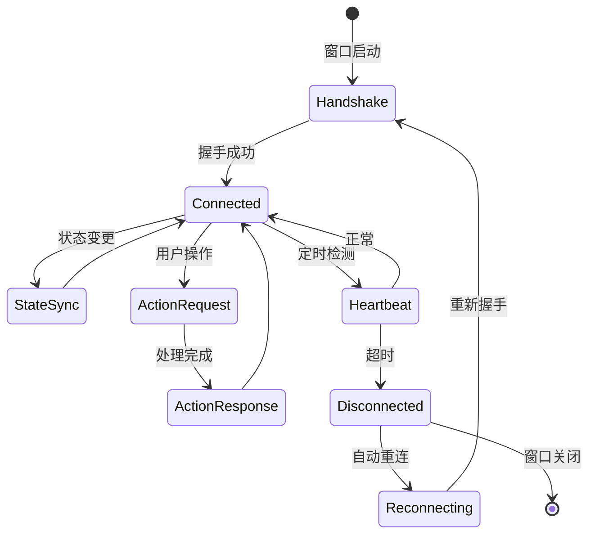
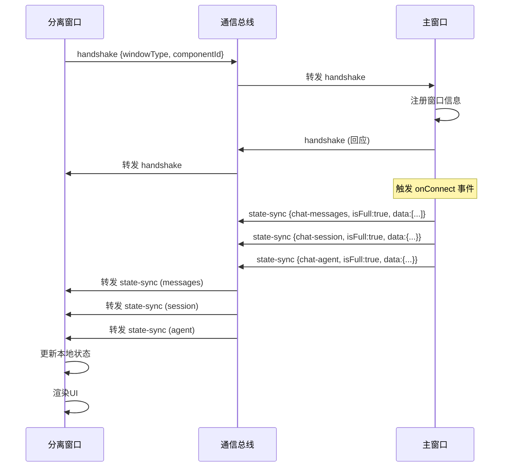
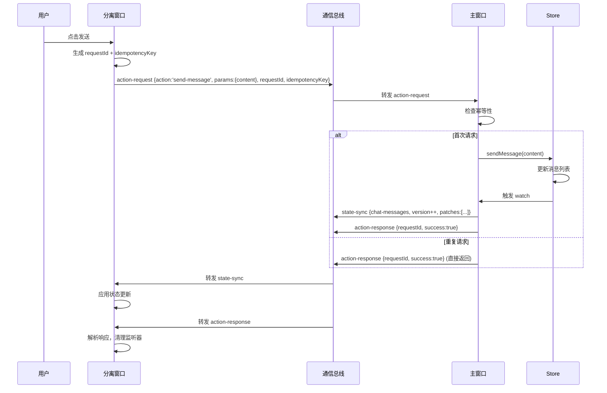
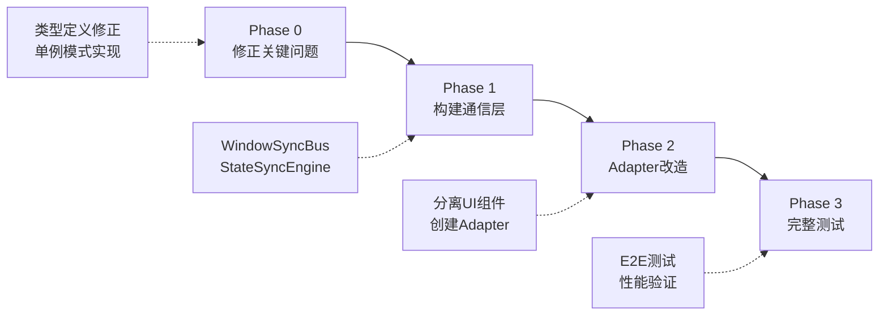

# 窗口分离状态同步重构方案 (v3.0 - 架构版)

> **文档定位**: 高层架构设计规格说明
> **受众**: 下游 AI 编码助手
> **产出物**: 架构图 + 组件接口定义 + 关键约束

---

## 1. 问题诊断

### 1.1 核心问题清单

| ID | 问题 | 类型 | 优先级 |
|----|------|------|--------|
| P1 | 手动遍历窗口进行消息推送，O(n)复杂度 | 性能 | 🔴 Critical |
| P2 | 缺乏统一的消息协议，格式不一致 | 架构 | 🔴 Critical |
| P3 | 多个 watch 导致重复推送同一状态 | 性能 | 🔴 Critical |
| P4 | 使用 setTimeout 延迟初始化，时序不可靠 | 可靠性 | 🔴 Critical |
| P5 | 分离窗口启动时缺失初始状态数据 | 功能 | 🔴 Critical |
| P6 | 全量推送大数据（5000条消息 = 5MB） | 性能 | 🟡 High |
| P7 | 组件内大量 `if (isDetached)` 分支逻辑 | 可维护性 | 🟡 High |
| P8 | 缺乏操作的幂等性保证，可能重复执行 | 可靠性 | 🟡 High |
| P9 | 无超时和重试机制 | 鲁棒性 | 🟡 High |
| P10 | 无握手协议，不知窗口连接状态 | 可靠性 | 🟡 High |

### 1.2 当前架构缺陷



**标注**: 红色节点为问题节点

---

## 2. 核心设计原则

### 2.1 四大支柱



### 2.2 数据流向



---

## 3. 目标架构

### 3.1 系统分层



### 3.2 核心组件



---

## 4. 消息协议规格

### 4.1 消息类型定义



### 4.2 消息结构规范

| 消息类型 | 方向 | 触发时机 | 必需字段 | 幂等性 |
|---------|------|---------|---------|--------|
| `handshake` | 双向 | 窗口启动/重连 | `windowType`, `componentId?` | ✅ |
| `state-sync` | 主→分离 | 状态变更 | `stateType`, `version`, `isFull`, `data/patches` | ✅ |
| `action-request` | 分离→主 | 用户操作 | `action`, `params`, `requestId`, `idempotencyKey?` | ✅ |
| `action-response` | 主→分离 | 操作完成 | `requestId`, `success`, `data?`, `error?` | ✅ |
| `heartbeat` | 双向 | 定时（30s） | `sequence` | ✅ |

### 4.3 关键时序

#### 4.3.1 窗口初始化



#### 4.3.2 用户操作流程



---

## 5. 关键技术约束

### 5.1 单例模式

**要求**: `WindowSyncBus` 必须在整个应用中全局唯一

**实现约束**:
- 使用模块级别的单例变量
- 提供 `getOrCreateInstance()` 工厂函数
- 禁止直接构造函数调用

### 5.2 增量更新策略

**触发条件**:
```
if (enableDelta && lastSyncedValue !== null) {
  patches = diff(lastValue, newValue)

  if (size(patches) < size(newValue) * deltaThreshold) {
    发送 patches
  } else {
    发送 full data
  }
}
```

**默认参数**:
- `enableDelta`: `true`
- `deltaThreshold`: `0.5`
- `debounce`: `100ms`

### 5.3 幂等性保证

**机制**:
1. 客户端生成唯一的 `idempotencyKey`
2. 服务端维护已处理键的缓存（LRU，最大1000条）
3. 重复请求直接返回成功响应

**键生成规则**:
```
idempotencyKey = `${action}-${用户ID}-${关键参数Hash}-${时间戳窗口}`
```

### 5.4 错误处理

**超时策略**:
- `action-request` 超时: 10秒
- `heartbeat` 超时: 60秒

**重试策略**:
- 最大重试次数: 3次
- 退避算法: 指数退避 (500ms * 2^attempt)

**降级策略**:
- 主窗口不可达 → 分离窗口进入只读模式
- 显示警告提示: "连接已断开，当前为只读模式"

---

## 6. 组件接口规格

### 6.1 WindowSyncBus 接口

```typescript
interface WindowSyncBus {
  // 基础信息
  readonly windowLabel: string
  readonly windowType: 'main' | 'detached-component' | 'detached-tool'
  readonly connectedWindows: ReadonlyMap<string, WindowInfo>

  // 状态同步
  syncState(stateType: string, data: any, version: number, target?: string): Promise<void>

  // 操作请求
  requestAction<TParams, TResult>(
    action: string, 
    params: TParams, 
    options?: {retries?: number, idempotencyKey?: string}
  ): Promise<TResult>

  // 操作处理（主窗口）
  onActionRequest(handler: (action: string, params: any) => Promise<any>): UnlistenFn

  // 消息监听
  onMessage<TPayload>(type: WindowMessageType, handler: MessageHandler<TPayload>): Promise<UnlistenFn>

  // 连接事件
  onConnect(handler: (windowLabel: string) => void): UnlistenFn
  onDisconnect(handler: (windowLabel: string) => void): UnlistenFn

  // 生命周期
  cleanup(): void
}
```

### 6.2 StateSyncEngine 接口

```typescript
interface StateSyncEngine<T> {
  readonly stateKey: string
  readonly stateVersion: Ref<number>

  // 配置
  readonly autoPush: boolean
  readonly autoReceive: boolean
  readonly enableDelta: boolean

  // 手动控制
  manualPush(): Promise<void>
  manualReceive(newValue: T): void

  // 生命周期
  cleanup(): void
}
```

---

## 7. 实施策略

### 7.1 迁移路径



### 7.2 验收标准

| 指标 | 目标值 | 测试方法 |
|-----|--------|---------|
| 消息推送延迟 | < 50ms | 时间戳对比 |
| 增量更新生效率 | > 80% | 日志统计 |
| 5000条消息同步 | < 200ms | 性能测试 |
| 断线重连成功率 | > 99% | 压力测试 |
| 操作幂等性 | 100% | 重复请求测试 |

### 7.3 关键里程碑

- ✅ **M1**: 通信层通过单元测试（握手、同步、请求-响应）
- ✅ **M2**: LLM Chat 完成 Adapter 改造，主/分离窗口功能对等
- ✅ **M3**: 所有组件分支逻辑 (`if isDetached`) 清理完毕
- ✅ **M4**: E2E 测试覆盖率 > 80%

---

## 8. 附录

### 8.1 术语表

| 术语 | 定义 |
|-----|------|
| 主窗口 | 拥有 Pinia Store 的权威窗口，所有状态修改的唯一来源 |
| 分离窗口 | 工具或组件的独立窗口，只读视图 + 操作代理 |
| 状态同步 | 主窗口主动推送状态到分离窗口 |
| 操作代理 | 分离窗口将用户操作转发到主窗口执行 |
| 幂等性 | 同一操作多次执行与一次执行结果相同 |
| 增量更新 | 仅传输状态的变化部分，而非完整数据 |

### 8.2 依赖库

| 库名 | 版本 | 用途 |
|-----|------|------|
| `fast-json-patch` | ^3.1.1 | 计算和应用 JSON 增量 |
| `@tauri-apps/api` | ^2.x | Tauri 窗口和事件通信 |
| `vue` | ^3.x | 响应式状态管理 |
| `pinia` | ^2.x | 主窗口状态存储 |

---

**文档版本**: 3.0 (架构版)
**最后更新**: 2025-01-XX
**输出格式**: 机器可读规格说明
**下游处理**: AI 编码助手自动实现