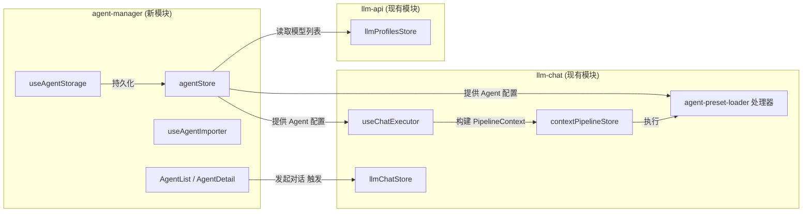
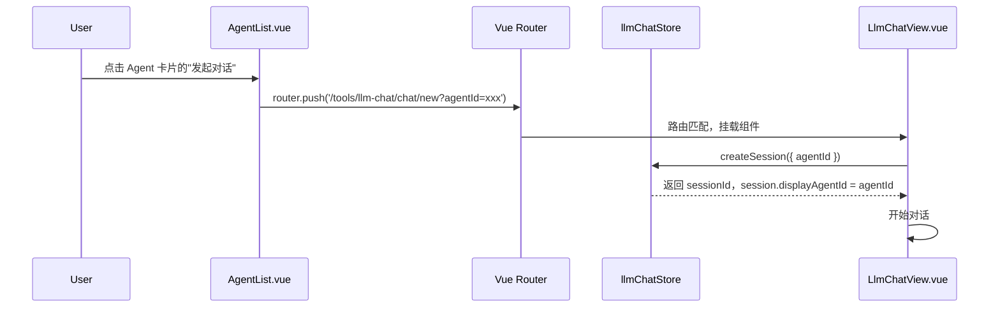
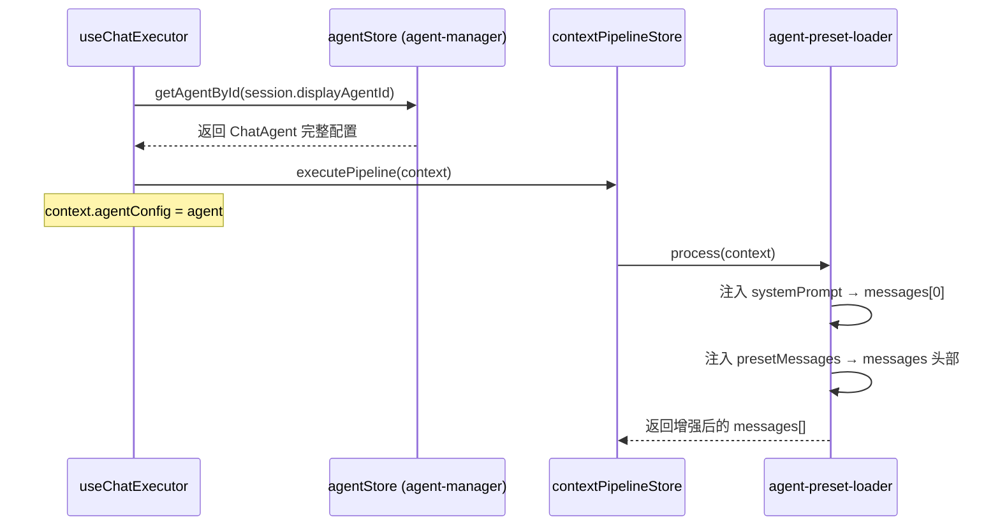

# 移动端 Agent 独立化管理器 — 规划方案

> **文档状态**: RFC (Request for Comments)  
> **创建日期**: 2025-06-23  
> **关联模块**: `mobile/src/tools/agent-manager/` (待创建)  
> **前置依赖**: `mobile/src/tools/llm-api/`, `mobile/src/tools/llm-chat/`

## 1. 背景与动机

### 1.1. 桌面端现状

在桌面端，Agent（智能体）的代码物理寄生在 `src/tools/llm-chat/` 内部：

- `src/tools/llm-chat/stores/agentStore.ts` — 智能体状态管理
- `src/tools/llm-chat/components/agent/` — 全部 Agent UI 组件（编辑器、列表、导入导出等）
- `src/tools/llm-chat/services/agentManagementService.ts` — Agent Callable 服务
- `src/tools/llm-chat/services/agentImportService.ts` — 导入服务
- `src/tools/llm-chat/services/agentExportService.ts` — 导出服务

虽然桌面端在 `llm-chat.registry.ts` 中将 Agent 管理注册为独立的 Callable 实例，但物理上依然与 Chat 强耦合。这导致 `llm-chat` 既要管对话、又要管角色配置，代码量过于庞大。

### 1.2. 移动端现状

移动端 `mobile/src/tools/llm-chat/` 当前处于极简状态：

- `useChatExecutor.ts` 中 `agentConfig` 为空对象 `{}`，没有任何 Agent 逻辑接入。
- `ChatHome.vue` 中"角色大厅"和"用户档案"处于 `disabled` 置灰状态。
- `types/pipeline.ts` 中 `agentConfig` 类型标注为 `any`。
- `types/session.ts` 已预留 `displayAgentId?: string | null` 字段。

### 1.3. 为何在移动端试水分离

1. **干净的起点**：移动端尚未引入任何 Agent 实现，没有历史包袱。
2. **验证解耦可行性**：如果移动端能优雅地实现 Chat 与 Agent 的分离协作，后续可以指导桌面端的渐进式重构。
3. **跨工具复用**：独立的 Agent 管理器可以被未来的其他工具（OCR 预设、工作流节点等）直接调用，而不必依赖 `llm-chat`。
4. **职责清晰**：`llm-chat` 只关注"对话"，`agent-manager` 只关注"角色配置与管理"。

---

## 2. 架构设计

### 2.1. 模块边界



### 2.2. 依赖方向（单向依赖）

| 模块            | 可以依赖                                      | 不可以依赖             |
| --------------- | --------------------------------------------- | ---------------------- |
| `agent-manager` | `llm-api`（模型元数据）                       | `llm-chat`（避免循环） |
| `llm-chat`      | `agent-manager`（获取 Agent 配置）, `llm-api` | —                      |

**特别说明**：`agent-manager` 提供"发起对话"的交互时，通过**路由跳转 + query 参数**传递 `agentId`，而非直接 import `llmChatStore`。这保持了依赖方向的纯净性。

### 2.3. 物理目录结构

```
mobile/src/tools/agent-manager/
├── agent-manager.registry.ts     # 工具注册入口
├── ARCHITECTURE.md               # 本模块架构文档
├── components/
│   ├── AgentCard.vue             # 智能体卡片（列表展示用）
│   ├── AgentEditor.vue           # 智能体属性编辑器
│   └── PresetMessageEditor.vue   # 预设消息编辑器
├── composables/
│   ├── useAgentStorage.ts        # 本地文件存储（index + 独立 JSON）
│   └── useAgentImporter.ts       # 角色卡导入
├── locales/
│   ├── zh-CN.json
│   └── en-US.json
├── stores/
│   └── agentStore.ts             # 核心 Pinia Store
├── types/
│   ├── agent.ts                  # ChatAgent 类型定义
│   └── import.ts                 # 导入导出相关类型
└── views/
    ├── AgentList.vue             # 角色大厅 / 列表页
    └── AgentDetail.vue           # 智能体详情 / 编辑页
```

---

## 3. 核心类型定义

### 3.1. ChatAgent

```typescript
// mobile/src/tools/agent-manager/types/agent.ts

export interface PresetMessage {
  id: string;
  role: "system" | "user" | "assistant";
  content: string;
  enabled: boolean;
}

export interface AgentParameters {
  temperature?: number;
  topP?: number;
  maxTokens?: number;
  frequencyPenalty?: number;
  presencePenalty?: number;
}

export interface ChatAgent {
  /** 唯一标识，格式 agent-{timestamp}-{random} */
  id: string;
  /** 内部名称 */
  name: string;
  /** 显示名称（用于 UI，优先于 name） */
  displayName?: string;
  /** 头像路径（appdata:// 协议、Base64 或相对路径） */
  avatar?: string;
  /** 简短描述 */
  description?: string;
  /** 系统提示词（核心） */
  systemPrompt?: string;
  /** 绑定的 LLM 渠道 ID */
  profileId: string;
  /** 绑定的模型 ID */
  modelId: string;
  /** 预设消息列表 */
  presetMessages?: PresetMessage[];
  /** 模型参数覆盖 */
  parameters?: AgentParameters;
  /** 版本号（用于未来迁移） */
  version?: number;
  /** 时间戳 */
  createdAt: string;
  updatedAt: string;
  lastUsedAt?: string;
}
```

### 3.2. 存储结构

```
{appConfigDir}/agent-manager/
├── agents-index.json          # 索引文件
└── agents/
    ├── {agentId1}.json        # 单个智能体完整数据
    └── {agentId2}.json
```

**索引文件格式**：

```typescript
interface AgentsIndex {
  version: string; // "1.0.0"
  currentAgentId: string | null;
  agents: Array<{
    id: string;
    name: string;
    displayName?: string;
    avatar?: string;
    profileId: string;
    modelId: string;
    updatedAt: string;
    lastUsedAt?: string;
  }>;
}
```

> **注意**：存储路径使用 `agent-manager/` 而非 `llm-chat/agents/`，物理上与 Chat 的会话数据完全隔离。如果未来需要从桌面端迁移数据，通过 migration 脚本处理。

---

## 4. 双模块协作机制

### 4.1. 场景一：从角色大厅发起新对话



### 4.2. 场景二：对话执行时注入 Agent 上下文



### 4.3. 场景三：在聊天界面切换 Agent

在聊天界面顶部，提供一个轻量级的 Agent 选择器（下拉或弹窗），用户切换后：

1. 更新 `session.displayAgentId`。
2. 后续消息使用新 Agent 的配置发送。
3. 历史消息不受影响（每条助手消息的 metadata 中快照了当时的 agentId）。

---

## 5. 实施计划

### 阶段 1：基础设施搭建（地基）

| 任务                | 产出文件                         | 说明                                                   |
| ------------------- | -------------------------------- | ------------------------------------------------------ |
| 定义 ChatAgent 类型 | `types/agent.ts`                 | 精简版，保留核心字段                                   |
| 实现本地存储        | `composables/useAgentStorage.ts` | createConfigManager 管理索引，独立 JSON 存储每个 Agent |
| 实现核心 Store      | `stores/agentStore.ts`           | CRUD + 列表管理 + 当前选中                             |
| 工具注册            | `agent-manager.registry.ts`      | 路由、语言包、图标                                     |
| 创建默认 Agent      | Store 初始化逻辑                 | 首次启动时创建一个"默认助手"                           |

### 阶段 2：UI 实现（骨架）

| 任务         | 产出文件                          | 说明                                                  |
| ------------ | --------------------------------- | ----------------------------------------------------- |
| 智能体列表页 | `views/AgentList.vue`             | 展示所有 Agent，支持搜索、排序、新建                  |
| 智能体详情页 | `views/AgentDetail.vue`           | 编辑名称、头像、系统提示词、绑定模型、参数调节        |
| 角色卡导入   | `composables/useAgentImporter.ts` | 支持 AIO Agent JSON 和 SillyTavern 角色卡（PNG/JSON） |
| 卡片组件     | `components/AgentCard.vue`        | 用于列表展示的紧凑卡片                                |

### 阶段 3：打通对话连接（合体）

| 任务               | 修改文件                                                   | 说明                                       |
| ------------------ | ---------------------------------------------------------- | ------------------------------------------ |
| 解除"角色大厅"禁用 | `llm-chat/views/ChatHome.vue`                              | 点击跳转到 `/tools/agent-manager`          |
| 修改会话创建       | `llm-chat/stores/llmChatStore.ts`                          | `createSession()` 支持传入 `agentId`       |
| 修改执行器         | `llm-chat/composables/useChatExecutor.ts`                  | 从 agentStore 获取配置，填充 `agentConfig` |
| 实现管道处理器     | `llm-chat/core/pipeline/processors/agent-preset-loader.ts` | 注入系统提示词和预设消息                   |
| 聊天界面显示 Agent | `llm-chat/views/LlmChatView.vue`                           | 导航栏展示当前 Agent 头像和名称            |

---

## 6. 与桌面端的兼容策略

| 维度         | 策略                                                                       |
| ------------ | -------------------------------------------------------------------------- |
| **存储路径** | 移动端使用独立的 `agent-manager/` 路径，不与桌面端 `llm-chat/agents/` 冲突 |
| **类型定义** | 移动端 `ChatAgent` 是桌面端的精简子集，字段名保持一致，方便未来做双端同步  |
| **导入格式** | 支持桌面端的 `AIO_Agent_Export` JSON 格式，确保角色卡可以跨端迁移          |
| **未来演进** | 如果桌面端也决定拆分 Agent，可以参照移动端的架构模式进行渐进式重构         |

---

## 7. 风险评估

| 风险                                     | 影响         | 缓解措施                                                     |
| ---------------------------------------- | ------------ | ------------------------------------------------------------ |
| `agent-manager` 与 `llm-chat` 的循环依赖 | 构建失败     | 严格遵循单向依赖；"发起对话"通过路由跳转而非直接 import      |
| 桌面端数据迁移到移动端时格式不兼容       | 用户丢失配置 | 移动端 Agent 字段是桌面端的子集，导入时只取支持的字段        |
| 移动端内存限制导致大量 Agent 加载卡顿    | UI 卡顿      | 采用索引 + 按需加载策略（与桌面端 `ensureAgentLoaded` 一致） |
| PresetMessages 过长导致 Token 超限       | 请求失败     | 在 `agent-preset-loader` 中增加 Token 估算警告               |

---

## 8. 开放问题

1. **用户档案 (UserProfile)**：是否也应该独立为一个工具？还是暂时作为 `agent-manager` 的子功能？
   - 倾向：做独立模块页

2. **世界书 (Worldbook)**：移动端是否需要支持？
   - 倾向：当前版本不添加，后续适时再追加。

3. **存储路径是否与桌面端对齐**：用 `agent-manager/` 还是 `llm-chat/agents/`？
   - 已决定：使用独立的 `agent-manager/`，物理隔离更干净。跨端迁移通过导入导出解决。
