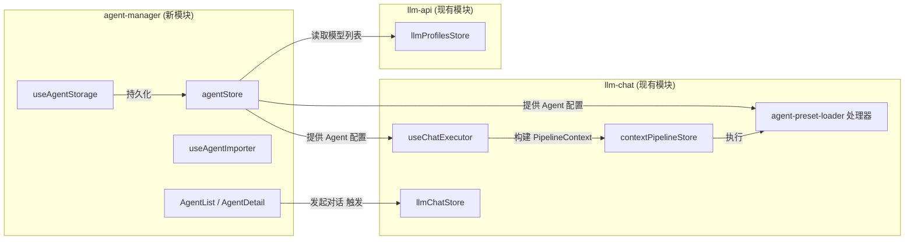
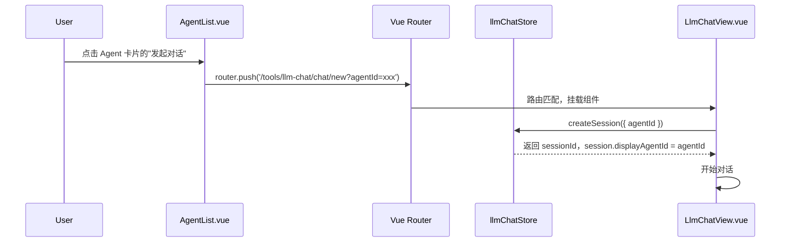
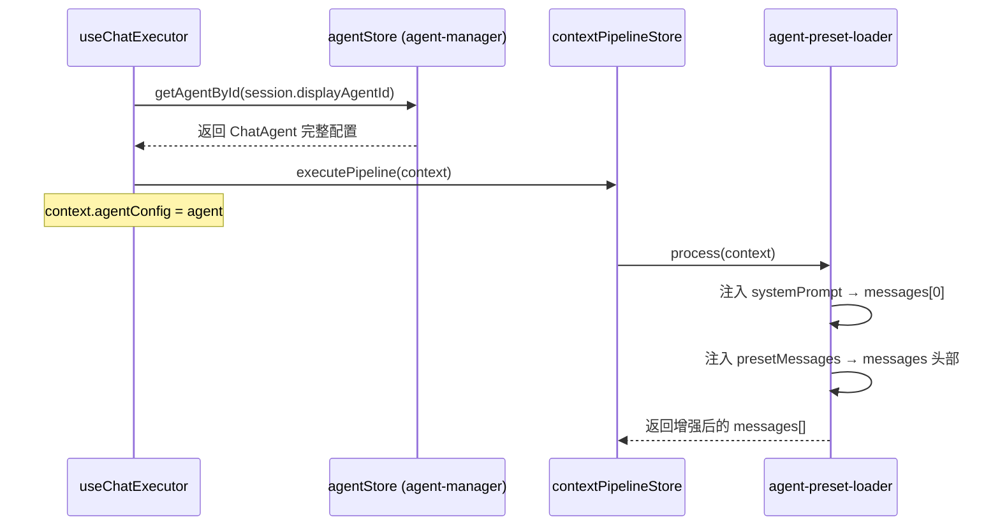

# 移动端 Agent 独立化管理器 — 规划方案

> **文档状态**: 实施中（MVP 已接通）
> **创建日期**: 2025-06-23  
> **关联模块**: `mobile/src/tools/agent-manager/` (待创建)  
> **前置依赖**: `mobile/src/tools/llm-api/`, `mobile/src/tools/llm-chat/`

## 1. 背景与动机

### 1.1. 桌面端现状

在桌面端，Agent（智能体）的代码物理寄生在 `src/tools/llm-chat/` 内部：

- `src/tools/llm-chat/stores/agentStore.ts` — 智能体状态管理
- `src/tools/llm-chat/components/agent/` — 全部 Agent UI 组件（编辑器、列表、导入导出等）
- `src/tools/llm-chat/services/agentManagementService.ts` — Agent Callable 服务
- `src/tools/llm-chat/services/agentImportService.ts` — 导入服务
- `src/tools/llm-chat/services/agentExportService.ts` — 导出服务

虽然桌面端在 `llm-chat.registry.ts` 中将 Agent 管理注册为独立的 Callable 实例，但物理上依然与 Chat 强耦合。这导致 `llm-chat` 既要管对话、又要管角色配置，代码量过于庞大。

### 1.2. 移动端现状

移动端 `mobile/src/tools/llm-chat/` 当前处于极简状态：

- `useChatExecutor.ts` 中 `agentConfig` 为空对象 `{}`，没有任何 Agent 逻辑接入。
- `ChatHome.vue` 中"角色大厅"和"用户档案"处于 `disabled` 置灰状态。
- `types/pipeline.ts` 中 `agentConfig` 类型标注为 `any`。
- `types/session.ts` 已预留 `displayAgentId?: string | null` 字段。

### 1.3. 为何在移动端试水分离

1. **干净的起点**：移动端尚未引入任何 Agent 实现，没有历史包袱。
2. **验证解耦可行性**：如果移动端能优雅地实现 Chat 与 Agent 的分离协作，后续可以指导桌面端的渐进式重构。
3. **跨工具复用**：独立的 Agent 管理器可以被未来的其他工具（OCR 预设、工作流节点等）直接调用，而不必依赖 `llm-chat`。
4. **职责清晰**：`llm-chat` 只关注"对话"，`agent-manager` 只关注"角色配置与管理"。

---

## 2. 架构设计

### 2.1. 模块边界



### 2.2. 依赖方向（单向依赖）

| 模块            | 可以依赖                                      | 不可以依赖             |
| --------------- | --------------------------------------------- | ---------------------- |
| `agent-manager` | `llm-api`（模型元数据）                       | `llm-chat`（避免循环） |
| `llm-chat`      | `agent-manager`（获取 Agent 配置）, `llm-api` | —                      |

**特别说明**：`agent-manager` 提供"发起对话"的交互时，通过**路由跳转 + query 参数**传递 `agentId`，而非直接 import `llmChatStore`。这保持了依赖方向的纯净性。

### 2.3. 物理目录结构

```
mobile/src/tools/agent-manager/
├── agent-manager.registry.ts     # 工具注册入口
├── ARCHITECTURE.md               # 本模块架构文档
├── components/
│   ├── AgentCard.vue             # 智能体卡片（列表展示用）
│   ├── AgentEditor.vue           # 智能体属性编辑器
│   └── PresetMessageEditor.vue   # 预设消息编辑器
├── composables/
│   ├── useAgentStorage.ts        # 本地文件存储（index + 独立 JSON）
│   └── useAgentImporter.ts       # 角色卡导入
├── locales/
│   ├── zh-CN.json
│   └── en-US.json
├── stores/
│   └── agentStore.ts             # 核心 Pinia Store
├── types/
│   ├── agent.ts                  # ChatAgent 类型定义
│   └── import.ts                 # 导入导出相关类型
└── views/
    ├── AgentList.vue             # 角色大厅 / 列表页
    └── AgentDetail.vue           # 智能体详情 / 编辑页
```

---

## 3. 核心类型定义与数据结构对齐

为了确保移动端与桌面端之间的**无损导入导出**以及未来的**双端数据同步**，移动端在数据结构上必须与桌面端保持 **100% 全量对齐**。严禁使用裁剪版的“精简数据结构”，未在移动端 UI 中提供编辑的高级字段在读写时必须予以保留。

### 3.1. 核心类型定义

移动端将直接复用或完全对齐桌面端的类型定义。

```typescript
// mobile/src/tools/agent-manager/types/agent.ts
import type { ChatMessageNode } from "../../llm-chat/types/message";
import type { LlmParameters } from "../../llm-chat/types/llm";
import type { AgentCategory } from "../../llm-chat/types/agent";

/**
 * 智能体共有配置基础接口（完全对齐桌面端 AgentBaseConfig）
 */
export interface AgentBaseConfig {
  /** 预设配置的版本号（格式版本），默认为 2 */
  version?: number;
  /** 智能体自身的版本号（用于升级对比） */
  agentVersion?: string;
  /** 智能体名称（用作唯一标识符的一部分，也是宏替换的 ID） */
  name: string;
  /** 显示名称（UI 显示优先使用） */
  displayName?: string;
  /** 智能体描述 */
  description?: string;
  /** 智能体图标/头像（emoji、图标路径或相对文件名，如 avatar-xxx.png） */
  icon?: string;
  /** 预设消息序列（支持完整的树形结构、注入策略、模型匹配等） */
  presetMessages?: ChatMessageNode[];
  /** 开局消息列表 */
  greetings?: any[]; // 对应 GreetingMessage[]
  /** 在聊天界面显示的预设消息数量 */
  displayPresetCount?: number;
  /** 参数配置 */
  parameters?: LlmParameters;
  /** LLM 思考块规则配置 */
  llmThinkRules?: any[];
  /** 富文本渲染器样式配置 */
  richTextStyleOptions?: any;
  /** 工具调用默认折叠 */
  defaultToolCallCollapsed?: boolean;
  /** 虚拟时间配置 */
  virtualTimeConfig?: {
    virtualBaseTime: string;
    realBaseTime: string;
    timeScale?: number;
  };
  /** 筛选标签 */
  tags?: string[];
  /** 智能体分类 */
  category?: AgentCategory;
  /** 正则管道配置 */
  regexConfig?: any;
  /** 交互行为配置 */
  interactionConfig?: {
    sendButtonCreateBranch?: boolean;
    defaultMediaVolume?: number;
  };
  /** 智能体资产分组定义 */
  assetGroups?: any[];
  /** 智能体专属资产 */
  assets?: any[];
  /** 关联的世界书 ID 列表 */
  worldbookIds?: string[];
  /** 关联的快捷操作组 ID 列表 */
  quickActionSetIds?: string[];
  /** 世界书覆盖设置 */
  worldbookSettings?: any;
  /** 知识库关联配置 */
  knowledgeBaseConfig?: any;
  /** 知识库全局设置 (检索参数) */
  knowledgeSettings?: any;
  /** 工具调用配置 */
  toolCallConfig?: any;
  /** 环境增强配置 */
  extensionConfig?: any;
  /** 视觉化输出指南 */
  visualGuideline?: string;
  /** 会话变量配置 */
  variableConfig?: any;
  /** 预设消息组定义 */
  presetGroups?: any[];
}

/**
 * 智能体（Agent）完整定义（完全对齐桌面端 ChatAgent）
 */
export interface ChatAgent extends AgentBaseConfig {
  /** 智能体的唯一标识符 (运行时生成的 UUID) */
  id: string;
  /** 历史头像列表（相对文件名），用于在头像选择器中快速显示 */
  avatarHistory?: string[];
  /** 使用的 Profile ID */
  profileId: string;
  /** 使用的模型 ID */
  modelId: string;
  /** 绑定的用户档案 ID（可选） */
  userProfileId?: string | null;
  /** 创建时间 (ISO 8601 格式) */
  createdAt: string;
  /** 最后使用时间 (ISO 8601 格式) */
  lastUsedAt?: string;
}
```

### 3.2. 存储结构对齐

为了支持智能体专属资产（如自定义头像、背景图等）的物理隔离与无损迁移，移动端必须完全对齐桌面端的**“一智能体一目录”**分离式存储结构。

```
{appConfigDir}/agent-manager/
├── agents-index.json          # 索引文件（轻量级，用于快速列表渲染）
└── agents/
    ├── {agentId1}/
    │   ├── agent.json         # 智能体完整数据（ChatAgent 格式）
    │   └── avatar-xxx.png     # 智能体专属头像（icon 字段保存为相对路径 "avatar-xxx.png"）
    └── {agentId2}/
        └── agent.json
```

**索引文件格式（完全对齐桌面端 AgentIndexItem）**：

```typescript
interface AgentIndexItem {
  id: string;
  name: string;
  displayName?: string;
  agentVersion?: string;
  description?: string;
  icon?: string; // 头像/图标
  profileId: string;
  modelId: string;
  lastUsedAt?: string;
  createdAt: string;
  category?: AgentCategory;
  tags?: string[];
}

interface AgentsIndex {
  version: string; // "1.1.0"
  currentAgentId: string | null;
  agents: AgentIndexItem[]; // 智能体元数据列表（用于排序和快速显示）
}
```

> **存储设计优势**：
>
> 1. **轻量化加载**：列表页仅加载 `agents-index.json`，避免一次性读取数十个完整智能体 JSON 导致的 I/O 瓶颈。
> 2. **资产自治**：智能体专属头像与配置文件存放在同一目录下，删除智能体时可一并清理，且打包导出时极易归档。
> 3. **无损兼容**：存储路径使用独立的 `agent-manager/`，物理上与 Chat 的会话数据完全隔离，但目录层级和文件格式与桌面端 `llm-chat/agents/` 完美一致。

---

## 4. 双模块协作机制

### 4.1. 场景一：从角色大厅发起新对话



### 4.2. 场景二：对话执行时注入 Agent 上下文



### 4.3. 场景三：在聊天界面切换 Agent

在聊天界面顶部，提供一个轻量级的 Agent 选择器（下拉或弹窗），用户切换后：

1. 更新 `session.displayAgentId`。
2. 后续消息使用新 Agent 的配置发送。
3. 历史消息不受影响（每条助手消息的 metadata 中快照了当时的 agentId）。

---

## 5. 实施计划

### 当前进度（2026-07-14）

- [x] 阶段 1：完整兼容字段、独立目录存储、CRUD Store、工具注册与默认智能体。
- [x] 阶段 2 MVP：列表搜索/新建/删除、基础信息编辑、模型绑定、首条系统提示词编辑。
- [x] 阶段 3：角色大厅入口、会话绑定、模型与参数绑定、预设管道注入、聊天栏智能体标识。
- [ ] 后续增强：AIO/SillyTavern 导入导出、头像与资产管理、完整参数编辑、用户档案。

实现偏差：移动端 MVP 当前全量加载智能体详情，以降低首版状态复杂度；列表使用页面内紧凑行而非独立 `AgentCard`。存储格式仍保持 `agent-manager/agents/{id}/agent.json` 与轻量索引分离，后续可在数据规模需要时切换为按需加载，不影响磁盘格式。

### 阶段 1：基础设施搭建（地基）

| 任务                | 产出文件                         | 说明                                                                                       |
| ------------------- | -------------------------------- | ------------------------------------------------------------------------------------------ |
| 定义 ChatAgent 类型 | `types/agent.ts`                 | **完全对齐桌面端**，包含所有高级字段（如 `ChatMessageNode` 树形结构、`toolCallConfig` 等） |
| 实现本地存储        | `composables/useAgentStorage.ts` | **完全对齐桌面端的分离式存储（一智能体一目录）**，支持索引同步、相对头像路径迁移与防抖保存 |
| 实现核心 Store      | `stores/agentStore.ts`           | CRUD + 列表管理 + 当前选中，支持按需加载详情                                               |
| 工具注册            | `agent-manager.registry.ts`      | 路由、语言包、图标（使用 `markRaw` 包裹）                                                  |
| 创建默认 Agent      | Store 初始化逻辑                 | 首次启动时创建一个"默认助手"                                                               |

### 阶段 2：UI 实现（骨架）

| 任务         | 产出文件                          | 说明                                                  |
| ------------ | --------------------------------- | ----------------------------------------------------- |
| 智能体列表页 | `views/AgentList.vue`             | 展示所有 Agent，支持搜索、排序、新建                  |
| 智能体详情页 | `views/AgentDetail.vue`           | 编辑名称、头像、系统提示词、绑定模型、参数调节        |
| 角色卡导入   | `composables/useAgentImporter.ts` | 支持 AIO Agent JSON 和 SillyTavern 角色卡（PNG/JSON） |
| 卡片组件     | `components/AgentCard.vue`        | 用于列表展示的紧凑卡片                                |

### 阶段 3：打通对话连接（合体）

| 任务               | 修改文件                                                   | 说明                                       |
| ------------------ | ---------------------------------------------------------- | ------------------------------------------ |
| 解除"角色大厅"禁用 | `llm-chat/views/ChatHome.vue`                              | 点击跳转到 `/tools/agent-manager`          |
| 修改会话创建       | `llm-chat/stores/llmChatStore.ts`                          | `createSession()` 支持传入 `agentId`       |
| 修改执行器         | `llm-chat/composables/useChatExecutor.ts`                  | 从 agentStore 获取配置，填充 `agentConfig` |
| 实现管道处理器     | `llm-chat/core/pipeline/processors/agent-preset-loader.ts` | 注入系统提示词和预设消息                   |
| 聊天界面显示 Agent | `llm-chat/views/LlmChatView.vue`                           | 导航栏展示当前 Agent 头像和名称            |

---

## 6. 与桌面端的兼容策略

| 维度         | 策略                                                                                                                                                                                                                                               |
| ------------ | -------------------------------------------------------------------------------------------------------------------------------------------------------------------------------------------------------------------------------------------------- |
| **存储路径** | 移动端使用独立的 `agent-manager/` 路径，不与桌面端 `llm-chat/agents/` 冲突，但目录层级和文件格式完全一致                                                                                                                                           |
| **类型定义** | **100% 全量对齐**。移动端 `ChatAgent` 与桌面端完全一致，绝不裁剪字段，确保数据无损流转                                                                                                                                                             |
| **无损编辑** | **核心策略（Lossless Editing）**：移动端在编辑并保存 Agent 时，必须使用**深拷贝合并（Deep Merge）**保留所有移动端 UI 暂不支持编辑的桌面端高级字段（如 `toolCallConfig`、`knowledgeBaseConfig`、`worldbookIds` 等），确保数据在双端流转时绝对不丢失 |
| **导入格式** | 完美支持桌面端的 `AIO_Agent_Export` JSON 格式，确保角色卡可以跨端**无损迁移**                                                                                                                                                                      |
| **未来演进** | 如果桌面端也决定拆分 Agent，可以参照移动端的架构模式进行渐进式重构                                                                                                                                                                                 |

---

## 7. 风险评估

| 风险                                     | 影响         | 缓解措施                                                     |
| ---------------------------------------- | ------------ | ------------------------------------------------------------ |
| `agent-manager` 与 `llm-chat` 的循环依赖 | 构建失败     | 严格遵循单向依赖；"发起对话"通过路由跳转而非直接 import      |
| 桌面端数据迁移到移动端时格式不兼容       | 用户丢失配置 | 兼容字段与未知字段原样保留，编辑时仅覆盖移动端明确支持的字段 |
| 移动端内存限制导致大量 Agent 加载卡顿    | UI 卡顿      | 采用索引 + 按需加载策略（与桌面端 `ensureAgentLoaded` 一致） |
| PresetMessages 过长导致 Token 超限       | 请求失败     | 在 `agent-preset-loader` 中增加 Token 估算警告               |

---

## 8. 开放问题

1. **用户档案 (UserProfile)**：是否也应该独立为一个工具？还是暂时作为 `agent-manager` 的子功能？
   - 倾向：做独立模块页

2. **世界书 (Worldbook)**：移动端是否需要支持？
   - 倾向：当前版本不添加，后续适时再追加。

3. **存储路径是否与桌面端对齐**：用 `agent-manager/` 还是 `llm-chat/agents/`？
   - 已决定：使用独立的 `agent-manager/`，物理隔离更干净。跨端迁移通过导入导出解决。
