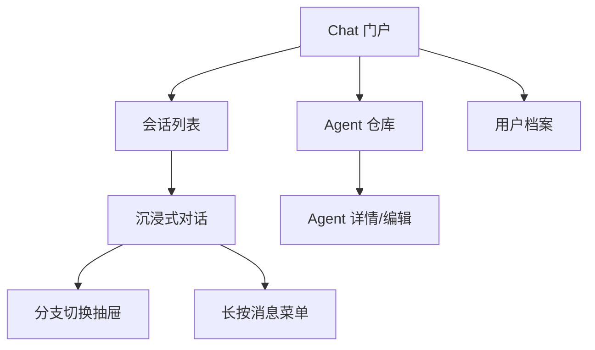

# 移动端 LLM Chat 移植技术规格 (RFC)

## 1. 概述

本方案旨在将 PC 端 `llm-chat` 工具移植到移动端。核心思路是**“分工有序，渐进移植”**：优先打通核心会话流程，非核心功能（如渲染器、Token 计算、高级配置）初期采用占位符或简化实现，待主流程稳定后再逐步对齐。

**核心原则**：

- **交互体验优先 (UX First)**：键盘避让、滚动容器联动、手势交互是移动端的第一优先级。如果输入体验不佳，逻辑对齐将毫无意义。
- **会话与 Agent 解耦**：初期以“纯会话模式”为起点，完全跳过 Agent 逻辑，专注于消息流与持久化，待核心链路稳定后再接入 Agent 体系。
- **渐进式打通**：以“会话生命周期”为第一核心，先实现消息收发、持久化与丝滑的输入体验，再补全高级功能。
- **逻辑分层对齐**：数据模型（Types）全量一致，业务逻辑（Core）按需迁移。
- **模块解耦**：渲染器和 Token 计算作为**独立工具 (Tools)** 存在，拥有专属的工具页面进行独立开发与测试，保持与 PC 端一致的目录架构。

## 2. 架构设计

### 2.1 数据模型对齐

移动端将全量复用 PC 端的 TypeScript 定义（`src/tools/llm-chat/types/`），确保双端数据格式完全一致：

| 核心类型          | 用途       | 关键字段说明                                                                |
| :---------------- | :--------- | :-------------------------------------------------------------------------- |
| `ChatAgent`       | 智能体档案 | `presetMessages`, `assets`, `interactionConfig`, `regexConfig`              |
| `ChatSession`     | 会话树     | `nodes` (Record), `activeLeafId`, `stats`                                   |
| `ChatMessageNode` | 消息节点   | `role`, `content`, `injectionStrategy` (深度/锚点注入), `metadata` (含快照) |
| `UserProfile`     | 用户档案   | `displayName`, `icon`, `regexConfig`, `richTextStyleOptions`                |

### 2.2 核心逻辑库 (Core & Utils)

以下核心模块将从 PC 端直接移植，并保持逻辑一致：

| 模块                | 职责     | 移植要点                                                                          |
| :------------------ | :------- | :-------------------------------------------------------------------------------- |
| `BranchNavigator`   | 分支管理 | 负责 `activePath` 计算，管理 `activeLeafId` 的切换逻辑。                          |
| `NodeManager`       | 节点操作 | 负责消息树的 CRUD，支持分支创建与节点启用/禁用。                                  |
| `MacroProcessor`    | 宏引擎   | 依赖 `MacroContext`，支持 `{{date}}`, `{{agent.name}}`, `{{user.name}}` 等。      |
| `chatRegexUtils`    | 正则管道 | 包含 `resolveRawRules`, `applyRegexRules`。支持按角色和深度过滤规则。             |
| `agentAssetUtils`   | 资产解析 | **核心**：需移植 `initAgentAssetCache` 预热逻辑，支持 `agent-asset://` 同步解析。 |
| `useResolvedAvatar` | 头像解析 | 支持 Emoji、URL 及 AppData 文件名自动识别与回退逻辑。                             |

### 2.3 上下文构建管道 (Context Pipeline)

移动端必须严格遵循 PC 端的上下文处理流程（`src/tools/llm-chat/core/context-processors/`）：

1.  **`injection-assembler`**：根据 `depthConfig` 或 `anchorTarget` 将预设消息注入到历史记录的特定深度。
2.  **`regex-processor`**：在发送前应用“请求级”正则规则。
3.  **`token-limiter`**：基于模型预算进行截断，支持“保留开头”策略以维持系统提示词有效性。

### 2.4 状态管理 (Stores)

| Store              | 职责       | 接口对齐                                                |
| :----------------- | :--------- | :------------------------------------------------------ |
| `agentStore`       | 智能体管理 | 需支持 `currentAgentId` 记忆及资产列表管理。            |
| `llmChatStore`     | 会话管理   | 需对齐 `currentActivePath` 计算属性，支持流式状态跟踪。 |
| `userPersonaStore` | 画像管理   | 维护全局 `globalProfileId`，支持画像切换。              |

## 3. UI 扁平化方案

### 3.1 导航结构

PC 端的侧边栏嵌套布局在移动端将被拆分为独立的平级视图，通过 **门户首页** 统一入口：

### 3.2 视图定义

| 视图文件           | 对应 PC 端组件             | 移动端适配要点                                 |
| :----------------- | :------------------------- | :--------------------------------------------- |
| `ChatHome.vue`     | 无（门户页）               | 三个大卡片入口，展示最近会话和常用 Agent。     |
| `SessionList.vue`  | `SessionsSidebar`          | 线性列表，支持侧滑删除、搜索。                 |
| `ChatView.vue`     | `ChatArea` + `MessageList` | 线性消息流，支持下拉加载、**软键盘弹出避让**。 |
| `AgentLibrary.vue` | `AgentsSidebar`            | 宫格展示，支持 Agent 搜索与快捷创建。          |
| `UserPersona.vue`  | `EditUserProfileDialog`    | 独立页面，管理用户头像与别名。                 |

### 3.3 核心渲染组件与解耦工具

| 组件/模块         | 移动端策略                                                                 | 对应独立工具路径                       |
| :---------------- | :------------------------------------------------------------------------- | :------------------------------------- |
| `MessageContent`  | 初期仅支持 `v-text` 或简易 Markdown，后期集成独立工具 `RichTextRenderer`。 | `mobile/src/tools/rich-text-renderer/` |
| `TokenCalculator` | 初期仅展示字符数，后期集成独立工具 `TokenCalculator`。                     | `mobile/src/tools/token-calculator/`   |
| `BranchSelector`  | 改为底部抽屉 `BranchDrawer`，支持点击切换路径。                            | -                                      |
| `ChatInput`       | 集成基础文本输入，附件与高级参数初期占位。                                 | -                                      |

## 4. 实施步骤

### 第一阶段：交互框架与纯会话模式 (UX & Pure Chat)

1.  **交互基建**：集成 `useKeyboardAvoidance`，确保 `ChatView` 中的输入框与消息列表在键盘弹出时能完美避让且滚动位置正确。
2.  **数据基座**：全量同步 `types/`，建立 `llmChatStore` 的基础版本（仅处理 `ChatSession` 和 `ChatMessageNode`）。
3.  **路由骨架**：配置 `registry.ts`，建立门户页 (`ChatHome`) 与对话页 (`ChatView`)。
4.  **极简对话流 (无 Agent)**：
    - 实现 `ChatView.vue` 的“避让式”布局。
    - 实现极简 `MessageBubble.vue` (直接显示文本)。
    - 实现 `ChatInput.vue` 基础版，重点调试软键盘弹出时的 UI 稳定性。
    - 打通 `useChatExecutor` 基础逻辑，直接调用 LLM 服务而不应用 Agent 预设或宏。
5.  **功能占位**：非核心视图（Agent 编辑、画像、设置）先用 TODO 占位，维持导航链路。

### 第二阶段：独立工具移植 (Independent Tools)

1.  **渲染器工具**：在 `mobile/src/tools/rich-text-renderer/` 下建立独立工具，移植 PC 端渲染逻辑并提供移动端适配的 `RichTextRenderer.vue`。
2.  **Token 工具**：在 `mobile/src/tools/token-calculator/` 下建立独立工具，移植 PC 端 Token 计算逻辑及门面页面。
3.  **模块集成**：待独立工具稳定后，将其组件集成回 `llm-chat` 的对话视图。

### 第三阶段：Agent 与画像管理 (Identity & Profile)

1.  **Agent 仓库**：实现 `AgentLibrary.vue`，支持从预设导入。
2.  **画像切换**：实现 `userPersonaStore`，支持基础的用户头像与别名设置。
3.  **资产支持**：移植 `agentAssetUtils`，支持 `agent-asset://` 协议。

### 第四阶段：高级管道对齐 (Logic Parity)

1.  **分支管理**：移植 `BranchNavigator` 和 `NodeManager`，实现 `BranchDrawer`。
2.  **逻辑补完**：逐步移植 `MacroProcessor` (宏引擎) 和 `chatRegexUtils` (正则管道)。

### 第五阶段：交互与性能优化 (UX Polish)

1.  **多语言支持**：同步 `locales`，确保 i18n 完备。
2.  **性能调优**：消息列表虚拟滚动，图片懒加载。
3.  **服务化对齐**：实现 `llmChat.registry.ts` 接口，支持 Agent 脚本控制输入。

## 5. 技术约束与细节

- **渲染性能**：PC 端的“背景切片” (`background-blocks`) 在移动端暂不实现，优先观察原生 `backdrop-filter` 性能。
- **存储**：使用 Tauri 移动端的 `appDataDir`。
- **资产协议**：`agent-asset://` 解析必须在 `initAgentAssetCache` 完成后进行。
- **UI 框架**：使用 `@varlet/ui`，保持 Material Design 3 风格。

## 6. 验收标准

- [ ] 数据模型与 PC 端完全一致，可互相导入导出。
- [ ] Agent 开场白宏解析正确，资产图片同步显示。
- [ ] 线性对话流支持分支切换（底部抽屉）。
- [ ] 消息渲染支持推理块、双语显示、附件预览。
- [ ] 移动端专属交互（长按菜单、底部抽屉）体验流畅。

---

**文档版本**：v1.1  
**更新记录**：v1.1 (2026-01-09) - 增补上下文管道、资产缓存预热及 UI 渲染层细节。  
**起草人**：咕咕 (Kilo)  
**状态**：待评审
