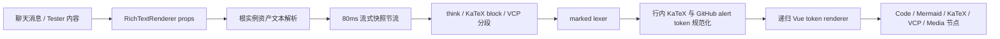

# 移动端 RichTextRenderer — 架构与边界

> **文档状态**：Implementing
> **最后更新**：2026-07-27
> **对应路径**：`mobile/src/tools/rich-text-renderer/`

## 1. 目标与范围

`rich-text-renderer` 是移动端角色聊天和独立测试页共用的安全 Markdown 呈现工具。它面向窄屏 Tauri WebView 的流式 LLM 输出，优先保证：

- 常用 Markdown、代码块、表格、KaTeX、Mermaid、思考块、只读 VCP 块与 GitHub 风格提示块可稳定显示；
- 流式中间更新不会按每个网络 chunk 重建完整树；
- 当前消息拥有的 `asset://<assetId>` 媒体仅经受控 `MediaItem` resolver 打开；
- 未受信任 HTML、链接协议和桌面专属交互不扩大移动端执行面。

它不是桌面 AST/Patch 引擎的逐文件副本。桌面 AST、节点复用、Worker tokenizer 和 Patch 管线只在移动端真实性能证据证明必要时，按独立阶段迁移。

## 2. 目录与职责

```text
rich-text-renderer/
├── rich-text-renderer.registry.ts  # 工具注册和路由入口
├── RichTextRenderer.vue            # 流式调度、内容分段、Markdown token 呈现
├── components/
│   ├── CodeBlock.vue               # 复制、自动换行和窄屏横向滚动
│   ├── KatexRenderer.vue            # KaTeX（trust:false）
│   ├── MermaidDiagram.vue           # 严格模式 SVG 渲染与清洗
│   ├── ThinkBlock.vue               # <think>/<guguthink> 折叠块
│   ├── VcpBlock.vue                 # 只读 VCP 协议块
│   ├── AlertBlock.vue               # GitHub NOTE/TIP/IMPORTANT/WARNING/CAUTION
│   └── RichTextMediaNode.vue        # 受管媒体入口
├── views/TesterView.vue             # 预设、流式模拟、帘幕和调试页
├── presets/test-cases.ts            # 与桌面共享的测试预设入口
└── __tests__/                       # Web 层行为与安全边界测试
```

## 3. 渲染数据流



1. **根实例资产解析**：仅非递归实例可调用 `resolveAsset`，避免子节点重复改写 URL。
2. **流式节流**：首内容、清空内容与完成态立即刷新；仅连续 generating 内容最多每 80ms 更新一次。组件卸载会清理挂起 timer。
3. **结构化分段**：思考标签、块级 KaTeX 与 VCP 协议先从普通 Markdown 中切出；流式未闭合的 think/VCP 块保持可见，完成态未闭合 VCP 不伪装成结构化块。
4. **Markdown token 规范化**：`marked` 负责基础 Markdown token；行内 KaTeX 与完整 GitHub 提示标记会转换为专有 token。提示块只匹配 blockquote 首行完整的 `[!NOTE]`、`[!TIP]`、`[!IMPORTANT]`、`[!WARNING]`、`[!CAUTION]`，近似文本仍是普通引用。
5. **递归呈现**：子 token 通过同一组件的 `tokens` prop 递归渲染，不再次进行全文资产替换或流式定时调度。

## 4. 安全与媒体边界

- 原始 HTML token 只以 `.md-html` 字面文本显示；禁止恢复 `v-html`。若未来需要 HTML，必须先建设可审计白名单或沙箱。
- 可点击链接仅允许锚点、`http:`、`https:` 与 `mailto:`，并带 `target="_blank"` 与 `rel="noopener noreferrer"`；其他协议显示为非交互文本。
- 普通 Markdown 图片保留原始来源或调用方 `resolveAsset` 的转换结果，不按协议、主机名或地址段限制可显示内容。本地回环与私网 HTTP 地址可能承载 VCP 表情包等正常集成资源；访问控制由调用方、服务鉴权、CSP 与 Tauri capability 负责。
- Mermaid 固定 `securityLevel: "strict"`，渲染产物去除事件属性和非片段链接；失败时保留原始代码。
- `asset://` 不从模型文本自行探测。聊天调用方可将 URI 映射到**该消息附件**中的 `MediaItem` 以启用受管媒体预览；未映射来源仍保持普通图片回退，资产归属不作为富文本内容的显示白名单。
- `AlertBlock` 使用移动端 Material/AIO Hub 主题 token；提示块正文仍走相同安全 Markdown 分支，不解释 HTML 或脚本。

## 5. 流式与原生运行态

渲染器只消费 `content` 与 `isStreaming`，不直接读取 SSE 或 Tauri HTTP 插件。移动端 LLM 传输由 `llm-api` 的原生 reqwest 拉取式分块桥接逐块输入共享 SSE 解码器，避免 Android WebView 的插件响应流在完成时批量交付。

已验证的 Android AVD 运行态（`Medium_Phone_API_36`，SDK 36，x86_64）包括：

- RichText 测试页的代码、Mermaid、长无空格代码、流式自动贴底、停止和 keep-alive 路由清理；
- 正式聊天 generating 状态下首个 Markdown heading 的挂载；
- 正式聊天中的 fenced code、行内 KaTeX、GitHub `TIP`、原始 HTML 字面回退与受管图片预览。

AVD 不是 Android 真机或 iOS 发布门禁；真实手势、内存释放、长消息性能、原生全屏/方向和 iOS 仍待独立验收。

## 6. 当前不迁移的桌面能力

以下能力不因“桌面已有”而自动进入移动端：

- 完整 AST/Patch 更新、稳定区/待定区复用和 Worker tokenizer；
- CodeMirror、桌面代码高亮配置、导出、缩放和桌面媒体播放器；
- HTML 预览、内联样式隔离、动作按钮、会话变量执行和任何模型文本驱动的交互执行；
- 自动探测或跨消息访问受管资产。

后续是否迁移由 `docs/Plan/rich-text-renderer-migration-plan.md` 的平台验证和性能数据决定。

## 7. 验证入口

- Web 层：`mobile/src/tools/rich-text-renderer/__tests__/RichTextRenderer.test.ts` 以及各节点单测；其中共享桌面预设逐一挂载并检查不会生成 `<script>` / `<style>` DOM，只作为安全回退与不崩溃基线，不能替代节点交互对齐；
- 移动端构建：`cd mobile && bun run build`；
- Android 真实 WebView：`tests/mobile-android-e2e/run.ts --preset rich-text-media --avd Medium_Phone_API_36 --apk <apk>`；
- 施工计划：[`docs/Plan/rich-text-renderer-migration-plan.md`](./docs/Plan/rich-text-renderer-migration-plan.md)。
